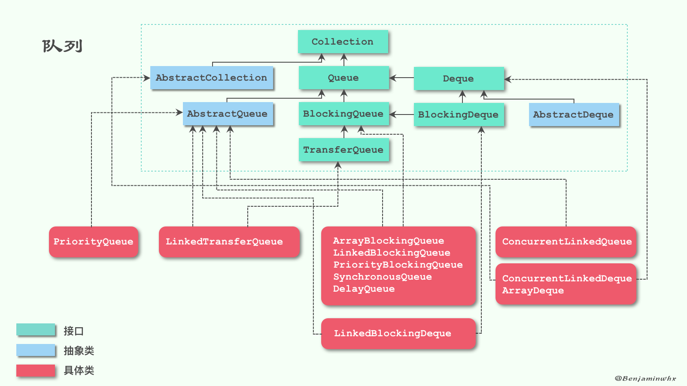
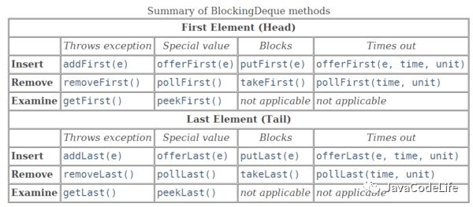
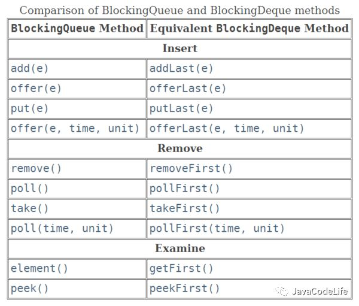
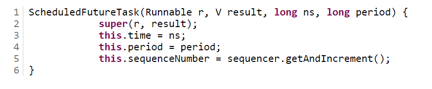
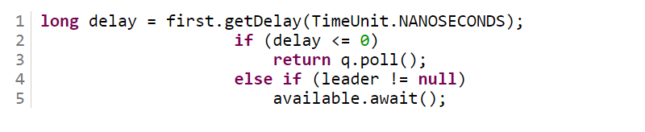
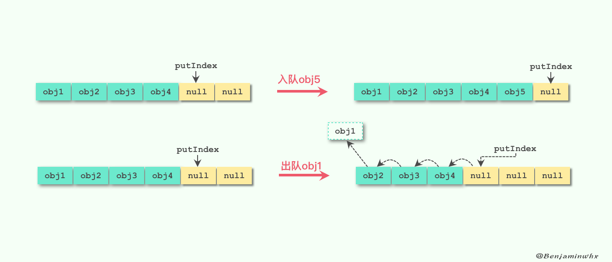
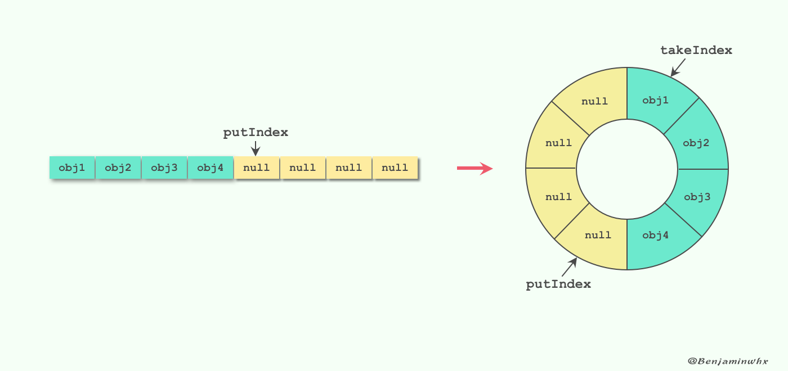
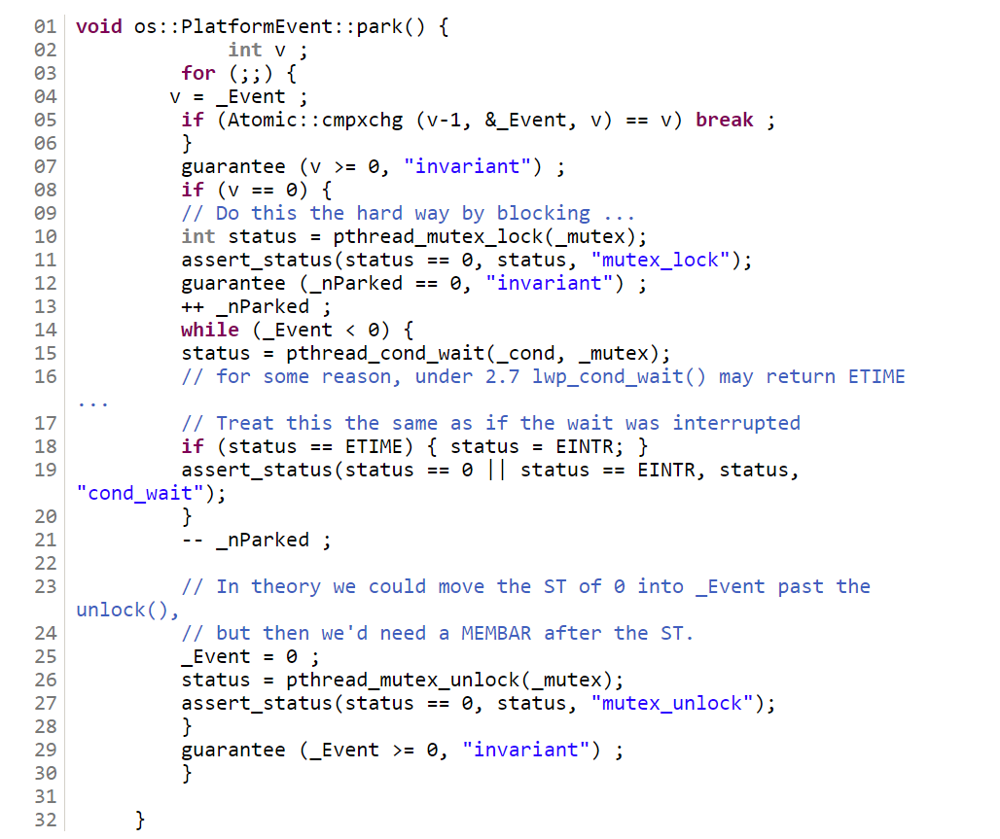
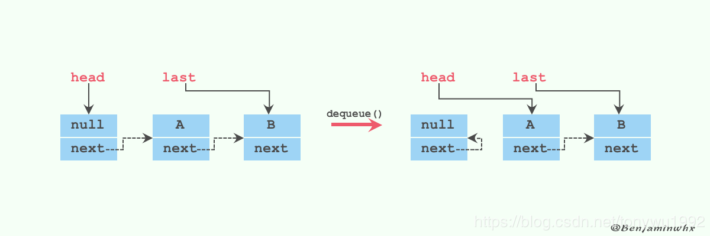
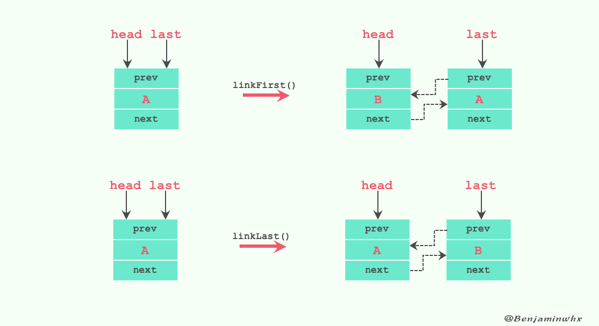

[TOC]
# 1. BlockingQueue简介
1. 最常用的"生产者-消费者"问题中，队列通常被视作线程间操作的**数据容器**，

2. 这样，可以对各个模块的业务功能进行解耦，生产者将“生产”出来的数据放置在数据容器中，而消费者仅仅只需要在“数据容器”中进行获取数据即可，

3. 这样生产者线程和消费者线程就能够进行解耦，只专注于自己的业务功能即可。

4. 阻塞队列（BlockingQueue）被广泛使用在“生产者-消费者”问题中，其原因是BlockingQueue提供了**可阻塞的插入和移除的方法**。

5. **当队列容器已满，生产者线程会被阻塞，直到队列未满；当队列容器为空时，消费者线程会被阻塞，直至队列非空时为止。**

类图：



# 2. 基本操作
BlockingQueue继承于Queue接口，因此，对数据元素的**基本操作**有：
>插入元素

1. add(E e) ：往队列插入数据，当队列满时，插入元素时会抛出IllegalStateException异常；

2. offer(E e)：当往队列插入数据时，插入成功返回true，否则则返回false。当队列满时不会抛出异常；

>删除元素

1. remove()：从队列中删除数据，成功则返回true，否则为false

2. poll()：删除数据，当队列为空时，返回null；

>查看元素

1. element()：获取队头元素，如果队列为空时则抛出NoSuchElementException异常；

2. peek()：获取队头元素，如果队列为空则抛出NoSuchElementException异常;

BlockingQueue具有的**特殊操作**：

>插入元素

1. put(E e)：当阻塞队列容量已经满时，往阻塞队列插入数据的线程会被阻塞，直至阻塞队列已经有空余的容量可供使用；

2. offer(E e, long timeout, TimeUnit unit)：若阻塞队列已经满时，同样会阻塞插入数据的线程，直至阻塞队列已经有空余的地方，与put方法不同的是，该方法会有一个超时时间，若超过当前给定的超时时间，插入数据的线程会退出；

>删除元素

1. take()：当阻塞队列为空时，获取队头数据的线程会被阻塞；

2. poll(long timeout, TimeUnit unit)：当阻塞队列为空时，获取数据的线程会被阻塞，另外，如果被阻塞的线程超过了给定的时长，该线程会退出

方法总结如下：


| 方法\处理方式 | 抛出异常 | 返回特殊值 | 一直阻塞 | 超时退出 |
| --- | --- | --- | --- | --- |
| 插入方法 | add(e) | offer(e) |put(e) |offer(e,time,unit) |
| 移除方法 | remove() | poll()| take()| poll(time,unit) |   
| 检查方法 | element() | peek() | 不可用 |不可用  |

* 抛出异常：是指当阻塞队列满时候，再往队列里插入元素，会抛出`IllegalStateException(“Queue full”)`异常。当队列为空时，从队列里获取元素时会抛出`NoSuchElementException`异常 。

* 返回特殊值：插入方法会返回是否成功，成功则返回true。移除方法，则是从队列里拿出一个元素，如果没有则返回null

* 一直阻塞：当阻塞队列满时，如果生产者线程往队列里put元素，队列会一直阻塞生产者线程，直到拿到数据，或者响应中断退出。当队列空时，消费者线程试图从队列里take元素，队列也会阻塞消费者线程，直到队列可用。

* 超时退出：当阻塞队列满时，队列会阻塞生产者线程一段时间，如果超过一定的时间，生产者线程就会退出。

# 3. 常用的BlockingQueue

JDK7提供了7个阻塞队列。分别是

* ArrayBlockingQueue ：一个由数组结构组成的有界阻塞队列。

* LinkedBlockingQueue ：一个由链表结构组成的有界阻塞队列。

* PriorityBlockingQueue ：一个支持优先级排序的无界阻塞队列。

* DelayQueue：一个使用优先级队列实现的无界阻塞队列。

* SynchronousQueue：一个不存储元素的阻塞队列。

* LinkedTransferQueue：一个由链表结构组成的无界阻塞队列。

* LinkedBlockingDeque：一个由链表结构组成的双向阻塞队列。

下面对这几种常见的阻塞队列进行说明：

> 1. ArrayBlockingQueue

* **ArrayBlockingQueue是由数组实现的有界阻塞队列**。

* 该队列命令元素FIFO（先进先出）。因此，队头元素时队列中存在时间最长的数据元素，而队尾数据则是当前队列最新的数据元素。

* ArrayBlockingQueue可作为“**有界数据缓冲区**”，生产者插入数据到队列容器中，并由消费者提取。**ArrayBlockingQueue一旦创建，容量不能改变。**

* 当队列容量满时，尝试将元素放入队列将导致操作阻塞;尝试从一个空队列中取一个元素也会同样阻塞。

* ArrayBlockingQueue默认情况下**不能保证线程访问队列的公平性**，

* 所谓公平性是指严格按照线程等待的绝对时间顺序，即最先等待的线程能够最先访问到ArrayBlockingQueue。而非公平性则是指访问ArrayBlockingQueue的顺序不是遵守严格的时间顺序，有可能存在，一旦ArrayBlockingQueue可以被访问时，长时间阻塞的线程依然无法访问到ArrayBlockingQueue。

* 如果保证公平性，通常会降低吞吐量。如果需要获得公平性的ArrayBlockingQueue，可采用如下代码：
```java
private static ArrayBlockingQueue<Integer> blockingQueue 
              = new ArrayBlockingQueue<Integer>(10, true);
```
访问者的公平性是使用可重入锁实现的，代码如下：
```java
public ArrayBlockingQueue(int capacity, boolean fair) {
        if (capacity <= 0)
            throw new IllegalArgumentException();
        this.items = new Object[capacity];
        lock = new ReentrantLock(fair);
        notEmpty = lock.newCondition();
        notFull =  lock.newCondition();
    }
```

>2. LinkedBlockingQueue

* LinkedBlockingQueue是用链表实现的有界阻塞队列，同样满足FIFO的特性，

* 与ArrayBlockingQueue相比起来具有更高的吞吐量，**容量可自增**。

* 为了防止LinkedBlockingQueue容量迅速增，损耗大量内存。通常在创建LinkedBlockingQueue对象时，会指定其大小，如果未指定，容量等于Integer.MAX_VALUE

>3. PriorityBlockingQueue

* PriorityBlockingQueue是一个支持优先级的无界阻塞队列。

* 默认情况下元素采用自然顺序进行排序，

* 也可以通过自定义类实现compareTo()方法来指定元素排序规则，或者初始化时通过构造器参数Comparator来指定排序规则。


>4. SynchronousQueue

* SynchronousQueue每个插入操作必须等待另一个线程进行相应的删除操作，

* 因此，SynchronousQueue实际上没有存储任何数据元素，因为只有线程在删除数据时，其他线程才能插入数据，

* 同样的，如果当前有线程在插入数据时，线程才能删除数据。

* SynchronousQueue也可以通过构造器参数来为其指定公平性。

* SynchronousQueue可以看成是一个传球手，负责把生产者线程处理的数据直接传递给消费者线程。

* 队列本身并不存储任何元素，非常适合于传递性场景,比如在一个线程中使用的数据，传递给另外一个线程使用，SynchronousQueue的吞吐量高于LinkedBlockingQueue 和 ArrayBlockingQueue。

>5. LinkedTransferQueue

LinkedTransferQueue是一个由链表结构构成的无界阻塞队列，由于该队列实现了TransferQueue接口，与其他阻塞队列相比主要有以下不同的方法：

1. **transfer(E e)**

如果当前有线程（消费者）正在调用take()方法或者可延时的poll()方法进行消费数据时，生产者线程可以调用transfer方法将数据传递给消费者线程。

如果当前没有消费者线程的话，生产者线程就会将数据**插入到队尾，直到有消费者能够进行消费才能退出**；

transfer方法的关键代码如下：


第一行代码是试图把存放当前元素的s节点作为tail节点。

第二行代码是让CPU自旋等待消费者消费元素。因为自旋会消耗CPU，所以自旋一定的次数后使用Thread.yield()方法来暂停当前正在执行的线程，并执行其他线程。

2. **tryTransfer(E e)**

如果当前有消费者线程（调用take方法或者具有超时特性的poll方法）正在消费数据的话，该方法可以将数据立即传送给消费者线程，

如果当前没有消费者线程消费数据的话，就立即返回false。

因此，与transfer方法相比，transfer方法是必须等到有消费者线程消费数据时，生产者线程才能够返回。

而tryTransfer方法能够立即返回结果退出。

3. **tryTransfer(E e,long timeout,imeUnit unit)**

与**transfer**基本功能一样，只是增加了超时特性，如果数据才规定的超时时间内没有消费者进行消费的话，就返回false。

>6. LinkedBlockingDeque

LinkedBlockingDeque是基于链表数据结构的**有界阻塞双端队列**，

如果在创建对象时未指定大小时，其默认大小为Integer.MAX_VALUE。

与LinkedBlockingQueue相比，主要的不同点在于，**LinkedBlockingDeque具有双端队列的特性。**

LinkedBlockingDeque基本操作如下图所示：


如上图所示，LinkedBlockingDeque的基本操作可以分为四种类型：

1. 特殊情况，抛出异常；

2. 特殊情况，返回特殊值如null或者false；

3. 当线程不满足操作条件时，线程会被阻塞直至条件满足；

4. 操作具有超时特性。

LinkedBlockingDeque实现了BlockingDueue接口

而LinkedBlockingQueue实现的是BlockingQueue，这两个接口的等价方法如下图所示：



从上图可以看出，两个接口的功能是可以等价使用的，比如BlockingQueue的add方法和BlockingDeque的addLast方法的功能是一样的。

>7. DelayQueue

DelayQueue是一个支持延时获取元素的**无界阻塞队列**，队列使用PriorityQueue来实现。队列中的元素必须实现Delayed接口，在创建元素时可以指定多久才能从队列中获取当前元素。只有在延迟期满时才能从队列中提取元素。

如果当前所有的数据都还没有达到创建时所指定的延时期，则队列没有队头，并且线程通过poll等方法获取数据元素则返回null。

所谓数据延时期满时，则是通过Delayed接口的`getDelay(TimeUnit.NANOSECONDS)`来进行判定，如果该方法返回的是小于等于0则说明该数据元素的延时期已满。

我们可以将DelayQueue运用在以下应用场景：

* 缓存系统的设计：可以用DelayQueue保存缓存元素的有效期，使用一个线程循环查询DelayQueue，一旦能从DelayQueue中获取元素时，表示缓存有效期到了。

* 定时任务调度。使用DelayQueue保存当天将会执行的任务和执行时间，一旦从DelayQueue中获取到任务就开始执行，从比如TimerQueue就是使用DelayQueue实现的。

**队列中的元素必须实现Delayed接口，如何实现Delayed接口：**
我们可以参考ScheduledThreadPoolExecutor里ScheduledFutureTask类。这个类实现了Delayed接口。首先：在对象创建的时候，使用time记录前对象什么时候可以使用，代码如下：

然后使用getDelay可以查询当前元素还需要延时多久，代码如下：

```java
public long getDelay(TimeUnit unit) {
        return unit.convert(time - now(), TimeUnit.NANOSECONDS);
}
```
通过构造函数可以看出延迟时间参数ns的单位是纳秒，自己设计的时候最好使用纳秒，

因为getDelay时可以指定任意单位，一旦以纳秒作为单位，而延时的时间又精确不到纳秒就麻烦了。

使用时请注意当time小于当前时间时，getDelay会返回负数。

**队列使用PriorityQueue来实现,所以队列中的Delayed必须实现compareTo来指定元素的顺序。** 比如让延时时间最长的放在队列的末尾。实现代码如下：


## 如何实现延时队列：

延时队列的实现很简单，但消费者从队列中获取元素时，如果元素没有达到延时时间，就阻塞当前线程。



# 4. 阻塞队列的实现原理

如果队列是空的，消费者会一直等待，当生产者添加元素时候，消费者是如何知道当前队列有元素的呢？

阻塞队列最核心的功能是，能够可阻塞式的插入和删除队列元素。

当前队列为空时，会阻塞消费数据的线程，直至队列非空时，通知被阻塞的线程；

当队列满时，会阻塞插入数据的线程，直至队列未满时，通知插入数据的线程（生产者线程）。

那么，多线程中消息通知机制最常用的是lock的condition机制（**通知模式**）。

**所谓通知模式，就是当生产者往满的队列里添加元素时会阻塞住生产者，当消费者消费了一个队列中的元素后，会通知生产者当前队列可用。**


# ArrayBlockingQueue的实现原理
内部使用ReentrantLock来保证线程安全。

ArrayBlockingQueue支持对生产者线程和消费者线程进行公平的调度，默认情况下是不保证公平性的。

公平性通常会降低吞吐量，但是减少了可变性和避免了线程饥饿问题。

## 数据结构
通常，队列的实现方式有**数组**和**链表**两种方式。

对于数组这种实现方式来说，

我们可以通过维护一个队尾指针，使得在入队的时候可以在O(1)的时间内完成；

但是对于出队操作，在删除队头元素之后，必须将数组中的所有元素都往前移动一个位置，这个操作的复杂度达到了O(n)，效果并不是很好。如下图所示：



为了解决这个问题，我们可以使用另外一种逻辑结构来处理数组中各个位置之间的关系。

假设现在我们有一个数组A[1…n]，我们可以把它想象成一个环型结构，即A[n]之后是A[1]。

如下图所示：我们可以使用两个指针，分别维护队头和队尾两个位置，使入队和出队操作都可以在O(1)的时间内完成。

当然，这个环形结构只是逻辑上的结构，实际的物理结构还是一个普通的数组。


* putIndex是插入的位置，因为是数组结构，所以是尾节点。

* takeIndex是出队的位置，所以是头节点

## 属性
```java
//队列的底层结构---数组，用来存放入队的数据
final Object[] items;

//队头指针
int takeIndex;
//队尾指针
int putIndex;

//队列中的元素个数
int count;

final ReentrantLock lock;

//并发时的两种状态
private final Condition notEmpty;
private final Condition notFull;
```
## 构造函数
```java
public ArrayBlockingQueue(int capacity) {
    this(capacity, false);
}

public ArrayBlockingQueue(int capacity, boolean fair) {
    if (capacity <= 0)
        throw new IllegalArgumentException();
    this.items = new Object[capacity];
    lock = new ReentrantLock(fair);
    notEmpty = lock.newCondition();
    notFull =  lock.newCondition();
}

public ArrayBlockingQueue(int capacity, boolean fair,
                          Collection<? extends E> c) {
    this(capacity, fair);

    final ReentrantLock lock = this.lock;
    lock.lock(); // Lock only for visibility, not mutual exclusion
    try {
        int i = 0;
        try {
            for (E e : c) {
                checkNotNull(e);
                items[i++] = e;
            }
        } catch (ArrayIndexOutOfBoundsException ex) {
            throw new IllegalArgumentException();
        }
        count = i;
        putIndex = (i == capacity) ? 0 : i;
    } finally {
        lock.unlock();
    }
}
```
第一个构造函数只需要指定队列大小，默认为非公平锁。

第二个构造函数可以手动制定公平性和队列大小。

第三个构造函数里面使用了ReentrantLock来加锁，然后把传入的集合元素按顺序一个个放入items中。这里加锁目的不是使用它的互斥性，而是让items中的元素对其他线程可见（用的是AQS里的state的volatile可见性）。

## 入队方法
ArrayBlockingQueue 提供了多种入队操作的实现来满足不同情况下的需求，入队操作有如下几种：

* boolean add(E e)：往队列插入数据，当队列满时，插入元素时会抛出IllegalStateException异常；

* void put(E e)：当阻塞队列容量已经满时，往阻塞队列插入数据的线程会被阻塞，直至阻塞队列已经有空余的容量可供使用；

* boolean offer(E e)：当往队列插入数据时，插入成功返回true，否则则返回false。当队列满时不会抛出异常；

* boolean offer(E e, long timeout, TimeUnit unit)：若阻塞队列已经满时，同样会阻塞插入数据的线程，直至阻塞队列已经有空余的地方，与put方法不同的是，该方法会有一个超时时间，若超过当前给定的超时时间，插入数据的线程会退出；

### add(E e)
```java
public boolean add(E e) {
    return super.add(e);
}

//super.add(e)
public boolean add(E e) {
    if (offer(e))
        return true;
    else
        throw new IllegalStateException("Queue full");
}
```
可以看到add方法调用的是父类，也就是AbstractQueue的add方法，它实际上调用的就是offer方法。

### offer(E e)
```java
public boolean offer(E e) {
    checkNotNull(e);
    final ReentrantLock lock = this.lock;
    lock.lock();
    try {
        if (count == items.length)
            return false;
        else {
            enqueue(e);
            return true;
        }
    } finally {
        lock.unlock();
    }
}
```
offer方法在队列满了的时候返回false，否则调用`enqueue`方法插入元素，并返回true。

```java
private void enqueue(E x) {
    final Object[] items = this.items;
    items[putIndex] = x;
    // 圆环的index操作
    if (++putIndex == items.length)
        putIndex = 0;
    count++;
    notEmpty.signal();
}
```
enqueue方法首先把元素放在items的putIndex位置，

**接着判断在putIndex+1等于队列的长度时把putIndex设置为0，**

也就是上面提到的圆环的index操作。

最后唤醒等待获取元素的线程。


### offer(E e, long timeout, TimeUnit unit)
offer(E e, long timeout, TimeUnit unit)方法只是在offer(E e)的基础上**增加了超时时间**的概念。
```java
public boolean offer(E e, long timeout, TimeUnit unit)
        throws InterruptedException {

    checkNotNull(e);
    // 把超时时间转换成纳秒
    long nanos = unit.toNanos(timeout);
    final ReentrantLock lock = this.lock;
    // 获取一个可中断的互斥锁
    lock.lockInterruptibly();
    try {
        // while循环的目的是防止在中断后没有到达传入的timeout时间，继续重试
        while (count == items.length) {
            if (nanos <= 0)
                return false;
            // 等待nanos纳秒，返回剩余的等待时间(可被中断)
            nanos = notFull.awaitNanos(nanos);
        }
        enqueue(e);
        return true;
    } finally {
        lock.unlock();
    }
}
```
该方法利用了Condition的awaitNanos方法，等待指定时间，

在返回时，该方法返回了所剩毫微秒数的一个估计值，以等待所提供的 `nanostimeout` 值的时间，如果超时，则返回一个小于等于 0 的值。可以用此值来确定在等待返回但某一等待条件仍不具备的情况下，是否要再次等待，以及再次等待的时间。所以使用while循环是为了防止一次等候的时间不够，直到循环够所需要等待的时间。

但如果等待过程中线程被中断，则停止等待，抛出interruptedexception，并且清除当前线程的已中断状态。

### put(E e)
```java
public void put(E e) throws InterruptedException {
    checkNotNull(e);
    final ReentrantLock lock = this.lock;
    lock.lockInterruptibly();
    try {
        while (count == items.length)
            notFull.await();
        enqueue(e);
    } finally {
        lock.unlock();
    }
}
```
put方法在count等于items长度时，一直等待，直到被其他线程唤醒。唤醒后调用enqueue方法放入队列。

在往队列中插入一个元素时，如果当前队列已满，则调用`awatit()`方法将线程移入到notFull等待队列中。：
```java
 public final void await() throws InterruptedException {
            if (Thread.interrupted())
                throw new InterruptedException();
            Node node = addConditionWaiter();
            long savedState = fullyRelease(node);
            int interruptMode = 0;
            while (!isOnSyncQueue(node)) {
                LockSupport.park(this);
                if ((interruptMode = checkInterruptWhileWaiting(node)) != 0)
                    break;
            }
            if (acquireQueued(node, savedState) && interruptMode != THROW_IE)
                interruptMode = REINTERRUPT;
            if (node.nextWaiter != null) // clean up if cancelled
                unlinkCancelledWaiters();
            if (interruptMode != 0)
                reportInterruptAfterWait(interruptMode);
        }
```
阻塞生产者主要通过`LockSupport.park(this);`来实现。

继续进入源码，发现调用setBlocker先保存下将要阻塞的线程，然后调用`unsafe.park`阻塞当前线程。

```java  
public static void park(Object blocker) {
        Thread t = Thread.currentThread();
        setBlocker(t, blocker);
        unsafe.park(false, 0L);
        setBlocker(t, null);
    }
```

unsafe.park是个native方法(非Java语言实现的方法)，代码如下：
```java
public native void park(boolean isAbsolute, long time);
```
park这个方法会阻塞当前线程，只有以下四种情况中的一种发生时，该方法才会返回。

* 与park对应的unpark执行或已经执行时。注意：已经执行是指unpark先执行，然后再执行的park。

* 线程被中断时。

* 如果参数中的time不是零，等待了指定的毫秒数时。

* 发生异常现象时。这些异常事先无法确定。

我们继续看一下JVM是如何实现park方法的，park在不同的操作系统使用不同的方式实现，在linux下是使用的是系统方法pthread_cond_wait实现。实现代码在JVM源码路径src/os/linux/vm/os_linux.cpp里的 os::PlatformEvent::park方法，代码如下：


pthread_cond_wait是一个多线程的条件变量函数，cond是condition的缩写，

字面意思可以理解为线程在等待一个条件发生，这个条件是一个全局变量。

这个方法接收两个参数，一个共享变量_cond，一个互斥量_mutex。

而unpark方法在linux下是使用pthread_cond_signal实现的。

park 在windows下则是使用WaitForSingleObject实现的。

当队列满时，生产者往阻塞队列里插入一个元素，生产者线程会进入WAITING (parking)状态。我们可以使用jstack dump阻塞的生产者线程看到这点：

```log
"main" prio=5 tid=0x00007fc83c000000 nid=0x10164e000 waiting on condition [0x000000010164d000]
   java.lang.Thread.State: WAITING (parking)
        at sun.misc.Unsafe.park(Native Method)
        - parking to wait for  <0x0000000140559fe8> (a java.util.concurrent.locks.AbstractQueuedSynchronizer$ConditionObject)
        at java.util.concurrent.locks.LockSupport.park(LockSupport.java:186)
        at java.util.concurrent.locks.AbstractQueuedSynchronizer$ConditionObject.await(AbstractQueuedSynchronizer.java:2043)
        at java.util.concurrent.ArrayBlockingQueue.put(ArrayBlockingQueue.java:324)
        at blockingqueue.ArrayBlockingQueueTest.main(ArrayBlockingQueueTest.java:11)
```
## 出队方法

入队列的方法说完后，我们来说说出队列的方法。ArrayBlockingQueue提供了多种出队操作的实现来满足不同情况下的需求，如下：

* E poll(): 删除数据，当队列为空时，返回null；

* E poll(long timeout, TimeUnit unit): 当阻塞队列为空时，获取数据的线程会被阻塞，另外，如果被阻塞的线程超过了给定的时长，该线程会退出

* E take(): 当阻塞队列为空时，获取队头数据的线程会被阻塞；

### poll()
```java
public E poll() {
    final ReentrantLock lock = this.lock;
    lock.lock();
    try {
        return (count == 0) ? null : dequeue();
    } finally {
        lock.unlock();
    }
}
```
poll方法是非阻塞方法，如果队列没有元素返回null，否则调用dequeue把队首的元素出队列。
```java
private E dequeue() {
    final Object[] items = this.items;
    @SuppressWarnings("unchecked")
    E x = (E) items[takeIndex];
    items[takeIndex] = null;
    if (++takeIndex == items.length)
        takeIndex = 0;
    count--;
    if (itrs != null)
        itrs.elementDequeued();
    notFull.signal();
    return x;
}
```
dequeue会根据takeIndex获取到该位置的元素，并把该位置置为null，

接着利用圆环原理，在takeIndex到达列表长度时设置为0，

最后唤醒等待元素放入队列的线程。

### poll(long timeout, TimeUnit unit)
该方法是poll()的可配置超时等待方法，和上面的offer一样，使用while循环+Condition的awaitNanos来进行等待，等待时间到后执行dequeue获取元素。

```java
public E poll(long timeout, TimeUnit unit) throws InterruptedException {
    long nanos = unit.toNanos(timeout);
    final ReentrantLock lock = this.lock;
    lock.lockInterruptibly();
    try {
        while (count == 0) {
            if (nanos <= 0)
                return null;
            nanos = notEmpty.awaitNanos(nanos);
        }
        return dequeue();
    } finally {
        lock.unlock();
    }
}

```
### take()
```java
public E take() throws InterruptedException {
    final ReentrantLock lock = this.lock;
    lock.lockInterruptibly();
    try {
        while (count == 0)
            notEmpty.await();
        return dequeue();
    } finally {
        lock.unlock();
    }
}
```
### remove(Object o)
我们可以想象一下，队列中删除某一个元素时，是不是要遍历整个数据找到该元素，并把该元素后的所有元素往前移一位，也就是说，该方法的时间复杂度为O(n)。
```java
public boolean remove(Object o) {
    if (o == null) return false;
    final Object[] items = this.items;
    final ReentrantLock lock = this.lock;
    lock.lock();
    try {
        if (count > 0) {
            final int putIndex = this.putIndex;
            int i = takeIndex;
             // 从takeIndex一直遍历到putIndex，直到找到和元素o相同的元素，调用removeAt进行删除
            do {
                if (o.equals(items[i])) {
                    removeAt(i);
                    return true;
                }
                if (++i == items.length)
                    i = 0;
            } while (i != putIndex);
        }
        return false;
    } finally {
        lock.unlock();
    }
}
```
remove方法比较简单，它从takeIndex一直遍历到putIndex，直到找到和元素o相同的元素，调用removeAt进行删除。我们重点来看一下removeAt方法。
```java
void removeAt(final int removeIndex) {
    final Object[] items = this.items;
    if (removeIndex == takeIndex) {
        // removing front item; just advance
        items[takeIndex] = null;
        if (++takeIndex == items.length)
            takeIndex = 0;
        count--;
        if (itrs != null)
            itrs.elementDequeued();
    } else {
        // an "interior" remove

        // slide over all others up through putIndex.
        final int putIndex = this.putIndex;
        for (int i = removeIndex;;) {
            int next = i + 1;
            if (next == items.length)
                next = 0;
            if (next != putIndex) {
                items[i] = items[next];
                i = next;
            } else {
                items[i] = null;
                this.putIndex = i;
                break;
            }
        }
        count--;
        if (itrs != null)
            itrs.removedAt(removeIndex);
    }
    notFull.signal();
}
```

removeAt内部分为两种情况来考虑：

* removeIndex == takeIndex，takeIndex为尾节点，就不需要后面的元素整体往前移了，而只需要把takeIndex的指向下一个元素即可（还记得前面说的ArrayBlockingQueue可以类比为圆环吗）。

* removeIndex != takeIndex，通过putIndex将removeIndex后的元素往前移一位。


## 获取元素方法
### peek()

```java
public E peek() {
    final ReentrantLock lock = this.lock;
    lock.lock();
    try {
        return itemAt(takeIndex); // null when queue is empty
    } finally {
        lock.unlock();
    }
}

final E itemAt(int i) {
    return (E) items[i];
}
```
这里获取元素时上锁是为了避免脏数据的产生。


# LinkedBlockingQueue实现原理

LinkedBlockingQueue是用链表实现的有界阻塞队列，当构造对象时未指定队列大小时，队列默认大小为Integer.MAX_VALUE。

从它的构造方法可以看出：
```java
public LinkedBlockingQueue() {
    // 默认大小为Integer.MAX_VALUE
    this(Integer.MAX_VALUE);
}

public LinkedBlockingQueue(int capacity) {
    if (capacity <= 0) throw new IllegalArgumentException();
    this.capacity = capacity;
    last = head = new Node<E>(null);
}

public LinkedBlockingQueue(Collection<? extends E> c) {
    this(Integer.MAX_VALUE);
    final ReentrantLock putLock = this.putLock;
    putLock.lock();
    try {
        int n = 0;
        for (E e : c) {
            if (e == null)
                throw new NullPointerException();
            if (n == capacity)
                throw new IllegalStateException("Queue full");
            enqueue(new Node<E>(e));
            ++n;
        }
        count.set(n);
    } finally {
        putLock.unlock();
    }
}

```
默认的构造函数和最后一个构造函数创建的队列大小都为Integer.MAX_VALUE，

只有第二个构造函数用户可以指定队列的大小。默认的构造函数也是指定了队列大小（Integer.MAX_VALUE），所以会通过`this()`再调用第二个构造函数来生成队列

**第二个构造函数最后初始化了last和head节点，这个元素为null的节点即是head节点，也是last节点，并不是head和last节点指向这个元素为null的节点。**

如果是指向元素为null的节点，应该写`Node nullNode = new node<E>(null);head.next = nullNode; last.next = nullNode`。

所以说，这个元素为null的节点就是head节点，也是last节点。


LinkedBlockingQueue的主要属性有：
```java
/** The capacity bound, or Integer.MAX_VALUE if none */
//队列长度，不指定默认是Integer.MAX_VALUE
private final int capacity;

/** Current number of elements */
/** 当前阻塞队列中的元素个数 */
private final AtomicInteger count = new AtomicInteger();

/**
 * Head of linked list.
 * Invariant: head.item == null
 */
transient Node<E> head;

/**
 * Tail of linked list.
 * Invariant: last.next == null
 */
private transient Node<E> last;

/** Lock held by take, poll, etc */
//take锁,类型为ReentrantLock
private final ReentrantLock takeLock = new ReentrantLock();

/** Wait queue for waiting takes */
/** notEmpty条件对象，当队列没有数据时用于挂起执行删除的线程 */
private final Condition notEmpty = takeLock.newCondition();

/** Lock held by put, offer, etc */
//put锁,类型为ReentrantLock
private final ReentrantLock putLock = new ReentrantLock();

/** Wait queue for waiting puts */
/** notFull条件对象，当队列数据已满时用于挂起执行添加的线程 */
private final Condition notFull = putLock.newCondition();
```
可以看出与ArrayBlockingQueue主要的区别是，

LinkedBlockingQueue在插入数据和删除数据时分别是由两个不同的lock（takeLock和putLock）来控制线程安全的，

因此，也由这两个lock生成了两个对应的condition（notEmpty和notFull）来实现可阻塞的插入和删除数据。

>为什么ArrayBlockingQueue没有像LinkedBlockingQueue那样用两个锁实现？

>基于数组的阻塞队列实现，在ArrayBlockingQueue内部，维护了一个定长数组，以便缓存队列中的数据对象，这是一个常用的阻塞队列，
除了一个定长数组外，ArrayBlockingQueue内部还保存着两个整形变量，分别标识着队列的头部和尾部在数组中的位置。
ArrayBlockingQueue在生产者放入数据和消费者获取数据，都是共用**同一个锁对象**，由此也意味着两者无法真正并行运行，这点尤其不同于LinkedBlockingQueue；
按照实现原理来分析，ArrayBlockingQueue完全可以采用分离锁，从而实现生产者和消费者操作的完全并行运行。
之所以没这样去做，猜测是因为ArrayBlockingQueue的数据写入和获取操作已经足够轻巧，以至于引入独立的锁机制，除了给代码带来额外的复杂性外，其在性能上完全占不到任何便宜。
ArrayBlockingQueue和LinkedBlockingQueue间还有一个明显的不同之处在于，
ArrayBlockingQueue在new的时候已经分配好了连续的内存空间，而且在插入或删除元素时不会产生或销毁任何额外的对象实例，数组的入队和出队时间复杂度低，不像列表需要额外维护节点对象。所以当入队和出队并发执行时，阻塞时间很短。如果使用双锁的话，会带来额外的设计复杂性。ArrayBlockingQueue 中的参数（takeIndex，putIndex，int count）使用的时int修饰，比如count， 这就导致count++时，可能会有发生并发问题，如果count 改用AtomicInteger 修饰可以使用锁分离， 但是如果将int类型改为AtomicInteger，那么对这些字段的操作本省也是需要加锁的，加之操作比较频繁 也是比较消耗资源的。
而LinkedBlockingQueue则会生成一个额外的Node对象。生成时会占用时间，为了尽量减少这部分时间占比，使用一个读锁一个写锁可以实现并发存取的优化，LinkedBlockingQueue的count就是AtomicInteger类型，它是链表形式的无界队列，只有count需要计算值。

LinkedBlockingQueue 采用了链表的数据结构来实现队列，Node结点的定义为：
```java
static class Node<E> {
    E item;

    /**
     * One of:
     * - the real successor Node
     * - this Node, meaning the successor is head.next
     * - null, meaning there is no successor (this is the last node)
     */
    Node<E> next;

    Node(E x) { item = x; }
}
```

## 入队方法
LinkedBlockingQueue提供了多种入队操作的实现来满足不同情况下的需求，入队操作有如下几种：

* void put(E e): 当阻塞队列容量已经满时，往阻塞队列插入数据的线程会被阻塞，直至阻塞队列已经有空余的容量可供使用；

* boolean offer(E e): 当往队列插入数据时，插入成功返回true，否则则返回false。当队列满时不会抛出异常；

* boolean offer(E e, long timeout, TimeUnit unit): 若阻塞队列已经满时，同样会阻塞插入数据的线程，直至阻塞队列已经有空余的地方，与put方法不同的是，该方法会有一个超时时间，若超过当前给定的超时时间，插入数据的线程会退出；

### put方法源码为:
```java
public void put(E e) throws InterruptedException {
    if (e == null) throw new NullPointerException();
    int c = -1;
    Node<E> node = new Node<E>(e);
    final ReentrantLock putLock = this.putLock;
    final AtomicInteger count = this.count;
    // 获取锁中断
    putLock.lockInterruptibly();
    try {
        //cout为当前阻塞队列中的元素个数
        //判断队列是否已满，如果已满,通知执行添加的线程（即生产线程）挂起,阻塞等待
        while (count.get() == capacity) {
            notFull.await();
        }
        // 把node放入队列中
        enqueue(node);
        c = count.getAndIncrement();
        // 再次判断队列是否有可用空间，如果有唤醒下一个线程进行添加操作
        if (c + 1 < capacity)
            notFull.signal();
    } finally {
        putLock.unlock();
    }
    // c为局部变量，初始值为1，如果队列中有一条数据，唤醒消费线程进行消费，即通知执行删除的线程可以开始take
    if (c == 0)
        signalNotEmpty();
}

```
小结put方法来看，它总共做了以下情况的考虑：

* 队列已满，阻塞等待。

* 队列未满，创建一个node节点放入队列中，如果放完以后队列还有剩余空间，继续唤醒下一个添加线程进行添加。如果放之前队列中没有元素，放完以后要唤醒消费线程进行消费。

入队：
```java
private void enqueue(E x) {

 Node<E> newNode = new Node<E>(x);/* 新建一个Node对象，此对象的数据部分是新元素的指针，next指针为null */
 
 /* 原始代码为： last = last.next = node; */
 last.next = newNode; /* 将目前last节点的next指针指向新对象 */

 last =last.next;/* 将last指针向后移动一个元素，指向新的尾端 */
 }
```


接下来我们看看signalNotEmpty，顺带着看signalNotFull方法。signal的时候要获取到该signal对应的Condition对象的锁才行。

```java
private void signalNotEmpty() {
    final ReentrantLock takeLock = this.takeLock;
    takeLock.lock();
    try {
        notEmpty.signal();
    } finally {
        takeLock.unlock();
    }
}

private void signalNotFull() {
    final ReentrantLock putLock = this.putLock;
    putLock.lock();
    try {
        notFull.signal();
    } finally {
        putLock.unlock();
    }
}

```

### offer(E e)
```java
public boolean offer(E e) {
    if (e == null) throw new NullPointerException();
    final AtomicInteger count = this.count;
    if (count.get() == capacity)
        return false;
    int c = -1;
    Node<E> node = new Node<E>(e);
    final ReentrantLock putLock = this.putLock;
    putLock.lock();
    try {
        // 队列有可用空间，放入node节点，判断放入元素后是否还有可用空间，
        // 如果有，唤醒下一个添加线程进行添加操作。
        //如果没有，则在finally中释放锁，返回c>=0为false
        if (count.get() < capacity) {
            enqueue(node);
            c = count.getAndIncrement();
            if (c + 1 < capacity)
                notFull.signal();
        }
    } finally {
        putLock.unlock();
    }
    if (c == 0)
        signalNotEmpty();
    return c >= 0;
}

```
### offer(E e, long timeout, TimeUnit unit)
```java
public boolean offer(E e, long timeout, TimeUnit unit)
        throws InterruptedException {

    if (e == null) throw new NullPointerException();
    long nanos = unit.toNanos(timeout);
    int c = -1;
    final ReentrantLock putLock = this.putLock;
    final AtomicInteger count = this.count;
    putLock.lockInterruptibly();
    try {
        // 等待超时时间nanos，超时时间到了返回false
        while (count.get() == capacity) {
            if (nanos <= 0)
                return false;
            nanos = notFull.awaitNanos(nanos);
        }
        enqueue(new Node<E>(e));
        c = count.getAndIncrement();
        if (c + 1 < capacity)
            notFull.signal();
    } finally {
        putLock.unlock();
    }
    if (c == 0)
        signalNotEmpty();
    return true;
}

```
该方法只是对offer方法进行了阻塞超时处理，使用了Condition的`awaitNanos`来进行超时等待。
如果当前线程：
* 在进入此方法时已经设置了该线程的中断状态；或者
* 在支持等待和中断线程挂起时，线程被中断，
则抛出 interruptedexception，并且清除当前线程的已中断状态。在第一种情况下，没有指定是否在释放锁之前发生中断测试。

在返回时，该方法返回了所剩毫微秒数的一个估计值，以等待所提供的 nanostimeout 值的时间，如果超时，则返回一个小于等于 0 的值。可以用此值来确定在等待返回但某一等待条件仍不具备的情况下，是否要再次等待，以及再次等待的时间。所以使用while循环是为了防止一次等候的时间不够，直到循环够所需要等待的时间。

但如果等待过程中线程被中断，则停止等待，抛出interruptedexception，并且清除当前线程的已中断状态。

```java
 public final long awaitNanos(long nanosTimeout)
                throws InterruptedException {
            if (Thread.interrupted())
                throw new InterruptedException();
            // We don't check for nanosTimeout <= 0L here, to allow
            // awaitNanos(0) as a way to "yield the lock".
            final long deadline = System.nanoTime() + nanosTimeout;
            long initialNanos = nanosTimeout;
            Node node = addConditionWaiter();
            int savedState = fullyRelease(node);
            int interruptMode = 0;
            while (!isOnSyncQueue(node)) {
                if (nanosTimeout <= 0L) {
                    transferAfterCancelledWait(node);
                    break;
                }
                if (nanosTimeout > SPIN_FOR_TIMEOUT_THRESHOLD)
                    LockSupport.parkNanos(this, nanosTimeout);
                if ((interruptMode = checkInterruptWhileWaiting(node)) != 0)
                    break;
                nanosTimeout = deadline - System.nanoTime();
            }
            if (acquireQueued(node, savedState) && interruptMode != THROW_IE)
                interruptMode = REINTERRUPT;
            if (node.nextWaiter != null)
                unlinkCancelledWaiters();
            if (interruptMode != 0)
                reportInterruptAfterWait(interruptMode);
            long remaining = deadline - System.nanoTime(); // avoid overflow
            return (remaining <= initialNanos) ? remaining : Long.MIN_VALUE;
        }
```


## 出队方法

LinkedBlockingQueue提供了多种出队操作的实现来满足不同情况下的需求，如下：

* E take(): 当阻塞队列为空时，获取队头数据的线程会被阻塞；

* E poll(): 删除数据，当队列为空时，返回null；

* E poll(long timeout, TimeUnit unit): 当阻塞队列为空时，获取数据的线程会被阻塞，另外，如果被阻塞的线程超过了给定的时长，该线程会退出


### take方法的源码如下：
```java
public E take() throws InterruptedException {
    E x;
    int c = -1;
    final AtomicInteger count = this.count;
    final ReentrantLock takeLock = this.takeLock;
    takeLock.lockInterruptibly();
    try {
        // 队列为空，阻塞等待
        while (count.get() == 0) {
            notEmpty.await();
        }
        x = dequeue();
        c = count.getAndDecrement();
        // 队列中还有元素，唤醒下一个消费线程进行消费
        if (c > 1)
            notEmpty.signal();
    } finally {
        takeLock.unlock();
    }
    // 如果移除元素之前队列是满的，唤醒生产线程进行添加元素
    if (c == capacity)
        signalNotFull();
    return x;
}
```
take方法看起来就是put方法的逆向操作，它总共做了以下情况的考虑：

* 队列为空，阻塞等待。

* 队列不为空，从队首获取并移除一个元素，如果消费后还有元素在队列中，继续唤醒下一个消费线程进行元素移除。如果放之前队列是满元素的情况，移除完后要唤醒生产线程进行添加元素。

**出队方法dequeue()：(理解时注意，head节点和元素为null的节点是同一个)**
```java
private E dequeue() {
    // 获取到head节点
    Node<E> h = head;
    // 获取到head节点指向的下一个节点
    Node<E> first = h.next;
    // head节点原来指向的节点的next指向自己，等待下次gc回收
    h.next = h; // help GC
    // head节点指向新的节点
    head = first;
    // 获取到新的head节点的item值
    E x = first.item;
    // 新head节点的item值设置为null
    first.item = null;
    return x;
}

```


### poll()

```java
public E poll() {
    final AtomicInteger count = this.count;
    if (count.get() == 0)
        return null;
    E x = null;
    int c = -1;
    final ReentrantLock takeLock = this.takeLock;
    takeLock.lock();
    try {
        if (count.get() > 0) {
            x = dequeue();
            c = count.getAndDecrement();
            if (c > 1)
                notEmpty.signal();
        }
    } finally {
        takeLock.unlock();
    }
    if (c == capacity)
        signalNotFull();
    return x;
}

```
poll方法去除了take方法中元素为空后阻塞等待这一步骤，这里也就不详细说了。同理，poll(long timeout, TimeUnit unit)也和offer(E e, long timeout, TimeUnit unit)一样，利用了Condition的awaitNanos方法来进行阻塞等待直至超时。这里就不列出来说了。

### remove(Object o)
```java
public boolean remove(Object o) {
    if (o == null) return false;
    // 两个lock全部上锁
    fullyLock();
    try {
        // 从head开始遍历元素，直到最后一个元素
        for (Node<E> trail = head, p = trail.next;
             p != null;
             trail = p, p = p.next) {
            // 如果找到相等的元素，调用unlink方法删除元素
            if (o.equals(p.item)) {
                unlink(p, trail);
                return true;
            }
        }
        return false;
    } finally {
        // 两个lock全部解锁
        fullyUnlock();
    }
}

void fullyLock() {
    putLock.lock();
    takeLock.lock();
}

void fullyUnlock() {
    takeLock.unlock();
    putLock.unlock();
}
```
因为remove方法**使用两个锁全部上锁**，所以其他操作都需要等待它完成，而该方法需要从head节点遍历到尾节点，所以时间复杂度为O(n)。我们来看看unlink方法。
```java
void unlink(Node<E> p, Node<E> trail) {
    // p的元素置为null
    p.item = null;
    // p的前一个节点(trail)的next指向p的next，也就是把p从链表中去除了
    trail.next = p.next;
    // 如果last指向p，删除p后让last指向trail
    if (last == p)
        last = trail;
    // 如果删除之前元素是满的，删除之后就有空间了，唤醒生产线程放入元素
    if (count.getAndDecrement() == capacity)
        notFull.signal();
}
```

## 获取元素方法
```java
public E peek() {
    if (count.get() == 0)
        return null;
    final ReentrantLock takeLock = this.takeLock;
    takeLock.lock();
    try {
        Node<E> first = head.next;
        if (first == null)
            return null;
        else
            return first.item;
    } finally {
        takeLock.unlock();
    }
}
```
加锁后，获取到head节点的next节点，

如果为空返回null，

如果不为空，返回next节点的item值。**head节点的item值为null**


# ArrayBlockingQueue与LinkedBlockingQueue的比较

相同点：ArrayBlockingQueue和LinkedBlockingQueue都是通过condition通知机制来实现可阻塞式插入和删除元素，并满足线程安全的特性；

不同点：

1. ArrayBlockingQueue底层是采用的数组进行实现，而LinkedBlockingQueue则是采用链表数据结构；

2. ArrayBlockingQueue插入和删除数据，只采用了一个lock，而LinkedBlockingQueue则是在插入和删除分别采用了putLock和takeLock，这样可以降低线程由于线程无法获取到lock而进入WAITING状态的可能性，从而提高了线程并发执行的效率。


# LinkedBlockingDeque的实现原理
## 属性
```java
/**
 * 节点类，维护了前一个元素和后一个元素，用来存储数据
 */
static final class Node<E> {
    E item;
    Node<E> prev;
    Node<E> next;
    Node(E x) {
        item = x;
    }
}

/**
 * 阻塞队列的第一个元素的节点
 */
transient Node<E> first;

/**
 * 阻塞队列的尾节点
 */
transient Node<E> last;

/** 当前阻塞队列中的元素个数 */
private transient int count;

/** 阻塞队列的大小，默认为Integer.MAX_VALUE */
private final int capacity;

/** 所有访问元素时使用的锁 */
final ReentrantLock lock = new ReentrantLock();

/** 等待take的条件对象 */
private final Condition notEmpty = lock.newCondition();

/** 等待put的条件对象 */
private final Condition notFull = lock.newCondition();
```
由这些属性，我们可以和 `LinkedBlockingQueue `进行对比。

首先是Node节点类，不同于 `LinkedBlockingQueue` 的单向链表，`LinkedBlockingDeque `维护的是一个双向链表。

再来看count，这里是用`int`来进行修饰，而 `LinkedBlockingQueue` 却是用的`AtomicInteger`来修饰，

这里这么做是因为 `LinkedBlockingDeque` 内部的每一个操作**都共用一把锁**，故能保证可见性。

而 `LinkedBlockingQueue `中**维护了两把锁**，在添加和移除元素的时候并不能保证双方能够看见count的修改，所以使用CAS来维护可见性。

## 构造函数
```java
public LinkedBlockingDeque() {
    this(Integer.MAX_VALUE);
}

public LinkedBlockingDeque(int capacity) {
    if (capacity <= 0) throw new IllegalArgumentException();
    this.capacity = capacity;
}

public LinkedBlockingDeque(Collection<? extends E> c) {
    this(Integer.MAX_VALUE);
    final ReentrantLock lock = this.lock;
    lock.lock();
    try {
        for (E e : c) {
            if (e == null)
                throw new NullPointerException();
            if (!linkLast(new Node<E>(e)))
                throw new IllegalStateException("Deque full");
        }
    } finally {
        lock.unlock();
    }
}
```
构造函数几乎和 LinkedBlockingQueue 一样，

不过少了一句 `last = head = new Node<E>(null)` 。

因为这里不存在head节点了，而用first来代替。并且添加元素的方法也进行了重写来适应 Deque 的方法。

## 入队方法

`LinkedBlockingDeque`提供了多种入队操作的实现来满足不同情况下的需求，入队操作有如下几种：

* add(E e)、addFirst(E e)、addLast(E e)

* offer(E e)、offerFirst(E e)、offerLast(E e)

* offer(E e, long timeout, TimeUnit unit)、offerFirst(E e, long timeout, TimeUnit unit)、offerLast(E e, long timeout, TimeUnit unit)

* put(E e)、putFirst(E e)、putLast(E e)

### add相关的方法

```java
public boolean add(E e) {
    addLast(e);
    return true;
}

public void addFirst(E e) {
    if (!offerFirst(e))
        throw new IllegalStateException("Deque full");
}

public void addLast(E e) {
    if (!offerLast(e))
        throw new IllegalStateException("Deque full");
}
```
add调用的其实是addLast方法，而addFirst和addLast都调用的offer的相关方法，这里直接看offer的方法。

### offer相关的方法

```java
public boolean offer(E e) {
    return offerLast(e);
}

public boolean offerFirst(E e) {
    if (e == null) throw new NullPointerException();
    Node<E> node = new Node<E>(e);
    final ReentrantLock lock = this.lock;
    lock.lock();
    try {
        return linkFirst(node);
    } finally {
        lock.unlock();
    }
}

public boolean offerLast(E e) {
    if (e == null) throw new NullPointerException();
    Node<E> node = new Node<E>(e);
    final ReentrantLock lock = this.lock;
    lock.lock();
    try {
        return linkLast(node);
    } finally {
        lock.unlock();
    }
}
```

很明显，加锁以后调用linkFirst和linkLast这两个方法。

```java
private boolean linkFirst(Node<E> node) {
    if (count >= capacity)
        return false;
    Node<E> f = first;//将原来队列中的first元素拿出，赋值到临时变量f
    node.next = f;//将新加入的node的next指向f
    first = node;//将新加入的node指定为first节点。
    // 插入第一个元素的时候才需要把last指向该元素，后面所有的操作只需要把f.prev指向node
    if (last == null)
        last = node;
    else
        f.prev = node;
    ++count;
    notEmpty.signal();
    return true;
}

private boolean linkLast(Node<E> node) {
    if (count >= capacity)
        return false;
    Node<E> l = last;
    node.prev = l;
    last = node;
    if (first == null)
        first = node;
    else
        l.next = node;
    ++count;
    notEmpty.signal();
    return true;
}
```
下面给出两张图，都是队列为空的情况下，调用linkFirst和linkLast依次放入元素A和元素B的图：


offer的超时方法这里就不放出了，原理和 LinkedBlockingQueue 一样，利用了Condition的awaitNanos进行超时等待，并在外面用while循环控制等待时的中断问题。

### put相关的方法
```java
public void put(E e) throws InterruptedException {
    putLast(e);
}

public void putFirst(E e) throws InterruptedException {
    if (e == null) throw new NullPointerException();
    Node<E> node = new Node<E>(e);
    final ReentrantLock lock = this.lock;
    lock.lock();
    try {
        // 阻塞等待linkFirst成功
        while (!linkFirst(node))
            notFull.await();
    } finally {
        lock.unlock();
    }
}

public void putLast(E e) throws InterruptedException {
    if (e == null) throw new NullPointerException();
    Node<E> node = new Node<E>(e);
    final ReentrantLock lock = this.lock;
    lock.lock();
    try {
        // 阻塞等待linkLast成功
        while (!linkLast(node))
            notFull.await();
    } finally {
        lock.unlock();
    }
}
```
lock加锁后一直阻塞等待，直到元素插入到队列中。

## 出队方法
入队列的方法说完后，我们来说说出队列的方法。LinkedBlockingDeque提供了多种出队操作的实现来满足不同情况下的需求，如下：

* remove()、removeFirst()、removeLast()

* poll()、pollFirst()、pollLast()

* take()、takeFirst()、takeLast()

* poll(long timeout, TimeUnit unit)、pollFirst(long timeout, TimeUnit unit)、pollLast(long timeout, TimeUnit unit)

### remove相关的方法
```java
public E remove() {
    return removeFirst();
}

public E removeFirst() {
    E x = pollFirst();
    if (x == null) throw new NoSuchElementException();
    return x;
}

public E removeLast() {
    E x = pollLast();
    if (x == null) throw new NoSuchElementException();
    return x;
}
```
remove方法调用了poll的相关方法。

```java
public E poll() {
    return pollFirst();
}

public E pollFirst() {
    final ReentrantLock lock = this.lock;
    lock.lock();
    try {
        return unlinkFirst();
    } finally {
        lock.unlock();
    }
}

public E pollLast() {
    final ReentrantLock lock = this.lock;
    lock.lock();
    try {
        return unlinkLast();
    } finally {
        lock.unlock();
    }
}
```
poll方法用lock加锁后分别调用了unlinkFirst和unlinkLast方法

```java
private E unlinkFirst() {
    Node<E> f = first;
    if (f == null)
        return null;
    Node<E> n = f.next;
    E item = f.item;
    f.item = null;
    f.next = f; // help GC
    // first指向下一个节点
    first = n;
    if (n == null)
        last = null;
    else
        n.prev = null;
    --count;
    notFull.signal();
    return item;
}

private E unlinkLast() {
    Node<E> l = last;
    if (l == null)
        return null;
    Node<E> p = l.prev;
    E item = l.item;
    l.item = null;
    l.prev = l; // help GC
    // last指向下一个节点
    last = p;
    if (p == null)
        first = null;
    else
        p.next = null;
    --count;
    notFull.signal();
    return item;
}
```
poll的超时方法也是利用了Condition的awaitNanos来做超时等待。这里就不做过多说明了。

### take相关的方法
```java
public E take() throws InterruptedException {
    return takeFirst();
}

public E takeFirst() throws InterruptedException {
    final ReentrantLock lock = this.lock;
    lock.lock();
    try {
        E x;
        while ( (x = unlinkFirst()) == null)
            notEmpty.await();
        return x;
    } finally {
        lock.unlock();
    }
}

public E takeLast() throws InterruptedException {
    final ReentrantLock lock = this.lock;
    lock.lock();
    try {
        E x;
        while ( (x = unlinkLast()) == null)
            notEmpty.await();
        return x;
    } finally {
        lock.unlock();
    }
}
```
lock加锁，while循环重试移除，await阻塞等待。

## 获取元素方法
获取元素的方法有element和peek两种方法。
```java
public E element() {
    return getFirst();
}

public E peek() {
    return peekFirst();
}

public E getFirst() {
    E x = peekFirst();
    if (x == null) throw new NoSuchElementException();
    return x;
}

public E getLast() {
    E x = peekLast();
    if (x == null) throw new NoSuchElementException();
    return x;
}

public E peekFirst() {
    final ReentrantLock lock = this.lock;
    lock.lock();
    try {
        return (first == null) ? null : first.item;
    } finally {
        lock.unlock();
    }
}

public E peekLast() {
    final ReentrantLock lock = this.lock;
    lock.lock();
    try {
        return (last == null) ? null : last.item;
    } finally {
        lock.unlock();
    }
}

```
获取元素前加锁，防止并发问题导致数据不一致。利用first和last节点直接可以获得元素。

## 删除元素方法
```java
public boolean remove(Object o) {
    return removeFirstOccurrence(o);
}

public boolean removeFirstOccurrence(Object o) {
    if (o == null) return false;
    final ReentrantLock lock = this.lock;
    lock.lock();
    try {
        // 从first向后开始遍历比较，找到元素后调用unlink移除
        for (Node<E> p = first; p != null; p = p.next) {
            if (o.equals(p.item)) {
                unlink(p);
                return true;
            }
        }
        return false;
    } finally {
        lock.unlock();
    }
}

public boolean removeLastOccurrence(Object o) {
    if (o == null) return false;
    final ReentrantLock lock = this.lock;
    lock.lock();
    try {
         // 从last向前开始遍历比较，找到元素后调用unlink移除
        for (Node<E> p = last; p != null; p = p.prev) {
            if (o.equals(p.item)) {
                unlink(p);
                return true;
            }
        }
        return false;
    } finally {
        lock.unlock();
    }
}

void unlink(Node<E> x) {
    Node<E> p = x.prev;
    Node<E> n = x.next;
    if (p == null) {
        unlinkFirst();
    } else if (n == null) {
        unlinkLast();
    } else {
        p.next = n;
        n.prev = p;
        x.item = null;
        // Don't mess with x's links.  They may still be in use by
        // an iterator.
        --count;
        notFull.signal();
    }
}
```
删除元素是从头/尾向两边进行遍历比较，故时间复杂度为O(n)，最后调用unlink把要移除元素的prev和next进行关联，把要移除的元素从链中脱离，等待下次GC回收。