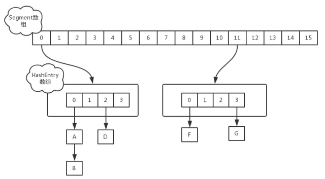
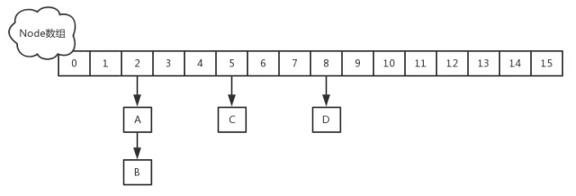
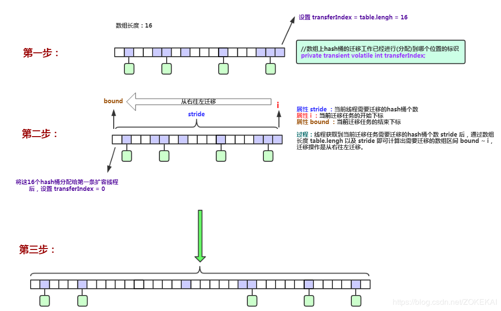
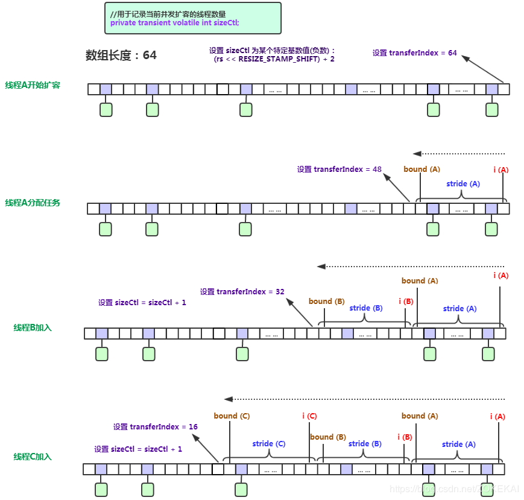
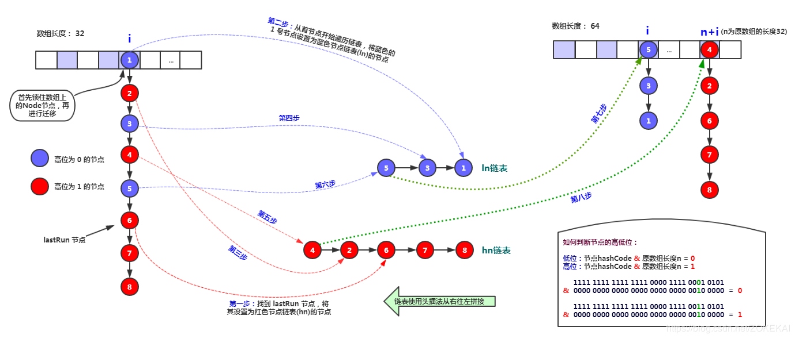
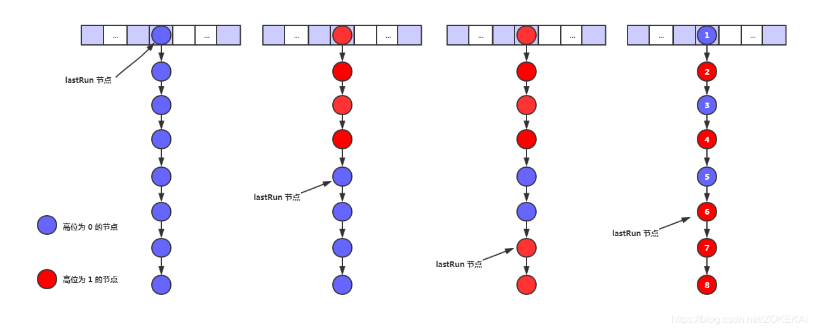
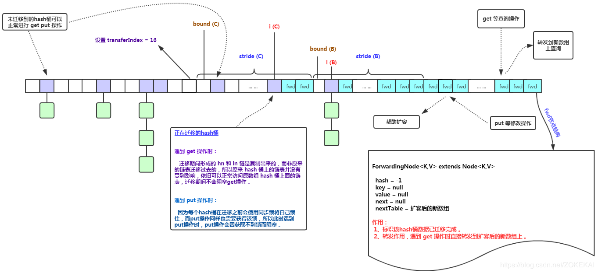
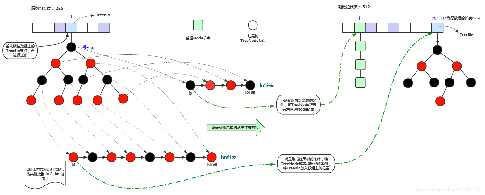
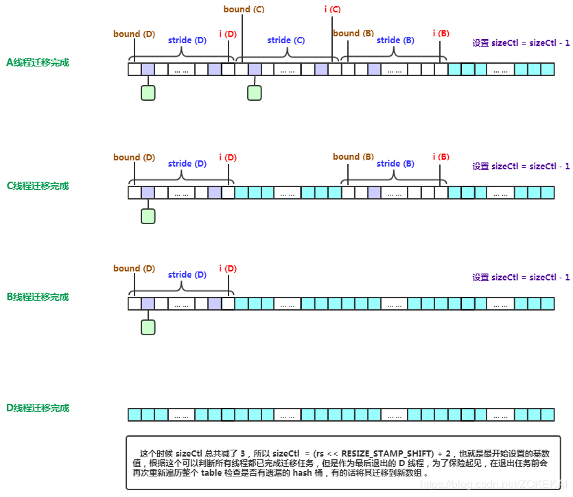

[TOC]
#  JDK1.7的实现

在JDK1.7版本中，ConcurrentHashMap的数据结构是由一个Segment数组和多个HashEntry组成，如下图所示：



Segment数组的意义就是将一个大的table分割成多个小的table来进行加锁，也就是锁分离技术。

而每一个Segment元素存储的是HashEntry数组+链表，这个和HashMap的数据存储结构一样。

它的核心成员变量：
```java
/**
 * 默认的初始容量 16
 */
 static final int DEFAULT_INITIAL_CAPACITY = 16;
 
/**
 * 默认的负载因子
 */
 static final float DEFAULT_LOAD_FACTOR = 0.75f;
 
/**
 * 默认的并发数量,会影响segments数组的长度(初始化后不能修改)
 */
 static final int DEFAULT_CONCURRENCY_LEVEL = 16;
 
/**
 * 最大容量,构造ConcurrentHashMap时指定的值超过,就用该值替换
 * ConcurrentHashMap大小必须是2^n,且小于等于2^30
 */
 static final int MAXIMUM_CAPACITY = 1 << 30;
 
/**
 * 每个segment中table数组的长度,必须是2^n,至少为2
 */
 static final int MIN_SEGMENT_TABLE_CAPACITY = 2;
 
 /**
 * 允许最大segment数量,用于限定concurrencyLevel的边界,必须是2^n
 */
 static final int MAX_SEGMENTS = 1 << 16;
 
 /**
 * 非锁定情况下调用size和contains方法的重试次数,避免由于table连续被修改导致无限重试
 */
 static final int RETRIES_BEFORE_LOCK = 2;
  
/**
 * 用于segment的掩码值,用于与hash的高位进行取&
 */
final int segmentMask;

/**
 * 用于算segment位置时,hash参与运算的位数
 */
final int segmentShift; 

/**
 * segments数组
 */
 final Segment<K,V>[] segments;
 
```
Segment 是 ConcurrentHashMap 的一个内部类，主要的组成如下：
```java

static final class Segment<K,V> extends ReentrantLock implements Serializable {
    private static final long serialVersionUID = 2249069246763182397L;

    /**
     * 对segment加锁时,在阻塞之前自旋的次数
     *
     */
    static final int MAX_SCAN_RETRIES =
            Runtime.getRuntime().availableProcessors() > 1 ? 64 : 1;

    /**
     * 每个segment的HashEntry table数组
     */
    transient volatile HashEntry<K,V>[] table;

    /**
     * 元素的数量,只能在锁中或者其他保证volatile可见性之间进行访问
     */
    transient int count;

    /**
     * 当前segment中可变操作发生的次数,put,remove等,可能会溢出32位
     */
    transient int modCount;

    /**
     * 阈值，当table大小超过阈值时,对table进行扩容,值为(int)(capacity *loadFactor)
     * 这是其中一个segment元素对应的Hashentry数组的阈值，而不是整体segment数组的阈值
     */
    transient int threshold;

    /**
     * 负载因子
     */
    final float loadFactor;

    /**
     * 构造方法
     */
    Segment(float lf, int threshold, HashEntry<K,V>[] tab) {
        this.loadFactor = lf;
        this.threshold = threshold;
        this.table = tab;
    }
```
Segment继承了ReentrantLock，所以它就是一种可重入锁（ReentrantLock)。在ConcurrentHashMap，一个Segment就是一个子哈希表，Segment里维护了一个HashEntry数组，并发环境下，对于不同Segment的数据进行操作是不用考虑锁竞争的。（就按默认的ConcurrentLeve为16来讲，理论上就允许16个线程并发执行，有木有很酷）　　

**所以，对于同一个Segment的操作才需考虑线程同步，不同的Segment则无需考虑。**


Segment类似于HashMap，一个Segment维护着一个HashEntry数组。


HashEntry是目前我们提到的最小的逻辑处理单元了。一个ConcurrentHashMap维护一个Segment数组，一个Segment维护一个HashEntry数组。

**所以扩容、负载因子都是针对的HashEntry数组，而不是segment数组。**

看看其中 HashEntry 的组成：
```java
    static final class HashEntry<K,V> {
        final int hash;
        final K key;
        // 保证内存可见性,每次从内存中获取
        volatile V value;
        volatile HashEntry<K,V> next;

        HashEntry(int hash, K key, V value, HashEntry<K,V> next) {
            this.hash = hash;
            this.key = key;
            this.value = value;
            this.next = next;
        }
        
   /**
     * 使用volatile语义写入next,保证可见性
     */
    final void setNext(HashEntry<K,V> n) {
        UNSAFE.putOrderedObject(this, nextOffset, n);
    }
```

和 HashMap 非常类似，唯一的区别就是其中的核心数据如 value ，以及链表都是 volatile 修饰的，保证了获取时的可见性。

 原理上来说：ConcurrentHashMap 采用了分段锁技术，其中 Segment 继承于 ReentrantLock。
 
不会像 HashTable 那样不管是 put 还是 get 操作都需要做同步处理，理论上 ConcurrentHashMap 支持 CurrencyLevel (Segment 数组数量)的线程并发。

每当一个线程占用锁访问一个 Segment 时，不会影响到其他的 Segment。


## 初始化，构造函数
JDK1.7的ConcurrentHashMap的初始化主要分为两个部分：

* 一是初始化ConcurrentHashMap，即初始化segments数组、segmentShift段偏移量和segmentMask段掩码等；

* 然后则是初始化每个segment分段。

ConcurrentHashMap包含多个构造函数，而所有的构造函数最终都调用了如下的构造函数：

```java
    public ConcurrentHashMap(int initialCapacity,
                             float loadFactor, int concurrencyLevel) {
       //验证参数的合法性，如果不合法，直接抛出异常。
        if (!(loadFactor > 0) || initialCapacity < 0 || concurrencyLevel <= 0)
            throw new IllegalArgumentException();
       //concurrencyLevel也就是Segment的个数不能超过规定的最大Segment的个数，默认值为static final int MAX_SEGMENTS = 1 << 16; 如果超过这个值，设置为这个值。也就是最大并发数为65536
       if (concurrencyLevel > MAX_SEGMENTS)
            concurrencyLevel = MAX_SEGMENTS;
        // Find power-of-two sizes best matching arguments
        int sshift = 0;//2的sshif次方等于ssize，例:ssize=16,sshift=4;ssize=32,sshif=5
        int ssize = 1;//ssize 为segments数组长度
        //使用循环找到大于等于concurrencyLevel的第一个2的n次方的数ssize，这个数就是Segment数组的大小，并记录一共向左按位移动的次数sshift,故2的sshif次方等于ssize
        while (ssize < concurrencyLevel) {
            ++sshift;
            ssize <<= 1;
        }
        this.segmentShift = 32 - sshift;//用于定位参与散列运算的位数,使用32是因为ConcurrentHashMap的hash()方法返回的最大数是32位的；返回值为int型数，32位，占4个字节
        this.segmentMask = ssize - 1;//是散列运算的掩码，等于ssize减去1，所以掩码的二进制各位都为1.目的是之后可以通过key的hash值与这个值做&运算确定Segment的索引。
        //检查给的容量值是否大于允许的最大容量值，如果大于该值，设置为该值。最大容量值为static final int MAXIMUM_CAPACITY = 1 << 30;。
        if (initialCapacity > MAXIMUM_CAPACITY)
            initialCapacity = MAXIMUM_CAPACITY;
        //计算每个Segment平均应该放置多少个元素，这个值c是向上取整的值。比如初始容量为15，Segment个数为4，则每个Segment平均需要放置4个元素。
        int c = initialCapacity / ssize;
        if (c * ssize < initialCapacity)
            ++c;
        //计算cap的大小，即Segment中HashEntry的数组长度，cap也一定为2的n次方.
        int cap = MIN_SEGMENT_TABLE_CAPACITY;
        while (cap < c)
            cap <<= 1;//循环找到大于等于c的第一个2的n次方的数cap
        // create segments and segments[0]
        //初始化第一个Segment
        Segment<K,V> s0 =
            new Segment<K,V>(loadFactor, (int)(cap * loadFactor),
                             (HashEntry<K,V>[])new HashEntry[cap]);
         //创建segments数组并初始化第一个Segment，其余的Segment延迟初始化
        Segment<K,V>[] ss = (Segment<K,V>[])new Segment[ssize];
        UNSAFE.putOrderedObject(ss, SBASE, s0); // ordered write of segments[0]
        this.segments = ss;
    }
```
 * 理想情况下ConcurrentHashMap的真正的并发访问量能够达到concurrencyLevel，因为有concurrencyLevel个Segment，假如有concurrencyLevel个线程需要访问Map，并且需要访问的数据都恰好分别落在不同的Segment中，则这些线程能够无竞争地自由访问（因为他们不需要竞争同一把锁），达到同时访问的效果。这也是为什么这个参数起名为“并发级别”的原因。
 ## 定位Segment
 
由于采用了Segment分段锁机制实现一个高效的同步，那么首先则需要通过hash散列算法计算key的hash值，从而定位其所在的Segment. 因此，首先需要了解ConcurrentHashMap中hash()函数的实现。
```java
    private int hash(Object k) {
        int h = hashSeed;
 
        if ((0 != h) && (k instanceof String)) {//如果k是String类型，则使用String.hash32方法，计算后返回，不再进行下面的哈希计算。
            return sun.misc.Hashing.stringHash32((String) k);
        }
 
        h ^= k.hashCode();
 
        // Spread bits to regularize both segment and index locations,
        // using variant of single-word Wang/Jenkins hash.
        h += (h <<  15) ^ 0xffffcd7d;
        h ^= (h >>> 10);
        h += (h <<   3);
        h ^= (h >>>  6);
        h += (h <<   2) + (h << 14);
        return h ^ (h >>> 16);
    }
```
首先计算一个随机的hashSeed，然后

* 如果k是String类型且随机的hashSeed不为0，则使用String.hash32方法，计算后返回，不再进行下面的哈希计算。

* 如果k不是String类型，则利用Wang/Jenkins hash算法对key的hash值进行再hash计算

### 根据计算后的hash值去定位Segment
```java
    private Segment<K,V> segmentForHash(int h) {
        long u = (((h >>> segmentShift) & segmentMask) << SSHIFT) + SBASE;
        return (Segment<K,V>) UNSAFE.getObjectVolatile(segments, u);
    }
```

## put方法
### 首先是通过 key 定位到 Segment，之后在对应的 Segment 中进行具体的 put。
```java
public V put(K key, V value) {
        Segment<K,V> s;
        //concurrentHashMap不允许key/value为空
        if (value == null)
            throw new NullPointerException();
        //key通过一次hash运算得到一个hash值。
        int hash = hash(key);
        //将得到hash值向右按位移动segmentShift位，然后再与segmentMask做&运算得到segment的索引j。定位segments 数组的位置
        int j = (hash >>> segmentShift) & segmentMask;
        // 获取这个segment
        if ((s = (Segment<K,V>)UNSAFE.getObject          // nonvolatile; recheck
             (segments, (j << SSHIFT) + SBASE)) == null) //  in ensureSegment
             // 为null则初始化当前位置的segment
            s = ensureSegment(j);
        return s.put(key, hash, value, false);
    }
```

ensureSegment初始化segment方法:

1. 计算segment中HashEntry的位置

2. 使用UNSAFE的方法判断当前位置有没有初始化,

3. 然后使用segmets[0]的模板创建一个新的HashEntry[],

4. 再次判断当前位置有没有初始化,可能存在多线程同时初始化,

5. 然后创建一个新的segment,

6. 最后使用自旋cas设置新的segment的位置,保证只有一个线程初始化成功.
```java
/**
 *
 * @param k 位置
 * @return segments
 */private Segment<K,V> ensureSegment(int k) {
    final Segment<K,V>[] ss = this.segments;  // 当前的segments数组
    long u = (k << SSHIFT) + SBASE; // raw offset // 计算原始偏移量,在segments数组的位置
    Segment<K,V> seg;
    if ((seg = (Segment<K,V>)UNSAFE.getObjectVolatile(ss, u)) == null) { // 判断没有被初始化
        Segment<K,V> proto = ss[0]; // use segment 0 as prototype // 获取第一个segment ss[0]
        // 这就是为什么要在初始化化map时要初始化一个segment,需要用cap和loadFactoe 为模板
        int cap = proto.table.length; // 容量
        float lf = proto.loadFactor; // 负载因子
        int threshold = (int)(cap * lf); // 阈值
        // 初始化ss[k] 内部的tab数组 // recheck
        HashEntry<K,V>[] tab = (HashEntry<K,V>[])new HashEntry[cap];
        // 再次检查这个ss[k]  有没有被初始化
        if ((seg = (Segment<K,V>)UNSAFE.getObjectVolatile(ss, u))
                == null) { // recheck
            // 创建一个Segment
            Segment<K,V> s = new Segment<K,V>(lf, threshold, tab);
            // 这里用自旋CAS来保证把segments数组的u位置设置为s
            // 万一有多线程执行到这一步,只有一个成功,break
            // getObjectVolatile 保证了读的可见性,所以一旦有一个线程初始化了,那么就结束自旋
            while ((seg = (Segment<K,V>)UNSAFE.getObjectVolatile(ss, u))
                    == null) {
                if (UNSAFE.compareAndSwapObject(ss, u, null, seg = s))
                    break;
            }
        }
    }
    return seg;
}
```
> 举例如何获得Segment的索引

在初始化的时候我们说过segmentShift的值等于32-sshift，例如concurrencyLevel等于16，则sshift等于4，则segmentShift为28。hash值是一个32位的整数，将其向右移动28位就变成这个样子：0000 0000 0000 0000 0000 0000 0000 xxxx，(即为移位前的高位) 然后再用这个值与segmentMask（等于ssize减去1，所以掩码的二进制各位都为1）做&运算，也就是取最后四位的值。这个值确定Segment的索引。

#### 在 Segment 中进行具体的 put。
虽然 HashEntry 中的 value 是用 volatile 关键词修饰的，但是并不能保证并发的原子性，所以 put 操作时仍然需要加锁处理。

```java
 final V put(K key, int hash, V value, boolean onlyIfAbsent) {
            HashEntry<K,V> node = tryLock() ? null :
                scanAndLockForPut(key, hash, value);// 首先尝试获取锁，如果获取失败肯定就有其他线程存在竞争，则利用 scanAndLockForPut() 自旋获取锁。
            V oldValue;
            try {
                HashEntry<K,V>[] tab = table;
                int index = (tab.length - 1) & hash;
                // entryAt 底层调用getObjectVolatile 具有volatile读语义
                HashEntry<K,V> first = entryAt(tab, index);//通过 key 的 hashcode 定位到 HashEntry,n拿到链表上的第一个entry。
                for (HashEntry<K,V> e = first;;) {//遍历该 HashEntry，如果不为空则判断传入的 key 和当前遍历的 key 是否相等，相等则覆盖旧的 value。
                    if (e != null) {
                        K k;
                        if ((k = e.key) == key ||
                            (e.hash == hash && key.equals(k))) {
                            oldValue = e.value;
                            if (!onlyIfAbsent) {
                                e.value = value;
                                ++modCount;
                            }
                            break;
                        }
                        e = e.next;
                    }
                    else {//不为空则需要新建一个 HashEntry 并加入到 Segment 中，同时会先判断是否需要扩容。
                        if (node != null)
                        // 底层使用 putOrderedObject 方法 具有volatile写语义
                            node.setNext(first);
                        else
                            node = new HashEntry<K,V>(hash, key, value, first);
                        int c = count + 1;
                        if (c > threshold && tab.length < MAXIMUM_CAPACITY)
                            rehash(node);
                        else
                        // 给table的index位置设置为node,
                        // node为头结点,原来的头结点first为node的next节点
                        // 底层也是调用的 putOrderedObject 方法 具有volatile写语义
                            setEntryAt(tab, index, node);
                        ++modCount;
                        count = c;
                        oldValue = null;
                        break;
                    }
                }
            } finally {
                unlock();//解除所获取当前 Segment 的锁。
            }
            return oldValue;
        }

```
scanAndLockForPut自旋获取锁：

```java
private HashEntry<K,V> scanAndLockForPut(K key, int hash, V value) {
            HashEntry<K,V> first = entryForHash(this, hash);
            HashEntry<K,V> e = first;
            HashEntry<K,V> node = null;
            int retries = -1; // negative while locating node
            while (!tryLock()) {//尝试自旋获取锁。
                HashEntry<K,V> f; // to recheck first below
                if (retries < 0) {
                    if (e == null) {
                        if (node == null) // speculatively create node
                            node = new HashEntry<K,V>(hash, key, value, null);
                        retries = 0;
                    }
                    else if (key.equals(e.key))
                        retries = 0;
                    else
                        e = e.next;
                }
                else if (++retries > MAX_SCAN_RETRIES) {//如果重试的次数达到了 MAX_SCAN_RETRIES 则改为阻塞锁获取，保证能获取成功
                    lock();
                    break;
                }
                else if ((retries & 1) == 0 &&
                         (f = entryForHash(this, hash)) != first) {
                    e = first = f; // re-traverse if entry changed
                    retries = -1;
                }
            }
            return node;
        }
```
## get 方法

```java
public V get(Object key) {
        Segment<K,V> s; 
        HashEntry<K,V>[] tab;
        int h = hash(key);
        long u = (((h >>> segmentShift) & segmentMask) << SSHIFT) + SBASE;
        //先定位Segment，再定位HashEntry
        if ((s = (Segment<K,V>)UNSAFE.getObjectVolatile(segments, u)) != null &&
            (tab = s.table) != null) {
            for (HashEntry<K,V> e = (HashEntry<K,V>) UNSAFE.getObjectVolatile
                     (tab, ((long)(((tab.length - 1) & h)) << TSHIFT) + TBASE);
                 e != null; e = e.next) {
                K k;
                if ((k = e.key) == key || (e.hash == h && key.equals(k)))
                    return e.value;
            }
        }
        return null;
    }
```
get 逻辑比较简单：

* 只需要将 Key 通过 Hash 之后定位到具体的 Segment ，再通过一次 Hash 定位到具体的元素上。

* 由于 HashEntry 中的 value 属性是用 volatile 关键词修饰的，保证了内存可见性，所以每次获取时都是最新值。

* ConcurrentHashMap 的 get 方法是非常高效的，**因为整个过程都不需要加锁**。

## size方法

put、remove和get操作只需要关心一个Segment，而size操作需要遍历所有的Segment才能算出整个Map的大小。

一个简单的方案是，先锁住所有Sgment，计算完后再解锁。但这样做，在做size操作时，不仅无法对Map进行写操作，同时也无法进行读操作，不利于对Map的并行操作。

为更好支持并发操作，ConcurrentHashMap会在不上锁的前提，**逐个Segment计算3次size**，如果某相邻两次计算获取的所有Segment的更新次数（**每个Segment都与HashMap一样通过modCount跟踪自己的修改次数，Segment每修改一次其modCount加一**）相等

说明这两次计算过程中无更新操作，则这两次计算出的总size相等，可直接作为最终结果返回。如果这三次计算过程中Map有更新，则对所有Segment加锁重新计算Size。该计算方法代码如下:
```java
public int size() {
  final Segment<K,V>[] segments = this.segments;
  int size;
  boolean overflow; // true if size overflows 32 bits
  long sum;         // sum of modCounts
  long last = 0L;   // previous sum
  int retries = -1; // first iteration isn't retry
  try {
    for (;;) {
      if (retries++ == RETRIES_BEFORE_LOCK) {
        for (int j = 0; j < segments.length; ++j)
          ensureSegment(j).lock(); // force creation
      }
      sum = 0L;
      size = 0;
      overflow = false;
      for (int j = 0; j < segments.length; ++j) {
        Segment<K,V> seg = segmentAt(segments, j);
        if (seg != null) {
          sum += seg.modCount;
          int c = seg.count;
          if (c < 0 || (size += c) < 0)//c和size均为int型，如果小于0 ，表示超出了32位，溢出
            overflow = true;
        }
      }
      if (sum == last)
        break;
      last = sum;
    }
  } finally {
    if (retries > RETRIES_BEFORE_LOCK) {
      for (int j = 0; j < segments.length; ++j)
        segmentAt(segments, j).unlock();
    }
  }
  return overflow ? Integer.MAX_VALUE : size;
}
```
## 扩容方法
扩容只是针对每个segment中的HashEntry数组进行扩容，segment并不扩容。HashEntry数组的每个位置也是由数组元素和链表构成的。
```java
/** * Doubles size of table and repacks entries, also adding the 
    * given node to new table 
    */
// 方法参数上的 node 是这次扩容后，需要添加到新的数组中的数据。传入的参数是HashEntry
private void rehash(HashEntry<K,V> node) {
    HashEntry<K,V>[] oldTable = table;
    int oldCapacity = oldTable.length;
    // 2 倍
    int newCapacity = oldCapacity << 1;
    threshold = (int)(newCapacity * loadFactor);
    // 创建新数组
    HashEntry<K,V>[] newTable =
        (HashEntry<K,V>[]) new HashEntry[newCapacity];
    // 新的掩码，如从 16 扩容到 32，那么 sizeMask 为 31，对应二进制 ‘000...00011111’
    int sizeMask = newCapacity - 1;
 
    // 遍历原数组，老套路，将原数组位置 i 处的链表拆分到 新数组位置 i 和 i+oldCap 两个位置
    for (int i = 0; i < oldCapacity ; i++) {
        // e 是链表的第一个元素
        HashEntry<K,V> e = oldTable[i];
        if (e != null) {
            HashEntry<K,V> next = e.next;
            // 计算应该放置在新数组中的位置，
            // 假设原数组长度为 16，e 在 oldTable[3] 处，那么 idx 只可能是 3 或者是 3 + 16 = 19
            int idx = e.hash & sizeMask;
            if (next == null)   // 该位置处只有一个元素，那比较好办
                newTable[idx] = e;
            else { // Reuse consecutive sequence at same slot
                // e 是链表表头
                HashEntry<K,V> lastRun = e;
                // idx 是当前链表的头结点 e 的新位置
                int lastIdx = idx;
 
                // 下面这个 for 循环会找到一个 lastRun 节点，这个节点之后的所有元素是将要放到一起的
                for (HashEntry<K,V> last = next;
                     last != null;
                     last = last.next) {
                    int k = last.hash & sizeMask;
                    if (k != lastIdx) {
                        lastIdx = k;
                        lastRun = last;
                    }
                }
                // 将 lastRun 及其之后的所有节点组成的这个链表放到 lastIdx 这个位置
                newTable[lastIdx] = lastRun;
                // 下面的操作是处理 lastRun 之前的节点，
                //    这些节点可能分配在另一个链表中，也可能分配到上面的那个链表中
                for (HashEntry<K,V> p = e; p != lastRun; p = p.next) {
                    V v = p.value;
                    int h = p.hash;
                    int k = h & sizeMask;
                    HashEntry<K,V> n = newTable[k];
                    newTable[k] = new HashEntry<K,V>(h, p.key, v, n);
                }
            }
        }
    }
    //将传入的新node插入扩容后的数组。头插法
    int nodeIndex = node.hash & sizeMask; // add the new node
    node.setNext(newTable[nodeIndex]);
    newTable[nodeIndex] = node;
    table = newTable;
}
```

注意这里面的代码，外部已经加锁，所以这里面是安全的，我们看下具体的实现方式：

先对数组的长度增加一倍，然后遍历原来的旧的table数组，把每一个数组元素也就是Node链表迁移到新的数
组里面，最后迁移完毕之后，把新数组的引用直接替换旧的。

此外这里这有一个小的细节优化，在迁移链表时用了两个for循环，

第一个for的目的是为了，判断是否有迁移位置一样的元素并且位置还是相邻，根据HashMap的设计策略，首先table的大小必须是2的n次方，我们知道扩容后的每个链表的元素的位置，要么不变，要么是原table索引位置+原table的容量大小，举个例子假如现在有三个元素（3,5,7）要放入map里面，table的的容量是2，简单的假设元素位置=元素的值 % 2，得到如下结构：
```log
[0]=null
[1]=3->5->7
```
现在将table的大小扩容成4，分布如下：
```log
[0]=null
[1]=5->7
[2]=null
[3]=3
```
因为扩容必须是2的n次方，所以HashMap在put和get元素的时候直接取key的hashCode然后经过再次均衡后直接采用&位运算就能达到取模效果，这个不再细说，上面这个例子的目的是为了说明扩容后的数据分布策略，要么保留在原位置，要么会被均衡在旧的table位置，这里是1加上旧的table容量这是是2，所以是3。基于这个特点，第一个for循环，作的优化如下，假设我们现在用0表示原位置，1表示迁移到index+oldCap的位置，来代表元素：
```log
[0]=null
[1]=0->1->1->0->0->0->0
```
第一个for循环的会记录lastRun，比如要迁移[1]的数据，经过这个循环之后，lastRun的位置会记录第三个0的位置，因为后面的数据都是0，代表他们要迁移到新的数组中同一个位置中，所以就可以把这个中间节点，直接插入到新的数组位置而后面附带的一串元素其实都不需要动。

接着第二个循环里面在此从第一个0的位置开始遍历到lastRun也就是第三个元素的位置就可以了，只循环处理前面的数据即可，这个循环里面根据位置0和1做不同的链表追加，后面的数据已经被优化的迁移走了，但最坏情况下可能后面一个也没优化，比如下面的结构：
```log
[0]=null
[1]=1->1->0->0->0->0->1->0
```
这种情况，第一个for循环没多大作用，需要通过第二个for循环从头开始遍历到尾部，按0和1分发迁移，这里面使用的是还是头插法的方式迁移，新迁移的数据是追加在链表的头部，但这里是线程安全的所以不会出现循环链表，导致死循环问题。迁移完成之后直接将最新的元素加入，最后将新的table替换旧的table即可。
#  JDK1.8的实现


 1.7 已经解决了并发问题，并且能支持 N 个 Segment 这么多次数的并发，但依然存在 HashMap 在 1.7 版本中的问题。

>当 Hash 冲突严重时，在桶上形成的链表会变的越来越长，这样在查询时的效率就会越来越低；时间复杂度为 O(N)。

首先来看下底层的组成结构：



在JDK1.7之前，ConcurrentHashMap是通过分段锁机制来实现的，所以其最大并发度受Segment的个数限制。因此，在JDK1.8中，ConcurrentHashMap的实现原理摒弃了这种设计，而是选择了与HashMap类似的**数组+链表+红黑树**的方式实现，Node数组中的每个元素实际上是单链表的头结点或者红黑树的根节点；
而加锁则采用CAS和synchronized实现。


在深入JDK1.8的put和get实现之前要知道一些常量设计和数据结构，这些是构成ConcurrentHashMap实现结构的基础，下面看一下基本属性：
```java
// node数组最大容量：2^30=1073741824

private static final int MAXIMUM_CAPACITY = 1 << 30;

// 默认初始值，必须是2的幕数

private static final int DEFAULT_CAPACITY = 16;

//数组可能最大值，需要与toArray（）相关方法关联

static final int MAX_ARRAY_SIZE = Integer.MAX_VALUE - 8;

//并发级别，遗留下来的，为兼容以前的版本

private static final int DEFAULT_CONCURRENCY_LEVEL = 16;

// 负载因子

private static final float LOAD_FACTOR = 0.75f;

// 链表转红黑树阀值,> 8 链表转换为红黑树

static final int TREEIFY_THRESHOLD = 8;

//树转链表阀值，小于等于6（tranfer时，lc、hc=0两个计数器分别++记录原bin、新binTreeNode数量，<=UNTREEIFY_THRESHOLD 则untreeify(lo)）

static final int UNTREEIFY_THRESHOLD = 6;

static final int MIN_TREEIFY_CAPACITY = 64;

private static final int MIN_TRANSFER_STRIDE = 16;

private static int RESIZE_STAMP_BITS = 16;

// 2^15-1，help resize的最大线程数

private static final int MAX_RESIZERS = (1 << (32 - RESIZE_STAMP_BITS)) - 1;

// 32-16=16，sizeCtl中记录size大小的偏移量

private static final int RESIZE_STAMP_SHIFT = 32 - RESIZE_STAMP_BITS;

// forwarding nodes的hash值

static final int MOVED     = -1; 

// 树根节点的hash值

static final int TREEBIN   = -2; 

// ReservationNode的hash值

static final int RESERVED  = -3; 

// 可用处理器数量

static final int NCPU = Runtime.getRuntime().availableProcessors();

//存放node的数组

transient volatile Node<K,V>[] table;

/* 控制标识符，用来控制table的初始化和扩容的操作，不同的值有不同的含义

 * 当为负数时：-1代表正在初始化，-N代表有N-1个线程正在 进行扩容

 * 当为0时：代表当时的table还没有被初始化

 * 当为正数时：表示初始化或者下一次进行扩容的大小
 */

private transient volatile int sizeCtl;
```


### Node
Node是ConcurrentHashMap存储结构的基本单元，Node类实现了Map.Entry接口，主要存放key-value对，并且具有next域，源代码如下:
```java
static class Node<K,V> implements Map.Entry<K,V> {

    //链表的数据结构

    final int hash;

    final K key;

    //val和next都会在扩容时发生变化，所以加上volatile来保持可见性和禁止重排序

    volatile V val;

    volatile Node<K,V> next;

    Node(int hash, K key, V val, Node<K,V> next) {

        this.hash = hash;

        this.key = key;

        this.val = val;

        this.next = next;

    }

    public final K getKey()       { return key; }

    public final V getValue()     { return val; }

    public final int hashCode()   { return key.hashCode() ^ val.hashCode(); }

    public final String toString(){ return key + "=" + val; }   

}
```
### ForwardingNode
在扩容时才会出现的特殊节点，**其key,value,hash全部为null。并拥有nextTable指针引用新的table数组。**
```java
static final class ForwardingNode<K,V> extends Node<K,V> {
    final Node<K,V>[] nextTable;
    
    ForwardingNode(Node<K,V>[] tab) {
            super(MOVED, null, null, null);
            this.nextTable = tab;
    }
.....
}
```
### CAS关键操作
在ConcurrentHashMap中会大量使用CAS修改它的属性和一些操作。因此，在理解ConcurrentHashMap的方法前我们需要了解下面几个常用的利用CAS算法来保障线程安全的操作。
#### 1. tabAt
```java
static final <K,V> Node<K,V> tabAt(Node<K,V>[] tab, int i) {
        return (Node<K,V>)U.getObjectVolatile(tab, ((long)i << ASHIFT) + ABASE);
}
```
该方法用来获取table数组中索引为i的Node元素。
#### 2. casTabAt
```java
static final <K,V> boolean casTabAt(Node<K,V>[] tab, int i,Node<K,V> c, Node<K,V> v) {
        return U.compareAndSwapObject(tab, ((long)i << ASHIFT) + ABASE, c, v);
}
```
利用CAS操作设置table数组中索引为i的元素
#### 3. setTabAt
```java
static final <K,V> void setTabAt(Node<K,V>[] tab, int i, Node<K,V> v) {
        U.putObjectVolatile(tab, ((long)i << ASHIFT) + ABASE, v);
}
```
该方法用来设置table数组中索引为i的元素


### ConcurrentHashMap的构造方法

JDK1.8的ConcurrentHashMap的初始化过程也比较简单，所有的构造方法最终都会调用如下这个构造方法。
```java
    public ConcurrentHashMap(int initialCapacity,
                             float loadFactor, int concurrencyLevel) {
        if (!(loadFactor > 0.0f) || initialCapacity < 0 || concurrencyLevel <= 0)
            throw new IllegalArgumentException();
        if (initialCapacity < concurrencyLevel)   // Use at least as many bins
            initialCapacity = concurrencyLevel;   // as estimated threads
        long size = (long)(1.0 + (long)initialCapacity / loadFactor);//根据给定的初始化容量和负责因子算出map的容量
        int cap = (size >= (long)MAXIMUM_CAPACITY) ?
            MAXIMUM_CAPACITY : tableSizeFor((int)size);//保证容量大小不大于MAXIMUM_CAPACITY并且是2的n次方。
        this.sizeCtl = cap;
    }
```
该初始化过程通过指定的初始容量initialCapacity，加载因子loadFactor和预估并发度concurrencyLevel三个参数计算table数组的初始大小 `sizeCtl`的值。

可以看到，**在构造ConcurrentHashMap时，并不会对hash表（Node<K, V>[] table）进行初始化，只是算出table数组的长度，hash表的初始化是在插入第一个元素时进行的。** 在put操作时，如果检测到table为空或其长度为0时，则会调用initTable()方法对table进行初始化操作。

>  **此时 `sizeCtl ` 用于记录初始容量大小，仅用于记录集合在实际创建时应该使用的大小的作用 。**

### key的hash值
获取key值的hash值。在JDK1.8的ConcurrentHashMap中通过speed()方法获取。
```java
    static final int spread(int h) {
        return (h ^ (h >>> 16)) & HASH_BITS;
    }
```
speed()方法将key的hash值进行再hash，**将key的hashCode的低16位于高16位进行异或运算**，让hash值的高位也参与hash运算，从而减少哈希冲突。
```java
//普通node算出来的hash值均为大于等于0的。
static final int MOVED = -1;//forwarding nodes的hash值
static final int TREEBIN = -2;// 树根节点的hash值
```


### put操作
调用put方法时实际具体实现是putVal方法，源码如下：

```java
/** Implementation for put and putIfAbsent */

 final V putVal(K key, V value, boolean onlyIfAbsent) {
        //1、判断key是否为空
        if (key == null || value == null) throw new NullPointerException();
        //2、计算哈希值
        int hash = spread(key.hashCode());
        //用于记录数组位置上存放的node的节点数量
        int binCount = 0;
        //3、得到table的数组
        for (Node<K,V>[] tab = table;;) {

            Node<K,V> f; int n, i, fh;
            //4.如果table数组为空，则初始化table
            if (tab == null || (n = tab.length) == 0)
                tab = initTable();
            //5.如果tab中索引为i的位置的元素为null，则直接使用CAS将值插入即可
            else if ((f = tabAt(tab, i = (n - 1) & hash)) == null) {
                if (casTabAt(tab, i, null,new Node<K,V>(hash, key, value, null)))
                    break;                   // no lock when adding to empty bin
            }
            //6、如果table正在扩容，则得到扩容后的table，然后再重新开始一个循环
            else if ((fh = f.hash) == MOVED)//此时数组上的节点为ForwardingNode节点，该节点初始化时设置自身的hash值为MOVED。
                tab = helpTransfer(tab, f);
            else {
                //7.到这里说明找到了key hash后对应的table，并且table上有其他node的存在
                V oldVal = null;
                //8、把这个找到的node加上同步锁，防止并发出现的问题，如果其他key put进来的时候也对应这个tab则堵塞在这里
                synchronized (f) {
                    //9.再次用cas确认索引i上的table为我们找到的node，如果不是的话则这个node被修改，直接释放锁进入下一个循环
                    if (tabAt(tab, i) == f) {
                        //10.如果目标table的第一个node的哈希值大于等于0，则是链式结构，走链表查找，反之走红黑树查找
                        if (fh >= 0) {
                            //11.标志bincount为1，因为在该table上至少有一个node节点
                            binCount = 1;
                            //12.循环链表
                            for (Node<K,V> e = f;; ++binCount) {
                                K ek;
                                //13.如果遍历元素的哈希值与需要插入目标key的哈希值相同，并且值也相同，则插入的是重复key的元素
                                if (e.hash == hash &&
                                    ((ek = e.key) == key ||
                                     (ek != null && key.equals(ek)))) {
                                    oldVal = e.val;
                                    //14.如果onlyIfAbsent为false的话，则替换为新value，否则不修改（一般传false）
                                    if (!onlyIfAbsent)
                                        e.val = value;
                                    //15.break循环
                                    break;
                                }
                                //16.循环直到最后一个node节点的key都不是我们想要插入的key
                                Node<K,V> pred = e;
                                if ((e = e.next) == null) {
                                    //在尾部添加一个新节点，break循环
                                    pred.next = new Node<K,V>(hash, key,value, null);
                                    break;
                                }
                            }
                        }
                        //17.该节点属于红黑树的子节点，进行树操作
                        else if (f instanceof TreeBin) {
                            Node<K,V> p;
                            binCount = 2;
                            if ((p = ((TreeBin<K,V>)f).putTreeVal(hash, key, value)) != null) {
                                oldVal = p.val;
                                if (!onlyIfAbsent)
                                    p.val = value;
                            }
                        }
                    }
                }
                //18.如果node上节点数不为0
                if (binCount != 0) {
                    //19.如果node上节点数大于或者等于8，则转为红黑树
                    if (binCount >= TREEIFY_THRESHOLD)
                        treeifyBin(tab, i);//该方法中会判断`if ((n = tab.length) < MIN_TREEIFY_CAPACITY)` ，此时会调用`tryPresize(n << 1);` 将数组容量扩大一倍，而不是将链表转化为红黑树。
                    //20.返回原来key对应的旧值
                    if (oldVal != null)
                        return oldVal;
                    break;
                }
            }
        }
        //20.对当前容量大小进行检查，如果超过了临界值（实际大小*加载因子）就需要扩容
        addCount(1L, binCount);
        return null;
    }
```

这个put的过程很清晰，对当前的table进行无条件自循环直到put成功，可以分成以下六步流程来概述。
1.首先对于每一个放入的值，首先利用spread方法对key的hashcode进行一次hash计算，由此来确定这个值在 table中的位置；

2. 如果没有初始化就先调用initTable（）方法来进行初始化过程

3. 如果这个位置是null，没有hash冲突就直接CAS插入

4. 如果这个位置存在结点，说明发生了hash碰撞，首先判断这个节点的类型。
   * 如果该节点fh==MOVED(代表forwardingNode,数组正在进行扩容)的话，说明正在进行扩容；
  
   *  如果是链表节点（fh>0）,则得到的结点就是hash值相同的节点组成的链表的头节点。需要依次向后遍历确定这个新加入的值所在位置。如果遇到key相同的节点，则只需要覆盖该结点的value值即可。否则依次向后遍历，直到链表尾插入这个结点；
  
   *  如果这个节点的类型是TreeBin的话，直接调用红黑树的插入方法进行插入新的节点；

5. 插入完节点之后再次检查链表长度，如果长度大于8，就把这个链表转换成红黑树；

6. 对当前容量大小进行检查，如果超过了临界值（实际大小\*加载因子）就需要扩容。


### initTable（）方法
```java
/* 控制标识符，用来控制table的初始化和扩容的操作，不同的值有不同的含义

 * 当为负数时：-1代表正在初始化，-N代表有N-1个线程正在 进行扩容

 * 当为0时：代表当时的table还没有被初始化

 * 当为正数时：表示初始化或者下一次进行扩容的大小
 */

private transient volatile int sizeCtl;
```

初始化过程中:
```java
U.compareAndSwapInt(this, SIZECTL, sc, -1)
```
>  **此时sizeCtl的作用为：将 ` sizeCtl ` 值设置为 -1 表示集合正在初始化中，其他线程发现该值为 -1 时会让出CPU资源以便初始化操作尽快完成 。**

初始化完成后：
```java
Node<K,V>[] nt = (Node<K,V>[])new Node<?,?>[n];
table = tab = nt;
sc = n - (n >>> 2);
sizeCtl = sc;
```
>  **此时sizeCtl 用于记录当前集合的下次扩容的大小，即扩容的阈值。**

现在我们来对每一步的细节进行源码分析，在第一步中，符合条件会进行初始化操作，我们来看看initTable（）方法.
```java
/**

 * Initializes table, using the size recorded in sizeCtl.

 */

private final Node<K,V>[] initTable() {

    Node<K,V>[] tab; int sc;

    while ((tab = table) == null || tab.length == 0) {//空的table才能进入初始化操作

        if ((sc = sizeCtl) < 0) //sizeCtl<0表示其他线程已经在初始化了或者扩容了，挂起当前线程 

            Thread.yield(); // lost initialization race; just spin

        else if (U.compareAndSwapInt(this, SIZECTL, sc, -1)) {//CAS操作sizeCtl为-1，表示初始化状态

            try {

                if ((tab = table) == null || tab.length == 0) {

                    int n = (sc > 0) ? sc : DEFAULT_CAPACITY;

                    @SuppressWarnings("unchecked")

                    Node<K,V>[] nt = (Node<K,V>[])new Node<?,?>[n];//初始化

                    table = tab = nt;

                    sc = n - (n >>> 2);//记录下次扩容的大小 n - (n >>> 2)=n-(1/4)n=(3/4)n=n*0.75

                }

            } finally {

                sizeCtl = sc;

            }

            break;

        }

    }

    return tab;

}
```
### addCount方法
在put方法结尾处调用了addCount方法，把当前ConcurrentHashMap的元素个数+1。

这个方法一共做了两件事：
* 更新baseCount的值，
* 检测是否进行扩容。

```java
private final void addCount(long x, int check) {
        CounterCell[] as; long b, s;
        //利用CAS方法更新baseCount的值
        if ((as = counterCells) != null ||
            !U.compareAndSwapLong(this, BASECOUNT, b = baseCount, s = b + x)) {
            CounterCell a; long v; int m;
            boolean uncontended = true;
            if (as == null || (m = as.length - 1) < 0 ||
                (a = as[ThreadLocalRandom.getProbe() & m]) == null ||
                !(uncontended =
                  U.compareAndSwapLong(a, CELLVALUE, v = a.value, v + x))) {
                fullAddCount(x, uncontended);
                return;
            }
            if (check <= 1)
                return;
            s = sumCount();
        }
        //如果check值大于等于0 则需要检验是否需要进行扩容操作
        if (check >= 0) {
            Node<K,V>[] tab, nt; int n, sc;
            while (s >= (long)(sc = sizeCtl) && (tab = table) != null &&
                   (n = tab.length) < MAXIMUM_CAPACITY) {
                int rs = resizeStamp(n);
                if (sc < 0) {
                    if ((sc >>> RESIZE_STAMP_SHIFT) != rs || sc == rs + 1 ||
                        sc == rs + MAX_RESIZERS || (nt = nextTable) == null ||
                        transferIndex <= 0)
                        break;
                        //如果已经有其他线程在执行扩容操作
                    if (U.compareAndSwapInt(this, SIZECTL, sc, sc + 1))
                        transfer(tab, nt);
                }
                //当前线程是唯一的或是第一个发起扩容的线程 此时nextTable=null
                else if (U.compareAndSwapInt(this, SIZECTL, sc,
                                             (rs << RESIZE_STAMP_SHIFT) + 2))
                    transfer(tab, null);
                s = sumCount();
            }
        }
    }

```


### get()方法

get操作全程不需要加锁是因为Node的成员val是用volatile修饰的 。

```java
public V get(Object key) {

    Node<K,V>[] tab; Node<K,V> e, p; int n, eh; K ek;

    int h = spread(key.hashCode()); //计算两次hash

    if ((tab = table) != null && (n = tab.length) > 0 && (e = tabAt(tab, (n - 1) & h)) != null) {

        if ((eh = e.hash) == h) { //table[i]桶节点的key与查找的key相同，则直接返回
        
            if ((ek = e.key) == key || (ek != null && key.equals(ek)))

                return e.val;

        }

        //hash值为负值表示正在扩容，这个时候查的是ForwardingNode的find方法来定位到nextTable来

        //查找，查找到就返回

        else if (eh < 0)

            return (p = e.find(h, key)) != null ? p.val : null;

        while ((e = e.next) != null) {//既不是链表首节点也不是ForwardingNode，那就往下遍历

            if (e.hash == h && ((ek = e.key) == key || (ek != null && key.equals(ek))))

                return e.val;

        }

    }

    return null;

}
```
方法流程：

1. 计算hash值，定位到该table索引位置，如果是首节点符合就返回

2. 如果遇到扩容的时候，会调用标志正在扩容节点ForwardingNode的find方法，查找该节点，匹配就返回

3. 以上都不符合的话，就往下遍历节点，匹配就返回，否则最后就返回null
### 扩容方法

正在扩容时:
```java
//第一条扩容线程设置的某个特定基数
U.compareAndSwapInt(this, SIZECTL, sc, (rs << RESIZE_STAMP_SHIFT) + 2)
//后续线程加入扩容大军时每次加 1
U.compareAndSwapInt(this, SIZECTL, sc, sc + 1)
//线程扩容完毕退出扩容操作时每次减 1
U.compareAndSwapInt(this, SIZECTL, sc = sizeCtl, sc - 1)
```
>  **此时sizeCtl 用于记录当前扩容的并发线程数情况，此时 sizeCtl 的值为：((rs << RESIZE_STAMP_SHIFT) + 2) + (正在扩容的线程数) ，并且该状态下 sizeCtl < 0 。**

#### 触发扩容的操作

1. 元素个数达到扩容阈值。

2. 调用 putAll 方法，但目前容量不足以存放所有元素时。

3. 某条链表长度达到8，但数组长度却小于64时。在转化为树的`treeifyBin()`方法中判断`if ((n = tab.length) < MIN_TREEIFY_CAPACITY)` ，此时会调用`tryPresize(n << 1);` 将数组容量扩大一倍，而不是将链表转化为红黑树。


#### helpTransfer（）方法

put方法的第三步如果容器正在扩容，则会调用helpTransfer（）方法帮助扩容，现在我们跟进helpTransfer（）方法看看
```java
/**

 *帮助从旧的table的元素复制到新的table中

 */
//tab为node数组，f为准备put新元素的节点。
final Node<K,V>[] helpTransfer(Node<K,V>[] tab, Node<K,V> f) {

    Node<K,V>[] nextTab; int sc;

    if (tab != null && (f instanceof ForwardingNode) &&

        (nextTab = ((ForwardingNode<K,V>)f).nextTable) != null) { //新的table nextTab已经存在前提下才能帮助扩容

        int rs = resizeStamp(tab.length);
        //sc < 0 说明集合正在扩容当中
        while (nextTab == nextTable && table == tab && (sc = sizeCtl) < 0) {
            //判断扩容是否结束或者并发扩容线程数是否已达最大值，如果是的话直接结束while循环
            if ((sc >>> RESIZE_STAMP_SHIFT) != rs || sc == rs + 1 ||

                sc == rs + MAX_RESIZERS || transferIndex <= 0)

                break;
            //扩容还未结束，并且允许扩容线程加入，此时加入扩容大军中
            if (U.compareAndSwapInt(this, SIZECTL, sc, sc + 1)) {

                transfer(tab, nextTab);//调用扩容方法

                break;

            }

        }

        return nextTab;

    }

    return table;

}
```
#### transfer（）方法

```java
//调用该扩容方法的地方有：
//java.util.concurrent.ConcurrentHashMap#addCount        向集合中插入新数据后更新容量计数时发现到达扩容阈值而触发的扩容
//java.util.concurrent.ConcurrentHashMap#helpTransfer    扩容状态下其他线程对集合进行插入、修改、删除、合并、compute 等操作时遇到 ForwardingNode 节点时触发的扩容
//java.util.concurrent.ConcurrentHashMap#tryPresize      putAll批量插入或者插入后发现链表长度达到8个或以上，但数组长度为64以下时触发的扩容
// transferIndex 表示转移时的下标，初始为扩容前的 length。
private final void transfer(Node<K,V>[] tab, Node<K,V>[] nextTab) {
    int n = tab.length, stride;
    //计算每条线程处理的桶个数，每条线程处理的桶数量一样，如果CPU为单核，则使用一条线程处理所有桶
    //每条线程至少处理16个桶，如果计算出来的结果少于16，则一条线程处理16个桶
    if ((stride = (NCPU > 1) ? (n >>> 3) / NCPU : n) < MIN_TRANSFER_STRIDE)
        stride = MIN_TRANSFER_STRIDE; // subdivide range
    if (nextTab == null) {            // 初始化新数组(原数组长度的2倍)
        try {
            @SuppressWarnings("unchecked")
            Node<K,V>[] nt = (Node<K,V>[])new Node<?,?>[n << 1];
            nextTab = nt;
        } catch (Throwable ex) {      // try to cope with OOME
            sizeCtl = Integer.MAX_VALUE;
            return;
        }
        nextTable = nextTab;
        //将 transferIndex 指向最右边的桶，也就是数组索引下标最大的位置
        transferIndex = n;
    }
    int nextn = nextTab.length;
    //新建一个占位对象，该占位对象的 hash 值为 -1 该占位对象存在时表示集合正在扩容状态，
    //key、value、next 属性均为 null ，nextTable 属性指向扩容后的数组
    //该占位对象主要有两个用途：
    //   1、占位作用，用于标识数组该位置的桶已经迁移完毕，处于扩容中的状态。
    //   2、作为一个转发的作用，扩容期间如果遇到查询操作，遇到转发节点，会把该查询操作转发到新的数组上去，
    //不会阻塞查询操作。
    ForwardingNode<K,V> fwd = new ForwardingNode<K,V>(nextTab);
    //该标识用于控制是否继续处理下一个桶，为 true 则表示已经处理完当前桶，可以继续迁移下一个桶的数据
    boolean advance = true;
    //该标识用于控制扩容何时结束，该标识还有一个用途是最后一个扩容线程会负责重新检查一遍数组查看是否有遗漏的桶
    boolean finishing = false; // to ensure sweep before committing nextTab
    //这个循环用于处理一个 stride 长度的任务，i 后面会被赋值为该 stride 内最大的下标，
    //而 bound 后面会被赋值为该 stride 内最小的下标
    //通过循环不断减小 i 的值，从右往左依次迁移桶上面的数据，直到 i 小于 bound 时结束该次长度为 stride 的迁移任务
    //结束这次的任务后会通过外层 addCount、helpTransfer、tryPresize 方法的 while 循环达到继续领取其他任务的效果
    for (int i = 0, bound = 0;;) {
        Node<K,V> f; int fh;
        while (advance) {
            int nextIndex, nextBound;
            //每处理完一个hash桶就将 i 进行减 1 操作
            if (--i >= bound || finishing)
                advance = false;
            else if ((nextIndex = transferIndex) <= 0) {
                //transferIndex <= 0 说明数组的hash桶已被线程分配完毕，没有了待分配的hash桶，
                //将 i 设置为 -1 ，后面的代码根据这个数值退出当前的扩容操作
                i = -1;
                advance = false;
            }
            //只有首次进入for循环才会进入这个判断里面去，设置 bound 和 i 的值，也就是领取到的迁移任务的数组区间
            else if (U.compareAndSwapInt(this, TRANSFERINDEX, nextIndex, nextBound = (nextIndex > stride ? nextIndex - stride : 0))) {
                bound = nextBound;
                i = nextIndex - 1;
                advance = false;
            }
        }
        if (i < 0 || i >= n || i + n >= nextn) {
            int sc;
            //扩容结束后做后续工作，将 nextTable 设置为 null，表示扩容已结束，将 table 指向新数组，sizeCtl 设置为扩容阈值
            if (finishing) {
                nextTable = null;
                table = nextTab;
                sizeCtl = (n << 1) - (n >>> 1);//n<<1相当于n右移一位表示n的两倍即2n,n>>>1左右一位相当于n除以2即0.5n,然后两者相减为2n-0.5n=1.5n,是不是刚好等于新容量的0.75倍即2n*0.75=1.5n
                return;
            }
            //每当一条线程扩容结束就会更新一次 sizeCtl 的值，进行减 1 操作
            if (U.compareAndSwapInt(this, SIZECTL, sc = sizeCtl, sc - 1)) {
                //(sc - 2) != resizeStamp(n) << RESIZE_STAMP_SHIFT 成立，说明该线程不是扩容大军里面的最后一条线程，直接return回到上层while循环
                if ((sc - 2) != resizeStamp(n) << RESIZE_STAMP_SHIFT)
                    return;
                //(sc - 2) == resizeStamp(n) << RESIZE_STAMP_SHIFT 说明这条线程是最后一条扩容线程
                //之所以能用这个来判断是否是最后一条线程，因为第一条扩容线程进行了如下操作：
                //    U.compareAndSwapInt(this, SIZECTL, sc, (rs << RESIZE_STAMP_SHIFT) + 2)
                //除了修改结束标识之外，还得设置 i = n; 以便重新检查一遍数组，防止有遗漏未成功迁移的桶
                finishing = advance = true;
                i = n; // recheck before commit
            }
        }
        else if ((f = tabAt(tab, i)) == null)
            //遇到数组上空的位置直接放置一个占位对象，以便查询操作的转发和标识当前处于扩容状态
            advance = casTabAt(tab, i, null, fwd);
        else if ((fh = f.hash) == MOVED)
            //数组上遇到hash值为MOVED，也就是 -1 的位置，说明该位置已经被其他线程迁移过了，
            //将 advance 设置为 true ，以便继续往下一个桶检查并进行迁移操作
            advance = true; // already processed
        else {
            synchronized (f) {
                if (tabAt(tab, i) == f) {
                    Node<K,V> ln, hn;
                    //该节点为链表结构
                    if (fh >= 0) {
                        int runBit = fh & n;
                        Node<K,V> lastRun = f;
                        //遍历整条链表，找出 lastRun 节点
                        for (Node<K,V> p = f.next; p != null; p = p.next) {
                            int b = p.hash & n;
                            if (b != runBit) {
                                runBit = b;
                                lastRun = p;
                            }
                        }
                        //根据 lastRun 节点的高位标识(0 或 1)，首先将 lastRun设置为 ln 或者 hn 链的末尾部分节点，后续的节点使用头插法拼接
                        if (runBit == 0) {
                            ln = lastRun;
                            hn = null;
                        }
                        else {
                            hn = lastRun;
                            ln = null;
                        }
                        //使用高位和低位两条链表进行迁移，使用头插法拼接链表
                        for (Node<K,V> p = f; p != lastRun; p = p.next) {
                            int ph = p.hash; K pk = p.key; V pv = p.val;
                            if ((ph & n) == 0)
                                ln = new Node<K,V>(ph, pk, pv, ln);
                            else
                                hn = new Node<K,V>(ph, pk, pv, hn);
                        }
                        //setTabAt方法调用的是 Unsafe 类的 putObjectVolatile 方法
                        //使用 volatile 方式的 putObjectVolatile 方法，能够将数据直接更新回主内存，并使得其他线程工作内存的对应变量失效，达到各线程数据及时同步的效果
                        //使用 volatile 的方式将 ln 链设置到新数组下标为 i 的位置上
                        setTabAt(nextTab, i, ln);
                        //使用 volatile 的方式将 hn 链设置到新数组下标为 i + n(n为原数组长度) 的位置上
                        setTabAt(nextTab, i + n, hn);
                        //迁移完成后使用 volatile 的方式将占位对象设置到该 hash 桶上，该占位对象的用途是标识该hash桶已被处理过，以及查询请求的转发作用
                        setTabAt(tab, i, fwd);
                        //advance 设置为 true 表示当前 hash 桶已处理完，可以继续处理下一个 hash 桶
                        advance = true;
                    }
                    //该节点为红黑树结构
                    else if (f instanceof TreeBin) {
                        TreeBin<K,V> t = (TreeBin<K,V>)f;
                        //lo 为低位链表头结点，loTail 为低位链表尾结点，hi 和 hiTail 为高位链表头尾结点
                        TreeNode<K,V> lo = null, loTail = null;
                        TreeNode<K,V> hi = null, hiTail = null;
                        int lc = 0, hc = 0;
                        //同样也是使用高位和低位两条链表进行迁移
                        //使用for循环以链表方式遍历整棵红黑树，使用尾插法拼接 ln 和 hn 链表
                        for (Node<K,V> e = t.first; e != null; e = e.next) {
                            int h = e.hash;
                            //这里面形成的是以 TreeNode 为节点的链表
                            TreeNode<K,V> p = new TreeNode<K,V>
                                (h, e.key, e.val, null, null);
                            if ((h & n) == 0) {
                                if ((p.prev = loTail) == null)
                                    lo = p;
                                else
                                    loTail.next = p;
                                loTail = p;
                                ++lc;
                            }
                            else {
                                if ((p.prev = hiTail) == null)
                                    hi = p;
                                else
                                    hiTail.next = p;
                                hiTail = p;
                                ++hc;
                            }
                        }
                        //形成中间链表后会先判断是否需要转换为红黑树：
                        //1、如果符合条件则直接将 TreeNode 链表转为红黑树，再设置到新数组中去
                        //2、如果不符合条件则将 TreeNode 转换为普通的 Node 节点，再将该普通链表设置到新数组中去
                        //(hc != 0) ? new TreeBin<K,V>(lo) : t 这行代码的用意在于，如果原来的红黑树没有被拆分成两份，那么迁移后它依旧是红黑树，可以直接使用原来的 TreeBin 对象
                        ln = (lc <= UNTREEIFY_THRESHOLD) ? untreeify(lo) :
                        (hc != 0) ? new TreeBin<K,V>(lo) : t;
                        hn = (hc <= UNTREEIFY_THRESHOLD) ? untreeify(hi) :
                        (lc != 0) ? new TreeBin<K,V>(hi) : t;
                        //setTabAt方法调用的是 Unsafe 类的 putObjectVolatile 方法
                        //使用 volatile 方式的 putObjectVolatile 方法，能够将数据直接更新回主内存，并使得其他线程工作内存的对应变量失效，达到各线程数据及时同步的效果
                        //使用 volatile 的方式将 ln 链设置到新数组下标为 i 的位置上
                        setTabAt(nextTab, i, ln);
                        //使用 volatile 的方式将 hn 链设置到新数组下标为 i + n(n为原数组长度) 的位置上
                        setTabAt(nextTab, i + n, hn);
                        //迁移完成后使用 volatile 的方式将占位对象设置到该 hash 桶上，该占位对象的用途是标识该hash桶已被处理过，以及查询请求的转发作用
                        setTabAt(tab, i, fwd);
                        //advance 设置为 true 表示当前 hash 桶已处理完，可以继续处理下一个 hash 桶
                        advance = true;
                    }
                }
            }
        }
    }
}
```
扩容主体步骤分为三步：

1. 确定每个cpu核心需要处理的桶，新建占位对象ForwardingNode，在`while (advance) `中确定每个新进入循环的线程需要处理的数组下标。

2. 在`if (i < 0 || i >= n || i + n >= nextn)`中进行map扩容结束后的相关工作。

3. 在`synchronized (f)` 中进行相关的扩容操作，
    * 如果是链表，首先找到lastRun节点，然后对链表元素进行遍历，按0和1分发迁移，采用头插法形成两个链表。最后将2个链表插入新的数组。
    * 如果是红黑树，则按照红黑树的方式进行扩容。
  
    扩容结束后，根据每个桶上链表的数量，进行链表和红黑树的转换。
    
 ##### 扩容图解
 
**单线程下线程的任务分配与迁移操作**




**多线程如何分配任务？**



**普通链表如何迁移？**



**什么是 lastRun 节点？**


**hash桶迁移中以及迁移后如何处理存取请求？**


**红黑树如何迁移？**


**多线程迁移任务完成后的操作**



### 扩展问题
1. 为什么HashMap的容量会小于数组长度？

    答：HashMap是为了通过hash值计算出index，从而最快速的访问 。如果容量大于数组很多的话再加上散列算法不是非常优秀的情况下很容易出现链表过长的情况，虽然现在出现了红黑树，但是速度依旧不如直接定位到某个数组位置直接获取元素的速度快，所以最理想的情况是数组的每个位置放入一个元素，这样定位最快，从而访问也最快，集合容量小于数组长度的原因在于尽量去分散元素的分布，相当于是拉长了分布的范围，尽量减少集中到一起的概率，从而提高访问的速度，同时，负载因子只要小于 1 ，就不存在容量等于数组长度的情况 。

 

2. 扩容期间在未迁移到的hash桶插入数据会发生什么？

    答：只要插入的位置扩容线程还未迁移到，就可以插入，当迁移到该插入的位置时，就会阻塞等待插入操作完成再继续迁移 。

 

3. 正在迁移的hash桶遇到 get 操作会发生什么？

    答：在扩容过程期间形成的 hn 和 ln链 是使用的类似于复制引用的方式，也就是说 ln 和 hn 链是复制出来的，而非原来的链表迁移过去的，所以原来 hash 桶上的链表并没有受到影响，因此从迁移开始到迁移结束这段时间都是可以正常访问原数组 hash 桶上面的链表，迁移结束后放置上fwd，往后的访问请求就直接转发到扩容后的数组去了 。


4. 如果 lastRun 节点正好在一条全部都为高位或者全部都为低位的链表上，会不会形成死循环？
    
    答：在数组长度为64之前会导致一直扩容，但是到了64或者以上后就会转换为红黑树，因此不会一直死循环。
    
 ### 总结与思考
 
其实可以看出JDK1.8版本的ConcurrentHashMap的数据结构已经接近HashMap，相对而言，ConcurrentHashMap只是增加了同步的操作来控制并发，从JDK1.7版本的`ReentrantLock+Segment+HashEntry`，到JDK1.8版本中`synchronized+CAS+HashEntry+红黑树`,相对而言，总结如下思考：

1. JDK1.8的实现降低锁的粒度，JDK1.7版本锁的粒度是基于Segment的，包含多个HashEntry，而JDK1.8锁的粒度就是HashEntry（首节点）

2. JDK1.8版本的数据结构变得更加简单，使得操作也更加清晰流畅，因为已经使用synchronized来进行同步，所以不需要分段锁的概念，也就不需要Segment这种数据结构了，由于粒度的降低，实现的复杂度也增加了。

3. JDK1.8使用红黑树来优化链表，基于长度很长的链表的遍历是一个很漫长的过程，而红黑树的遍历效率是很快的，保证查询效率（O(logn)）,代替一定阈值的链表，这样形成一个最佳拍档。

4. JDK1.8为什么使用内置锁synchronized来代替重入锁ReentrantLock，我觉得有以下几点：
    * 因为粒度降低了，在相对而言的低粒度加锁方式，synchronized并不比ReentrantLock差，在粗粒度加锁中ReentrantLock可能通过Condition来控制各个低粒度的边界，更加的灵活，而在低粒度中，Condition的优势就没有了
    * JVM的开发团队从来都没有放弃synchronized，而且基于JVM的synchronized优化空间更大，使用内嵌的关键字比使用API更加自然
    * 在大量的数据操作下，对于JVM的内存压力，基于API的ReentrantLock会开销更多的内存，虽然不是瓶颈，但是也是一个选择依据

5. JDK1.8相对于1.7，主要设计上的变化有以下几点:
    
    * 不采用segment而采用node，锁住node来实现减小锁粒度。
    
    * 设计了MOVED状态 当resize的中过程中 线程2还在put数据，线程2会帮助resize。
    
    * 使用3个CAS操作来确保node的一些操作的原子性，这种方式代替了锁。
    
    * sizeCtl的不同值来代表不同含义，起到了控制的作用。
    
    * 采用synchronized而不是ReentrantLock

