[TOC]
# 1. ConcurrentLinkedQueue简介
在单线程编程中我们会经常用到一些集合类，比如ArrayList,HashMap等，但是这些类都不是线程安全的类。在面试中也经常会有一些考点，

比如ArrayList不是线程安全的，Vector是线程安全。而保障Vector线程安全的方式，是非常粗暴的在方法上用synchronized独占锁，将多线程执行变成串行化。

要想将ArrayList变成线程安全的也可以使用Collections.synchronizedList(List<T> list)方法ArrayList转换成线程安全的，但这种转换方式依然是通过synchronized修饰方法实现的，很显然这不是一种高效的方式，

同时，队列也是我们常用的一种数据结构，为了解决线程安全的问题，Doug Lea大师为我们准备了ConcurrentLinkedQueue这个线程安全的队列。从类名就可以看的出来实现队列的数据结构是链式。

## 1.1 ConcurrentLinkedQueue和LinkedBlockingQueue区别
两者的区别在于：

* ConcurrentLinkedQueue基于CAS的无锁技术，不需要在每个操作时使用锁，所以扩展性表现要更加优异，在常见的多线程访问场景，一般可以提供较高吞吐量。

* LinkedBlockingQueue内部则是基于锁，并提供了BlockingQueue的等待性方法。

## 1.2  Node
Node类的源码为：
```java
private static class Node<E> {
        volatile E item;
        volatile Node<E> next;
        .......
}
```

Node节点主要包含了两个域：

* 一个是数据域item，

* 另一个是next指针，用于指向下一个节点从而构成链式队列。

并且都是用volatile进行修饰的，以保证内存可见性。

另外ConcurrentLinkedQueue含有这样两个成员变量：

```java
private transient volatile Node<E> head;
private transient volatile Node<E> tail;
```
说明ConcurrentLinkedQueue通过持有头尾指针进行管理队列。当我们调用无参构造器时，其源码为：
```java
public ConcurrentLinkedQueue() {
    head = tail = new Node<E>(null);
}
```
head和tail指针会指向一个item域为null的节点,此时ConcurrentLinkedQueue状态如下图所示：

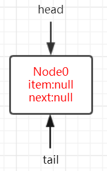

如图，head和tail指向同一个节点Node0，该节点item域为null,next域为null。即为ConcurrentLinkedQueue初始化状态。

## 1.3 操作Node的几个CAS操作
在队列进行出队入队的时候免不了对节点需要进行操作，在多线程就很容易出现线程安全的问题。

可以看出在处理器指令集能够支持`CMPXCHG`指令后，在java源码中涉及到并发处理都会使用CAS操作，那么在`ConcurrentLinkedQueue`对Node的CAS操作有这样几个：
```java
//更改Node中的数据域item   
boolean casItem(E cmp, E val) {
    return UNSAFE.compareAndSwapObject(this, itemOffset, cmp, val);
}
//更改Node中的指针域next
void lazySetNext(Node<E> val) {
    UNSAFE.putOrderedObject(this, nextOffset, val);
}
//更改Node中的指针域next
boolean casNext(Node<E> cmp, Node<E> val) {
    return UNSAFE.compareAndSwapObject(this, nextOffset, cmp, val);
}
```
可以看出这些方法实际上是通过调用UNSAFE实例的方法，UNSAFE为sun.misc.Unsafe类，该类是hotspot底层方法。
# 2.offer方法
在看多线程的代码时，可采用这样的思维方式：

* 单个线程offer

* 多个线程offer

* 部分线程offer，部分线程poll

存在以下两种情况：

### 1. offer的速度快于poll.

队列长度会越来越长，由于offer节点总是在对队列队尾，而poll节点总是在队列对头，也就是说offer线程和poll线程两者并无“交集”，

也就是说两类线程间并不会相互影响，

这种情况站在相对速率的角度来看，也就是一个"单线程offer"

### 2. offer的速度慢于poll

poll的相对速率快于offer，也就是队头删的速度要快于队尾添加节点的速度，导致的结果就是队列长度会越来越短，

而offer线程和poll线程就会出现“交集”，即那一时刻就可以称之为offer线程和poll线程同时操作的节点为**临界点**，且在该节点offer线程和poll线程必定相互影响。

根据在临界点时offer和poll发生的相对顺序又可从两个角度去思考：

1. 执行顺序为`offer-->poll-->offer`，即表现为当offer线程在Node1后插入Node2时，此时poll线程已经将Node1删除，这种情况很显然需要在offer方法中考虑； 

2. 执行顺序可能为：`poll-->offer-->poll`，即表现为当poll线程准备删除的节点为null时（队列为空队列），此时offer线程插入一个节点使得队列变为非空队列


创建一个ConcurrentLinkedQueue实例，先offer 1，然后再offer 2。
```java
1. ConcurrentLinkedQueue<Integer> queue = new ConcurrentLinkedQueue<>();
2. queue.offer(1);
3. queue.offer(2);
```
offer的源码为：
```java
public boolean offer(E e) {
1.    checkNotNull(e);
2.    final Node<E> newNode = new Node<E>(e);

3.    for (Node<E> t = tail, p = t;;) {
4.        Node<E> q = p.next;
5.        if (q == null) {
6.            // p is last node
7.            if (p.casNext(null, newNode)) {
                // Successful CAS is the linearization point
                // for e to become an element of this queue,
               // and for newNode to become "live".
8.                if (p != t) // hop two nodes at a time
9.                    casTail(t, newNode);  // Failure is OK.
10.                return true;
            }
            // Lost CAS race to another thread; re-read next
        }
11.        else if (p == q)
            // We have fallen off list.  If tail is unchanged, it
            // will also be off-list, in which case we need to
            // jump to head, from which all live nodes are always
            // reachable.  Else the new tail is a better bet.
12.            p = (t != (t = tail)) ? t : head;
           else
            // Check for tail updates after two hops.
13.            p = (p != t && t != (t = tail)) ? t : q;
    }
}
```
### 单线程执行角度分析：
#### 先从单线程执行的角度看起，分析`offer 1`的过程。

1. 第1行代码会对是否为null进行判断，为null的话就直接抛出空指针异常，

2. 第2行代码将e包装成一个Node类，

3. 第3行为for循环，只有初始化条件没有循环结束条件，这很符合CAS的“套路”，在循环体CAS操作成功会直接return返回，如果CAS操作失败的话就在for循环中不断重试直至成功。这里实例变量t被初始化为tail，p被初始化为t即tail。

4. 为了方便下面的理解，**p被认为队列真正的尾节点，tail不一定指向对象真正的尾节点，因为在ConcurrentLinkedQueue中tail是被延迟更新的，** 具体原因我们慢慢来看。

5. 代码走到第3行的时候，t和p都分别指向初始化时创建的item域为null，next域为null的Node0。

6. 第4行变量q被赋值为null，第5行if判断为true，

7. 在第7行使用casNext将插入的Node设置成当前队列尾节点p的next节点。

8. 如果CAS操作失败，此次循环结束，在下次循环中进行重试。

9. CAS操作成功走到第8行，此时p==t，if判断为false,直接return true返回。如果成功插入1的话，此时ConcurrentLinkedQueue的状态如下图所示：
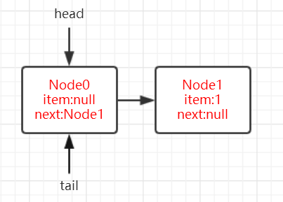

如图，此时队列的尾节点应该为Node1,而tail指向的节点依然还是Node0,因此可以说明**tail是延迟更新的**。

#### 继续来看`offer 2`的时候的情况：

很显然此时第4行q指向的节点不为null了，而是指向Node1,第5行if判断为false,第11行if判断为false,代码会走到第13行。好了，再插入节点的时候我们会问自己这样一个问题？上面已经解释了tail并不是指向队列真正的尾节点，那么在插入节点的时候，我们是不是应该最开始做的就是找到队列当前的尾节点在哪里才能插入？

那么第13行代码就是**找出队列真正的尾节点**。

#### 定位队列真正的队尾节点
```java
p = (p != t && t != (t = tail)) ? t : q;
```

我们来分析一下这行代码，

1. 如果这段代码在单线程环境执行时，很显然由于p==t,此时p会被赋值为q,而q等于`Node<E> q = p.next`，即Node1。

2. 在第一次循环中指针p指向了队列真正的队尾节点Node1，那么在下一次循环中第4行q指向的节点为null，那么在第5行中if判断为true,那么在第7行依然通过casNext方法设置p节点的next为当前新增的Node,

3. 接下来走到第8行，这个时候p!=t，第8行if判断为true,会通过`casTail(t, newNode)`将当前节点Node设置为队列的队尾节点,此时的队列状态示意图如下图所示：
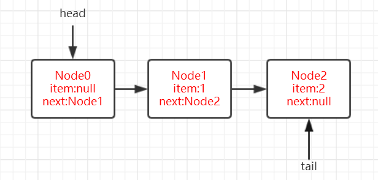

4. tail指向的节点由Node0改变为Node2,这里的casTail失败不需要重试的原因是，offer代码中主要是通过p的next节点q(`Node<E> q = p.next`)决定后面的逻辑走向的，当casTail失败时状态示意图如下：
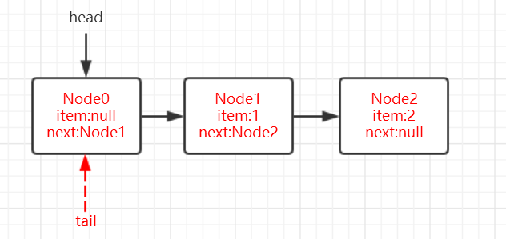
如图，如果这里casTail设置tail失败即tail还是指向Node0节点的话，无非就是多循环几次通过13行代码定位到队尾节点。

#### 通过对单线程执行角度进行分析，我们可以了解到poll的执行逻辑为：

1. 如果tail指向的节点的下一个节点（next域）为null的话，说明tail指向的节点即为队列真正的队尾节点，因此可以通过casNext插入当前待插入的节点,但此时tail并未变化。

2. 如果tail指向的节点的下一个节点（next域）不为null的话，说明tail指向的节点不是队列的真正队尾节点。通过q`（Node<E> q = p.next）`指针往前递进去找到队尾节点，然后通过casNext插入当前待插入的节点，并通过casTail方式更改tail。


### 多线程执行角度分析
我们回过头再来看`p = (p != t && t != (t = tail)) ? t : q;`这行代码在单线程中，这段代码永远不会将p赋值为t,那么这么写就不会有任何作用，那我们试着在多线程的情况下进行分析。
很显然这么写另有深意，其实在**多线程环境**下这行代码很有意思的。 `t != (t = tail)`这个操作**并非一个原子操作**，有这样一种情况：
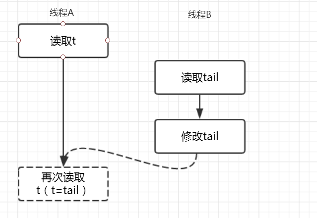

如图，假设线程A此时读取了变量t，线程B刚好在这个时候offer一个Node后，此时会修改tail指针,那么这个时候线程A再次执行t=tail时t会指向另外一个节点，

很显然线程A前后两次读取的变量t指向的节点不相同，即`t != (t = tail)为true`,并且由于t指向节点的变化`p != t`也为true，

此时该行代码的执行结果为p和t最新的t指针指向了同一个节点，并且此时t也是队列真正的对尾节点。

那么，现在已经定位到队列真正的队尾节点，就可以执行offer操作了。


那么还剩下第11行的代码我们没有分析，大致可以猜想到应该就是**回答一部分线程offer，一部分poll**(`offer->poll->offer`)的这种情况。当`if (p == q)`为true时，说明p指向的节点的next也指向它自己，这种节点称之为**哨兵节点**，这种节点在队列中存在的价值不大，一般表示为要删除的节点或者是空节点。为了能够很好的理解这种情况，我们先看看poll方法的执行过程后，再回过头来看。

# 3. poll方法
poll方法源码如下：
```java
public E poll() {
    restartFromHead:
    1. for (;;) {
    2.    for (Node<E> h = head, p = h, q;;) {
    3.        E item = p.item;

    4.        if (item != null && p.casItem(item, null)) {
                // Successful CAS is the linearization point
                // for item to be removed from this queue.
    5.            if (p != h) // hop two nodes at a time
    6.                updateHead(h, ((q = p.next) != null) ? q : p);
    7.            return item;
            }
    8.        else if ((q = p.next) == null) {
    9.            updateHead(h, p);
    10.            return null;
            }
    11.        else if (p == q)
    12.            continue restartFromHead;
            else
    13.            p = q;
        }
    }
}
```
### 单线程执行角度分析：
假设ConcurrentLinkedQueue初始状态如下图所示：
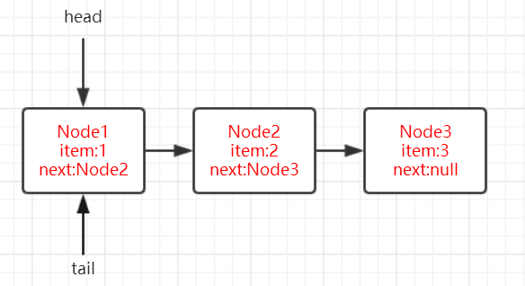
1. 参照offer时的定义，我们还是先将**变量p作为队列要删除真正的队头节点，h（head）指向的节点并不一定是队列的队头节点**。
2. 先来看poll出Node1时的情况，由于`p=h=head`，参照上图，很显然此时p指向的Node1的数据域不为null,在第4行代码中`item!=null`判断为true后接下来通过casItem将Node1的数据域设置为null。如果CAS设置失败则此次循环结束等待下一次循环进行重试。

3. 若第4行执行成功进入到第5行代码，此时p和h都指向Node1,第5行if判断为false,然后直接到第7行return回Node1的数据域1，方法运行结束，此时的队列状态如下图。

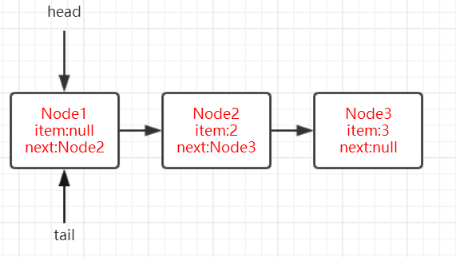

#### 定位删除的队头节点
1. 下面继续从队列中poll，很显然当前h和p指向的Node1的数据域为null，那么第一件事就是要定位准备删除的队头节点(找到数据域不为null的节点)。

2. 第三行代码item为null,第4行代码if判断为false,走到第8行代码（`(q = p.next) == null`）p.next是Node2，非空，所以if也为false，由于q指向了Node2,在第11行的if判断也为false，

3. 因此代码走到了第13行，这个时候p和q共同指向了Node2,也就找到了要删除的真正的队头节点。

4. 可以总结出，定位待删除的队头节点的过程为：如果当前节点的数据域为null，很显然该节点不是待删除的节点，就用当前节点的下一个节点去试探。在经过第一次循环后，此时状态图为下图：
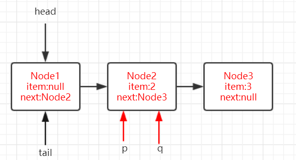

5. 进行下一次循环，第4行的操作同上述，当前假设第4行中casItem设置成功，由于p已经指向了Node2,而h还依旧指向Node1,此时第5行的if判断为true，

6. 然后执行`updateHead(h, ((q = p.next) != null) ? q : p)`，此时q指向的Node3，所以传入updateHead方法的分别是指向Node1的h引用和指向Node3的q引用。updateHead方法的源码为：

```java
final void updateHead(Node<E> h, Node<E> p) {
    if (h != p && casHead(h, p))
        h.lazySetNext(h);
}
```
6. 该方法主要是通过casHead将队列的head指向Node3,并且通过`h.lazySetNext`将Node1的next域指向它自己。最后在第7行代码中返回Node2的值。此时队列的状态如下图所示：
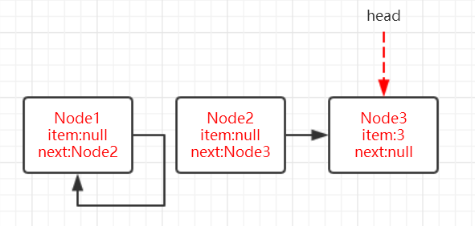

7. Node1的next域指向它自己，head指向了Node3。如果队列为空队列的话，就会执行到代码的第8行`(q = p.next) == null`，if判断为true,因此在第10行中直接返回null。

以上的分析是从单线程执行的角度去看，也可以让我们了解poll的整体思路，现在来做一个总结：

1. 如果当前head,h和p指向的节点的Item不为null的话，说明该节点即为真正的队头节点（待删除节点），只需要通过casItem方法将item域设置为null,然后将原来的item直接返回即可。

2. 如果当前head,h和p指向的节点的item为null的话，则说明该节点不是真正的待删除节点，那么应该做的就是寻找item不为null的节点。通过让q指向p的下一个节点（`q = p.next`）进行试探，若找到则通过updateHead方法更新head指向的节点以及构造哨兵节点（通过`updateHead`方法的`h.lazySetNext(h)`）。

### 多线程执行角度分析：
现在回过头来看poll方法的源码，有这样一部分：
```java
else if (p == q)
    continue restartFromHead;
```
这一部分就是处理多个线程poll的情况，`q = p.next`也就是说q永远指向的是p的下一个节点，那么什么情况下会使得p,q指向同一个节点呢？

根据上面我们的分析，只有p指向的节点在poll的时候转变成了**哨兵节点**（通过updateHead方法中的h.lazySetNext）。

当线程A在判断p==q时，线程B已经将执行完poll方法将p指向的节点转换为哨兵节点并且head指向的节点已经发生了改变，

所以就需要从restartFromHead处执行，保证用到的是最新的head。

> 如果当前队列为空队列，线程A进行poll操作，同时线程B执行offer，然后线程A在执行poll，那么此时线程A返回的是null还是线程B刚插入的最新的那个节点呢？
poll->offer->poll

```java
public static void main(String[] args) {
    Thread thread1 = new Thread(() -> {
        Integer value = queue.poll();
        System.out.println(Thread.currentThread().getName() + " poll 的值为：" + value);
        System.out.println("queue当前是否为空队列：" + queue.isEmpty());
    });
    thread1.start();
    Thread thread2 = new Thread(() -> {
        queue.offer(1);
    });
    thread2.start();
}
```
输出结果为：
```shell
Thread-0 poll 的值为：null
queue当前是否为空队列：false
```

##### 通过debug控制线程thread1和线程thread2的执行顺序
1. thread1先执行到第8行代码if ((q = p.next) == null)，由于此时队列为空队列if判断为true，

2. 进入if块，此时先让thread1暂停，然后thread2进行offer插入值为1的节点后，thread2执行结束。再让thread1执行，

3. 这时thread1并没有进行重试，而是代码继续往下走，返回null，尽管此时队列由于thread2已经插入了值为1的新的节点。

4. 所以输出结果为thread0 poll的为null,然而队列不为空队列。

5. 因此，在判断队列是否为空队列的时候**是不能通过线程在poll的时候返回为null进行判断的，可以通过isEmpty方法进行判断**。


# 4. offer方法中部分线程offer部分线程poll
在分析offer方法的时候我们还留下了一个问题，即对offer方法中第11行代码的理解。
> offer->poll->offer


1. 在offer方法的第11行代码if (p == q)，能够让if判断为true的情况为p指向的节点为哨兵节点，而什么时候会构造哨兵节点呢？

2. 在对poll方法的讨论中，我们已经找到了答案，**即当head指向的节点的item域为null时会寻找真正的队头节点，等到待插入的节点插入之后，会更新head，并且将原来head指向的节点设置为哨兵节点**。假设队列初始状态如下图所示：
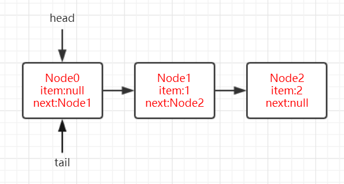

3. 因此在线程A执行offer时，线程B执行poll就会存在如下一种情况：
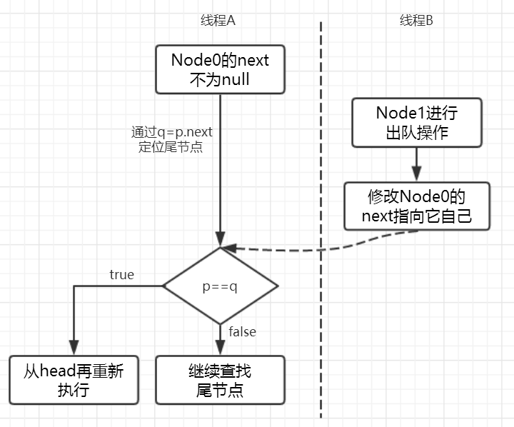
如图，线程A的tail节点存在next节点Node1,因此会通过引用q往前寻找队列真正的队尾节点.

4. 当执行到判断if (p == q)时，此时线程B执行poll操作，在对线程B来说，head和p指向Node0,由于Node0的item域为null,同样会往前递进找到队列真正的队头节点Node1,在线程B执行完poll之后，Node0就会转换为哨兵节点，也就意味着队列的head发生了改变，此时队列状态为下图。

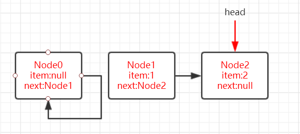
5. 此时线程A在执行判断`if (p == q)`时就为true,会继续执行`p = (t != (t = tail)) ? t : head;`，由于tail指针没有发生改变所以p被赋值为head,重新从head开始完成插入操作。

# 5. HOPS的设计

通过上面对offer和poll方法的分析，我们发现tail和head是延迟更新的，两者更新触发时机为：

* tail更新触发时机：当tail指向的节点的下一个节点不为null的时候，会执行定位队列真正的队尾节点的操作，找到队尾节点后完成插入之后才会通过casTail进行tail更新；当tail指向的节点的下一个节点为null的时候，只插入节点不更新tail。

* head更新触发时机：当head指向的节点的item域为null的时候，会执行定位队列真正的队头节点的操作，找到队头节点后完成删除之后才会通过updateHead进行head更新；当head指向的节点的item域不为null的时候，只删除节点不更新head。

并且在更新操作时，源码中会有注释为：`hop two nodes at a time`。所以这种延迟更新的策略就被叫做HOPS的大概原因是这个（猜的 :)），从上面更新时的状态图可以看出，head和tail的更新是“跳着的”即中间总是间隔了一个。那么这样设计的意图是什么呢？

如果让tail永远作为队列的队尾节点，实现的代码量会更少，而且逻辑更易懂。但是，这样做有一个缺点，如果大量的入队操作，每次都要执行CAS进行tail的更新，汇总起来对性能也会是大大的损耗。如果能减少CAS更新的操作，无疑可以大大提升入队的操作效率，所以doug lea大师每间隔1次（tail和队尾节点的距离为1）进行才利用CAS更新tail。对head的更新也是同样的道理，虽然，这样设计会多出在循环中定位队尾节点，但总体来说读的操作效率要远远高于写的性能，因此，多出来的在循环中定位尾节点的操作的性能损耗相对而言是很小的。

