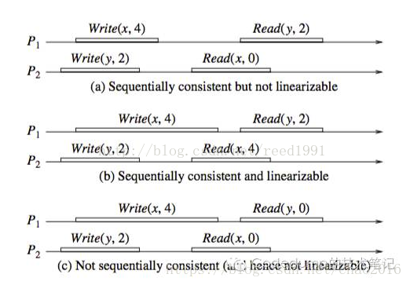
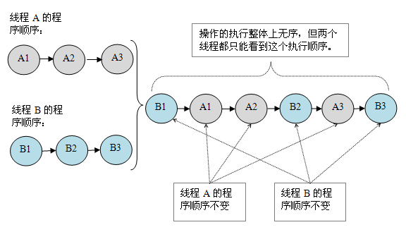

[TOC]
> 引言：针对读多写少的场景，可以使用ReenTrantReadWriteLock，通过读写分离的思想，使得读读之间不会阻塞，无疑如果一个list能够做到被多个读线程读取的话，性能会大大提升不少。但是，如果仅仅是将list通过读写锁（ReentrantReadWriteLock）进行再一次封装的话，由于读写锁的特性，当写锁被写线程获取后，读写线程都会被阻塞。
CopyOnWriteArrayList容器可以保证线程安全，保证读读之间在任何时候都不会被阻塞，

# 1. CopyOnWriteArrayList的设计思想
如果简单的使用读写锁的话，在写锁被获取之后，读写线程被阻塞，只有当写锁被释放后读线程才有机会获取到锁从而读到最新的数据，站在读线程的角度来看，即**读线程任何时候都是获取到最新的数据，满足数据实时性。**

既然我们说到要进行优化，必然有trade-off,我们就可以牺牲数据实时性满足数据的最终一致性即可。而CopyOnWriteArrayList就是通过Copy-On-Write(COW)，即**写时复制的思想来通过延时更新的策略来实现数据的最终一致性，并且能够保证读线程间不阻塞。**

COW通俗的理解是:
* 当我们往一个容器添加元素的时候，不直接往当前容器添加，而是先将当前容器进行Copy，复制出一个新的容器，然后新的容器里添加元素，添加完元素之后，再将原容器的引用指向新的容器。

* 对CopyOnWrite容器进行并发的读的时候，不需要加锁，因为当前容器不会添加任何元素。

* 所以CopyOnWrite容器也是一种读写分离的思想，**延时更新的策略是通过在写的时候针对的是不同的数据容器来实现的，放弃数据实时性达到数据的最终一致性。**
# 2. CopyOnWriteArrayList的实现原理
CopyOnWriteArrayList内部维护的就是一个数组：
```java
/** The array, accessed only via getArray/setArray. */
private transient volatile Object[] array;
```
并且该数组引用是被volatile修饰，**注意这里仅仅是修饰的是数组引用**。

## 2.1 get方法实现原理
get方法的源码为：
```java
public E get(int index) {
    return get(getArray(), index);
}
/**
 * Gets the array.  Non-private so as to also be accessible
 * from CopyOnWriteArraySet class.
 */
final Object[] getArray() {
    return array;
}
private E get(Object[] a, int index) {
    return (E) a[index];
}
```
可以看出来get方法实现非常简单，几乎就是一个“单线程”程序，没有对多线程添加任何的线程安全控制，也没有加锁也没有CAS操作等等，原因是，所有的读线程只是会读取数据容器中的数据，并不会进行修改。
## 2.2 add方法实现原理
add方法的源码为：
```java
public boolean add(E e) {
    final ReentrantLock lock = this.lock;
    //1. 使用Lock,保证写线程在同一时刻只有一个
    lock.lock();
    try {
        //2. 获取旧数组引用
        Object[] elements = getArray();
        int len = elements.length;
        //3. 创建新的数组，并将旧数组的数据复制到新数组中
        Object[] newElements = Arrays.copyOf(elements, len + 1);
        //4. 往新数组中添加新的数据            
        newElements[len] = e;
        //5. 将旧数组引用指向新的数组
        setArray(newElements);
        return true;
    } finally {
        lock.unlock();
    }
}
```
需要注意这么几点：

1. 采用ReentrantLock，保证同一时刻只有一个写线程正在进行数组的复制，否则的话内存中会有多份被复制的数据；

2. 前面说过数组引用是volatile修饰的，因此将旧的数组引用指向新的数组，根据volatile的happens-before规则，写线程对数组引用的修改对读线程是可见的。

3. 由于在写数据的时候，是在新的数组中插入数据的，从而保证读写实在两个不同的数据容器中进行操作。

# 3. 问题
## 3.1 COW与读写锁的区别
COW和读写锁都是通过读写分离的思想实现的，但两者还是有些不同，可以进行比较：
#### 相同点：
1.两者都是通过读写分离的思想实现；

2.读线程间是互不阻塞的

#### 不同点：
读写锁：对读线程而言，为了实现数据实时性，在写锁被获取后，读线程会等待或者当读锁被获取后，写线程会等待，从而解决“脏读”等问题。也就是说如果使用读写锁依然会出现读线程阻塞等待的情况。

COW：COW则**完全放开了牺牲数据实时性而保证数据最终一致性**，即读线程对数据的更新是**延时感知**的，因此读线程不会存在等待的情况。

## 3.2 为什么要设置新数据进行复制
因为这里volatile的修饰的仅仅只是数组引用，数组中的元素的修改是不能保证可见性的。

> 这也是为什么concurrentHashMap只具有弱一致性的原因。
> HashEntry的数组 table被volatile修饰，但是这样只是代表table的引用地址如果被修改，其他线程可以立马看到，并不代表table里的数据被修改立马可以看到。

## 3.3 COW的缺点
CopyOnWrite容器有很多优点，但是同时也存在两个问题，即内存占用问题和数据一致性问题。所以在开发的时候需要注意一下。

* 内存占用问题：因为CopyOnWrite的写时复制机制，所以在进行写操作的时候，内存里会同时驻扎两个对 象的内存，旧的对象和新写入的对象（注意:在复制的时候只是复制容器里的引用，只是在写的时候会创建新对 象添加到新容器里，而旧容器的对象还在使用，所以有两份对象内存）。如果这些对象占用的内存比较大，比 如说200M左右，那么再写入100M数据进去，内存就会占用300M，那么这个时候很有可能造成频繁的minor GC和major GC。

* 数据一致性问题：CopyOnWrite容器只能保证数据的最终一致性，不能保证数据的实时一致性。所以如果你希望写入的的数据，马上能读到，请不要使用CopyOnWrite容器。

> 关于一致性

一致性（Consistency）是指多副本（Replications）问题中的数据一致性。可以分为强一致性、顺序一致性与弱一致性。
#### 1. 强一致性（Strict Consistency）

也称为：原子一致性（Atomic Consistency）或 线性一致性（Linearizable Consistency）

两个要求：

* 任何一次读都能读到某个数据的最近一次写的数据。

* 系统中的所有进程，看到的操作顺序，都和全局时钟下的顺序一致。

简言之，在任意时刻，所有节点中的数据是一样的。

#### 2. 顺序一致性（Sequential Consistency）

* 任何一次读都能读到某个数据的最近一次写的数据。

* 系统的所有进程的顺序一致，而且是合理的。即不需要和全局时钟下的顺序一致，错的话一起错，对的话一起对。

##### 举例说明：

1. 图a是满足顺序一致性，但是不满足强一致性的。原因在于，从全局时钟的观点来看，P2进程对变量X的读操作在P1进程对变量X的写操作之后，然而读出来的却是旧的数据。但是这个图却是满足顺序一致性的，因为两个进程P1，P2的一致性并没有冲突。每个进程内部的读写顺序都是合理的，但是这个顺序与全局时钟下看到的顺序并不一样。如下图：



2. 图b满足强一致性，因为每个读操作都读到了该变量的最新写的结果，同时两个进程看到的操作顺序与全局时钟的顺序一样。

3. 图c不满足顺序一致性，当然也就不满足强一致性了。因为从进程P1的角度看，它对变量Y的读操作返回了结果0。那么就是说，P1进程的对变量Y的读操作在P2进程对变量Y的写操作之前，从进程P2的角度看，最后一个对变量x的读操作读出来也是旧的数据。因此不满足顺序一致性。

#### 3. 弱一致性
数据更新后，如果能容忍后续的访问只能访问到部分或者全部访问不到，则是弱一致性。

最终一致性就属于弱一致性。

#### 4. 最终一致性

不保证在任意时刻任意节点上的同一份数据都是相同的，但是随着时间的迁移，不同节点上的同一份数据总是在向趋同的方向变化。

简单说，就是在一段时间后，节点间的数据会最终达到一致状态。

最终一致性根据更新数据后各进程访问到数据的时间和方式的不同，又可以区分为：

* 因果一致性（Casual Consistency）。如果进程A通知进程B它已更新了一个数据项，那么进程B的后续访问将返回更新后的值，且一次写入将保证取代前一次写入。与进程A无因果关系的进程C的访问，遵守一般的最终一致性规则。

* “读己之所写（read-your-writes）”一致性。当进程A自己更新一个数据项之后，它总是访问到更新过的值，绝不会看到旧值。这是因果一致性模型的一个特例。

* 会话（Session）一致性。这是上一个模型的实用版本，它把访问存储系统的进程放到会话的上下文中。只要会话还存在，系统就保证“读己之所写”一致性。如果由于某些失败情形令会话终止，就要建立新的会话，而且系统的保证不会延续到新的会话。

* 单调（Monotonic）读一致性。如果进程已经看到过数据对象的某个值，那么任何后续访问都不会返回在那个值之前的值。

* 单调写一致性。系统保证来自同一个进程的写操作顺序执行。要是系统不能保证这种程度的一致性，就非常难以编程了。


# 4. 使用
## 4.1 JDK中并没有提供CopyOnWriteMap，我们可以参考CopyOnWriteArrayList来实现一个
```java
import java.util.Collection;
import java.util.Map;
import java.util.Set;

public class CopyOnWriteMap<K, V> implements Map<K, V>, Cloneable {
    private volatile Map<K, V> internalMap;

    public CopyOnWriteMap() {
        internalMap = new HashMap<K, V>();
    }

    public V put(K key, V value) {

        synchronized (this) {
            Map<K, V> newMap = new HashMap<K, V>(internalMap);
            V val = newMap.put(key, value);
            internalMap = newMap;
            return val;
        }
    }

    public V get(Object key) {
        return internalMap.get(key);
    }

    public void putAll(Map<? extends K, ? extends V> newData) {
        synchronized (this) {
            Map<K, V> newMap = new HashMap<K, V>(internalMap);
            newMap.putAll(newData);
            internalMap = newMap;
        }
    }
}
```
实现很简单，只要了解了CopyOnWrite机制，我们可以实现各种CopyOnWrite容器，并且在不同的应用场景中使用。

## 4.2 CopyOnWrite的应用场景
CopyOnWrite并发容器用于读多写少的并发场景。比如白名单，黑名单，商品类目的访问和更新场景，假如我们有一个搜索网站，用户在这个网站的搜索框中，输入关键字搜索内容，但是某些关键字不允许被搜索。**这些不能被搜索的关键字会被放在一个黑名单当中，黑名单每天晚上更新一次。当用户搜索时，会检查当前关键字在不在黑名单当中，如果在，则提示不能搜索**。实现代码如下：
```java
package com.ifeve.book;

import java.util.Map;

import com.ifeve.book.forkjoin.CopyOnWriteMap;

/**
 * 黑名单服务
 *
 * @author fangtengfei
 *
 */
public class BlackListServiceImpl {

    private static CopyOnWriteMap<String, Boolean> blackListMap = new CopyOnWriteMap<String, Boolean>(1000);

    public static boolean isBlackList(String id) {
        return blackListMap.get(id) == null ? false : true;
    }

    public static void addBlackList(String id) {
        blackListMap.put(id, Boolean.TRUE);
    }

    /**
     * 批量添加黑名单
     *
     * @param ids
     */
    public static void addBlackList(Map<String,Boolean> ids) {
        blackListMap.putAll(ids);
    }

}
```