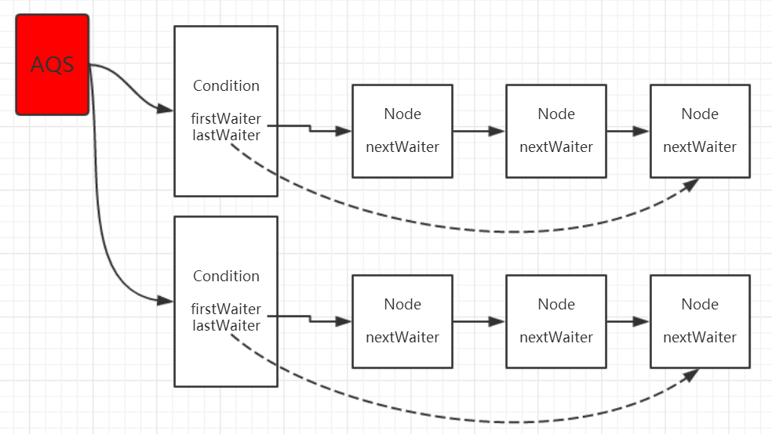
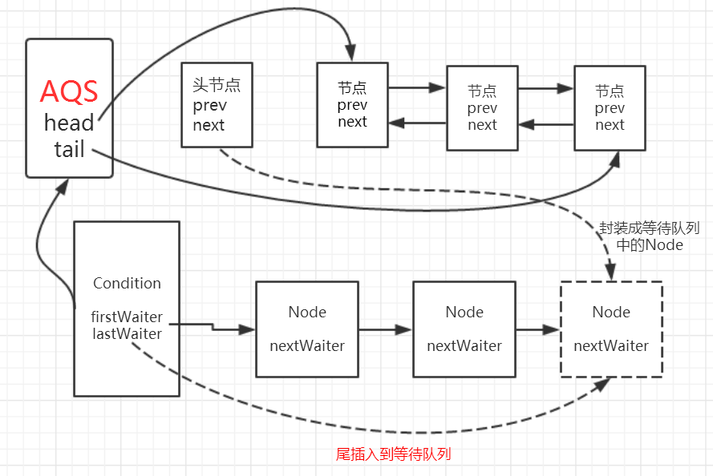
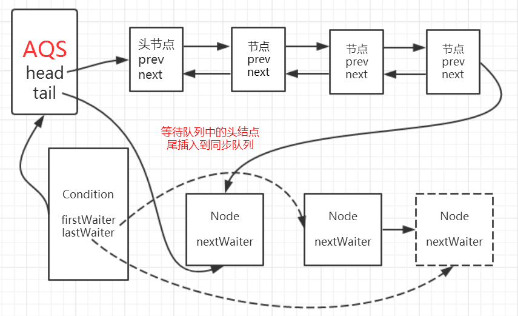
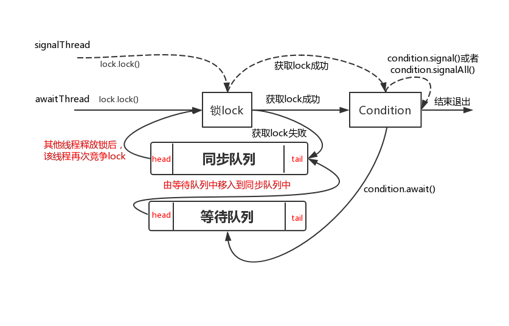

[TOC]
# 1. Condition介绍
Condition是在JDK1.5中才出现的，它可以替代传统的Object中的wait()、notify()和notifyAll()方法来实现线程间的通信，使线程间协作更加安全和高效。

Condition是一个接口，它的定义如下：
```java
public interface Condition {
    void await() throws InterruptedException;
    
    void awaitUninterruptibly();
    
    long awaitNanos(long nanosTimeout) throws InterruptedException;
    
    boolean await(long time, TimeUnit unit) throws InterruptedException;
    
    boolean awaitUntil(Date deadline) throws InterruptedException;
    
    void signal();
    
    void signalAll();
}
```
常用的方法是await()、signal()和signalAll()，Condition与Object类中的方法对应如下：

|Object	|Condition|
| --- | --- |
|wait()	|await()|
|notify()	|signal()|
|notifyAll()	|signalAll()|

Condition需要和Lock一起使用，在不使用Lock时，使用关键字synchronized时的代码如下：
```java
synchronized(obj){ 
    obj.wait();
}
synchronized(obj){ 
    obj.notify();
}
```
使用Lock时的代码如下：
```java
lock.lock(); 
condition.await(); 
lock.unlock();

lock.lock(); 
condition.signal(); 
lock.unlock();
```

从代码上可以看出，

* 使用synchronized关键字时，所有没有获取锁的线程都会等待，这时相当于只有1个等待队列；

* 而在实际应用中可能有时需要多个等待队列，比如ReadLock和WriteLock。

* Lock中的等待队列和Condition中的等待队列是分开的，

* 例如在独占模式下，Lock的独占保证了在同一时刻只会有一个线程访问临界区，也就是lock()方法返回后，Condition中的等待队列保存着被阻塞的线程，也就是调用await()方法后阻塞的线程。

* 所以使用lock比使用synchronized关键字更加灵活。

# 2. Condition的使用

在Condition接口的javadoc中，有一个很好的例子来使用Condition，代码如下：
```java
class BoundedBuffer {
    final Lock lock = new ReentrantLock();
    final Condition notFull  = lock.newCondition(); 
    final Condition notEmpty = lock.newCondition(); 
     
    final Object[] items = new Object[100];
    int putptr, takeptr, count;
     
    public void put(Object x) throws InterruptedException {
        lock.lock();
        try {
            while (count == items.length)
                notFull.await();
            items[putptr] = x;
            if (++putptr == items.length) putptr = 0;
            ++count;
            notEmpty.signal();
        } finally {
            lock.unlock();
        }
    }
     
    public Object take() throws InterruptedException {
        lock.lock();
        try {
            while (count == 0)
                notEmpty.await();
            Object x = items[takeptr];
            if (++takeptr == items.length) takeptr = 0;
            --count;
            notFull.signal();
            return x;
        } finally {
            lock.unlock();
        }
    }
}
```
代码很简单，

定义了一个数组items，put用于向items中添加数据，take用于从items中取出数据，

count代表当前items中存放了多少个对象，putptr表示下一个需要添加的索引，takeptr表示下一个需要取出的索引，

这样就实现了数组的循环添加和取出数据的功能。put和take的具体功能如下：

### put:
* 当count与items的长度相同时，表示数组已满，则调用`notFull.await()`来等待同时释放了当前线程的锁；

* 当线程被唤醒时，将x添加到putptr索引的位置；

* 如果当前putptr的位置是最后一个，则下一个索引的位置从0开始；

* 调用`notEmpty.signal();`通知其他线程可以从数组中取出数据了。

### take:

* 当count为0时，表示数组是空的，则调用`notEmpty.await()`来等待同时释放了当前线程的锁；

* 当线程被唤醒时，将x添加到takeptr索引的位置；

* 如果当前takeptr的位置是最后一个，则下一个索引的位置从0开始；

* 调用`notFull.signal();`通知其他线程可以向数组中添加数据了。

# 3. AQS中Condition的实现

本文还是通过ReentrantLock来分析。

## 3.1 等待队列

Condition必须被绑定到一个独占锁上使用，在ReentrantLock中，有一个newCondition方法，该方法调用了Sync中的newCondition方法，看下Sync中newCondition的实现：

```java
final ConditionObject newCondition() {
    return new ConditionObject();
}
```
ConditionObject该类是AQS的一个内部类，AQS内部维护了一个同步队列，如果是独占式锁的话，所有获取锁失败的线程的尾插入到同步队列，

同样的，condition内部也是使用同样的方式，内部维护了一个 **等待队列**，所有调用condition.await方法的线程会加入到等待队列中，并且线程状态转换为等待状态。

该类有两个重要的变量：
```java
/** First node of condition queue. */
private transient Node firstWaiter;
/** Last node of condition queue. */
private transient Node lastWaiter;
```

这样我们就可以看出来ConditionObject通过持有等待队列的头尾指针来管理等待队列。

该Node类复用了在AQS中的Node类，Node类有这样一个属性：
```java
//后继节点
Node nextWaiter;
```
进一步说明，等待队列是一个**单向队列**。


我们可以多次调用lock.newCondition()方法创建多个condition对象，也就是一个lock可以持有多个等待队列。而在之前利用Object的方式实际上是指在**对象Object对象监视器上只能拥有一个同步队列和一个等待队列，而并发包中的Lock拥有一个同步队列和多个等待队列。**示意图如下：


如图所示，ConditionObject是AQS的内部类，因此每个ConditionObject能够访问到AQS提供的方法，相当于每个Condition都拥有所属同步器的引用。


## 3.2 await实现原理

当调用condition.await()方法后会使得当前获取lock的线程进入到等待队列，**如果该线程能够从await()方法返回的话一定是该线程获取了与condition相关联的lock。** await()方法源码为：
```java
public final void await() throws InterruptedException {
    if (Thread.interrupted())
        throw new InterruptedException();
    // 1. 将当前线程包装成Node，尾插入到等待队列中
    Node node = addConditionWaiter();
    // 2. 释放当前线程所占用的lock，在释放的过程中会唤醒同步队列中的下一个节点
    int savedState = fullyRelease(node);
    int interruptMode = 0;
    while (!isOnSyncQueue(node)) {
        // 3. 当前线程进入到等待状态
        LockSupport.park(this);
        if ((interruptMode = checkInterruptWhileWaiting(node)) != 0)
            break;
    }
    // 4. 自旋等待获取到同步状态（即获取到lock）
    if (acquireQueued(node, savedState) && interruptMode != THROW_IE)
        interruptMode = REINTERRUPT;
    if (node.nextWaiter != null) // clean up if cancelled
        unlinkCancelledWaiters();
    // 5. 处理被中断的情况
    if (interruptMode != 0)
        reportInterruptAfterWait(interruptMode);
}
```

当前线程调用condition.await()方法后，会使得当前线程释放lock然后加入到等待队列中，直至被signal/signalAll后会使得当前线程从等待队列中移至到同步队列中去，直到获得了lock后才会从await方法返回，或者在等待时被中断会做中断处理。

那么关于这个实现过程我们会有这样几个问题：

1. 是怎样将当前线程添加到等待队列中去的？

2. 释放锁的过程？

3. 怎样才能从await方法退出？


在第1步中调用`addConditionWaiter`将当前线程添加到等待队列中，该方法源码为：
```java
private Node addConditionWaiter() {
    Node t = lastWaiter;
    // If lastWaiter is cancelled, clean out.
    if (t != null && t.waitStatus != Node.CONDITION) {
        unlinkCancelledWaiters();
        t = lastWaiter;
    }
    //将当前线程包装成Node
    Node node = new Node(Thread.currentThread(), Node.CONDITION);
    if (t == null)
        firstWaiter = node;
    else
        //尾插入
        t.nextWaiter = node;
    //更新lastWaiter
    lastWaiter = node;
    return node;
}
```
将当前线程包装成Node，如果等待队列的firstWaiter为null的话（等待队列为空队列），则将firstWaiter指向当前的Node,否则，更新lastWaiter(尾节点)即可。

就是通过尾插入的方式将当前线程封装的Node插入到等待队列中即可，

同时可以看出等待队列是一个不带头结点的链式队列，之前我们学习AQS时知道同步队列是一个带头结点的链式队列，这是两者的一个区别。

将当前节点插入到等待对列之后，会使当前线程释放lock，由fullyRelease方法实现，
```java
// 2. 释放当前线程所占用的lock，在释放的过程中会唤醒同步队列中的下一个节点
int savedState = fullyRelease(node);
```

`fullyRelease`源码:
```java
final int fullyRelease(Node node) {
    boolean failed = true;
    try {
        int savedState = getState();
        if (release(savedState)) {
            //成功释放同步状态
            failed = false;
            return savedState;
        } else {
            //不成功释放同步状态抛出异常
            throw new IllegalMonitorStateException();
        }
    } finally {
        if (failed)
            node.waitStatus = Node.CANCELLED;
    }
}
```
调用AQS的模板方法release方法释放AQS的同步状态并且唤醒在同步队列中头结点的后继节点引用的线程，如果释放成功则正常返回，若失败的话就抛出异常。

怎样从await方法退出？现在回过头再来看await方法有这样一段逻辑：
```java
while (!isOnSyncQueue(node)) {
    // 3. 当前线程进入到等待状态
    LockSupport.park(this);
    if ((interruptMode = checkInterruptWhileWaiting(node)) != 0)
        break;
}
// 4. 自旋等待获取到同步状态（即获取到lock）
    if (acquireQueued(node, savedState) && interruptMode != THROW_IE)
        interruptMode = REINTERRUPT;
```

很显然，当线程第一次调用condition.await()方法时，会进入到这个while()循环中，然后通过LockSupport.park(this)方法使得当前线程进入等待状态，

那么要想退出这个await方法第一个前提条件自然而然的是要先退出这个while循环，

出口就只剩下两个地方：

1. 逻辑走到break退出while循环；

2. while循环中的逻辑判断为false。

出现第1种情况的条件是当前等待的线程被中断后代码会走到break退出，

第2种情况是当前节点被移动到了同步队列中（即另外线程调用的condition的signal或者signalAll方法），while中逻辑判断为false后结束while循环。

总结下，就是当前线程被中断或者调用condition.signal/condition.signalAll方法当前节点移动到了同步队列后 ，这是当前线程退出await方法的前提条件。

当退出while循环后就会调用acquireQueued(node, savedState)，该方法的作用是在自旋过程中线程不断尝试获取同步状态，直至成功（线程获取到lock）。

这样也说明了退出await方法必须是已经获得了condition引用（关联）的lock。即如果获取到信号（包括中断或者condition.signal）后，并不会马上就运行await方法后面的程序，必须得获取到锁以后才会运行。


await方法示意图如下图：



`isOnSyncQueue`方法:
```java
final boolean isOnSyncQueue(Node node) {
    if (node.waitStatus == Node.CONDITION || node.prev == null)
        return false;
    if (node.next != null) // If has successor, it must be on queue
        return true;
    /*
     * node.prev can be non-null, but not yet on queue because
     * the CAS to place it on queue can fail. So we have to
     * traverse from tail to make sure it actually made it.  It
     * will always be near the tail in calls to this method, and
     * unless the CAS failed (which is unlikely), it will be
     * there, so we hardly ever traverse much.
     */
    return findNodeFromTail(node);
}
```
该方法判断当前线程的node是否在AQS的同步队列中。

1. 如果当前线程node的状态是CONDITION或者node.prev为null时说明已经在Condition队列中了，所以返回false；

2. 如果node.next不为null，说明在同步队列中，返回true；

3. 如果两个if都未返回时，可以断定node的prev一定不为null，next一定为null，这个时候可以认为node正处于放入Sync队列的执行CAS操作执行过程中。而这个CAS操作有可能失败，所以通过`findNodeFromTail`再尝试一次判断。

> 超时机制的支持

condition还额外支持了超时机制，使用者可调用方法awaitNanos,awaitUtil。这两个方法的实现原理，基本上与AQS中的tryAcquire方法如出一辙

> 不响应中断的支持
要想不响应中断可以调用condition.awaitUninterruptibly()方法，该方法的源码为：
```java
public final void awaitUninterruptibly() {
    Node node = addConditionWaiter();
    int savedState = fullyRelease(node);
    boolean interrupted = false;
    while (!isOnSyncQueue(node)) {
        LockSupport.park(this);
        if (Thread.interrupted())
            interrupted = true;
    }
    if (acquireQueued(node, savedState) || interrupted)
        selfInterrupt();
}
```
这段方法与上面的await方法基本一致，只不过减少了对中断的处理，并省略了reportInterruptAfterWait方法抛被中断的异常。

## 3.3 signal/signalAll实现原理

### signal
按照等待队列是先进先出（FIFO）的原则，调用condition的signal或者signalAll方法可以将等待队列中头节点移动到同步队列中，signal方法源码为：
```java
public final void signal() {
    //1. 先检测当前线程是否已经获取lock
    if (!isHeldExclusively())
        throw new IllegalMonitorStateException();
    //2. 获取等待队列中第一个节点，之后的操作都是针对这个节点
    Node first = firstWaiter;
    if (first != null)
        doSignal(first);
}
```
signal方法首先会检测当前线程是否已经获取lock，如果没有获取lock会直接抛出异常，如果获取的话再得到等待队列的头指针引用的节点，之后的操作的doSignal方法也是基于该节点。下面我们来看看doSignal方法做了些什么事情，doSignal方法源码为：
```java
private void doSignal(Node first) {
    do {
        if ( (firstWaiter = first.nextWaiter) == null)
            lastWaiter = null;
        //1. 将头结点从等待队列中移除
        first.nextWaiter = null;
        //2. while中transferForSignal方法对头结点做真正的处理
    } while (!transferForSignal(first) &&
             (first = firstWaiter) != null);
}
```
真正对头节点做处理的逻辑在transferForSignal里，该方法源码为：
```java
final boolean transferForSignal(Node node) {
    /*
     * If cannot change waitStatus, the node has been cancelled.
     */
    //1. 更新状态为0,0表示新结点入队时的默认状态
    if (!compareAndSetWaitStatus(node, Node.CONDITION, 0))
        return false;

    /*
     * Splice onto queue and try to set waitStatus of predecessor to
     * indicate that thread is (probably) waiting. If cancelled or
     * attempt to set waitStatus fails, wake up to resync (in which
     * case the waitStatus can be transiently and harmlessly wrong).
     */
    //2.将该节点移入到同步队列中去
    Node p = enq(node);
    int ws = p.waitStatus;
    if (ws > 0 || !compareAndSetWaitStatus(p, ws, Node.SIGNAL))
        LockSupport.unpark(node.thread);
    return true;
}
```

这段代码主要做了两件事情：

1. 将头结点的状态更改为CONDITION；

2. 调用enq方法，将该节点尾插入到同步队列中，

现在我们可以得出结论：

调用condition的signal的前提条件是当前线程已经获取了lock，该方法会使得等待队列中的头节点移入到同步队列，而移入到同步队列后才有机会使得等待线程被唤醒，

即从await方法中的LockSupport.park(this)方法中返回，

从而才有机会使得调用await方法的线程成功退出。

signal执行示意图如下图：


### signalAll

sigllAll与sigal方法的区别体现在doSignalAll方法上，前面我们已经知道**doSignal方法只会对等待队列的头节点进行操作**，而doSignalAll的源码为：
```java
private void doSignalAll(Node first) {
    lastWaiter = firstWaiter = null;
    do {
        Node next = first.nextWaiter;
        first.nextWaiter = null;
        transferForSignal(first);
        first = next;
    } while (first != null);
}
```

该方法只不过时间等待队列中的每一个节点都移入到同步队列中，即**通知**当前调用`condition.await()`方法的每一个线程。

## 3.4 await与signal/signalAll的结合思考
await和signal和signalAll方法就像一个开关控制着线程A（等待方）和线程B（通知方）。它们之间的关系可以用下面一个图来表现得更加贴切：



如图，线程awaitThread先通过`lock.lock()`方法获取锁成功后调用了`condition.await`方法进入等待队列，

而另一个线程signalThread通过`lock.lock()`方法获取锁成功后调用了`condition.signal`或者`signalAll`方法，使得线程awaitThread能够有机会移入到同步队列中，

当其他线程释放lock后使得线程awaitThread能够有机会获取lock，从而使得线程awaitThread能够从await方法中退出执行后续操作。

如果awaitThread获取lock失败会直接进入到同步队列。

