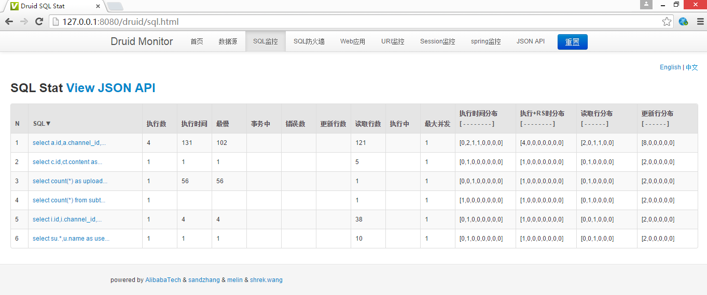

[TOC]
# 1.配置Druid的内置监控

首先在Maven项目的pom.xml中引入包
```xml
<dependency>
    <groupId>com.alibaba</groupId>
    <artifactId>druid</artifactId>
    <version>${druid-version}</version>
</dependency>
```
# 2.引入包后配置spring的配置文件
```xml
<!--读取配置文件-->
<bean id="propertyConfigurer" class="org.springframework.beans.factory.config.PropertyPlaceholderConfigurer">
    <property name="locations">
         <list>
             <value>classpath:jdbc.properties</value>
         </list>
     </property>
</bean>

<!-- Druid JNDI DataSource for J2EE environments -->
<bean id="dataSource" class="com.alibaba.druid.pool.DruidDataSource" init-method="init" destroy-method="close">
    <property name="url" value="${jdbc.url}" />
    <property name="username" value="${jdbc.username}" />
    <property name="password" value="${jdbc.password}" />

    <property name="maxActive" value="20" />
    <property name="initialSize" value="1" />
    <property name="maxWait" value="60000" />
    <property name="minIdle" value="1" />

    <property name="timeBetweenEvictionRunsMillis" value="3000" />
    <property name="minEvictableIdleTimeMillis" value="300000" />

    <property name="validationQuery" value="SELECT 'x' FROM DUAL" />
    <property name="testWhileIdle" value="true" />
    <property name="testOnBorrow" value="false" />
    <property name="testOnReturn" value="false" />
       <!-- mysql 不支持 poolPreparedStatements-->
    <!--<property name="poolPreparedStatements" value="true" />-->
    <!--<property name="maxPoolPreparedStatementPerConnectionSize" value="20" />-->

       <!-- 开启Druid的监控统计功能 -->
    <property name="filters" value="stat" />

</bean>
```

# 3. 然后在web.xml中打开监控服务
```xml
<!-- 添加druid监控-->   
<servlet>  
    <servlet-name>DruidStatView</servlet-name>  
    <servlet-class>com.alibaba.druid.support.http.StatViewServlet</servlet-class>  
</servlet>  
<servlet-mapping>  
    <servlet-name>DruidStatView</servlet-name>  
    <url-pattern>/druid/*</url-pattern>  
</servlet-mapping>
<!-- 添加Web应用等监控-->  
<filter>
    <filter-name>DruidWebStatFilter</filter-name>
    <filter-class>com.alibaba.druid.support.http.WebStatFilter</filter-class>
    <init-param>
        <param-name>exclusions</param-name>
        <param-value>*.js,*.gif,*.jpg,*.png,*.css,*.ico,/druid/*</param-value>
    </init-param>
    <init-param>
        <param-name>profileEnable</param-name>
        <param-value>true</param-value>
    </init-param>
    <init-param>
        <param-name>principalCookieName</param-name>
        <param-value>USER_COOKIE</param-value>
    </init-param>
    <init-param>
        <param-name>principalSessionName</param-name>
        <param-value>USER_SESSION</param-value>
    </init-param>
</filter>
<filter-mapping>
    <filter-name>DruidWebStatFilter</filter-name>
    <url-pattern>/*</url-pattern>
</filter-mapping>
```

好了，经过上边三个步骤，就可以进行监控了。访问页面`http://127.0.0.1:8080/{projectName}/druid/index.html`就可以访问监控页面了，druid已经将数据友好的显示到页面上了，包括每条sql执行的次数，执行的时间，最慢时间等等很多详细信息，供我们参考，找到哪些执行效率低的耗时长的语句进行优化。同时提供数据源、sql防火墙，web应用，URI监控、Session监控，spring监控等，里面有详细的各种数据信息，大家可以参考查阅。projectName是项目名称.


