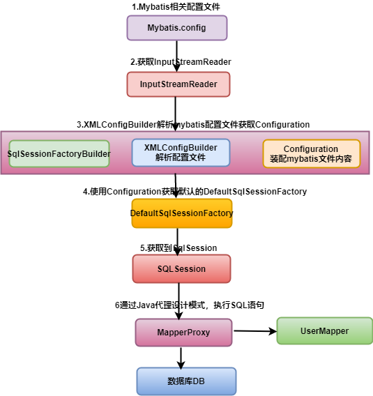
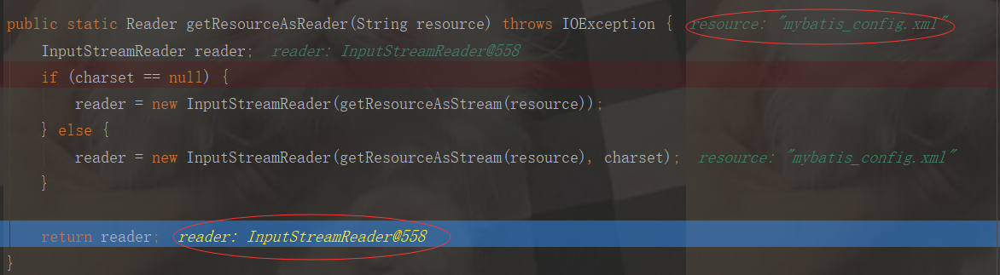
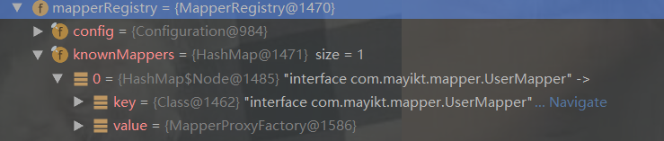
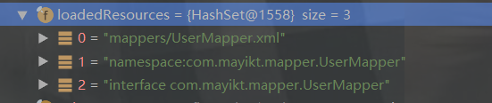
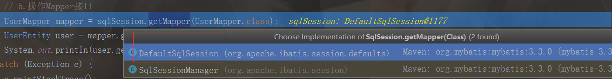
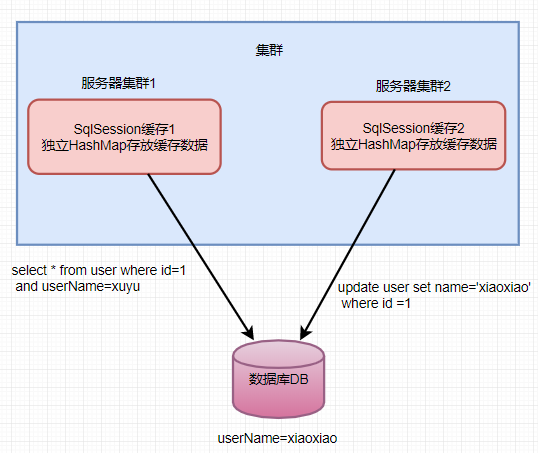

[TOC]
# 一. 源码分析流程图


演示代码

```java
public class TestMyBatis {
   
    public static void main(String[] args) {
        try {
            // 基本mybatis环境
            // 1.定义mybatis_config文件地址
            String resources = "mybatis_config.xml";
            // 2.获取InputStreamReaderIo流
            Reader reader = Resources.getResourceAsReader(resources);
            // 3.获取SqlSessionFactory
            SqlSessionFactory sqlSessionFactory = new SqlSessionFactoryBuilder().build(reader);
            // 4.获取Session
            SqlSession sqlSession = sqlSessionFactory.openSession();
            // 5.操作Mapper接口
            UserMapper mapper = sqlSession.getMapper(UserMapper.class);
            UserEntity user = mapper.getUser(2);
            System.out.println(user.getName());
        } catch (Exception e) {
            e.printStackTrace();
        }
    }
}
```

# 二. 获取InputStreamReaderIo流

首先对步骤2进行分析
```java
// 2.获取InputStreamReaderIo流
Reader reader = Resources.getResourceAsReader(resources);
```
读取的mybatis_config.xml文件
```java
public static Reader getResourceAsReader(String resource) throws IOException {
    InputStreamReader reader;
    if (charset == null) {
        reader = new InputStreamReader(getResourceAsStream(resource));
    } else {
        reader = new InputStreamReader(getResourceAsStream(resource), charset);
    }

    return reader;
}
```
断点调试结果如下：


# 三. 获取SqlSessionFactory
```java
// 3.获取SqlSessionFactory
SqlSessionFactory sqlSessionFactory = new SqlSessionFactoryBuilder().build(reader);
```
进入SqlSessionFactoryBuilder（）构造函数如下：
```java
public SqlSessionFactoryBuilder() {}
```
可知，无参构造函数没用做任何事情，再进入`build(reader)`源码，reader参数为`InputStream`流
```java
public SqlSessionFactory build(Reader reader) {
    return this.build((Reader)reader, (String)null, (Properties)null);
}
```
通过XMLConfigBuilder解析mybatis配置，然后创建SqlSessionFactory对象。
```java
  public SqlSessionFactory build(Reader reader, String environment, Properties properties) {
    SqlSessionFactory var5;
    try {
        XMLConfigBuilder parser = new XMLConfigBuilder(reader, environment, properties);
        var5 = this.build(parser.parse());
    } catch (Exception var14) {
        throw ExceptionFactory.wrapException("Error building SqlSession.", var14);
    } finally {
        ErrorContext.instance().reset();

        try {
            reader.close();
        } catch (IOException var13) {
            ;
        }
    }
    return var5;
}
```
XMLConfigBuilder构造函数如下：
```java
public class XMLConfigBuilder extends BaseBuilder {

  private boolean parsed;
  //xml解析器
  private XPathParser parser;
....
  //第一步进入到这个带参数的构造方法中
  public XMLConfigBuilder(Reader reader, String environment, Properties props) {
    //调用具体的执行逻辑方法，点进去,进入重载的方法
    this(new XPathParser(reader, true, props, new XMLMapperEntityResolver()), environment, props);
  }
....
  //第二步执行具体逻辑
  private XMLConfigBuilder(XPathParser parser, String environment, Properties props) {
    super(new Configuration());
    ErrorContext.instance().resource("SQL Mapper Configuration");
    this.configuration.setVariables(props);
    //在构造函数设置了parsed 为fasle
    this.parsed = false;
    this.environment = environment;
    this.parser = parser;
  }
```
通过`build(parser.parse());`解析配置文件
```java
//外部调用此方法对mybatis配置文件进行解析  
public Configuration parse() {
    //因为在构造函数设置了parsed 为fasle，xml解析器只解析一次
    if (parsed) {
      throw new BuilderException("Each XMLConfigBuilder can only be used once.");
    }
    //只解析一次，Configuration配置文件是全局的，只能被解析一次
    parsed = true;
    //源码分析，从根节点configuration
    parseConfiguration(parser.evalNode("/configuration"));
    return configuration;
  }
```
>解析过程
1. configuration节点为根节点。

2. 在configuration节点之下，我们可以配置10个子节点， 分别为：`properties、typeAliases、plugins、objectFactory、objectWrapperFactory、settings、environments、databaseIdProvider、typeHandlers、mappers`。

3. 解析配置文件完成了之后，会将解析的XML结点封装成Environment对象，再把Environment对象设置给Configuration对象中。也就是解析XML,再把XML转为Configuration实体类

4. 解析过程同时会读取`mapper.xml`文件，将配置文件中的Mapper添加到`Configuration mapperRegistry`实现注册。`mapperRegistry`存放当前所有的mapper接口。


5. loadedResources里面存放的是userMapper的配置文件。


> 为什么XMLConfigBuilder只能被使用一次呢？
答：因为我们的Configuration是一个全局的，所以只能被解析一次。
多次解析的话，会抛出：`Each XMLConfigBuilder can only be used once.`异常，防止用户私自调用parse（）方法再去重复解析。

# 四. 操作Mapper接口(Mapper与接口绑定原理)
```java
// 5.sqlSession通过Mapper接口操作SQL语句
UserMapper mapper = sqlSession.getMapper(UserMapper.class);
```
```java
public interface UserMapper {
    public UserEntity getUser(int id);
}
```
通过动态代理调用UserMapper接口的getMapper（）方法。


默认调用`DefaultSqlSession`中的getMapper()方法。
```java
public class DefaultSqlSession implements SqlSession {
    //其余代码省略。。。
    public <T> T getMapper(Class<T> type) {
        return this.configuration.getMapper(type, this);
    }
    //其余代码省略。。。
}


public class Configuration {
    //其余代码省略。。。
    public <T> T getMapper(Class<T> type, SqlSession sqlSession) {
        return this.mapperRegistry.getMapper(type, sqlSession);
    }
    //其余代码省略。。。
}
public class MapperRegistry {
    public <T> T getMapper(Class<T> type, SqlSession sqlSession) {
        MapperProxyFactory<T> mapperProxyFactory = (MapperProxyFactory)this.knownMappers.get(type);
        if (mapperProxyFactory == null) {
            throw new BindingException("Type " + type + " is not known to the MapperRegistry.");
        } else {
            try {
                return mapperProxyFactory.newInstance(sqlSession);
            } catch (Exception var5) {
                throw new BindingException("Error getting mapper instance. Cause: " + var5, var5);
            }
        }
    }
}
```
通过`configuration.getMapper()`去查下我们之前有没有注册过mapper接口，没有则会报：`没用绑定接口错误`。

`mapperRegistery`里存放的是mapper接口，key为：接口，value为：MapperProxyFactory

这时会使用mapperProxyFactory创建代理类（动态代理）：
```java
return mapperProxyFactory.newInstance(sqlSession);

public T newInstance(SqlSession sqlSession) {
    MapperProxy<T> mapperProxy = new MapperProxy(sqlSession, this.mapperInterface, this.methodCache);
    return this.newInstance(mapperProxy);
}
```
最后返回mapper信息如下：mapper为：我们通过：`mapperProxyFactory`创建的代理类MapperProxy

所以当我们调用mapper的getUser()方法时候，就会执行`MapperProxy`代理类的invoke()方法

```java
UserEntity user = mapper.getUser(2);

public Object invoke(Object proxy, Method method, Object[] args) throws Throwable {
    if (Object.class.equals(method.getDeclaringClass())) {    //判断mapper接口有没有实现类，显然我们mapper没用实现类
        try {
            return method.invoke(this, args);
        } catch (Throwable var5) {
            throw ExceptionUtil.unwrapThrowable(var5);
        }
    } else {    //会执行这个分支
        MapperMethod mapperMethod = this.cachedMapperMethod(method);    //缓存中获取method
        return mapperMethod.execute(this.sqlSession, args);    //执行sql语句
    }
}
```

## 问题：Mybatis里面，mapper接口中有多个方法，每次调用会走同一个invoke()方法吗？
不会的，因为你的每个`MapperRegistry`里面的class为mapper接口，都有独立的`MapperProxyFactory`.

Mybatis是基于多个不同的mapper接口生产的代理类，不同的mapper接口走不同的invoke方法，如果是相同的mapper接口，不同的方法，肯定是走同一个invoke方法。

## Mapper接口绑定流程

1. `mapper.xml`中的配置文件里的每条sql语句，最终都是封装成一个`MappedStatement`对象，再通过一个HashMap集合保存起来。

2. 执行`getMapper()`方法，判断是否注册过mapper接口，注册了就会使用`mapperProxyFactory`去生成代理类`MapperProxy`

3. 执行目标方法时，会调用`MapperProxy`代理类的`invoke（）`方法

4. 将`mapper.xml`里面配置的sql语句和对应的mapper接口方法进行关联并放入map缓存中，后期直接走缓存了。最后执行`execute()`方法

5. 执行`execute()`方法最终调用`selectOne()`方法，执行结果。


# 五. SQLSession一级缓存原理
mybatis是对select语句进行缓存的额，同一个select在一次sqlSession未被关闭之前是不会执行多次的（前提是对应的数据未被修改过，确切的说是未被当前sqlSession修改过），后面拿到的查询结果是第一次查询结果的缓存。

1. 调用`getMapper`方法时候，会执行`invoke`方法，将我们的代理方法缓存起来

2. 调用`execute`方法，最终执行`selectOne`方法

3. 进入`selectOne`方法可知，`sqlSession`这个接口帮我们封装了CRUD的方法，便于我们操作SQL语句。

4. `selectOne`方法底层还是执行`selectList`方法查询所有，但取第一个

5. 进入`selectList`方法，通过`configuration`得到SQL语句，再执行query方法

6. 进入`query`方法，先执行`CacheExecutor`二级缓存执行器，发现没用配置二级缓存介质，则走`SimpleExecutor`简单执行器（一级缓存）

7. 从`HashMap`中查找数据，一级缓存也没用数据，则会去查询数据库，查询到了数据，缓存到一级缓存

8. 此时再去查询，就直接查询一级缓存数据（本地缓存）不会去查询数据库

## 一级缓存存在哪些问题
1. 线程安全问题

mybatis是对select语句进行缓存的额，同一个select在一次sqlSession未被关闭之前是不会执行多次的（前提是对应的数据未被修改过，确切的说是未被当前sqlSession修改过），后面拿到的查询结果是第一次查询结果的缓存。

 以上机制提升了效率，减少了与数据库通信的次数，这是mybatis的优点

 但是如果你的应用处于多线程并发环境下，以上机制的问题就来了，独立线程一定使用各自独立的sqlSession，那么缓存的都是本线程下的查询过程，并发如果同同时修改一个资源（比如一个表的同一条记录）并且对后续select有影响的话，这个机制让你拿不到你想要的结果。

 **解决办法：**

在后续select之前，执行`sqlSession.clearCache();`方法来清除缓存就可以了。

注：这个跟mybatis-config.xml和mapper.xm里的Cache不一样（这是二级缓存），改配置文件解决不了这个问题，应该使用clearCache方法。

2、集群会产生问题（主要的）


**集群的情况下，我们是不是可以直接关闭一级缓存？**
Mybatis默认走SimpleExecutor,不能直接关闭一级缓存。
**那么如何去关闭一级缓存？**
方案1. 在sql语句上 随机生成 不同的参数 存在缺点：map集合可能爆 内存溢出的问题

方案2. 开启二级缓存

方案3. 使用`sqlSession.clearCache();`强制清除缓存

方案4. 创建新的sqlSession连接。

# 六. SQLSession二级缓存原理

MyBatis 一级缓存最大的共享范围就是一个SqlSession内部，那么如果多个 SqlSession 需要共享缓存，则需要开启二级缓存，开启二级缓存后，会使用 CachingExecutor 装饰 Executor，进入一级缓存的查询流程前，先在CachingExecutor 进行二级缓存的查询，具体的工作流程如下所示

当二级缓存开启后，同一个命名空间(namespace) 所有的操作语句，都影响着一个共同的 cache，也就是二级缓存被多个 SqlSession 共享，是一个全局的变量。当开启缓存后，数据的查询执行的流程就是 `二级缓存 -> 一级缓存 -> 数据库`。

## 二级缓存开启条件
二级缓存默认是不开启的，需要手动开启二级缓存，实现二级缓存的时候，MyBatis要求返回的POJO必须是可序列化的。开启二级缓存的条件也是比较简单，通过直接在 MyBatis 配置文件中通过
```xml
<settings>
	<setting name = "cacheEnabled" value = "true" />
</settings>
```
来开启二级缓存，还需要在 Mapper 的xml 配置文件中加入 `<cache>`标签,表示对哪个mapper 开启缓存
```xml
<cache eviction="LRU" type="org.mybatis.cache.MybatisRedisCache" />
```
### 设置 cache 标签的属性
eviction: 缓存回收策略，有这几种回收策略:

* LRU - 最近最少回收，移除最长时间不被使用的对象

* FIFO - 先进先出，按照缓存进入的顺序来移除它们

* SOFT - 软引用，移除基于垃圾回收器状态和软引用规则的对象,用来描述一些有用但并不是必需的对象, 对于软引用关联着的对象，只有在内存不足的时候JVM才会回收该对象

* WEAK - 弱引用，更积极的移除基于垃圾收集器和弱引用规则的对象,用来描述非必需对象的，当JVM进行垃圾回收时，无论内存是否充足，都会回收被弱引用关联的对象

默认是 LRU 最近最少回收策略


## 二级缓存调用流程
1.  将配置文件中的缓存配置添加到configuration中。

2.  准备测试代码。注意，在两次查询中没有`sqlSession.close();`或`sqlSession.commit();`语句
```java
// 4.获取Session
SqlSession sqlSession = sqlSessionFactory.openSession();
SqlSession sqlSession2 = sqlSessionFactory.openSession();
// 5.操作Mapper接口
UserMapper mapper = sqlSession.getMapper(UserMapper.class);

System.out.println("第一次调用....");
UserEntity o = sqlSession.selectOne("com.mayikt.mapper.UserMapper.getUser", 1);    
System.out.println(o.getName());

System.out.println("第二次调用....");
UserEntity o2 = sqlSession2.selectOne("com.mayikt.mapper.UserMapper.getUser", 1);    
System.out.println(o2.getName());
```

3. 通过`selectOne()`方法查询，因为配置了外置缓存Redis缓存，所以先走`CacheExecutor`执行器（代表二级缓存）

4. 第一次查询，二级缓存没有数据，就执行`BaseExecutor`查询一级缓存数据，一级缓存也没有数据，去查询数据库。

5. 查到数据后，放入一级缓存，再把一级缓存数据放入二级缓存中。

6. 但由于没有执行`sqlSession.close();`或`sqlSession.commit();`,此时再次查询时，二级缓存中依旧没有数据。
```java
public void close(boolean forceRollback) {
    try {
        if (forceRollback) {    //是否需要强制回滚，我们是不需要的
            this.tcm.rollback();
        } else {
            this.tcm.commit();    //这块重点了，表示要提交数据到redis了
        }
    } finally {
        this.delegate.close(forceRollback);
    }

}
```
7. 执行`sqlSession.close();`或`sqlSession.commit(true)`后将临时缓存数据提交到了redis缓存中，此时再次查询就直接从redis缓存中取出数据了。

8. 具体代码调用参见[Mybatis深入源码分析之SqlSessionFactory二级缓存原理分析](https://my.oschina.net/u/3995125/blog/3079857)

# 七. 一级缓存与二级缓存区别
1. 一级缓存是SqlSession级别的缓存。在操作数据库时需要构造sqlSession对象，在对象中有一个数据结构（HashMap）用于存储缓存数据。不同的sqlSession之间的缓存数据区域（sqlHashMap）是互相不影响的。

2. 二级缓存是mapper级别的缓存，多个SqlSession去操作同一个Mapper的语句，多个SqlSession可以共用二级缓存，二级缓存是跨SqlSession的。

# 八. springboot项目中 整合redis缓存
mapper层：
```java
@CacheNamespace(implementation = MybatisRedisCache.class)
public interface OrderMapper {
   @Insert("insert order_info values (null,#{orderName},#{orderDes})")
   public int addOrder(OrderEntity OrderEntity);

   @Select("SELECT * FROM order_info;")
   public List<OrderEntity> findByOrder();
}
```
redis:
```java
@Component
public class RedisToken {
    @Autowired
    private StringRedisTemplate stringRedisTemplate;
    /**
     * 获取Token
     */
    public String getToken() {
        //1. 使用uuid生成Token
        String token = UUID.randomUUID().toString().replace("-", "");
        //2. 将Token存放到Redis中
        setString(token, token, 7200l);
        return token;
    }
    public Boolean findByToken(String token) {
        if (StringUtils.isEmpty(token)) {
            return false;
        }
        String redisToken = getString(token);
        if(StringUtils.isEmpty(redisToken)){
            return  false;
        }
        delKey(redisToken);
        return  true;
    }
    private void setString(String key, Object data, Long timeout) {
        if (data instanceof String) {
            String value = (String) data;
            stringRedisTemplate.opsForValue().set(key, value);
        }
        if (timeout != null) {
            stringRedisTemplate.expire(key, timeout, TimeUnit.SECONDS);
        }
    }
    private String getString(String key) {
        return stringRedisTemplate.opsForValue().get(key);
    }
    private void delKey(String key) {
        stringRedisTemplate.delete(key);
    }
}
```
MybatisRedisCache:
```java
**
 * mybatis二级缓存整合Redis
 */
public class MybatisRedisCache implements Cache {
    private static Logger logger = LoggerFactory.getLogger(MybatisRedisCache.class);
    private Jedis redisClient = createReids();
    private final ReadWriteLock readWriteLock = new ReentrantReadWriteLock();
    private String id;
    public MybatisRedisCache(final String id) {
        if (id == null) {
            throw new IllegalArgumentException("Cache instances require an ID");
        }
        logger.debug(">>>>>>>>>>>>>>>>>>>>>>>>MybatisRedisCache:id=" + id);
        this.id = id;
    }
    public String getId() {
        return this.id;
    }
    public int getSize() {
        return Integer.valueOf(redisClient.dbSize().toString());
    }
    public void putObject(Object key, Object value) {
        logger.debug(">>>>>>>>>>>>>>>>>>>>>>>>putObject:" + key + "=" + value);
        redisClient.set(SerializeUtil.serialize(key.toString()), SerializeUtil.serialize(value));
    }
    public Object getObject(Object key) {
        Object value = SerializeUtil.unserialize(redisClient.get(SerializeUtil.serialize(key.toString())));
        logger.debug(">>>>>>>>>>>>>>>>>>>>>>>>getObject:" + key + "=" + value);
        return value;
    }
    public Object removeObject(Object key) {
        return redisClient.expire(SerializeUtil.serialize(key.toString()), 0);
    }
    public void clear() {
        redisClient.flushDB();
    }
    public ReadWriteLock getReadWriteLock() {
        return readWriteLock;
    }
    protected static Jedis createReids() {
        JedisPool pool = new JedisPool("127.0.0.1", 6379);
        return pool.getResource();
    }
}
```

启动类
```java
@SpringBootApplication
@MapperScan("com.mayikt.api.mapper")
@EnableCaching
public class OrderApp {

    public static void main(String[] args) {
        SpringApplication.run(OrderApp.class);
    }
}
```

最终被SqlSessionInterceptor拦截器拦截了， sqlSession.commit(true);也被调用了
```java
private class SqlSessionInterceptor implements InvocationHandler {
    private SqlSessionInterceptor() {
    }
    public Object invoke(Object proxy, Method method, Object[] args) throws Throwable {
        SqlSession sqlSession = SqlSessionUtils.getSqlSession(SqlSessionTemplate.this.sqlSessionFactory, SqlSessionTemplate.this.executorType, SqlSessionTemplate.this.exceptionTranslator);

        Object unwrapped;
        try {
            Object result = method.invoke(sqlSession, args);
            if (!SqlSessionUtils.isSqlSessionTransactional(sqlSession, SqlSessionTemplate.this.sqlSessionFactory)) {
                sqlSession.commit(true);//提交查询数据
            }
            unwrapped = result;
        } catch (Throwable var11) {
            unwrapped = ExceptionUtil.unwrapThrowable(var11);
            if (SqlSessionTemplate.this.exceptionTranslator != null && unwrapped instanceof PersistenceException) {
                SqlSessionUtils.closeSqlSession(sqlSession, SqlSessionTemplate.this.sqlSessionFactory);
                sqlSession = null;
                Throwable translated = SqlSessionTemplate.this.exceptionTranslator.translateExceptionIfPossible((PersistenceException)unwrapped);
                if (translated != null) {
                    unwrapped = translated;
                }
            }

            throw (Throwable)unwrapped;
        } finally {
            if (sqlSession != null) {
                SqlSessionUtils.closeSqlSession(sqlSession, SqlSessionTemplate.this.sqlSessionFactory);
            }
        }
        return unwrapped;
    }
}
```
最终通过代理调用`MybatisRedisCache`类的`putObject(Object key, Object value)`方法。
