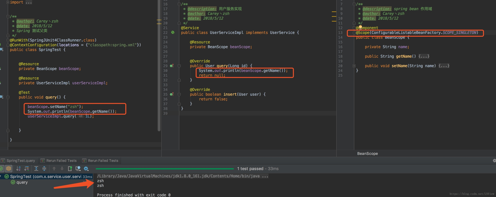

[TOC]
## 简介
Spring作为一个IOC/DI容器，帮助我们管理了许许多多的“bean”。但其实，Spring并没有保证这些对象的线程安全，需要由开发者自己编写解决线程安全问题的代码。

Spring对每个bean提供了一个scope属性来表示该bean的作用域。它是bean的生命周期。例如，一个scope为singleton的bean，在第一次被注入时，会创建为一个单例对象，该对象会一直被复用到应用结束。

* singleton：默认的scope，每个scope为singleton的bean都会被定义为一个单例对象，该对象的生命周期是与Spring IOC容器一致的（但在第一次被注入时才会创建）。
* prototype（多例）：bean被定义为在每次注入时都会创建一个新的对象。
* request：bean被定义为在每个HTTP请求中创建一个单例对象，也就是说在单个请求中都会复用这一个单例对象。
* session：bean被定义为在一个session的生命周期内创建一个单例对象。
* application：bean被定义为在ServletContext的生命周期中复用一个单例对象。
* websocket：bean被定义为在websocket的生命周期中复用一个单例对象。


我们交由Spring管理的大多数对象其实都是一些**无状态的对象**，这种不会因为多线程而导致状态被破坏的对象很适合Spring的默认scope，**每个单例的无状态对象都是线程安全的（也可以说只要是无状态的对象，不管单例多例都是线程安全的，不过单例毕竟节省了不断创建对象与GC的开销）**。

**无状态的对象即是自身没有状态的对象，自然也就不会因为多个线程的交替调度而破坏自身状态导致线程安全问题**。无状态对象包括我们经常使用的DO、DTO、VO这些只作为数据的实体模型的贫血对象，还有Service、DAO和Controller，这些对象并没有自己的状态，它们只是用来执行某些操作的。例如，每个DAO提供的函数都只是对数据库的CRUD，而且每个数据库Connection都作为函数的局部变量（局部变量是在用户栈中的，而且用户栈本身就是线程私有的内存区域，所以不存在线程安全问题），用完即关（或交还给连接池）。

有人可能会认为，我使用request作用域不就可以避免每个请求之间的安全问题了吗？这是完全错误的，**因为Controller默认是单例的，Tomcat对于HTTP请求是多线程执行的，所以如果对象有状态，就会存在线程安全问题，如果对象没有状态，无论如何都不会有安全问题**。

当然，你也可以把Controller的scope改成prototype，实际上Struts2就是这么做的，但有一点要注意，Spring MVC对请求的拦截粒度是基于每个方法的，而Struts2是基于每个类的，所以把Controller设为多例将会频繁的创建与回收对象，严重影响到了性能。

通过阅读上文其实已经说的很清楚了，**Spring根本就没有对bean的多线程安全问题做出任何保证与措施**。对于每个bean的线程安全问题，根本原因是每个bean自身的设计。不要在bean中声明任何有状态的实例变量或类变量，如果必须如此，那么就使用ThreadLocal把变量变为线程私有的，如果bean的实例变量或类变量需要在多个线程之间共享，那么就只能使用synchronized、lock、CAS等这些实现线程同步的方法了。

## 作用域示例
### 1. Singleton和Prototype
```java
@Component
@Scope(ConfigurableListableBeanFactory.SCOPE_PROTOTYPE)
//@Scope(ConfigurableListableBeanFactory.SCOPE_SINGLETON)
public class BeanScope {

    private String name;

    public String getName() { return name; }

    public void setName(String name) { this.name = name;}
}
```

这里，使用 ConfigurableListableBeanFactory 类的 SCOPE_PROTOTYPE 常量设置类原型作用域。当然也可以直接使用 @Scope(“prototype”)，但是使用 SCOPE_PROTOTYPE 常量更加安全并且不易出错。
下面两张图，分别是在Singleton和Prototype下不同的输出结果：
#### Singleton：
 
 
#### Prototype：


### 2. Session和Request
会话/请求 作用域与上面的形式稍有不同。

```java
@Service
@Scope(value=WebApplicationContext.SCOPE_SESSION,
    proxyMode=ScopeProxyMode.TAGER_CLASS)
//@Scope(value = WebApplicationContext.SCOPE_REQUEST, proxyMode = ScopedProxyMode.INTERFACES)      
 public class Cart {

}

```
```java

@Servicepublic class StoreService {
    
    @Autowired
    private Cart cart;

}
```
#### proxyMode解释

1. 因为SroreService是一个单例的bean，会在Spring应用上下文加载的时候创建。当他创建的时候，Spring会试图将Cartbean注入到它的属性中。但是cart bean是会话作用域的，此时并不存在。直到某个用户进入系统之后，才会创建Cart实例。

2. 容器启动时bean还没创建。创建一个代理将这个接口或者类注入到其它需要这个bean的bean中
    * proxyMode=ScopedProxyMode.INTERFACES创建一个JDK代理模式
    * proxyMode=ScopedProxyMode.TARGET_CLASS基于类的代理模式
