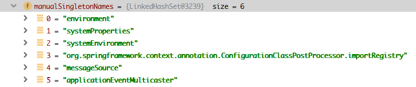

[TOC]

# 一、简介

ApplicationContext和BeanFactory两者都是用于加载Bean的，

但是相比之下，ApplicationContext提供了更多的扩展功能，

简而言之：ApplicationContext包含BeanFactory的所有功能。通常建议比优先使用ApplicationContext，

除非在一些限制的场合，比如字节长度对内存有很大的影响时（Applet），绝大多数“典型的”企业应用系统，ApplicationContext就是需要使用的。

首先我们来看看使用两个不同的类去加载配置文件在写法上的不同如下代码：

```java
//使用BeanFactory方式加载XML.
BeanFactory bf = new XmlBeanFactory(new ClassPathResource("beanFactoryTest.xml"));

//使用ApplicationContext方式加载XML.
ApplicationContext bf = new ClassPathXmlApplicationContext("beanFactoryTest.xml");

```
本文先以BeanFactory为例，进行分析，ApplicationContext复用BeanFactory中的配置文件读取解析及其他功能。这个后续分析。

# 二、简要介绍XML配置文件读取的大致流程


1. DefaultListableBeanFactory是整个bean加载的核心部分，是Spring注册及加载bean的默认实现

2. XmlBeanFactory继承自DefaultListableBeanFactory，对DefaultListableBeanFactory类进行了扩展，主要用于从XML文档中读取BeanDefinition，不同于DefaultListableBeanFactory的地方是：XmlBeanFactory中使用了**自定义的XML读取器XmlBeanDefinitionReader**，实现了个性化的BeanDefinitionReader读取。
>整个XML配置文件读取的大致流程，在`XmlBeanDefinitionReader`中主要包含以下几步处理:

>1. 通过继承自AbstractBeanDefinitionReader中的方法，来使用ResourceLoader将资源文件路径转换为对应的Resource文件
>2. 通过DocumentLoader对Resource文件进行转换，将Resource文件转换为Document文件
>3. 根据获取的 Document 实例注册 Bean 信息

3. DefaultListableBeanFactory继承了AbstractAutowireCapableBeanFactory并实现了ConfigurableListableBeanFactory以及BeanDefinitionRegistry接口。


接下来要分析的功能都是基于如下代码：
```java
BeanFactory bf = new XmlBeanFactory( new ClassPathResource("spring-config.xml"));
```
### 1. 配置文件的封装
> 即通过继承自AbstractBeanDefinitionReader中的方法，来使用ResourceLoader将资源文件路径转换为对应的Resource文件。

1. Spring的配置文件读取是通过ClassPathResource进行封装的，Spring对其内部使用到的资源实现了自己的抽象结构：Resource接口来封装底层资源
 
2. Resource接口抽象了所有Spring内部使用到的底层资源：File、URL、Classpath等
 
3. 对不同来源的资源文件都有相应的Resource实现：文件(FileSystemResource)、Classpath资源(ClassPathResource)、URL资源(UrlResource)、InputStream资源(InputStreamResource)、Byte数组(ByteArrayResource)等
 
4. 在日常开发中我们可以直接使用spring提供的类来加载资源文件，比如在希望加载资源文件时可以使用下面的代码：
```java
Resource resource = new ClassPathResource("spring-config.xml");
InputStream is = resource.getInputStream();
```
有了 Resource 接口便可以对所有资源文件进行统一处理 至于实现，其实是非常简单的，以 getlnputStream 为例，ClassPathResource 中的实现方式便是通 class 或者 classLoader 提供的底层方法进行调用，
ClassPathResource.java
```java
InputStream is;
if (this.clazz != null) {
    is = this.clazz.getResourceAsStream(this.path);
}
else if (this.classLoader != null) {
    is = this.classLoader.getResourceAsStream(this.path);
}
else {
    is = ClassLoader.getSystemResourceAsStream(this.path);
}
```


而对于 FileSystemResource 其实更简单，直接使用 FileInputStream 对文件进行实例化。
FileSystemResource.java
```java
public InputStream getinputStream () throws IOException {
    return new FilelnputStream(this file) ; 
}
```

5. 当通过Resource相关类完成了对配置文件进行封装后，配置文件的读取工作就全权交给XmlBeanDefinitionReader来处理了。


### 2. 通过DocumentLoader对Resource文件进行转换，将Resource文件转换为Document文件

接下来就进入到XmlBeanFactory的初始化过程了，XmlBeanFactory的初始化有若干办法，Spring提供了很多的构造函数，在这里分析的是使用Resource实例作为构造函数参数的办法，代码如下：

XmlBeanFactory.java

```java
public XmlBeanFactory(Resource resource) throws BeansException {
    this(resource, null);
}
public XmlBeanFactory(Resource resource, BeanFactory parentBeanFactory) throws BeansException {
    super(parentBeanFactory);
    this.reader.loadBeanDefinitions(resource);
}
```
> 在XmlBeanDefinitionReader加载数据前还有一个调用父类构造函数初始化的过程：super(parentBeanFactory)，这个可以参考`番外1. Spring之ignoredDependencyInterface以及忽略原因`


上面函数中的代码this.reader.loadBeanDefinitions(resource)才是资源加载的真正实现.
```java
public int loadBeanDefinitions(EncodedResource encodedResource) throws BeanDefinitionStoreException {
    Assert.notNull(encodedResource, "EncodedResource must not be null");
    if (logger.isTraceEnabled()) {
        logger.trace("Loading XML bean definitions from " + encodedResource);
    }

    Set<EncodedResource> currentResources = this.resourcesCurrentlyBeingLoaded.get();
    if (currentResources == null) {
        currentResources = new HashSet<>(4);
        this.resourcesCurrentlyBeingLoaded.set(currentResources);
    }
    if (!currentResources.add(encodedResource)) {
        throw new BeanDefinitionStoreException(
                "Detected cyclic loading of " + encodedResource + " - check your import definitions!");
    }
    try {
        InputStream inputStream = encodedResource.getResource().getInputStream();
        try {
            InputSource inputSource = new InputSource(inputStream);
            if (encodedResource.getEncoding() != null) {
                inputSource.setEncoding(encodedResource.getEncoding());
            }
            return doLoadBeanDefinitions(inputSource, encodedResource.getResource());
        }
        finally {
            inputStream.close();
        }
    }
    ...
}
```
EncodedResource的作用是对资源文件的编码进行处理的，其中的主要逻辑体现在getReader()方法中，当设置了编码属性的时候Spring会使用相应的编码作为输入流的编码，在构造好了encodeResource对象后，再次转入了可复用方法loadBeanDefinitions(new EncodedResource(resource))，这个方法内部才是真正的数据准备阶段，代码如下：
```java
protected int doLoadBeanDefinitions(InputSource inputSource, Resource resource)
        throws BeanDefinitionStoreException {
    try {
        // 获取 Document 实例
        Document doc = doLoadDocument(inputSource, resource);
        // 根据 Document 实例****注册 Bean信息
        return registerBeanDefinitions(doc, resource);
    }
    ...
}
```

核心部分就是 try 块的两行代码:

1. 调用 doLoadDocument() 方法，根据 xml 文件获取 Document 实例。

2. 根据获取的 Document 实例注册 Bean 信息

### 3. 解析及注册BeanDefinitions
>即根据获取的 Document 实例注册 Bean 信息

当把文件转换成Document后，接下来就是对bean的提取及注册，当程序已经拥有了XML文档文件的Document实例对象时，就会被引入到XmlBeanDefinitionReader.registerBeanDefinitions这个方法:
```java
public int registerBeanDefinitions(Document doc, Resource resource) throws BeanDefinitionStoreException {
    BeanDefinitionDocumentReader documentReader = createBeanDefinitionDocumentReader();
    int countBefore = getRegistry().getBeanDefinitionCount();
    documentReader.registerBeanDefinitions(doc, createReaderContext(resource));
    return getRegistry().getBeanDefinitionCount() - countBefore;
}
```
其中的doc参数即为上节读取的document，继续看registerBeanDefinitions方法：
```java
public void registerBeanDefinitions(Document doc, XmlReaderContext readerContext) {
    this.readerContext = readerContext;
    logger.debug("Loading bean definitions");
    Element root = doc.getDocumentElement();
    doRegisterBeanDefinitions(root);
}
```

通过这里我们看到终于到了解析逻辑的核心方法doRegisterBeanDefinitions，接着跟踪源码如下：

```java
protected void doRegisterBeanDefinitions(Element root) {
    BeanDefinitionParserDelegate parent = this.delegate;
    this.delegate = createDelegate(getReaderContext(), root, parent);
    if (this.delegate.isDefaultNamespace(root)) {
        String profileSpec = root.getAttribute(PROFILE_ATTRIBUTE);
        if (StringUtils.hasText(profileSpec)) {
            String[] specifiedProfiles = StringUtils.tokenizeToStringArray(
                    profileSpec, BeanDefinitionParserDelegate.MULTI_VALUE_ATTRIBUTE_DELIMITERS);
            if (!getReaderContext().getEnvironment().acceptsProfiles(specifiedProfiles)) {
                if (logger.isInfoEnabled()) {
                    logger.info("Skipped XML bean definition file due to specified profiles [" + profileSpec +
                            "] not matching: " + getReaderContext().getResource());
                }
                return;
            }
        }
    }
    preProcessXml(root);
    parseBeanDefinitions(root, this.delegate);
    postProcessXml(root);
    this.delegate = parent;
}
```

我们看到首先要解析profile属性，然后才开始XML的读取，具体的代码如下：

```java
protected void parseBeanDefinitions(Element root, BeanDefinitionParserDelegate delegate) {
    if (delegate.isDefaultNamespace(root)) {
        NodeList nl = root.getChildNodes();
        for (int i = 0; i < nl.getLength(); i++) {
            Node node = nl.item(i);
            if (node instanceof Element) {
                Element ele = (Element) node;
                if (delegate.isDefaultNamespace(ele)) {
                    parseDefaultElement(ele, delegate);
                }
                else {
                    delegate.parseCustomElement(ele);
                }
            }
        }
    }
    else {
        delegate.parseCustomElement(root);
    }
}
```

最终解析动作落地在两个方法处：`parseDefaultElement(ele, delegate)` 和 `delegate.parseCustomElement(root)`。

此时会根据命名空间（即不同的Bean 声明方式）来选择不同的解析方式：

1. 当命名空间是`http://www.springframework.org/schema/beans`时则调用 `parseDefaultElement()` 进行解析进行解析

2. 其他类型调用 `delegate.parseCustomElement()` 方法进行自定义解析. 比如:
    * `<context:component-scan>`的命名空间是:`http://www.springframework.org/schema/context`
    * `<task:executor>`的命名空间是:`http://www.springframework.org/schema/task`
    * `<aop:aspectj-autoproxy>`的命名空间是:`http://www.springframework.org/schema/aop`

判断是否默认命名空间还是自定义命名空间的办法其实是使用`node.getNamespaceURI()`获取命名空间，并与Spring中固定的命名空间`http://www.springframework.org/schema/beans`进行对比，如果一致则认为是默认，否则就认为是自定义。 

# 三、重点看一下自定义解析，即注解bean解析模式
看一下 parseCustomElement(Element ele, BeanDefinition containingBd)方法:
```java
public BeanDefinition parseCustomElement(Element ele, @Nullable BeanDefinition containingBd) {
    // 获取 标签对应的命名空间
    String namespaceUri = getNamespaceURI(ele);
    if (namespaceUri == null) {
        return null;
    }

    // 获取所有已经配置的 Handler 映射：直接解析spring类路径下所有的META-INF/spring.handlers配置文件,然后放入map当中.注意下这里的map中的key实际上String类型的,只有当该处理器第一次被使用的时候才会通过反射创建出真实的处理器对象
    NamespaceHandler handler = this.readerContext.getNamespaceHandlerResolver().resolve(namespaceUri);
    if (handler == null) {
        error("Unable to locate Spring NamespaceHandler for XML schema namespace [" + namespaceUri + "]", ele);
        return null;
    }

    // 利用解析处理器解析节点，最后得到容器数据对象。
    return handler.parse(ele, new ParserContext(this.readerContext, this, containingBd));
}
```


## 看一下handler.parse()--扫描base-package指定的目录返回注册的所有beanDefinition，并将他们注册到spring的bean工厂中
利用解析处理器解析节点,对于返回的NamespaceHandler，调用其parse方法，这里最终委托给**ComponentScanBeanDefinitionParser.parse()**.

```java
public BeanDefinition parse(Element element, ParserContext parserContext) {
     //获取 base-package属性
    String basePackage = element.getAttribute("base-package");
    basePackage = parserContext.getReaderContext().getEnvironment().resolvePlaceholders(basePackage);
    //对路径字符串进行处理，扫描路径可以定义多个，使用,; 分割每个路径
    String[] basePackages = StringUtils.tokenizeToStringArray(basePackage, ",; \t\n");
    //获取节点扫描器，真正的注册委托给了ClassPathBeanDefinitionScanner
    ClassPathBeanDefinitionScanner scanner = this.configureScanner(parserContext, element);
    //1.扫描base-package指定的目录并返回注册的所有beanDefinition，并将他们注册到spring的bean工厂中
    Set<BeanDefinitionHolder> beanDefinitions = scanner.doScan(basePackages);
    //2.注册内部依赖处理器
    this.registerComponents(parserContext.getReaderContext(), beanDefinitions, element); 
    return null;
}
```


### 1.1继续看 ClassPathBeanDefinitionScanner#doScan()-扫描操作
真实扫描base-package指定的目录并返回注册的所有beanDefinition，并将他们注册到spring的bean工厂中，具体的扫描简析如下：
```java
protected Set<BeanDefinitionHolder> doScan(String... basePackages) {
        //表明base-package属性是需要被指定的
        Assert.notEmpty(basePackages, "At least one base package must be specified");
        Set<BeanDefinitionHolder> beanDefinitions = new LinkedHashSet<BeanDefinitionHolder>();
        for (String basePackage : basePackages) {
            //对每个基础包都进行扫描寻找并且对基础包下的所有class都注册为BeanDefinition
           //并对得到的candidates集合进行过滤，此处便用到include-filters和exclude-filters
            Set<BeanDefinition> candidates = findCandidateComponents(basePackage);
            for (BeanDefinition candidate : candidates) {
                //解析一个bean的scope属性，代表作用范围
                //prototype->每次请求都创建新的对象 singleton->单例模式，处理多请求
                ScopeMetadata scopeMetadata = this.scopeMetadataResolver.resolveScopeMetadata(candidate);
                candidate.setScope(scopeMetadata.getScopeName());
                //使用beanName生成器生成
                String beanName = this.beanNameGenerator.generateBeanName(candidate, this.registry);
                /**
                **对注册的bean进行另外的赋值处理，比如默认属性的配置
                *返回的candidate类型为ScannedGenericBeanDefinition，下面两者
                *条件满足
                */
                if (candidate instanceof AbstractBeanDefinition) {
                    //设置lazy-init/autowire-code默认属性，从spring配置的<beans>节点属性读取
                    postProcessBeanDefinition((AbstractBeanDefinition) candidate, beanName);
                }
                if (candidate instanceof AnnotatedBeanDefinition) {
                    //读取bean上的注解，比如`@Lazy`、`@Dependson`的值设置相应的属性
                    AnnotationConfigUtils.processCommonDefinitionAnnotations((AnnotatedBeanDefinition) candidate);
                }
                //查看是否已注册
                if (checkCandidate(beanName, candidate)) {
                    BeanDefinitionHolder definitionHolder = new BeanDefinitionHolder(candidate, beanName);
                    //默认采取cglib来做代理
                    definitionHolder = AnnotationConfigUtils.applyScopedProxyMode(scopeMetadata, definitionHolder, this.registry);
                    beanDefinitions.add(definitionHolder);
                    //注册bean信息到工厂中
                    registerBeanDefinition(definitionHolder, this.registry);
                }
            }
        }
        return beanDefinitions;
    }
```

### 1.2 继续看registerBeanDefinition(definitionHolder, this.registry);
注册bean信息到工厂。

```java
public void registerBeanDefinition(String beanName, BeanDefinition beanDefinition)
			throws BeanDefinitionStoreException {

		//从缓存中取出当前bean的 beanDefinition
		BeanDefinition existingDefinition = this.beanDefinitionMap.get(beanName);
		//如果存在
		if (existingDefinition != null) {
			this.beanDefinitionMap.put(beanName, beanDefinition);
		}
		//如果不存在
		else {
			//检查该bean是否已开始创建
			if (hasBeanCreationStarted()) {
				// Cannot modify startup-time collection elements anymore (for stable iteration)
				synchronized (this.beanDefinitionMap) {
					this.beanDefinitionMap.put(beanName, beanDefinition);
					List<String> updatedDefinitions = new ArrayList<>(this.beanDefinitionNames.size() + 1);
					updatedDefinitions.addAll(this.beanDefinitionNames);
					updatedDefinitions.add(beanName);
					this.beanDefinitionNames = updatedDefinitions;
					//如果单例模式的bean名单中有该bean的name，那么移除掉它。
					//也就是说着，将一个原本是单例模式的bean重新注册成一个普通的bean
					if (this.manualSingletonNames.contains(beanName)) {
						Set<String> updatedSingletons = new LinkedHashSet<>(this.manualSingletonNames);
						updatedSingletons.remove(beanName);
						this.manualSingletonNames = updatedSingletons;
					}
				}
			}
			else {
				// Still in startup registration phase
				this.beanDefinitionMap.put(beanName, beanDefinition);
				this.beanDefinitionNames.add(beanName);
				this.manualSingletonNames.remove(beanName);
			}
			this.frozenBeanDefinitionNames = null;
		}
		
}

```
BeanDefinition的注册分为一下几步：

1. 从缓存中取出当前bean的BeanDefinition

2. 如果存在，则用当前BeanDefinition覆盖原有的

3. 如果不存在，判断当前bean是否已经开始创建

4. 如果已经开始创建，将当前BeanDefinition和beanName放入缓存(**即放入beanDefinitionMap中**)后，如果当前bean是manual singleton bean，则将当前beanName从manual singleton Bean Name中移出，也就是变成了普通的bean,这里的manual singleton Bean指的是以下几种bean：



5. 如果没有开始创建，则将当前BeanDefinition，以及beanName放入缓存(**即放入beanDefinitionMap中**)


### 2. 看一下this.registerComponents(parserContext.getReaderContext(), beanDefinitions, element); 

```java
protected void registerComponents(
XmlReaderContext readerContext, Set<BeanDefinitionHolder> beanDefinitions, Element element) {
    Object source = readerContext.extractSource(element);
    //包装为CompositeComponentDefinition对象，内置多ComponentDefinition对象
    CompositeComponentDefinition compositeDef = new CompositeComponentDefinition(element.getTagName(), source);
    //将已注册的所有beanDefinitionHolder对象放到上述对象中
    for (BeanDefinitionHolder beanDefHolder : beanDefinitions) {
        compositeDef.addNestedComponent(new BeanComponentDefinition(beanDefHolder));
    }

    // Register annotation config processors, if necessary.
    boolean annotationConfig = true;
    //获取annotation-config的属性值，默认为true
    if (element.hasAttribute(ANNOTATION_CONFIG_ATTRIBUTE)) {
        annotationConfig = Boolean.valueOf(element.getAttribute(ANNOTATION_CONFIG_ATTRIBUTE));
    }
    if (annotationConfig) {
        //注册多个BeanPostProcessor接口，具体什么可自行查看，返回的是包含BeanPostProcessor接口的beanDefinitionHolder对象集合
        Set<BeanDefinitionHolder> processorDefinitions = AnnotationConfigUtils.registerAnnotationConfigProcessors(readerContext.getRegistry(), source);
        //继续装入CompositeComponentDefinition对象
        for (BeanDefinitionHolder processorDefinition : processorDefinitions) {
            compositeDef.addNestedComponent(new BeanComponentDefinition(processorDefinition));
        }
    }
    //此处为空
    readerContext.fireComponentRegistered(compositeDef);
}
```