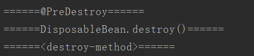

[TOC]
# 一、简介
在doCreateBean方法中，会通过registerDisposableBeanIfNecessary方法来注册disposable bean，在beanRegistry中通过一个map来保存：其中key为beanName，value为DisposableBeanAdapter。
```java
/** Disposable bean instances: bean name to disposable instance. */
private final Map<String, Object> disposableBeans = new LinkedHashMap<>();

// registerDisposableBeanIfNecessary的实现

protected void registerDisposableBeanIfNecessary(String beanName, Object bean, RootBeanDefinition mbd) {
	AccessControlContext acc = (System.getSecurityManager() != null ? getAccessControlContext() : null);
	if (!mbd.isPrototype() && requiresDestruction(bean, mbd)) {
		if (mbd.isSingleton()) {
			// Register a DisposableBean implementation that performs all destruction
			// work for the given bean: DestructionAwareBeanPostProcessors,
			// DisposableBean interface, custom destroy method.
			registerDisposableBean(beanName,

					// 使用DisposableBeanAdapter封装bean
			
					new DisposableBeanAdapter(bean, beanName, mbd, getBeanPostProcessors(), acc));
		}
		else {
			// A bean with a custom scope...
			Scope scope = this.scopes.get(mbd.getScope());
			if (scope == null) {
				throw new IllegalStateException("No Scope registered for scope name '" + mbd.getScope() + "'");
			}
			scope.registerDestructionCallback(beanName,
					new DisposableBeanAdapter(bean, beanName, mbd, getBeanPostProcessors(), acc));
		}
	}
}

```

# 二、Spring容器的doClose（）
在spring容器关闭时，从AbstractApplicationContext的doClose开始，调用BeanFactory的destroySingletons，最终销毁每个singleton的时候，从以上disposableBeans获取该bean对应的DisposableBeanAdapter，然后调用DisposableBeanAdapter的destroy。
```java
/**
 * Destroy the given bean. Delegates to {@code destroyBean}
 * if a corresponding disposable bean instance is found.
 * @param beanName the name of the bean
 * @see #destroyBean
 */
public void destroySingleton(String beanName) {
	// Remove a registered singleton of the given name, if any.
	removeSingleton(beanName);

	// Destroy the corresponding DisposableBean instance.
	DisposableBean disposableBean;
	synchronized (this.disposableBeans) {
		disposableBean = (DisposableBean) this.disposableBeans.remove(beanName);
	}
	destroyBean(beanName, disposableBean);
}

```

# 三、DisposableBeanAdapter的destroy方法
DisposableBeanAdapter的destroy方法实现如下：

* 先调用BeanPostProcessor，即`@PreDestroy`

* 再调用DisposableBean，即实现DisposableBean中的destory()方法

* 最后调用destroy-method。即基于配置的destroyMethod。

```java
@Override
public void destroy() {
	
	// 调用BeanPostProcessor的postProcessBeforeDestruction,@PreDestroy
	// 如基于注解实现的销毁前置处理：InitDestroyAnnotationBeanPostProcessor
	
	if (!CollectionUtils.isEmpty(this.beanPostProcessors)) {
		for (DestructionAwareBeanPostProcessor processor : this.beanPostProcessors) {
			processor.postProcessBeforeDestruction(this.bean, this.beanName);
		}
	}

	// 调用bean的DisposableBean接口实现的destroy
	
	if (this.invokeDisposableBean) {
		if (logger.isTraceEnabled()) {
			logger.trace("Invoking destroy() on bean with name '" + this.beanName + "'");
		}
		try {
			if (System.getSecurityManager() != null) {
				AccessController.doPrivileged((PrivilegedExceptionAction<Object>) () -> {
					((DisposableBean) this.bean).destroy();
					return null;
				}, this.acc);
			}
			else {
				((DisposableBean) this.bean).destroy();
			}
		}
		catch (Throwable ex) {
			String msg = "Invocation of destroy method failed on bean with name '" + this.beanName + "'";
			if (logger.isDebugEnabled()) {
				logger.info(msg, ex);
			}
			else {
				logger.info(msg + ": " + ex);
			}
		}
	}

	// 调用destroy-method，即在bean标签中声明的destroy-method
	
	if (this.destroyMethod != null) {
		invokeCustomDestroyMethod(this.destroyMethod);
	}
	else if (this.destroyMethodName != null) {
		Method methodToCall = determineDestroyMethod(this.destroyMethodName);
		if (methodToCall != null) {
			invokeCustomDestroyMethod(methodToCall);
		}
	}
}

```

# 四、示例
```java
public class DestroyMethodBean implements DisposableBean {
	
	//jdk的注解
    @PreDestroy
    public void preDestroy(){
        System.out.println("======@PreDestroy======");
    }

    @Override
    public void destroy(){
        System.out.println("======DisposableBean.destroy()======");
    }

	//基于配置
    public void destroyMethod(){
        System.out.println("======<destroy-method>======");
    }
}

```

spring.xml 配置：

```xml
<bean id="destroyMethodBean" class="com.test.DestroyMethodBean" destroy-method="destroyMethod"/>
```
结果：



# 五、执行顺序
在启动容器和关闭容器时的执行顺序如下：

1. 初始化构造器 new Cat()

2. BeanPostProcessor.postProcessBeforeInitialization()

3. @PostConstruct

4. InitializingBean.afterPropertiesSet()

5. initMethod()

6. BeanPostProcessor.postProcessAfterInitialization()
>=开始关闭容器=

7. @PreDestroy

8. DisposableBean.destroy()

9. destroyMethod()