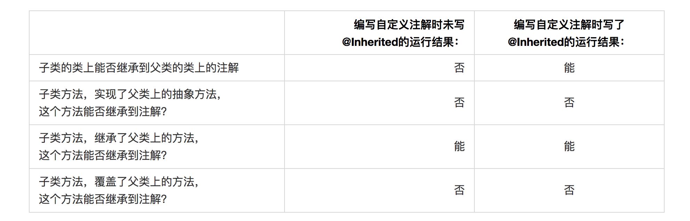

[TOC]
# 一、元注解
> 元注解的作用就是注解其他注解，一般我们使用自定义注解时，就需要用元注解来标注我们自己的注解，一共有以下四个元注解:

1. @Target：说明了Annotation被修饰的范围，可被用于 packages、types（类、接口、枚举、Annotation类型）、类型成员（方法、构造方法、成员变量、枚举值）、方法参数和本地变量（如循环变量、catch参数）。在Annotation类型的声明中使用了target可更加明晰其修饰的目标。
> 例：@Target(ElementType.TYPE) 
> 1. ElementType.CONSTRUCTOR:用于描述构造器 
> 2. ElementType.FIELD:用于描述域（类的成员变量） 
> 3. ElementType.LOCAL_VARIABLE:用于描述局部变量（方法内部变量） 
> 4. ElementType.METHOD:用于描述方法 
> 5. ElementType.PACKAGE:用于描述包  
> 6. ElementType.PARAMETER:用于描述参数 
> 7. ElementType.TYPE:用于描述类、接口(包括注解类型) 或enum声明

2. @Retention：定义了该Annotation被保留的时间长短，有些只在源码中保留，有时需要编译成的class中保留，有些需要程序运行时候保留。即描述注解的生命周期
> 例：@Retention(RetentionPolicy.RUNTIME) 
> 1. RetentionPoicy.SOURCE:在源文件中有效（即源文件保留） 
> 2. RetentionPoicy.CLASS:在class文件中有效（即class保留） 
> 3. RetentionPoicy.RUNTIME:在运行时有效（即运行时保留）

3. @Documented：它是一个标记注解，即没有成员的注解，用于描述其它类型的annotation应该被作为被标注的程序成员的公共API，因此可以被例如javadoc此类的工具文档化

4. @Inherited：它也是一个标记注解，它的作用是，被它标注的类型是可被继承的，比如一个class被
@Inherited标记，那么一个子类继承该class后，则这个annotation将被用于该class的子类。 
> 注意：一个类型被@Inherited修饰后，类并不从它所实现的接口继承annotation，方法并不从它所重载的方法继承annotation。
5. @Repeatable：Repeatable 是 Java SE 8中引入的，@Repeatable注释表明标记的注释可以多次应用于相同的声明或类型使用(即可以重复在同一个类、方法、属性等上使用)。

# 二、Spring中的注解

## 1、`@Configuration`注解

我们先来看看@Configuration 这个注解的定义
```java
@Target(ElementType.TYPE)
@Retention(RetentionPolicy.RUNTIME)
@Documented
@Component //@Component元注解
public @interface Configuration {
    String value() default "";
}
```
@Configuration 标记了@Component元注解，因此可以被@ComponentScan扫描并处理，在Spring容器初始化时Configuration类 会被注册到Bean容器中，最后还会实例化。


## 2、`@Controller`注解
表明一个注解的类是一个"Controller"，也就是控制器，可以把它理解为MVC 模式的Controller 这个角色。这个注解是一个特殊的@Component，允许实现类通过类路径的扫描扫描到。它通常与@RequestMapping 注解一起使用。
```java
@Target({ElementType.TYPE})
@Retention(RetentionPolicy.RUNTIME)
@Documented
@Component
public @interface Controller {

    @AliasFor(annotation = Component.class)
    String value() default "";

}
```
## 3、`@Service`注解
表明这个带注解的类是一个"Service"，也就是服务层，可以把它理解为MVC 模式中的Service层这个角色，这个注解也是一个特殊的@Component，允许实现类通过类路径的扫描扫描到
```java
@Target({ElementType.TYPE})
@Retention(RetentionPolicy.RUNTIME)
@Documented
@Component
public @interface Service {

    @AliasFor(annotation = Component.class)
    String value() default "";

}
```
## 4、`@Repository`注解
表明这个注解的类是一个"Repository",团队实现了JavaEE 模式中像是作为"Data Access Object" 可能作为DAO来使用，当与 PersistenceExceptionTranslationPostProcessor 结合使用时，这样注释的类有资格获得Spring转换的目的。这个注解也是@Component 的一个特殊实现，允许实现类能够被自动扫描到


```java
@Target({ElementType.TYPE})
@Retention(RetentionPolicy.RUNTIME)
@Documented
@Component
public @interface Repository {

    @AliasFor(annotation = Component.class)
    String value() default "";

}
```

上面四个注解标记的类都能够通过@ComponentScan 扫描到


# 三、自定义注解

自定义注解格式：
> public @interface 注解名 {定义体}


使用@interface定义一个注解，自动继承了java.lang.annotation.Annotation接口，其中的每一个方法实际上是声明了一个配置参数。方法的名称就是参数的名称，返回值类型就是参数的类型（返回值类型只能是基本类型、Class、String、enum）。可以通过default来声明参数的默认值。


注解参数的可支持数据类型：

> 1. 所有基本数据类型（int,float,boolean,byte,double,char,long,short) 
> 2. String类型 
> 3. Class类型 
> 4. enum类型 
> 5. Annotation类型 
> 6. 以上所有类型的数组


**定义注解成员的注意点:**

* 第一, 只能用public或默认(default)这两个访问权修饰.例如,String value();这里把方法设为defaul默认类型；

```java
@Target(ElementType.FIELD) 
@Retention(RetentionPolicy.RUNTIME) 
@Documented 
public @interface userName { 
    String value() default ""; 
    }
```
* 第二, 参数成员只能用基本类型byte,short,char,int,long,float,double,boolean八种基本数据类型和 String,Enum,Class,annotations等数据类型，以及这一些类型的数组。
```java
//定义一个枚举
public enum RequestMethod {
	GET, HEAD, POST, PUT, PATCH, DELETE, OPTIONS, TRACE
}


@Target({ElementType.METHOD, ElementType.TYPE})
@Retention(RetentionPolicy.RUNTIME)
@Documented
@Mapping
public @interface RequestMapping {
    String name() default "";

    String[] path() default {};

    RequestMethod[] method() default {};//枚举数组
}
```

* 第三，,如果只有一个参数成员,最好把参数名称设为"value",后加小括号。


## 注解的默认值

注解元素必须有确定的值，要么指定时给默认值，要么使用时给值。不过有时候我们需要确定表达一个元素不存在值，所以使用空字符串或者负数表示某个元素不存在，在定义注解时，这已经成为一个约定用法。
```java
@Target(ElementType.FIELD)
@Retention(RetentionPolicy.RUNTIME)
@Documented
public @interface User {

    public int id() default -1;
    public String name() default "";
    public String address() default "";
}
```
## 对于@Inherited注解的补充

> 结论：父类的类上和方法上有自定义注解，并且被@Inherited标记，那么子类只有继承的情况下才会继承父类注解。重写，重载，实现父类方法这些都不会继承父类注解。

# 四、示例

自定义注解的实现只需要3个类，一个声明注解，一个注解的具体实现，一个使用注解的实例即可。

1. 定义一个自定义注解。
```java
package com.zhangC.aop.customAnnotations;

import java.lang.annotation.*;

/**
 * Created by zhangc on 2019/9/23.
 */
@Documented
@Retention(RetentionPolicy.RUNTIME)
@Target(ElementType.METHOD)
public @interface customAnnoLog {
	String type() default "";
}

```
2. 注解的实现
```java
package com.zhangC.aop.customAnnotations;

/**
 * 功能：注解类的实现
 * Created by zhangc on 2019/9/23.
 */

import org.aspectj.lang.JoinPoint;
import org.aspectj.lang.ProceedingJoinPoint;
import org.aspectj.lang.annotation.*;
import org.springframework.stereotype.Component;

@Component
@Aspect
public class AspectImpl {

	@Pointcut("@annotation(com.zhangC.aop.customAnnotations.customAnnoLog)")
	private void cut() {
	}

// 开始环绕

	@Around("cut()")

	public Object around(ProceedingJoinPoint joinPoint) throws Throwable {

		System.out.println("AroundBefore");
		Object res = null;
		try {

			res = joinPoint.proceed();

		} catch (Exception e) {

			e.printStackTrace();

		}

		System.out.println("AroundAfter");
		return res;

	}

	@Before("cut()")

	public void before() {

		System.out.println("before");

	}

	@After("cut()")

	public void after() {

		System.out.println("after");

	}


	@AfterReturning(returning = "returnValue", pointcut = "@annotation(log)")
	public void afterReturn(JoinPoint point, Object returnValue, customAnnoLog log) {
		System.out.println("afterReturn");
		System.out.println("returnValue---" + returnValue);
		// 注解中的类型
		String enumKey = log.type();
		System.out.println("enumKey---" + enumKey);
		System.out.println(Type.valueOf(enumKey).getOperation());

	}

}
```
3. 注解中使用到的枚举类型
```java
package com.zhangC.aop.customAnnotations;

/**
 * Created by zhangc on 2019/9/24.
 */
public enum  Type {
	/**
	 * 操作类型
	 */
	WARNING("警告", "因被其他玩家举报，警告玩家");

	/**
	 * 类型
	 */
	private String type;

	/**
	 * 执行操作
	 */
	private String operation;

	Type(String type, String operation) {
		this.type = type;
		this.operation = operation;
	}

	public String getType() { return type; }

	public String getOperation() { return operation; }
}

```

4. 在项目中使用自定义注解
* 接口
```java
package com.zhangC.aop.execution;

/**
 * Created by zhangc on 2019/9/19.
 */
public interface Iface {
	 String say();

	 String saybyCoustomAnno();

	void printThrowException();
}

```
* 实现类
```java
package com.zhangC.aop.execution;

import com.zhangC.aop.customAnnotations.customAnnoLog;
import org.springframework.stereotype.Service;

/**
 * Created by zhangc on 2019/9/19.
 */
@Service
public class IfaceImpl implements Iface {

	@Override
	public String say() {
		System.out.println("hello Code");
		return "returnCode";
	}

	@Override
	@customAnnoLog(type = "WARNING")
	public String saybyCoustomAnno() {
		System.out.println("saybyCoustomAnno");
		return "returnCode";
	}

	@Override
	public void printThrowException() {
		System.out.println("Exception raised");
		throw new IllegalArgumentException();
	}
}

```

5. 测试方法。
```java
import com.zhangC.aop.execution.Iface;
import org.junit.Test;
import org.junit.runner.RunWith;
import org.springframework.beans.factory.annotation.Autowired;
import org.springframework.test.context.ContextConfiguration;
import org.springframework.test.context.junit4.SpringJUnit4ClassRunner;

/**
 * Created by zhangc on 2019/9/18.
 */
@ContextConfiguration(locations = {"classpath:applicationContext.xml"})
@RunWith(SpringJUnit4ClassRunner.class)
public class TestAop {
	@Autowired
	private Iface iface;

	@Test
	public void testCustomAnno(){
		iface.saybyCoustomAnno();
	}

}

```