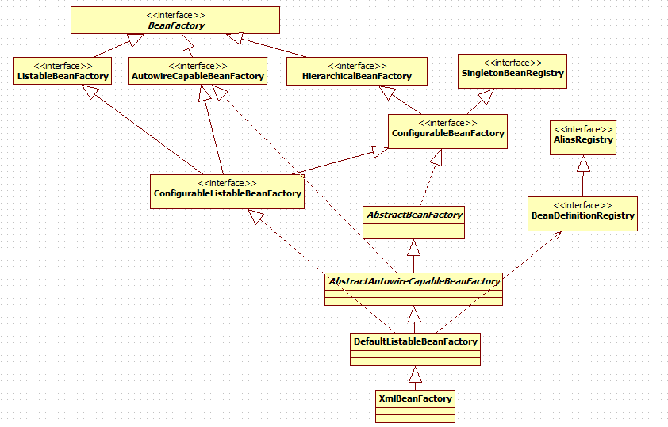

[TOC]
## 一、BeanFactory

BeanFactory 是 Spring 的“心脏”。它就是 Spring IoC 容器的真面目。Spring 使用 BeanFactory 来实例化、配置和管理 Bean。

BeanFactory：是IOC容器的核心接口， 它定义了IOC的基本功能，我们看到它主要定义了getBean方法。getBean方法是IOC容器获取bean对象和引发依赖注入的起点。方法的功能是返回特定的名称的Bean。

BeanFactory 是初始化 Bean 和调用它们生命周期方法的“吃苦耐劳者”。注意，BeanFactory 只能管理单例（Singleton）Bean 的生命周期。它不能管理原型(prototype,非单例)Bean 的生命周期。这是因为原型 Bean 实例被创建之后便被传给了客户端,容器失去了对它们的引用。

BeanFactory有着庞大的继承、实现体系，有众多的子接口、实现类。来看一下BeanFactory的基本类体系结构（接口为主）：



这是我画的BeanFactory基本的类体系结构，这里没有包括强大的ApplicationContext体系。

具体：
　　1. BeanFactory作为一个主接口不继承任何接口，暂且称为一级接口。
　　2. 有3个子接口继承了它，进行功能上的增强。这3个子接口称为二级接口。
　　3. ConfigurableBeanFactory可以被称为三级接口，对二级接口HierarchicalBeanFactory进行了再次增强，它还继承了另一个外来的接口SingletonBeanRegistry
　　4. ConfigurableListableBeanFactory是一个更强大的接口，继承了上述的所有接口，无所不包，称为四级接口。
　　（这4级接口是BeanFactory的基本接口体系。继续，下面是继承关系的2个抽象类和2个实现类：）
　　5. AbstractBeanFactory作为一个抽象类，实现了三级接口ConfigurableBeanFactory大部分功能。
　　6. AbstractAutowireCapableBeanFactory同样是抽象类，继承自AbstractBeanFactory，并额外实现了二级接口AutowireCapableBeanFactory
　　7. DefaultListableBeanFactory继承自AbstractAutowireCapableBeanFactory，实现了最强大的四级接口ConfigurableListableBeanFactory，并实现了一个外来接口BeanDefinitionRegistry，它并非抽象类。
　　8. 最后是最强大的XmlBeanFactory，继承自DefaultListableBeanFactory，重写了一些功能，使自己更强大。
 
 总结：
　　BeanFactory的类体系结构看似繁杂混乱，实际上由上而下井井有条，非常容易理解。
  
  
再来看一下BeanFactory的源码：
```java
package org.springframework.beans.factory;

public interface BeanFactory {

    /**
     * 用来引用一个实例，或把它和工厂产生的Bean区分开，就是说，如果一个FactoryBean的名字为a，那么，&a会得到那个Factory
     */
    String FACTORY_BEAN_PREFIX = "&";

    /*
     * 四个不同形式的getBean方法，获取实例
     */
    Object getBean(String name) throws BeansException;

    <T> T getBean(String name, Class<T> requiredType) throws BeansException;

    <T> T getBean(Class<T> requiredType) throws BeansException;

    Object getBean(String name, Object... args) throws BeansException;

    boolean containsBean(String name); // 是否存在

    boolean isSingleton(String name) throws NoSuchBeanDefinitionException;// 是否为单实例

    boolean isPrototype(String name) throws NoSuchBeanDefinitionException;// 是否为原型（多实例）

    boolean isTypeMatch(String name, Class<?> targetType)
            throws NoSuchBeanDefinitionException;// 名称、类型是否匹配

    Class<?> getType(String name) throws NoSuchBeanDefinitionException; // 获取类型

    String[] getAliases(String name);// 根据实例的名字获取实例的别名

}
```

具体：　　
1. 4个获取实例的方法。getBean的重载方法。　　
2. 4个判断的方法。判断是否存在，是否为单例、原型，名称类型是否匹配。　　
3. 1个获取类型的方法、一个获取别名的方法。根据名称获取类型、根据名称获取别名。一目了然！

总结：　　
这10个方法，很明显，这是一个典型的工厂模式的工厂接口。


BeanFactory最常见的实现类为XmlBeanFactory，可以从classpath或文件系统等获取资源。
```java
File file = new File("fileSystemConfig.xml");
Resource resource = new FileSystemResource(file);
BeanFactory beanFactory = new XmlBeanFactory(resource);
```
```java
Resource resource = new ClassPathResource("classpath.xml"); 
BeanFactory beanFactory = new XmlBeanFactory(resource);
```

XmlBeanFactory可以加载xml的配置文件。假设我们有一个Car类：

```java

package spring.ioc.demo1;

public class Car {

    private String brand;

    private String color;

    private int maxSpeed;

    public String getBrand() {
        return brand;
    }

    public void setBrand(String brand) {
        this.brand = brand;
    }

    public String getColor() {
        return color;
    }

    public void setColor(String color) {
        this.color = color;
    }

    public int getMaxSpeed() {
        return maxSpeed;
    }

    public void setMaxSpeed(int maxSpeed) {
        this.maxSpeed = maxSpeed;
    }
    
    public String toString(){
        return "the car is:"+ getBrand() + ", color is:" +getColor() +", maxspeed is:"+getMaxSpeed();
    }

    public Car() {

    }

    public Car(String brand, String color, int maxSpeed) {
        this.brand = brand;
        this.color = color;
        this.maxSpeed = maxSpeed;
    }

    public void introduce() {
        System.out.println("brand:" + brand + ";color:" + color + ";maxSpeed:"
                + maxSpeed);
    }

}
```

我们通过在applicationContext.xml中配置：
```xml
<bean id="car1" class="spring.ioc.demo1.Car"
        p:brand="spring注入-红旗001" 
        p:color="spring注入-紫色" 
        p:maxSpeed="520" />
```

通过XmlBeanFactory实现启动Spring IoC容器：
```java

public static void main(String[] args) {

    　ResourcePatternResolver resolver = new PathMatchingResourcePatternResolver();
      Resource res = resolver.getResource("classpath:applicationContext.xml");
      BeanFactory factory = new XmlBeanFactory(res);　　　　 　　　　
      //ApplicationContext factory=new ClassPathXmlApplicationContext("applicationContext.xml");             
       Car car = factory.getBean("car1",Car.class);
       System.out.println("car对象已经初始化完成");
       System.out.println(car.getMaxSpeed());
}
```

1. XmlBeanFactory通过Resource装载Spring配置信息冰启动IoC容器，然后就可以通过factory.getBean从IoC容器中获取Bean了。
2. 通过BeanFactory启动IoC容器时，并不会初始化配置文件中定义的Bean，初始化动作发生在第一个调用时。
3. 对于单实例（singleton）的Bean来说，BeanFactory会缓存Bean实例，所以第二次使用getBean时直接从IoC容器缓存中获取Bean。


## 二、ApplicationContext

如果说BeanFactory是Spring的心脏，那么ApplicationContext就是完整的躯体了，ApplicationContext由BeanFactory派生而来，提供了更多面向实际应用的功能。在BeanFactory中，很多功能需要以编程的方式实现，而在ApplicationContext中则可以通过配置实现。

BeanFactorty接口提供了配置框架及基本功能，但是无法支持spring的aop功能和web应用。而ApplicationContext接口作为BeanFactory的派生，因而提供BeanFactory所有的功能。而且ApplicationContext还在功能上做了扩展，相较于BeanFactorty，ApplicationContext还提供了以下的功能： 
1. MessageSource, 提供国际化的消息访问  
2. 资源访问，如URL和文件  
3. 事件传播特性，即支持aop特性
4. 载入多个（有继承关系）上下文 ，使得每一个上下文都专注于一个特定的层次，比如应用的web层 

ApplicationContext：是IOC容器另一个重要接口， 它继承了BeanFactory的基本功能， 同时也继承了容器的高级功能，如：MessageSource（国际化资源接口）、ResourceLoader（资源加载接口）、ApplicationEventPublisher（应用事件发布接口）等。


## 三、BeanFactory与ApplicationContext的区别

1. BeanFactroy采用的是延迟加载形式来注入Bean的，即只有在使用到某个Bean时(调用getBean())，才对该Bean进行加载实例化，这样，我们就不能发现一些存在的Spring的配置问题。而ApplicationContext则相反，它是在容器启动时，一次性创建了所有的Bean。这样，在容器启动时，我们就可以发现Spring中存在的配置错误。 相对于基本的BeanFactory，ApplicationContext 唯一的不足是占用内存空间。当应用程序配置Bean较多时，程序启动较慢。

2. BeanFacotry延迟加载,如果Bean的某一个属性没有注入，BeanFacotry加载后，直至第一次使用调用getBean方法才会抛出异常；而ApplicationContext则在初始化自身是检验，这样有利于检查所依赖属性是否注入；所以通常情况下我们选择使用 ApplicationContext。应用上下文则会在上下文启动后预载入所有的单实例Bean。通过预载入单实例bean ,确保当你需要的时候，你就不用等待，因为它们已经创建好了。

3. BeanFactory和ApplicationContext都支持BeanPostProcessor、BeanFactoryPostProcessor的使用，但两者之间的区别是：BeanFactory需要手动注册，而ApplicationContext则是自动注册。（Applicationcontext比 beanFactory 加入了一些更好使用的功能。而且 beanFactory 的许多功能需要通过编程实现而 Applicationcontext 可以通过配置实现。比如后处理 bean ， Applicationcontext 直接配置在配置文件即可而 beanFactory 这要在代码中显示的写出来才可以被容器识别。

4. beanFactory主要是面对与 spring 框架的基础设施，面对 spring 自己。而 Applicationcontex 主要面对与 spring 使用的开发者。基本都会使用 Applicationcontex 并非 beanFactory 。


## 四、BeanFactory跟FactoryBean的区别和联系

### BeanFactory    
1. BeanFactory是接口，用于管理Bean的一个工厂。BeanFactory是IOC容器的核心接口，它主要作用就是实例化、定位、配置应用程序中的对象及建立这些对象间的依赖。   

2. BeanFactory只是一个接口，并不是IOC容器的具体实现，Springp容器提供了很多种实现，如：XmlBeanFactory、ApplicationContext等。现在一般使用ApplicationContext，它包含了原始的BeanFactory的所有功能，同时还进行了扩展，如AOP功能、web应用等。XmlBeanFactory类似以XML配置元数据，实现将以XML方式描述组成的对象及对象间的依赖关系。

### FactoryBean
1. FactoryBean也是接口，实现此接口的类也是一种Bean。

2. FactoryBean可以说为IOC容器中Bean的实现提供了更加灵活的方式，FactoryBean在IOC容器的基础上给Bean的实现加上了一个简单工厂模式和装饰模式，我们可以在getObject()方法中灵活配置。

3. Spring中共有二种bean，一种是普通bean（就是上面说的BeanFactory管理的bean），另一种是实现FactoryBean接口的Bean。FactoryBean管理的Bean实际上也是由spring进行管理、实例化，配置，因此由FactoryBean管理的Bean不能再次配置到Spring配置文件中，否则会报异常。 

4. 从spring的applicationContext或BeanFactory获取bean时，获取到是FactoryBean创建的实例，而不是FactoryBean自己；如果想通过spring拿到FactoryBean，需要在名称前面加&符号。  

5. FactoryBean在IOC的应用，在我们获取Bean的时候，都会经过getObjectForBeanInstance方法，这个方法会进行如下判断：
    * 如果bean是被FactoryBean引用，但bean对象不是Factory，则抛出异常（BeanIsNotAFactoryException）；也就是说通过FactoryBean获取bean，这个bean不能配置到spring配置文件或者注解实例化；
    * 如果Bean实例不是FactoryBean，或者指定名称是FactoryBean引用，也就是普通的bean调用，则直接返回；
    * 以上情况都不是，则对FactoryBean调用