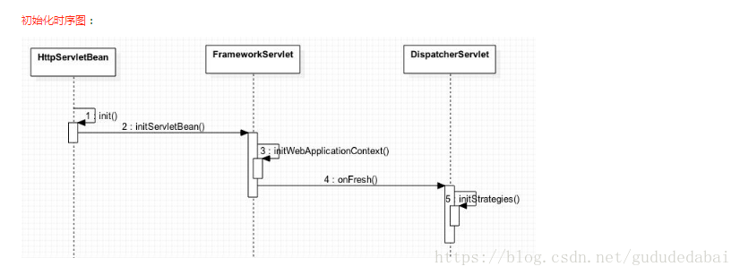
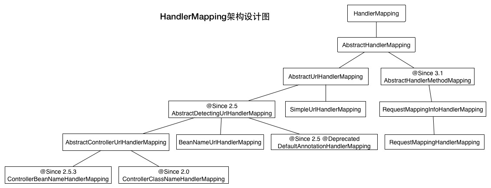
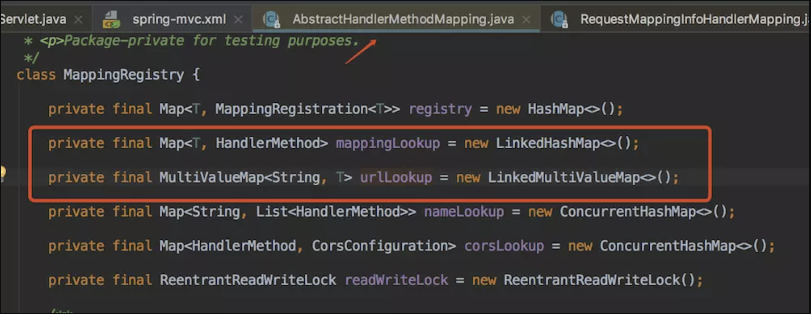

[TOC]

# 零. 简介
DispatchServlet继承体系：

主要是HttpServletBean、FrameworkServlet、DispatcherServlet的创建过程。

首先，我们看到这三个类直接实现了3个接口：`EnvironmentCapable、EnvironmentAware、ApplicationContextAware`。我们先来看下这3个接口都能干什么:
1. `ApplicationContextAware`：类似如XXXAware型的接口，表示对XXX可以进行感知，通俗解释就是：如果在某个类中想要使用spring的一些东西，就可以通过实现XXXAware接口来告诉spring，spring看到后就能给你传送过来，而接收的方式就是通过实现该接口的唯一方法setXXX()。
```java
public interface ApplicationContextAware extends Aware {

	/**
	 * Set the ApplicationContext that this object runs in.
	 * Normally this call will be used to initialize the object.
	 * <p>Invoked after population of normal bean properties but before an init callback such
	 * as {@link org.springframework.beans.factory.InitializingBean#afterPropertiesSet()}
	 * or a custom init-method. Invoked after {@link ResourceLoaderAware#setResourceLoader},
	 * {@link ApplicationEventPublisherAware#setApplicationEventPublisher} and
	 * {@link MessageSourceAware}, if applicable.
	 * @param applicationContext the ApplicationContext object to be used by this object
	 * @throws ApplicationContextException in case of context initialization errors
	 * @throws BeansException if thrown by application context methods
	 * @see org.springframework.beans.factory.BeanInitializationException
	 */
	void setApplicationContext(ApplicationContext applicationContext) throws BeansException;

}

```

2. `EnvironmentAware`同上

3. `EnvironmentCapable`：顾名思义，该接口表示具有Environment的能力，也就是可以提供Environment，该接口唯一的方法就是getEnvironment()，它将返回一个Environment对象。
```java
public interface EnvironmentCapable {

	/**
	 * Return the {@link Environment} associated with this component.
	 */
	Environment getEnvironment();

}

```
在HttpServletBean中的Environment里面封装了ServletContext、ServletConfig、JndiProperty、系统环境变量和系统属性，这里都封装到了其propertySources属性下。在实际开发中，当web容器初始化后，在web.xml中对DispatcherServlet设置的init-param就会封装到Environment里面：
```xml
<init-param>
      <param-name>contextConfigLocation</param-name>
      <param-value>classpath*:/spring/spring-mvc*.xml</param-value>
</init-param>
```



SpringMVC的创建过程一个有三个层次，分别是HttpServletBean,FramworkSerlet和DispatcherServlet.

* HttpServletBean的作用是将Servlet中的配置参数设置到相应的属性；

* FramworkSerlet的作用是初始化webApplicationContext；

* DispatcherServlet的作用是初始化自身的9个组件

# 一. HttpServletBean的init方法
Servlet初始化会调用 init 方法， SpringMVC进行初始化的时候首先会去执行HttpServletBean的init方法：
```java
 public final void init() throws ServletException {
        if (this.logger.isDebugEnabled()) {
            this.logger.debug("Initializing servlet '" + this.getServletName() + "'");
        }
       //从init参数设置bean属性
        PropertyValues pvs = new HttpServletBean.ServletConfigPropertyValues(this.getServletConfig(), this.requiredProperties);
        if (!pvs.isEmpty()) {
            try {
                BeanWrapper bw = PropertyAccessorFactory.forBeanPropertyAccess(this);
                ResourceLoader resourceLoader = new ServletContextResourceLoader(this.getServletContext());
                bw.registerCustomEditor(Resource.class, new ResourceEditor(resourceLoader, this.getEnvironment()));
                this.initBeanWrapper(bw);
                bw.setPropertyValues(pvs, true);
            } catch (BeansException var4) {
                if (this.logger.isErrorEnabled()) {
                    this.logger.error("Failed to set bean properties on servlet '" + this.getServletName() + "'", var4);
                }
 
                throw var4;
            }
        }
       //让子类做任何他们喜欢的初始化
        this.initServletBean();
        if (this.logger.isDebugEnabled()) {
            this.logger.debug("Servlet '" + this.getServletName() + "' configured successfully");
        }
 
    }
```

这段代码主要是在获取你在web.xml中配置在<init-param>中的属性(例如：`namespace， contextConfigLocation`)。
# 二. FrameworkServlet的initServletBean() 方法
上一节代码中的 initServletBean() 方法是由其子类 FrameworkServlet 实现，因此， 接下来 FramworkServlet 会执行 initServletBean 这个方法：
```java
protected final void initServletBean() throws ServletException {
        this.getServletContext().log("Initializing Spring FrameworkServlet '" + this.getServletName() + "'");
        if (this.logger.isInfoEnabled()) {
            this.logger.info("FrameworkServlet '" + this.getServletName() + "': initialization started");
        }
 
        long startTime = System.currentTimeMillis();
 
        try {
            //初始化WebApplicationContext
            this.webApplicationContext = this.initWebApplicationContext();
            //初始化FrameworkServlet，而且initFrameworkServlet()方法为模板方法，子类可以覆盖然后在里面做一下初始化的工作,但它的子类如DispatchServlet并没有使用它。
            this.initFrameworkServlet();
        } catch (RuntimeException | ServletException var5) {
            this.logger.error("Context initialization failed", var5);
            throw var5;
        }
 
        if (this.logger.isInfoEnabled()) {
            long elapsedTime = System.currentTimeMillis() - startTime;
            this.logger.info("FrameworkServlet '" + this.getServletName() + "': initialization completed in " + elapsedTime + " ms");
        }
 
    }
```
可以看到 initServletBean 方法中就调用了一个 initFrameworkServlet 方法和 initWebApplicationContext 方法，其中initFrameworkServlet方法是由子类实现，这个不多说，直接看 initWebApplicationContext 方法源码：
```java
 protected WebApplicationContext initWebApplicationContext() {
 
        //此处的 rootContext 在你配置了ContextLoaderListener的时候注入的，此rootContext即为Spring初始化时创建的WebApplicationContext。
        //通过分析ContextLoaderListenr的源码，可以看到ContextLoaderListener通过ContextLoader根据ApplicationContext.xml的配置会创建一个xmlWebApplicationContext
        //如果没有配置ContextLoaderListener,本处将为null,但不影响springMVC,因为会使用createWebApplicationContext去创建。
        
        //获取rootContext
        WebApplicationContext rootContext = WebApplicationContextUtils.getWebApplicationContext(this.getServletContext());
        WebApplicationContext wac = null;
       
       //设置webApplicationContext的第一种方法：
       //当webApplicationContext已经存在，那么就直接使用，使用之前会先设置rootContext为其父。
       //配置完成之后refresh一次，refresh会涉及到IOC的内容，本处不做探讨。
 
        if (this.webApplicationContext != null) {
            wac = this.webApplicationContext;
            if (wac instanceof ConfigurableWebApplicationContext) {
                ConfigurableWebApplicationContext cwac = (ConfigurableWebApplicationContext)wac;
                if (!cwac.isActive()) {
                    if (cwac.getParent() == null) {
                        cwac.setParent(rootContext);
                    }
 
                    this.configureAndRefreshWebApplicationContext(cwac);
                }
            }
        }
         //设置webApplicationContext的第二种方法：
        //如果不存在webApplicationContext,那么先去ServletContext中查找
        if (wac == null) {
            wac = this.findWebApplicationContext();
        }
        //设置webApplicationContext的第三种方法：
        //如果上述没有查到，那么就创建webApplicationContext
        if (wac == null) {
            wac = this.createWebApplicationContext(rootContext);
        }
        //只有当webApplicationcontext是通过第二种方法设置的时候才会走这一段代码
        if (!this.refreshEventReceived) {
             //此方法由DispatcherServlet调用
            this.onRefresh(wac);
        }
        //将webApplicationContext保存在ServletContext
        if (this.publishContext) {
            String attrName = this.getServletContextAttributeName();
            this.getServletContext().setAttribute(attrName, wac);
            if (this.logger.isDebugEnabled()) {
                this.logger.debug("Published WebApplicationContext of servlet '" + this.getServletName() + "' as ServletContext attribute with name [" + attrName + "]");
            }
        }
 
        return wac;
    }
```
**DispatcherServlet上下文在初始化的时候会建立自己的IoC上下文，用以持有spring mvc相关的bean。在建立DispatcherServlet自己的IoC上下文时，会利用`WebApplicationContext.ROOTWEBAPPLICATIONCONTEXTATTRIBUTE`先从ServletContext中获取之前的根上下文(即WebApplicationContext)作为自己上下文的parent上下文（有个parent属性作为对Spring的ApplicationContext的引用）。有了这个parent上下文之后，再初始化自己持有的上下文。**

initWebApplicationContext共做了三件事：
1. 获取Spring容器的webApplicationContext：
默认情况下，spring会将自己的容器设置成servletContext的属性，所以获取根容器只需要调用servletContext的getAttribute就可以了。

2. 设置`WebApplicationContext`并根据情况调用onRefresh方法，设置`WebApplicationContext`一共有3种方法：
    * 在构造方法中已经传递了`WebApplicationContext`参数，这时只需再对其进行设置即可。这种方法主要用于servlet3.0之后的环境，可以在程序中使用`servletContext.addServlet`方法注册servlet。这时就可以在新建`FrameworkServlet`和其子类的时候就通过构造方法传递已经准备好的WebApplicationContext。

    * `WebApplicationContext`已经存在于`servletContext`中了，这时只需要在配置servlet的时候将servletContext中的`WebApplicationContext`配置到`contextAttribute`属性就可以了

    * 在前面2种方法都无效的情况下使用，使用第三种方法。通过`createWebApplicationContext(rootContext)`创建`webApplicationContext`

注意：第三种方法的内部方法中，已经refresh()了，不需用在通过initWebApplicationContext()中的onRefresh()方法来refresh了。同样的，在第一种设置WebApplicationContext的方法中，也同样refresh过，所以只有在第二种方法的情况下，才会调用initWebApplicationContext()中的onRefresh()方法。不过不管通过哪种方式调用，onRefresh()方法肯定且只会调用一次，而且dispatchServlet正是通过重写这个模板方法来实现初始化的

看一下第三种方法调用的` createWebApplicationContext` 方法， 下面就看看这个方法的源码：
```java
protected WebApplicationContext createWebApplicationContext(@Nullable ApplicationContext parent) {
        
       //此处的contextClass 可在web.xml 中的《init-param》中指定
       //如果没有配置，那么默认的是XmlWebApplicationContext.class
        Class<?> contextClass = this.getContextClass();
        if (this.logger.isDebugEnabled()) {
            this.logger.debug("Servlet with name '" + this.getServletName() + "' will try to create custom WebApplicationContext context of class '" + contextClass.getName() + "', using parent context [" + parent + "]");
        }
 
        if (!ConfigurableWebApplicationContext.class.isAssignableFrom(contextClass)) {
            throw new ApplicationContextException("Fatal initialization error in servlet with name '" + this.getServletName() + "': custom WebApplicationContext class [" + contextClass.getName() + "] is not of type ConfigurableWebApplicationContext");
        } else {
             //此处利用反射创建
            ConfigurableWebApplicationContext wac = (ConfigurableWebApplicationContext)BeanUtils.instantiateClass(contextClass);
            wac.setEnvironment(this.getEnvironment());
            wac.setParent(parent);
            String configLocation = this.getContextConfigLocation();
            if (configLocation != null) {
                wac.setConfigLocation(configLocation);
            }
            //refresh一次，这里不多说
            this.configureAndRefreshWebApplicationContext(wac);
            return wac;
        }
    }
```

3. 将`WebApplicationContext`设置到`ServletContext`中

最后，会根据`publishContext`标志来判断是否将创建出来的`WebApplicationContext`设置到`servletContext`中，`publishContext`可以在配置`servlet`时通过`init-param`参数设置，`HttpServletBean`初始化时会将其设置到`publishContext`参数，之所以将`WebApplicationContext`设置到`servletContext`中，是为了方便获取。

此外，我介绍一下配置servlet时可以设置的初始化参数：

* contextAttribute：在servletContext的属性中，用作于webApplicationContext的属性名

* contextClass：创建webApplicationContext的类型

* contextConfigLocation：springmvc配置文件的位置

* publishContext：是否将webApplicationContext设置到servletContext的属性。

# 三. DispatcherServlet里面的 onRefresh 方法
FrameworkServlet初始化的时候会调用onRefresh()方法吗，这个方法是留给其子类DispatcherServlet调用的
```java

/**
 * This implementation calls {@link #initStrategies}.
 */
@Override
protected void onRefresh(ApplicationContext context) {
    initStrategies(context);
}

/**
 * 初始化此servlet使用的策略对象。
 * 以便初始化进一步的策略对象
 * Initialize the strategy objects that this servlet uses.
 * <p>May be overridden in subclasses in order to initialize further strategy objects.
 */
protected void initStrategies(ApplicationContext context) {
    // 初始化MultipartResolver 用来处理上传文件 默认是没有处理的，需要在上下文添加MultipartResolver处理器
    //  org.springframework.web.multipart.commons.CommonsMultipartResolver
    // org.springframework.web.multipart.support.ByteArrayMultipartFileEditor
    //  org.springframework.web.multipart.support.StringMultipartFileEditor
    initMultipartResolver(context);
    // 初始化LocaleResolver 配置国际化的
    initLocaleResolver(context);
    // 初始化ThemeResolver 通过主题控制页面风格
    initThemeResolver(context);
    // 初始化HandlerMappings  由定义请求和处理程序对象之间映射的对象实现
    initHandlerMappings(context);
    // 初始化HandlerAdapters
    initHandlerAdapters(context);
    // 初始化HandlerExceptionResolvers 异常处理
    initHandlerExceptionResolvers(context);
    // 初始化RequestToViewNameTranslator
    initRequestToViewNameTranslator(context);
    // 初始化ViewResolvers
    initViewResolvers(context);
    // 初始化FlashMapManager
    initFlashMapManager(context);
}
```


## 1.  initHandlerMappings()
Spring MVC的Controler主要由HandlerMapping和HandlerAdapter两个组件提供。HandlerMapping负责映射用户的URL和对应的处理类，HandlerMapping并没有规定这个URL与应用的处理类如何映射，在HandlerMapping接口中只定义了根据一个URL必须返回一个由HandlerExecutionChain代表的处理链，我们可以在这个处理链中添加任意的HandlerAdapter实例来处理这个URL对应的请求。

### 1.1 HandlerMapping的初始化程序

HandlerMapping是定义请求和处理程序对象之间的映射。这个类可以由开发人员实现，框架已经开发了
`org.springframework.web.servlet.handler.BeanNameUrlHandlerMapping`
和
`org.springframework.web.servlet.mvc.method.annotation.RequestMappingHandlerMapping`。如果在应用程序上下文中没有注册HandlerMapping bean，则默认使用前者。
```java
/**
     * 初始化 HandlerMappings.
     * <p>如果没有在命名空间定义,则默认使用BeanNameUrlHandlerMapping.
     */
    private void initHandlerMappings(ApplicationContext context) {
        this.handlerMappings = null;
//如果期望Spring MVC只加载指定的HandlerMapping，可以修改web.xml中的DispatcherServlet的初始化参数，将detectAllHandlerMappings的值设置为false。这样，Spring MVC就只会查找名为“handlerMapping”的bean，并作为当前系统的唯一的HandlerMapping。
        if (this.detectAllHandlerMappings) {
            // 查找ApplicationContext中的所有HandlerMappings，包括父上下文
            Map<String, HandlerMapping> matchingBeans = BeanFactoryUtils.beansOfTypeIncludingAncestors(context, HandlerMapping.class, true, false);
            if (!matchingBeans.isEmpty()) {
                this.handlerMappings = new ArrayList<>(matchingBeans.values());
                // 按照优先级排序.
                AnnotationAwareOrderComparator.sort(this.handlerMappings);
            }
        }
        else {
            try {
                HandlerMapping hm = context.getBean(HANDLER_MAPPING_BEAN_NAME, HandlerMapping.class);
                this.handlerMappings = Collections.singletonList(hm);
            }
            catch (NoSuchBeanDefinitionException ex) {
                // Ignore, we'll add a default HandlerMapping later.
            }
        }

        // 通过注册确保我们至少有一个HandlerMapping，如果找不到其他映射，则使用默认的HandlerMapping
        if (this.handlerMappings == null) {
            this.handlerMappings = getDefaultStrategies(context, HandlerMapping.class);
            if (logger.isDebugEnabled()) {
                logger.debug("No HandlerMappings found in servlet '" + getServletName() + "': using default");
            }
        }
    }
```

默认情况下，Spring MVC会加载在当前系统中所有实现了HandlerMapping接口的bean，再进行按优先级排序。优先级可以自定义。

所以对HandlerMaping的初始化，要看ApplicationContext中所有实现了HandlerMapping接口的bean。

### 1.2 HandlerMapping的实现类的初始化
首先我们来看下实现类结构:

**HandlerMapping的顶级抽象实现类AbstractHandlerMapping**
先看下该类中的初始化方法---` initApplicationContext()`方法：
```java
public abstract class AbstractHandlerMapping extends WebApplicationObjectSupport
		implements HandlerMapping, Ordered, BeanNameAware {
  /**
	 * Initializes the interceptors.在这里进行拦截器的初始化。
	 * @see #extendInterceptors(java.util.List)
	 * @see #initInterceptors()
	 */
	@Override
	protected void initApplicationContext() throws BeansException {
		extendInterceptors(this.interceptors);
		detectMappedInterceptors(this.mappedInterceptors);
		initInterceptors();
	}
//这个方法就是从容器中拿到所有的MappedInterceptor，然后加入到本类的变量中
  protected void detectMappedInterceptors(List<MappedInterceptor> mappedInterceptors) {
    mappedInterceptors.addAll(
            BeanFactoryUtils.beansOfTypeIncludingAncestors(
                    getApplicationContext(), MappedInterceptor.class, true, false).values());
} 
  }
```
实现了对拦截器的初始化。

继续看AbstractHandlerMapping的实现类。大致上分为两大类：
* AbstractUrlHandlerMapping 

* AbstractHandlerMethodMapping。

都继承自 AbstractHandlerMapping 抽象类，实现 HandlerMapping 接口。


#### 1.2.1 AbstractHandlerMapping 实现类分支之一 AbstractUrlHandlerMapping
该实现类用于对xml配置类型的参数进行初始化。

该实现类AbstractUrlHandlerMapping中的`registerHandler(url, handler);`方法。**是其后续实现类中共用的方法，用于将url和controller对应。**
```java
protected void registerHandler(String urlPath, Object handler) throws BeansException, IllegalStateException {
		Assert.notNull(urlPath, "URL path must not be null");
		Assert.notNull(handler, "Handler object must not be null");
		Object resolvedHandler = handler;
 
		// Eagerly resolve handler if referencing singleton via name.
       // 如果传进来的hander是字符串类型，则将该字符串作为beanName，去SpringMVC容器中加载该bean对象
		if (!this.lazyInitHandlers && handler instanceof String) {
			String handlerName = (String) handler;
			if (getApplicationContext().isSingleton(handlerName)) {
				resolvedHandler = getApplicationContext().getBean(handlerName);
			}
		}
 
		Object mappedHandler = this.handlerMap.get(urlPath);
		if (mappedHandler != null) {
			if (mappedHandler != resolvedHandler) {
				throw new IllegalStateException(
						"Cannot map " + getHandlerDescription(handler) + " to URL path [" + urlPath +
						"]: There is already " + getHandlerDescription(mappedHandler) + " mapped.");
			}
		}
		else {
			if (urlPath.equals("/")) {
				if (logger.isInfoEnabled()) {
					logger.info("Root mapping to " + getHandlerDescription(handler));
				}
				setRootHandler(resolvedHandler);
			}
			else if (urlPath.equals("/*")) {
				if (logger.isInfoEnabled()) {
					logger.info("Default mapping to " + getHandlerDescription(handler));
				}
				setDefaultHandler(resolvedHandler);
			}
			else {//经过一系列的过滤将urlPath作为key，resolvedHander作为value存储到this.handlerMap中。
				this.handlerMap.put(urlPath, resolvedHandler);
				if (logger.isInfoEnabled()) {
					logger.info("Mapped URL path [" + urlPath + "] onto " + getHandlerDescription(handler));
				}
			}
		}
	}
```
从这边就可以清楚的看到，有两种情况：
1. 传入的handler为字符串，则根据该handlerName去容器中加载改bean对象。

2. 如果传入的handler不是字符串，则直接作为可以处理url的bean对象，即resolvedHandler。

**将urlPath和和resolvedHandler放入handlerMap，这样就达到url的某个字段对应到具体的controller了的目的。** 当遇到有请求访问服务器的时候，就可以根据url找到具体的controller去执行这个请求了。


从类图可见，AbstractUrlHandlerMapping的实现类有两个：

* AbstractDetectingUrlHandlerMapping ---> BeanNameUrlHandlerMapping

* SimpleUrlHandlerMapping
##### 1.2.1.1  AbstractUrlHandlerMapping实现类分支之一AbstractDetectingUrlHandlerMapping
`AbstractDetectingUrlHandlerMapping`类中的的`initApplicationContext()`方法重写了顶级抽象实现类`AbstractHandlerMapping`的该方法，并增加了逻辑，主要用于将匹配该映射器的`Handler`对象加进`this.halderMap`里。

```java
@Override
public void initApplicationContext() throws ApplicationContextException {
    super.initApplicationContext();
    detectHandlers();
}
```

具体看一下`detectHandlers()`方法。在该方法中，通过调用父类`AbstractUrlHandlerMapping`的`registerHandler(urls, beanName)`方法将配对的beanName和urls分别作为键和值装进父类的handerMap集合中
```java
protected void detectHandlers() throws BeansException {
    ApplicationContext applicationContext = obtainApplicationContext();
    //将SpringMVC容器里面注册的Bean的name都找出来，放进String数组
    String[] beanNames = (this.detectHandlersInAncestorContexts ?
            BeanFactoryUtils.beanNamesForTypeIncludingAncestors(applicationContext, Object.class) :
            applicationContext.getBeanNamesForType(Object.class));

    // Take any bean name that we can determine URLs for.
    for (String beanName : beanNames) {
    //匹配到符合该映射器(HanderMapping)的bean的name则返回url，否则返回空。
        String[] urls = determineUrlsForHandler(beanName);//该方法为抽象方法，具体得看BeanNameUrlHandlerMapping子类中是怎么实现的。
        if (!ObjectUtils.isEmpty(urls)) {
            // URL paths found: Let's consider it a handler.
            registerHandler(urls, beanName);//调用父类AbstractUrlHandlerMapping的register方法将匹配的beanName和urls分别作为键和值装进父类的handerMap集合中。该方法和SimpleUrlHandlerMapping类是调用的同一个方法。
        }
    }

    if ((logger.isDebugEnabled() && !getHandlerMap().isEmpty()) || logger.isTraceEnabled()) {
        logger.debug("Detected " + getHandlerMap().size() + " mappings in " + formatMappingName());
    }
}
```

 **看一下子类BeanNameUrlHandlerMapping是如何实现`determineUrlsForHandler(beanName)`方法的。**
```java
/**
 * Checks name and aliases of the given bean for URLs, starting with "/".
 */
@Override
protected String[] determineUrlsForHandler(String beanName) {
    List<String> urls = new ArrayList<>();
    if (beanName.startsWith("/")) {
        urls.add(beanName);
    }
    String[] aliases = obtainApplicationContext().getAliases(beanName);
    for (String alias : aliases) {
        if (alias.startsWith("/")) {
            urls.add(alias);
        }
    }
    return StringUtils.toStringArray(urls);
}
```
在ApplicationContext中检查给定的bean名称和别名以“/”开头的，均放入String数组，并返回。

**示例：自定义一个使用BeanNameUrlHandlerMapping的视图。**
使用 `AbstractUrlHandlerMapping` 的实现类时，需要让控制层的类实现 Controller 接口（一般继承 AbstractController 即可），另外还有一些已经实现了的 Controller 类，如下图所示。但是不论是自己实现 Controller 接口还是继承系统已经实现的类，都只能处理一个请求。

1. 首先编写控制层代码
```java
import org.springframework.web.servlet.ModelAndView;
import org.springframework.web.servlet.mvc.AbstractController;

import javax.servlet.http.HttpServletRequest;
import javax.servlet.http.HttpServletResponse;

public class HelloController extends AbstractController {

    @Override
    protected ModelAndView handleRequestInternal(HttpServletRequest request, HttpServletResponse response) {
        System.out.println("访问方法进来了");
        ModelAndView mv = new ModelAndView();
        mv.setViewName("success");
        return mv;
    }
}
```
2. 接着在下面 SpringMVC 容器中注入 BeanNameUrlHandlerMapping 映射器和自定义的 Controller
```xml
<!-- 注册 HandlerMapping -->
<!--<bean class="org.springframework.web.servlet.handler.BeanNameUrlHandlerMapping"></bean>-->

<!-- <mvc:annotation-driven /> 自动帮我们注入 BeanNameUrlHandlerMapping 映射器, 所以与上面手动注入该映射器选其一就行  -->
<mvc:annotation-driven />

<!-- 注册 Handler -->
<bean id="/hello" class="com.ogemray.urlHandlerMapping.HelloController"></bean>
```
注意自定义 Controller 实现类注入 bean 的 id 或 name 必须以 "/" 开头，因为上面分析源码说过，BeanNameUrlHandlerMapping 映射器主要映射以 "/" 开头的 beanName。

##### 1.2.1.2  AbstractUrlHandlerMapping实现类分支之二SimpleUrlHandlerMapping

SimpleUrlHandlerMapping继承自AbstractUrlHandlerMapping。
```java
public class SimpleUrlHandlerMapping extends AbstractUrlHandlerMapping {
	@Override
	public void initApplicationContext() throws BeansException {
		super.initApplicationContext();
		registerHandlers(this.urlMap);
	}
   }
```
其中`super.initApplicationContext();`用于父类进行拦截器初始化。

再看initApplicationContext()方法调用的`registerHandlers(this.urlMap);`
```java
protected void registerHandlers(Map<String, Object> urlMap) throws BeansException {
		if (urlMap.isEmpty()) {
			logger.trace("No patterns in " + formatMappingName());
		}
		else {
			urlMap.forEach((url, handler) -> {
				// Prepend with slash if not already present.
				if (!url.startsWith("/")) {
					url = "/" + url;
				}
				// Remove whitespace from handler bean name.
				if (handler instanceof String) {
					handler = ((String) handler).trim();
				}
				registerHandler(url, handler);//调用父类AbstractUrlHandlerMapping
			});
			if (logger.isDebugEnabled()) {
				List<String> patterns = new ArrayList<>();
				if (getRootHandler() != null) {
					patterns.add("/");
				}
				if (getDefaultHandler() != null) {
					patterns.add("/**");
				}
				patterns.addAll(getHandlerMap().keySet());
				logger.debug("Patterns " + patterns + " in " + formatMappingName());
			}
		}
	}
```
该类主要是对urlMap中的key值进行了一些处理，要是没有“/”的就加上"/",去掉空格等处理。这里的urlMap就是在配置文件中SimpleUrlHandlerMapping的通过mappings属性注入的的内容。key是url的某个字段，value是bean的id。

另外主要是是调用了父类AbstractUrlHandlerMapping的`registerHandler(url, handler)`方法，将urlPath和和resolvedHandler放入`handlerMap`，这样就达到url的某个字段对应到具体的controller了的目的。


HandlerMapping的初始化过程主要分成两部分:
1. 通过`initInterceptors()`方法将`SimpleUrlHandlerMapping`中定义的`interceptors`包装成`HandlerInterceptor`对象保存在`adaptedInterceptors`数组中，

2. 通过`registerHandlers()`方法将`SimpleHandlerMapping`中定义的mappings（即URL与Handler的映射）注册到`handlerMap`集合中。

**示例：自定义一个使用SimpleUrlHandlerMapping的视图。**
1. 首先编写控制层代码
```java
import org.springframework.web.servlet.ModelAndView;
import org.springframework.web.servlet.mvc.AbstractController;

import javax.servlet.http.HttpServletRequest;
import javax.servlet.http.HttpServletResponse;

public class HelloController extends AbstractController {

    @Override
    protected ModelAndView handleRequestInternal(HttpServletRequest request, HttpServletResponse response) {
        System.out.println("访问方法进来了");
        ModelAndView mv = new ModelAndView();
        mv.setViewName("success");
        return mv;
    }
}
```
2. 接着在下面 SpringMVC 容器中注入 SimpleUrlHandlerMapping 映射器和自定义的 Controller
```xml
<!-- 注册 HandlerMapping -->
<bean class="org.springframework.web.servlet.handler.SimpleUrlHandlerMapping">
    <property name="mappings">
        <props>
            <prop key="/hello">helloController</prop>
        </props>
    </property>
</bean>
<!-- 注册 Handler -->
<bean id="helloController" class="com.ogemray.urlHandlerMapping.HelloController"></bean>
```
> BeanNameUrlHandlerMapping 和 SimpleUrlHandlerMapping 的区别

**BeanUrlHandlerMapping示例：**

```xml
<bean name="/hello.htm" class="com.raistudies.ui.comtroller.HelloController"/>
<bean name="/sayHello*" class="com.raistudies.ui.comtroller.HelloController"/>
<bean id="urlHandler" class="org.springframework.web.servlet.handler.BeanNameUrlHandlerMapping"/>
```
使用要点:
1. bean name就可以当做url

2. 必须为每个URL定义一个bean，尽管所有url都由一个bean提供。

**SimpleUrlHandlerMapping示例：**

```xml
<bean id="helloController" class="com.raistudies.ui.controller.HelloController"/>
  <bean id="urlHandler" class="org.springframework.web.servlet.handler.SimpleUrlHandlerMapping">
        <property name="urlMap">
            <map>
                <entry key="/hello.htm" value-ref="helloController"/>
                <entry key="/sayHello*" value-ref="helloController"/>
                <entry key="/welcome.html" value-ref="helloController"/>
                <entry key="/welcomeUser*" value-ref="helloController"/>
            </map>
        </property>
    </bean>
```
使用要点:
1. bean name无法作为url，需要做url->bean的映射。 

1. 对使用相同控制器的URL使用单个bean.

2. 不必为每个URL定义一个bean

#### 1.2.2 AbstractHandlerMapping 实现类分支之二 AbstractHandlerMethodMapping
该类用于对注解配置方式的参数进行初始化。

具体实现类只有一个 RequestMappingHandlerMapping，在开始下面正式逻辑分析之前，我们需要了解几个类。

> `HandlerMethod`类，可以简单理解为保持方法信息的pojo类。

>`RequestMappingInfo`类,主要用来记录方法上`@RequestMapping()` 注解里面的参数，用来给 `RequestMappingHandlerMapping `映射器来使用。
    
 在容器初始化过程中创建映射器(`RequestMappingHandlerMapping`)对象时，会寻找所有被`@Controller` 注解的**类**中被 `@RequestMapping` 注解的**方法**，然后解析方法上的`@RequestMapping` 注解，把解析结果封装成 `RequestMappingInfo` 对象，也就是说`RequestMappingInfo` 对象是用来装载方法的匹配相关信息，每个匹配的方法都会对应一个 `RequestMappingInfo` 对象。
 
```java
public final class RequestMappingInfo implements RequestCondition<RequestMappingInfo> {

	@Nullable
	private final String name;

   //模式请求路径过滤器，对应记录和判断 @RequestMapping 注解上的 value 属性。
	private final PatternsRequestCondition patternsCondition;
   
  //请求方法过滤器，对应记录和判断 @RequestMapping 注解上的 method 属性。
	private final RequestMethodsRequestCondition methodsCondition;
   
  //请求参数过滤器，对应记录和判断 @RequestMapping 注解上的 params 属性。
	private final ParamsRequestCondition paramsCondition;
   
  //头字段过滤器，对应记录和判断 @RequestMapping 注解上的 headers 属性。
	private final HeadersRequestCondition headersCondition;
   
  //请求媒体类型过滤器，对应记录和判断 @RequestMapping 注解上的 consumes 属性。
	private final ConsumesRequestCondition consumesCondition;
   
  //应答媒体类型过滤器，对应记录和判断 @RequestMapping 注解上的 produces 属性。
	private final ProducesRequestCondition producesCondition;
   
   //预留自定义扩展过滤器。
	private final RequestConditionHolder customConditionHolder;
    
  }
```
项目启动时会调用父类AbstractHandlerMethodMapping中的`afterPropertiesSet（）`方法维护url和HandlerMethod之间的关系
```java
public abstract class AbstractHandlerMethodMapping<T> extends AbstractHandlerMapping implements InitializingBean {
	/**
	 * Detects handler methods at initialization.
	 * @see #initHandlerMethods
	 */
	@Override
	public void afterPropertiesSet() {
		initHandlerMethods();
	}

	/**
	 * Scan beans in the ApplicationContext, detect and register handler methods.
	 * @see #getCandidateBeanNames()
	 * @see #processCandidateBean
	 * @see #handlerMethodsInitialized
	 */
	protected void initHandlerMethods() {
    //getCandidateBeanNames获取容器中注册的所有bean的name，一般不会去父容器中找
		for (String beanName : getCandidateBeanNames()) {
			if (!beanName.startsWith(SCOPED_TARGET_NAME_PREFIX)) {
				processCandidateBean(beanName);
			}
		}
		handlerMethodsInitialized(getHandlerMethods());
	}

	/**
	 * Determine the names of candidate beans in the application context.
	 * @since 5.1
	 * @see #setDetectHandlerMethodsInAncestorContexts
	 * @see BeanFactoryUtils#beanNamesForTypeIncludingAncestors
	 */
	protected String[] getCandidateBeanNames() {
		return (this.detectHandlerMethodsInAncestorContexts ?
				BeanFactoryUtils.beanNamesForTypeIncludingAncestors(obtainApplicationContext(), Object.class) :
				obtainApplicationContext().getBeanNamesForType(Object.class));
	}

	/**
	 * Determine the type of the specified candidate bean and call
	 * {@link #detectHandlerMethods} if identified as a handler type.
	 * <p>This implementation avoids bean creation through checking
	 * {@link org.springframework.beans.factory.BeanFactory#getType}
	 * and calling {@link #detectHandlerMethods} with the bean name.
	 * @param beanName the name of the candidate bean
	 * @since 5.1
	 * @see #isHandler
	 * @see #detectHandlerMethods
	 */
	protected void processCandidateBean(String beanName) {
		Class<?> beanType = null;
		try {
			beanType = obtainApplicationContext().getType(beanName);//获取对应bean的class
		}
		catch (Throwable ex) {
			// An unresolvable bean type, probably from a lazy bean - let's ignore it.
			if (logger.isTraceEnabled()) {
				logger.trace("Could not resolve type for bean '" + beanName + "'", ex);
			}
		}
		if (beanType != null && isHandler(beanType)) {
			detectHandlerMethods(beanName);//对满足isHandler的bean，继续解析
		}
	}
  }
```
`isHandler(..)` 是该抽象类定义的抽象方法，由实现类自己去实现匹对哪些类。
看下 `RequestMappingHandlerMapping`映射器是怎么实现的吧

```java
public class RequestMappingHandlerMapping extends RequestMappingInfoHandlerMapping
		implements MatchableHandlerMapping, EmbeddedValueResolverAware {
    /**
     * {@inheritDoc}
     * <p>Expects a handler to have either a type-level @{@link Controller}
     * annotation or a type-level @{@link RequestMapping} annotation.
     */
    @Override
    protected boolean isHandler(Class<?> beanType) {
        return (AnnotatedElementUtils.hasAnnotation(beanType, Controller.class) ||
                AnnotatedElementUtils.hasAnnotation(beanType, RequestMapping.class));
    }
}
```
看来 RequestMappingHandlerMapping 映射器，只要类上有 Controller 或 RequestMapping 注解，就符合该映射器管辖范围。

接着看`detectHandlerMethods()`方法
```java
public abstract class AbstractHandlerMethodMapping<T> extends AbstractHandlerMapping implements InitializingBean {
    /**
     * Look for handler methods in the specified handler bean.
     * @param handler either a bean name or an actual handler instance
     * @see #getMappingForMethod
     */
    protected void detectHandlerMethods(Object handler) {
        Class<?> handlerType = (handler instanceof String ?
                obtainApplicationContext().getType((String) handler) : handler.getClass());//获取该bean的class

        if (handlerType != null) {
            Class<?> userType = ClassUtils.getUserClass(handlerType);//防止bean是cglib生成的子类，获取用户自定义的bean的class
            Map<Method, T> methods = MethodIntrospector.selectMethods(userType,//得到该类的所有方法，遍历，合理的装进Map，并返回
                    (MethodIntrospector.MetadataLookup<T>) method -> {
                        try {
                            return getMappingForMethod(method, userType);//该抽象类的抽象接口，实现类自定义该方法是否符合映射规则，并返回该方法基本映射信息mapping对象。
                        }
                        catch (Throwable ex) {
                            throw new IllegalStateException("Invalid mapping on handler class [" +
                                    userType.getName() + "]: " + method, ex);
                        }
                    });
            if (logger.isTraceEnabled()) {
                logger.trace(formatMappings(userType, methods));
            }
            methods.forEach((method, mapping) -> {
                Method invocableMethod = AopUtils.selectInvocableMethod(method, userType);
                registerHandlerMethod(handler, invocableMethod, mapping);//将方法映射信息(mapping)、beanName(handler)以及方法对象(method)传入this.mappingRegistry.register(mapping, handler, method);方法，将其放入该映射器维护映射关系的缓存。
            });
        }
    }
    /**
	 * Register a handler method and its unique mapping. Invoked at startup for
	 * each detected handler method.
	 * @param handler the bean name of the handler or the handler instance
	 * @param method the method to register
	 * @param mapping the mapping conditions associated with the handler method
	 * @throws IllegalStateException if another method was already registered
	 * under the same mapping
	 */
	protected void registerHandlerMethod(Object handler, Method method, T mapping) {
		this.mappingRegistry.register(mapping, handler, method);
	}
}
```
来看下 RequestMappingHandlerMapping 是怎么实现抽象方法 `getMappingForMethod(..)` 方法的，该映射器都匹配什么样的方法呢？
```java
public class RequestMappingHandlerMapping extends RequestMappingInfoHandlerMapping
		implements MatchableHandlerMapping, EmbeddedValueResolverAware {
    /**
	 * Uses method and type-level @{@link RequestMapping} annotations to create
	 * the RequestMappingInfo.
	 * @return the created RequestMappingInfo, or {@code null} if the method
	 * does not have a {@code @RequestMapping} annotation.
	 * @see #getCustomMethodCondition(Method)
	 * @see #getCustomTypeCondition(Class)
	 */
	@Override
	@Nullable
	protected RequestMappingInfo getMappingForMethod(Method method, Class<?> handlerType) {
		RequestMappingInfo info = createRequestMappingInfo(method);//获取method上的RequestMappingInfo对象
		if (info != null) {
			RequestMappingInfo typeInfo = createRequestMappingInfo(handlerType);//获取Class上的RequestMappingInfo对象
			if (typeInfo != null) {
				info = typeInfo.combine(info);//将class上的映射信息和method上的映射信息做个整合，例如将@RequestMappping上的value拼上method才是完整的访问路径
			}
			String prefix = getPathPrefix(handlerType);
			if (prefix != null) {
				info = RequestMappingInfo.paths(prefix).options(this.config).build().combine(info);
			}
		}
		return info;
	}
   
   /**
	 * Delegates to {@link #createRequestMappingInfo(RequestMapping, RequestCondition)},
	 * supplying the appropriate custom {@link RequestCondition} depending on whether
	 * the supplied {@code annotatedElement} is a class or method.
	 * @see #getCustomTypeCondition(Class)
	 * @see #getCustomMethodCondition(Method)
	 */
	@Nullable
    //查看该method或Class有没有@RequestMaping注解，有的则创建返回记录信息的RequestMappingInfo对象
	private RequestMappingInfo createRequestMappingInfo(AnnotatedElement element) {
		RequestMapping requestMapping = AnnotatedElementUtils.findMergedAnnotation(element, RequestMapping.class);
		RequestCondition<?> condition = (element instanceof Class ?
				getCustomTypeCondition((Class<?>) element) : getCustomMethodCondition((Method) element));
		return (requestMapping != null ? createRequestMappingInfo(requestMapping, condition) : null);
	}
  }
```

`RequestMappingHandlerMapping` 映射器肯定匹配有` @RequestMapping` 注解的方法，并返回该方法的映射信息对象 `RequestMappingInfo` 对象。

下面就到了最后一步，具体这个映射关系是怎么装入映射器的 MappingRegistry 对象属性的缓存的呢？
`this.mappingRegistry.register(mapping,handler,method)`
```java
public void register(T mapping, Object handler, Method method) {
    // Assert that the handler method is not a suspending one.
    if (KotlinDetector.isKotlinType(method.getDeclaringClass()) && KotlinDelegate.isSuspend(method)) {
        throw new IllegalStateException("Unsupported suspending handler method detected: " + method);
    }
    this.readWriteLock.writeLock().lock();
    try {
        HandlerMethod handlerMethod = createHandlerMethod(handler, method);
        validateMethodMapping(handlerMethod, mapping);//检测HandlerMethod和mapping映射关系是否唯一
        this.mappingLookup.put(mapping, handlerMethod);

        List<String> directUrls = getDirectUrls(mapping);//因为@RequestMapping里面的value是一个数组，所以对应的路径可能有多个
        for (String url : directUrls) {
            this.urlLookup.add(url, mapping);
        }

        String name = null;
        if (getNamingStrategy() != null) {
            name = getNamingStrategy().getName(handlerMethod, mapping);
            addMappingName(name, handlerMethod);
        }

        CorsConfiguration corsConfig = initCorsConfiguration(handler, method, mapping);
        if (corsConfig != null) {
            this.corsLookup.put(handlerMethod, corsConfig);
        }

        this.registry.put(mapping, new MappingRegistration<>(mapping, handlerMethod, directUrls, name));
    }
    finally {
        this.readWriteLock.writeLock().unlock();
    }
}
```

**看下存储映射关系对象(MappingRegistry)内部结构**

该实体类里面最重要的两个记录集合分别是 mappingLookup 和 urlLookup 。

* mappingLookup：key 是 mapping 对象，一般是`RequestMappingInfo`，value 是 HandlerMethod 对象，最终是通过 lookupPath 在 urlLookup 集合中找到对应的 mapping 对象，通过 mapping 在 mappingLookup 集合中找到 HandlerMethod 对象。


* urlLookup：主要用来记录 lookupPath 请求路径对应的 mapping对象 集合。mapping对象一般是RequestMappingInfo。

    这里 Spring 留了一个很活的机制，拿 `@RequestMapping` 注解来说，他的 value 属性本身就是一个字符数组，在多重设置中难免有路径重复的，所以最终有可能会出现一个 lookupPath 对应多个 RequestMappingInfo，最终在请求过来的时候给了自定义抽象方法让实现类自己实现择优的方式。

    MutivalueMap 是 SpringMVC 自定义的一个 Map 类，key 对应的 value 是一个集合，这从名字上也能看出来。

## 2. initHandlerAdapters()
从名字联想也知道这是一个典型的适配器模式的使用。将一个接口转换成客户希望的另一个接口，使接口不兼容的那些类可以一起工作。DispatcherServlet在初始化HandlerAdapter时做了哪些内容呢？
```java
	private void initHandlerAdapters(ApplicationContext context) {
		this.handlerAdapters = null;
 
		if (this.detectAllHandlerAdapters) {
			// Find all HandlerAdapters in the ApplicationContext, including ancestor contexts.查找ApplicationContext中的所有HandlerAdapters，包括父上下文
			Map<String, HandlerAdapter> matchingBeans =
					BeanFactoryUtils.beansOfTypeIncludingAncestors(context, HandlerAdapter.class, true, false);
			if (!matchingBeans.isEmpty()) {
				this.handlerAdapters = new ArrayList<HandlerAdapter>(matchingBeans.values());
				// We keep HandlerAdapters in sorted order.
				OrderComparator.sort(this.handlerAdapters);
			}
		}
		else {
			try {
				HandlerAdapter ha = context.getBean(HANDLER_ADAPTER_BEAN_NAME, HandlerAdapter.class);
				this.handlerAdapters = Collections.singletonList(ha);
			}
			catch (NoSuchBeanDefinitionException ex) {
				// Ignore, we'll add a default HandlerAdapter later.
			}
		}
 
		// Ensure we have at least some HandlerAdapters, by registering
		// default HandlerAdapters if no other adapters are found.
		if (this.handlerAdapters == null) {
			this.handlerAdapters = getDefaultStrategies(context, HandlerAdapter.class);
			if (logger.isDebugEnabled()) {
				logger.debug("No HandlerAdapters found in servlet '" + getServletName() + "': using default");
			}
		}
	}
```
在初始化的方法中，查找`ApplicationContext`中的所有`HandlerAdapters`，保存在`DispatcherServlet`的`handlerAdapters`集合中。和HandlerMapping一样，同样在初始化的过程中涉及到一个变量`detectAllHandlerAdapters`，可通过设置该值为false来强制系统只加载`bean name`为`handlerAdapter`的对象。

如果没有定义HandlerAdapter的话，Spring MVC就会按照DispatcherServlet.properties所定义的内容来加载默认的HandlerAdapter。
```java
	protected <T> List<T> getDefaultStrategies(ApplicationContext context, Class<T> strategyInterface) {
		String key = strategyInterface.getName();
		String value = defaultStrategies.getProperty(key);
		if (value != null) {
			String[] classNames = StringUtils.commaDelimitedListToStringArray(value);
			List<T> strategies = new ArrayList<T>(classNames.length);
			for (String className : classNames) {
				try {
					Class<?> clazz = ClassUtils.forName(className, DispatcherServlet.class.getClassLoader());
					Object strategy = createDefaultStrategy(context, clazz);
					strategies.add((T) strategy);
				}
				catch (ClassNotFoundException ex) {
					throw new BeanInitializationException(
							"Could not find DispatcherServlet's default strategy class [" + className +
									"] for interface [" + key + "]", ex);
				}
				catch (LinkageError err) {
					throw new BeanInitializationException(
							"Error loading DispatcherServlet's default strategy class [" + className +
									"] for interface [" + key + "]: problem with class file or dependent class", err);
				}
			}
			return strategies;
		}
		else {
			return new LinkedList<T>();
		}
	}
```
通过getDefaultStrategies()方法，Spring会从defaultStrategies中加载对应的HandlerAdapter的属性，那么defaultStrategies是如何初始化的呢？
```java
	static {
		// Load default strategy implementations from properties file.
		// This is currently strictly internal and not meant to be customized
		// by application developers.
		try {
			ClassPathResource resource = new ClassPathResource(DEFAULT_STRATEGIES_PATH, DispatcherServlet.class);
			defaultStrategies = PropertiesLoaderUtils.loadProperties(resource);
		}
		catch (IOException ex) {
			throw new IllegalStateException("Could not load 'DispatcherServlet.properties': " + ex.getMessage());
		}
	}
```
通过DispatcherServlet的静态代码块可知，在系统加载的时候，defaultStrategies根据当前路径DispatcherServlet.properties来初始化本身。会默认加载`RequestMappingHandlerAdapter` 、`HttpRequestHandlerAdapter` 和 `SimpleControllerHandlerAdapter` 这三个配置器。(写了` <mvc:annotation-driven/> `会默认注入这三个适配器，不写也会默认注入)

### 在RequestMappingHandlerAdapter这个bean实例化的时候会加载消息转化器，同时加载参数和结果解析器。

```java
public RequestMappingHandlerAdapter() { //无参构造函数中初始化
        StringHttpMessageConverter stringHttpMessageConverter = new StringHttpMessageConverter();
        stringHttpMessageConverter.setWriteAcceptCharset(false);
        this.messageConverters = new ArrayList();
        this.messageConverters.add(new ByteArrayHttpMessageConverter());
        this.messageConverters.add(stringHttpMessageConverter);
        this.messageConverters.add(new SourceHttpMessageConverter());
        this.messageConverters.add(new AllEncompassingFormHttpMessageConverter());
    }
    private List<HandlerMethodReturnValueHandler> getDefaultReturnValueHandlers() { //构造参数解析器时候，注入进去
        List<HandlerMethodReturnValueHandler> handlers = new ArrayList();
        handlers.add(new ModelAndViewMethodReturnValueHandler());
        handlers.add(new ModelMethodProcessor());
        handlers.add(new ViewMethodReturnValueHandler());
        handlers.add(new HttpEntityMethodProcessor(this.getMessageConverters(), this.contentNegotiationManager));
        handlers.add(new CallableMethodReturnValueHandler());
        handlers.add(new DeferredResultMethodReturnValueHandler());
        handlers.add(new AsyncTaskMethodReturnValueHandler(this.beanFactory));
        handlers.add(new ModelAttributeMethodProcessor(false));
        handlers.add(new RequestResponseBodyMethodProcessor(this.getMessageConverters(), this.contentNegotiationManager));
        handlers.add(new ViewNameMethodReturnValueHandler());
        handlers.add(new MapMethodProcessor());
        if (this.getCustomReturnValueHandlers() != null) {
            handlers.addAll(this.getCustomReturnValueHandlers());
        }

        if (!CollectionUtils.isEmpty(this.getModelAndViewResolvers())) {
            handlers.add(new ModelAndViewResolverMethodReturnValueHandler(this.getModelAndViewResolvers()));
        } else {
            handlers.add(new ModelAttributeMethodProcessor(true));
        }

        return handlers;
    }
```