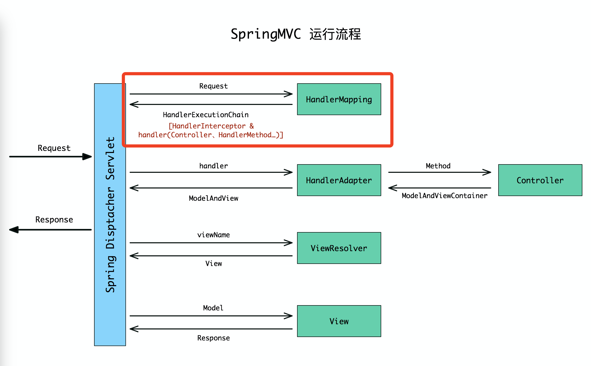
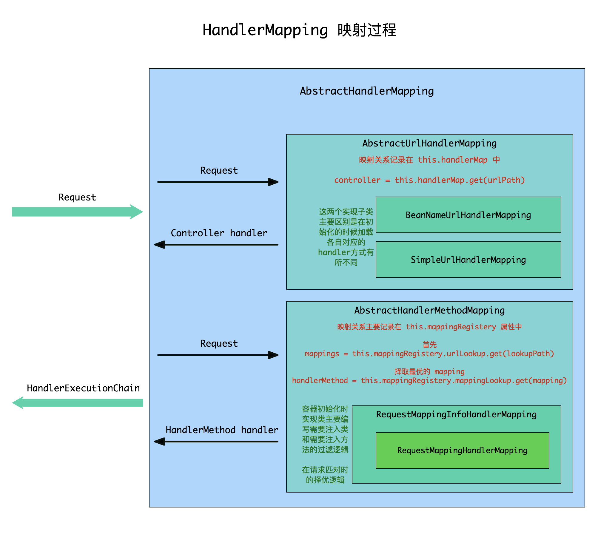
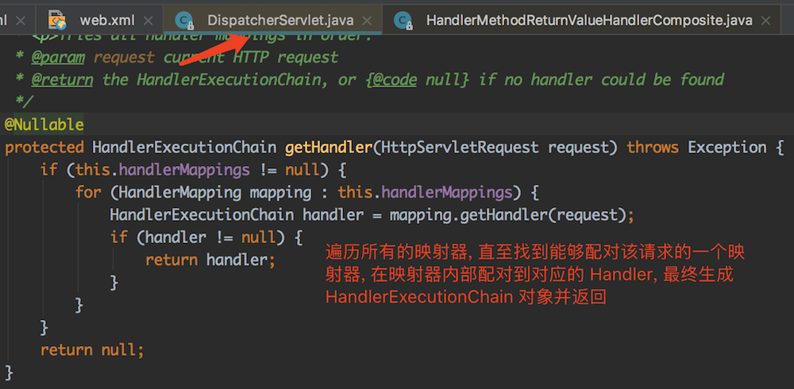

[TOC]

SpringMVC 内部是根据`HandlerMapping`将 `Request` 和 `Controller` 里面的方法对应起来的，为了方便理解，我这里把实现它的`子类`统称为映射处理器(ps: 自己一时兴起瞎起的，不准确还请见谅)。

* `HandlerMapping` 的功能就是根据请求匹配到对应的 `Handler`，然后将找到的 `Handler` 和其所匹配的 `HandlerInterceptor`（拦截器）绑定到创建的 `HandlerExecutionChain` 对象上并返回。

* `HandlerMapping` 只是一个接口类，不同的实现类有不同的匹对方式，根据功能的不同我们需要在 SpringMVC 容器中注入不同的映射处理器即`HandlerMapping`




# 一. 构造HandlerExecutionChain
在 DispatcherServlet 类中，`doDispatch(..)` 方法通过调用本类的` getHandler(..) `方法得到 `HandlerExecutionChain` 对象。

# 二. HandlerMapping 接口
在 HandlerMapping 接口中只有一个方法
```java
public interface HandlerMapping {
	HandlerExecutionChain getHandler(HttpServletRequest request) throws Exception;
}

```
首先我们来看下实现类结构:

大致上分为两大类 AbstractUrlHandlerMapping 和 AbstractHandlerMethodMapping。

都继承自 AbstractHandlerMapping 抽象类，实现 HandlerMapping 接口。

# 三. HandlerMapping 接口实现顶级抽象类 AbstractHandlerMapping
在 `AbstractHandlerMapping` 类中实现` getHandler(..) `接口方法得到 `HandlerExecutionChain` 对象

```java
public abstract class AbstractHandlerMapping extends WebApplicationObjectSupport
		implements HandlerMapping, Ordered, BeanNameAware {
/**
 * Look up a handler for the given request, falling back to the default
 * handler if no specific one is found.
 * @param request current HTTP request
 * @return the corresponding handler instance, or the default handler
 * @see #getHandlerInternal
 */
@Override
@Nullable
public final HandlerExecutionChain getHandler(HttpServletRequest request) throws Exception {
    Object handler = getHandlerInternal(request);//抽象类AbstractHandlerMapping的抽象方法，具体实现看子类
    if (handler == null) {
        handler = getDefaultHandler();
    }
    if (handler == null) {
        return null;
    }
    // Bean name or resolved handler?
    if (handler instanceof String) {//如果匹配到的Handle对象是字符串，则以字符串为id,在容器中拿到对象的Bean
        String handlerName = (String) handler;
        handler = obtainApplicationContext().getBean(handlerName);
    }
    //将匹配到的handler和request全部包装到HandlerExecutionChain对象中，并且在方法中加入了对拦截器的封装。
    HandlerExecutionChain executionChain = getHandlerExecutionChain(handler, request);

    if (logger.isTraceEnabled()) {
        logger.trace("Mapped to " + handler);
    }
    else if (logger.isDebugEnabled() && !request.getDispatcherType().equals(DispatcherType.ASYNC)) {
        logger.debug("Mapped to " + executionChain.getHandler());
    }

    if (hasCorsConfigurationSource(handler) || CorsUtils.isPreFlightRequest(request)) {
        CorsConfiguration config = (this.corsConfigurationSource != null ? this.corsConfigurationSource.getCorsConfiguration(request) : null);
        CorsConfiguration handlerConfig = getCorsConfiguration(handler, request);
        config = (config != null ? config.combine(handlerConfig) : handlerConfig);
        executionChain = getCorsHandlerExecutionChain(request, executionChain, config);//处理跨域请求
    }

    return executionChain;
}
}
```
对于`getHandlerExecutionChain()`:用于在handler中进一步封装拦截器
```java
protected HandlerExecutionChain getHandlerExecutionChain(Object handler, HttpServletRequest request) {
        HandlerExecutionChain chain = (handler instanceof HandlerExecutionChain ?
                (HandlerExecutionChain) handler : new HandlerExecutionChain(handler));
        chain.addInterceptors(getAdaptedInterceptors());
 
        String lookupPath = this.urlPathHelper.getLookupPathForRequest(request);
            //筛选过滤合适的interceptor加入HandlerExecutionChain 中
        for (MappedInterceptor mappedInterceptor : this.mappedInterceptors) {//在AbstractHandlerMapping的initApplicationContext()进行了拦截器的初始化，并配置到map中。
            if (mappedInterceptor.matches(lookupPath, this.pathMatcher)) {
                chain.addInterceptor(mappedInterceptor.getInterceptor());
            }
        }
 
        return chain;
    }
```


## 1. AbstractHandlerMapping 实现类分支之一 AbstractUrlHandlerMapping
`AbstractUrlHandlerMapping`：URL 映射的抽象基类，提供处理程序将URL映射到 Controller，所以该类最终直接返回的 handler 就是 Controller 对象。

实现父抽象类的抽象方法 `getHandlerInternal(..)` 匹配并返回对应的 Handler 对象。
```java
@Override
@Nullable
protected Object getHandlerInternal(HttpServletRequest request) throws Exception {
    String lookupPath = getUrlPathHelper().getLookupPathForRequest(request);//根据请求获取路径
    request.setAttribute(LOOKUP_PATH, lookupPath);
    Object handler = lookupHandler(lookupPath, request);//根据路径获取匹配handler
    if (handler == null) {
        // We need to care for the default handler directly, since we need to
        // expose the PATH_WITHIN_HANDLER_MAPPING_ATTRIBUTE for it as well.
        Object rawHandler = null;
        if ("/".equals(lookupPath)) {
            rawHandler = getRootHandler();
        }
        if (rawHandler == null) {
            rawHandler = getDefaultHandler();
        }
        if (rawHandler != null) {
            // Bean name or resolved handler?
            if (rawHandler instanceof String) {
                String handlerName = (String) rawHandler;
                rawHandler = obtainApplicationContext().getBean(handlerName);
            }
            validateHandler(rawHandler, request);
            handler = buildPathExposingHandler(rawHandler, lookupPath, lookupPath, null);
        }
    }
    return handler;
}
```


接下来咱们看看根据路径匹对 handler 的方法 `lookupHandler(..)`

```java
	@Nullable
	protected Object lookupHandler(String urlPath, HttpServletRequest request) throws Exception {
		// Direct match?
		Object handler = this.handlerMap.get(urlPath);//先尝试直接配对
		if (handler != null) {
			// Bean name or resolved handler?
			if (handler instanceof String) {
				String handlerName = (String) handler;
				handler = obtainApplicationContext().getBean(handlerName);
			}
			validateHandler(handler, request);
			return buildPathExposingHandler(handler, urlPath, urlPath, null);
		}

		// Pattern match?再尝试模式配对
		List<String> matchingPatterns = new ArrayList<>();
		for (String registeredPattern : this.handlerMap.keySet()) {
			if (getPathMatcher().match(registeredPattern, urlPath)) {
				matchingPatterns.add(registeredPattern);
			}
			else if (useTrailingSlashMatch()) {
				if (!registeredPattern.endsWith("/") && getPathMatcher().match(registeredPattern + "/", urlPath)) {
					matchingPatterns.add(registeredPattern + "/");
				}
			}
		}
    //其余省略。。。
    }
```
上面代码可以看出从 this.handlerMap 中通过 urlPath 匹对找到对应的 handler 对象。

## 2. AbstractHandlerMapping 实现类分支之二AbstractHandlerMethodMapping


实现父抽象类的抽象方法 `getHandlerInternal(..)` 匹配并返回对应的 Handler 对象。


```java
public abstract class AbstractHandlerMethodMapping<T> extends AbstractHandlerMapping implements InitializingBean {
/**
 * Look up a handler method for the given request.
 */
@Override
protected HandlerMethod getHandlerInternal(HttpServletRequest request) throws Exception {
    String lookupPath = getUrlPathHelper().getLookupPathForRequest(request);
    request.setAttribute(LOOKUP_PATH, lookupPath);
    this.mappingRegistry.acquireReadLock();
    try {
        HandlerMethod handlerMethod = lookupHandlerMethod(lookupPath, request);
        return (handlerMethod != null ? handlerMethod.createWithResolvedBean() : null);
    }
    finally {
        this.mappingRegistry.releaseReadLock();
    }
}
  }
```
跟前面的另一个实现分支 AbstractUrlHandlerMapping 实现看起来差不多，都是根据请求路径来匹配，但是内部配对方式有什么不同还需要我们接着往下看。

```java
public abstract class AbstractHandlerMethodMapping<T> extends AbstractHandlerMapping implements InitializingBean {

/**
 * Look up the best-matching handler method for the current request.
 * If multiple matches are found, the best match is selected.
 * @param lookupPath mapping lookup path within the current servlet mapping
 * @param request the current request
 * @return the best-matching handler method, or {@code null} if no match
 * @see #handleMatch(Object, String, HttpServletRequest)
 * @see #handleNoMatch(Set, String, HttpServletRequest)
 */
@Nullable
protected HandlerMethod lookupHandlerMethod(String lookupPath, HttpServletRequest request) throws Exception {
    List<Match> matches = new ArrayList<>();
    //根据请求的lookupPath，找到对应的记录映射方法信息的对象数据，也就是List<T>,当实现类是RequestMappingHandlerMapping时，T就是RequestMappingInfo
    List<T> directPathMatches = this.mappingRegistry.getMappingsByUrl(lookupPath);
    if (directPathMatches != null) {
        //有时候根据lookupPath匹配不了对应的方法记录信息，例如，resful风格，/test/{username},但实际lookupPath = /test/Tom,这样就需要遍历所有的mapping，一个个找。
        addMatchingMappings(directPathMatches, matches, request);
    }
    if (matches.isEmpty()) {
        // No choice but to go through all mappings...同上
        addMatchingMappings(this.mappingRegistry.getMappings().keySet(), matches, request);
    }

    if (!matches.isEmpty()) {
    //getMappingComparator为该抽象类的抽象方法，如果最终一个Request匹配出来多个RequestMappingInfo，那么最终由实现类自己实现排序逻辑
        Comparator<Match> comparator = new MatchComparator(getMappingComparator(request));
        matches.sort(comparator);
        Match bestMatch = matches.get(0);
        if (matches.size() > 1) {
            if (logger.isTraceEnabled()) {
                logger.trace(matches.size() + " matching mappings: " + matches);
            }
            if (CorsUtils.isPreFlightRequest(request)) {
                return PREFLIGHT_AMBIGUOUS_MATCH;
            }
            Match secondBestMatch = matches.get(1);
            if (comparator.compare(bestMatch, secondBestMatch) == 0) {
                Method m1 = bestMatch.handlerMethod.getMethod();
                Method m2 = secondBestMatch.handlerMethod.getMethod();
                String uri = request.getRequestURI();
                throw new IllegalStateException(
                        "Ambiguous handler methods mapped for '" + uri + "': {" + m1 + ", " + m2 + "}");
            }
        }
        request.setAttribute(BEST_MATCHING_HANDLER_ATTRIBUTE, bestMatch.handlerMethod);
        //添加到Request的属性表中，以便后面@PathVarible参数的处理  
        handleMatch(bestMatch.mapping, lookupPath, request);
        return bestMatch.handlerMethod;
    }
    else {
        return handleNoMatch(this.mappingRegistry.getMappings().keySet(), lookupPath, request);
    }
}

private void addMatchingMappings(Collection<T> mappings, List<Match> matches, HttpServletRequest request) {
    for (T mapping : mappings) {//遍历所有mapping，也就是上面找出来的List<RequestMappingInfo>
    //该抽象类的抽象方法，由实现类自己实现检测逻辑，检查请求映射信息中的条件是否与请求匹配。
        T match = getMatchingMapping(mapping, request);
        if (match != null) {
            //将匹配的RequestMappingInfo对象和对应的HandlerMethod对象装进Match对象，放进matches集合里。
            matches.add(new Match(match, this.mappingRegistry.getMappings().get(mapping)));
        }
    }
}
 }
```
注意：
* Match 就是该抽象类里面自定义的一个内部类，用来记录方法标记信息对象 mapping 和方法源信息对象 HandlerMethod。

* 当请求为 restful 风格时，将会遍历所有的 mapping，然后一个个匹对，非常耗时和费资源。优化请参考 [springMVC在restful风格的性能优化](https://blog.csdn.net/shjhhc/article/details/53261168)

* 上面的两个抽象方法`getMatchingMapping(..) `和 `getMappingComparator(..)`
    前者要实现检查提供的请求映射信息中的条件是否与请求匹配。
    后者要实现当一个 Request 对应多个 mapping 时的择优方案。

* 后续路径匹配参考[requestMapping-根据请求路径获取对应处理方法](https://blog.csdn.net/h2604396739/article/details/95176696)


# 四. 总结
* 现在开发我们基本都不用 AbstractUrlHandlerMapping 这种类型的映射器了，但是 SpringMVC 内部还有用到的地方，例如直接` <mvc:view-controller path="" view-name=""/> `标签配置资源不经过视图控制器直接跳转就用到了 `SimpleUrlHandlerMapping` 这种映射器。`AbstractUrlHandlerMapping` 匹配解析对应请求最终返回的 handler 是 `Controller` 对象。

* 现在我们习惯直接用 `@Controller` 和 `@RequestMapping` 这样注解来描述视图控制器的逻辑，这种资源映射用的是 `AbstractHandlerMethodMapping` 抽象类的子类 `RequestMappingHandlerMapping` 映射器，匹对解析对应的请求返回`HandlerMethod `对象。

