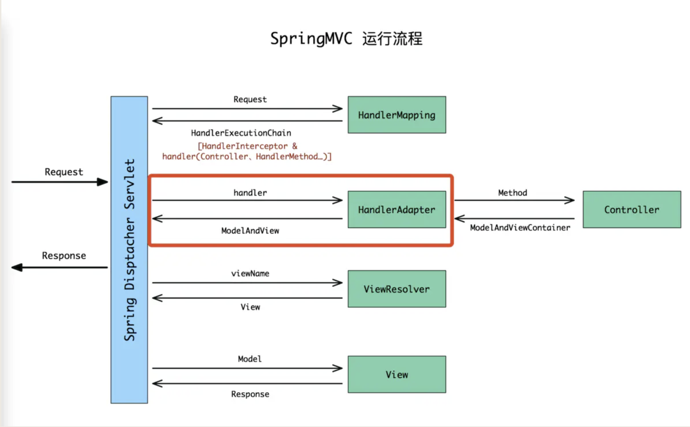
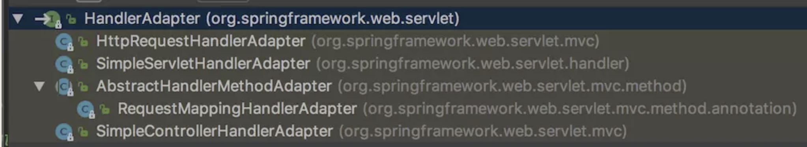
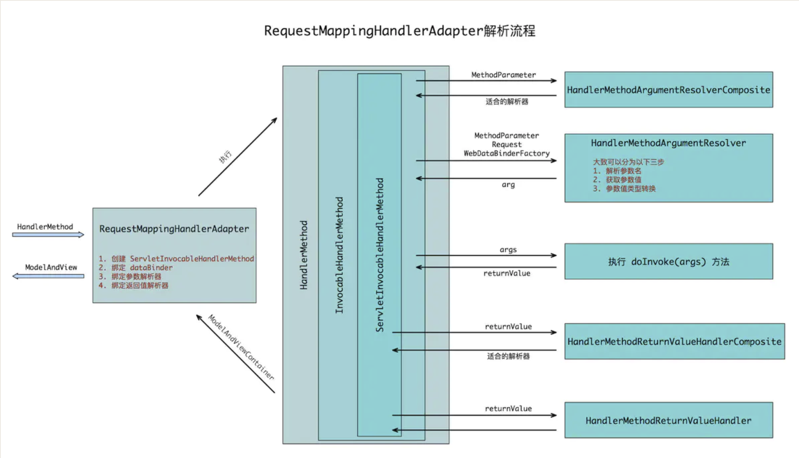
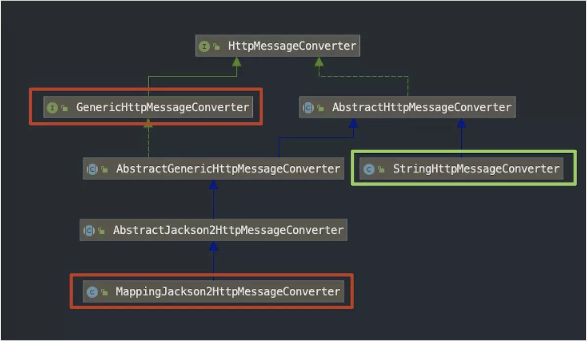
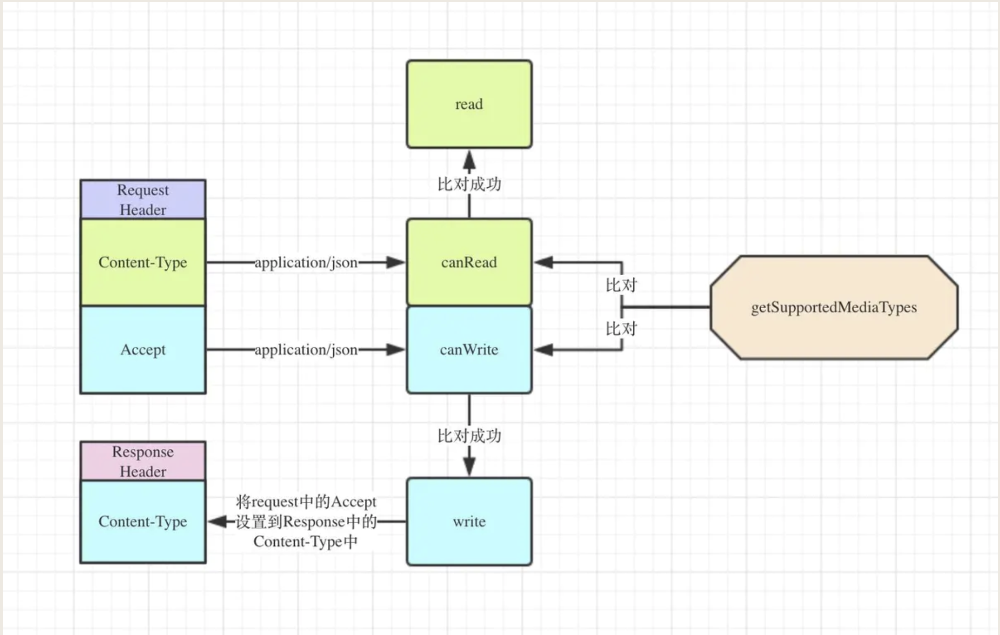

[TOC]

# 一. 适配器简介
**根据Handler查找HandlerAdapter，会首先判断初始化时注册的HandlerAdapter是否支持该Handler.**

**HandlerAdapter使用Handler处理请求，这里就是controller层写的代码执行的地方了。**

## 首先看一下适配器 HandlerAdapter 接口内部的方法
```java
public interface HandlerAdapter {

	/**
	 * 查看当前HandlerAdapter是否支持该handler解析
	 */
	boolean supports(Object handler);

	/**
	 * 利用handler处理请求
	 */
	@Nullable
	ModelAndView handle(HttpServletRequest request, HttpServletResponse response, Object handler) throws Exception;

	/**
	 * Same contract as for HttpServlet's {@code getLastModified} method.
	 * Can simply return -1 if there's no support in the handler class.
	 * @param request current HTTP request
	 * @param handler handler to use
	 * @return the lastModified value for the given handler
	 * @see javax.servlet.http.HttpServlet#getLastModified
	 * @see org.springframework.web.servlet.mvc.LastModified#getLastModified
	 */
	long getLastModified(HttpServletRequest request, Object handler);

}
```
## 再来看下适配器 HandlerAdapter 接口的实现链


### HttpRequestHandlerAdapter
HTTP请求处理器适配器,可以执行 HttpRequestHandler 类型的 handler，源码如下
```java
public class HttpRequestHandlerAdapter implements HandlerAdapter {

	@Override
	public boolean supports(Object handler) {
		return (handler instanceof HttpRequestHandler);
	}

	@Override
	@Nullable
	public ModelAndView handle(HttpServletRequest request, HttpServletResponse response, Object handler)
			throws Exception {

		((HttpRequestHandler) handler).handleRequest(request, response);
		return null;
	}
 }
```

### SimpleServletHandlerAdapter
可以执行 Servlet 类型的 handler，源码如下
```java
public class SimpleServletHandlerAdapter implements HandlerAdapter {

	@Override
	public boolean supports(Object handler) {
		return (handler instanceof Servlet);
	}

	@Override
	@Nullable
	public ModelAndView handle(HttpServletRequest request, HttpServletResponse response, Object handler)
			throws Exception {

		((Servlet) handler).service(request, response);
		return null;
	}
}
```

### SimpleControllerHandlerAdapter
继承Controller方式所使用的适配器,可以执行 Controller 类型的 handler，源码如下
```java
public class SimpleControllerHandlerAdapter implements HandlerAdapter {

	@Override
	public boolean supports(Object handler) {
		return (handler instanceof Controller);
	}

	@Override
	@Nullable
	public ModelAndView handle(HttpServletRequest request, HttpServletResponse response, Object handler)
			throws Exception {

		return ((Controller) handler).handleRequest(request, response);
	}
  }
```
AbstractUrlHandlerMapping 的子类映射器最终返回的 handler 是 Controller 类型，当时定义的视图控制器都继承自 AbstractController，视图必须实现 `handleRequestInternal(...)` 方法。
在 AbstractController 内部源码如下

```java
public abstract class AbstractController extends WebContentGenerator implements Controller {
    @Override
    @Nullable
    public ModelAndView handleRequest(HttpServletRequest request, HttpServletResponse response)
            throws Exception {

        if (HttpMethod.OPTIONS.matches(request.getMethod())) {
            response.setHeader("Allow", getAllowHeader());
            return null;
        }

        // Delegate to WebContentGenerator for checking and preparing.
        checkRequest(request);
        prepareResponse(response);

        // Execute handleRequestInternal in synchronized block if required.
        if (this.synchronizeOnSession) {
            HttpSession session = request.getSession(false);
            if (session != null) {
                Object mutex = WebUtils.getSessionMutex(session);
                synchronized (mutex) {
                    return handleRequestInternal(request, response);
                }
            }
        }

        return handleRequestInternal(request, response);
    }
}
```
从源码中可以看出 Controller 对象调用 `handlerRequest(..)` 方法最终经过处理后还是调用 `handleRequestInternal (..)` 方法。

### AbstractHandlerMethodAdapter
注解方式（`@Controller，@RequestMapping`）的处理器适配器。
在这里 AbstractHandlerMethodAdapter 只有一个实现子类就是 RequestMappingHandlerAdapter，AbstractHandlerMethodAdapter源码如下:
```java
public abstract class AbstractHandlerMethodAdapter extends WebContentGenerator implements HandlerAdapter, Ordered {
	/**
	 * This implementation expects the handler to be an {@link HandlerMethod}.
	 * @param handler the handler instance to check
	 * @return whether or not this adapter can adapt the given handler
	 */
	@Override
	public final boolean supports(Object handler) {
		return (handler instanceof HandlerMethod && supportsInternal((HandlerMethod) handler));
	}

	/**
	 * Given a handler method, return whether or not this adapter can support it.
	 * @param handlerMethod the handler method to check
	 * @return whether or not this adapter can adapt the given method
         * 该抽象类的抽象方法，由子类实现
	 */
	protected abstract boolean supportsInternal(HandlerMethod handlerMethod);

	/**
	 * This implementation expects the handler to be an {@link HandlerMethod}.
	 */
	@Override
	@Nullable
	public final ModelAndView handle(HttpServletRequest request, HttpServletResponse response, Object handler)throws Exception {

		return handleInternal(request, response, (HandlerMethod) handler);
	}

	/**
	 * Use the given handler method to handle the request.
	 * @param request current HTTP request
	 * @param response current HTTP response
	 * @param handlerMethod handler method to use. This object must have previously been passed to the
	 * {@link #supportsInternal(HandlerMethod)} this interface, which must have returned {@code true}.
	 * @return a ModelAndView object with the name of the view and the required model data,
	 * or {@code null} if the request has been handled directly
	 * @throws Exception in case of errors
     * 该抽象类的抽象方法，由子类实现
	 */
	@Nullable
	protected abstract ModelAndView handleInternal(HttpServletRequest request,HttpServletResponse response, HandlerMethod handlerMethod) throws Exception;
}

```

# 二. AbstractHandlerMethodAdapter 的实现类 RequestMappingHandlerAdapter


RequestMappingHandlerAdapter 大概解析流程如下:


## support方法
实际上support方法是在AbstractHandlerMethodAdapter这个父类实现的，子类只是实现了父类support方法中调用的supportsInternal方法：
```java
@Override
protected boolean supportsInternal(HandlerMethod handlerMethod) {
    return true;
}
```

## handle方法
实际上handle()方法是在父类`AbstractHandlerMethodAdapter`实现的,
```java
public abstract class AbstractHandlerMethodAdapter extends WebContentGenerator implements HandlerAdapter, Ordered {
	/**
	 * This implementation expects the handler to be an {@link HandlerMethod}.
	 */
	@Override
	@Nullable
	public final ModelAndView handle(HttpServletRequest request, HttpServletResponse response, Object handler)
			throws Exception {

		return handleInternal(request, response, (HandlerMethod) handler);
	}
}
```
子类`RequestMappingHandlerAdapter`实现`handleInternal()`方法：
```java
public class RequestMappingHandlerAdapter extends AbstractHandlerMethodAdapter implements BeanFactoryAware, InitializingBean {
    protected final ModelAndView handleInternal(HttpServletRequest request, HttpServletResponse response, HandlerMethod handlerMethod) throws Exception {
            if (this.getSessionAttributesHandler(handlerMethod).hasSessionAttributes()) {
                this.checkAndPrepare(request, response, this.cacheSecondsForSessionAttributeHandlers, true);
            } else {
                this.checkAndPrepare(request, response, true);
            } 
            if (this.synchronizeOnSession) {
                HttpSession session = request.getSession(false);
                if (session != null) {
                    Object mutex = WebUtils.getSessionMutex(session);
                    synchronized(mutex) {
                        return this.invokeHandleMethod(request, response, handlerMethod);
                    }
                }
            }
            //正式进入执行环节
            return this.invokeHandleMethod(request, response, handlerMethod);
        }
    }
```

## invokeHandleMethod方法
```java
public class RequestMappingHandlerAdapter extends AbstractHandlerMethodAdapter implements BeanFactoryAware, InitializingBean {
    private ModelAndView invokeHandleMethod(HttpServletRequest request, HttpServletResponse response, HandlerMethod handlerMethod) throws Exception {
            ServletWebRequest webRequest = new ServletWebRequest(request, response);
            //创建@InitBinder注解的方法的工厂类，进行缓存
            WebDataBinderFactory binderFactory = this.getDataBinderFactory(handlerMethod); 
            //创建@ModelAttribute@ControllerAdvice注解方法工厂并缓存
            ModelFactory modelFactory = this.getModelFactory(handlerMethod, binderFactory);
            ServletInvocableHandlerMethod requestMappingMethod = this.createRequestMappingMethod(handlerMethod, binderFactory);
            //创建结果容器并初始化一些参数
            ModelAndViewContainer mavContainer = new ModelAndViewContainer(); 
            mavContainer.addAllAttributes(RequestContextUtils.getInputFlashMap(request));
            //执行@ModelAttribute注解的方法，将结果放到结果容器中
            modelFactory.initModel(webRequest, mavContainer, requestMappingMethod);
            mavContainer.setIgnoreDefaultModelOnRedirect(this.ignoreDefaultModelOnRedirect);
            AsyncWebRequest asyncWebRequest = WebAsyncUtils.createAsyncWebRequest(request, response); 
            asyncWebRequest.setTimeout(this.asyncRequestTimeout);
            WebAsyncManager asyncManager = WebAsyncUtils.getAsyncManager(request);
            asyncManager.setTaskExecutor(this.taskExecutor);
            asyncManager.setAsyncWebRequest(asyncWebRequest);
            asyncManager.registerCallableInterceptors(this.callableInterceptors);
            asyncManager.registerDeferredResultInterceptors(this.deferredResultInterceptors);
            if (asyncManager.hasConcurrentResult()) {
                Object result = asyncManager.getConcurrentResult();
                mavContainer = (ModelAndViewContainer)asyncManager.getConcurrentResultContext()[0];
                asyncManager.clearConcurrentResult();
                if (this.logger.isDebugEnabled()) {
                    this.logger.debug("Found concurrent result value [" + result + "]");
                }

                requestMappingMethod = requestMappingMethod.wrapConcurrentResult(result);
            }

            //执行 ServletInvocableHandlerMethod 的 invokeAndHandle(...) 方法。
            requestMappingMethod.invokeAndHandle(webRequest, mavContainer, new Object[0]); 
            //先判断是不是当前线程的handler，是的话，从ModelAndView中取出处理结果返回。
            return asyncManager.isConcurrentHandlingStarted() ? null : this.getModelAndView(mavContainer, modelFactory, webRequest);
        }
      }
```
总结：
RequestMappingHandlerAdapter 在内部对于每个请求，都会实例化一个 ServletInvocableHandlerMethod 进行处理。
ServletInvocableHandlerMethod 内部会分别对请求跟响应进行处理。

## invokeAndHandle方法
```java
public class ServletInvocableHandlerMethod extends InvocableHandlerMethod {

    public final void invokeAndHandle(ServletWebRequest webRequest, ModelAndViewContainer mavContainer, Object... providedArgs) throws Exception {
            Object returnValue = this.invokeForRequest(webRequest, mavContainer, providedArgs); //执行方法，获取返回值
            this.setResponseStatus(webRequest);
            if (returnValue == null) {
                if (this.isRequestNotModified(webRequest) || this.hasResponseStatus() || mavContainer.isRequestHandled()) {
                    mavContainer.setRequestHandled(true);
                    return;
                }
            } else if (StringUtils.hasText(this.responseReason)) {
                mavContainer.setRequestHandled(true);
                return;
            }

            mavContainer.setRequestHandled(false);

            try { //处理返回值 ，封装结果集
                this.returnValueHandlers.handleReturnValue(returnValue, this.getReturnValueType(returnValue), mavContainer, webRequest);
            } catch (Exception var6) {
                if (this.logger.isTraceEnabled()) {
                    this.logger.trace(this.getReturnValueHandlingErrorMessage("Error handling return value", returnValue), var6);
                }

                throw var6;
            }
        }
   }
```
以下分为两个部分：

1. 方法的执行 `this.invokeForRequest()`

2. 返回值的处理`this.returnValueHandlers.handleReturnValue（）`


### 1. 方法的执行invokeForRequest方法
```java
public final Object invokeForRequest(NativeWebRequest request, ModelAndViewContainer mavContainer, Object... providedArgs) throws Exception {
        Object[] args = this.getMethodArgumentValues(request, mavContainer, providedArgs); //处理参数
        if (this.logger.isTraceEnabled()) {
            StringBuilder builder = new StringBuilder("Invoking [");
            builder.append(this.getMethod().getName()).append("] method with arguments ");
            builder.append(Arrays.asList(args));
            this.logger.trace(builder.toString());
        }

        Object returnValue = this.invoke(args); //在这里通过反射执行controller层的方法。
        if (this.logger.isTraceEnabled()) {
            this.logger.trace("Method [" + this.getMethod().getName() + "] returned [" + returnValue + "]");
        }

        return returnValue;
    }
```
继续看一下处理参数方法：`getMethodArgumentValues（）`：
```java
private Object[] getMethodArgumentValues(NativeWebRequest request, ModelAndViewContainer mavContainer, Object... providedArgs) throws Exception {
        MethodParameter[] parameters = this.getMethodParameters();
        Object[] args = new Object[parameters.length];

        for(int i = 0; i < parameters.length; ++i) { //遍历方法的所有参数
            MethodParameter parameter = parameters[i];
            parameter.initParameterNameDiscovery(this.parameterNameDiscoverer);
            GenericTypeResolver.resolveParameterType(parameter, this.getBean().getClass()); //获取设置参数类型
            args[i] = this.resolveProvidedArgument(parameter, providedArgs);
            if (args[i] == null) {
                if (this.argumentResolvers.supportsParameter(parameter)) { //遍历预置的参数解析器
                    try { //由找到的参数解析器，来解析参数
                        args[i] = this.argumentResolvers.resolveArgument(parameter, mavContainer, request, this.dataBinderFactory);
                    } catch (Exception var9) {
                        if (this.logger.isTraceEnabled()) {
                            this.logger.trace(this.getArgumentResolutionErrorMessage("Error resolving argument", i), var9);
                        }

                        throw var9;
                    }
                } else if (args[i] == null) {
                    String msg = this.getArgumentResolutionErrorMessage("No suitable resolver for argument", i);
                    throw new IllegalStateException(msg);
                }
            }
        }

        return args;
    }
```
对于遍历参数解析器`supportsParameter`方法和解析参数`resolveArgument`方法，

这里以用于`@RequestBody和@ResponseBody`的解析器`RequestResponseBodyMethodProcessor`为例,

并且配置`MappingJackson2HttpMessageConverter`（用于map和json之间的转换）作为消息转换器：
```java

public class RequestResponseBodyMethodProcessor extends AbstractMessageConverterMethodProcessor {
@Override
public boolean supportsParameter(MethodParameter parameter) {
    return parameter.hasParameterAnnotation(RequestBody.class);//这是处理请求的部分，所以只判断了RequestBody.class，在处理返回值时对ResponseBody.class进行了判断
}

/**
 * Throws MethodArgumentNotValidException if validation fails.
 * @throws HttpMessageNotReadableException if {@link RequestBody#required()}
 * is {@code true} and there is no body content or if there is no suitable
 * converter to read the content with.
 */
@Override
public Object resolveArgument(MethodParameter parameter, @Nullable ModelAndViewContainer mavContainer,
        NativeWebRequest webRequest, @Nullable WebDataBinderFactory binderFactory) throws Exception {

    parameter = parameter.nestedIfOptional();
    Object arg = readWithMessageConverters(webRequest, parameter, parameter.getNestedGenericParameterType());
    String name = Conventions.getVariableNameForParameter(parameter);

    if (binderFactory != null) {
        WebDataBinder binder = binderFactory.createBinder(webRequest, arg, name);
        if (arg != null) {
            validateIfApplicable(binder, parameter);
            if (binder.getBindingResult().hasErrors() && isBindExceptionRequired(binder, parameter)) {
                throw new MethodArgumentNotValidException(parameter, binder.getBindingResult());
            }
        }
        if (mavContainer != null) {
        //将处理完成后的返回值arg经过数据绑定后放入mavContainer的属性中
            mavContainer.addAttribute(BindingResult.MODEL_KEY_PREFIX + name, binder.getBindingResult());
        }
    }

    return adaptArgumentIfNecessary(arg, parameter);
}

}
```
继续看其中的`readWithMessageConverters()`方法：
```java
@Override
protected <T> Object readWithMessageConverters(NativeWebRequest webRequest, MethodParameter parameter,
        Type paramType) throws IOException, HttpMediaTypeNotSupportedException, HttpMessageNotReadableException {

    HttpServletRequest servletRequest = webRequest.getNativeRequest(HttpServletRequest.class);
    Assert.state(servletRequest != null, "No HttpServletRequest");
    ServletServerHttpRequest inputMessage = new ServletServerHttpRequest(servletRequest);

    Object arg = readWithMessageConverters(inputMessage, parameter, paramType);
    if (arg == null && checkRequired(parameter)) {
        throw new HttpMessageNotReadableException("Required request body is missing: " +
                parameter.getExecutable().toGenericString(), inputMessage);
    }
    return arg;
}
```
调用了父类AbstractMessageConverterMethodProcessor的父类AbstractMessageConverterMethodArgumentResolver中的`readWithMessageConverters（）`方法：
```java
public abstract class AbstractMessageConverterMethodArgumentResolver implements HandlerMethodArgumentResolver {
    @Nullable
    protected <T> Object readWithMessageConverters(HttpInputMessage inputMessage, MethodParameter parameter,
            Type targetType) throws IOException, HttpMediaTypeNotSupportedException, HttpMessageNotReadableException {

        MediaType contentType;
        boolean noContentType = false;
        try {
            contentType = inputMessage.getHeaders().getContentType();
        }
        catch (InvalidMediaTypeException ex) {
            throw new HttpMediaTypeNotSupportedException(ex.getMessage());
        }
        if (contentType == null) {
            noContentType = true;
            contentType = MediaType.APPLICATION_OCTET_STREAM;
        }

        Class<?> contextClass = parameter.getContainingClass();
        Class<T> targetClass = (targetType instanceof Class ? (Class<T>) targetType : null);
        if (targetClass == null) {
            ResolvableType resolvableType = ResolvableType.forMethodParameter(parameter);
            targetClass = (Class<T>) resolvableType.resolve();
        }

        HttpMethod httpMethod = (inputMessage instanceof HttpRequest ? ((HttpRequest) inputMessage).getMethod() : null);
        Object body = NO_VALUE;

        EmptyBodyCheckingHttpInputMessage message;
        try {
            message = new EmptyBodyCheckingHttpInputMessage(inputMessage);
            // 遍历 messageConverters,取出所有的HttpMessageConverter
            for (HttpMessageConverter<?> converter : this.messageConverters) {
                Class<HttpMessageConverter<?>> converterType = (Class<HttpMessageConverter<?>>) converter.getClass();
                //主要判断 MappingJackson2HttpMessageConverter 是否是 GenericHttpMessageConverter 类型
                GenericHttpMessageConverter<?> genericConverter =
                        (converter instanceof GenericHttpMessageConverter ? (GenericHttpMessageConverter<?>) converter : null);
                if (genericConverter != null ? genericConverter.canRead(targetType, contextClass, contentType) :
                        (targetClass != null && converter.canRead(targetClass, contentType))) {
                    if (message.hasBody()) {
                        HttpInputMessage msgToUse =
                                getAdvice().beforeBodyRead(message, parameter, targetType, converterType);
                        //调用read方法读取消息
                        body = (genericConverter != null ? genericConverter.read(targetType, contextClass, msgToUse) : ((HttpMessageConverter<T>) converter).read(targetClass, msgToUse));
                        //处理MediaType
                        body = getAdvice().afterBodyRead(body, msgToUse, parameter, targetType, converterType);
                    }
                    else {
                        body = getAdvice().handleEmptyBody(null, message, parameter, targetType, converterType);
                    }
                    break;
                }
            }
        }
        catch (IOException ex) {
            throw new HttpMessageNotReadableException("I/O error while reading input message", ex, inputMessage);
        }

        if (body == NO_VALUE) {
            if (httpMethod == null || !SUPPORTED_METHODS.contains(httpMethod) ||
                    (noContentType && !message.hasBody())) {
                return null;
            }
            throw new HttpMediaTypeNotSupportedException(contentType, this.allSupportedMediaTypes);
        }

        MediaType selectedContentType = contentType;
        Object theBody = body;
        LogFormatUtils.traceDebug(logger, traceOn -> {
            String formatted = LogFormatUtils.formatValue(theBody, !traceOn);
            return "Read \"" + selectedContentType + "\" to [" + formatted + "]";
        });

        return body;
    }
  }
```

主要就是取出所有的HttpMessageConverter,然后调用read方法读取消息,再处理MediaType,返回body。

> `org.springframework.http.converter.HttpMessageConverter` 是一个策略接口，接口说明如下：
> 简单说就是 HTTP request (请求)和response (响应)的转换器。该接口有只有5个方法，简单来说就是获取支持的 MediaType（application/json之类），接收到请求时判断是否能读（canRead），能读则读（read）；返回结果时判断是否能写（canWrite），能写则写（write）。

#### 消息转换器缺省配置
我们写 Demo 没有配置任何 MessageConverter，但是数据前后传递依旧好用，是因为 SpringMVC 启动时会自动配置一些HttpMessageConverter，在 WebMvcConfigurationSupport 类中添加了缺省 MessageConverter：
```java
protected final void addDefaultHttpMessageConverters(List<HttpMessageConverter<?>> messageConverters) {
        StringHttpMessageConverter stringConverter = new StringHttpMessageConverter();
        stringConverter.setWriteAcceptCharset(false);

        messageConverters.add(new ByteArrayHttpMessageConverter());
        messageConverters.add(stringConverter);
        messageConverters.add(new ResourceHttpMessageConverter());
        messageConverters.add(new SourceHttpMessageConverter<Source>());
        messageConverters.add(new AllEncompassingFormHttpMessageConverter());

        if (romePresent) {
            messageConverters.add(new AtomFeedHttpMessageConverter());
            messageConverters.add(new RssChannelHttpMessageConverter());
        }

        if (jackson2XmlPresent) {
            ObjectMapper objectMapper = Jackson2ObjectMapperBuilder.xml().applicationContext(this.applicationContext).build();
            messageConverters.add(new MappingJackson2XmlHttpMessageConverter(objectMapper));
        }
        else if (jaxb2Present) {
            messageConverters.add(new Jaxb2RootElementHttpMessageConverter());
        }

        if (jackson2Present) {
            ObjectMapper objectMapper = Jackson2ObjectMapperBuilder.json().applicationContext(this.applicationContext).build();
            messageConverters.add(new MappingJackson2HttpMessageConverter(objectMapper));
        }
        else if (gsonPresent) {
            messageConverters.add(new GsonHttpMessageConverter());
        }
    }
```
我们看到很熟悉的 MappingJackson2HttpMessageConverter ，如果我们引入 jackson 相关包，Spring 就会为我们添加该 MessageConverter，但是我们通常在搭建框架的时候还是会手动添加配置 MappingJackson2HttpMessageConverter，为什么？

当我们配置了自己的 MessageConverter， SpringMVC 启动过程就不会调用 addDefaultHttpMessageConverters 方法，且看下面代码 if 条件，这样做也是为了定制化我们自己的 MessageConverter

```java
protected final List<HttpMessageConverter<?>> getMessageConverters() {
        if (this.messageConverters == null) {
            this.messageConverters = new ArrayList<HttpMessageConverter<?>>();
            configureMessageConverters(this.messageConverters);
            if (this.messageConverters.isEmpty()) {
                addDefaultHttpMessageConverters(this.messageConverters);
            }
            extendMessageConverters(this.messageConverters);
        }
        return this.messageConverters;
    }
```
#### 消息转换器类关系图

在此处仅列出 MappingJackson2HttpMessageConverter 和 StringHttpMessageConverter 两个转换器，我们发现， 前者实现了 GenericHttpMessageConverter 接口, 而后者却没有，留有这个关键印象，这是数据流转过程中关键逻辑判断。


现在我们来说下消息转换器MappingJackson2HttpMessageConverter这个类。**该类同时实现了消息到javaBean的转换(即read)和返回值到json的处理(即write)**

MappingJackson2HttpMessageConverter实现了HttpMessageConverter接口。HttpMessageConverter接口有`canRead`和`canWrite`方法。

我们来看下AbstractJackson2HttpMessageConverter都有哪些属性:

```java
/**
 * The default charset used by the converter.
 */
public static final Charset DEFAULT_CHARSET = StandardCharsets.UTF_8;


protected ObjectMapper objectMapper;
```
很简单,它就是通过ObjectMapper完成的json转换的。
我们来看下canRead方法
```java
public boolean canRead(Type type, @Nullable Class<?> contextClass, @Nullable MediaType mediaType) {
    if (!canRead(mediaType)) {
        return false;
    }
    JavaType javaType = getJavaType(type, contextClass);
    AtomicReference<Throwable> causeRef = new AtomicReference<>();
    if (this.objectMapper.canDeserialize(javaType, causeRef)) {
        return true;
    }
    logWarningIfNecessary(javaType, causeRef.get());
    return false;
}
```
再来看下canWrite方法：
```java
public boolean canWrite(Class<?> clazz, @Nullable MediaType mediaType) {
    if (!canWrite(mediaType)) {
        return false;
    }
    AtomicReference<Throwable> causeRef = new AtomicReference<>();
    if (this.objectMapper.canSerialize(clazz, causeRef)) {
        return true;
    }
    logWarningIfNecessary(clazz, causeRef.get());
    return false;
}
```
其实就是通过ObjectMapper判断是否能被转换成json的。
再来看下read方法
```java
public Object read(Type type, @Nullable Class<?> contextClass, HttpInputMessage inputMessage)
        throws IOException, HttpMessageNotReadableException {

    JavaType javaType = getJavaType(type, contextClass);
    return readJavaType(javaType, inputMessage);
}
```
再到readJavaType方法
```java
private Object readJavaType(JavaType javaType, HttpInputMessage inputMessage) throws IOException {
    try {
        if (inputMessage instanceof MappingJacksonInputMessage) {
            Class<?> deserializationView = ((MappingJacksonInputMessage) inputMessage).getDeserializationView();
            if (deserializationView != null) {
                return this.objectMapper.readerWithView(deserializationView).forType(javaType).
                        readValue(inputMessage.getBody());
            }
        }
        return this.objectMapper.readValue(inputMessage.getBody(), javaType);
    }
    catch (InvalidDefinitionException ex) {
        throw new HttpMessageConversionException("Type definition error: " + ex.getType(), ex);
    }
    catch (JsonProcessingException ex) {
        throw new HttpMessageNotReadableException("JSON parse error: " + ex.getOriginalMessage(), ex, inputMessage);
    }
}
```
看到ObjectMapper.readValue方法就知道了,其实就是用ObjectMapper把json转换成实体对象的。
再看一下write方法:
```java
public final void write(final T t, @Nullable final Type type, @Nullable MediaType contentType,
        HttpOutputMessage outputMessage) throws IOException, HttpMessageNotWritableException {

    final HttpHeaders headers = outputMessage.getHeaders();
    addDefaultHeaders(headers, t, contentType);

    if (outputMessage instanceof StreamingHttpOutputMessage) {
        StreamingHttpOutputMessage streamingOutputMessage = (StreamingHttpOutputMessage) outputMessage;
        streamingOutputMessage.setBody(outputStream -> writeInternal(t, type, new HttpOutputMessage() {
            @Override
            public OutputStream getBody() {
                return outputStream;
            }
            @Override
            public HttpHeaders getHeaders() {
                return headers;
            }
        }));
    }
    else {
        writeInternal(t, type, outputMessage);
        outputMessage.getBody().flush();
    }
}
```

再到writeInternal方法:
```java
protected void writeInternal(Object object, @Nullable Type type, HttpOutputMessage outputMessage)
        throws IOException, HttpMessageNotWritableException {

    MediaType contentType = outputMessage.getHeaders().getContentType();
    JsonEncoding encoding = getJsonEncoding(contentType);
    //由response的body和编码生成generator
    JsonGenerator generator = this.objectMapper.getFactory().createGenerator(outputMessage.getBody(), encoding);
    try {
        writePrefix(generator, object);

        Object value = object;
        Class<?> serializationView = null;
        FilterProvider filters = null;
        JavaType javaType = null;

        if (object instanceof MappingJacksonValue) {
            MappingJacksonValue container = (MappingJacksonValue) object;
            value = container.getValue();
            serializationView = container.getSerializationView();
            filters = container.getFilters();
        }
        if (type != null && TypeUtils.isAssignable(type, value.getClass())) {
            javaType = getJavaType(type, null);
        }

        ObjectWriter objectWriter = (serializationView != null ?
                this.objectMapper.writerWithView(serializationView) : this.objectMapper.writer());
        if (filters != null) {
            objectWriter = objectWriter.with(filters);
        }
        if (javaType != null && javaType.isContainerType()) {
            objectWriter = objectWriter.forType(javaType);
        }
        SerializationConfig config = objectWriter.getConfig();
        if (contentType != null && contentType.isCompatibleWith(MediaType.TEXT_EVENT_STREAM) &&
                config.isEnabled(SerializationFeature.INDENT_OUTPUT)) {
            objectWriter = objectWriter.with(this.ssePrettyPrinter);
        }
        //将返回值value写入generator，即response中。
        objectWriter.writeValue(generator, value);

        writeSuffix(generator, object);
        generator.flush();
    }
    catch (InvalidDefinitionException ex) {
        throw new HttpMessageConversionException("Type definition error: " + ex.getType(), ex);
    }
    catch (JsonProcessingException ex) {
        throw new HttpMessageNotWritableException("Could not write JSON: " + ex.getOriginalMessage(), ex);
    }
}
```
其实也是通过ObjectMapper把实体对象转换成json的。


### 2. 返回值的处理`this.returnValueHandlers.handleReturnValue`
`this.returnValuehandlers.` 就是那个返回结果的包装类，初始化的结果解析器就保存这里，处理思路和参数解析器一样的，遍历预置的所有结果解析器，**结果解析器统一实现`HandlerMethodReturnValueHandler` 接口**，实现`supportsReturnType`方法和`handleReturnValue`方法，在`this.returnValueHandlers.handleReturnValue()`中调用了handler的`handleReturnValue`方法。
```java
public class HandlerMethodReturnValueHandlerComposite implements HandlerMethodReturnValueHandler {
    public void handleReturnValue(Object returnValue, MethodParameter returnType, ModelAndViewContainer mavContainer, NativeWebRequest webRequest) throws Exception {
            HandlerMethodReturnValueHandler handler = this.getReturnValueHandler(returnType);
            Assert.notNull(handler, "Unknown return value type [" + returnType.getParameterType().getName() + "]");
            handler.handleReturnValue(returnValue, returnType, mavContainer, webRequest);//为父接口HandlerMethodReturnValueHandler中的方法
        }
      } 
```
父接口HandlerMethodReturnValueHandler
```java
public interface HandlerMethodReturnValueHandler {

	/**
	 * Whether the given {@linkplain MethodParameter method return type} is
	 * supported by this handler.
	 * @param returnType the method return type to check
	 * @return {@code true} if this handler supports the supplied return type;
	 * {@code false} otherwise
	 */
	boolean supportsReturnType(MethodParameter returnType);

	/**
	 * Handle the given return value by adding attributes to the model and
	 * setting a view or setting the
	 * {@link ModelAndViewContainer#setRequestHandled} flag to {@code true}
	 * to indicate the response has been handled directly.
	 * @param returnValue the value returned from the handler method
	 * @param returnType the type of the return value. This type must have
	 * previously been passed to {@link #supportsReturnType} which must
	 * have returned {@code true}.
	 * @param mavContainer the ModelAndViewContainer for the current request
	 * @param webRequest the current request
	 * @throws Exception if the return value handling results in an error
	 */
	void handleReturnValue(@Nullable Object returnValue, MethodParameter returnType,
			ModelAndViewContainer mavContainer, NativeWebRequest webRequest) throws Exception;

}
```


这里我们用`@ResponseBody`注解的结果解析器`RequestResponseBodyMethodProcessor`作为示例，参数和结果集他都实现了:
```java
public boolean supportsReturnType(MethodParameter returnType) {
        return returnType.getMethodAnnotation(ResponseBody.class) != null; //判断是否有@ResponseBody注解
    }
    public void handleReturnValue(Object returnValue, MethodParameter returnType, ModelAndViewContainer mavContainer, NativeWebRequest webRequest) throws IOException, HttpMediaTypeNotAcceptableException {
        mavContainer.setRequestHandled(true);
        if (returnValue != null) {
            this.writeWithMessageConverters(returnValue, returnType, webRequest); //用内置的消息转换器来转换结果集
        }

    }
```
#### 下面来看是怎么寻找可以合适的消息转换器的
调用了父类AbstractMessageConverterMethodProcessor中的`writeWithMessageConverters()`方法。
```java
/**
 * Writes the given return type to the given output message.
 * @param value the value to write to the output message
 * @param returnType the type of the value
 * @param inputMessage the input messages. Used to inspect the {@code Accept} header.
 * @param outputMessage the output message to write to
 * @throws IOException thrown in case of I/O errors
 * @throws HttpMediaTypeNotAcceptableException thrown when the conditions indicated
 * by the {@code Accept} header on the request cannot be met by the message converters
 * @throws HttpMessageNotWritableException thrown if a given message cannot
 * be written by a converter, or if the content-type chosen by the server
 * has no compatible converter.
 */
@SuppressWarnings( { "rawtypes", "unchecked" } )
protected < T > void writeWithMessageConverters( @Nullable T value, MethodParameter returnType,
						 ServletServerHttpRequest inputMessage, ServletServerHttpResponse outputMessage )
throws IOException, HttpMediaTypeNotAcceptableException, HttpMessageNotWritableException
{
	//其余省略
		/* 遍历所有消息转换器 */
		for ( HttpMessageConverter<?> converter : this.messageConverters )
		{
			GenericHttpMessageConverter genericConverter = (converter instanceof GenericHttpMessageConverter ?
									(GenericHttpMessageConverter<?>)converter : null);
			/* canWrite是接口方法，用于子类实现。相当于前面的support等，模式都是一个。然后满足的进行write。输出结果。 */
			if ( genericConverter != null ? ( (GenericHttpMessageConverter) converter).canWrite( targetType, valueType, selectedMediaType ) : converter.canWrite( valueType, selectedMediaType ) )
			{
				body = getAdvice().beforeBodyWrite( body, returnType, selectedMediaType,
								    (Class<? extends HttpMessageConverter<?> >)converter.getClass(),
								    inputMessage, outputMessage ); /* 我们在设计 RESTful API 接口的时候通常会将返回的数据封装成统一格式，通常我们会实现 ResponseBodyAdvice<T> 接口来处理所有 API 的返回值，在真正 write 之前将数据进行统一的封装 */
				if ( body != null )
				{
					Object theBody = body;
					LogFormatUtils.traceDebug( logger, traceOn - >
								   "Writing [" + LogFormatUtils.formatValue( theBody, !traceOn ) + "]" );
					addContentDispositionHeader( inputMessage, outputMessage );
					if ( genericConverter != null )
					{
                   //将返回值body写入outputmessage即response中
						genericConverter.write( body, targetType, selectedMediaType, outputMessage );
					}else  {
						( (HttpMessageConverter) converter).write( body, selectedMediaType, outputMessage );
					}
				}else  {
					if ( logger.isDebugEnabled() )
					{
						logger.debug( "Nothing to write: null body" );
					}
				}
				return;
			}
		}
	//其余省略
```
`@ResponseBody`标签用的消息转换器是`MappingJackson2HttpMessageConverter`。具体转换参见上一小节。

看一下传入的参数 `ServletServerHttpResponse outputMessage = createOutputMessage(webRequest);`
```java
protected ServletServerHttpResponse createOutputMessage(NativeWebRequest webRequest) {
    //获取HttpServletResponse
    HttpServletResponse response = (HttpServletResponse)webRequest.getNativeResponse(HttpServletResponse.class);
    Assert.state(response != null, "No HttpServletResponse");
    return new ServletServerHttpResponse(response);
}
```
故在`genericConverter.write( body, targetType, selectedMediaType, outputMessage );`中调用实现类的实体write方法，将返回值body写入outputmessage即response中。


#### canRead 和 canWrite 的判断逻辑是什么呢？ 请看下图：


客户端 Request Header 中设置好 Content-Type（传入的数据格式）和Accept（接收的数据格式），根据配置好的MessageConverter来判断是否 canRead 或 canWrite，然后决定 response.body 的 Content-Type 的第一要素是对应的request.headers.Accept 属性的值，又叫做 MediaType。如果服务端支持这个 Accept，那么应该按照这个 Accept 来确定返回response.body 对应的格式，同时把 response.headers.Content-Type 设置成自己支持的符合那个 Accept 的 MediaType

#### 整个消息处理流程可以按照下图进行概括，

请求报文先转换成 HttpInputMessage, 然后再通过 HttpMessageConverter 将其转换成 SpringMVC 的 java 对象，反之亦然。


#### 将各种常用 HttpMessageConverter 支持的MediaType 和 JavaType 以及对应关系总结在此处：
|类名|	支持的JavaType|	支持的MediaType|
| --- | --- |--- |
|ByteArrayHttpMessageConverter	|byte[]	|application/octet-stream, \*/*|
|StringHttpMessageConverter	|String|	text/plain, \*/*|
|MappingJackson2HttpMessageConverter|	Object|	application/json, application/\*+json|
|AllEncompassingFormHttpMessageConverter|	Map<K, List<?>>|	application/x-www-form-urlencoded, multipart/form-data|
|SourceHttpMessageConverter|	Source|	application/xml, text/xml, application/\*+xml|