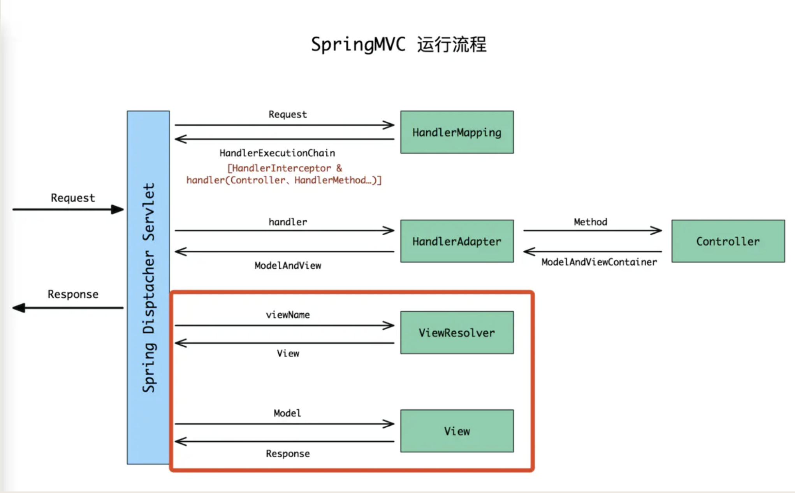

# 一. 定义
## 1. ModelAndView
SpringMVC 内部最终会将返回的参数及视图名字封装成一个 ModelAndView 对象，这个对象包含两个部分：Model 是一个 HashMap 集合，View 一般则是一个 String 类型记录要跳转视图的名字或者是视图对象(当然如果是视图对象的话则直接跳过视图解析器的解析过程了)。

## 2.  View & ViewResolver

View接口的主要作用是用于处理视图，将模型里的数据以某种形式呈现给客户端。其实就是 html、jsp 甚至 word、excel 文件；

SpringMVC中用于把View对象呈现给客户端的是**View对象本身**。

而ViewResolver只是把逻辑视图名称解析为View对象。即View对象由视图解析器负责实例化，由于他们是无状态的，所以不存在线程安全的问题。

### View
为了实现视图模型和具体实现技术的解耦，SpringMVC 定义了一个高度抽象的 View 接口 org.springframework.web.servlet.View。

下面来看下 View 接口常用的实现类：
|视图	|说明|
| --- | --- |
|InternalResourceView|	将 JSP 或其他资源封装成一个视图，一般 JSP 页面用该视图类|
|JstlView	|继承自InternalResourceView，如果 JSP 页面使用了 JSTL 标签，则需要使用该视图类|
|AbstractPdfView	|PDF视图的抽象超类|
|AbstractXlsView|	传统XLS格式的Excel文档视图的便捷超类，与Apache POI 3.5及更高版本兼容。|
|AbstractXlsxView|	Office 2007 XLSX格式的Excel文档视图的便捷超类，兼容Apache POI 3.5及更高版本。|
|MappingJackson2JsonView|	将模型数据 通过 Jackson 开源框架的 ObjectMapper 以 JSON 方式输出|

### ViewResolve
SpringMVC 为逻辑视图名的解析提供了不同的策略，可以在 Spring Web 上下文中配置一种或多种解析策略，并指定他们之间的先后顺序。

* 每一种映射策略对应一个具体的视图解析器实现类。

* 视图解析器的作用是将逻辑视图解析为一个具体的物理视图对象。

* 所有的视图解析器都必须实现 ViewResolver 接口。

* 可以选择一种或多种视图解析器，可以通过其 order 属性指定解析器的优先顺序，order 越小优先级越高。

* SpringMVC 会按照视图解析器顺序的优先次序进行解析，直到返回视图对象。若无，则抛出 ServletException 异常。

我们挑几个常用的了解下：

|视图解析器	|说明|
| --- | --- |
|AbstractCachingViewResolver|	一个抽象视图，继承该类可以让视图解析器具有缓存功能|
|XmlViewResolver	|接受XML文件的视图解析器，默认配置文件在 /WEB-INF/views.xml|
|ResourceBundleViewResolver	|使用properties配置文件的视图解析器，默认配置文件是类路径下的views.properties|
|UrlBasedViewResolver	|一个简单的视图解析器，不做任何匹配，需要视图名和实际视图文件名相同|
|InternalResourceViewResolver	|UrlBasedViewResolver的一个子类，支持Servlet容器的内部类型（JSP、Servlet、以及JSTL等），可以使用setViewClass(..)指定具体的视图类型|
|FreeMarkerViewResolver	|也是UrlBasedViewResolver的子类，用于FreeMarker视图技术|
|ContentNegotiatingViewResolver|	用于解析基于请求文件名或Accept header的视图|
|BeanNameViewResolver	|将逻辑视图名解析为一个 Bean，Bean 的 id 等于逻辑视图名|


# 二. 视图解析过程源码分析

## 1. 首先进入 DispatcherServlet.doDispatch( ) 方法，经过解析处理，找到了对应的 Controller 里面的方法，执行完成之后得到 ModelAndView 对象，开始视图渲染前后一系列工作
对于使用`@ResponseBody`返回json数据到前端的情况，ModelAndView 对象为null，所以该方法直接跳过了渲染页面的步骤，进行触发拦截器的afterCompletion方法。此时在response中已经写入了返回值。
```java
protected void doDispatch( HttpServletRequest request, HttpServletResponse response ) throws Exception
{
/* 其余省略 */

/* 处理返回结果，包括异常、渲染页面、触发拦截器的afterCompletion方法*/
//参数中包含ModelAndView对象
processDispatchResult( processedRequest, response, mappedHandler, mv, dispatchException );

/* 其余省略 */
}
```
## 2. 进入渲染方法，开始视图渲染前的工作
对于返回json字符串的情况，mv为null，所以不会进入render渲染。
对于进入render渲染的情况，其实是spring2时代的产物，也就是每个json视图controller配置一个Jsoniew。
如：
`<bean id="defaultJsonView" class="org.springframework.web.servlet.view.json.MappingJacksonJsonView"/> `

或者`<bean id="defaultJsonView" class="org.springframework.web.servlet.view.json.MappingJackson2JsonView"/>`

同样要用jackson的jar包。
```java
private void processDispatchResult(HttpServletRequest request, HttpServletResponse response,HandlerExecutionChain mappedHandler, ModelAndView mv, Exception exception) throws Exception {

		boolean errorView = false;
	
	//如果处理“请求”的过程中有异常，即dispatchException，则处理异常
		if (exception != null) {
			if (exception instanceof ModelAndViewDefiningException) {
				logger.debug("ModelAndViewDefiningException encountered", exception);
				mv = ((ModelAndViewDefiningException) exception).getModelAndView();
			}
			else {
				Object handler = (mappedHandler != null ? mappedHandler.getHandler() : null);
				mv = processHandlerException(request, response, handler, exception);
				errorView = (mv != null);
			}
		}

	// 渲染页面
		if (mv != null && !mv.wasCleared()) {//对于返回json字符串的情况，mv为null，所以不会进入render渲染。
			render(mv, request, response);//经过前面一系列处理开始视图渲染
			if (errorView) {
				WebUtils.clearErrorRequestAttributes(request);
			}
		}
		else {
			if (logger.isDebugEnabled()) {
				logger.debug("Null ModelAndView returned to DispatcherServlet with name '" + getServletName() +
						"': assuming HandlerAdapter completed request handling");
			}
		}

		if (WebAsyncUtils.getAsyncManager(request).isConcurrentHandlingStarted()) {
			// Concurrent handling started during a forward
			return;
		}
		
       //触发拦截器的AfterCompletion
		if (mappedHandler != null) {
			mappedHandler.triggerAfterCompletion(request, response, null);
		}
	}
```
## 3. 进入 `render(..)` 方法查看渲染源码----此后的程序在新的`@ResponseBody`模式下已被跳过。

此`render(..)`方法仍然在DispatcherServle类中。
```java
/**
 * Render the given ModelAndView.
 * <p>This is the last stage in handling a request. It may involve resolving the view by name.
 * @param mv the ModelAndView to render
 * @param request current HTTP servlet request
 * @param response current HTTP servlet response
 * @throws ServletException if view is missing or cannot be resolved
 * @throws Exception if there's a problem rendering the view
 */
protected void render(ModelAndView mv, HttpServletRequest request, HttpServletResponse response) throws Exception {
    // Determine locale for request and apply it to the response.
    Locale locale =
            (this.localeResolver != null ? this.localeResolver.resolveLocale(request) : request.getLocale());
    response.setLocale(locale);

    View view;//声明一个View类
    String viewName = mv.getViewName();//从modelAndView中拿到view的名字
    if (viewName != null) {
        // We need to resolve the view name.
        view = resolveViewName(viewName, mv.getModelInternal(), locale, request);//根据view的Name使用viewResolver得到view对象。
        if (view == null) {
            throw new ServletException("Could not resolve view with name '" + mv.getViewName() +
                    "' in servlet with name '" + getServletName() + "'");
        }
    }
    else {
        // No need to lookup: the ModelAndView object contains the actual View object.
        view = mv.getView();
        if (view == null) {
            throw new ServletException("ModelAndView [" + mv + "] neither contains a view name nor a " +
                    "View object in servlet with name '" + getServletName() + "'");
        }
    }

    // Delegate to the View object for rendering.
    if (logger.isTraceEnabled()) {
        logger.trace("Rendering view [" + view + "] ");
    }
    try {
        if (mv.getStatus() != null) {
            response.setStatus(mv.getStatus().value());
        }
        view.render(mv.getModelInternal(), request, response);//此时是调用实现了view接口的实现类中的render()方法。
    }
    catch (Exception ex) {
        if (logger.isDebugEnabled()) {
            logger.debug("Error rendering view [" + view + "]", ex);
        }
        throw ex;
    }
}
```
### 3.1 查看下 View 对象创建过程，进入 resolveViewName(..) 方法
```java
/**
 * Resolve the given view name into a View object (to be rendered).
 * <p>The default implementations asks all ViewResolvers of this dispatcher.
 * Can be overridden for custom resolution strategies, potentially based on
 * specific model attributes or request parameters.
 * @param viewName the name of the view to resolve
 * @param model the model to be passed to the view
 * @param locale the current locale
 * @param request current HTTP servlet request
 * @return the View object, or {@code null} if none found
 * @throws Exception if the view cannot be resolved
 * (typically in case of problems creating an actual View object)
 * @see ViewResolver#resolveViewName
 */
@Nullable
protected View resolveViewName(String viewName, @Nullable Map<String, Object> model,
        Locale locale, HttpServletRequest request) throws Exception {

    if (this.viewResolvers != null) {
        //遍历本地配置的所有ViewResolver，找到合适的视图解析器，创建视图
        for (ViewResolver viewResolver : this.viewResolvers) {
            //此处的resolveViewName调用的是实现了viewResolver接口的实现类
            View view = viewResolver.resolveViewName(viewName, locale);
            if (view != null) {
                return view;
            }
        }
    }
    return null;
}
```