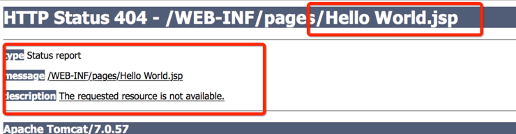
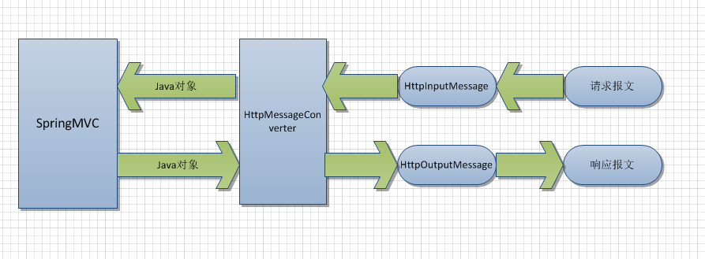

[TOC]
# 获取URL链接上的参数
## 1. 获取单个参数
* 方式一
```java
request.getParameter("XXX");
```
* 方式二，通过`@RequestParam`获取
```java
/**
 * 接收普通请求参数
 * http://localhost:8080/hello/show16?name=linuxsir
 * url参数中的name必须要和@RequestParam("name")一致
 * url中没有name参数不会报错、有就显示出来
 * @return
 */
@RequestMapping("show16")
public ModelAndView test16(@RequestParam(value="name",required=false)String name){
    ModelAndView mv = new ModelAndView();
    mv.setViewName("hello2");
    mv.addObject("msg", "接收普通的请求参数：" + name);
    return mv;
}
```
        
## 2. 获取多个参数
 ```java
request.getParameterMap()
```        
# 获取Http-body中的参数

## 1. 通过 `request.getInputStream()`获得。
         
**需要注意的是：获取body参数，需要在request.getParameter()方法之前调用（如果有需要取QueryString参数的话），因为一旦调用了getParameter()方法之后，再通过IO流的方式获取body参数就失效了(亲测返回"")。**

**示例代码**

``` java
      
       String jsonStr = "";
		BufferedReader reader = null;
		try {
			StringBuffer sb = new StringBuffer();
			request.setCharacterEncoding("UTF-8");
			reader = new BufferedReader(new InputStreamReader(
					request.getInputStream(), "UTF-8"));
			String s = "";
			while ((s = reader.readLine()) != null) {
				System.out.println(s);
				sb.append(s);
			}
			jsonStr = sb.toString();
		} catch (IOException e) {
			e.printStackTrace();
			jsonStr = "";
		} finally {
			if (reader != null) {
				try {
					reader.close();
				} catch (IOException e) {
					e.printStackTrace();
				}
			}
		}
```

##  2. 通过`@ResponseBody，@RequestBody`获取


在SpringMVC中，可以使用@RequestBody和@ResponseBody两个注解，分别完成请求报文到对象和对象到响应报文的转换。
### 1. @ResponseBody
* 该注解用于将**Controller的方法返回的对象**，通过适当的HttpMessageConverter转换为json、xml等格式后，**写入到Response对象的body数据区。即可以将返回的对象（带有数据的javabean的集合List或Map）转换成JSON**。
* **如果没有@ResponseBody注解，则方法的返回值通常解析为跳转的路径， 也就是说，要跳转到指定的jsp页面。**
```java
@Controller
@RequestMapping("/")
public class HelloController {
   @RequestMapping(value = "/helloWorld", method = RequestMethod.GET)
   @ResponseBody
   public String helloWorld()  {
      return"Hello World";
   }
 }

运行以上代码，在浏览器地址栏输入： http://localhost:8080/helloWorld
运行结果，页面上输出  Hello World 

如果不加@responseBody注解，运行结果会怎样？
```


* 结果表示：一般在异步获取数据时使用，在使用@RequestMapping后，返回值通常解析为跳转路径，加上@responsebody后返回结果不会被解析为跳转路径，而是直接写入HTTP response body中。比如异步获取json数据，加上@responsebody后，会直接返回json数据。


* @ResponseBody注解也可以定义在类上，这样所有的方法都继承了该特性。由于经常会使用到@ResponseBody注解，所以**Spring提供了一个名为@RestController的注解来取代以上的@Controller注解，这样我们就可以省略返回值前面的@ResponseBody注解了**，但参数前面的@RequestBody注解是无法省略的。实际上，看看Spring中对应@RestController注解的源码便可知晓：
```java
@Target({ElementType.TYPE})
@Retention(RetentionPolicy.RUNTIME)
@Documented
@Controller
@ResponseBody
public @interface RestController {

    String value() default "";
}
```
### 2. @RequestBody该注解用于读取**Request请求的body部分数据**，使用系统默认配置的HttpMessageConverter进行解析，然后把相应的数据绑定到要返回的对象上。
示例：
```java
@RestController
@RequestMapping("/")
public class HelloController {
   @RequestMapping(value = "/helloWorld.action", method = RequestMethod.POST)
   public String helloWorld(@RequestBody String bodyJsondata)  {
       //bodyJsondata为json格式的数据
      return"Hello World";
   }
 }
```
### 3. HttpMessageConverter



### 4. body的内容为json格式时，需要在http请求中设置contentType: 'application/json',而不是使用默认值: "application/x-www-form-urlencoded".

### 5. SpringMVC的配置文件中需要指定**HttpMessageConverter**，有如下两种配置方式：

直接写bean
```xml
<bean id="utf8StringHttpMessageConverter" class="org.springframework.http.converter.StringHttpMessageConverter">
        <constructor-arg value="UTF-8"/>
        <property name="writeAcceptCharset" value="false"/>
    </bean>

    <bean id="mappingJackson2HttpMessageConverter"
          class="org.springframework.http.converter.json.MappingJackson2HttpMessageConverter">
        <property name="supportedMediaTypes">
            <list>
                <value>text/html;charset=UTF-8</value>
                <value>application/json;charset=UTF-8</value>
            </list>
        </property>
    </bean>

    <bean class="org.springframework.web.servlet.mvc.method.annotation.RequestMappingHandlerAdapter">
        <property name="messageConverters">
            <list>
                <ref bean="utf8StringHttpMessageConverter"/>
                <ref bean="mappingJackson2HttpMessageConverter"/>
            </list>
        </property>
    </bean>
```
或者写在<mvc:annotation-driven>中

```xml

<mvc:annotation-driven>
        <mvc:async-support default-timeout="3000"/>
        <!-- utf-8编码 -->
        <mvc:message-converters register-defaults="true">
            <bean class="org.springframework.http.converter.StringHttpMessageConverter">
                <constructor-arg value="UTF-8"/>
                <property name="writeAcceptCharset" value="false"/>
            </bean>
        </mvc:message-converters>
    </mvc:annotation-driven>

```

### 6. 示例代码


    jsp页面
```jsp
$(function(){
              $("#btn").click(function(){
                  
                  var data2 = {"id":23,"name":"tt","passwd":"345"};
                  //alert(JSON.stringify(data2));
                  $.ajax({
                      
                      type: 'post',
                      url:'json.action',
                      cache:false,
                      data:JSON.stringify(data2),
                      contentType: 'application/json',
                      dataType: 'json',
                      success:function(result){
                          //result = $.parseJSON(result);
                          alert(result[0].password);
                          alert(JSON.stringify(result));
                      },
                      
                  });
              });
```


controller

```java
@RequestMapping(value="/json.action",method=RequestMethod.POST)
    @ResponseBody
    public List<Author> getAuthor2(@RequestBody User user){
        System.out.println(user.getName());
        Author aut1 = authorService.findAuthor(3);
        Author aut2 = authorService.findAuthor(4);
        List<Author> list = new ArrayList<Author>();
        list.add(aut1);
        list.add(aut2);
        return list;
    }
```

### 7. 如果controller返回的值为string类型时，会调用org\springframework\http\converter\StringHttpMessageConverter这个实现类的writeInternal（）方法，设置writeAcceptCharset为默认值true，导致产生大量的acceptCharset添加到responser-header中，所以需要设置WriteAcceptCharset为false。具体配置见上SpringMVC配置文件。
另：需要配置编码，如下：
```xml
<bean id="utf8StringHttpMessageConverter" class="org.springframework.http.converter.StringHttpMessageConverter">
        <constructor-arg value="UTF-8"/>
        <property name="writeAcceptCharset" value="false"/>
</bean>
```

### 8. 如果controller返回的值为对象类型时，会调用org\springframework\http\converter\json\AbstractJackson2HttpMessageConverter这个实现类的writeInternal（）方法,这个实现类的中此方法没有设置WriteAcceptCharset的代码，所以不会产生大量的acceptCharset。

      