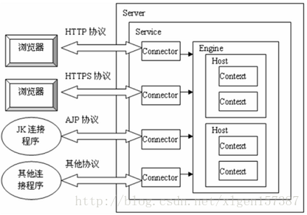
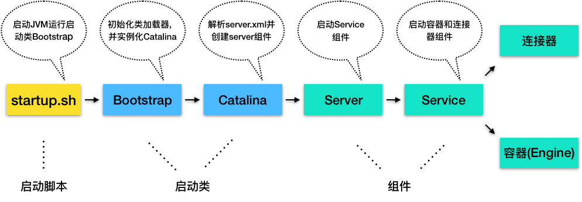
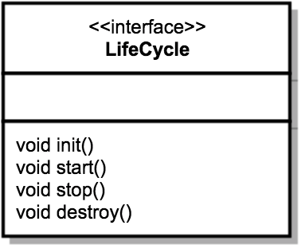
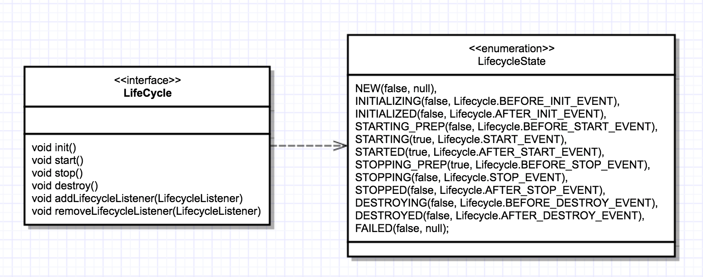
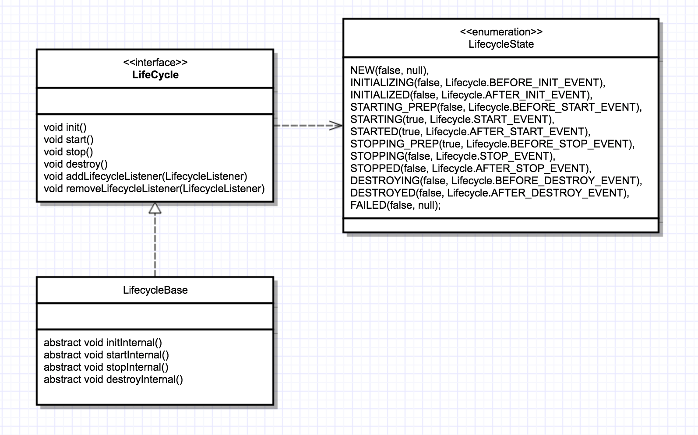
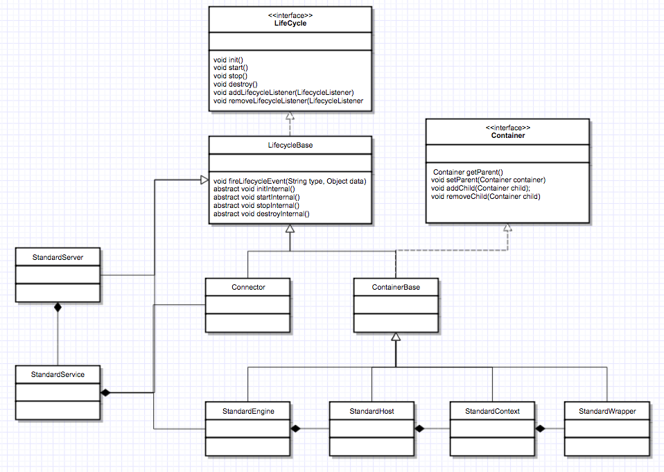

[TOC]
# 一、简介


从上图中可以看出 Tomcat 的心脏是两个组件：Connector 和 Container，

1. Tomcat中最顶层的容器是Server，代表着整个服务器，整个 Tomcat 的生命周期由 Server 控制，从上图中可以看出，一个Server可以包含至少一个Service，用于具体提供服务。

2. Service表示服务，Server可以运行多个服务。比如一个Tomcat里面可运行订单服务、支付服务、用户服务等等

3. 每个Service可包含多个Connector和一个Container。因为每个服务允许同时支持多种协议，但是每种协议最终执行的Servlet却是相同的

4. Connector表示连接器，比如一个服务可以同时支持AJP协议、Http协议和Https协议，每种协议可使用一种连接器来支持，用于处理连接相关的事情，并提供Socket与Request和Response相关的转化,主要负责对外交流

5. Container表示容器，主要处理 Connector 接受的请求，可以看做Servlet容器，用于封装和管理Servlet，以及具体处理Request请求，一个 Container 可以选择对应多个 Connector。
    * Engine -- 引擎
    
    * Host -- 主机
    * Context -- 上下文
    * Wrapper -- 包装器


6. Service服务之下还有各种支撑组件，下面简单罗列一下这些组件
    * Manager -- 管理器，用于管理会话Session
    * Logger -- 日志器，用于管理日志
    * Loader -- 加载器，和类加载有关，只会开放给Context所使用
    * Pipeline -- 管道组件，配合Valve实现过滤器功能
    * Valve -- 阀门组件，配合Pipeline实现过滤器功能
    * Realm -- 认证授权组件
 
 7. 除了Connector和Container，Pipeline和Valve也很关键，我们通过一张图来看看这两个组件
    
    
# 二、 Tomcat启动
我们可以通过 Tomcat 的/bin目录下的脚本startup.sh来启动 Tomcat，那你是否知道我们执行了这个脚本后发生了什么呢？



1. Tomcat 本质上是一个 Java 程序，因此startup.sh脚本会启动一个 JVM 来运行 Tomcat 的启动类 Bootstrap。

2. Bootstrap 的主要任务是初始化 Tomcat 的类加载器，并且创建 Catalina。

3. Catalina 是一个启动类，它通过解析server.xml、创建相应的组件，并调用 Server 的 start 方法。

4. Server 组件的职责就是管理 Service 组件，它会负责调用 Service 的 start 方法。

5. Service 组件的职责就是管理连接器和顶层容器 Engine，因此它会调用连接器和 Engine 的 start 方法。

这样 Tomcat 的启动就算完成了。

# 三、Catalina
Catalina 的主要任务就是创建 Server，它不是直接 new 一个 Server 实例就完事了，

而是需要解析server.xml，把在server.xml里配置的各种组件一一创建出来，

接着调用 Server 组件的 init 方法和 start 方法，

1. Catalina.load()里面调用了Server.init()方法。

2. Catalina.start()里面调用了Server.start()方法。

这样整个 Tomcat 就启动起来了。

作为“管理者”，Catalina 还需要处理各种“异常”情况，比如当我们通过“Ctrl + C”关闭 Tomcat 时，Tomcat 将如何优雅的停止并且清理资源呢？因此 Catalina 在 JVM 中注册一个**“关闭钩子”**。

```java

public void start() {
    //1. 如果持有的Server实例为空，就解析server.xml创建出来
    if (getServer() == null) {
        load();
    }
    //2. 如果创建失败，报错退出
    if (getServer() == null) {
        log.fatal(sm.getString("catalina.noServer"));
        return;
    }

    //3.启动Server
    try {
        getServer().start();
    } catch (LifecycleException e) {
        return;
    }

    //创建并注册关闭钩子
    if (useShutdownHook) {
        if (shutdownHook == null) {
            shutdownHook = new CatalinaShutdownHook();
        }
        Runtime.getRuntime().addShutdownHook(shutdownHook);
    }

    //用await方法监听停止请求
    if (await) {
        await();//Server 的 await 方法
        stop();
    }
}
```
那什么是“关闭钩子”，它又是做什么的呢？如果我们需要在 JVM 关闭时做一些清理工作，比如将缓存数据刷到磁盘上，或者清理一些临时文件，可以向 JVM 注册一个“关闭钩子”。“关闭钩子”其实就是一个线程，JVM 在停止之前会尝试执行这个线程的 run 方法。下面我们来看看 Tomcat 的“关闭钩子”CatalinaShutdownHook 做了些什么。

```java

protected class CatalinaShutdownHook extends Thread {

    @Override
    public void run() {
        try {
            if (getServer() != null) {
                Catalina.this.stop();
            }
        } catch (Throwable ex) {
           ...
        }
    }
}
```

从这段代码中你可以看到，Tomcat 的“关闭钩子”实际上就执行了 Server 的 stop 方法，Server 的 stop 方法会释放和清理所有的资源。

# 四、Server

Server 要完成的任务很简单，就是要能够提供一个接口让其它程序能够访问到这个 Service 集合。
同时要维护它所包含的所有 Service 的生命周期，包括如何初始化、如何结束服务、如何找到别人要访问的 Service。


Server 继承了 LifecycleBase，它的生命周期被统一管理，并且它的子组件是 Service，因此它还需要管理 Service 的生命周期，也就是说在启动时调用 Service 组件的启动方法，在停止时调用它们的停止方法。Server 在内部维护了若干 Service 组件，它是以数组来保存的，那 Server 是如何添加一个 Service 到数组中的呢？

下面主要看一下 StandardServer 重要的一个方法 addService 的实现：

StandardServer.addService

```java

@Override
public void addService(Service service) {

    service.setServer(this);

    synchronized (servicesLock) {
        //创建一个长度+1的新数组
        Service results[] = new Service[services.length + 1];
        
        //将老的数据复制过去
        System.arraycopy(services, 0, results, 0, services.length);
        results[services.length] = service;
        services = results;

        //启动Service组件
        if (getState().isAvailable()) {
            try {
                service.start();
            } catch (LifecycleException e) {
                // Ignore
            }
        }

        //触发监听事件
        support.firePropertyChange("service", null, service);
    }

}
```
从上面的代码你能看到，它并没有一开始就分配一个很长的数组，而是在添加的过程中动态地扩展数组长度，当添加一个新的 Service 实例时，会创建一个新数组并把原来数组内容复制到新数组，这样做的目的其实是为了节省内存空间。

除此之外，Server 组件还有一个重要的任务是启动一个 Socket 来监听停止端口，这就是为什么你能通过 shutdown 命令来关闭 Tomcat。不知道你留意到没有，上面 Catalina 的启动方法的最后一行代码就是调用了 **Server 的 await 方法**。

在 await 方法里会创建一个 Socket 监听 8005 端口，并在一个死循环里接收 Socket 上的连接请求，如果有新的连接到来就建立连接，然后从 Socket 中读取数据；如果读到的数据是停止命令“SHUTDOWN”，就退出循环，进入 stop 流程。


继续看StandardServer.initInternal()方法。该方法用于对Server进行初始化，关键的地方就是代码最后对services的循环操作，对每个service调用init方法。
```java
@Override
protected void initInternal() throws LifecycleException {
    super.initInternal();

    // Initialize our defined Services
    for (int i = 0; i < services.length; i++) {
        services[i].init();
    }
}
```
初始化完成之后接着会调用start()方法，还是很简单，其实就是调用每个service的start()方法。

```java
@Override
protected void startInternal() throws LifecycleException {

    fireLifecycleEvent(CONFIGURE_START_EVENT, null);
    setState(LifecycleState.STARTING);

    globalNamingResources.start();

    // Start our defined Services
    synchronized (servicesLock) {
        for (int i = 0; i < services.length; i++) {
            services[i].start();
        }
    }
}
```
 
# 五、Service 

Service 只是在 Connector 和 Container 外面多包一层，把它们组装在一起，向外面提供服务，一个 Service 可以设置多个 Connector，但是只能有一个 Container 容器。

Service 组件的具体实现类是 StandardService，它不仅实现了 Service 借口同时还实现了 Lifecycle 接口,我们先来看看它的定义以及关键的成员变量。


```java

public class StandardService extends LifecycleBase implements Service {
    //名字
    private String name = null;
    
    //Server实例
    private Server server = null;

    //连接器数组
    protected Connector connectors[] = new Connector[0];
    private final Object connectorsLock = new Object();

    //对应的Engine容器
    private Engine engine = null;
    
    //映射器及其监听器
    protected final Mapper mapper = new Mapper();
    protected final MapperListener mapperListener = new MapperListener(this);
```

StandardService 继承了 LifecycleBase 抽象类，此外 StandardService 中还有一些我们熟悉的组件，比如 Server、Connector、Engine 和 Mapper。

**那为什么还有一个 MapperListener？**

这是因为 Tomcat 支持热部署，当 Web 应用的部署发生变化时，Mapper 中的映射信息也要跟着变化，**MapperListener 就是一个监听器，它监听容器的变化，并把信息更新到 Mapper 中，这是典型的观察者模式。**


对一个Server的init()和start()操作，其实就是对Server下的每个Service进行init()和start()操作。所以，我们接下来要分析的必然是Service。因为Service的实现类为StandardService，所以我们就分析这个实现类。

**先来看看init()方法**
```java
@Override
protected void initInternal() throws LifecycleException {
    super.initInternal();

    if (engine != null) {
        engine.init();
    }

    // Initialize any Executors
    for (Executor executor : findExecutors()) {
        if (executor instanceof JmxEnabled) {
            ((JmxEnabled) executor).setDomain(getDomain());
        }
        executor.init();
    }

    // Initialize mapper listener
    mapperListener.init();

    // Initialize our defined Connectors
    synchronized (connectorsLock) {
        for (Connector connector : connectors) {
            try {
                connector.init();
            } catch (Exception e) {
                String message = sm.getString(
                        "standardService.connector.initFailed", connector);
                log.error(message, e);

                if (Boolean.getBoolean("org.apache.catalina.startup.EXIT_ON_INIT_FAILURE"))
                    throw new LifecycleException(message);
            }
        }
    }
}
```


Service的init()操作主要做了几件事情：

1. Engine的初始化操作

2. Service线程执行器（tomcat中对java.util.concurrent.Executor的实现）的初始化操作

3. MapperListener的初始化操作

4. 对Connectors（可能有多个）的初始化操作

作为“管理”角色的组件，最重要的是维护其他组件的生命周期。此外在启动各种组件时，要注意它们的依赖关系，也就是说，要注意启动的顺序。我们来看看 **Service 启动方法**：
```java

protected void startInternal() throws LifecycleException {

    //1. 触发启动监听器
    setState(LifecycleState.STARTING);

    //2. 先启动Engine，Engine会启动它子容器
    if (engine != null) {
        synchronized (engine) {
            engine.start();
        }
    }
    
    //3. 再启动Mapper监听器
    mapperListener.start();

    //4.最后启动连接器，连接器会启动它子组件，比如Endpoint
    synchronized (connectorsLock) {
        for (Connector connector: connectors) {
            if (connector.getState() != LifecycleState.FAILED) {
                connector.start();
            }
        }
    }
}
```
从启动方法可以看到，Service 先启动了 Engine 组件，再启动 Mapper 监听器，最后才是启动连接器。这很好理解，因为内层组件启动好了才能对外提供服务，才能启动外层的连接器组件。而 Mapper 也依赖容器组件，容器组件启动好了才能监听它们的变化，因此 Mapper 和 MapperListener 在容器组件之后启动。组件停止的顺序跟启动顺序正好相反的，也是基于它们的依赖关系。

**继续看一下setContainer 和 addConnector 方法**

StandardService. SetContainer

```java
public void setContainer(Container container) {
    Container oldContainer = this.container;
    //先判断当前的这个 Service 有没有已经关联了 Container，如果已经关联了，那么去掉这个关联关系
    if ((oldContainer != null) && (oldContainer instanceof Engine))
        ((Engine) oldContainer).setService(null);//去掉这个关联关系
    this.container = container;
    if ((this.container != null) && (this.container instanceof Engine))
        ((Engine) this.container).setService(this);
        //开始这个新的 Container 的生命周期
    if (started && (this.container != null) && (this.container instanceof Lifecycle)) {
        try {
            ((Lifecycle) this.container).start();
        } catch (LifecycleException e) {
            ;
        }
    }
    //新的 Container 关联到每个 Connector
    synchronized (connectors) {
        for (int i = 0; i < connectors.length; i++)
            connectors[i].setContainer(this.container);
    }
    if (started && (oldContainer != null) && (oldContainer instanceof Lifecycle)) {
        try {
            ((Lifecycle) oldContainer).stop();
        } catch (LifecycleException e) {
            ;
        }
    }
    //将这个过程通知感兴趣的事件监听程序
    support.firePropertyChange("container", oldContainer, this.container);
}
```

StandardService. addConnector
```java
public void addConnector(Connector connector) {
    synchronized (connectors) {
        //设置关联关系
        connector.setContainer(this.container);
        connector.setService(this);
        //注意 Connectors集合 用的是数组而不是 List 集合，这个从性能角度考虑可以理解，有趣的是这里用了数组但是并没有向我们平常那样，一开始就分配一个固定大小的数组，它这里的实现机制是：重新创建一个当前大小的数组对象，然后将原来的数组对象 copy 到新的数组中，这种方式实现了类似的动态数组的功能，
        Connector results[] = new Connector[connectors.length + 1];
        System.arraycopy(connectors, 0, results, 0, connectors.length);
        results[connectors.length] = connector;
        connectors = results;
        if (initialized) {
            try {
                //初始化
                connector.initialize();
            } catch (LifecycleException e) {
                e.printStackTrace(System.err);
            }
        }
        if (started && (connector instanceof Lifecycle)) {
            try {
                //开始新的生命周期
                ((Lifecycle) connector).start();
            } catch (LifecycleException e) {
                ;
            }
        }
        support.firePropertyChange("connector", null, connector);
    }
}
```
# 六、Engine 组件
最后我们再来看看顶层的容器组件 Engine 具体是如何实现的。Engine 本质是一个容器，因此它继承了 ContainerBase 基类，并且实现了 Engine 接口。
```java
public class StandardEngine extends ContainerBase implements Engine {
}
```

我们知道，Engine 的子容器是 Host，所以它持有了一个 Host 容器的数组，这些功能都被抽象到了 ContainerBase 中，ContainerBase 中有这样一个数据结构：
```java
protected final HashMap<String, Container> children = new HashMap<>();
```
ContainerBase 用 HashMap 保存了它的子容器，并且 ContainerBase 还实现了子容器的“增删改查”，甚至连子组件的启动和停止都提供了默认实现，比如 ContainerBase 会用专门的线程池来启动子容器。

```java
for (int i = 0; i < children.length; i++) {
   results.add(startStopExecutor.submit(new StartChild(children[i])));
}
```
所以 Engine 在启动 Host 子容器时就直接重用了这个方法。那 Engine 自己做了什么呢？

我们知道容器组件最重要的功能是处理请求，而 Engine 容器对请求的“处理”，其实就是把请求转发给某一个 Host 子容器来处理，**具体是通过 Valve 来实现的**。

我们知道每一个容器组件都有一个 Pipeline，而 Pipeline 中有一个基础阀（Basic Valve），而 Engine 容器的基础阀定义如下：
```java

final class StandardEngineValve extends ValveBase {

    public final void invoke(Request request, Response response)
      throws IOException, ServletException {
  
      //拿到请求中的Host容器
      Host host = request.getHost();
      if (host == null) {
          return;
      }
  
      // 调用Host容器中的Pipeline中的第一个Valve
      host.getPipeline().getFirst().invoke(request, response);
  }
  
}
```

这个基础阀实现非常简单，就是把请求转发到 Host 容器。

你可能好奇，从代码中可以看到，处理请求的 Host 容器对象是从请求中拿到的，请求对象中怎么会有 Host 容器呢？

这是因为请求到达 Engine 容器中之前，Mapper 组件已经对请求进行了路由处理，Mapper 组件通过请求的 URL 定位了相应的容器，并且把容器对象保存到了请求对象中。


# 七、 Lifecycle

Tomcat 中组件的生命周期是通过 Lifecycle 接口来控制的，组件只要继承这个接口并实现其中的方法就可以统一被拥有它的组件控制了。
在父组件的 init 方法里需要创建子组件并调用子组件的 init 方法。同样，在父组件的 start 方法里也需要调用子组件的 start 方法，因此调用者可以无差别的调用各组件的 init 方法和 start 方法，这就是**组合模式**的使用，并且只要调用最顶层组件，也就是 Server 组件的 init 和 start 方法，整个 Tomcat 就被启动起来了。

如在 Server 中 Start 方法就会调用 Service 组件的 Start 方法，Server 的 Start 方法代码如下：

StandardServer.Start

```java
public void start() throws LifecycleException {
    if (started) {
        log.debug(sm.getString("standardServer.start.started"));
        return;
    }
    lifecycle.fireLifecycleEvent(BEFORE_START_EVENT, null);
    lifecycle.fireLifecycleEvent(START_EVENT, null);
    started = true;
    synchronized (services) {
        for (int i = 0; i < services.length; i++) {
            if (services[i] instanceof Lifecycle)
                ((Lifecycle) services[i]).start();
        }
    }
    lifecycle.fireLifecycleEvent(AFTER_START_EVENT, null);
}
```
监听的代码会包围 Service 组件的启动过程，就是简单的循环启动所有 Service 组件的 Start 方法，但是所有 Service 必须要实现 Lifecycle 接口，这样做会更加灵活。

Server 的 Stop 方法代码如下：

StandardServer.Stop

```java
public void stop() throws LifecycleException {
    if (!started)
        return;
    lifecycle.fireLifecycleEvent(BEFORE_STOP_EVENT, null);
    lifecycle.fireLifecycleEvent(STOP_EVENT, null);
    started = false;
    for (int i = 0; i < services.length; i++) {
        if (services[i] instanceof Lifecycle)
            ((Lifecycle) services[i]).stop();
    }
    lifecycle.fireLifecycleEvent(AFTER_STOP_EVENT, null);
}
```


下面是 Lifecycle 接口的定义：



## Lifecycle 事件--可扩展性
我们再来考虑另一个问题，那就是系统的可扩展性。因为各个组件 init 和 start 方法的具体实现是复杂多变的，比如在 Host 容器的启动方法里需要扫描 webapps 目录下的 Web 应用，创建相应的 Context 容器，如果将来需要增加新的逻辑，直接修改 start 方法？这样会违反开闭原则，那如何解决这个问题呢？开闭原则说的是为了扩展系统的功能，你不能直接修改系统中已有的类，但是你可以定义新的类。

我们注意到，组件的 init 和 start 调用是由它的父组件的状态变化触发的，上层组件的初始化会触发子组件的初始化，上层组件的启动会触发子组件的启动，因此我们把**组件的生命周期定义成一个个状态，把状态的转变看作是一个事件**。**而事件是有监听器的，在监听器里可以实现一些逻辑，并且监听器也可以方便的添加和删除，这就是典型的观察者模式。**

具体来说就是在 Lifecycle 接口里加入两个方法：添加监听器和删除监听器。除此之外，我们还需要定义一个 Enum 来表示组件有哪些状态，以及处在什么状态会触发什么样的事件。因此 Lifecycle 接口和 LifecycleState 就定义成了下面这样。



从图上你可以看到，组件的生命周期有 NEW、INITIALIZING、INITIALIZED、STARTING_PREP、STARTING、STARTED 等，而一旦组件到达相应的状态就触发相应的事件，比如 NEW 状态表示组件刚刚被实例化；而当 init 方法被调用时，状态就变成 INITIALIZING 状态，这个时候，就会触发 BEFORE_INIT_EVENT 事件，如果有监听器在监听这个事件，它的方法就会被调用。

## LifecycleBase 抽象基类
定义一个基类来实现共同的逻辑，然后让各个子类去继承它，就达到了重用的目的。

基类中往往会定义一些抽象方法，所谓的抽象方法就是说基类不会去实现这些方法，而是调用这些方法来实现骨架逻辑。抽象方法是留给各个子类去实现的，并且子类必须实现，否则无法实例化。

Tomcat 定义一个基类 LifecycleBase 来实现 Lifecycle 接口，把一些公共的逻辑放到基类中去，比如生命状态的转变与维护、生命事件的触发以及监听器的添加和删除等，而子类就负责实现自己的初始化、启动和停止等方法。为了避免跟基类中的方法同名，我们把具体子类的实现方法改个名字，在后面加上 Internal，叫 initInternal、startInternal 等。我们再来看引入了基类 LifecycleBase 后的类图：


从图上可以看到，LifecycleBase 实现了 Lifecycle 接口中所有的方法，还定义了相应的抽象方法交给具体子类去实现，这是典型的**模板设计模式**。


LifecycleBase实现了Lifecycle接口，添加了几个新的方法如setStateInternal(更新组件状态)、fireLifecycleEvent(触发LifecycleEvent)

添加了四个抽象方法initInternal、startInternal、stopInternal、destroyInternal

LifecycleBase内初始化了LifecycleSupport、LifecycleState

```java
private final LifecycleSupport lifecycle = new LifecycleSupport(this);
private volatile LifecycleState state = LifecycleState.NEW;
```

下面来看看LifecycleBase的init方法的逻辑(start/stop/destroy的逻辑与init类似)

```java
public final synchronized void init() throws LifecycleException {
	////1. 状态检查，查看组件状态是否为LifecycleState.NEW
	if (!state.equals(LifecycleState.NEW)) {
		invalidTransition(Lifecycle.BEFORE_INIT_EVENT);
	}
	//2.触发INITIALIZING事件的监听器，更新组件状态LifecycleState.INITIALIZING
	setStateInternal(LifecycleState.INITIALIZING, null, false);
 
	try {
	////3.调用具体子类的初始化方法
		initInternal();
	} catch (Throwable t) {
		ExceptionUtils.handleThrowable(t);
		setStateInternal(LifecycleState.FAILED, null, false);
		throw new LifecycleException(
				sm.getString("lifecycleBase.initFail",toString()), t);
	}
	
	//4. 触发INITIALIZED事件的监听器，更新组件状态为LifecycleState.INITIALIZED。到此初始化完成
	setStateInternal(LifecycleState.INITIALIZED, null, false);
}
```
init方法内部又调用了initInternal方法

LifecycleBase 调用了抽象方法来实现骨架逻辑。讲到这里， 你可能好奇，LifecycleBase 负责触发事件，并调用监听器的方法，那是什么时候、谁把监听器注册进来的呢？

分为两种情况：

1. Tomcat 自定义了一些监听器，这些监听器是父组件在创建子组件的过程中注册到子组件的。比如 MemoryLeakTrackingListener 监听器，用来检测 Context 容器中的内存泄漏，这个监听器是 Host 容器在创建 Context 容器时注册到 Context 中的。

2. 我们还可以在server.xml中定义自己的监听器，Tomcat 在启动时会解析server.xml，创建监听器并注册到容器组件。

## LifecycleMBeanBase
LifecycleMBeanBase继承LifecycleBase.

StandardServer、StandardService等组件继承LifecycleMBeanBase，并重写initInternal、startInternal、stopInternal、destroyInternal方法

```java
protected void initInternal() throws LifecycleException {
	//调用父类(LifecycleMBeanBase)的initInternal方法
	super.initInternal();
	
	onameStringCache = register(new StringCache(), "type=StringCache");
 
	// Register the MBeanFactory
	MBeanFactory factory = new MBeanFactory();
	factory.setContainer(this);
	onameMBeanFactory = register(factory, "type=MBeanFactory");
 
	// Register the naming resources
	globalNamingResources.init();
 
	// Populate the extension validator with JARs from common and shared
	// class loaders
	if (getCatalina() != null) {
		ClassLoader cl = getCatalina().getParentClassLoader();
		// Walk the class loader hierarchy. Stop at the system class loader.
		// This will add the shared (if present) and common class loaders
		while (cl != null && cl != ClassLoader.getSystemClassLoader()) {
			if (cl instanceof URLClassLoader) {
				URL[] urls = ((URLClassLoader) cl).getURLs();
				for (URL url : urls) {
					if (url.getProtocol().equals("file")) {
						try {
							File f = new File (url.toURI());
							if (f.isFile() &&
									f.getName().endsWith(".jar")) {
								ExtensionValidator.addSystemResource(f);
							}
						} catch (URISyntaxException e) {
							// Ignore
						} catch (IOException e) {
							// Ignore
						}
					}
				}
			}
			cl = cl.getParent();
		}
	}
	//Server调用其子组件(Service)的init方法，Service在初始化过程中又会调用其子组件的init方法
	for (int i = 0; i < services.length; i++) {
		services[i].init();
	}
}
```

当Catalina调用StandardServer的init方法时，由于StandardServer未重写init方法，因此将使用LifecycleBase的init方法，

当执行到initInternal()时，由于StandardServer重写了initInternal方法，因此将使用StandardServer的initInternal方法(应用了多态。每个组件的initInternal方法包含其自定义逻辑)

通过Lifecycle，Tomcat启动最顶层组件(Server)，即可启动所有组件

## 生命周期管理总体类图



图中的 StandardServer、StandardService 等是 Server 和 Service 组件的具体实现类，它们都继承了 LifecycleBase。

StandardEngine、StandardHost、StandardContext 和 StandardWrapper 是相应容器组件的具体实现类，因为它们都是容器，所以继承了 ContainerBase 抽象基类，而 ContainerBase 实现了 Container 接口，也继承了 LifecycleBase 类，它们的生命周期管理接口和功能接口是分开的，这也符合设计中**接口分离**的原则。

# 六、Pipeline和Valve
连接器中的 Adapter 会调用容器的 Service 方法来执行 Servlet，最先拿到请求的是 Engine 容器，Engine 容器对请求做一些处理后，会把请求传给自己子容器 Host 继续处理，依次类推，最后这个请求会传给 Wrapper 容器，Wrapper 会调用最终的 Servlet 来处理。那么这个调用过程具体是怎么实现的呢？答案是使用 Pipeline-Valve 管道。

Pipeline-Valve 是责任链模式，责任链模式是指在一个请求处理的过程中有很多处理者依次对请求进行处理，每个处理者负责做自己相应的处理，处理完之后将再调用下一个处理者继续处理。


## 单一容器中的Pipeline调用
Valve 表示一个处理点，比如权限认证和记录日志。如果你还不太理解的话，可以来看看 Valve 和 Pipeline 接口中的关键方法。

```java
public interface Valve {
  public Valve getNext();
  public void setNext(Valve valve);
  public void invoke(Request request, Response response)
}
```

由于 Valve 是一个处理点，因此 invoke 方法就是来处理请求的。注意到 Valve 中有 getNext 和 setNext 方法，因此我们大概可以猜到有一个链表将 Valve 链起来了。继续看 Pipeline 接口：
```java

public interface Pipeline extends Contained {
  public void addValve(Valve valve);
  public Valve getBasic();
  public void setBasic(Valve valve);
  public Valve getFirst();
}
```

Pipeline 中有 addValve 方法。Pipeline 中维护了 Valve 链表，Valve 可以插入到 Pipeline 中，对请求做某些处理。我们还发现 Pipeline 中没有 invoke 方法，因为整个调**用链的触发是 Valve 来完成的，Valve 完成自己的处理后，调用getNext.invoke来触发下一个 Valve 调用。**

每一个容器都有一个 Pipeline 对象，只要触发这个 Pipeline 的第一个 Valve，这个容器里 Pipeline 中的 Valve 就都会被调用到。

## 不同容器中的PipeLine调用

但是，不同容器的 Pipeline 是怎么链式触发的呢，比如 Engine 中 Pipeline 需要调用下层容器 Host 中的 Pipeline。

这是因为 Pipeline 中还有个 getBasic 方法。这个 BasicValve 处于 Valve 链表的末端，它是 Pipeline 中必不可少的一个 Valve，负责调用下层容器的 Pipeline 里的第一个 Valve。我还是通过一张图来解释。


## 整个调用过程的发起

整个调用过程由连接器中的 Adapter 触发的，它会调用 Engine 的第一个 Valve：

```java

// Calling the container
connector.getService().getContainer().getPipeline().getFirst().invoke(request, response);
```
Wrapper 容器的最后一个 Valve 会创建一个 Filter 链，并调用 doFilter 方法，最终会调到 Servlet 的 service 方法。

Valve 和 Filter 有什么区别吗？它们的区别是：

* Valve 是 Tomcat 的私有机制，与 Tomcat 的基础架构 /API 是紧耦合的。Servlet API 是公有的标准，所有的 Web 容器包括 Jetty 都支持 Filter 机制。

* 另一个重要的区别是 Valve 工作在 Web 容器级别，拦截所有应用的请求；而 Servlet Filter 工作在应用级别，只能拦截某个 Web 应用的所有请求。如果想做整个 Web 容器的拦截器，必须通过 Valve 来实现。


## 定义自己的 Valve 呢

在 server.xml 文件中可以添加，如给 Engine 和 Host 增加一个 Valve 如下：

Server.xml

```xml
<Engine defaultHost="localhost" name="Catalina">
 
    <Valve className="org.apache.catalina.valves.RequestDumperValve"/>
    ………
    <Host appBase="webapps" autoDeploy="true" name="localhost" unpackWARs="true"
        xmlNamespaceAware="false" xmlValidation="false">
 
        <Valve className="org.apache.catalina.valves.FastCommonAccessLogValve"
            directory="logs"  prefix="localhost_access_log." suffix=".txt"
            pattern="common" resolveHosts="false"/>     
    …………
    </Host>
</Engine>
```