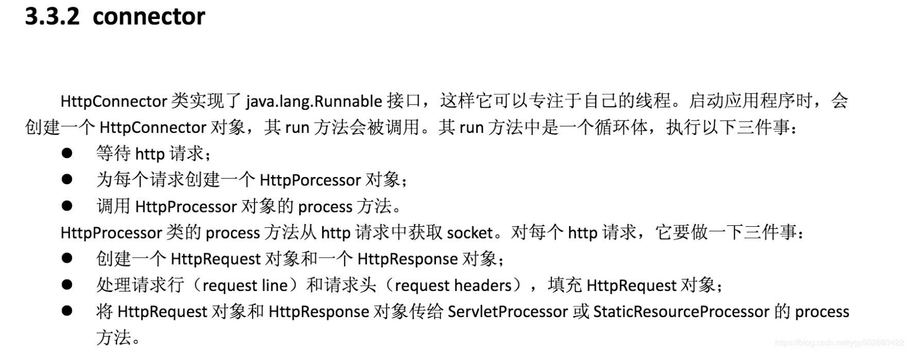
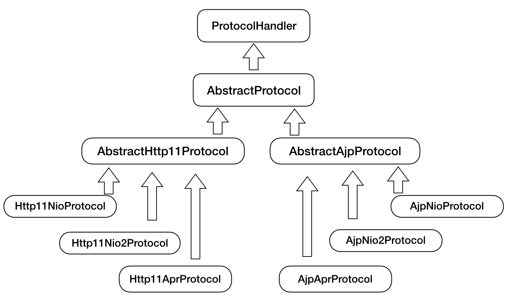
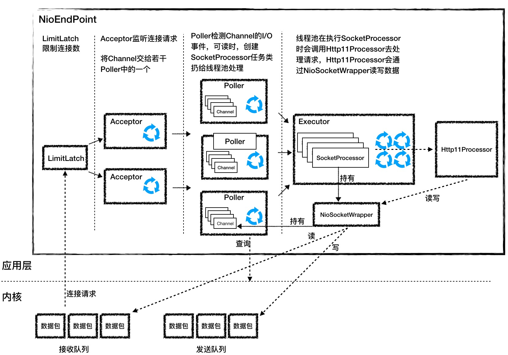

[TOC]
# 一、简介

Connector 组件是 Tomcat 中两个核心组件之一，

Connector用于接受请求并将请求封装成Request和Response，然后交给Container进行处理，Container处理完之后在交给Connector返回给客户端。

Tomcat 支持的 I/O 模型有：

* NIO：非阻塞 I/O，采用 Java NIO 类库实现。

* NIO.2：异步 I/O，采用 JDK 7 最新的 NIO.2 类库实现。

* APR：采用 Apache 可移植运行库实现，是 C/C++ 编写的本地库。

Tomcat 支持的应用层协议有：

* HTTP/1.1：这是大部分 Web 应用采用的访问协议。

* AJP：用于和 Web 服务器集成（如 Apache）。

* HTTP/2：HTTP 2.0 大幅度的提升了 Web 性能。

# 二、tomcat5的HTTP请求处理




# 三、tomcat8的HTTP请求处理

先来一张Connector的整体结构图


## ProtocolHandler---处理网络连接和应用层协议

由于 I/O 模型和应用层协议可以自由组合，比如 NIO + HTTP 或者 NIO.2 + AJP。对于各种协议和通信模型的组合，ProtocolHandler有相应的具体实现类，比如：Http11NioProtocol 和 AjpNioProtocol。

除了这些变化点，系统也存在一些相对稳定的部分，因此 Tomcat 设计了一系列抽象基类来封装这些稳定的部分，抽象基类 AbstractProtocol 实现了 ProtocolHandler 接口。每一种应用层协议有自己的抽象基类，比如 AbstractAjpProtocol 和 AbstractHttp11Protocol，具体协议的实现类扩展了协议层抽象基类。下面我整理一下它们的继承关系。



连接器用 ProtocolHandler 来处理网络连接和应用层协议，包含了 2 个重要部件：Endpoint 和 Processor，

### 1. Endpoint---负责提供字节流给 Processor

Endpoint 是通信端点，即通信监听的接口，是具体的 Socket 接收和发送处理器，是对传输层的抽象，因此 Endpoint 是用来实现 TCP/IP 协议的。

Endpoint 是一个接口，对应的抽象实现类是 AbstractEndpoint，而 AbstractEndpoint 的具体子类，比如在 NioEndpoint 和 Nio2Endpoint 中，有两个重要的子组件：`Acceptor` 和 `SocketProcessor`。

* Acceptor 用于监听 Socket 连接请求。

* SocketProcessor 用于处理接收到的 Socket 请求，它实现 Runnable 接口，在 run 方法里调用协议处理组件 Processor 进行处理。为了提高处理能力，SocketProcessor 被提交到线程池来执行。而这个线程池叫作执行器（Executor).

### 2. Processor---负责提供 Tomcat Request 对象给 Adapter
如果说 Endpoint 是用来实现 TCP/IP 协议的，那么 Processor 用来实现 HTTP 协议，

Processor 接收来自 Endpoint 的 Socket，读取字节流解析成 Tomcat Request 和 Response 对象，并通过 Adapter 将其提交到容器处理，Processor 是对应用层协议的抽象。

Processor 是一个接口，定义了请求的处理等方法。它的抽象实现类 AbstractProcessor 对一些协议共有的属性进行封装，没有对方法进行实现。

具体的实现有 AjpProcessor、Http11Processor 等，这些具体实现类实现了特定协议的解析方法和请求处理方式。

我们再来看看连接器的组件图：


从图中我们看到，

1. Endpoint 接收到 Socket 连接后，生成一个 SocketProcessor 任务提交到线程池去处理，

2. SocketProcessor 的 run 方法会调用 Processor 组件去解析应用层协议，

3. Processor 通过解析生成 Request 对象后，会调用 Adapter 的 Service 方法。

## Adapter -- 负责提供 ServletRequest 对象给容器

由于协议不同，客户端发过来的请求信息也不尽相同，Tomcat 定义了自己的 Request 类来“存放”这些请求信息。

ProtocolHandler 接口负责解析请求并生成 Tomcat Request 类。但是这个 Request 对象不是标准的 ServletRequest，也就意味着，不能用 Tomcat Request 作为参数来调用容器。

Tomcat 设计者的解决方案是引入 CoyoteAdapter，这是适配器模式的经典运用，

连接器调用 CoyoteAdapter 的 sevice 方法，传入的是 Tomcat Request 对象，

CoyoteAdapter 负责将 Tomcat Request 转成 ServletRequest，再调用容器的 service 方法。


# 四、NioEndpoint组件：Tomcat如何实现非阻塞I/O？
Tomcat 的 NioEndpoint 组件实现了 I/O 多路复用模型

## 总体工作流程
对于 Java 的多路复用器的使用，无非是两步：

1. 创建一个 Selector，在它身上注册各种感兴趣的事件，然后调用 select 方法，等待感兴趣的事情发生。

2. 感兴趣的事情发生了，比如可以读了，这时便创建一个新的线程从 Channel 中读数据。

Tomcat 的 NioEndpoint 组件虽然实现比较复杂，但基本原理就是上面两步。我们先来看看它有哪些组件，它一共包含 LimitLatch、Acceptor、Poller、SocketProcessor 和 Executor 共 5 个组件，它们的工作过程如下图所示。



LimitLatch 是连接控制器，它负责控制最大连接数，NIO 模式下默认是 10000，达到这个阈值后，连接请求被拒绝。


Acceptor 跑在一个单独的线程里，它在一个死循环里调用 **accept** 方法来接收新连接，一旦有新的连接请求到来，accept 方法返回一个 Channel 对象，接着把 Channel 对象交给 Poller 去处理。

Poller 的本质是一个 **Selector**，也跑在单独线程里。Poller 在内部维护一个 Channel 数组，它在一个死循环里不断检测 Channel 的数据就绪状态，一旦有 Channel 可读，就生成一个 SocketProcessor 任务对象扔给 Executor 去处理。

Executor 就是线程池，负责运行 SocketProcessor 任务类，SocketProcessor 的 run 方法会调用 Http11Processor 来读取和解析请求数据。我们知道，Http11Processor 是应用层协议的封装，它会调用容器获得响应，再把响应通过 Channel 写出。

## LimitLatch

LimitLatch 用来控制连接个数，当连接数到达最大时阻塞线程，直到后续组件处理完一个连接后将连接数减 1。请你注意到达最大连接数后操作系统底层还是会接收客户端连接，但用户层已经不再接收。LimitLatch 的核心代码如下：

```java

public class LimitLatch {
    private class Sync extends AbstractQueuedSynchronizer {
     
        @Override
        protected int tryAcquireShared() {
            long newCount = count.incrementAndGet();
            if (newCount > limit) {
                count.decrementAndGet();
                return -1;
            } else {
                return 1;
            }
        }

        @Override
        protected boolean tryReleaseShared(int arg) {
            count.decrementAndGet();
            return true;
        }
    }

    private final Sync sync;
    private final AtomicLong count;
    private volatile long limit;
    
    //线程调用这个方法来获得接收新连接的许可，线程可能被阻塞
    public void countUpOrAwait() throws InterruptedException {
      sync.acquireSharedInterruptibly(1);
    }

    //调用这个方法来释放一个连接许可，那么前面阻塞的线程可能被唤醒
    public long countDown() {
      sync.releaseShared(0);
      long result = getCount();
      return result;
   }
}
```

从上面的代码我们看到，LimitLatch 内步定义了内部类 Sync，而 Sync 扩展了 AQS，AQS 是 Java 并发包中的一个核心类，它在内部维护一个状态和一个线程队列，可以用来**控制线程什么时候挂起，什么时候唤醒**。我们可以扩展它来实现自己的同步器，实际上 Java 并发包里的锁和条件变量等等都是通过 AQS 来实现的，而这里的 LimitLatch 也不例外。


理解上面的代码时有两个要点：

1. 用户线程通过调用 LimitLatch 的 countUpOrAwait 方法来拿到锁，如果暂时无法获取，这个线程会被阻塞到 AQS 的队列中。那 **AQS 怎么知道是阻塞还是不阻塞用户线程**呢？其实这是**由 AQS 的使用者来决定**的，也就是内部类 Sync 来决定的，因为 Sync 类重写了 AQS 的 tryAcquireShared() 方法。它的实现逻辑是如果当前连接数 count 小于 limit，线程能获取锁，返回 1，否则返回 -1。

2. 如何用户线程被阻塞到了 AQS 的队列，那什么时候唤醒呢？同样是由 Sync 内部类决定，Sync 重写了 AQS 的 tryReleaseShared() 方法，其实就是当一个连接请求处理完了，这时又可以接收一个新连接了，这样前面阻塞的线程将会被唤醒。

其实你会发现 AQS 就是一个骨架抽象类，它帮我们搭了个架子，用来控制线程的阻塞和唤醒。具体什么时候阻塞、什么时候唤醒由你来决定。我们还注意到，当前线程数被定义成原子变量 AtomicLong，而 limit 变量用 volatile 关键字来修饰，这些并发编程的实际运用。

## Acceptor

Acceptor 实现了 Runnable 接口，因此可以跑在单独线程里。一个端口号只能对应一个 ServerSocketChannel，因此这个 ServerSocketChannel 是在多个 Acceptor 线程之间共享的，它是 Endpoint 的属性，由 Endpoint 完成初始化和端口绑定。初始化过程如下：

```java
serverSock = ServerSocketChannel.open();
serverSock.socket().bind(addr,getAcceptCount());
serverSock.configureBlocking(true);
//这不就是NIO嘛
```
从上面的初始化代码我们可以看到两个关键信息：
1. bind 方法的第二个参数表示操作系统的等待队列长度，我在上面提到，当应用层面的连接数到达最大值时，操作系统可以继续接收连接，那么操作系统能继续接收的最大连接数就是这个队列长度，可以通过 acceptCount 参数配置，默认是 100。

2. ServerSocketChannel 被设置成阻塞模式，也就是说它是以阻塞的方式接收连接的。


ServerSocketChannel 通过 accept() 接受新的连接，accept() 方法返回获得 SocketChannel 对象，然后将 SocketChannel 对象封装在一个 PollerEvent 对象中，并将 PollerEvent 对象压入 Poller 的 Queue 里，这是个典型的“生产者 - 消费者”模式，Acceptor 与 Poller 线程之间通过 Queue 通信。

## Poller

Poller 本质是一个 Selector，它内部维护一个 Queue，这个 Queue 定义如下：

```java
private final SynchronizedQueue<PollerEvent> events = new SynchronizedQueue<>();
```

SynchronizedQueue 的方法比如 offer、poll、size 和 clear 方法，都使用了 synchronized 关键字进行修饰，用来保证同一时刻只有一个 Acceptor 线程对 Queue 进行读写。

同时有多个 Poller 线程在运行，每个 Poller 线程都有自己的 Queue。每个 Poller 线程可能同时被多个 Acceptor 线程调用来注册 PollerEvent。同样 Poller 的个数可以通过 pollers 参数配置

Poller 不断的通过内部的 Selector 对象向内核查询 Channel 的状态，一旦可读就生成任务类 SocketProcessor 交给 Executor 去处理。

Poller 的另一个重要任务是循环遍历检查自己所管理的 SocketChannel 是否已经超时，如果有超时就关闭这个 SocketChannel。


## SocketProcessor

我们知道，Poller 会创建 SocketProcessor 任务类交给线程池处理，而 SocketProcessor 实现了 Runnable 接口，用来定义 Executor 中线程所执行的任务，主要就是调用 Http11Processor 组件来处理请求。Http11Processor 读取 Channel 的数据来生成 ServletRequest 对象，

**这里请你注意：Http11Processor 并不是直接读取 Channel 的**。

这是因为 Tomcat 支持同步非阻塞 I/O 模型和异步 I/O 模型，在 Java API 中，相应的 Channel 类也是不一样的，比如有 `AsynchronousSocketChannel` 和 `SocketChannel`，为了对 Http11Processor 屏蔽这些差异，Tomcat 设计了一个包装类叫作 `SocketWrapper`，Http11Processor 只调用 SocketWrapper 的方法去读写数据。

## Executor

Executor 是 Tomcat 定制版的线程池，它负责创建真正干活的工作线程，干什么活呢？

就是执行 SocketProcessor 的 run 方法，也就是解析请求并通过容器来处理请求，最终会调用到我们的 Servlet。

## 高并发思路
高并发就是能快速地处理大量的请求，需要合理设计线程模型让 CPU 忙起来，尽量不要让线程阻塞，因为一阻塞，CPU 就闲下来了。另外就是有多少任务，就用相应规模的线程数去处理。

我们注意到 NioEndpoint 要完成三件事情：

* 接收连接、

* 检测 I/O 事件

* 处理请求

那么最核心的就是把这三件事情分开，用不同规模的线程数去处理，

* 比如用专门的线程组去跑 Acceptor，并且 Acceptor 的个数可以配置；

* 用专门的线程组去跑 Poller，Poller 的个数也可以配置；

* 最后具体任务的执行也由专门的线程池来处理，也可以配置线程池的大小。

# 五、Nio2Endpoint组件：Tomcat如何实现异步I/O？


从图上看，总体工作流程跟 NioEndpoint 是相似的。

LimitLatch 是连接控制器，它负责控制最大连接数。

Nio2Acceptor 扩展了 Acceptor，用异步 I/O 的方式来接收连接，跑在一个单独的线程里，也是一个线程组。Nio2Acceptor 接收新的连接后，得到一个 AsynchronousSocketChannel。

Nio2Acceptor 把 AsynchronousSocketChannel 封装成一个 Nio2SocketWrapper，并创建一个 SocketProcessor 任务类交给线程池处理，并且 SocketProcessor 持有 Nio2SocketWrapper 对象。

Executor 在执行 SocketProcessor 时，SocketProcessor 的 run 方法会调用 Http11Processor 来处理请求，Http11Processor 会通过 Nio2SocketWrapper 读取和解析请求数据，请求经过容器处理后，再把响应通过 Nio2SocketWrapper 写出。

需要注意 Nio2Endpoint 跟 NioEndpoint 的一个明显不同点是，Nio2Endpoint 中**没有 Poller 组件，也就是没有 Selector**。这是为什么呢？因为在异步 I/O 模式下，Selector 的工作交给内核来做了。接下来我详细介绍一下 Nio2Endpoint 各组件的设计。

## Nio2Acceptor
和 NioEndpint 一样，Nio2Endpoint 的基本思路是用 LimitLatch 组件来控制连接数，但是 Nio2Acceptor 的监听连接的过程不是在一个死循环里不断地调 accept 方法，而是通过回调函数来完成的。我们来看看它的连接监听方法：
```java
serverSock.accept(null, this);
```

其实就是调用了 accept 方法，注意它的第二个参数是 this，表明 Nio2Acceptor 自己就是处理连接的回调类，因此 Nio2Acceptor 实现了 CompletionHandler 接口。那么它是如何实现 CompletionHandler 接口的呢？


```java

protected class Nio2Acceptor extends Acceptor<AsynchronousSocketChannel>
    implements CompletionHandler<AsynchronousSocketChannel, Void> {
    
@Override
public void completed(AsynchronousSocketChannel socket,
        Void attachment) {
        
    if (isRunning() && !isPaused()) {
        if (getMaxConnections() == -1) {
            //如果没有连接限制，继续接收新的连接
            serverSock.accept(null, this);
        } else {
            //如果有连接限制，就在线程池里跑run方法，run方法会检查连接数
            getExecutor().execute(this);
        }
        //处理请求
        if (!setSocketOptions(socket)) {
            closeSocket(socket);
        }
    } 
}
```

可以看到 CompletionHandler 的两个模板参数分别是 AsynchronousServerSocketChannel 和 Void，我在前面说过第一个参数就是 accept 方法的返回值，第二个参数是附件类，由用户自己决定，这里为 Void。completed 方法的处理逻辑比较简单：

* 如果没有连接限制，继续在本线程中调用 accept 方法接收新的连接。

* 如果有连接限制，就在线程池里跑 run 方法去接收新的连接。那为什么要跑 run 方法呢，因为在 run 方法里会检查连接数，当连接达到最大数时，线程可能会被 LimitLatch 阻塞。为什么要放在线程池里跑呢？这是因为如果放在当前线程里执行，completed 方法可能被阻塞，会导致这个回调方法一直不返回。

接着 completed 方法会调用 setSocketOptions 方法，在这个方法里，会创建 Nio2SocketWrapper 和 SocketProcessor，并交给线程池处理。

## Nio2SocketWrapper

Nio2SocketWrapper 的主要作用是封装 Channel，并提供接口给 Http11Processor 读写数据。

> Http11Processor 是不能阻塞等待数据的，按照异步 I/O 的套路，Http11Processor 在调用 Nio2SocketWrapper 的 read 方法时需要注册回调类，read 调用会立即返回，问题是立即返回后 Http11Processor 还没有读到数据，怎么办呢？这个请求的处理不就失败了吗？

为了解决这个问题，Http11Processor 是通过 2 次 read 调用来完成数据读取操作的。

* 第一次 read 调用：连接刚刚建立好后，Acceptor 创建 SocketProcessor 任务类交给线程池去处理，Http11Processor 在处理请求的过程中，会调用 Nio2SocketWrapper 的 read 方法发出第一次读请求，同时注册了回调类 readCompletionHandler，因为数据没读到，Http11Processor 把当前的 Nio2SocketWrapper 标记为数据不完整。**接着 SocketProcessor 线程被回收，** Http11Processor 并没有阻塞等待数据。这里请注意，Http11Processor 维护了一个 Nio2SocketWrapper 列表，也就是维护了连接的状态。

* 第二次 read 调用：当数据到达后，内核已经把数据拷贝到 Http11Processor 指定的 Buffer 里，同时回调类 readCompletionHandler 被调用，在这个回调处理方法里**会重新创建一个新的 SocketProcessor 任务来继续处理这个连接**，而这个新的 SocketProcessor 任务类持有原来那个 Nio2SocketWrapper，这一次 Http11Processor 可以通过 Nio2SocketWrapper 读取数据了，因为数据已经到了应用层的 Buffer。

这个回调类 readCompletionHandler 的源码如下，最关键的一点是，Nio2SocketWrapper 是作为附件类来传递的，这样在回调函数里能拿到所有的上下文。

```java

this.readCompletionHandler = new CompletionHandler<Integer, SocketWrapperBase<Nio2Channel>>() {
	@Override
    public void completed(Integer nBytes, SocketWrapperBase<Nio2Channel> attachment) {
        ...
        //通过附件类SocketWrapper拿到所有的上下文
        Nio2SocketWrapper.this.getEndpoint().processSocket(attachment, SocketEvent.OPEN_READ, false);
    }

	@Override
    public void failed(Throwable exc, SocketWrapperBase<Nio2Channel> attachment) {
        ...
    }
}
```
# 六、 AprEndpoint组件：Tomcat APR提高I/O性能的秘密

APR（Apache Portable Runtime Libraries）是 Apache 可移植运行时库，它是用 C 语言实现的，其目的是向上层应用程序提供一个跨平台的操作系统接口库。Tomcat 可以用它来处理包括文件和网络 I/O，从而提升性能。我在专栏前面提到过，Tomcat 支持的连接器有 NIO、NIO.2 和 APR。跟 NioEndpoint 一样，AprEndpoint 也实现了非阻塞 I/O，
它们的区别是：

* NioEndpoint 通过调用 Java 的 NIO API 来实现非阻塞 I/O，

* AprEndpoint 是通过 JNI 调用 APR 本地库而实现非阻塞 I/O 的。

APR 提升性能的秘密还有：通过 DirectByteBuffer 避免了 JVM 堆与本地内存之间的内存拷贝；通过 sendfile 特性避免了内核与应用之间的内存拷贝以及用户态和内核态的切换。其实很多高性能网络通信组件，比如 Netty，都是通过 DirectByteBuffer 来收发网络数据的。


