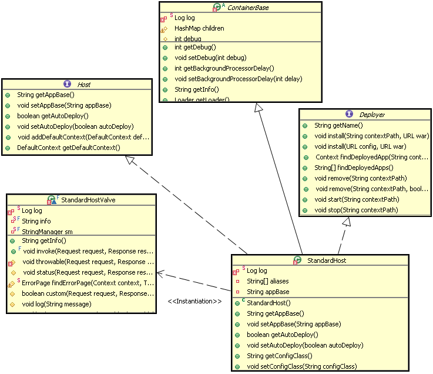

[TOC]
# 一、简介

Tomcat 设计了 4 种容器，分别是 Engine、Host、Context 和 Wrapper。这 4 种容器不是平行关系，而是父子关系。


Tomcat 通过一种分层的架构，使得 Servlet 容器具有很好的灵活性。

* Context 表示一个 Web 应用程序；

* Wrapper 表示一个 Servlet，一个 Web 应用程序中可能会有多个 Servlet；

* Host 代表的是一个虚拟主机，或者说一个站点，可以给 Tomcat 配置多个虚拟主机地址，而一个虚拟主机下可以部署多个 Web 应用程序；

* Engine 表示引擎，用来管理多个虚拟站点，一个 Service 最多只能有一个 Engine。

你可以再通过 Tomcat 的server.xml配置文件来加深对 Tomcat 容器的理解。Tomcat 采用了组件化的设计，它的构成组件都是可配置的，其中最外层的是 Server，其他组件按照一定的格式要求配置在这个顶层容器中。


Tomcat 用组合模式来管理这些容器的。具体实现方法是，所有容器组件都实现了 Container 接口，

因此组合模式可以使得用户对单容器对象和组合容器对象的使用具有一致性。

这里单容器对象指的是最底层的 Wrapper，组合容器对象指的是上面的 Context、Host 或者 Engine。

Container 接口定义如下：
```java

public interface Container extends Lifecycle {
    public void setName(String name);
    public Container getParent();
    public void setParent(Container container);
    public void addChild(Container child);
    public void removeChild(Container child);
    public Container findChild(String name);
}
```
正如我们期望的那样，我们在上面的接口看到了 getParent、setParent、addChild 和 removeChild 等方法。你可能还注意到 Container 接口扩展了 Lifecycle 接口，Lifecycle 接口用来统一管理各组件的生命周期.

# 二、请求定位 Servlet 的过程
Tomcat 使用 Mapper 组件来确定请求是由哪个 Wrapper 容器里的 Servlet 来处理

Mapper 组件的功能就是将用户请求的 URL 定位到一个 Servlet，它的工作原理是：

Mapper 组件里保存了 Web 应用的配置信息，其实就是容器组件与访问路径的映射关系，比如 Host 容器里配置的域名、Context 容器里的 Web 应用路径，以及 Wrapper 容器里 Servlet 映射的路径，

你可以想象这些配置信息就是一个多层次的 Map。当一个请求到来时，Mapper 组件通过解析请求 URL 里的域名和路径，再到自己保存的 Map 里去查找，就能定位到一个 Servlet。

注意：一个请求 URL 最后只会定位到一个 Wrapper 容器，也就是一个 Servlet。


> 假如有用户访问一个 URL，比如图中的http://user.shopping.com:8080/order/buy，Tomcat 如何将这个 URL 定位到一个 Servlet 呢？

## 首先，根据协议和端口号选定 Service 和 Engine。

我们知道 Tomcat 的每个连接器都监听不同的端口，比如 Tomcat 默认的 HTTP 连接器监听 8080 端口、默认的 AJP 连接器监听 8009 端口。上面例子中的 URL 访问的是 8080 端口，因此这个请求会被 HTTP 连接器接收，而一个连接器是属于一个 Service 组件的，这样 Service 组件就确定了。我们还知道一个 Service 组件里除了有多个连接器，还有一个容器组件，具体来说就是一个 Engine 容器，因此 Service 确定了也就意味着 Engine 也确定了。

## 然后，根据域名选定 Host。

Service 和 Engine 确定后，Mapper 组件通过 URL 中的域名去查找相应的 Host 容器，比如例子中的 URL 访问的域名是user.shopping.com，因此 Mapper 会找到 Host2 这个容器。

## 之后，根据 URL 路径找到 Context 组件。
Host 确定以后，Mapper 根据 URL 的路径来匹配相应的 Web 应用的路径，比如例子中访问的是/order，因此找到了 Context4 这个 Context 容器。

## 最后，根据 URL 路径找到 Wrapper（Servlet）。

Context 确定后，Mapper 再根据web.xml中配置的 Servlet 映射路径来找到具体的 Wrapper 和 Servlet。


# 三、Engine 容器

Engine 容器比较简单，它只定义了一些基本的关联关系，接口类图如下：


它的标准实现类是 StandardEngine，这个类注意一点就是 Engine 没有父容器了，如果调用 setParent 方法时将会报错。添加子容器也只能是 Host 类型的，代码如下：

StandardEngine. addChild
```java
public void addChild(Container child) {
    if (!(child instanceof Host))
        throw new IllegalArgumentException
            (sm.getString("standardEngine.notHost"));
    super.addChild(child);
}
 
public void setParent(Container container) {
    throw new IllegalArgumentException
        (sm.getString("standardEngine.notParent"));
}
```
它的初始化方法也就是初始化和它相关联的组件，以及一些事件的监听。

# 四、Host 容器
Host 是 Engine 的子容器，一个 Host 在 Engine 中代表一个虚拟主机，这个虚拟主机的作用就是运行多个应用，它负责安装和展开这些应用，并且标识这个应用以便能够区分它们。

它的子容器通常是 Context，它除了关联子容器外，还有就是保存一个主机应该有的信息。

下面是和 Host 相关的类关联图：




从上图中可以看出除了所有容器都继承的 ContainerBase 外，StandardHost 还实现了 Deployer 接口，上图清楚的列出了这个接口的主要方法，这些方法都是安装、展开、启动和结束每个 web application。

Deployer 接口的实现是 StandardHostDeployer，这个类实现了的最要的几个方法，Host 可以调用这些方法完成应用的部署等。

# 五、Context 容器

Context 代表 Servlet 的 Context，它具备了 Servlet 运行的基本环境，理论上只要有 Context 就能运行 Servlet 了。简单的 Tomcat 可以没有 Engine 和 Host。

Context 最重要的功能就是管理它里面的 Servlet 实例，Servlet 实例在 Context 中是以 Wrapper 出现的，还有一点就是 Context 如何才能找到正确的 Servlet 来执行它呢？ Tomcat5 以前是通过一个 Mapper 类来管理的，Tomcat5 以后这个功能被移到了 request 中，在前面的时序图中就可以发现获取**子容器都是通过 request 来分配的**。

Context 准备 Servlet 的运行环境是在 Start 方法开始的，这个方法的代码片段如下：

StandardContext.start
```java
public synchronized void start() throws LifecycleException {
    ………
    if( !initialized ) { 
        try {
            init();
        } catch( Exception ex ) {
            throw new LifecycleException("Error initializaing ", ex);
        }
    }
     
    ………
    lifecycle.fireLifecycleEvent(BEFORE_START_EVENT, null);
    setAvailable(false);
    setConfigured(false);
    boolean ok = true;
    File configBase = getConfigBase();
    if (configBase != null) {
        if (getConfigFile() == null) {
            File file = new File(configBase, getDefaultConfigFile());
            setConfigFile(file.getPath());
            try {
                File appBaseFile = new File(getAppBase());
                if (!appBaseFile.isAbsolute()) {
                    appBaseFile = new File(engineBase(), getAppBase());
                }
                String appBase = appBaseFile.getCanonicalPath();
                String basePath = 
                    (new File(getBasePath())).getCanonicalPath();
                if (!basePath.startsWith(appBase)) {
                    Server server = ServerFactory.getServer();
                    ((StandardServer) server).storeContext(this);
                }
            } catch (Exception e) {
                log.warn("Error storing config file", e);
            }
        } else {
            try {
                String canConfigFile =  (new File(getConfigFile())).getCanonicalPath();
                if (!canConfigFile.startsWith (configBase.getCanonicalPath())) {
                    File file = new File(configBase, getDefaultConfigFile());
                    if (copy(new File(canConfigFile), file)) {
                        setConfigFile(file.getPath());
                    }
                }
            } catch (Exception e) {
                log.warn("Error setting config file", e);
            }
        }
    }
 
    ………
    Container children[] = findChildren();
    for (int i = 0; i < children.length; i++) {
        if (children[i] instanceof Lifecycle)
            ((Lifecycle) children[i]).start();
    }
     
    if (pipeline instanceof Lifecycle)
        ((Lifecycle) pipeline).start();
    ………
 
}
```

它主要是设置各种资源属性和管理组件，还有非常重要的就是启动子容器和 Pipeline。

我们知道 Context 的配置文件中有个 reloadable 属性，如下面配置：

 Server.xml
 
 ```xml
<Context
    path="/library"
    docBase="D:\projects\library\deploy\target\library.war"
    reloadable="true"
/>
```

当这个 reloadable 设为 true 时，war 被修改后 Tomcat 会自动的重新加载这个应用。如何做到这点的呢 ? 这个功能是在 StandardContext 的 backgroundProcess 方法中实现的，这个方法的代码如下：

StandardContext. backgroundProcess

```java
public void backgroundProcess() {
    if (!started) return;
    count = (count + 1) % managerChecksFrequency;
    if ((getManager() != null) && (count == 0)) {
        try {
            getManager().backgroundProcess();
        } catch ( Exception x ) {
            log.warn("Unable to perform background process on manager",x);
        }
    }
    if (getLoader() != null) {
        if (reloadable && (getLoader().modified())) {
            try {
                Thread.currentThread().setContextClassLoader
                    (StandardContext.class.getClassLoader());
                //调用 reload 方法，而 reload 方法会先调用 stop 方法然后再调用 Start 方法，完成 Context 的一次重新加载
                reload();
            } finally {
                if (getLoader() != null) {
                    Thread.currentThread().setContextClassLoader
                        (getLoader().getClassLoader());
                }
            }
        }
        if (getLoader() instanceof WebappLoader) {
            ((WebappLoader) getLoader()).closeJARs(false);
        }
    }
}
```

可以看出执行 reload 方法的条件是 reloadable 为 true 和应用被修改，那么这个 backgroundProcess 方法是怎么被调用的呢？

这个方法是在 ContainerBase 类中定义的内部类 **ContainerBackgroundProcessor 被周期调用的**，这个类是运行在一个后台线程中，它会周期的执行 run 方法，它的 run 方法会周期调用所有容器的 backgroundProcess 方法，因为所有容器都会继承 ContainerBase 类，所以所有容器都能够在 backgroundProcess 方法中定义周期执行的事件。

# 六、Wrapper 容器
Wrapper 代表一个 Servlet，它负责管理一个 Servlet，包括的 Servlet 的装载、初始化、执行以及资源回收。Wrapper 是最底层的容器，它没有子容器了，所以调用它的 addChild 将会报错。

Wrapper 的实现类是 StandardWrapper，StandardWrapper 还实现了拥有一个 Servlet 初始化信息的 ServletConfig，由此看出 StandardWrapper 将直接和 Servlet 的各种信息打交道。

## Servlet 管理

Tomcat 是用 Wrapper 容器来管理 Servlet 的，那 Wrapper 容器具体长什么样子呢？我们先来看看它里面有哪些关键的成员变量：

```java

protected volatile Servlet instance = null;
```
它拥有一个 Servlet 实例，并且 Wrapper 通过 loadServlet 方法来实例化 Servlet。为了方便你阅读，我简化了代码：

StandardWrapper.loadServlet

```java

public synchronized Servlet loadServlet() throws ServletException {
    Servlet servlet;
  
    //1. 创建一个Servlet实例
    servlet = (Servlet) instanceManager.newInstance(servletClass);    
    
    //2.调用了Servlet的init方法，这是Servlet规范要求的
    initServlet(servlet);
    
    return servlet;
}
```
其实 loadServlet 主要做了两件事：

* 创建 Servlet 的实例，

* 调用 Servlet 的 init 方法，

因为这是 Servlet 规范要求的。

Tomcat 在启动时不会创建 Servlet 实例，但是会创建 Wrapper 容器，

有请求来访问某个 Servlet 时，这个 Servlet 的实例才会被创建。

**那 Servlet 是被谁调用的呢？**

每个容器组件都有自己的 Pipeline，每个 Pipeline 中有一个 Valve 链，并且每个容器组件有一个 BasicValve（基础阀）。

Wrapper 作为一个容器组件，它也有自己的 Pipeline 和 BasicValve，

Wrapper 的 BasicValve 叫 StandardWrapperValve。


当请求到来时，Context 容器的 BasicValve 会调用 Wrapper 容器中 Pipeline 中的第一个 Valve，然后会调用到 StandardWrapperValve。我们先来看看它的 invoke 方法是如何实现的:

```java

public final void invoke(Request request, Response response) {

    //1.实例化Servlet
    servlet = wrapper.allocate();
   
    //2.给当前请求创建一个Filter链
    ApplicationFilterChain filterChain =
        ApplicationFilterFactory.createFilterChain(request, wrapper, servlet);

   //3. 调用这个Filter链，Filter链中的最后一个Filter会调用Servlet
   filterChain.doFilter(request.getRequest(), response.getResponse());

}
```
StandardWrapperValve 的 invoke 方法比较复杂，去掉其他异常处理的一些细节，本质上就是三步：

* 第一步，创建 Servlet 实例；

* 第二步，给当前请求创建一个 Filter 链；

* 第三步，调用这个 Filter 链。

>为什么需要给每个请求创建一个 Filter 链？

这是因为每个请求的请求路径都不一样，而 Filter 都有相应的路径映射，因此不是所有的 Filter 都需要来处理当前的请求，我们需要根据请求的路径来选择特定的一些 Filter 来处理。

>为什么没有看到调到 Servlet 的 service 方法？

这是因为 Filter 链的 doFilter 方法会负责调用 Servlet，具体来说就是 Filter 链中的最后一个 Filter 会负责调用 Servlet。

## Filter 管理

跟 Servlet 一样，Filter 也可以在web.xml文件里进行配置，

不同的是，Filter 的作用域是整个 Web 应用，因此 Filter 的实例是在 Context 容器中进行管理的，Context 容器用 Map 集合来保存 Filter。

```java
private Map<String, FilterDef> filterDefs = new HashMap<>();
```

Filter 链的存活期很短，它是跟每个请求对应的。一个新的请求来了，就动态创建一个 Filter 链，请求处理完了，Filter 链也就被回收了。理解它的原理也非常关键，我们还是来看看源码：

```java

public final class ApplicationFilterChain implements FilterChain {
  
  //Filter链中有Filter数组，这个好理解
  private ApplicationFilterConfig[] filters = new ApplicationFilterConfig[0];
    
  //Filter链中的当前的调用位置
  private int pos = 0;
    
  //总共有多少了Filter
  private int n = 0;

  //每个Filter链对应一个Servlet，也就是它要调用的Servlet
  private Servlet servlet = null;
  
  public void doFilter(ServletRequest req, ServletResponse res) {
        internalDoFilter(request,response);
  }
   
  private void internalDoFilter(ServletRequest req,
                                ServletResponse res){

    // 每个Filter链在内部维护了一个Filter数组
    if (pos < n) {
        ApplicationFilterConfig filterConfig = filters[pos++];
        Filter filter = filterConfig.getFilter();

        filter.doFilter(request, response, this);
        return;
    }

    servlet.service(request, response);
   
}
```

从 ApplicationFilterChain 的源码我们可以看到几个关键信息：
1. Filter 链中除了有 Filter 对象的数组，还有一个整数变量 pos，这个变量用来记录当前被调用的 Filter 在数组中的位置。

2. Filter 链中有个 Servlet 实例，这个好理解，因为上面提到了，每个 Filter 链最后都会调到一个 Servlet。

3. Filter 链本身也实现了 doFilter 方法，直接调用了一个内部方法 internalDoFilter。

4. internalDoFilter 方法的实现比较有意思，它做了一个判断，如果当前 Filter 的位置小于 Filter 数组的长度，也就是说 Filter 还没调完，就从 Filter 数组拿下一个 Filter，调用它的 doFilter 方法。否则，意味着所有 Filter 都调到了，就调用 Servlet 的 service 方法。

Filter 本身的 doFilter 方法会调用 Filter 链的 doFilter 方法


```java

public void doFilter(ServletRequest request, ServletResponse response,
        FilterChain chain){
        
          ...
          
          //调用Filter的方法
          chain.doFilter(request, response);
      
      }
```

注意 Filter 的 doFilter 方法有个关键参数 FilterChain，就是 Filter 链。

并且每个 Filter 在实现 doFilter 时，必须要调用 Filter 链的 doFilter 方法，

而 Filter 链中保存当前 Filter 的位置，会调用下一个 Filter 的 doFilter 方法，

这样链式调用就完成了。

## Listener 管理

跟 Filter 一样，Listener 也是一种扩展机制，你可以监听容器内部发生的事件，主要有两类事件：

* 第一类是生命状态的变化，比如 Context 容器启动和停止、Session 的创建和销毁。

* 第二类是属性的变化，比如 Context 容器某个属性值变了、Session 的某个属性值变了以及新的请求来了等。

我们可以在web.xml配置或者通过注解的方式来添加监听器，在监听器里实现我们的业务逻辑。对于 Tomcat 来说，它需要读取配置文件，拿到监听器类的名字，实例化这些类，并且在合适的时机调用这些监听器的方法。

Tomcat 是通过 Context 容器来管理这些监听器的。Context 容器将两类事件分开来管理，分别用不同的集合来存放不同类型事件的监听器：

```java

//监听属性值变化的监听器--属性值变化listener能动态配置，所以用CopyOnWriteArray。线程安全
private List<Object> applicationEventListenersList = new CopyOnWriteArrayList<>();

//监听生命事件的监听器，生命周期事件listener，不能动态改变，没有线程安全问题
private Object applicationLifecycleListenersObjects[] = new Object[0];
```
> CopyOnWriteArrayList特点：延时更新，读线程间不阻塞

剩下的事情就是触发监听器了，比如在 Context 容器的启动方法里，就触发了所有的 ServletContextListener：

```java

//1.拿到所有的生命周期监听器
Object instances[] = getApplicationLifecycleListeners();

for (int i = 0; i < instances.length; i++) {
   //2. 判断Listener的类型是不是ServletContextListener
   if (!(instances[i] instanceof ServletContextListener))
      continue;

   //3.触发Listener的方法
   ServletContextListener lr = (ServletContextListener) instances[i];
   lr.contextInitialized(event);
}
```

需要注意的是，这里的 ServletContextListener 接口是一种留给用户的扩展机制，用户可以实现这个接口来定义自己的监听器，监听 Context 容器的启停事件。

Spring 就是这么做的。

ServletContextListener 跟 Tomcat 自己的生命周期事件 LifecycleListener 是不同的。

LifecycleListener 定义在生命周期管理组件中，由基类 LifecycleBase 统一管理。