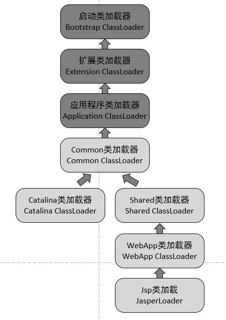

[TOC]

# 一、前言
我们知道，Java默认的类加载机制是通过双亲委派模型来实现的。而Tomcat实现的方式又和双亲委派模型有所区别。

原因在于一个Tomcat容器允许同时运行多个Web程序，每个Web程序依赖的类又必须是相互隔离的。因此，如果Tomcat使用双亲委派模式来加载类的话，将导致Web程序依赖的类变为共享的。

# 二、Tomcat类加载机制

Tomcat整体的类加载图




Tomcat 的自定义类加载器 WebAppClassLoader 打破了双亲委托机制，它首先自己尝试去加载某个类，如果找不到再代理给父类加载器，其目的是优先加载 Web 应用自己定义的类。具体实现就是重写 ClassLoader 的两个方法：findClass 和 loadClass。

## findClass 方法
我们先来看看 findClass 方法的实现，为了方便理解和阅读，我去掉了一些细节：

```java

public Class<?> findClass(String name) throws ClassNotFoundException {
    ...
    
    Class<?> clazz = null;
    try {
            //1. 先在Web应用目录下查找类 
            clazz = findClassInternal(name);
    }  catch (RuntimeException e) {
           throw e;
       }
    
    if (clazz == null) {
    try {
            //2. 如果在本地目录没有找到，交给父加载器去查找
            clazz = super.findClass(name);
    }  catch (RuntimeException e) {
           throw e;
       }
    
    //3. 如果父类也没找到，抛出ClassNotFoundException
    if (clazz == null) {
        throw new ClassNotFoundException(name);
     }

    return clazz;
}
```
在 findClass 方法里，主要有三个步骤：
1. 先在 Web 应用本地目录下查找要加载的类。

2. 如果没有找到，交给父加载器去查找，它的父加载器就是上面提到的系统类加载器 AppClassLoader。

3. 如果父加载器也没找到这个类，抛出 ClassNotFound 异常。

## loadClass 方法

接着我们再来看 Tomcat 类加载器的 loadClass 方法的实现，同样我也去掉了一些细节：

```java

public Class<?> loadClass(String name, boolean resolve) throws ClassNotFoundException {

    synchronized (getClassLoadingLock(name)) {
 
        Class<?> clazz = null;

        //1. 先在本地cache查找该类是否已经加载过
        clazz = findLoadedClass0(name);
        if (clazz != null) {
            if (resolve)
                resolveClass(clazz);
            return clazz;
        }

        //2. 从系统类加载器的cache中查找是否加载过
        clazz = findLoadedClass(name);
        if (clazz != null) {
            if (resolve)
                resolveClass(clazz);
            return clazz;
        }

        // 3. 尝试用ExtClassLoader类加载器类加载，为什么？
        ClassLoader javaseLoader = getJavaseClassLoader();
        try {
            clazz = javaseLoader.loadClass(name);
            if (clazz != null) {
                if (resolve)
                    resolveClass(clazz);
                return clazz;
            }
        } catch (ClassNotFoundException e) {
            // Ignore
        }

        // 4. 尝试在本地目录搜索class并加载
        try {
            clazz = findClass(name);
            if (clazz != null) {
                if (resolve)
                    resolveClass(clazz);
                return clazz;
            }
        } catch (ClassNotFoundException e) {
            // Ignore
        }

        // 5. 尝试用系统类加载器(也就是AppClassLoader)来加载
            try {
                clazz = Class.forName(name, false, parent);
                if (clazz != null) {
                    if (resolve)
                        resolveClass(clazz);
                    return clazz;
                }
            } catch (ClassNotFoundException e) {
                // Ignore
            }
       }
    
    //6. 上述过程都加载失败，抛出异常
    throw new ClassNotFoundException(name);
}
```
loadClass 方法稍微复杂一点，主要有六个步骤：

1. 先在本地 Cache 查找该类是否已经加载过，也就是说 Tomcat 的类加载器是否已经加载过这个类。

2. 如果 Tomcat 类加载器没有加载过这个类，再看看系统类加载器是否加载过。

3. 如果都没有，就让 `ExtClassLoader` 去加载，这一步比较关键，**目的防止 Web 应用自己的类覆盖 JRE 的核心类。**因为 Tomcat 需要打破双亲委托机制，假如 Web 应用里自定义了一个叫 Object 的类，如果先加载这个 Object 类，就会覆盖 JRE 里面的那个 Object 类，这就是为什么 Tomcat 的类加载器会优先尝试用 ExtClassLoader 去加载，因为 ExtClassLoader 会委托给 BootstrapClassLoader 去加载，BootstrapClassLoader 发现自己已经加载了 Object 类，直接返回给 Tomcat 的类加载器，这样 Tomcat 的类加载器就不会去加载 Web 应用下的 Object 类了，也就避免了覆盖 JRE 核心类的问题。

4. 如果 ExtClassLoader 加载器加载失败，也就是说 JRE 核心类中没有这类，那么就在本地 Web 应用目录下查找并加载。

5. 如果本地目录下没有这个类，说明不是 Web 应用自己定义的类，那么由系统类加载器去加载。这里请你注意，Web 应用是通过Class.forName调用交给系统类加载器的，因为Class.forName的默认加载器就是系统类加载器。

6. 如果上述加载过程全部失败，抛出 ClassNotFound 异常。

从上面的过程我们可以看到，Tomcat 的类加载器打破了双亲委托机制，没有一上来就直接委托给父加载器，而是先在本地目录下加载，**为了避免本地目录下的类覆盖 JRE 的核心类**，先尝试用 JVM 扩展类加载器 ExtClassLoader 去加载。

那为什么不先用系统类加载器 AppClassLoader 去加载？因为AppClassLoader加载的是本地目录下的类，如果是这样的话，那就变成双亲委托机制了，这就是 Tomcat 类加载器的巧妙之处。


# 三、Tomcat如何隔离Web应用？

>问题：
>1. 假如我们在 Tomcat 中运行了两个 Web 应用程序，两个 Web 应用中有同名的 Servlet，但是功能不同，Tomcat 需要同时加载和管理这两个同名的 Servlet 类，保证它们不会冲突，因此 **Web 应用之间的类需要隔离**。
>2. 假如两个 Web 应用都依赖同一个第三方的 JAR 包，比如 Spring，那 Spring 的 JAR 包被加载到内存后，Tomcat 要保证这两个 **Web 应用能够共享同一个JAR**，也就是说 Spring 的 JAR 包只被加载一次，否则随着依赖的第三方 JAR 包增多，JVM 的内存会膨胀
>3. 跟 JVM 一样，我们需要**隔离 Tomcat 本身的类和 Web 应用的类**。

## Tomcat 类加载器的层次结构


## 隔离Web应用之间的类

假如我们使用 JVM 默认 AppClassLoader 来加载 Web 应用，AppClassLoader 只能加载一个 Servlet 类，在加载第二个同名 Servlet 类时，AppClassLoader 会返回第一个 Servlet 类的 Class 实例，这是因为在 AppClassLoader 看来，同名的 Servlet 类只被加载一次。

因此 Tomcat 的解决方案是自定义一个类加载器 WebAppClassLoader， 并且给每个 Web 应用创建一个类加载器实例。我们知道，Context 容器组件对应一个 Web 应用，因此，每个 Context 容器负责创建和维护一个 WebAppClassLoader 加载器实例。

**这背后的原理是，不同的加载器实例加载的类被认为是不同的类，即使它们的类名相同**。这就相当于在 Java 虚拟机内部创建了一个个相互隔离的 Java 类空间，每一个 Web 应用都有自己的类空间，Web 应用之间通过各自的类加载器互相隔离。

> WebAppClassLoader对应 <Tomcat >/webapps/<app>/WEB-INF/\*目录

## 两个 Web 应用之间怎么共享库类

本质需求是两个 Web 应用之间怎么共享库类，并且不能重复加载相同的类。

我们知道，在双亲委托机制里，各个子加载器都可以通过父加载器去加载类，那么把需要共享的类放到父加载器的加载路径下不就行了吗，应用程序也正是通过这种方式共享 JRE 的核心类。

因此 Tomcat 的设计者又加了一个类加载器 SharedClassLoader，作为 **WebAppClassLoader 的父加载器**，专门来加载 Web 应用之间共享的类。

如果 WebAppClassLoader 自己没有加载到某个类，就会委托父加载器 SharedClassLoader 去加载这个类，SharedClassLoader 会在指定目录下加载共享类，之后返回给 WebAppClassLoader，这样共享的问题就解决了。

>SharedClassLoader对应 <Tomcat >/shared/*

## 隔离 Tomcat 本身的类和 Web 应用的类

共享可以通过父子关系，要隔离那就需要**兄弟关系**了。

兄弟关系就是指两个类加载器是平行的，它们可能拥有同一个父加载器，但是两个兄弟类加载器加载的类是隔离的。

基于此 Tomcat 又设计一个类加载器 `CatalinaClassLoader`，专门来加载 Tomcat 自身的类。

>CatalinaClassLoader对应 <Tomcat >/server/*


**这样设计有个问题，那 Tomcat 和各 Web 应用之间需要共享一些类时该怎么办呢？**

老办法，还是再增加一个 `CommonClassLoader`，作为 CatalinaClassLoader 和 SharedClassLoader 的父加载器。

CommonClassLoader 能加载的类都可以被 CatalinaClassLoader 和 SharedClassLoader 使用，

而 CatalinaClassLoader 和 SharedClassLoader 能加载的类则与对方相互隔离。

WebAppClassLoader 可以使用 SharedClassLoader 加载到的类，但各个 WebAppClassLoader 实例之间相互隔离。

>CommonClassLoader对应<Tomcat>/common/*

## 线程上下文类加载器，解决Spring 的加载问题

默认情况下，如果一个类由类加载器 A 加载，那么这个类的依赖类也是由相同的类加载器加载。比如 Spring 作为一个 Bean 工厂，它需要创建业务类的实例，并且在创建业务类实例之前需要加载这些类。Spring 是通过调用Class.forName来加载业务类的，我们来看一下 forName 的源码：
```java

public static Class<?> forName(String className) {
    Class<?> caller = Reflection.getCallerClass();
    return forName0(className, true, ClassLoader.getClassLoader(caller), caller);
}
```
可以看到在 forName 的函数里，会用调用者也就是 Spring 的加载器去加载业务类。

Spring 作为共享的第三方 JAR 包，它本身是由 SharedClassLoader 来加载的，Spring 又要去加载业务类。

但是业务类在 Web 应用目录下，是由 SharedClassLoader 的子类 WebAppClassLoader加载的。

此时存在需要在父类加载器使用子类加载器加载的类。

**所以需要使用线程上下文类加载器**

它其实是一种类加载器传递机制。

为什么叫作“线程上下文加载器”呢，因为这个类加载器保存在线程私有数据里，只要是同一个线程，一旦设置了线程上下文加载器，在线程后续执行过程中就能把这个类加载器取出来用。

因此 Tomcat 为每个 Web 应用创建一个 WebAppClassLoader 类加载器，并在启动 Web 应用的线程里设置线程上下文加载器，

这样 Spring 在启动时就将线程上下文加载器取出来，用来加载 Bean。Spring 取线程上下文加载的代码如下：

```java

cl = Thread.currentThread().getContextClassLoader();
```

在 StandardContext 的启动方法里，会将当前线程的上下文加载器设置为 WebAppClassLoader。

```java
originalClassLoader = Thread.currentThread().getContextClassLoader();
Thread.currentThread().setContextClassLoader(webApplicationClassLoader);
```

在启动方法结束的时候，还会恢复线程的上下文加载器：

```java
Thread.currentThread().setContextClassLoader(originalClassLoader);
```
原因：

线程上下文加载器其实是线程的一个私有数据，跟线程绑定的，这个线程做完启动Context组件的事情后，会被回收到线程池，之后被用来做其他事情，为了不影响其他事情，需要恢复之前的线程上下文加载器。