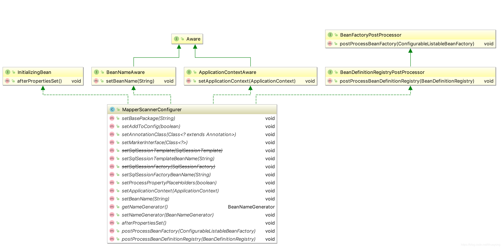
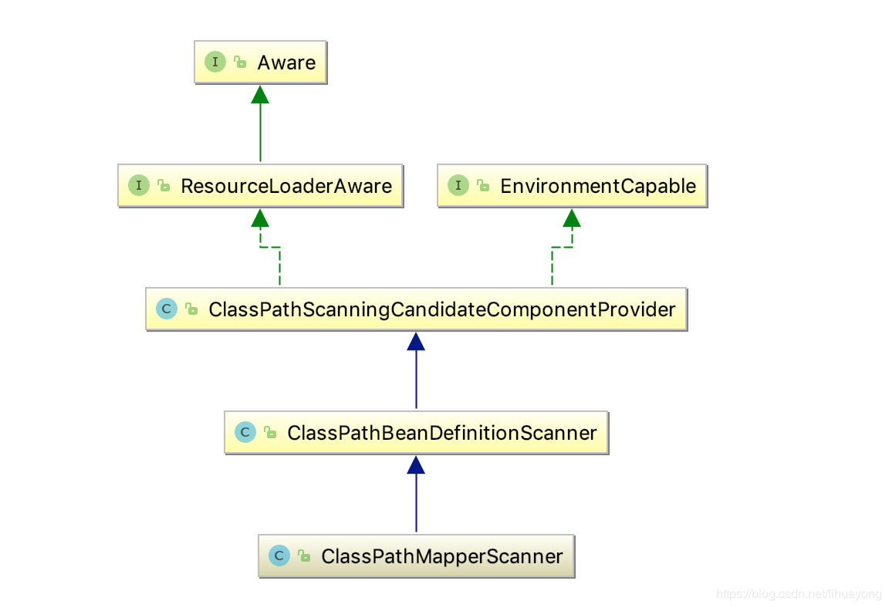
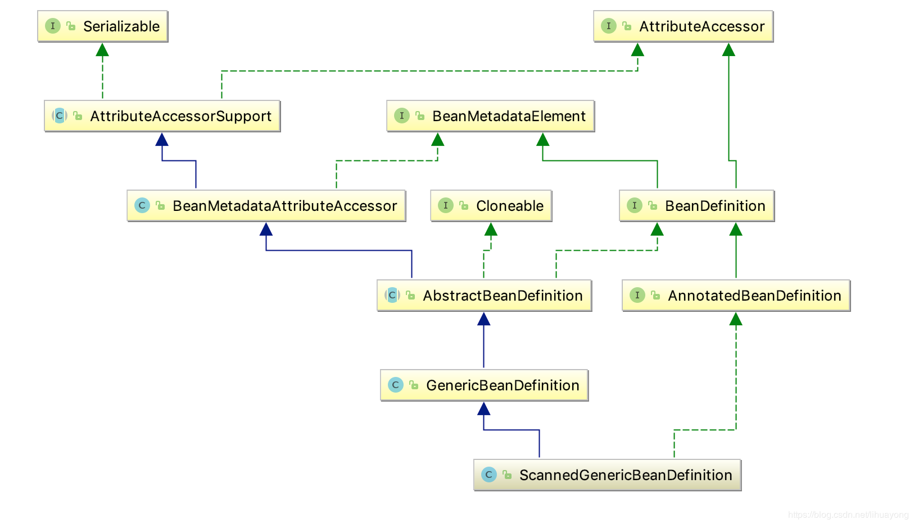
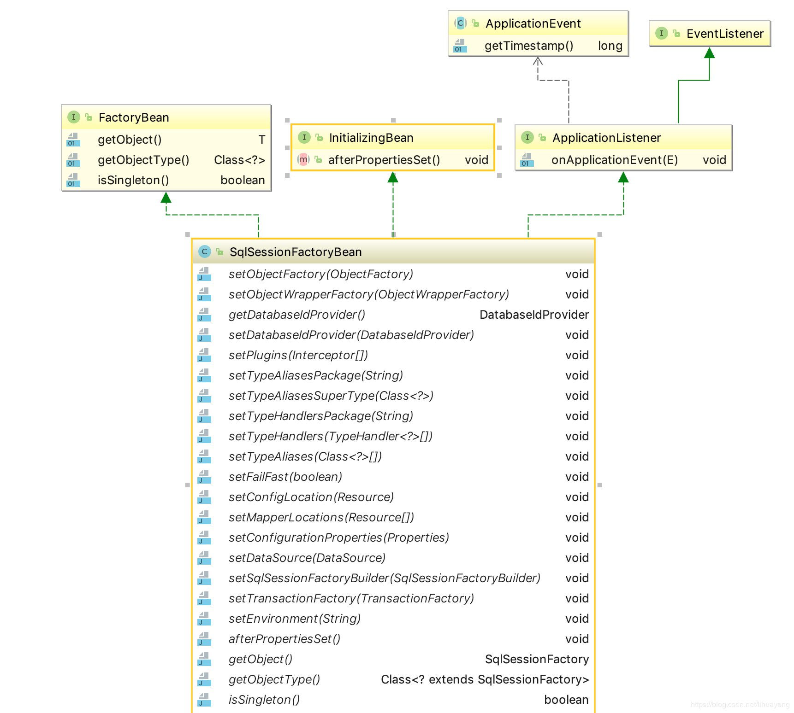
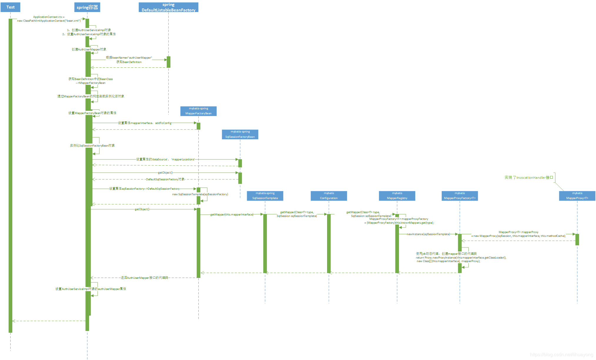
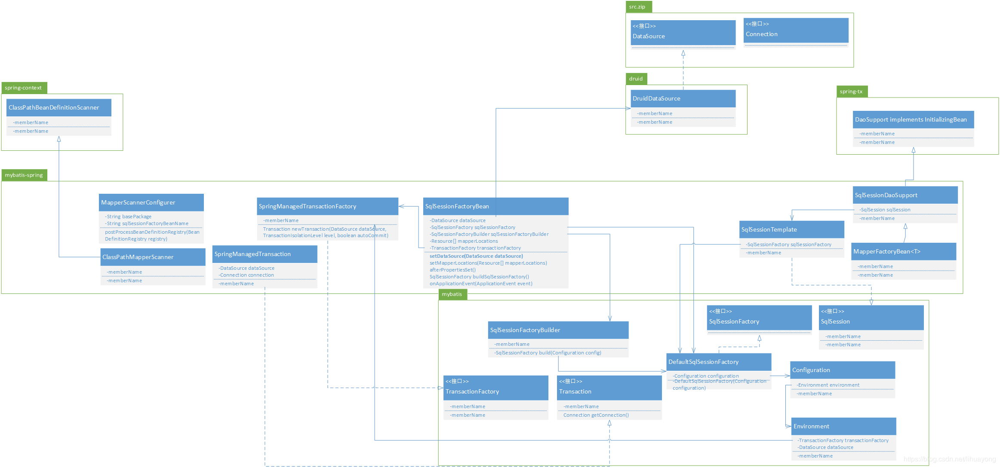

[TOC]

# 一、整合步骤
1. 整合的过程中需要使用以下这个依赖包：
```xml
<!-- mybatis-spring 整合 -->
<dependency>
  <groupId>org.mybatis</groupId>
  <artifactId>mybatis-spring</artifactId>
  <version>1.2.2</version>
</dependency>
```
2. spring启动的时候需要使用一个bean.xml配置文件
```java
ApplicationContext ctx = new ClassPathXmlApplicationContext("bean.xml");
```
3. bean.xml文件中就涉及到整合的配置信息，整合使用到以下的配置：
```xml
<bean id="sqlSessionFactory" class="org.mybatis.spring.SqlSessionFactoryBean">
    <!-- 加载数据源 -->
    <property name="dataSource" ref="dataSource"/>
    <property name="mapperLocations" value="classpath*:mappers/*Mapper.xml"/>
</bean>
 
<bean class="org.mybatis.spring.mapper.MapperScannerConfigurer">
    <!-- 指定扫描的包，如果存在多个包使用(逗号,)分割 -->
    <property name="basePackage" value="com.test.bean"/>
    <property name="sqlSessionFactoryBeanName" value="sqlSessionFactory"/>
</bean>
```

# 二、创建MapperScannerConfigurer
```xml
<bean class="org.mybatis.spring.mapper.MapperScannerConfigurer">
    <!-- 指定扫描的包，如果存在多个包使用(逗号,)分割 -->
    <property name="basePackage" value="com.test.bean"/>
    <property name="sqlSessionFactoryBeanName" value="sqlSessionFactory"/>
</bean>
```

首先我们分析一下，这个MapperScannerConfigurer类在实例化过程中做了什么主要的事情。首先看看它的类图：


这个类中主要的方法就是这个`postProcessBeanDefinitionRegistry(BeanDefinitionRegistry registry)`方法，看看具体内容：

```java
public void postProcessBeanDefinitionRegistry(BeanDefinitionRegistry registry) throws BeansException {
    if (this.processPropertyPlaceHolders) {
        this.processPropertyPlaceHolders();
    }
    ClassPathMapperScanner scanner = new ClassPathMapperScanner(registry);
    scanner.setAddToConfig(this.addToConfig);
    scanner.setAnnotationClass(this.annotationClass);
    scanner.setMarkerInterface(this.markerInterface);
    scanner.setSqlSessionFactory(this.sqlSessionFactory);
    scanner.setSqlSessionTemplate(this.sqlSessionTemplate);
    scanner.setSqlSessionFactoryBeanName(this.sqlSessionFactoryBeanName);
    scanner.setSqlSessionTemplateBeanName(this.sqlSessionTemplateBeanName);
    scanner.setResourceLoader(this.applicationContext);
    scanner.setBeanNameGenerator(this.nameGenerator);
    scanner.registerFilters();
    scanner.scan(StringUtils.tokenizeToStringArray(this.basePackage, ",; \t\n"));
}
```

这个方法中创建了一个spring-mybatis.jar包中的ClassPathMapperScanner扫描器，这个扫描器继承了spring的ClassPathBeanDefinitionScanner。



ClassPathMapperScanner这个扫描器的主要的作用有以下几个：

> 第一扫描basePackage包下面所有的class类

> 第二将所有的class类封装成为spring的ScannedGenericBeanDefinition sbd对象



> 第三过滤sbd对象.

只接受接口类，从下面的代码中可以看出。
```java
protected boolean isCandidateComponent(AnnotatedBeanDefinition beanDefinition) {
    return beanDefinition.getMetadata().isInterface() && beanDefinition.getMetadata().isIndependent();
}
```
>第四完成sbd对象属性的设置

比如设置sqlSessionFactory、BeanClass等.
```java
sbd.getPropertyValues().add("mapperInterface", definition.getBeanClassName());
sbd.setBeanClass(MapperFactoryBean.class);
sbd.getPropertyValues().add("sqlSessionFactory", this.sqlSessionFactory);
```
>第五将过滤出来的sbd对象通过这个BeanDefinitionRegistry registry注册器注册到DefaultListableBeanFactory中

这个registry就是方法postProcessBeanDefinitionRegistry(BeanDefinitionRegistry registry)中的参数。

以上就是实例化MapperScannerConfigurer类的主要工作，总结起来就是扫描basePackage包下所有的mapper接口类，并将mapper接口类封装成为BeanDefinition对象，注册到spring的BeanFactory容器中。

# 三、创建SqlSessionFactoryBean
```xml
<bean id="sqlSessionFactory" class="org.mybatis.spring.SqlSessionFactoryBean">
    <!-- 加载数据源 -->
    <property name="dataSource" ref="dataSource"/>
    <property name="mapperLocations" value="classpath*:mappers/*Mapper.xml"/>
</bean>
```

从配置来看，这个Bean至少提供了两个方法，一个是和dataSource有关，一个和mapperLocations有关，

```java
public void setDataSource(DataSource dataSource) {
    if (dataSource instanceof TransactionAwareDataSourceProxy) {
        this.dataSource = ((TransactionAwareDataSourceProxy)dataSource).getTargetDataSource();
    } else {
        this.dataSource = dataSource;
    }
 
}
public void setMapperLocations(Resource[] mapperLocations) {
    this.mapperLocations = mapperLocations;
}
```
这个两个方法，啥也没干，就是做了一次赋值操作。

## SqlSessionFactory的初始化
>FactoryBean：在某些情况下，实例化Bean过程比较复杂，如果按照传统的方式，则需要在<bean>中提供大量的配置信息。配置方式的灵活性是受限的，用户可以通过实现org.springframework.bean.factory.FactoryBean接口定制实例化Bean的逻辑

* SqlSessionFactoryBean即为如此，不同于普通Bean的是：它是实现了FactoryBean<T>接口的Bean，根据该Bean的ID从BeanFactory中获取的实际上是FactoryBean的getObject()返回的对象，而不是FactoryBean本身，

* 可以理解为Mybatis为Spring整合准备的一个类，初始化后即得到了SqlSessionFactory，即为Mybatis本身的SqlSessionFactory

* SqlSessionFactoryBean实现了InitializingBean，FactoryBean，ApplicationListener接口
```java
public class SqlSessionFactoryBean implements FactoryBean<SqlSessionFactory>, InitializingBean, ApplicationListener<ApplicationEvent> {
 
 }
```


* 实现了InitializingBean，通过该类的afterPropertiesSet()方法进行初始化
```java
public void afterPropertiesSet() throws Exception {
    //dataSource是必须滴
    notNull(dataSource, "Property 'dataSource' is required");
    //sqlSessionFactoryBuilder也是必须滴
    notNull(sqlSessionFactoryBuilder, "Property 'sqlSessionFactoryBuilder' is required");
    //configuration对象与configLocation不能同时指定
    state((configuration == null && configLocation == null) || !(configuration != null && configLocation != null),
              "Property 'configuration' and 'configLocation' can not specified with together");
    //开始构建SqlSessionFactory
    this.sqlSessionFactory = buildSqlSessionFactory();
  }
```
初始化后就已经生成了Mybatis本身的SqlSessionFactory。

> 具体看一下buildSqlSessionFactory()方法中做了什么

```java
protected SqlSessionFactory buildSqlSessionFactory() throws IOException {
    XMLConfigBuilder xmlConfigBuilder = null;
    Configuration configuration;
    configuration = new Configuration();
        configuration.setVariables(this.configurationProperties);
    //省略代码
    if (this.transactionFactory == null) {
        this.transactionFactory = new SpringManagedTransactionFactory();
    }
 
    Environment environment = new Environment(this.environment, this.transactionFactory, this.dataSource);
    configuration.setEnvironment(environment);
    
    if (!ObjectUtils.isEmpty(this.mapperLocations)) {
        Resource[] arr$ = this.mapperLocations;
        len$ = arr$.length;
        for(i$ = 0; i$ < len$; ++i$) {
            Resource mapperLocation = arr$[i$];
            if (mapperLocation != null) {
                try {
                    XMLMapperBuilder xmlMapperBuilder = new XMLMapperBuilder(mapperLocation.getInputStream(), configuration, mapperLocation.toString(), configuration.getSqlFragments());
                    //解析mapperLocation变量所代表的mybatis的一个xml配置文件
                    //然后将解析的结果封装成不同的对象，存放到Configuration对象中
                    xmlMapperBuilder.parse();
                } catch (Exception var20) {
                    throw new NestedIOException("Failed to parse mapping resource: '" + mapperLocation + "'", var20);
                } finally {
                    ErrorContext.instance().reset();
                }
            }
        }
    }
 
    return this.sqlSessionFactoryBuilder.build(configuration);
}
```
xmlMapperBuilder.parse()方法执行完成之后，调用`this.sqlSessionFactoryBuilder.build(configuration)`，这个sqlSessionFactoryBuilder 构造器就是SqlSessionFactoryBean类的一个私有类变量，初始化SqlSessionFactoryBean的时候，就实例化了这个sqlSessionFactoryBuilder。

```java
private SqlSessionFactoryBuilder sqlSessionFactoryBuilder = new SqlSessionFactoryBuilder();
```
看看这个build()方法做什么了

```java
public SqlSessionFactory build(Configuration config) {
    return new DefaultSqlSessionFactory(config);
}
```

构造器做的事情很简单，直接创建了DefaultSqlSessionFactory，其中还持有Configuration对象的引用。到此afterPropertiesSet()方法做的做的事情就结束了。

总结起来，就是创建了几个对象，依次是mybatis的核心类Configuration、spring和mybatis集成的事物工厂类SpringManagedTransactionFactory、mybatis的Environment类、mybatis的DefaultSqlSessionFactory类，同时还完成了对mybatis的xml文件解析，并将解析结果封装在Configuration类中。


## SqlSessionFactoryBean的getObject方法

```java
public SqlSessionFactory getObject() throws Exception {
    if (this.sqlSessionFactory == null) {
        this.afterPropertiesSet();
    }
    return this.sqlSessionFactory;
}
```

返回生成的sqlSessionFactory实例

# 四、整合之后实例化过程
Spring容器在启动的过程中，需要去实例化AuthUserServiceImpl服务类

```java
@Service
public class AuthUserServiceImpl implements IAuthUserService {
	@Resource
	private AuthUserMapper authUserMapper;
 
	public AuthUserServiceImpl(){
		logger.info("创建 com.test.bean.AuthUserServiceImpl");
	}
}
```


这个类依赖了AuthUserMapper接口，在实例化AuthUserServiceImpl的过程中需要，首先去实例化这个AuthUserMapper接口，但是接口是不能被实例化的，接下来分析这个接口实现类的创建过程。



1. Spring在初始化的过程中，会去创建AuthUserServiceImpl类，创建完成之后，会设置AuthUserServiceImpl对象的属性，AuthUserMapper这个mybatis接口就是AuthUserServiceImpl的一个属性。

2. 首先根据这个mapper的名字从spring的BeanFactory中获取它的BeanDefinition，再从BeanDefinition中获取BeanClass，AuthUserMapper对应的BeanClass就是MapperFactoryBean，这是为什么呢？在上面分析的内容中提到过，也就是在创建MapperScannerConfigurer对象的时候设置的。

3. 接着就是创建MapperFactoryBean对象了，创建完成之后，就需要对属性进行赋值，其中有一个属性就是SqlSessionFactoryBean，要实例化这个对象，这个就需要用到下面这个标签了
```xml
<bean id="sqlSessionFactory" class="org.mybatis.spring.SqlSessionFactoryBean">
    <!-- 加载数据源 -->
    <property name="dataSource" ref="dataSource"/>
    <property name="mapperLocations" value="classpath*:mappers/*Mapper.xml"/>
</bean>
```
4. MapperFactoryBean对象的属性设置完成之后，就调用它的getObject()方法，来获取authUserMapper对应的实现类，最后返回的就是一个代理类，这个代理类使用jdk的动态代理创建出来的。
```java
return Proxy.newProxyInstance(this.mapperInterface.getClassLoader(),
 new Class[]{this.mapperInterface}, mapperProxy);
```
这个MapperProxy类就是InvocationHandler的实现类：
```java
 public class MapperProxy<T> implements InvocationHandler, Serializable {
 
    public Object invoke(Object proxy, Method method, Object[] args) throws Throwable {
        if (Object.class.equals(method.getDeclaringClass())) {
            return method.invoke(this, args);
        } else {
            MapperMethod mapperMethod = this.cachedMapperMethod(method);
            return mapperMethod.execute(this.sqlSession, args);
        }
    }
}
```

5. 程序在调用authUserMapper对象的某个方法的时候，就会调用到MapperProxy对象的invoke()方法，去完成对数据库的操作。


最后附上一张类图，spring和mybatis整合过程中创建的类：


