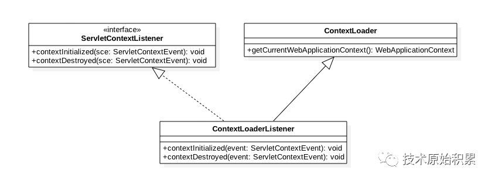
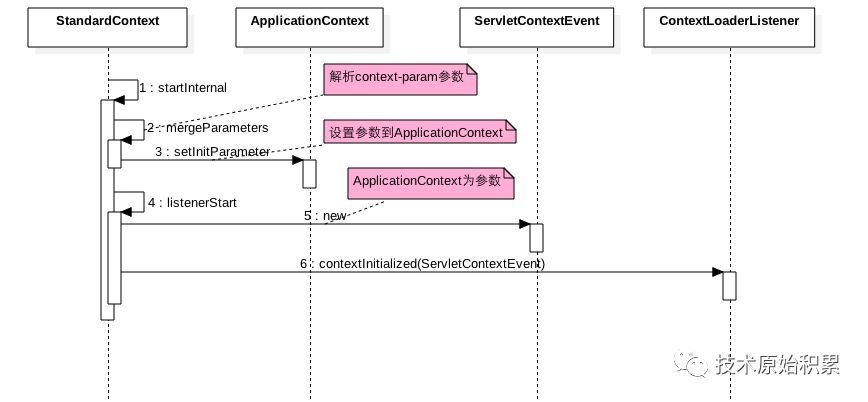
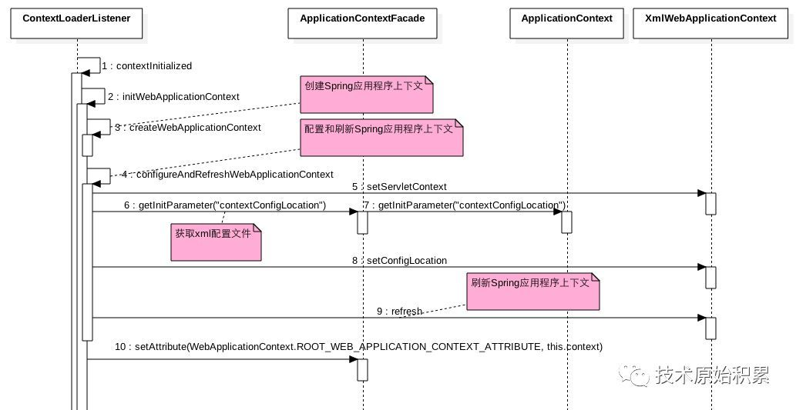

[TOC]

# 一、前言 -- Tomcat
Tomcat使用监听器来启动Spring，我们可以在web.xml配置或者通过注解的方式来添加监听器，在监听器里实现我们的业务逻辑。对于 Tomcat 来说，它需要读取配置文件，拿到监听器类的名字，实例化这些类，并且在合适的时机调用这些监听器的方法。

Tomcat 是通过 Context 容器来管理这些监听器的。Context 容器将两类事件分开来管理，分别用不同的集合来存放不同类型事件的监听器：

1. 监听属性值变化的监听器--属性值变化listener能动态配置，所以用CopyOnWriteArray。线程安全
CopyOnWriteArrayList特点：延时更新，读线程间不阻塞
```java
private List<Object> applicationEventListenersList = new CopyOnWriteArrayList<>();
```

2. 监听生命事件的监听器，生命周期事件listener，不能动态改变，没有线程安全问题
```java
private Object applicationLifecycleListenersObjects[] = new Object[0];
```

在 Context 容器的启动方法里，就触发了所有的 ServletContextListener：
```java

//1.拿到所有的生命周期监听器
Object instances[] = getApplicationLifecycleListeners();

for (int i = 0; i < instances.length; i++) {
   //2. 判断Listener的类型是不是ServletContextListener
   if (!(instances[i] instanceof ServletContextListener))
      continue;

   //3.触发Listener的方法
   ServletContextListener lr = (ServletContextListener) instances[i];
   lr.contextInitialized(event);
}
```
需要注意的是，这里的 ServletContextListener 接口是一种留给用户的扩展机制，用户可以实现这个接口来定义自己的监听器，监听 Context 容器的启停事件。

# 二、ServletContextListener
它能够监听 ServletContext 对象的生命周期，实际上就是监听 Web 应用的生命周期。

当Servlet 容器启动或终止Web 应用时，会触发ServletContextEvent 事件，该事件由ServletContextListener 来处理。在 ServletContextListener 接口中定义了处理ServletContextEvent 事件的两个方法。

```java
/**
  * 当Servlet 容器启动Web 应用时调用该方法。在调用完该方法之后，容器再对Filter 初始化，
  * 并且对那些在Web 应用启动时就需要被初始化的Servlet 进行初始化。
  */
 contextInitialized(ServletContextEvent sce) 
 
 
 /**
  * 当Servlet 容器终止Web 应用时调用该方法。在调用该方法之前，容器会先销毁所有的Servlet 和Filter 过滤器。
  */
 contextDestroyed(ServletContextEvent sce)
```

# 三、ContextLoaderListener扩展接口

首先看下ContextLoaderListener的类图结构：



ContextLoaderListener继承了ServletContextListener，用于启动Spring容器。

```java
public class ContextLoaderListener extends ContextLoader implements ServletContextListener {


	public ContextLoaderListener() {
	}

	
	public ContextLoaderListener(WebApplicationContext context) {
		super(context);
	}


	/**
	 * Initialize the root web application context.
	 */
	@Override
	public void contextInitialized(ServletContextEvent event) {
		initWebApplicationContext(event.getServletContext());
	}


	/**
	 * Close the root web application context.
	 */
	@Override
	public void contextDestroyed(ServletContextEvent event) {
		closeWebApplicationContext(event.getServletContext());
		ContextCleanupListener.cleanupAttributes(event.getServletContext());
	}

}
```

ContextLoaderListener一般是按照下面的方式配置到web.xml里面:
```xml
<listener>
    <listener-class>org.springframework.web.util.IntrospectorCleanupListener</listener-class>
</listener>
<context-param>
    <param-name>contextConfigLocation</param-name>
    <param-value>classpath:applicationContext.xml</param-value>
</context-param>
```
首先创建了一个ContextLoaderListener实例，该实例会创建一个XmlWebApplicationContext应用程序上下文，contextConfigLocation参数是要告诉ContextLoaderListener要把哪些Bean注入到XmlWebApplicationContext管理的BeanFactory。



1. 在Tomcat中一个StandardContext代表者一个Web应用，

2. 时序图中步骤（2）(3)在Web应用启动过程中会调用mergeParameters方法解析web.xml配置的context-param参数,并把这些参数设置到ApplicationContext中，也就是说上面配置的contextConfigLocation参数和值也保存到了ApplicationContext中。

3. 需要注意的是这里的ApplicationContext不同于Spring框架中的ApplicationContext，这里的ApplicationContext是tomcat中的ApplicationContext ，它实现了 org.apache.catalina.servlet4preview.ServletContext，是一个ServletContext,这个ApplicationContext是应用级别的，每个应用维护着自己的一个ApplicationContext对象，用来保存应用级别的变量信息，其内部通过`private final ConcurrentMap<String,String> parameters = new ConcurrentHashMap<>();`保存应用级别的变量信息。

4. 时序图中步骤（4）（5）（6）是初始化所有在web.xml里面配置的ServletContextListener的实现类，并以ApplicationContext为构造函数参数创建一个ServletContextEvent 作为ServletContext事件(内部实际维护的是ApplicationContext的一个门面类ApplicationContextFacade)，

5. 然后调用所有实现类的contextInitialized的方法并传递ServletContextEvent作为参数，

6. 也就是说在tomcat的每个应用启动过程中会调用ContextLoaderListener的contextInitialized方法，并且传递的参数里面包含该应用级别的一个ApplicationContext对象，该对象里面包含了该应用的全局作用域的变量集合。


# 四、ContextLoaderListener如何创建XmlWebApplicationContext

下面看下ContextLoaderListener的contextInitialized方法时序图，看是如何创建XmlWebApplicationContext并获取到了contextConfigLocation变量的值作为Spring容器加载Bean的数据源：




1. 如上时序图步骤（3）创建Spring应用程序上下文XmlWebApplicationContext

2. 如上时序图步骤（5）设置XmlWebApplicationContext的ServletContext为ApplicationContextFacade

3. 如上时序图步骤（6）（7）从ServletContext中获取contextConfigLocation变量的值，这里为WEB-INF/applicationContext.xml

4. 如上时序图步骤（8）设置XmlWebApplicationContext的配置文件为WEB-INF/applicationContext.xml，这意味着会从WEB-INF/applicationContext.xml中解析Bean注入到XmlWebApplicationContext管理的BeanFactory。

5. 如上时序图步骤（9）刷新XmlWebApplicationContext应用程序上下文

6. 如上时序图步骤（10）保存XmlWebApplicationContext到ServletContext，这样应用里面任何有ServletContext的地方就可以获取XmlWebApplicationContext，从而可以获取XmlWebApplicationContext管理的所有Bean。