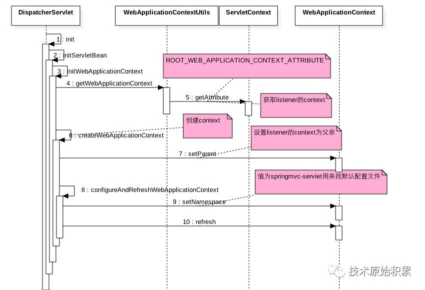

[TOC]

# 一、前言 -- Tomcat

Tomcat 是用 Wrapper 容器来管理 Servlet 的，那 Wrapper 容器具体长什么样子呢？我们先来看看它里面有哪些关键的成员变量：

```java

protected volatile Servlet instance = null;
```
它拥有一个 Servlet 实例，并且 Wrapper 通过 loadServlet 方法来实例化 Servlet。为了方便你阅读，我简化了代码：

StandardWrapper.loadServlet

```java

public synchronized Servlet loadServlet() throws ServletException {
    Servlet servlet;
  
    //1. 创建一个Servlet实例
    servlet = (Servlet) instanceManager.newInstance(servletClass);    
    
    //2.调用了Servlet的init方法，这是Servlet规范要求的
    initServlet(servlet);
    
    return servlet;
}
```
其实 loadServlet 主要做了两件事：

* 创建 Servlet 的实例，

* 调用 Servlet 的 init 方法，

因为这是 Servlet 规范要求的。

Tomcat 在启动时不会创建 Servlet 实例，但是会创建 Wrapper 容器，

有请求来访问某个 Servlet 时，这个 Servlet 的实例才会被创建。

**那 Servlet 是被谁调用的呢？**

每个容器组件都有自己的 Pipeline，每个 Pipeline 中有一个 Valve 链，并且每个容器组件有一个 BasicValve（基础阀）。

Wrapper 作为一个容器组件，它也有自己的 Pipeline 和 BasicValve，

Wrapper 的 BasicValve 叫 StandardWrapperValve。


当请求到来时，Context 容器的 BasicValve 会调用 Wrapper 容器中 Pipeline 中的第一个 Valve，然后会调用到 StandardWrapperValve。我们先来看看它的 invoke 方法是如何实现的:

```java

public final void invoke(Request request, Response response) {

    //1.实例化Servlet
    servlet = wrapper.allocate();
   
    //2.给当前请求创建一个Filter链
    ApplicationFilterChain filterChain =
        ApplicationFilterFactory.createFilterChain(request, wrapper, servlet);

   //3. 调用这个Filter链，Filter链中的最后一个Filter会调用Servlet
   filterChain.doFilter(request.getRequest(), response.getResponse());

}
```
StandardWrapperValve 的 invoke 方法比较复杂，去掉其他异常处理的一些细节，本质上就是三步：

* 第一步，创建 Servlet 实例；

* 第二步，给当前请求创建一个 Filter 链；

* 第三步，调用这个 Filter 链。

>为什么需要给每个请求创建一个 Filter 链？

这是因为每个请求的请求路径都不一样，而 Filter 都有相应的路径映射，因此不是所有的 Filter 都需要来处理当前的请求，我们需要根据请求的路径来选择特定的一些 Filter 来处理。

>为什么没有看到调到 Servlet 的 service 方法？

这是因为 Filter 链的 doFilter 方法会负责调用 Servlet，具体来说就是 Filter 链中的最后一个 Filter 会负责调用 Servlet。


# 二、DispatcherServlet
SpringMVC是使用Servlet来启动的。

```java
<servlet>
    <servlet-name>springmvc</servlet-name>
    <servlet-class>org.springframework.web.servlet.DispatcherServlet</servlet-class>
    <load-on-startup>1</load-on-startup>
</servlet>
```

DispatcherServlet也会创建一个XMLWebApplicationContext默认管理web-info/springmvc-servlet.xml里面的Controller bean，下面看下创建的流程时序图：




1. 在DispatcherServlet的初始化方法中首先从ServletContext的全局变量表里面获取ContextLoaderListener创建的XMLWebApplicationContext上下文。

2. 然后使用该context作为父上下文创建了SpringMVC的servlet的context容器，并且设置namespace为springmvc-servlet,这个在查找配置文件时候用到，最后会拼接为springmvc-servlet.xml，最后刷新SpringMVC的servlet的context上下文。

# 三、总结

一般我们在listener创建的父容器（即Spring容器）里面配置bo类用来具体操作业务，在dispatcher子容器里面配的Controller类，然后Controller里面具体调用bo类来实现业务。