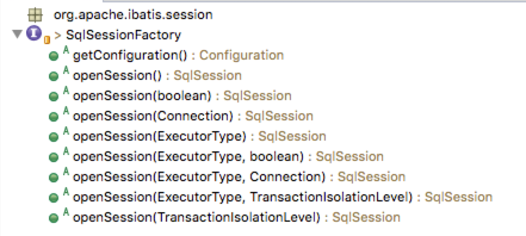

# 一、工厂模式的介绍
工厂模式专门负责**将大量有共同接口的类实例化**。工厂模式可以动态决定将哪一个类实例化，不必事先知道每次要实例化哪一个类。

工厂模式的几种形态：

1. 简单工厂（Simple Factory）模式，又称静态工厂方法模式（Static Factory Method Pattern）。

2. 工厂方法（Factory Method）模式，又称多态性工厂（Polymorphic Factory）模式或虚拟构造子（Virtual Constructor）模式；

3. 抽象工厂（Abstract Factory）模式，又称工具箱（Kit 或Toolkit）模式。

# 二、简单工厂模式

## //抽象产品角色
 ```java
public interface Car{
      public void drive();
}
```
## //具体产品角色
```java
public class Benz implements Car{
      public void drive() {
         System.out.println("Driving Benz ");
      }
}
public class Bmw implements Car{
      public void drive() {
       System.out.println("Driving Bmw ");
      }
}
```
## //工厂类角色
```java
public class Driver{
            //工厂方法.注意 返回类型为抽象产品角色
             public static Car driverCar(String s)throws Exception{
                   //判断逻辑，返回具体的产品角色给Client
                   if(s.equalsIgnoreCase("Benz"))
                        return new Benz();
                   else if(s.equalsIgnoreCase("Bmw"))
                            return new Bmw();
                     else throw new Exception();
           }
}
```

## 问题
那么大家看看这段简单工厂的例子，如果我现在问，这个会有什么问题，该如何回答呢？

提示一下，如果说来了一个需求，增加一个产品C，该如何办？

没错，简单工厂的问题就在于swich case（或者if else)。每当新增一种产品时，你都需要去维护工厂中的判断语句，造成的后果就是可能这个工厂类会非常非常长，各种判断全部挤在一起，给扩展和维护带来很多麻烦。

说白了，你的产品和工厂还是没有完全解耦，绑定在一起的。

所以，我们得到了第二个结论：**简单工厂通过构造时传入的标识来生产产品，不同产品都在同一个工厂中生产，这种判断会随着产品的增加而增加，给扩展和维护带来麻烦。** 那么，如何解决这个问题呢？


# 三、工厂方法模式

## //抽象产品 PenCore.java
```java
public abstract class PenCore{
String color;
public abstract void writeWord(String s);
}
```

## //具体产品 
RedPenCore.java
```java
public class RedPenCore extends PenCore {
 RedPenCore() {
  color = "红色";
 }
 public void writeWord(String s) {
  System.out.println("写出" + color + "的字" + s);
 }
}
```
BluePenCore.java
```java
public class BluePenCore extends PenCore {
 BluePenCore() {
  color = "蓝色";
 }
 public void writeWord(String s) {
  System.out.println("写出" + color + "的字" + s);
 }
}
```

BlackPenCore.java

```java
public class BlackPenCore extends PenCore {
 BlackPenCore() {
  color = "黑色";
 }
 public void writeWord(String s) {
  System.out.println("写出" + color + "的字" + s);
 }
}
```
## //抽象工厂 
BallPen.java
```java
public abstract class BallPen {
 BallPen(){
  System.out.println("生产一只装有"+getPenCore().color+"笔芯的圆珠笔");
 }
 public abstract PenCore getPenCore();
}
```
## //具体工厂
RedBallPen.java
```java
public class RedBallPen extends BallPen {
 public PenCore getPenCore() {
  return new RedPenCore();
 }
}
```
BlueBallPen.java

```java
public class BlueBallPen extends BallPen {
 public PenCore getPenCore() {
  return new BluePenCore();
 }
}
```

BlackBallPen.java

```java
public class BlackBallPen extends BallPen {
 public PenCore getPenCore() {
  return new BlackPenCore();
 }
}
```

## Test.java
```java
public static void main(String[] args){

     BallPen ballPen = new RedBallPen();//换一种BallPen时，只需更换生成的工厂即可。

     ballPen.getPenCore();

}
```
## 问题
仔细观察这段代码，在工厂模式中，已经将工厂类分开，不再将所有产品在同一工厂中生产，这样就解决了简单工厂中不停的switch case的问题。

如果说来了一个C产品，那么我们只需要写一个C工厂和C产品，在调用时用C工厂生产C产品即可，A和B工厂和产品完全不受影响。OK，优化说完了，但是还是有问题。

**问题在哪里呢？** 当业务需求是需要生产**产品族**的时候，工厂就不再适合了。

**首先我们搞清楚何谓产品族和产品等级结构。** 

举个例子来说，

比如三星是一个品牌，三星生产洗衣机，电视，冰箱；

格力也是一个品牌，格力也生产洗衣机，电视，冰箱。

那么，三星工厂和格力工厂生产的2个品牌的洗衣机，就在洗衣机这种产品的产品等级结构中（当然洗衣机产品等级结构中还有LG，海尔，三菱等等不同的品牌的工厂的产品），所以，洗衣机就是一个产品等级。那么三星生产的三星洗衣机，三星电视机，三星冰箱就是三星这个工厂的产品族。可能还会有西门子工厂产品族，格力工厂产品族，美的工厂产品族等等。

好了，搞清楚了产品等级结构和产品族，我们得到第三个结论：**工厂模式无法解决产品族和产品等级结构的问题**。

再回过头来看抽象工厂模式。如果如上所述，业务场景是需要实现不同的产品族，并且实现产品等级结构，就要用到抽象工厂模式了。

# 四、抽象工厂模式


## //抽象产品
UpperClothes.java

```java
public abstract class UpperClothes {
 public abstract int getChestSize();
 public abstract int getHeight();
 public abstract String getName();
}
```
Trousers.java
```java
public abstract class Trousers {
 public abstract int getWaistSize();
 public abstract int getHeight();
 public abstract String getName();
}
```
## //具体产品
WesternUpperClothes.java
```java
public class WesternUpperClothes extends UpperClothes {
 private int chestSize;
 private int height;
 private String name;
 WesternUpperClothes(String name,int chestSize,int height){
  this.name=name;
  this.chestSize=chestSize;
  this.height=height;
 }
 public int getChestSize() {
  return chestSize;
 }
 public int getHeight() {
  return height;
 }
 public String getName() {
  return name;
 }
}
```
CowboyUpperClothes.java
```java
public class CowboyUpperClothes extends UpperClothes {
 private int chestSize;
 private int height;
 private String name;
 CowboyUpperClothes(String name,int chestSize,int height){
  this.name=name;
  this.chestSize=chestSize;
  this.height=height;
 }
 public int getChestSize() {
  return chestSize;
 }
 public int getHeight() {
  return height;
 }
 public String getName () {
  return name;
 }
}
```
WesternTrousers.java
```java
public class WesternTrousers extends Trousers {
 private int waistSize;
 private int height;
 private String name;
 WesternTrousers(String name,int waistSize,int height){
  this.name=name;
  this.waistSize=waistSize;
  this.height=height;
 }
 public int getHeight() {
  return height;
 }
 public String getName() {
  return name;
 }
 public int getWaistSize() {
  return waistSize;
 }
}
```
CowboyTrousers.java
```java
public class CowboyTrousers extends Trousers {
 private int waistSize;
 private int height;
 private String name;
 CowboyTrousers(String name,int waistSize,int height){
  this.name=name;
  this.waistSize=waistSize;
  this.height=height;
 }
 public int getHeight() {
  return height;
 }
 public String getName() {
  return name;
 }
 public int getWaistSize() {
  return waistSize;
 }
}
```

## //抽象工厂

ClothesFactory.java
```java
public abstract class ClothesFactory {
 public abstract UpperClothes createUpperClothes(int chestSize,int height);
 public abstract Trousers createTrousers(int waistSize,int height);
}
```

## //具体工厂
BeijingClothesFactory.java
```java
public class BeijingClothesFactory extends ClothesFactory {
 public Trousers createTrousers(int waistSize, int height) {
  return new WesternTrousers("北京牌裤子",waistSize,height);
 }
 public UpperClothes createUpperClothes(int chestSize, int height) {
  return new WesternUpperClothes("北京牌上衣",chestSize,height);
 }
}
```

ShanghaiClothesFactory.java
```java
public class ShanghaiClothesFactory extends ClothesFactory {
 public Trousers createTrousers(int waistSize, int height) {
  return new WesternTrousers("上海牌裤子",waistSize,height);
 }
 public UpperClothes createUpperClothes(int chestSize, int height) {
  return new WesternUpperClothes("上海牌上衣",chestSize,height);
 }
}
```

## 结论

在工厂模式中，一个工厂生产一个产品，所有的具体产品是由同一个抽象产品派生的，不存在产品等级结构和产品族的概念；

而在抽象工厂中，同一个等级的产品是派生于一个抽象产品（即产品接口），一个抽象工厂派生不同的具体工厂，每个具体工厂生产自己的产品族（包含不同产品等级）。

所以我们得到第四个结论，

* 工厂模式中，一个工厂生产一个产品，所有产品派生于同一个抽象产品（或产品接口）；

* 而抽象工厂模式中，一个工厂生产多个产品，它们是一个产品族，不同的产品族的产品派生于不同的抽象产品（或产品接口）。

# 五. 总结

工厂模式实际上包含了3中设计模式，简单工厂，工厂和抽象工厂，关键点如下：

1. 三种工厂的实现是越来越复杂的

2. 简单工厂通过构造时传入的标识来生产产品，不同产品都在同一个工厂中生产，这种判断会随着产品的增加而增加，给扩展和维护带来麻烦


3. 工厂模式无法解决产品族和产品等级结构的问题,工厂模式抽象出一种产品，所有具体产品由同一个抽象产品派生，不存在产品等级机构和产品族的概念，有多个具体工厂，一个工厂生产一个产品。


4. 抽象工厂模式中，有多个具体工厂，一个工厂生产多个产品，它们是一个产品族，不同的产品族的产品派生于不同的抽象产品（或产品接口），有多个抽象产品对应多个具体产品。

# 六. 问题

1. 在上面的代码中，都使用了接口来表达抽象工厂或者抽象产品，那么可以用抽象类吗？有何区别？

从功能上说，完全可以，甚至可以用接口来定义行为，用抽象类来抽象属性。抽象类更加偏向于属性的抽象，而用接口更加偏向行为的规范与统一。使用接口有更好的可扩展性和可维护性，更加灵活实现松散耦合，所以编程原则中有一条是针对接口编程而不是针对类编程。

2. 到底何时应该用工厂模式

根据具体业务需求。不要认为简单工厂是用switch case就觉得一无是处，也不要觉得抽象工厂比较高大上就到处套。我们使用设计模式是为了解决问题而不是炫技，所以根据三种工厂模式的特质，以及对未来扩展的预期，来确定使用哪种工厂模式。

3.说说你在项目中工厂模式的应用

如果你看了这篇文章，被问到这个问题时，还傻乎乎的去举数据库连接的例子，是要被打板子的。。。比如我之前做过一个旅游产品的B2B网站，根据不同类型的业务形态，产品也是不同的，有国内跟团，出境跟团，国内自由行，出境自由行，邮轮五种产品，并且后面可能还会有门票，酒店，机票等等产品，其中有些联系也有些区别。


# 七. Mybatis中的工厂模式
在Mybatis中比如SqlSessionFactory使用的是工厂模式，该工厂没有那么复杂的逻辑，是一个简单工厂模式。

SqlSession可以认为是一个Mybatis工作的核心接口，通过这个接口可以执行SQL语句、获取Mappers、管理事务。类似于连接MySQL的Connection对象。


可以看到，该Factory的openSession方法重载了很多个，分别支持autoCommit、Executor、Transaction等参数的输入，来构建核心的SqlSession对象。

在DefaultSqlSessionFactory的默认工厂实现里，有一个方法可以看出工厂怎么产出一个产品：

```java
private SqlSession openSessionFromDataSource(ExecutorType execType, TransactionIsolationLevel level,
			boolean autoCommit) {
		Transaction tx = null;
		try {
			final Environment environment = configuration.getEnvironment();
			final TransactionFactory transactionFactory = getTransactionFactoryFromEnvironment(environment);
			tx = transactionFactory.newTransaction(environment.getDataSource(), level, autoCommit);
			final Executor executor = configuration.newExecutor(tx, execType);
			return new DefaultSqlSession(configuration, executor, autoCommit);
		} catch (Exception e) {
			closeTransaction(tx); // may have fetched a connection so lets call
									// close()
			throw ExceptionFactory.wrapException("Error opening session.  Cause: " + e, e);
		} finally {
			ErrorContext.instance().reset();
		}
	}

```
这是一个`openSession`调用的底层方法，该方法先从`configuration`读取对应的环境配置，然后初始化`TransactionFactory`获得一个`Transaction`对象，然后通过`Transaction`获取一个`Executor`对象，最后通过`configuration`、`Executor`、是否`autoCommit`三个参数构建了`SqlSession`。

在这里其实也可以看到端倪，SqlSession的执行，其实是委托给对应的Executor来进行的。

而对于LogFactory，它的实现代码：
```java
public final class LogFactory {
	private static Constructor<? extends Log> logConstructor;
 
	private LogFactory() {
		// disable construction
	}
 
	public static Log getLog(Class<?> aClass) {
		return getLog(aClass.getName());
	}

```
这里有个特别的地方，是Log变量的的类型是Constructor<? extends Log>，也就是说该工厂生产的不只是一个产品，而是具有Log公共接口的一系列产品，比如Log4jImpl、Slf4jImpl等很多具体的Log。