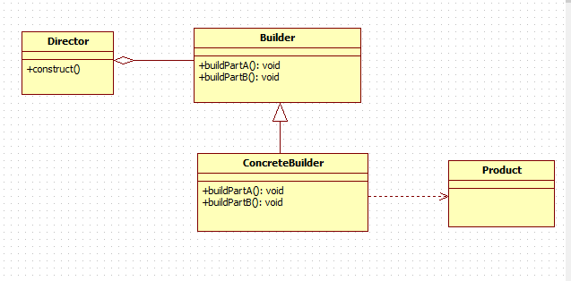
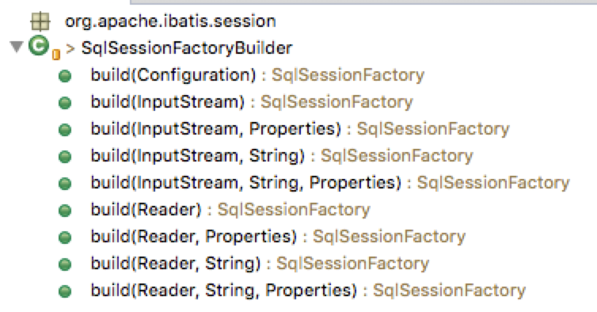

# 一. 简介
建造者模式是日常开发中比较常见的设计模式，它的主要作用就是将复杂事物创建的过程抽象出来，该抽象的不同实现方式不同，创建出的对象也不同。

建造者模式分为两种，

* 一种为经典建造者模式，

* 另一种为变种建造者模式。

# 二. 经典Builder模式
我们先来看下经典Builder模式，先上UML类图：


从上图可以看到，经典Buider模式中有四个角色：

1. 要建造的产品Product -- 组装的电脑

2. 抽象的Builder -- 装CPU、内存条、硬盘等抽象的步骤

3. Builder的具体实现ConcreteBuilder -- 对上述抽象步骤的实现，比如装i5CPU、8G内存条、1T硬盘

4. 使用者Director -- 电脑装机人员

接下来我们来看下用代码如何实现上述组装电脑的过程：（假设组装电脑只需要CPU和内存，仅作示意）

1. 首先我们先来创建一个Computer类：

```java
public class Computer {
    /*CPU*/
    private String CPU;
    /*内存*/
    
    public String getCPU() {
        return CPU;
    }

    public void setCPU(String CPU) {
        this.CPU = CPU;
    }

    public String getMemory() {
        return memory;
    }

    public void setMemory(String memory) {
        this.memory = memory;
    }
    
    @Override
    public String toString() {
        return "Computer{" +
                "CPU='" + CPU + '\'' +
                ", memory='" + memory + '\'' +
               '}';
    }
}
```
2. 接下来我们来创建一个抽象的电脑组装过程的Builder类：
```java
public interface ComputerConfigBuilder {
    void setCPU();
    void setMemery();
    Computer getComputer();
}
```
这里把这一电脑安装过程给抽象出来，也就是这里的ComputerConfigBuilder。

3.好了，有了抽象的组装过程，接下来我们就需要创建具体的实现类。接下我们首先来创建一个低配版的套餐LowConfigBuilder ，让其实现ComputerConfigBuilder：

```java
public class LowConfigBuilder implements ComputerConfigBuilder {

    private Computer mComputer;

    public LowConfigBuilder(){
        this.mComputer = new Computer();
    }

    @Override
    public void setCPU() {
        mComputer.setCPU("i5");
    }

    @Override
    public void setMemery() {
        mComputer.setMemory("8G");
    }

    @Override
    public Computer getComputer() {
        return mComputer;
    }
}
```

接着我们再创建一个高配版的套餐：

```java
public class HighConfigBuider implements ComputerConfigBuilder {

    private Computer mComputer;

    public HighConfigBuider(){
        this.mComputer = new Computer();
    }

    @Override
    public void setCPU() {
        mComputer.setCPU("i7");
    }

    @Override
    public void setMemery() {
        mComputer.setMemory("16G");
    }

    @Override
    public Computer getComputer() {
        return mComputer;
    }
}
```
4. 上面我们已经定义好了两种配置方案，接下我们还需要一名装机人员Director：
```java
public class Director {
    private ComputerConfigBuilder mBuilder;
    public void setBuilder(ComputerConfigBuilder builder){
        this.mBuilder = builder;
    }
    public void createComputer(){
        mBuilder.setCPU();
        mBuilder.setMemery();
    }
    public Computer getComputer(){
        return mBuilder.getComputer();
    }
}
```
5.演示
```java
Director director = new Director();//创建装机人员
director.setBuilder(new LowConfigBuilder()); //告诉装机人员电脑配置，这里为低配版
director.createComputer(); //装机人员开始组装
Computer computer = director.getComputer(); //从装机人员获取组装好的电脑
System.out.print("电脑配置：" + computer.toString());  //查看电脑配置
```
输出结果：
电脑配置：Computer{CPU='i5', memory='8G'}

# 三. 变种Builder模式
在我们日常开发中经典Builder模式一般不常用，用的比较多的还是变种的Builder模式，接下来我们来看下变种的Builder模式。

主要用于在创建一个对象时候，对必须属性和非必须属性进行一些限制。

> 需要创建一个**不可变**的Person对象，这个Person可以拥有以下几个属性：名字、性别、年龄。其中名字和性别是必须有的。

## 构造方法创建Person对象
```java
public class Person {
    /*名字（必须）*/
    private final String name;
    /*性别（必须）*/
    private final String gender;
    /*年龄（非必须）*/
    private final String age;

    public Person(String name,String gender,String age){
        this.name = name;
        this.gender = gender;
        this.age = age;
    }

    public Person(String name, String gender){
        this(name,gender,null);
    }
}
```

由于要创建出的Person对象是不可变的，所以类中的属性都声明为final的，然后定义了一个参数为所有属性的构造方法，又因为name和gender为必须项，所以你为了调用者方便又单独定义了一个参数为name和gender的构造方法。这样Person类就好了.

如果需要传入非必须属性的时候，这个构造方法调用起来不是很方便，因为这个构造方法参数太多了，很容易传错。于是用set方法设置：

## set方法创建Person对象
```java
public class Person {
    /*名字（必须）*/
    private String name;
    /*性别（必须）*/
    private String gender;
    /*年龄（非必须）*/
    private String age;
    

    public String getName() {
        return name;
    }

    public void setName(String name) {
        this.name = name;
    }

    public String getGender() {
        return gender;
    }

    public void setGender(String gender) {
        this.gender = gender;
    }

    public String getAge() {
        return age;
    }

    public void setAge(String age) {
        this.age = age;
    }
}
```
如果要创建对象的话只用如下操作就行了：
```java
Person person = new Person();
person.setName("张三");
person.setAge("22");
person.setGender("男");
```
## Builder模式创建Person对象
但是使用set无法保证不可变的需求，如果掉了一条，就会导致得到一个不完整的Person对象。**可以使用变种的Builder模式**：
```java
public class Person {
    /*名字（必须）*/
    private final String name;
    /*性别（必须）*/
    private final String gender;
    /*年龄（非必须）*/
    private final String age;
  
    private Person(Builder builder) {
        this.name = builder.name;
        this.gender = builder.gender;
        this.age = builder.age;
    }

    public static class Builder {
        private final String name;
        private final String gender;
        private String age;
      
        public Builder(String name,String gender) {
            this.name = name;
            this.gender = gender;
        }

        public Builder age(String age) {
            this.age = age;
            return this;
        }
        
        public Person build(){
            return new Person(this);
        }
    }
```
可以看到变种的builder模式包括以下内容：

1 一个静态内部类，静态内部类的参数和构建类一样。

2 外部类只提供get方法方便查看，静态内部类提供set方法，赋值操作。

3 静态内部类提供的setter操作,返回值是当前Builder本身，这样是为了链式赋值。

4 外部类的构造参数是静态内部类，使用静态内部类的变量赋值给外部类。

5 最终提供builder返回外部类

接下来我们来看下Person的创建：
```java
Person person = new Person.Builder("张三","男")
        .age("12")
        .build();
```

这种builder模式跟传统的builder模式确实是不太一样。但其实本质还是一样的，我们可以一一对应：

* 产品(Product)角色:：也就是创建一个类，声明其成员变量，相当与person类。

* 抽象建造者角色：相当于静态内部类，复制产品定义的属性到静态内部类中，同时生成set方法。

* 具体的建造者：也就是外部类提供的构造函数，将静态内部类的变量值赋值给外部类。

* 使用者Director：静态内部类中的builder方法。

# 四. Mybatis中的Builder模式
在Mybatis环境的初始化过程中，`SqlSessionFactoryBuilder`会调用`XMLConfigBuilder`读取所有的`MybatisMapConfig.xml`和所有的`*Mapper.xml`文件，构建Mybatis运行的核心对象`Configuration`对象，然后将该`Configuration`对象作为参数构建一个`SqlSessionFactory`对象。

其中`XMLConfigBuilder`在构建`Configuration`对象时，也会调用`XMLMapperBuilder`用于读取`*Mapper`文件，而`XMLMapperBuilder`会使用`XMLStatementBuilder`来读取和build所有的SQL语句。

在这个过程中，有一个相似的特点，就是这些Builder会读取文件或者配置，然后做大量的XpathParser解析、配置或语法的解析、反射生成对象、存入结果缓存等步骤，这么多的工作都不是一个构造函数所能包括的，因此大量采用了Builder模式来解决。
对于builder的具体类，方法都大都用`build*`开头，比如`SqlSessionFactoryBuilder`为例，它包含以下方法：

即根据不同的输入参数来构建SqlSessionFactory这个工厂对象。
