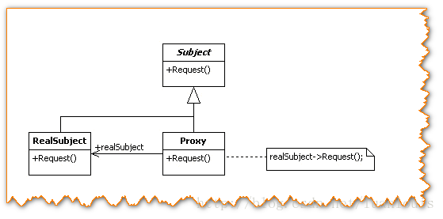
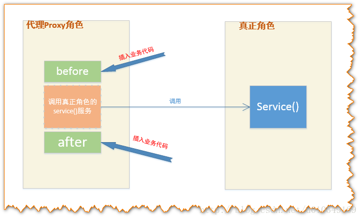
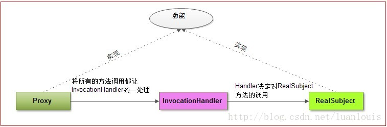
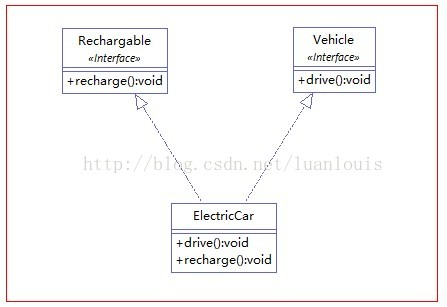
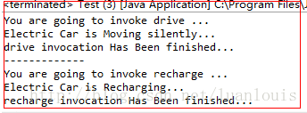

[TOC]
# 一. 简介
代理模式也叫委托模式。

代理模式定义：对其他对象提供一种代理从而控制对这个对象的访问。就是，代理类 代理 被代理类，来执行被代理类里的方法。
一般情况下，代理模式化有三个角色。
1. 抽象的主题类(或者接口) IGamePlayer

2. 代理类。

3. 被代理类。

代理模式中，用的最广泛的，用的最多的是**动态代理模式**。

## 为什么说“jdk动态代理局限于接口是因为java只支持单继承"
jdk动态代理之所以只能代理接口是因为代理类本身已经extends了Proxy，而java是不允许多重继承的，但是允许实现多个接口，因此才有cglib的需要吧

# 二. 原理

代理的基本构成：
代理模式上，基本上有Subject角色，RealSubject角色，Proxy角色。其中：

* Subject角色负责定义RealSubject和Proxy角色应该实现的接口；

* RealSubject角色用来真正完成业务服务功能；

* Proxy角色负责将自身的Request请求，调用RealSubject对应的request功能来实现业务功能，自己不真正做业务。




上面的这幅代理结构图是典型的静态的代理模式：

当在代码阶段规定这种代理关系，Proxy类通过编译器编译成class文件，当系统运行时，此class已经存在了。

这种静态的代理模式固然在访问无法访问的资源，增强现有的接口业务功能方面有很大的优点，

但是大量使用这种静态代理，会使我们系统内的类的规模增大，并且不易维护；

并且由于Proxy和RealSubject的功能本质上是相同的，Proxy只是起到了中介的作用，这种代理在系统中的存在，导致系统结构比较臃肿和松散。


## InvocationHandler角色的由来

为了解决这个问题，就有了动态地创建Proxy的想法：在运行状态中，需要代理的地方，根据Subject 和RealSubject，动态地创建一个Proxy，用完之后，就会销毁，这样就可以避免了Proxy 角色的class在系统中冗杂的问题了。

仔细思考代理模式中的代理Proxy角色。Proxy角色在执行代理业务的时候，无非是在调用真正业务之前或者之后做一些“额外”业务。

有上图可以看出，代理类处理的逻辑很简单：在调用某个方法前及方法后做一些额外的业务。换一种思路就是：在触发（invoke）真实角色的方法之前或者之后做一些额外的业务。那么，为了构造出具有通用性和简单性的代理类，可以将所有的触发真实角色动作交给一个触发的管理器，让这个管理器统一地管理触发。这种管理器就是`InvocationHandler`。

动态代理模式的结构跟上面的静态代理模式稍微有所不同，多引入了一个`InvocationHandler`角色。

先解释一下InvocationHandler的作用：

* 在静态代理中，代理Proxy中的方法，都指定了调用了特定的realSubject中的对应的方法：

* 在上面的静态代理模式下，Proxy所做的事情，无非是调用在不同的request时，调用触发realSubject对应的方法；更抽象点看，Proxy所作的事情；在Java中 方法（Method）也是作为一个对象来看待了，

* 动态代理工作的基本模式就是将自己的方法功能的实现交给 InvocationHandler角色，外界对Proxy角色中的每一个方法的调用，Proxy角色都会交给InvocationHandler来处理，而InvocationHandler则调用具体对象角色的方法。如下图所示：



在这种模式之中：代理Proxy 和RealSubject 应该实现相同的功能，这一点相当重要。（我这里说的功能，可以理解为某个类的public方法）

在面向对象的编程之中，如果我们想要约定Proxy 和RealSubject可以实现相同的功能，有两种方式：

1. 一个比较直观的方式，就是定义一个功能接口，然后让Proxy 和RealSubject来实现这个接口。

2. 还有比较隐晦的方式，就是通过继承。因为如果Proxy 继承自RealSubject，这样Proxy则拥有了RealSubject的功能，Proxy还可以通过重写RealSubject中的方法，来实现多态。


## 1. JDK的动态代理创建机制----通过接口
比如现在想为RealSubject这个类创建一个动态代理对象，JDK主要会做以下工作：

1.   获取`RealSubject`上的所有接口列表；

2.   确定要生成的代理类的类名，默认为：`com.sun.proxy.$ProxyXXXX` ；

3.   根据需要实现的接口信息，在代码中动态创建 该Proxy类的字节码；

4.  将对应的字节码转换为对应的class 对象；

5.   创建`InvocationHandler`实例handler，用来处理Proxy所有方法调用；

6.   Proxy 的class对象 以创建的handler对象为参数，实例化一个proxy对象.


### 实现步骤：

1. JDK通过`java.lang.reflect.Proxy`包来支持动态代理，一般情况下，我们使用下面的`newProxyInstance`方法
```java
// 返回一个指定接口的代理类实例，该接口可以将方法调用指派到指定的调用处理程序。
static Object newProxyInstance(ClassLoader loader,Class<?>[] interfaces,InvocationHandler h)
```

2. 而对于`InvocationHandler`，我们需要实现下列的`invoke`方法：

    在调用代理对象中的每一个方法时，在代码内部，都是直接调用了`InvocationHandler` 的`invoke`方法，而invoke方法根据代理类传递给自己的method参数来区分是什么方法。
```java
//在代理实例上处理方法调用并返回结果。
Object	invoke(Object proxy,Method method,Object[] args)
```

### 示例：
现在定义两个接口Vehicle和Rechargable，
* Vehicle表示交通工具类，有drive()方法；
* Rechargable接口表示可充电的，有recharge() 方法；

定义一个实现两个接口的类ElectricCar，类图如下：


#### 接口
```java
package com.foo.proxy;
/**
 * 交通工具接口
 * @author louluan
 */
public interface Vehicle {
	public void drive();
}

package com.foo.proxy;
/**
 * 可充电设备接口
 * @author louluan
 */
public interface Rechargable {
 
	public void recharge();
}
```

#### 需要被代理的类
```java
package com.foo.proxy;
/**
 * 电能车类，实现Rechargable，Vehicle接口
 * @author louluan
 */
public class ElectricCar implements Rechargable, Vehicle {
 
	@Override
	public void drive() {
		System.out.println("Electric Car is Moving silently...");
	}
 
	@Override
	public void recharge() {
		System.out.println("Electric Car is Recharging...");
	}
 
}
```

#### 代理类
```java
package com.foo.proxy;
 
import java.lang.reflect.InvocationHandler;
import java.lang.reflect.Method;
 
public class InvocationHandlerImpl implements InvocationHandler {
 
	private ElectricCar car;
	
	public InvocationHandlerImpl(ElectricCar car)
	{
		this.car=car;
	}
	
	@Override
	public Object invoke(Object paramObject, Method paramMethod,
			Object[] paramArrayOfObject) throws Throwable {
		System.out.println("You are going to invoke "+paramMethod.getName()+" ...");
		paramMethod.invoke(car, null);
		System.out.println(paramMethod.getName()+" invocation Has Been finished...");
		return null;
	}
 
}
```

#### 测试类
```java
package com.foo.proxy;
 
import java.lang.reflect.InvocationHandler;
import java.lang.reflect.Proxy;
 
public class Test {
 
	public static void main(String[] args) {
 
		ElectricCar car = new ElectricCar();
		// 1.获取对应的ClassLoader
		ClassLoader classLoader = car.getClass().getClassLoader();
 
		// 2.获取ElectricCar 所实现的所有接口
		Class[] interfaces = car.getClass().getInterfaces();
		// 3.设置一个来自代理传过来的方法调用请求处理器，处理所有的代理对象上的方法调用
		InvocationHandler handler = new InvocationHandlerImpl(car);
		/*
		  4.根据上面提供的信息，创建代理对象 在这个过程中， 
                         a.JDK会通过根据传入的参数信息动态地在内存中创建和.class 文件等同的字节码
		         b.然后根据相应的字节码转换成对应的class， 
                         c.然后调用newInstance()创建实例
		 */
		Object o = Proxy.newProxyInstance(classLoader, interfaces, handler);
		Vehicle vehicle = (Vehicle) o;
		vehicle.drive();
		Rechargable rechargeable = (Rechargable) o;
		rechargeable.recharge();
	}
}
```

来看一下代码执行后的结果：


### 将生成的动态代理类的字节码保存到硬盘，并反编译看代理类

JDK提供了`sun.misc.ProxyGenerator.generateProxyClass(String proxyName,class[] interfaces) `底层方法来产生动态代理类的字节码：
```java
package com.foo.proxy;
 
import java.io.FileOutputStream;
import java.io.IOException;
import java.lang.reflect.Proxy;
import sun.misc.ProxyGenerator;
 
public class ProxyUtils {
 
	/*
	 * 将根据类信息 动态生成代理类的二进制字节码保存到硬盘中，
	 * 默认的是clazz目录下
         * params :clazz 需要生成动态代理类的类
         * proxyName : 为动态生成的代理类的名称
         */
	public static void generateClassFile(Class clazz,String proxyName)
	{
		//根据类信息和提供的代理类名称，生成字节码
                byte[] classFile = ProxyGenerator.generateProxyClass(proxyName, clazz.getInterfaces()); 
		String paths = clazz.getResource(".").getPath();
		System.out.println(paths);
		FileOutputStream out = null;  
        
        try {
            //保留到硬盘中
            out = new FileOutputStream(paths+proxyName+".class");  
            out.write(classFile);  
            out.flush();  
        } catch (Exception e) {  
            e.printStackTrace();  
        } finally {  
            try {  
                out.close();  
            } catch (IOException e) {  
                e.printStackTrace();  
            }  
        }  
	}
	
}
```

将生成的代理类起名为“ElectricCarProxy”，调用该方法：
```java
ProxyUtils.generateClassFile(car.getClass(), "ElectricCarProxy");
```
这样将在ElectricCar.class 同级目录下产生 ElectricCarProxy.class文件。用反编译工具如jd-gui.exe 打开，将会看到以下信息：
```java
import com.foo.proxy.Rechargable;
import com.foo.proxy.Vehicle;
import java.lang.reflect.InvocationHandler;
import java.lang.reflect.Method;
import java.lang.reflect.Proxy;
import java.lang.reflect.UndeclaredThrowableException;
/**
 生成的动态代理类的组织模式是继承Proxy类，然后实现需要实现代理的类上的所有接口，而在实现的过程中，则是通过将所有的方法都交给了InvocationHandler来处理
*/
 public final class ElectricCarProxy extends Proxy
  implements Rechargable, Vehicle
{
  private static Method m1;
  private static Method m3;
  private static Method m4;
  private static Method m0;
  private static Method m2;
 
  public ElectricCarProxy(InvocationHandler paramInvocationHandler)
    throws 
  {
    super(paramInvocationHandler);
  }
 
  public final boolean equals(Object paramObject)
    throws 
  {
    try
    { // 方法功能实现交给InvocationHandler处理
      return ((Boolean)this.h.invoke(this, m1, new Object[] { paramObject })).booleanValue();
    }
    catch (Error|RuntimeException localError)
    {
      throw localError;
    }
    catch (Throwable localThrowable)
    {
      throw new UndeclaredThrowableException(localThrowable);
    }
  }
 
  public final void recharge()
    throws 
  {
    try
    {
 
       // 方法功能实现交给InvocationHandler处理
 
      this.h.invoke(this, m3, null);
      return;
    }
    catch (Error|RuntimeException localError)
    {
      throw localError;
    }
    catch (Throwable localThrowable)
    {
      throw new UndeclaredThrowableException(localThrowable);
    }
  }
 
  public final void drive()
    throws 
  {
    try
    {
 
       // 方法功能实现交给InvocationHandler处理
 
      this.h.invoke(this, m4, null);
      return;
    }
    catch (Error|RuntimeException localError)
    {
      throw localError;
    }
    catch (Throwable localThrowable)
    {
      throw new UndeclaredThrowableException(localThrowable);
    }
  }
 
  public final int hashCode()
    throws 
  {
    try
    {
 
       // 方法功能实现交给InvocationHandler处理
 
       return ((Integer)this.h.invoke(this, m0, null)).intValue();
    }
    catch (Error|RuntimeException localError)
    {
      throw localError;
    }
    catch (Throwable localThrowable)
    {
      throw new UndeclaredThrowableException(localThrowable);
    }
  }
 
  public final String toString()
    throws 
  {
    try
    {
      // 方法功能实现交给InvocationHandler处理
      return (String)this.h.invoke(this, m2, null);
    }
    catch (Error|RuntimeException localError)
    {
      throw localError;
    }
    catch (Throwable localThrowable)
    {
      throw new UndeclaredThrowableException(localThrowable);
    }
  }
 
  static
  {
    try
    {  //创建方法对象，当调用相应的方法时，分别将方法对象作为参数传递给InvocationHandler处理
      m1 = Class.forName("java.lang.Object").getMethod("equals", new Class[] { Class.forName("java.lang.Object") });
      m3 = Class.forName("com.foo.proxy.Rechargable").getMethod("recharge", new Class[0]);
      m4 = Class.forName("com.foo.proxy.Vehicle").getMethod("drive", new Class[0]);
      m0 = Class.forName("java.lang.Object").getMethod("hashCode", new Class[0]);
      m2 = Class.forName("java.lang.Object").getMethod("toString", new Class[0]);
      return;
    }
    catch (NoSuchMethodException localNoSuchMethodException)
    {
      throw new NoSuchMethodError(localNoSuchMethodException.getMessage());
    }
    catch (ClassNotFoundException localClassNotFoundException)
    {
      throw new NoClassDefFoundError(localClassNotFoundException.getMessage());
    }
  }
}
```

仔细观察可以看出生成的动态代理类有以下特点:
1.继承自 java.lang.reflect.Proxy，实现了 Rechargable,Vehicle 这两个ElectricCar实现的接口；

2.类中的所有方法都是final 的；

3.所有的方法功能的实现都统一调用了InvocationHandler的invoke()方法。**这也是该代理类为什么要集成Proxy类的原因，Proxy类中有InvocationHandler的实例h。**


## 2. cglib 生成动态代理类的机制----通过类继承
JDK中提供的生成动态代理类的机制有个鲜明的特点是： 某个类必须有实现的接口，而生成的代理类也只能代理某个类接口定义的方法，比如：如果上面例子的ElectricCar实现了继承自两个接口的方法外，另外实现了方法bee() ,则在产生的动态代理类中不会有这个方法了！更极端的情况是：如果某个类没有实现接口，那么这个类就不能用JDK产生动态代理了！

幸好我们有cglib。“CGLIB（Code Generation Library），是一个强大的，高性能，高质量的Code生成类库，它可以在运行期扩展Java类与实现Java接口。”

CGLib采用底层的字节码技术，全称是：Code Generation Library，CGLib可以为一个类创建一个子类，在子类中采用方法拦截的技术拦截所有父类方法的调用并顺势织入横切逻辑。

**cglib 创建某个类A的动态代理类的模式是：**

1. 查找A上的所有非final 的public类型的方法定义；

2. 将这些方法的定义转换成字节码；

3. 将组成的字节码转换成相应的代理的class对象；

4. 实现 MethodInterceptor接口，用来处理 对代理类上所有方法的请求（这个接口和JDK动态代理InvocationHandler的功能和角色是一样的）

###  需要被代理的类
```java
package samples;
/**
 * 程序猿类
 * @author louluan
 */
public class Programmer {
 
	public void code()
	{
		System.out.println("I'm a Programmer,Just Coding.....");
	}
}
```

### 代理类
```java
package samples;
 
import java.lang.reflect.Method;
 
import net.sf.cglib.proxy.MethodInterceptor;
import net.sf.cglib.proxy.MethodProxy;
/*
 * 实现了方法拦截器接口
 */
public class Hacker implements MethodInterceptor {
	@Override
	public Object intercept(Object obj, Method method, Object[] args,
			MethodProxy proxy) throws Throwable {
		System.out.println("**** I am a hacker,Let's see what the poor programmer is doing Now...");
		proxy.invokeSuper(obj, args);
		System.out.println("****  Oh,what a poor programmer.....");
		return null;
	}
 
}
```
### 测试类
```java
package samples;
 
import net.sf.cglib.proxy.Enhancer;
 
public class Test {
 
	public static void main(String[] args) {
		Programmer progammer = new Programmer();
		
		Hacker hacker = new Hacker();
		//cglib 中加强器，用来创建动态代理
		Enhancer enhancer = new Enhancer();  
                 //设置要创建动态代理的类
		enhancer.setSuperclass(progammer.getClass());  
               // 设置回调，这里相当于是对于代理类上所有方法的调用，都会调用CallBack，而Callback则需要实行intercept()方法进行拦截
                enhancer.setCallback(hacker);
                Programmer proxy =(Programmer)enhancer.create();
                proxy.code();
        
	}
}
```
程序执行结果：


### 让我们看看通过cglib生成的class文件内容：
```java
package samples;
 
import java.lang.reflect.Method;
import net.sf.cglib.core.ReflectUtils;
import net.sf.cglib.core.Signature;
import net.sf.cglib.proxy.Callback;
import net.sf.cglib.proxy.Factory;
import net.sf.cglib.proxy.MethodInterceptor;
import net.sf.cglib.proxy.MethodProxy;
 
public class Programmer$$EnhancerByCGLIB$$fa7aa2cd extends Programmer
  implements Factory
{
   //......省略
  private MethodInterceptor CGLIB$CALLBACK_0;  // Enchaner传入的methodInterceptor
   // ....省略
  public final void code()
  {
    MethodInterceptor tmp4_1 = this.CGLIB$CALLBACK_0;//为代理类Hacker
    if (tmp4_1 == null)
    {
      tmp4_1;
      CGLIB$BIND_CALLBACKS(this);//若callback 不为空，则调用methodInterceptor 的intercept()方法
    }
    if (this.CGLIB$CALLBACK_0 != null)
      return;
      //如果没有设置callback回调函数，则默认执行父类的方法
      super.code();
  }
   //....后续省略
}
```


## 3.对比

两者对比：

* JDK动态代理是面向接口的。

* CGLib动态代理是通过字节码底层继承要代理类来实现（如果被代理类被final关键字所修饰，那么会失败）。


在JDK1.8以上，性能差别不大，区别主要还是使用的场景不同。接口与类的区别


# 三. Mybatis中的代理模式
当我们使用`Configuration`的`getMapper`方法时，会调用`mapperRegistry.getMapper`方法，而该方法又会调用`mapperProxyFactory.newInstance(sqlSession)`来生成一个具体的代理：
```java
/**
 * @author Lasse Voss
 */
public class MapperProxyFactory<T> {
 
	private final Class<T> mapperInterface;
	private final Map<Method, MapperMethod> methodCache = new ConcurrentHashMap<Method, MapperMethod>();
 
	public MapperProxyFactory(Class<T> mapperInterface) {
		this.mapperInterface = mapperInterface;
	}
 
	public Class<T> getMapperInterface() {
		return mapperInterface;
	}
 
	public Map<Method, MapperMethod> getMethodCache() {
		return methodCache;
	}
 
	@SuppressWarnings("unchecked")
	protected T newInstance(MapperProxy<T> mapperProxy) {
		return (T) Proxy.newProxyInstance(mapperInterface.getClassLoader(), new Class[] { mapperInterface },mapperProxy);
	}
 
	public T newInstance(SqlSession sqlSession) {
		final MapperProxy<T> mapperProxy = new MapperProxy<T>(sqlSession, mapperInterface, methodCache);
		return newInstance(mapperProxy);
	}
 
}

```

在这里，先通过`T newInstance(SqlSession sqlSession)`方法会得到一个`MapperProxy`对象，然后调用`T newInstance(MapperProxy mapperProxy)`生成代理对象然后返回。
而查看MapperProxy的代码，可以看到如下内容：
```java
public class MapperProxy<T> implements InvocationHandler, Serializable {
 
	@Override
	public Object invoke(Object proxy, Method method, Object[] args) throws Throwable {
		try {
			if (Object.class.equals(method.getDeclaringClass())) {
				return method.invoke(this, args);
			} else if (isDefaultMethod(method)) {
				return invokeDefaultMethod(proxy, method, args);
			}
		} catch (Throwable t) {
			throw ExceptionUtil.unwrapThrowable(t);
		}
		final MapperMethod mapperMethod = cachedMapperMethod(method);
		return mapperMethod.execute(sqlSession, args);
	}

```

非常典型的，该`MapperProxy`类实现了`InvocationHandler`接口，并且实现了该接口的invoke方法。

通过这种方式，我们只需要编写Mapper.java接口类，当真正执行一个Mapper接口的时候，就会转发给`MapperProxy.invoke`方法，而该方法则会调用后续的`sqlSession.cud --> executor.execute --> prepareStatement`等一系列方法，完成SQL的执行和返回。

