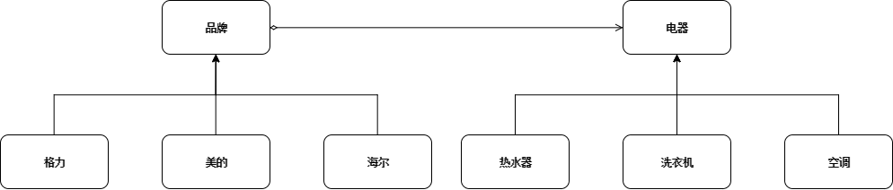

# 一. 定义
将抽象部分与它的实现部分分离，使它们都可以独立地变化。
# 二. 优缺点
## 优点：
1. 抽象和实现的分离。

2. 优秀的扩展能力。

3. 实现细节对客户透明。

## 缺点：
1. 增加了系统的理解和设计难度，由于聚合关联关系建立在抽象层，要求开发者针对抽象进行设计和编程。

2. 要求正确识别出系统中两个独立变化的维度，因此其使用范围有一定的局限性。

# 三. 使用场景

1.一个类存在两个独立变化的维度，且这两个维度都需要进行扩展；

2.对于那些不希望使用继承或因为多层次继承导致系统类的个数急剧增加的系统，桥接模式尤为适用。

# 四. 示例
桥接模式有以下几种角色：

* **抽象角色(Abstraction)** ： 抽象的定义，并保存一个Implementor对象的引用。

* **扩展抽象角色(RefineAbstraction)** ： 拓展Abstraction。

* **抽象实现角色(Implementor)** ： 定义实现类的接口，提供基本操作，其实现交给子类实现。

* **具体实现角色(ConcreteImplementor)** ： 实现Implementor接口，在程序运行时，子类对象将替换其父类对象，提供给Abstraction具体的业务操作方法。

示例：家电电器有很多种，也有很多品牌，电器和品牌存在关系。

如图所示，

* 如果按照这样的设计，每增加一种电器就需要对应的绑定品牌；

* 另一种情况是，每增加一个品牌就需要在对应的电器下添加。

这样的话会导致出现许多重复性的代码，而且耦合度也很高。

如果添加新的品牌或者新的电器而不会改动先有的类，该怎么设计呢？根据桥接模式，代码可以设计成下图的流程


 * 这样我现在如果想要增加一个机器，比如烤箱，那么只有增加这个类就可以了，不会影响到其他任何类，类的个数增加也只是一个；

 * 如果是要增加S品牌，只需要增加一个品牌的子类就可以了，个数也是一个，不会影响到其他类。这显然符合开放-封闭原则。

而这里用到的合成/聚合复用原则是一个很有用处的原则，即优先使用对象的合成或聚合，而不是继承。**究其原因是因为继承是一种强耦合的结构，父类变，子类就必须变。**

ElectricAppliance接口：
```java
public interface ElectricAppliance {
    String description();
}
```
AirConditioner类、WashingMachine类、WaterHeater类：
```java
public class AirConditioner implements ElectricAppliance {

    private final String name = "空调";

    @Override
    public String description() {
        return name;
    }
}

public class WashingMachine implements ElectricAppliance {

    private final String name = "洗衣机";

    @Override
    public String description() {
        return name;
    }
}

public class WaterHeater implements ElectricAppliance {

    private final String name = "热水器";

    @Override
    public String description() {
        return name;
    }
}
```
Brand抽象类：
```java
public abstract class Brand {

    protected ElectricAppliance electricAppliance;

    public Brand(ElectricAppliance electricAppliance) {
        this.electricAppliance = electricAppliance;
    }

    abstract String description();
}
```
Gree类、Haier类、Midea类：
```java
public class Gree extends Brand {

    private final  String name = "格力";

    public Gree(ElectricAppliance electricAppliance) {
        super(electricAppliance);
    }

    @Override
    public String description() {
        return name + electricAppliance.description();
    }
}

public class Haier extends Brand{

    private final  String name = "海尔";

    public Haier(ElectricAppliance electricAppliance) {
        super(electricAppliance);
    }

    @Override
    public String description() {
        return name + electricAppliance.description();
    }
}

public class Midea extends Brand{

    private final  String name = "美的";

    public Midea(ElectricAppliance electricAppliance) {
        super(electricAppliance);
    }

    @Override
    public String description() {
        return name + electricAppliance.description();
    }
}
```
测试类:
```java
public class Test {
    public static void main(String[] args) {
        Brand midea = new Midea(new WashingMachine());
        System.out.println(midea.description());

        Brand gree1 = new Gree(new WashingMachine());
        System.out.println(gree1.description());

        Brand gree2 = new Gree(new AirConditioner());
        System.out.println(gree2.description());
    }
}
```
输出结果：
```log
美的洗衣机
格力洗衣机
格力空调
```

# 五. 总结
以上例子中，抽象类Brand相当于桥梁，连接了品牌和电器两个抽象对象。当有新的品牌或者电器对象添加的时候，都不用改动原有的类，直接继承或者实现接口就可以，遵循了开闭原则。

但桥接模式也存在局限性，因为扩展抽象类需要继承，Java只可以单继承，而且继承意味着强耦合，当父类有改动的话，子类都需要改动；另一方面，使用桥接模式需要识别出系统中两个独立变化的部分，加大了设计和维护的难度。

