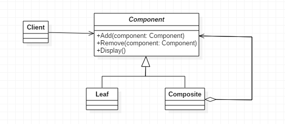
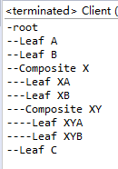
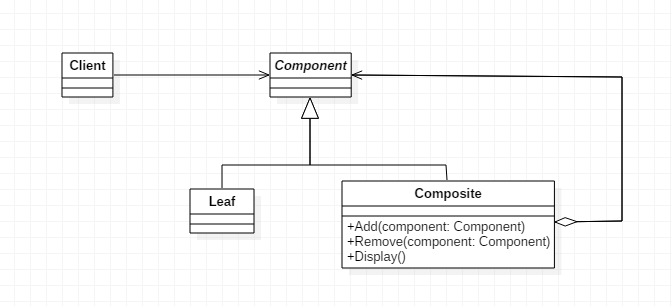
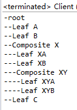
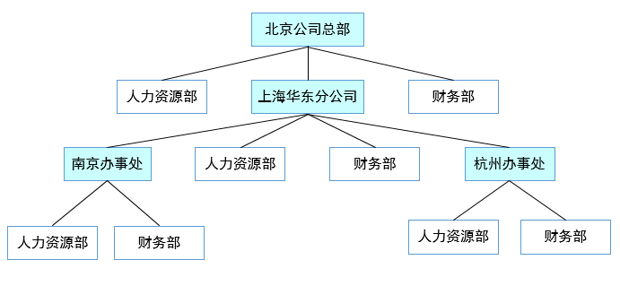
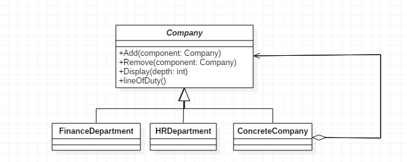
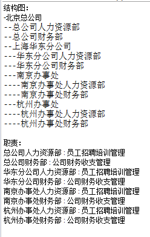
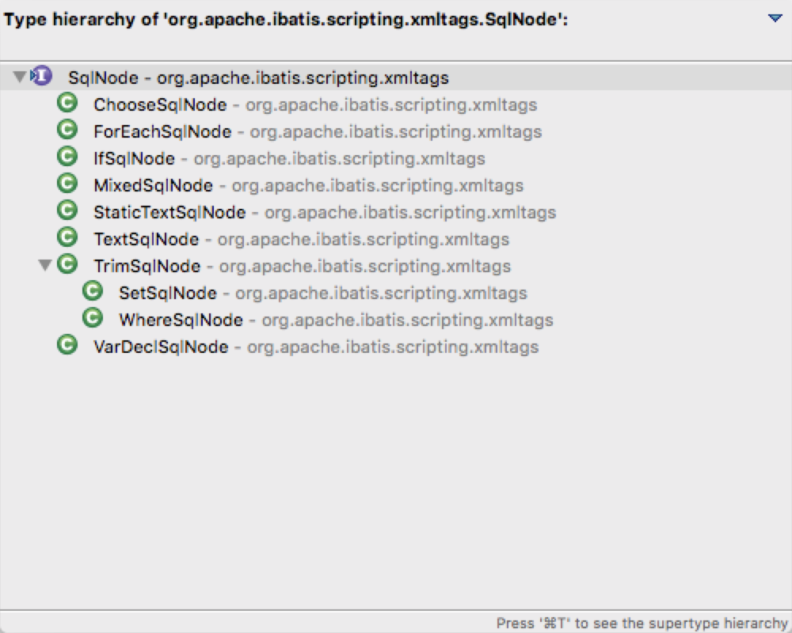

# 一. 简介

组合模式（Composite），将对象组合成树形结构以表示“部分-整体”的层次结构，用户对单个对象和组合对象的使用具有一致性。

所以当我们的案例是**树形结构或者是部分-整体的关系**时，就可以考虑使用组合模式。

组合模式有两种不同的实现，分别为透明模式和安全模式，下面将详细说明一下两种实现的区别。

# 二. 组合模式之透明模式
透明模式是把组合使用的方法放到抽象类中，不管叶子对象还是树枝对象都有相同的结构，这样做的好处就是叶子节点和树枝节点对于外界没有区别，它们具备完全一致的行为接口。但因为Leaf类本身不具备add()、remove()方法的功能，所以实现它是没有意义的。UML结构图如下：


* Component是对象声明接口，在适当情况下，实现所有类共有接口的默认行为；

* Leaf是叶子节点对象，其没有子节点；

* Composite是树枝节点对象，用来存储部件，组合树枝节点和叶子节点形成一个树形结构。

1. Component
```java
public abstract class Component {
    
    protected String name;
    
    public Component(String name) {
        this.name = name;
    }

    //增加一个叶子构件或树枝构件
    public abstract void add(Component component);
    
    //删除一个叶子构件或树枝构件
    public abstract void remove(Component component);
    
    //获取分支下的所有叶子构件和树枝构件
    public abstract void display(int depth);
    
}
```

2. Composite

```java
public class Composite extends Component {

    public Composite(String name) {
        super(name);
    }

    //构建容器
    private ArrayList<Component> componentArrayList = new ArrayList<Component>();
    
    @Override
    public void add(Component component) {
        this.componentArrayList.add(component);
    }

    @Override
    public void remove(Component component) {
        this.componentArrayList.remove(component);
    }

    @Override
    public void display(int depth) {
        //输出树形结构
        for(int i=0; i<depth; i++) {
            System.out.print('-');
        }
        System.out.println(name);
        
        //下级遍历
        for (Component component : componentArrayList) {
            component.display(depth + 1);
        }
    }

}
```
3. Leaf
```java
public class Leaf extends Component {

    public Leaf(String name) {
        super(name);
    }

    @Override
    public void add(Component component) {
        //空实现，抛出“不支持请求”异常
        throw new UnsupportedOperationException();
    }

    @Override
    public void remove(Component component) {
        //空实现，抛出“不支持请求”异常
        throw new UnsupportedOperationException();
    }

    @Override
    public void display(int depth) {
        //输出树形结构的叶子节点
        for(int i=0; i<depth; i++) {
            System.out.print('-');
        }
        System.out.println(name);
    }

}
```

4. Client
```java
public class Client {

    public static void main(String[] args) {
        //创建根节点及其子节点
        Composite root = new Composite("root");
        root.add(new Leaf("Leaf A"));
        root.add(new Leaf("Leaf B"));

        //创建第二层节点及其子节点
        Composite branch = new Composite("Composite X");
        branch.add(new Leaf("Leaf XA"));
        branch.add(new Leaf("Leaf XB"));
        root.add(branch);
        
        //创建第三层节点及其子节点
        Composite branch2 = new Composite("Composite XY");
        branch2.add(new Leaf("Leaf XYA"));
        branch2.add(new Leaf("Leaf XYB"));
        branch.add(branch2);
        
        //创建第二层节点
        root.add(new Leaf("Leaf C"));
        
        //创建第二层节点并删除
        Leaf leaf = new Leaf("Leaf D");
        root.add(leaf);
        root.remove(leaf);
        
        //打印
        root.display(1);
    }
    
}
```

通过组合模式输出一个树形结构，运行结果如下：


# 三. 组合模式之安全模式

安全模式是把树枝节点和叶子节点彻底分开，树枝节点单独拥有用来组合的方法，这种方法比较安全。但由于不够透明，所以叶子节点和树枝节点将不具有相同的接口，客户端的调用需要做相应的判断，带来了不便。UML结构图如下：

1. Component
这里相比透明模式就少了add()和romove()抽象方法的声明。
```java
public abstract class Component {
    
    protected String name;
    
    public Component(String name) {
        this.name = name;
    }

    //获取分支下的所有叶子构件和树枝构件
    public abstract void display(int depth);
    
}
```
2. Composite
这里add()和remove()方法的实现就从继承变为了自己实现。
```java
public class Composite extends Component {

    public Composite(String name) {
        super(name);
    }

    //构建容器
    private ArrayList<Component> componentArrayList = new ArrayList<Component>();
    
    //增加一个叶子构件或树枝构件
    public void add(Component component) {
        this.componentArrayList.add(component);
    }

    //删除一个叶子构件或树枝构件
    public void remove(Component component) {
        this.componentArrayList.remove(component);
    }

    @Override
    public void display(int depth) {
        //输出树形结构
        for(int i=0; i<depth; i++) {
            System.out.print('-');
        }
        System.out.println(name);
        
        //下级遍历
        for (Component component : componentArrayList) {
            component.display(depth + 1);
        }
    }

}
```
3. Leaf
叶子节点中没有了空实现，比较安全。
```java
public class Leaf extends Component {

    public Leaf(String name) {
        super(name);
    }

    @Override
    public void display(int depth) {
        //输出树形结构的叶子节点
        for(int i=0; i<depth; i++) {
            System.out.print('-');
        }
        System.out.println(name);
    }

}
```
4. 调用客户端同上，运行结果如下：


由此可看出两个方法是相同的运行结果，区别在于内部实现不同，一种是叶节点与树枝节点具备一致的行为接口但有空实现的透明模式，另一种是树枝节点单独拥有用来组合的方法但调用不便的安全模式。

为什么说它调用不便呢，因为我们如果通过递归遍历树时，这时需要判断当前节点是叶子节点还是树枝节点，客户端就需要相应的判断。

# 四. 组合模式的应用
## 1. 何时使用
* 想表达“部分-整体”层次结构（树形结构）时

* 希望用户忽略组合对象与单个对象的不同，用户将统一的使用组合结构中的所有对象
## 2. 方法
树枝和叶子实现统一接口，树枝内部组合该接口
## 3. 优点
* 高层模块调用简单。一棵树形结构中的所有节点都是Component，局部和整体对调用者来说没有任何区别，高层模块不必关心自己处理的是单个对象还是整个组合结构。

* 节点自由增加
## 4. 缺点
使用组合模式时，其叶子和树枝的声明都是实现类，而不是接口，违反了依赖倒转原则
## 5. 使用场景
* 维护和展示部分-整体关系的场景（如树形菜单、文件和文件夹管理）

* 从一个整体中能够独立出部分模块或功能的场景

# 五. 组合模式的实现
下面我们以公司的层级结构为例

这种部分与整体的关系，我们就可以考虑使用组合模式，下面采用组合模式的透明模式对其实现，UML图如下：


## 1. 抽象公司类
此为顶层节点，抽象类。
```java
public abstract class Company {
    
    protected String name;
    
    public Company(String name) {
        this.name = name;
    }

    //增加一个叶子节点或树枝节点
    public abstract void add(Company company);
    
    //删除一个叶子节点或树枝节点
    public abstract void remove(Company company);
    
    //获取分支下的所有叶子节点和树枝节点
    public abstract void display(int depth);

    //职责遍历
    public abstract void lineOfDuty();
    
}
```
## 2. 具体公司类

此为树枝节点，实现添加、移除、显示和履行职责四种方法。
```java
public class ConcreteCompany extends Company {

    private List<Company> companyList = new ArrayList<Company>();
    
    public ConcreteCompany(String name) {
        super(name);
    }

    @Override
    public void add(Company company) {
        this.companyList.add(company);
    }

    @Override
    public void remove(Company company) {
        this.companyList.remove(company);
    }

    @Override
    public void display(int depth) {
        //输出树形结构
        for(int i=0; i<depth; i++) {
            System.out.print('-');
        }
        System.out.println(name);
        
        //下级遍历
        for (Company component : companyList) {
            component.display(depth + 1);
        }
    }

    @Override
    public void lineOfDuty() {
        //职责遍历
        for (Company company : companyList) {
            company.lineOfDuty();
        }
    }

}
```
## 3. 人力资源部
叶子节点，add和remove方法空实现。
```java
public class HRDepartment extends Company {

    public HRDepartment(String name) {
        super(name);
    }

    @Override
    public void add(Company company) {
        
    }

    @Override
    public void remove(Company company) {
        
    }

    @Override
    public void display(int depth) {
        //输出树形结构的子节点
        for(int i=0; i<depth; i++) {
            System.out.print('-');
        }
        System.out.println(name);
    }

    @Override
    public void lineOfDuty() {
        System.out.println(name + " : 员工招聘培训管理");
    }
    
}
```
## 4. 财务部
叶子节点，add和remove方法空实现。
```java
public class FinanceDepartment extends Company {
    
    public FinanceDepartment(String name) {
        super(name);
    }

    @Override
    public void add(Company company) {
        
    }

    @Override
    public void remove(Company company) {
        
    }

    @Override
    public void display(int depth) {
        //输出树形结构的子节点
        for(int i=0; i<depth; i++) {
            System.out.print('-');
        }
        System.out.println(name);
    }

    @Override
    public void lineOfDuty() {
        System.out.println(name + " : 公司财务收支管理");
    }
    
}
```

## 5. Client客户端
```java
public class Client {

    public static void main(String[] args) {
        //总公司
        ConcreteCompany root = new ConcreteCompany("北京总公司");
        root.add(new HRDepartment("总公司人力资源部"));
        root.add(new FinanceDepartment("总公司财务部"));
        
        //分公司
        ConcreteCompany company = new ConcreteCompany("上海华东分公司");
        company.add(new HRDepartment("华东分公司人力资源部"));
        company.add(new FinanceDepartment("华东分公司财务部"));
        root.add(company);
        
        //办事处
        ConcreteCompany company1 = new ConcreteCompany("南京办事处");
        company1.add(new HRDepartment("南京办事处人力资源部"));
        company1.add(new FinanceDepartment("南京办事处财务部"));
        company.add(company1);
        
        ConcreteCompany company2 = new ConcreteCompany("杭州办事处");
        company2.add(new HRDepartment("杭州办事处人力资源部"));
        company2.add(new FinanceDepartment("杭州办事处财务部"));
        company.add(company2);
        
        System.out.println("结构图：");
        root.display(1);
        
        System.out.println("\n职责：");
        root.lineOfDuty();
    }
    
}
```
运行结果如下：


组合模式这样就定义了包含人力资源部和财务部这些基本对象和分公司、办事处等组合对象的类层次结构。

基本对象可以被组合成更复杂的组合对象，而这个组合对象又可以被组合，这样不断地递归下去，客户代码中，任何用到基本对象的地方都可以使用组合对象了。

这里用了透明模式，用户不用关心到底是处理一个叶节点还是处理一个组合组件，也就用不着为定义组合而写一些选择判断语句了。简单点说就是组合模式可以让客户一致地使用组合结构和单个对象。

# 六. Mybatis中的组合模式
Mybatis支持动态SQL的强大功能，比如下面的这个SQL：
```xml
<update id="update" parameterType="org.format.dynamicproxy.mybatis.bean.User">
    UPDATE users
    <trim prefix="SET" prefixOverrides=",">
        <if test="name != null and name != ''">
            name = #{name}
        </if>
        <if test="age != null and age != ''">
            , age = #{age}
        </if>
        <if test="birthday != null and birthday != ''">
            , birthday = #{birthday}
        </if>
    </trim>
    where id = ${id}
</update>

```

在这里面使用到了trim、if等动态元素，可以根据条件来生成不同情况下的SQL；

在`DynamicSqlSource.getBoundSql`方法里，调用了`rootSqlNode.apply(context)`方法，apply方法是所有的动态节点都实现的接口：
```java
public interface SqlNode {
	boolean apply(DynamicContext context);
}
```

对于实现该SqlSource接口的所有节点，就是整个组合模式树的各个节点：

组合模式的简单之处在于，所有的子节点都是同一类节点，可以递归的向下执行，比如对于TextSqlNode，因为它是最底层的叶子节点，所以直接将对应的内容append到SQL语句中：
```java
@Override
public boolean apply(DynamicContext context) {
    GenericTokenParser parser = createParser(new BindingTokenParser(context, injectionFilter));
    context.appendSql(parser.parse(text));
    return true;
}
```
但是对于`IfSqlNode`，就需要先做判断，如果判断通过，仍然会调用子元素的SqlNode，即`contents.apply`方法，实现递归的解析。
```java
@Override
public boolean apply(DynamicContext context) {
    if (evaluator.evaluateBoolean(test, context.getBindings())) {
        contents.apply(context);
        return true;
    }
    return false;
}

```