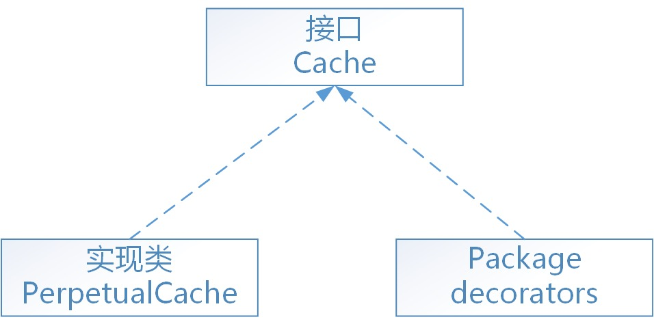

# 一. 初识装饰者模式

装饰者模式，顾名思义，就是对已经存在的某些类进行装饰，以此来扩展一些功能。其结构图如下：


* `Component`为统一接口，也是装饰类和被装饰类的基本类型。

* `ConcreteComponent`为具体实现类，也是被装饰类，他本身是个具有一些功能的完整的类。

* `Decorator`是装饰类，实现了`Component`接口的同时还在内部维护了一个`ConcreteComponent`的实例，并可以通过构造函数初始化。而`Decorator`本身，通常采用默认实现，他的存在仅仅是一个声明：我要生产出一些用于装饰的子类了。而其子类才是赋有具体装饰效果的装饰产品类。

* `ConcreteDecorator`是具体的装饰产品类，每一种装饰产品都具有特定的装饰效果。可以通过构造器声明装饰哪种类型的`ConcreteComponent`，从而对其进行装饰。

# 二. 最简单的代码实现装饰者模式
```java
//基础接口
public interface Component {
    
    public void biu();
}
//具体实现类
public class ConcretComponent implements Component {

    public void biu() {
        
        System.out.println("biubiubiu");
    }
}
//装饰类
public class Decorator implements Component {

    public Component component;
    
    public Decorator(Component component) {
        
        this.component = component;
    }
    
    public void biu() {
        
        this.component.biu();
    }
}
//具体装饰类
public class ConcreteDecorator extends Decorator {

    public ConcreteDecorator(Component component) {

        super(component);
    }

    public void biu() {
        
        System.out.println("ready?go!");
        this.component.biu();
    }
}
```

　这样一个基本的装饰器体系就出来了，当我们想让`Component`在打印之前都有一个`ready？go！`的提示时，就可以使用`ConcreteDecorator`类了。具体方式如下：
 ```java
//使用装饰器
　　Component component = new ConcreteDecorator(new ConcretComponent());
　　component.biu();

```
输出：
```shell
ready?go!
biubiubiu
```
　　
# 三. 为何使用装饰者模式
一个设计模式的出现一定有他特殊的价值。仅仅看见上面的结构图你可能会想，为何要兜这么一圈来实现？仅仅是想要多一行输出，我直接继承ConcretComponent，或者直接在另一个Component的实现类中实现不是一样吗？

首先，装饰者的价值在于装饰，他并不影响被装饰类本身的核心功能。在一个继承的体系中，子类通常是互斥的。比如一辆车，品牌只能要么是奥迪、要么是宝马，不可能同时属于奥迪和宝马，而品牌也是一辆车本身的重要属性特征。但当你想要给汽车喷漆，换坐垫，或者更换音响时，这些功能是互相可能兼容的，并且他们的存在不会影响车的核心属性：那就是他是一辆什么车。这时你就可以定义一个装饰者：喷了漆的车。不管他装饰的车是宝马还是奥迪，他的喷漆效果都可以实现。

再回到这个例子中，我们看到的仅仅是一个ConcreteComponent类。在复杂的大型项目中，同一级下的兄弟类通常有很多。当你有五个甚至十个ConcreteComponent时，再想要为每个类都加上“ready？go！”的效果，就要写出五个子类了。毫无疑问这是不合理的。装饰者模式在不影响各个ConcreteComponent核心价值的同时，添加了他特有的装饰效果，具备非常好的通用性，这也是他存在的最大价值。

# 四. 实战中使用装饰者模式
需求大致是这样：采用sls服务监控项目日志，以Json的格式解析，所以需要将项目中的日志封装成json格式再打印。现有的日志体系采用了log4j + slf4j框架搭建而成。调用起来是这样的:
```java
private static final Logger logger = LoggerFactory.getLogger(Component.class);
logger.error(string);
```

这样打印出来的是毫无规范的一行行字符串。在考虑将其转换成json格式时，我采用了装饰者模式。目前有的是统一接口Logger和其具体实现类，我要加的就是一个装饰类和真正封装成Json格式的装饰产品类。具体实现代码如下：

## 装饰类
```java
/**
 * logger decorator for other extension 
 * this class have no specific implementation
 * just for a decorator definition
 * @author jzb
 *
 */
public class DecoratorLogger implements Logger {

    public Logger logger;

    public DecoratorLogger(Logger logger) {

        this.logger = logger;
    }
　　　　
    @Override
    public void error(String str) {}

    @Override
    public void info(String str) {}
        
    //省略其他默认实现
}
```

## 具体装饰类
```java
/**
 * json logger for formatted output 
 * @author jzb
 *
 */
public class JsonLogger extends DecoratorLogger {
public JsonLogger(Logger logger) {
        
        super(logger);
    }
        
    @Override
    public void info(String msg) {

        JSONObject result = composeBasicJsonResult();
        result.put("MESSAGE", msg);
        logger.info(result.toString());
    }
    
    @Override
    public void error(String msg) {
        
        JSONObject result = composeBasicJsonResult();
        result.put("MESSAGE", msg);
        logger.error(result.toString());
    }
    
   
    private JSONObject composeBasicJsonResult() {
        //拼装了一些运行时信息
    }
}
```
可以看到，在JsonLogger中，对于Logger的各种接口，我都用JsonObject对象进行一层封装。在打印的时候，最终还是调用原生接口logger.error(string)，只是这个string参数已经被我们装饰过了。如果有额外的需求，我们也可以再写一个函数去实现。比如error(Exception e)，只传入一个异常对象，这样在调用时就非常方便了。
## JsonLoggerFactory 工厂类
另外，为了在新老交替的过程中尽量不改变太多的代码和使用方式。我又在JsonLogger中加入了一个内部的工厂类JsonLoggerFactory，他包含一个静态方法，用于提供对应的JsonLogger实例。
```java
 public static class JsonLoggerFactory {
        
        @SuppressWarnings("rawtypes")
        public static JsonLogger getLogger(Class clazz) {

            Logger logger = LoggerFactory.getLogger(clazz);
            return new JsonLogger(logger);
        }
    }
    
```

## 最终在新的日志体系中，使用方式如下：

```java
private static final Logger logger = JsonLoggerFactory.getLogger(Component.class);
logger.error(string);
```

他唯一与原先不同的地方，就是LoggerFactory -> JsonLoggerFactory，这样的实现，也会被更快更方便的被其他开发者接受和习惯。

# 五. Mybatis中的装饰者模式
在mybatis中，缓存的功能由根接口`Cache（org.apache.ibatis.cache.Cache）`定义。整个体系采用装饰者设计模式，数据存储和缓存的基本功能由`PerpetualCache（org.apache.ibatis.cache.impl.PerpetualCache）`永久缓存实现，然后通过一系列的装饰者来对PerpetualCache永久缓存进行缓存策略等方便的控制。如下图：

用于装饰PerpetualCache的标准装饰者共有8个（全部在org.apache.ibatis.cache.decorators包中）：
1. FifoCache：先进先出算法，缓存回收策略

2. LoggingCache：输出缓存命中的日志信息

3. LruCache：最近最少使用算法，缓存回收策略

4. ScheduledCache：调度缓存，负责定时清空缓存

5. SerializedCache：缓存序列化和反序列化存储

6. SoftCache：基于软引用实现的缓存管理策略

7. SynchronizedCache：同步的缓存装饰者，用于防止多线程并发访问

8. WeakCache：基于弱引用实现的缓存管理策略

另外，还有一个特殊的装饰者TransactionalCache：事务性的缓存

正如大多数持久层框架一样，mybatis缓存同样分为一级缓存和二级缓存

* 一级缓存，又叫本地缓存，是PerpetualCache类型的永久缓存，保存在执行器中（BaseExecutor），而执行器又在SqlSession（DefaultSqlSession）中，所以一级缓存的生命周期与SqlSession是相同的。

* 二级缓存，又叫自定义缓存，实现了Cache接口的类都可以作为二级缓存，所以可配置如encache等的第三方缓存。二级缓存以namespace名称空间为其唯一标识，被保存在Configuration核心配置对象中。

二级缓存对象的默认类型为`PerpetualCache`，如果配置的缓存是默认类型，则mybatis会根据配置自动追加一系列装饰者。
Cache对象之间的引用顺序为：
`SynchronizedCache–>LoggingCache–>SerializedCache–>ScheduledCache–>LruCache–>PerpetualCache`