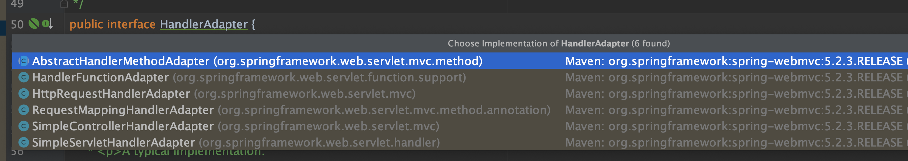
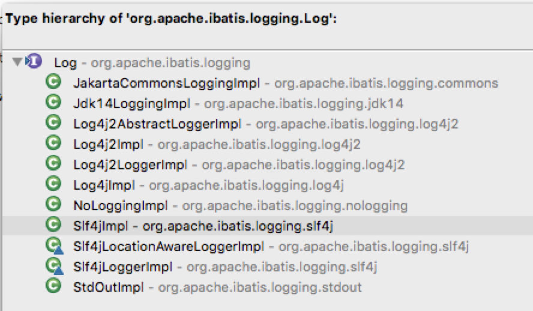

# 一. 简介
适配器模式(Adapter Pattern)：将一个接口转换成客户希望的另一个接口，使接口不兼容的那些类可以一起工作，其别名为**包装器**(Wrapper)。适配器模式**既可以作为类结构型模式，也可以作为对象结构型模式**。

在适配器模式中，我们通过增加一个新的适配器类来解决接口不兼容的问题，使得原本没有任何关系的类可以协同工作。

根据适配器类与适配者类的关系不同，适配器模式可分为对象适配器和类适配器两种，

* 在对象适配器模式中，适配器与适配者之间是关联关系；

* 在类适配器模式中，适配器与适配者之间是继承（或实现）关系。
## 角色
* Target（目标抽象类）：目标抽象类定义客户所需接口，可以是一个抽象类或接口，也可以是具体类。

* Adapter（适配器类）：适配器可以调用另一个接口，作为一个转换器，对Adaptee和Target进行适配，适配器类是适配器模式的核心，在对象适配器中，它通过继承Target并关联一个Adaptee对象使二者产生联系。

* Adaptee（适配者类）：**适配者即被适配的角色**，它定义了一个已经存在的接口，这个接口需要适配，适配者类一般是一个具体类，包含了客户希望使用的业务方法，在某些情况下可能没有适配者类的源代码。

> 缺省适配器模式(Default Adapter Pattern)：当不需要实现一个接口所提供的所有方法时，可先设计一个抽象类实现该接口，并为接口中每个方法提供一个默认实现（空方法），那么该抽象类的子类可以选择性地覆盖父类的某些方法来实现需求，它适用于不想使用一个接口中的所有方法的情况，又称为单接口适配器模式。缺省适配器模式是适配器模式的一种变体，其应用也较为广泛。在JDK类库的事件处理包java.awt.event中广泛使用了缺省适配器模式，如WindowAdapter、KeyAdapter、MouseAdapter等。

# 二. 示例

## 1. 类适配器

### 已存在的将被适配的类
```java
public class Adaptee {
    public void adapteeRequest() {
        System.out.println("被适配者的方法");
    }
}
```
## 定义一个目标接口
```java
public interface Target {
    void request();
}
```

### 怎么才可以在目标接口中的 request() 调用 Adaptee 的 adapteeRequest() 方法呢？
如果直接实现 Target 是不行的
```java
public class ConcreteTarget implements Target {
    @Override
    public void request() {
        System.out.println("concreteTarget目标方法");
    }
}
```
通过一个适配器类，实现 Target 接口，同时继承了 Adaptee 类，然后在实现的 request() 方法中调用父类的 adapteeRequest() 即可实现

```java
public class Adapter extends Adaptee implements Target{
    @Override
    public void request() {
        //...一些操作...
        super.adapteeRequest();
        //...一些操作...
    }
}
```
### 测试

```java
public class Test {
    public static void main(String[] args) {
        Target target = new ConcreteTarget();
        target.request();

        Target adapterTarget = new Adapter();
        adapterTarget.request();
    }
}

```
输出:
```shell
concreteTarget目标方法
被适配者的方法
```

## 2. 对象适配器

对象适配器与类适配器不同之处在于，类适配器通过继承来完成适配，对象适配器则是通过关联来完成，这里稍微修改一下`Adapter `类即可将转变为对象适配器
```java
public class Adapter implements Target{
    // 适配者是对象适配器的一个属性
    private Adaptee adaptee = new Adaptee();

    @Override
    public void request() {
        //...
        adaptee.adapteeRequest();
        //...
    }
}
```
这里的 Adapter 是将 Adaptee 作为一个成员属性，而不是继承它

# 三. spring AOP中的适配器模式
在Spring的Aop中，使用的 `Advice`（通知） 来增强被代理类的功能。

Advice的类型有：`MethodBeforeAdvice`、`AfterReturningAdvice`、`ThrowsAdvice`

在每个类型 Advice 都有对应的拦截器，`MethodBeforeAdviceInterceptor`、`AfterReturningAdviceInterceptor`、`ThrowsAdviceInterceptor`

Spring需要将每个 Advice **都封装成对应的拦截器类型**，返回给容器，所以需要使用适配器模式对 Advice 进行转换

## 1. 三个适配者类 Adaptee(需要被适配的类) 如下：

```java
public interface MethodBeforeAdvice extends BeforeAdvice {
    void before(Method var1, Object[] var2, @Nullable Object var3) throws Throwable;
}

public interface AfterReturningAdvice extends AfterAdvice {
    void afterReturning(@Nullable Object var1, Method var2, Object[] var3, @Nullable Object var4) throws Throwable;
}

public interface ThrowsAdvice extends AfterAdvice {
}
```

## 2. 目标接口 AdvisorAdapter
有两个方法，一个`supportsAdvice`用于判断 Advice 类型是否匹配，一个`getInterceptor`是工厂方法，创建对应类型的 Advice 对应的拦截器
```java
public interface AdvisorAdapter {
    boolean supportsAdvice(Advice var1);

    MethodInterceptor getInterceptor(Advisor var1);
}
```
## 3. 三个适配器类 Adapter 分别如下(用的是对象适配器)
```java
class MethodBeforeAdviceAdapter implements AdvisorAdapter, Serializable {
	@Override
	public boolean supportsAdvice(Advice advice) {
		return (advice instanceof MethodBeforeAdvice);
	}

	@Override
	public MethodInterceptor getInterceptor(Advisor advisor) {
        //对象适配器
		MethodBeforeAdvice advice = (MethodBeforeAdvice) advisor.getAdvice();
		return new MethodBeforeAdviceInterceptor(advice);
	}
}

@SuppressWarnings("serial")
class AfterReturningAdviceAdapter implements AdvisorAdapter, Serializable {
	@Override
	public boolean supportsAdvice(Advice advice) {
		return (advice instanceof AfterReturningAdvice);
	}
	@Override
	public MethodInterceptor getInterceptor(Advisor advisor) {
        //对象适配器
		AfterReturningAdvice advice = (AfterReturningAdvice) advisor.getAdvice();
		return new AfterReturningAdviceInterceptor(advice);
	}
}

class ThrowsAdviceAdapter implements AdvisorAdapter, Serializable {
	@Override
	public boolean supportsAdvice(Advice advice) {
		return (advice instanceof ThrowsAdvice);
	}
	@Override
	public MethodInterceptor getInterceptor(Advisor advisor) {
		return new ThrowsAdviceInterceptor(advisor.getAdvice());
	}
}

```

## 4. 客户端`DefaultAdvisorAdapterRegistry`
```java
public class DefaultAdvisorAdapterRegistry implements AdvisorAdapterRegistry, Serializable {
    private final List<AdvisorAdapter> adapters = new ArrayList(3);

    public DefaultAdvisorAdapterRegistry() {
        // 这里注册了适配器
        this.registerAdvisorAdapter(new MethodBeforeAdviceAdapter());
        this.registerAdvisorAdapter(new AfterReturningAdviceAdapter());
        this.registerAdvisorAdapter(new ThrowsAdviceAdapter());
    }
    
    public MethodInterceptor[] getInterceptors(Advisor advisor) throws UnknownAdviceTypeException {
        List<MethodInterceptor> interceptors = new ArrayList(3);
        Advice advice = advisor.getAdvice();
        if (advice instanceof MethodInterceptor) {
            interceptors.add((MethodInterceptor)advice);
        }

        Iterator var4 = this.adapters.iterator();

        while(var4.hasNext()) {
            AdvisorAdapter adapter = (AdvisorAdapter)var4.next();
            if (adapter.supportsAdvice(advice)) {   // 这里调用适配器方法
                interceptors.add(adapter.getInterceptor(advisor));  // 这里调用适配器方法
            }
        }

        if (interceptors.isEmpty()) {
            throw new UnknownAdviceTypeException(advisor.getAdvice());
        } else {
            return (MethodInterceptor[])interceptors.toArray(new MethodInterceptor[0]);
        }
    }
    // ...省略...
}    

```
这里看 while 循环里，逐个取出注册的适配器，调用 `supportsAdvice()` 方法来判断 Advice 对应的类型，然后调用 `getInterceptor()` 创建对应类型的拦截器

这里应该属于对象适配器模式，关键字 `instanceof` 可看成是 Advice 的方法，不过这里的 Advice 对象是从外部传进来，而不是成员属性。

# 四. spring MVC中的适配器模式
Spring MVC中的适配器模式主要用于执行目标 Controller 中的请求处理方法。

在Spring MVC中，`DispatcherServlet` 作为用户，`HandlerAdapter` 作为目标接口，具体的适配器实现类用于对目标类进行适配，`各种不同请求的处理器` 作为需要适配的类。

**即`DispatcherServlet`需要通过实现了`HandlerAdapter`接口的类，调用`各种不同请求的处理器`中的方法。**
为什么要在 Spring MVC 中使用适配器模式？Spring MVC 中的 处理的请求 种类众多，不同类型的 请求 通过不同的方法来对请求进行处理。如果不利用适配器模式的话，`DispatcherServlet` 直接获取对应类型的 请求，需要自行来判断，像下面这段代码一样：
```java
if(mappedHandler.getHandler() instanceof MultiActionController){  
   ((MultiActionController)mappedHandler.getHandler()).xxx  
}else if(mappedHandler.getHandler() instanceof XXX){  
    ...  
}else if(...){  
   ...  
}  
```

这样假设如果我们增加一个 `XXRequestHander`,就要在代码中加入一行 `if(mappedHandler.getHandler() instanceof XXRequestHander)`，这种形式就使得程序难以维护，也违反了设计模式中的开闭原则 – 对扩展开放，对修改关闭。

## 我们来看看源码，首先是适配器接口`HandlerAdapter`,即目标接口。

```java
public interface HandlerAdapter {
    boolean supports(Object var1);

    ModelAndView handle(HttpServletRequest var1, HttpServletResponse var2, Object var3) throws Exception;

    long getLastModified(HttpServletRequest var1, Object var2);
}

```
对于该接口，每一个 不同类型的请求 都有一个适配器与之对应，这样的话，每自定义一个 请求处理器 需要定义一个实现 HandlerAdapter 的适配器。

springmvc 中提供的 HandlerAdapter 实现类如下：

## `SimpleControllerHandlerAdapter` 这个适配器代码如下
用于处理针对controller的请求，只是实现了目标接口`HandlerAdapter`，没有实现请求处理器类，说明使用的是**对象适配器模式**。
```java
public class SimpleControllerHandlerAdapter implements HandlerAdapter {

	@Override
	public boolean supports(Object handler) {
		return (handler instanceof Controller);
	}

	@Override
	@Nullable
	public ModelAndView handle(HttpServletRequest request, HttpServletResponse response, Object handler)
			throws Exception {

		return ((Controller) handler).handleRequest(request, response);
	}

	@Override
	public long getLastModified(HttpServletRequest request, Object handler) {
		if (handler instanceof LastModified) {
			return ((LastModified) handler).getLastModified(request);
		}
		return -1L;
	}

}

```


## 客户端`DispatcherServlet`
```java
public class DispatcherServlet extends FrameworkServlet {
    private List<HandlerAdapter> handlerAdapters;
    
    //初始化handlerAdapters
    private void initHandlerAdapters(ApplicationContext context) {
        //..省略...
    }
    
    // 遍历所有的 HandlerAdapters，通过 supports 判断找到匹配的适配器
    protected HandlerAdapter getHandlerAdapter(Object handler) throws ServletException {
		for (HandlerAdapter ha : this.handlerAdapters) {
			if (logger.isTraceEnabled()) {
				logger.trace("Testing handler adapter [" + ha + "]");
			}
			if (ha.supports(handler)) {
				return ha;
			}
		}
	}
	
	// 分发请求，请求需要找到匹配的适配器来处理
	protected void doDispatch(HttpServletRequest request, HttpServletResponse response) throws Exception {
		HttpServletRequest processedRequest = request;
		HandlerExecutionChain mappedHandler = null;

		// Determine handler for the current request.
		mappedHandler = getHandler(processedRequest);
			
		// 确定当前请求的匹配的适配器.
		HandlerAdapter ha = getHandlerAdapter(mappedHandler.getHandler());

		ha.getLastModified(request, mappedHandler.getHandler());
					
		mv = ha.handle(processedRequest, response, mappedHandler.getHandler());
    }
	// ...省略...
}	

```
当Spring容器启动后，会将所有定义好的适配器对象存放在一个List集合中，当一个请求来临时，`DispatcherServlet` 会通过 `handler` 的类型找到对应适配器，并将该适配器对象返回给用户，然后就可以统一通过适配器的` hanle() `方法来调用`请求实现类`中的用于处理请求的方法。


通过适配器模式我们将所有的请求统一交给 HandlerAdapter 处理，免去了写大量的 `if-else` 语句对 不同类型的请求 进行判断，也更利于扩展新的请求类型。

# 五. Mybatis中的适配器模式
在Mybatsi的logging包中，有一个Log接口：
```java
/**
 * @author Clinton Begin
 */
public interface Log {
 
	boolean isDebugEnabled();
 
	boolean isTraceEnabled();
 
	void error(String s, Throwable e);
 
	void error(String s);
 
	void debug(String s);
 
	void trace(String s);
 
	void warn(String s);
 
}

```
该接口定义了Mybatis直接使用的日志方法，而Log接口具体由谁来实现呢？Mybatis提供了多种日志框架的实现，这些实现都匹配这个Log接口所定义的接口方法，最终实现了所有外部日志框架到Mybatis日志包的适配：

比如对于Log4jImpl的实现来说，该实现持有了org.apache.log4j.Logger的实例(对象适配器模式)，然后所有的日志方法，均委托该实例来实现。
```java
public class Log4jImpl implements Log {
 
	private static final String FQCN = Log4jImpl.class.getName();
 
    //org.apache.log4j.Logger的实例
	private Logger log;
 
	public Log4jImpl(String clazz) {
		log = Logger.getLogger(clazz);
	}
 
	@Override
	public boolean isDebugEnabled() {
		return log.isDebugEnabled();
	}
 
	@Override
	public boolean isTraceEnabled() {
		return log.isTraceEnabled();
	}
 
	@Override
	public void error(String s, Throwable e) {
		log.log(FQCN, Level.ERROR, s, e);
	}
 
	@Override
	public void error(String s) {
		log.log(FQCN, Level.ERROR, s, null);
	}
 
	@Override
	public void debug(String s) {
		log.log(FQCN, Level.DEBUG, s, null);
	}
 
	@Override
	public void trace(String s) {
		log.log(FQCN, Level.TRACE, s, null);
	}
 
	@Override
	public void warn(String s) {
		log.log(FQCN, Level.WARN, s, null);
	}
 
}

```