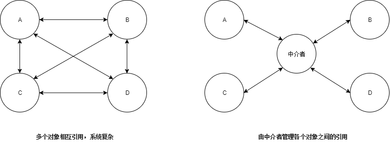
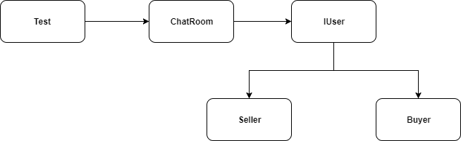

# 一. 定义
中介者模式使用一个中介对象来封装一系列对象的交互，从而使各对象不需要显式的相互引用，从而使得对象我们耦合松散，而且可以独立地改变对象之间的交互。该模式是用来降低多个对象和类之间的通信复杂性。

# 二. 优缺点
## 优点：

1. 降低了类的复杂度，将一对多转化成了一对一。

2. 各个类之间的解耦。

3. 符合迪米特原则。

## 缺点：

1. 中介者会庞大，变得复杂难以维护。

2. 如果中介者类出现问题，将会导致所有相关类出问题。

# 三. 使用场景
多个类相互耦合，形成了网状结构。

# 四. 实例
案例：聊天室有买家和卖家。买家留言，卖家自动回复。

## IUser接口：定义用户的行为
```java
public interface IUser {

    void sendMessage(String sendMessage);

    void receiveMessage(String sendMessage);
}
```
## Seller类：
```java
public class Seller implements IUser {

    private ChatRoom chatRoom = new ChatRoom();

    @Override
    public void sendMessage(String message) {
        try {
            chatRoom.sendMessage(this,message);
        } catch (Exception e) {
            e.printStackTrace();
        }
    }

    @Override
    public void receiveMessage(String message) {
        if(message != null && message != ""){
            this.sendMessage("您好！如需帮助，请致电：1234567");
        }
    }
}
```
## Buyer类：
```java
public class Buyer implements IUser {

    private ChatRoom chatRoom = new ChatRoom();

    @Override
    public void sendMessage(String message) {
        try {
            chatRoom.sendMessage(this,message);
        } catch (Exception e) {
            e.printStackTrace();
        }
    }

    @Override
    public void receiveMessage(String message) {
        if(message != "" && message != null){
            Scanner sc = new Scanner(System.in);
            while (sc.hasNext()) {
                String str = sc.next();
                this.sendMessage(str);
            }
        }
    }
}
```
## ChatRoom类：充当中介者角色
```java
public class ChatRoom {

    public static IUser buyer = new Buyer();
    public static IUser seller = new Seller();
    private SimpleDateFormat date = new SimpleDateFormat("yyyy-MM-dd HH:mm:ss");

    public void sendMessage(IUser user, String message) throws Exception {
        if (user.getClass().getSimpleName().equals("Buyer")) {
            System.out.println(date.format(new Date()) + "  " + "Buyer: " + message);
            seller.receiveMessage(message);
        } else if (user.getClass().getSimpleName().equals("Seller")) {
            System.out.println(date.format(new Date()) + "  " + "Seller: " + message);
            buyer.receiveMessage(message);
        } else {
            throw new Exception();
        }
    }
}

```
## Test类：
```java
public class Test {
    public static void main(String[] args) {
        ChatRoom chatRoom = new ChatRoom();
        Scanner sc = new Scanner(System.in);
        while (sc.hasNext()) {
            String str = sc.next();
            chatRoom.buyer.sendMessage(str);
        }
    }
}
```
输出：使用Scanner类在控制台输入，充当买家向卖家留言，卖家会自动回复。
```shell
请问可以7天无条件退款吗？
2019-04-26 10:59:17  Buyer: 请问可以7天无条件退款吗？
2019-04-26 10:59:17  Seller: 您好！如需帮助，请致电：1234567
Buyer: 这件商品打折吗？
2019-04-26 10:59:22  Buyer: Buyer:
2019-04-26 10:59:22  Seller: 您好！如需帮助，请致电：1234567
```
# 五. 总结
中介者模式中的中介者类简化了对象之间的引用，还可以进一步控制对象之间的交互。

这个模式简化系统的结构，使原本复杂系统转变成简单的星状结构，使对象之间的关系易于理解和维护。

但同时不要滥用，因为中介者模式会使中介者的逻辑复杂，变得难以维护，而且万一中介者类出问题将可能导致系统奔溃！
