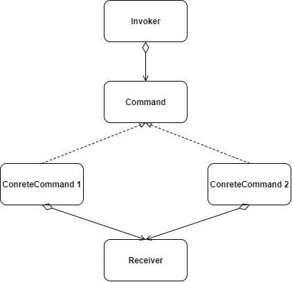

# 一. 定义
将一个请求封装为一个对象，使发出请求的责任和执行请求的责任分割开。这样两者之间通过命令对象进行沟通，这样方便将命令对象进行储存、传递、调用、增加与管理。
# 二. 优缺点
## 优点：
1. 降低了系统耦合度。

2. 新的命令可以很容易添加到系统中去。
## 缺点：
每个具体操作就需要设计一个具体的命令类，会导致系统有过多的具体命令类，增加系统的复杂性。
# 三. 使用场景
1. 当系统需要将请求调用者与请求接收者解耦时，命令模式使得调用者和接收者不直接交互。

2. 当系统需要随机请求命令或经常增加或删除命令时，命令模式比较方便实现这些功能。

3. 需要抽象出等待执行的行为。
# 四. 实例

命令模式有以下几种角色：

* 抽象命令类（Command）角色： 声明执行命令的接口，拥有执行命令的抽象方法 execute()。

* 具体命令角色（Concrete Command）角色： 是抽象命令类的具体实现类，它拥有接收者对象，并通过调用接收者的功能来完成命令要执行的操作。

* 实现者/接收者（Receiver）角色： 执行命令功能的相关操作，是具体命令对象业务的真正实现者。

* 调用者/请求者（Invoker）角色： 是请求的发送者，它通常拥有很多的命令对象，并通过访问命令对象来执行相关请求，它不直接访问接收者。

## 示例：复仇者联盟中，美国队长通知其他成员集合。
CaptainAmerican（调用者）：
```java
public class CaptainAmerican {

    //保存需要通知的英雄集合
    private List<Hero> list;

    private Command command;

    public CaptainAmerican() {
        this.list = new ArrayList();
    }

    public CaptainAmerican addHero(Hero hero) {
        list.add(hero);
        return this;
    }

    public void notifyAllHero() {
        System.out.println(this.getClass().getSimpleName() + "：Avengers, assemble!");
        for (int i = 0; i < list.size(); i++) {
            Hero hero = list.get(i);
            command = new MessageCommand(hero);
            command.execute();
        }
    }
}
```

Command（抽象命令类）：
```java
public interface Command {
    void execute();
}
```
MessageCommand（具体命令类）：
```java
public class MessageCommand implements Command {

    public Hero hero;

    public MessageCommand() {}

    public MessageCommand(Hero hero) {
        this.hero = hero;
    }

    @Override
    public void execute() {
        hero.response();
    }
}
```

Hero（抽象接收者）：
```java
public interface Hero {
    void response();
}
```
BlackWidow、Hawkeye、Hulk、IronMan、Thor（接收者）：
```java
public class BlackWidow implements Hero {
    @Override
    public void response() {
        System.out.println(this.getClass().getSimpleName() + "：Yes,Cap!");
    }
}
public class Hawkeye implements Hero{
    @Override
    public void response() {
        System.out.println(this.getClass().getSimpleName() + "：Yes,Cap!");
    }
}
public class Hulk implements Hero{
    @Override
    public void response() {
        System.out.println(this.getClass().getSimpleName() + "：Yes,Cap!");
    }
}
public class IronMan implements Hero{
    @Override
    public void response() {
        System.out.println(this.getClass().getSimpleName() + "：Yes,Cap!");
    }
}
public class Thor implements Hero {
    @Override
    public void response() {
        System.out.println(this.getClass().getSimpleName() + "：Yes,Cap!");
    }
}
```

Test:测试类
```java
public class Test {
    public static void main(String[] args) {
        CaptainAmerican captainAmerican = new CaptainAmerican();
        Thor thor = new Thor();
        BlackWidow blackWidow = new BlackWidow();
        Hawkeye hawkeye = new Hawkeye();
        Hulk hulk = new Hulk();
        IronMan ironMan = new IronMan();

        captainAmerican.addHero(thor)
                .addHero(blackWidow)
                .addHero(hawkeye)
                .addHero(hulk)
                .addHero(ironMan);

        captainAmerican.notifyAllHero();
    }
}
```

输出结果：
```shell
CaptainAmerican：Avengers, assemble!
Thor：Yes,Cap!
BlackWidow：Yes,Cap!
Hawkeye：Yes,Cap!
Hulk：Yes,Cap!
IronMan：Yes,Cap!
```


# 五. 总结
命令模式使请求的调用者和请求的接受者解耦，方便增加或删除命令。可以与备忘录模式结合实现撤销\重做的动作。