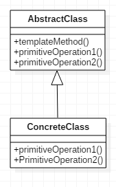
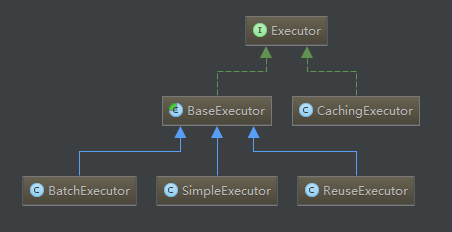

# 一. 模板方法模式的概念

模板方法模式，定义一个操作中的算法骨架，而将一些步骤延迟到子类中。模板方法使得子类可以不改变一个算法的结构即可重新定义该算法的某些特定步骤。

# 二. 模板方法模式的结构


* **AbstractClass**：实现一个模板方法，定义了算法的骨架，具体子类将重定义PrimitiveOperation以实现一个算法的步骤。AbstractClass其实就是一个抽象模板，定义并实现了一个模板方法。这个模板方法一般是一个具体的方法。它给出了一个顶级逻辑的骨架，而逻辑的组成步骤在相应的抽象操作中，推迟到子类实现。顶级逻辑也有可能调用一些具体方法。

* **ConcreteClasses**：实现PrimitiveOperation以完成算法与特定子类相关的步骤。ConcreteClass实现父类所定义的一个或多个抽象方法。每一个AbstractClass都可以有任意多个ConcreteClass与之对应，而每一个ConcreteClass都可以给出这些抽象方法（也就是顶级逻辑的组成步骤）的不同实现，从而使得顶级逻辑的实现各不相同。

# 三. 模板方法模式的基本代码实现
根据上面的结构图，我们可以用代码来进行实现
`AbstractClass`（抽象模板）：
```java
package com.jxs.templateMethod;

/**
 * Created by jiangxs on 2018/5/7.
 */
public abstract class AbstractClass {

    public abstract void primitiveOperation1();

    public abstract void primitiveOperation2();

    // 模板方法，给出了逻辑的骨架
    // 而逻辑的组成是一些相应的抽象操作，他们都推迟到子类实现
    public void templateMethod() {

        primitiveOperation1();
        primitiveOperation2();
        System.out.println("");
    }
}
```
`ConcreteClass`（实现父类所定义的一个或多个抽象方法）
`ConcreteClassA`：
```java
package com.jxs.templateMethod;

/**
 * Created by jiangxs on 2018/5/7.
 */
public class ConcreteClassA extends AbstractClass {

    @Override
    public void primitiveOperation1() {

        System.out.println("具体类A方法1实现");
    }

    @Override
    public void primitiveOperation2() {

        System.out.println("具体类A方法2实现");
    }
}
```
`ConcreteClassB`：
```java
package com.jxs.templateMethod;

/**
 * Created by jiangxs on 2018/5/7.
 */
public class ConcreteClassB extends AbstractClass {

    @Override
    public void primitiveOperation1() {

        System.out.println("具体类B方法1实现");
    }

    @Override
    public void primitiveOperation2() {

        System.out.println("具体类B方法2实现");
    }
}
```

客户端：

```java
package com.jxs.templateMethod;

/**
 * Created by jiangxs on 2018/5/7.
 */
public class Client {

    public static void main(String[] args) {

        AbstractClass c;

        c = new ConcreteClassA();
        c.templateMethod();

        c = new ConcreteClassB();
        c.templateMethod();
    }
}
```
运行结果：
```shell
具体类A方法1实现
具体类A方法2实现

具体类B方法1实现
具体类B方法2实现


Process finished with exit code 0
```

# 四. 模板方法模式的总结
## 1. 模板方法模式的优点
1. 模板方法模式通过把不变的行为搬移到父类，去除了子类中的重复代码。

2. 子类实现算法的某些细节，有助于算法的扩展。

3. 通过一个父类调用子类实现的操作，通过子类扩展增加新的行为，符合“开放-封闭原则”。

## 2. 模板方法模式的缺点
按照设计习惯，抽象类负责声明最抽象、最一般的事物属性和方法，实现类负责完成具体的事务属性和方法，但是模板方式正好相反，子类执行的结果影响了父类的结果，会增加代码阅读的难度。

## 3. 模板方法模式适合的场景

1. 多个子类有共有的方法，并且逻辑基本相同。

2. 重要、复杂的算法，可以把核心算法设计为模板方法，周边的相关细节功能则由各个子类实现。

3. 重构时，模板方法是一个经常使用的方法，把相同的代码抽取到父类中，然后通过构造函数约束其行为。

# 五. Mybatis中的模板方法模式
在Mybatis中，sqlSession的SQL执行，都是委托给Executor实现的，Executor包含以下结构：

其中的BaseExecutor就采用了模板方法模式，它实现了大部分的SQL执行逻辑，然后把以下几个方法交给子类定制化完成：
```java
protected abstract int doUpdate(MappedStatement ms, Object parameter) throws SQLException;
 
	protected abstract List<BatchResult> doFlushStatements(boolean isRollback) throws SQLException;
 
	protected abstract <E> List<E> doQuery(MappedStatement ms, Object parameter, RowBounds rowBounds,ResultHandler resultHandler, BoundSql boundSql) throws SQLException;

```
该模板方法类有几个子类的具体实现，使用了不同的策略：

* 简单SimpleExecutor：每执行一次update或select，就开启一个Statement对象，用完立刻关闭Statement对象。（可以是Statement或PrepareStatement对象）

* 重用ReuseExecutor：执行update或select，以sql作为key查找Statement对象，存在就使用，不存在就创建，用完后，不关闭Statement对象，而是放置于Map<String, Statement>内，供下一次使用。（可以是Statement或PrepareStatement对象）

* 批量BatchExecutor：执行update（没有select，JDBC批处理不支持select），将所有sql都添加到批处理中（addBatch()），等待统一执行（executeBatch()），它缓存了多个Statement对象，每个Statement对象都是addBatch()完毕后，等待逐一执行executeBatch()批处理的；BatchExecutor相当于维护了多个桶，每个桶里都装了很多属于自己的SQL，就像苹果蓝里装了很多苹果，番茄蓝里装了很多番茄，最后，再统一倒进仓库。（可以是Statement或PrepareStatement对象）

比如在SimpleExecutor中这样实现update方法：
```java
	@Override
	public int doUpdate(MappedStatement ms, Object parameter) throws SQLException {
		Statement stmt = null;
		try {
			Configuration configuration = ms.getConfiguration();
			StatementHandler handler = configuration.newStatementHandler(this, ms, parameter, RowBounds.DEFAULT, null,
					null);
			stmt = prepareStatement(handler, ms.getStatementLog());
			return handler.update(stmt);
		} finally {
			closeStatement(stmt);
		}
	}

```