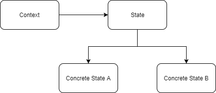
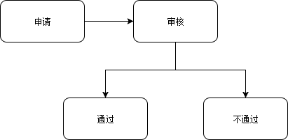

# 一. 定义
允许对象在内部状态发生改变时改变它的行为，对象看起来好像修改了它的类。

# 二. 优缺点
## 优点：
1. 封装了转换规则。

2. 枚举可能的状态，在枚举状态之前需要确定状态种类。

3. 将所有与某个状态有关的行为放到一个类中，并且可以方便地增加新的状态，只需要改变对象状态即可改变对象的行为。

4. 允许状态转换逻辑与状态对象合成一体，而不是某一个巨大的条件语句块。

5. 可以让多个环境对象共享一个状态对象，从而减少系统中对象的个数。

## 缺点：
1. 状态模式的使用必然会增加系统类和对象的个数。

2. 状态模式的结构与实现都较为复杂，如果使用不当将导致程序结构和代码的混乱。

3. 状态模式对象之间耦合度高，破坏"开闭原则"。

4. 增加新的状态类需要修改那些负责状态转换的源代码，否则无法切换到新增状态，而且修改某个状态类的行为也需修改对应类的源代码。
# 三. 使用场景
1. 行为随状态改变而改变的场景。

2. 条件、分支语句的代替者。(大量的 if/else 语句...)
# 四. 实例
状态模式包括以下几种角色：

* **Context（环境类）**： 它定义了客户程序需要的接口并维护一个具体状态角色的实例，将与状态相关的操作委托给当前的Concrete State对象来处理。

* **State（抽象状态类）**: 定义一个接口以封装使用上下文环境的的一个特定状态相关的行为。

* **ConcreteState（具体状态类）**: 实现抽象状态定义的接口。



## 示例：模拟一个请假流程。员工需要提交申请，等到领导审核后通过或者不通过。


FlowState（抽象状态类）：
```java
public abstract class FlowState {

    protected Context context;

    public void setContext(Context context) {
        this.context = context;
    }

    abstract void audit();

    abstract void pass();

    abstract void noPass();
}

```

Audit、Pass、NoPass类（具体状态类）：
```java
public class Audit extends FlowState{
    @Override
    void audit() {
        System.out.println("审核中...");
    }

    @Override
    void pass() {
        super.context.setState(Context.PASS);
        super.context.getState().pass();
    }

    @Override
    void noPass() {
        super.context.setState(Context.NO_PASS);
        super.context.getState().noPass();
    }
}

public class Pass extends FlowState{

    @Override
    void audit() {
        super.context.setState(Context.AUDIT);
        super.context.getState().audit();
    }

    @Override
    void pass() {
        System.out.println("通过啦...");
    }

    @Override
    void noPass() {
        super.context.setState(Context.NO_PASS);
        super.context.getState().noPass();
    }
}

public class NoPass extends FlowState{
    @Override
    void audit() {
        super.context.setState(Context.AUDIT);
        super.context.getState().audit();
    }

    @Override
    void pass() {
        super.context.setState(Context.PASS);
        super.context.getState().pass();
    }

    @Override
    void noPass() {
        System.out.println("不通过...");
    }
}
```
Context（环境类）：
```java
public class Context {

    protected FlowState state;
    protected static final Audit AUDIT = new Audit();
    protected static final NoPass NO_PASS = new NoPass();
    protected static final Pass PASS = new Pass();

    public Context(FlowState state) {
        setState(state);
    }

    public FlowState getState() {
        return state;
    }

    public void setState(FlowState state) {
        this.state = state;
        this.state.setContext(this);
    }

    void audit(){
        this.getState().audit();
    }

    void pass(){
        this.getState().pass();
    }

    void noPass(){
        this.getState().noPass();
    }
}
```
Apply:测试类
```java
public class Apply {
    public static void main(String[] args){
        try {
            //下属申请
            System.out.println("提交申请...");
            Context context  = new Context(new Audit());
            context.audit();
            Thread.sleep(100);
            //模拟上级看到申请后的动作
            context.pass();
        } catch (InterruptedException e) {
            e.printStackTrace();
        }
    }
}
```
输出结果：
```shell
提交申请...
审核中...
通过啦...
```
# 五. 总结
状态模式描述了对象状态的变化以及对象如何在每一种状态下表现出不同的行为，避免了使用if-else或者switch-case语句，同时代码结构清晰能够保证扩展性和维护性。但是状态模式违法开闭原则，而且在context类中耦合状态对象，当状态多的情况下，却会导致代码混乱而且不易维护。

