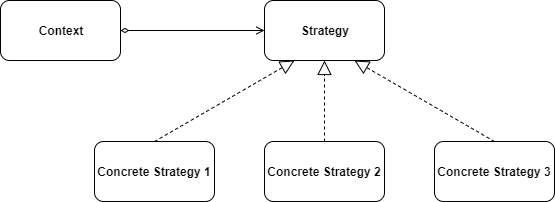

# 一. 定义
策略是对算法的封装，是一种形为模式，将每一个算法封装到具有共同接口的独立的类中，从而使得它们可以相互替换。

# 二. 优缺点
## 优点：
1. 扩展性良好；

2. 避免使用多重条件判断，遵循开闭原则；

3. 算法可以自由切换。
## 缺点：

1. 所有策略类都需要对外暴露；

2. 策略类会增多。
# 三. 使用场景
1. 一个系统需要在几种算法中动态地选择一种。

2. 系统很多类，而区别仅仅在于行为不同。
# 四. 实例
策略模式有以下几个概念：

**Strategy接口**：定义每个策略或算法必须具有的方法和属性。

**ConcreteStrategy类**：具体策略的实现；

**Context类**：上下文角色，有承上启下封装作用，负责和具体的策略实现交互。



## 示例：并发框架Disruptor有多种等待策略，案例模拟客户端需要请求具体的等待策略。
Strategy接口：
```java
public interface Strategy {
    void doSomething();
}
```
`BlockingWaitStrategy、BusySpinWaitStrategy、PhasedBackoffWaitStrategy、SleepingWaitStrategy、YieldingWaitStrategy`类：实现Strategy接口的具体策略类

```java
public class BlockingWaitStrategy implements Strategy{
    @Override
    public void doSomething() {
        System.out.println(this.getClass().getSimpleName() + "使用锁和条件变量。CPU资源的占用少，延迟大");
    }
}
public class BusySpinWaitStrategy  implements Strategy{
    @Override
    public void doSomething() {
        System.out.println(this.getClass().getSimpleName() + "自旋等待，类似Linux Kernel使用的自旋锁。低延迟但同时对CPU资源的占用也多");
    }
}
public class PhasedBackoffWaitStrategy implements Strategy {
    @Override
    public void doSomething() {
        System.out.println(this.getClass().getSimpleName() + "多种策略的综合，CPU资源的占用少，延迟大");
    }
}
public class SleepingWaitStrategy implements Strategy {
    @Override
    public void doSomething() {
        System.out.println(this.getClass().getSimpleName() + "在多次循环尝试不成功后，选择让出CPU，等待下次调度，多次调度后仍不成功，尝试前睡眠一个纳秒级别的时间再尝试。这种策略平衡了延迟和CPU资源占用，但延迟不均匀");
    }
}
public class YieldingWaitStrategy implements Strategy {
    @Override
    public void doSomething() {
        System.out.println(this.getClass().getSimpleName() + " 在多次循环尝试不成功后，选择让出CPU，等待下次调。平衡了延迟和CPU资源占用，但延迟也比较均匀");
    }
}
```
ChooseStrategy：负责和具体的策略实现交互
```java
public class ChooseStrategy {
    private Strategy strategy;

    public ChooseStrategy(Strategy strategy) {
        this.strategy = strategy;
    }

    public void getStrategy(){
        strategy.doSomething();
    }
}

```
Test:测试类
```java
public class Test {
    public static void main(String[] args) {
        ChooseStrategy choose = new ChooseStrategy(new BlockingWaitStrategy());
        choose.getStrategy();
    }
}
```
输出结果：
# 五. 总结
策略模式遵循了开闭原则，增加新的类不需要修改原有的代码，只需实现接口或者继承抽象类；同时策略模式也遵循了里氏替换原则，具体的策略类都有相同的接口，只要在有父类出现的地方都可以使用子类替代。