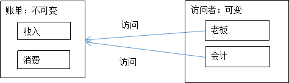

# 一. 什么是访问者模式？
比如我有一个账单，账单有收入，支出两个固定方法。但是访问账单的人不确定，有可能是一个或者多个。

# 二. 访问者模式有两个特点
1. 一般被访问的东西所持有的方法是固定的，就像账单只有收入和支出两个功能。而访问者是不固定的。

2. 数据操作与数据结构相分离：频繁的更改数据，但结构不变。比如：虽然每一天账单的数据都会变化（数据变化），但是只有两类数据，就是支出和收入（结构不变）。

简化如下图：



# 三. 示例

## 1. 创建一个账单接口，有接收访问者的功能
```java
import java.util.ArrayList;
import java.util.List;

/**
 * 创建一个账单接口，有接收访问者的功能
 * 
 * @author hgx
 *
 */
interface Bill {
    void accept(AccountBookView viewer);
}
```
## 2. 消费单子
```java

/**
 * 消费单子
 * 
 * @author hgx
 *
 */
class ConsumerBill implements Bill {

    private String item;
    private double amount;

    public ConsumerBill(String item, double amount) {
        this.item = item;
        this.amount = amount;
    }

    public void accept(AccountBookView viewer) {
        viewer.view(this);
    }

    public String getItem() {
        return item;
    }

    public double getAmount() {
        return amount;
    }

}
```
## 3. 收入单子
```java
/**
 * 收入单子
 * 
 * @author hgx
 *
 */
class IncomeBill implements Bill {

    private String item;
    private double amount;

    public IncomeBill(String item, double amount) {
        this.item = item;
        this.amount = amount;
    }

    public void accept(AccountBookView viewer) {
        viewer.view(this);
    }

    public String getItem() {
        return item;
    }

    public double getAmount() {
        return amount;
    }

}

```
## 4. 访问者接口
```java
/**
 * 访问者接口
 * 
 * @author hgx
 *
 */
interface AccountBookView {
    // 查看消费的单子
    void view(ConsumerBill consumerBill);

    // 查看收入单子
    void view(IncomeBill incomeBill);
}
```
## 5. 老板类：访问者是老板，主要查看总支出和总收入
```java

class Boss implements AccountBookView {

    private double totalConsumer;
    private double totalIncome;

    // 查看消费的单子
    public void view(ConsumerBill consumerBill) {
        totalConsumer = totalConsumer + consumerBill.getAmount();
    }

    // 查看收入单子
    public void view(IncomeBill incomeBill) {
        totalIncome = totalIncome + incomeBill.getAmount();
    }

    public void getTotalConsumer() {
        System.out.println("老板一共消费了" + totalConsumer);
    }

    public void getTotalIncome() {
        System.out.println("老板一共收入了" + totalIncome);
    }
}
```
## 6. 会计类：访问者是会计，主要记录每笔单子
```java
/**
 * 会计类：访问者是会计，主要记录每笔单子
 * 
 * @author hgx
 *
 */

class CPA implements AccountBookView {

    int count = 0;

    // 查看消费的单子
    public void view(ConsumerBill consumerBill) {
        count++;
        if (consumerBill.getItem().equals("消费")) {
            System.out.println("第" + count + "个单子消费了：" + consumerBill.getAmount());
        }
    }
    // 查看收入单子

    public void view(IncomeBill incomeBill) {

        if (incomeBill.getItem().equals("收入")) {
            System.out.println("第" + count + "个单子收入了：" + incomeBill.getAmount());
        }
    }

}
```
## 7. 账单类：用于添加账单，和为每一个账单添加访问者
```java

/**
 * 账单类：用于添加账单，和为每一个账单添加访问者
 * 
 * @author hgx
 *
 */
class AccountBook {

    private List<Bill> listBill = new ArrayList<Bill>();

    // 添加单子
    public void add(Bill bill) {
        listBill.add(bill);
    }

    // 为每个账单添加访问者
    public void show(AccountBookView viewer) {
        for (Bill b : listBill) {
            b.accept(viewer);
        }
    }
}
```

## 8. 测试类
```java
/*
 *测试类
 */
public class Test {

    public static void main(String[] args) {
        // 创建消费和收入单子
        Bill consumerBill = new ConsumerBill("消费", 3000);
        Bill incomeBill = new IncomeBill("收入", 5000);
        Bill consumerBill2 = new ConsumerBill("消费", 4000);
        Bill incomeBill2 = new IncomeBill("收入", 8000);
        // 添加账单
        AccountBook accountBook = new AccountBook();
        accountBook.add(consumerBill);
        accountBook.add(incomeBill);
        accountBook.add(consumerBill2);
        accountBook.add(incomeBill2);
        // 创建访问者
        AccountBookView boss = new Boss();
        AccountBookView cpa = new CPA();

        // 接受访问者
        accountBook.show(boss);
        accountBook.show(cpa);
        // boss查看总收入和总消费
        ((Boss) boss).getTotalConsumer();
        ((Boss) boss).getTotalIncome();

    }

}
```

# 四. 总结
访问者模式主要作用是可以对不同的元素进行不同的操作，通过多态和方法重载实现。

## 不使用访问者模式
如果不使用访问者模式，只通过一个 visit 方法进行处理，那么就需要在这个 visit 方法中进行判断，然后分别处理，代码大致如下：
```java
public class AccountViewUtil {
	public void view(AccountBookView accountBookView, AccountBook accountBook) {
		if (accountBookView instanceof Boss) {
			for(Bill b : accountBook.listBill){
			//对账单进行查看统计
			}
		} else if (accountBookView instanceof CPA) {
           //对账单进行查看统计
		}
	}
}
```

这就导致了 if-else 逻辑的嵌套以及类型的强制转换，难以扩展和维护，当类型较多时，这个 AccountViewUtil 就会很复杂。而使用 Visitor 模式，通过同一个函数对不同对元素类型进行相应对处理，使结构更加清晰、灵活性更高。


## 使用访问者模式

使用 Visitor 模式，通过同一个函数对不同对元素类型进行相应对处理，使结构更加清晰、灵活性更高。

重载的 view 方法会对元素进行不同的操作，而通过注入不同的 AccountBookViewer 又可以替换掉访问者的具体实现，使得对元素的操作变得更灵活，可扩展性更高，同时也消除了类型转换、if-else 等“丑陋”的代码。
