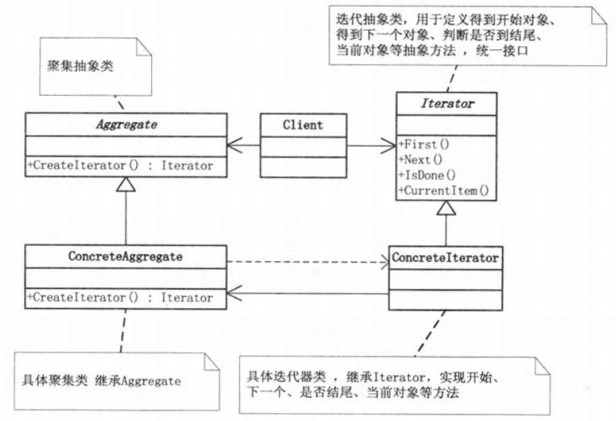

# 一、迭代器模式介绍
迭代器模式：**提供一种方法顺序的访问一个聚合对象中各个元素，而又不暴露该对象的内部表示。**

一般情况，我们自己开发时很少自定义迭代器，因为java本身已经把迭代器做到内部中了（比如：常用的list和set中都内置了迭代器）。

当然，如果真有这种需求需要我们自定义迭代器的话，可以参考jdk的迭代器实现方式来实现自己的迭代器。

迭代器是可以从前往后，或者从后往前遍历的。

为遍历不同聚集结构提供如：开始，下一个，是否有下一个，是否结束，当前哪一个等等的一个统一接口。

迭代器模式UML图：



* 聚集类：Aggregate(抽象类)和ConcreteAggregate(具体聚集类)表示聚集类，是用来存储迭代器的数据。在Aggregate(抽象类)中有一个CreateIterator方法，用来获取迭代器

* 迭代器：迭代器用来为聚集类提供服务，提供了一系列访问聚集类对象元素的方法。


# 二、模拟迭代器的实现
## 1. 首先定义一个迭代器的抽象，这里使用接口定义
```java
//迭代器接口
public interface MyIterator {
    void first();//将游标指向第一个元素
    void next();//将游标指向下一个元素
    boolean hasNext();//判断是否有下一个元素
     
    boolean isFirst();//判断是否是第一个元素
    boolean isLast();//判断是否是最后一个元素
    Object getCurrentObj();//获取当前对象
}
```

## 2. 然后自定一个一个聚集类，这里直接使用一个class来定义了。在聚集类内部，使用内部类的方式来定义迭代器的具体实现。
使用内部类来定义迭代器，好处就是可以直接使用外部类的属性
```java
import java.util.ArrayList;
import java.util.List;
 
//自定义聚集类
public class ConcreteMyAggregate {
    private List<Object> list = new ArrayList<>();
    public void addObject(Object obj){
        this.list.add(obj);
    }
    public void removeObject(Object obj){
        this.list.remove(obj);
    }
    public List<Object> getList() {
        return list;
    }
    public void setList(List<Object> list) {
        this.list = list;
    }
    //获得迭代器
    public MyIterator createIterator(){
        return new ConcreteIterator();
    }
     
    //使用内部类来定义迭代器，好处就是可以直接使用外部类的属性
    private class ConcreteIterator implements MyIterator{
        private int cursor;//定义一个迭代器游标
        @Override
        public void first() {
            cursor = 0;
        }
        @Override
        public void next() {
            if (cursor<list.size()) {
                cursor++;
            }
        }
        @Override
        public boolean hasNext() {
            //如果游标<list的大小，则说明还有下一个
            if (cursor<list.size()) {
                return true;
            }
            return false;
        }
        @Override
        public boolean isFirst() {
            return cursor==0?true:false;
        }
        @Override
        public boolean isLast() {
            //判断游标是否是容器的最后一个
            return cursor==(list.size()-1)?true:false;
        }
        @Override
        public Object getCurrentObj() {
            return list.get(cursor);//获取当前游标指向的元素
        }
    }
     
}
```
## 3. 客户端测试代码：
```java
public static void main(String[] args) {
    ConcreteMyAggregate cma = new ConcreteMyAggregate();
    cma.addObject("111");
    cma.addObject("222");
    cma.addObject("333");
    cma.addObject("444");
        
    MyIterator iterator = cma.createIterator();
    cma.removeObject("111");//如果删除一个元素的话，迭代的时候也同样会被删除
    while (iterator.hasNext()) {
        System.out.println(iterator.getCurrentObj());//获取当前对象
        iterator.next();//将游标向下移
    }
}
```

测试结果如下：
```shell
222

333

444
```

# 三. Mybatis中的迭代器模式
Mybatis的PropertyTokenizer是property包中的重量级类，该类会被reflection包中其他的类频繁的引用到。这个类实现了Iterator接口，在使用时经常被用到的是Iterator接口中的hasNext这个函数。
```java
public class PropertyTokenizer implements Iterator<PropertyTokenizer> {
	private String name;
	private String indexedName;
	private String index;
	private String children;
 
	public PropertyTokenizer(String fullname) {
		int delim = fullname.indexOf('.');
		if (delim > -1) {
			name = fullname.substring(0, delim);
			children = fullname.substring(delim + 1);
		} else {
			name = fullname;
			children = null;
		}
		indexedName = name;
		delim = name.indexOf('[');
		if (delim > -1) {
			index = name.substring(delim + 1, name.length() - 1);
			name = name.substring(0, delim);
		}
	}
 
	public String getName() {
		return name;
	}
 
	public String getIndex() {
		return index;
	}
 
	public String getIndexedName() {
		return indexedName;
	}
 
	public String getChildren() {
		return children;
	}
 
	@Override
	public boolean hasNext() {
		return children != null;
	}
 
	@Override
	public PropertyTokenizer next() {
		return new PropertyTokenizer(children);
	}
 
	@Override
	public void remove() {
		throw new UnsupportedOperationException(
				"Remove is not supported, as it has no meaning in the context of properties.");
	}
}

```
可以看到，这个类传入一个字符串到构造函数，然后提供了`next()`方法对解析后的子串进行递归遍历，是一个很常用的方法类。

