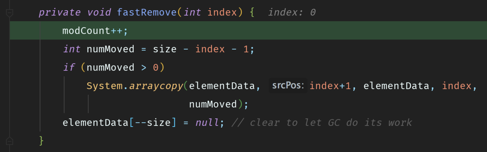
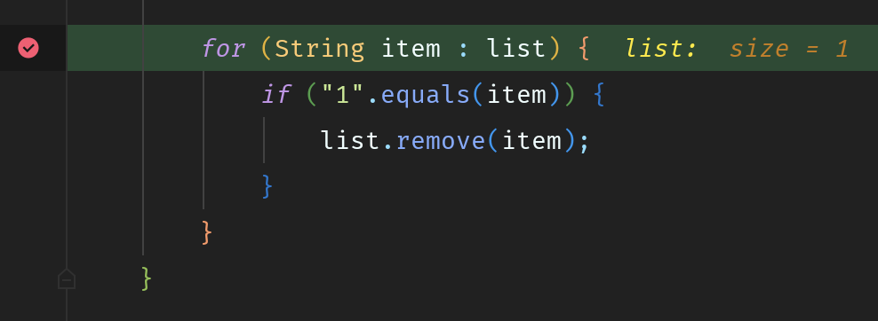
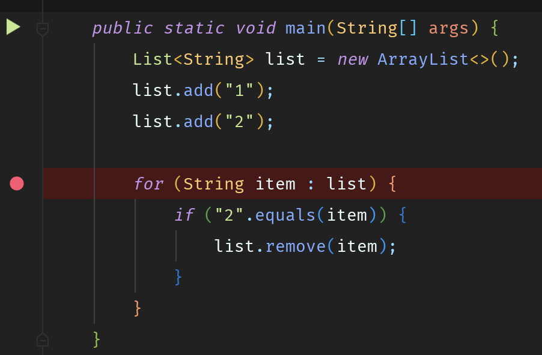
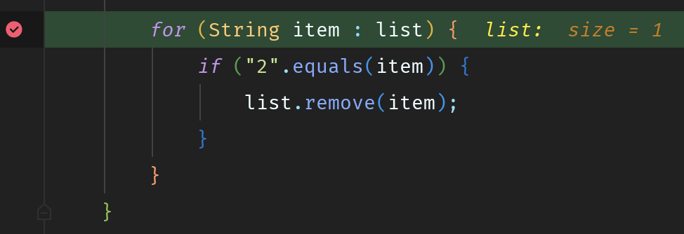
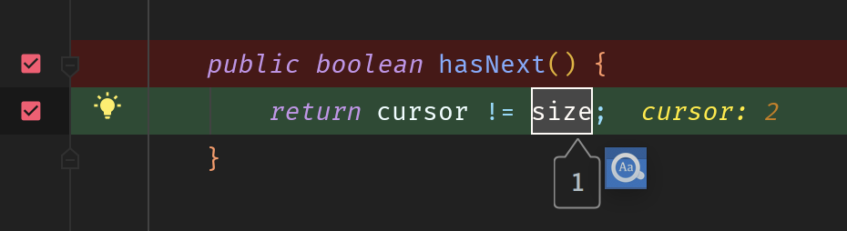
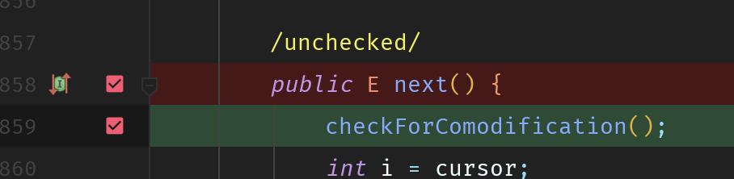

[TOC]
## 问题描述
> 【强制】不要在 foreach 循环里进行元素的 remove/add 操作。remove 元素请使用 Iterator 方式，如果并发操作，需要对 Iterator 对象加锁。

里面举了这样一个反例：
```java
List<String> list = new ArrayList<>();
list.add("1");
list.add("2");

for (String item : list) {
if ("1".equals(item)) {
list.remove(item);
}
}
```
其实Java的forEach写法内部就是迭代器，大家可以把上面的代码理解为以下代码：
```java
List<String> list = new ArrayList<>();
list.add("1");
list.add("2");

Iterator<String> iterator = list.iterator();
while (iterator.hasNext()) {
String item = iterator.next();
if ("1".equals(item)) {
list.remove(item);
}
}
```
有了这一层理解后，那我们以ArrayList为例，看看其内部的iterator方法：
```java
public Iterator<E> iterator() {
    return listIterator();
}

public ListIterator<E> listIterator(final int index) {
checkForComodification();
rangeCheckForAdd(index);
final int offset = this.offset;

return new ListIterator<E>() {
hasNext()...
next()...
...
                        }
}
```
由于`listIterator()`方法内的内部类`ListIterator`的代码太多，我就不一一贴出来了，因为我们重点只看两个方法：`hasNext()`和`next()`，接下来我会通过断点调试让大家明白为什么`ConcurrentModificationException`是偶尔出现：
## 断点调试
我在这三处地方都打了断点，这样我们就能大概清楚整个流程：


## 运行调试
### P1
好的，我们看到已经定位到第一个断点位置了，从idea提供的信息我们也可以看出list的大小为2：


接着往下走，又来到了第二个断点的位置，在上面我已经说了forEach的语法的原理了，所以这样会走到haxNext()函数这里，这里的cursor是指当前迭代器的指针，而size是当前集合的大小：


继续走，我们会来到第三个断点：


#### 圈红1

注意我圈红的第一处地方，我们进入checkForComodification里：
```java
final void checkForComodification() {
   if (modCount != expectedModCount)
   throw new ConcurrentModificationException();
 }
```
可以看到，这就是我们报错的关键点，这里的modCount变量是指集合被操作的次数，比如像add()、remove()这些方法都会让modCount + 1，而expectedModCount是指集合的一个预期操作次数，在部分操作里会被重置为modCount，比如add()方法里。
因为我们上面添加了两个元素，所以modCount和expectedModCount都是2。

#### 圈红2

接着我们看第二处圈红的地方，我们可以发现，每一次next()的时候指针都会移动，这很好理解。

### P2

断点继续，因为第一个元素就是1，所以这里匹配上了：


我们进入到remove()方法里面，因为我们是按照对象删除的，所以会进入第二个分支：


接着我们再进入fastRemove()方法，可以看到modCount + 1了：



### P3
继续往下走，我们又回到最开始的地方，但仔细点你会发现list的大小从2变成1了：



然后我们又来到了hasNext()这里了，因为cursor和size都是1，所以循环就终止了：


## 吃鲸

这里你是不是懵逼了，咦？说好的报错呢？怎么没报错了？
咳咳，其实是因为有时候会出现像上面这种巧合的情况，就是在hasNext()方法校验的时候，cursor刚好不等于size，然后就退出了，而刚好集合又遍历完了，but，这个情况是很少出现的，一般都会抛出ConcurrentModificationException异常，所以大家不要有侥幸的心理。


## 还原报错
下面我们还是以上面的例子，只是这次我把删除的对象从1改为2：



运行调试后跟上面的P1和P2是一样的，所以这里我就不重复了，唯一不同的地方在P3。这里我们已经来到第二次循环，校验元素后会删除元素2：


在第三次循环，（这里是指第三次进行hasNext()）的时候，我们可以看到list的大小是1了：



ok，我们继续往下，这里大家要特别注意，可以看到cursor此时是2，而size却是1，所以循环还可以继续：



前面我们说过next()方法里的checkForComodification()是检查操作次数的，所以这里就不复述了：



我们进入到checkForComodification()里，可以看到modCount是3（因为remove()操作**modCount**自增了），而expectedModCount是2，所以就报错了：
**这时已经循环遍历完成了，但是因为这时modCount！=expectedModCount，所以hasNext=true，会再次进入循环，这时就会报错了**


## 为什么使用迭代器，不会报错
```java
public void remove() {
            if (lastRet < 0)
                throw new IllegalStateException();
            checkForComodification();

            try {
                ArrayList.this.remove(lastRet);
                cursor = lastRet;
                lastRet = -1;
                expectedModCount = modCount;
            } catch (IndexOutOfBoundsException ex) {
                throw new ConcurrentModificationException();
            }
        }
```
因为迭代器中的remode()方法，`expectedModCount`被赋值为`modCount`，这样就永远不会有`expectedModCount！= modCount`

## 为什么list的remove方法不能增加`expectedModCount = modCount`

1. ArrayList是非线程安全的，在操作过程中如果有别的线程修改集合内容，那集合数据可能就不准确了，这时候抛出异常避免继续执行可以看做是个**快速失败**的方法

2. 事实上线程安全本身就不允许读的时候被修改。故即使使用迭代器，也要对其加锁。
