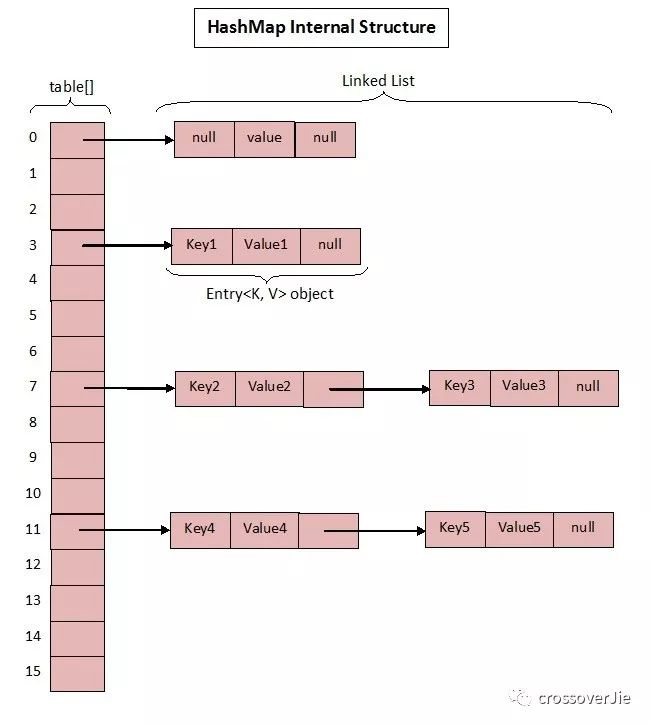
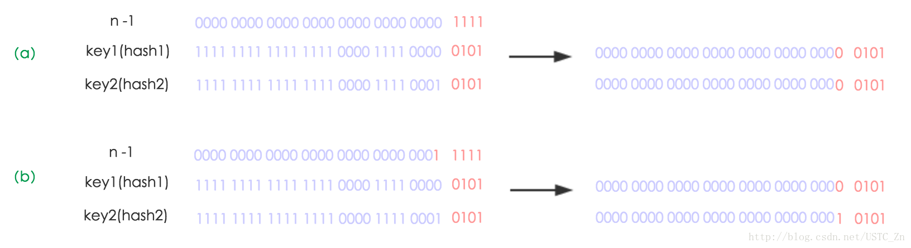
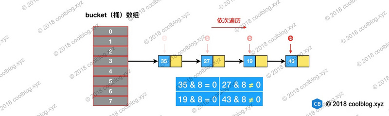
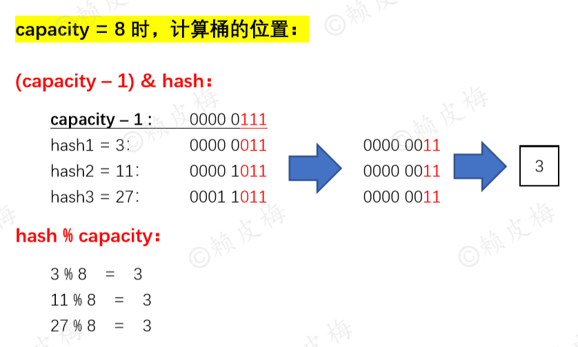
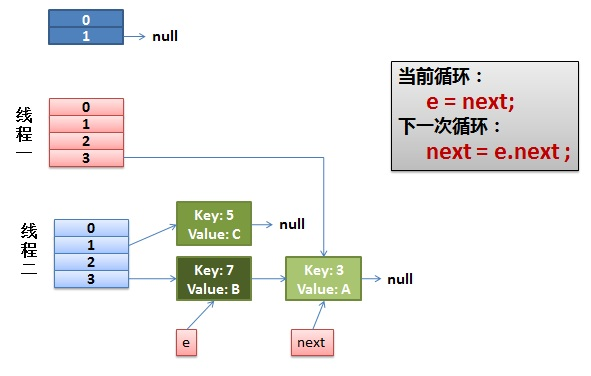
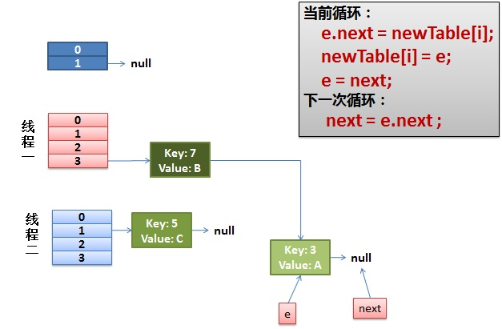
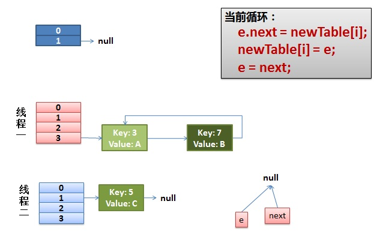

[TOC]
众所周知 HashMap 底层是基于 数组 + 链表 组成的，不过在 jdk1.7 和 1.8 中具体实现稍有不同。
# Base 1.7

1.7 中的数据结构图：




先来看看 1.7 中的实现。
```java
  /**
     * The default initial capacity - MUST be a power of two.
     * 初始化桶大小，因为底层是数组，所以这是数组默认的大小
     */
    static final int DEFAULT_INITIAL_CAPACITY = 1 << 4; // aka 16

    /**
     * The maximum capacity, used if a higher value is implicitly specified
     * by either of the constructors with arguments.
     * MUST be a power of two <= 1<<30.
     * 桶最大值
     */
    static final int MAXIMUM_CAPACITY = 1 << 30;

    /**
     * The load factor used when none specified in constructor.
     * 默认的负载因子（0.75）
     */
    static final float DEFAULT_LOAD_FACTOR = 0.75f;

    /**
     * An empty table instance to share when the table is not inflated.
     */
    static final Entry<?,?>[] EMPTY_TABLE = {};

    /**
     * The table, resized as necessary. Length MUST Always be a power of two.
     * 真正存放数据的数组
     */
    transient Entry<K,V>[] table = (Entry<K,V>[]) EMPTY_TABLE;

    /**
     * The number of key-value mappings contained in this map.
     * Map存放元素的数量大小
     */
    transient int size;


    // 每次扩容和更改map结构的计数器
    transient int modCount;   
    /**
     * The next size value at which to resize (capacity * load factor).
     * @serial
     * 临界值 当实际大小(容量*填充因子)超过临界值时，会进行扩容
     */
    // If table == EMPTY_TABLE then this is the initial capacity at which the
    // table will be created when inflated.
    int threshold;

    /**
     * The load factor for the hash table.
     * 负载因子，可在初始化时显式指定。
     * @serial
     */
    final float loadFactor;
```
重点解释下负载因子：
由于给定的 HashMap 的容量大小是固定的，比如默认初始化：
```java
 1    public HashMap() {
 2        this(DEFAULT_INITIAL_CAPACITY, DEFAULT_LOAD_FACTOR);
 3    }
 4
 5    public HashMap(int initialCapacity, float loadFactor) {
 6        if (initialCapacity < 0)
 7            throw new IllegalArgumentException("Illegal initial capacity: " +
 8                                               initialCapacity);
 9        if (initialCapacity > MAXIMUM_CAPACITY)
10            initialCapacity = MAXIMUM_CAPACITY;
11        if (loadFactor <= 0 || Float.isNaN(loadFactor))
12            throw new IllegalArgumentException("Illegal load factor: " +
13                                               loadFactor);
14
15        this.loadFactor = loadFactor;
16        threshold = initialCapacity;
17        init();
18    }
```

给定的默认容量为 16，负载因子为 0.75。Map 在使用过程中不断的往里面存放数据，当数量达到了 16 * 0.75 = 12 就需要将当前 16 的容量进行扩容，而扩容这个过程涉及到 rehash、复制数据等操作，所以非常消耗性能。

因此通常建议能提前预估 HashMap 的大小最好，尽量的减少扩容带来的性能损耗。

根据代码可以看到其实真正存放数据的是
`transient Entry<K,V>[] table = (Entry<K,V>[]) EMPTY_TABLE;`
**该数据大小总是2的幂次倍**

这个数组，那么它又是如何定义的呢？
```java
static class Entry<K,V> implements Map.Entry<K,V> {
        final K key;
        V value;
        Entry<K,V> next;
        int hash;

        /**
         * Creates new entry.
         */
        Entry(int h, K k, V v, Entry<K,V> n) {
            value = v;
            next = n;
            key = k;
            hash = h;
        }

        public final K getKey() {
            return key;
        }

        public final V getValue() {
            return value;
        }

        public final V setValue(V newValue) {
            V oldValue = value;
            value = newValue;
            return oldValue;
        }

```
Entry 是 HashMap 中的一个内部类，从他的成员变量很容易看出：
* key 就是写入时的键。
* value 自然就是值。
* 开始的时候就提到 HashMap 是由数组和链表组成，所以这个 next 就是用于实现链表结构。
* hash 存放的是当前 key 的 hashcode。

## put 方法
```java
 1    public V put(K key, V value) {
 2        if (table == EMPTY_TABLE) {// 判断当前数组是否需要初始化。
 3            inflateTable(threshold);
 4        }
 5        if (key == null)// 如果 key 为空，则 put 一个空值进去。
 6            return putForNullKey(value);
 7        int hash = hash(key);//根据 key 计算出 hashcode。
 8        int i = indexFor(hash, table.length);// 根据计算出的 hashcode 定位出所在桶。
 9        for (Entry<K,V> e = table[i]; e != null; e = e.next) {//如果桶是一个链表则需要遍历判断里面的 hashcode、key 是否和传入 key 相等，如果相等则进行覆盖，并返回原来的值。
10            Object k;
11            if (e.hash == hash && ((k = e.key) == key || key.equals(k))) {
12                V oldValue = e.value;
13                e.value = value;
14                e.recordAccess(this);
15                return oldValue;
16            }
17        }
18
19        modCount++;
20        addEntry(hash, key, value, i);//如果桶是空的，说明当前位置没有数据存入；新增一个 Entry 对象写入当前位置。
21        return null;
22    }
```
### addEntry方法：
```java
 1    void addEntry(int hash, K key, V value, int bucketIndex) {
 2        if ((size >= threshold) && (null != table[bucketIndex])) {
 3            resize(2 * table.length);
 4            hash = (null != key) ? hash(key) : 0;
 5            bucketIndex = indexFor(hash, table.length);
 6        }
 7
 8        createEntry(hash, key, value, bucketIndex);
 9    }
10
11    void createEntry(int hash, K key, V value, int bucketIndex) {
12        Entry<K,V> e = table[bucketIndex];// 1. 把table中该位置原来的Entry保存  
13        table[bucketIndex] = new Entry<>(hash, key, value, e);//2. 在table中该位置新建一个Entry：将原头结点位置（数组上）的键值对 放入到（链表）后1个节点中、将需插入的键值对 放入到头结点中（数组上）-> 从而形成链表 即 在插入元素时，是在链表头插入的，table中的每个位置永远只保存最新插入的Entry，旧的Entry则放入到链表中（即 解决Hash冲突）;这个可参照entry的构造方法。
14        size++;
15    }
```
* 当调用 addEntry 写入 Entry 时需要判断是否需要扩容。

* 如果需要**就进行两倍扩充**，并将当前的 key 重新 hash 并定位。

* 而在 createEntry 中会将当前位置的桶传入到新建的桶中，如果当前桶有值就会在位置形成链表。

## get 方法
```java
 1    public V get(Object key) {
 2        if (key == null)
 3            return getForNullKey();
 4        Entry<K,V> entry = getEntry(key);
 5
 6        return null == entry ? null : entry.getValue();
 7    }
 8
 9    final Entry<K,V> getEntry(Object key) {
10        if (size == 0) {
11            return null;
12        }
13
14        int hash = (key == null) ? 0 : hash(key);// 根据 key 计算出 hashcode，然后定位到具体的桶中。
15        for (Entry<K,V> e = table[indexFor(hash, table.length)];
16             e != null;
17             e = e.next) {//判断该位置是否为链表。
18            Object k;
19            if (e.hash == hash &&
20                ((k = e.key) == key || (key != null && key.equals(k))))//不是链表就根据 key、key 的 hashcode 是否相等来返回值。是链表则需要遍历直到 key 及 hashcode 相等时候就返回值。
21                return e;
22        }
23        return null;// 啥都没取到就直接返回 null 。
24    }
```
## 扩容机制

```java
 void resize(int newCapacity) {   //传入新的容量
      Entry[] oldTable = table;    //引用扩容前的Entry数组
      int oldCapacity = oldTable.length;         
      if (oldCapacity == MAXIMUM_CAPACITY) {  //扩容前的数组大小如果已经达到最大(2^30)了
          threshold = Integer.MAX_VALUE; //修改阈值为int的最大值(2^31-1)，这样以后就不会扩容了
          return;//所以此时不再扩容，因为2倍扩容后，会导致int整形溢出。
      }
  
      Entry[] newTable = new Entry[newCapacity];  //初始化一个新的Entry数组
      transfer(newTable);                         //！！将数据转移到新的Entry数组里
      table = newTable;                           //HashMap的table属性引用新的Entry数组
      threshold = (int)(newCapacity * loadFactor);//修改阈值
 }
```
```java
//JDK1 .7 扩容最核心的方法，newTable为扩容后的新数组
/**
   * 作用：将旧数组上的数据（键值对）转移到新table中，从而完成扩容
   * 过程：按旧链表的正序遍历链表、在新链表的头部依次插入
   */ 
void transfer(Entry[] newTable) {
      // 1. src引用了旧数组
      Entry[] src = table; 

      // 2. 获取新数组的大小 = 获取新容量大小                 
      int newCapacity = newTable.length;

      // 3. 通过遍历 旧数组，将旧数组上的数据（键值对）转移到新数组中
      for (int j = 0; j < src.length; j++) { 
      	  // 3.1 取得旧数组的每个元素  
          Entry<K,V> e = src[j];           
          if (e != null) {
              // 3.2 释放旧数组的对象引用（for循环后，旧数组不再引用任何对象）
              src[j] = null; 

              do { 
                  // 3.3 遍历 以该数组元素为首 的链表
                  // 注：转移链表时，因是单链表，故要保存下1个结点，否则转移后链表会断开
                 Entry<K,V> next = e.next; 
                 // 3.4 重新计算每个元素的存储位置
                 int i = indexFor(e.hash, newCapacity); 
                 // 3.5 将元素放在数组上：采用单链表的头插入方式 = 在链表头上存放数据 = 将数组位置的原有数据放在后1个指针、将需放入的数据放到数组位置中
                 // 即 扩容后，可能出现逆序：按旧链表的正序遍历链表、在新链表的头部依次插入
                 e.next = newTable[i]; //将数组位置的原有数据放在后1个指针
                 newTable[i] = e;  
                 // 3.6 访问下1个Entry链上的元素，如此不断循环，直到遍历完该链表上的所有节点
                 e = next;             
             } while (e != null);
             // 如此不断循环，直到遍历完数组上的所有数据元素
         }
     }
 }
```

# Base 1.8

不知道 1.7 的实现大家看出需要优化的点没有？

其实一个很明显的地方就是：

>当 Hash 冲突严重时，在桶上形成的链表会变的越来越长，这样在查询时的效率就会越来越低；时间复杂度为 O(N)。

因此 1.8 中重点优化了这个查询效率。

1.8 HashMap 结构图：


先来看看几个核心的成员变量：

```java
 1    static final int DEFAULT_INITIAL_CAPACITY = 1 << 4; // aka 16
 2
 3    /**
 4     * The maximum capacity, used if a higher value is implicitly specified
 5     * by either of the constructors with arguments.
 6     * MUST be a power of two <= 1<<30.
 7     */
 8    static final int MAXIMUM_CAPACITY = 1 << 30;
 9
10    /**
11     * The load factor used when none specified in constructor.
12     */
13    static final float DEFAULT_LOAD_FACTOR = 0.75f;
14    // 用于判断是否需要将链表转换为红黑树的阈值。
15    static final int TREEIFY_THRESHOLD = 8;
16   // 存储元素的数组，总是2的幂次倍
17    transient Node<K,V>[] table;
18
19    /**
20     * Holds cached entrySet(). Note that AbstractMap fields are used
21     * for keySet() and values().
22     */
23    transient Set<Map.Entry<K,V>> entrySet;
24
25    /**
26     * The number of key-value mappings contained in this map.
27     */
28    transient int size;
```

和 1.7 大体上都差不多，还是有几个重要的区别：

* TREEIFY_THRESHOLD 用于判断是否需要将链表转换为红黑树的阈值。

* Entry数组 修改为 Node数组;。

Node 的核心组成其实也是和 1.7 中的 HashEntry 一样，存放的都是 key value hashcode next 等数据。

Node是HashMap的一个内部类，实现了Map.Entry接口，本质是就是一个映射(键值对)。
```java
//Node是单向链表，它实现了Map.Entry接口
static class Node<k,v> implements Map.Entry<k,v> {
    final int hash;
    final K key;
    V value;
    Node<k,v> next;
    //构造函数Hash值 键 值 下一个节点
    Node(int hash, K key, V value, Node<k,v> next) {
        this.hash = hash;
        this.key = key;
        this.value = value;
        this.next = next;
    }
 
    public final K getKey()        { return key; }
    public final V getValue()      { return value; }
    public final String toString() { return key + = + value; }
 
    public final int hashCode() {
        return Objects.hashCode(key) ^ Objects.hashCode(value);
    }
 
    public final V setValue(V newValue) {
        V oldValue = value;
        value = newValue;
        return oldValue;
    }
    //判断两个node是否相等,若key和value都相等，返回true。可以与自身比较为true
    public final boolean equals(Object o) {
        if (o == this)
            return true;
        if (o instanceof Map.Entry) {
            Map.Entry<!--?,?--> e = (Map.Entry<!--?,?-->)o;
            if (Objects.equals(key, e.getKey()) &&
                Objects.equals(value, e.getValue()))
                return true;
        }
        return false;
    }
}
```
node中包含一个next变量，这个就是链表的关键点，hash结果相同的元素就是通过这个next进行关联的。

> HashMap的最大容量为什么是2的30次方(1左移30)?
```java
/**
     * The maximum capacity, used if a higher value is implicitly specified
     * by either of the constructors with arguments.
     * MUST be a power of two <= 1<<30.
     */
static final int MAXIMUM_CAPACITY = 1 << 30;
```
> 为什么是30?

1 << 30。它代表将1左移30位，也就是0010...0,共31位。
```java
public static void main(String[] args){
        for (int i = 30; i <= 33; i++) {
            System.out.println("1 << "+ i +" = "+(1 << i));
        }
        System.out.println("1 << -1 = " + (1 << -1));

}
```
输出结果为：
```log
1 << 30 = 1073741824 
1 << 31 = -2147483648 
1 << 32 = 1 
1 << 33 = 2 
1 << -1 = -2147483648
```

结果分析：

* int类型是32位整型，占4个字节。

* Java的原始类型里没有无符号类型。 -->**所以首位是符号位 正数为0，负数为1**

* java中存放的是补码，1左移31位的为-2147483648，移位后共32位，首位为1，所以为负数，故最大只能是30。

>为什么是 1 << 30,而不是`0x7ffffff`即`Integer.MAX_VALUE`

代码的注释：如果构造函数传入的值大于该数 ，那么替换成该数。
但在resize()方法中有一句：
```java
if (oldCap >= MAXIMUM_CAPACITY) {
                threshold = Integer.MAX_VALUE;
                return oldTab;
}
```
在这里我们可以看到其实 hashmap的“最大容量“是Integer.MAX_VALUE;

原因是：**靠移位这种运算，移位结束后，第32位为0，第31位是1，后面全是0，但最大值是，第32位为0，后面全是1，即为Integer.MAX_VALUE。**

总结：
* MAXIMUM_CAPACITY作为一个2的幂方中最大值，这个值的作用涉及的比较广。其中有一点比较重要的是在hashmap中容量会确保是 2的k次方，即使你传入的初始容量不是 2的k次方，tableSizeFor()方法也会将你的容量置为 2的k次方。这时候MAX_VALUE就代表了最大的容量值。

* threshold = 初始容量 * 加载因子。也就是扩容的门槛。相当于实际使用的容量。而**扩容都是翻倍的扩容即乘以2**。那么**当容量到达MAXIMUM_CAPACITY，这时候再扩容就是 1 << 31 整型溢出。所以Integer.MAX_VALUE作为最终的容量，但是是一个threshold的身份。**


## 构造函数
HashMap有四种构造方法，这里只说最核心的一个，只说传入初始容量和负载因子这种。
```java

/**
 * 核心构造方法
 * @param  initialCapacity 初始化容量
 * @param  loadFactor      负载因子
 */
public HashMap(int initialCapacity, float loadFactor) {
    // 初始容量小于0，抛异常
    if (initialCapacity < 0)
        throw new IllegalArgumentException("Illegal initial capacity: " +
                                           initialCapacity);
    // 如果大于了最大容量，就转成最大容量
    if (initialCapacity > MAXIMUM_CAPACITY)
        initialCapacity = MAXIMUM_CAPACITY;
    // 负载因子小于0或是个非法数字(除数为0这种)，抛异常
    if (loadFactor <= 0 || Float.isNaN(loadFactor))
        throw new IllegalArgumentException("Illegal load factor: " +
                                           loadFactor);
    this.loadFactor = loadFactor;
    // 这里初始容量赋值给了阀值，后面会用到，后面在resize()方法进行初始化时，会用到initialCapacity，故那里用的是threshold
    this.threshold = tableSizeFor(initialCapacity);
}
```

在构造方法中，并没有对table（桶数组）这个成员变量进行初始化，table的初始化被推迟到了put方法中，在put方法中会对threshold重新计算，即在put()方法的resize()方法中。

>  为什么初始化容量都是2的次幂

`tableSizeFor(initialCapacity)`方法是用来计算初始容量的，HashMap容量并不是传多少就是多少，而一定是2的次幂。这个方法会返回一个比给定容量大的最小2的次幂的数。


举个例子:如果你给了9，比9大的最小2的次幂是16(2^4)；如果你给个27，比27大的最小的2的次幂是32(2^5)。
```java
static final int tableSizeFor(int cap) {
    // 先是将cap减1，否则，如果cap是2的次幂，例如16，计算结果就是32，是我们需要的容量的2倍
    int n = cap - 1;
    // 这里是先将n无符号右移，再与n进行或运算并赋值给n 
    // 这样好理解一点 =>  n = n | (n >>> 1)
    n |= n >>> 1;
    n |= n >>> 2;
    n |= n >>> 4;
    n |= n >>> 8;
    n |= n >>> 16;//因为int类型时32位整数，上述每次操作，都会导致2倍的数变为1，即右移1位，会有二进制中2个数变为1，其他依次类推，所以，最大为右移16位，会让32位整数全部变为1。但此时再加1会导致整型溢出。
    // 如果n<0返回1
    // 如果n>最大容量返回最大容量
    // 否则返回 n+1
    return (n < 0) ? 1 : (n >= MAXIMUM_CAPACITY) ? MAXIMUM_CAPACITY : n + 1;
}
```

最后算出来就是32位以内最高位那个1后面跟的都是1，然后n≠1的情况下会加个1，就是我们要的结果，这里结果是2^8，原来那个显然是大于2^7的一个数。精妙！


## hash算法
```java
static final int hash(Object key) {
    int h;
    return (key == null) ? 0 : (h = key.hashCode()) ^ (h >>> 16);
}
```

1. 获取对象的hashCode()值

2. 将hashCode值右移16位，右移后原来的二进制值就变为低位。

3. 将右移后的值与原来的hashCode做**异或**运算，返回结果。因为异或，所以返回的结果为原来的hashcode和右移后的值一起组成。

4. 其中h>>>16，在JDK1.8中，优化了高位运算的算法，使用了零扩展，无论正数还是负数，都在高位插入0。
### 为什么要这么做

因为通常声明map集合时不会指定大小，也不会在初始化的时候就创建一个容量很大的map对象，

导致这个在put()方法中确定桶的位置时，使用的算法（(capacity - 1) & hash）只会对低位进行计算。会提高hash碰撞率。

因为容量的2进制高位一开始都是0，所以在key的hash算法中，将key的hashCode右移16位再与自身**异或**，
这样key的hash方法的返回值为原来的hashcode（作为高位）和右移后的值（作为低位）一起组成。

高位也可以参与hash，更大程度上减少了碰撞率。

示例：


## put 方法

```java
public V put(K key, V value) {
        return putVal(hash(key), key, value, false, true);
    }

    /**
     * Implements Map.put and related methods.
     *
     * @param hash hash for key
     * @param key the key
     * @param value the value to put
     * @param onlyIfAbsent if true, don't change existing value
     * @param evict if false, the table is in creation mode.
     * @return previous value, or null if none
     */
    final V putVal(int hash, K key, V value, boolean onlyIfAbsent,
                   boolean evict) {
        Node<K,V>[] tab; Node<K,V> p; int n, i;
        if ((tab = table) == null || (n = tab.length) == 0)
            n = (tab = resize()).length;// 判断当前桶是否为空，空的就需要初始化（resize 中会判断是否进行初始化）。
        if ((p = tab[i = (n - 1) & hash]) == null)//根据当前 key 的 hashcode 定位到具体的桶中并判断是否为空，为空表明没有 Hash 冲突就直接在当前位置创建一个新桶即可。
            tab[i] = newNode(hash, key, value, null);
        else {// 不为空，说明定位到的桶非空，存在hash冲突
            Node<K,V> e; K k;
            if (p.hash == hash &&
                ((k = p.key) == key || (key != null && key.equals(k))))
                e = p;//如果当前桶有值（ Hash 冲突），那么就要比较当前桶中的 key、key 的 hashcode 与写入的 key 是否相等，相等就赋值给 e
            else if (p instanceof TreeNode)//如果当前桶为红黑树，那就要按照红黑树的方式写入数据。
                e = ((TreeNode<K,V>)p).putTreeVal(this, tab, hash, key, value);
            else {//如果是个链表，就需要将当前的 key、value 封装成一个新节点写入到当前桶的后面（形成链表）。
                for (int binCount = 0; ; ++binCount) {
                    if ((e = p.next) == null) {
                        p.next = newNode(hash, key, value, null);
                        if (binCount >= TREEIFY_THRESHOLD - 1) // -1 for 1st
                            treeifyBin(tab, hash);//接着判断当前链表的大小是否大于预设的阈值，大于时就要转换为红黑树。
                        break;
                    }
                    if (e.hash == hash && //如果在遍历过程中找到 key 相同时直接退出遍历。
                        ((k = e.key) == key || (key != null && key.equals(k))))
                        break;
                    p = e;
                }
            }
            if (e != null) { // existing mapping for key,如果 e != null ，表示在桶中找到key值、hash值与插入元素相等的结点，就相当于存在相同的 key,那就需要将值覆盖。
                V oldValue = e.value;
                if (!onlyIfAbsent || oldValue == null)
                    e.value = value;
                afterNodeAccess(e);
                return oldValue; //HashMap的put会返回key的上一次保存的数据
            }
        }
        ++modCount;
        if (++size > threshold)//最后判断是否需要进行扩容。
            resize();
        afterNodeInsertion(evict);
        return null; 
    }

```
## get 方法
```java
1    public V get(Object key) {
2        Node<K,V> e;
3        return (e = getNode(hash(key), key)) == null ? null : e.value;
4    }
5
6    final Node<K,V> getNode(int hash, Object key) {
7        Node<K,V>[] tab; Node<K,V> first, e; int n; K k;
8        if ((tab = table) != null && (n = tab.length) > 0 &&
9            (first = tab[(n - 1) & hash]) != null) {//首先将 key hash 之后取得所定位的桶。如果桶为空则直接返回 null 。
10            if (first.hash == hash && // always check first node,判断桶的第一个位置(有可能是链表、红黑树)的 key 是否为查询的 key，是就直接返回 value。
11                ((k = first.key) == key || (key != null && key.equals(k))))
12                return first;
13            if ((e = first.next) != null) {//如果第一个不匹配，则判断它的下一个是红黑树还是链表。
14                if (first instanceof TreeNode)//红黑树就按照树的查找方式返回值。
15                    return ((TreeNode<K,V>)first).getTreeNode(hash, key);
16                do {//不然就按照链表的方式遍历匹配返回值。
17                    if (e.hash == hash &&
18                        ((k = e.key) == key || (key != null && key.equals(k))))
19                        return e;
20                } while ((e = e.next) != null);
21            }
22        }
23        return null;
24    }
```
从这两个核心方法（get/put）可以看出 1.8 中对大链表做了优化，修改为红黑树之后查询效率直接提高到了 `O(logn)`.

## 扩容机制
### 思想
经过观测可以发现，我们使用的是2次幂的扩展(指长度扩为原来2倍)，

所以，元素的位置要么是在原位置，要么是在原位置再移动2次幂的位置。

看下图可以明白这句话的意思，

n为table的长度，

图（a）表示扩容前的key1和key2两种key确定索引位置的示例，

图（b）表示扩容后key1和key2两种key确定索引位置的示例，其中hash1是key1对应的哈希与高位运算结果。



元素在重新计算hash之后，因为n变为2倍，那么n-1的mask范围在高位多1bit(红色)，因此新的index就会发生这样的变化：


因此，我们在扩充HashMap的时候，不需要像JDK1.7的那样将所有元素重新排列，只需要看看计算完hash值后，跟原来的hash值新增的那个bit是1还是0就好了，是0的话索引没变，是1的话索引变成“原索引+oldCap”，可以看看下图为16扩充为32的resize示意图.


### 源码
```java
final Node<K,V>[] resize() {
    Node<K,V>[] oldTab = table;//oldTab指向hash桶数组
    int oldCap = (oldTab == null) ? 0 : oldTab.length;
    int oldThr = threshold;
    int newCap, newThr = 0;
    if (oldCap > 0) {//如果oldCap不为空的话，就是hash桶数组不为空，故此时不需要初始化。
        if (oldCap >= MAXIMUM_CAPACITY) {//如果大于最大容量了，就赋值为整数最大的阀值
            threshold = Integer.MAX_VALUE;
            return oldTab;//返回
        }//如果当前hash桶数组的长度在扩容后仍然小于最大容量 并且oldCap大于默认值16
        else if ((newCap = oldCap << 1) < MAXIMUM_CAPACITY &&
                 oldCap >= DEFAULT_INITIAL_CAPACITY)
            newThr = oldThr << 1; // double threshold 双倍扩容阀值threshold,这时有可能导致newThr溢出后归0.
    }
    else if (oldThr > 0) // initial capacity was placed in threshold，此时说明oldCap不大于0，故需要初始化桶数组。
        newCap = oldThr;//HashMap 使用 threshold 变量暂时保存 initialCapacity 参数的值,故初始化时，将 threshold 的值赋值给 newCap，
    else {// zero initial threshold signifies using defaults调用无参构造方法时，桶数组容量为默认容量，阈值为默认容量与默认负载因子乘积
        newCap = DEFAULT_INITIAL_CAPACITY;
        newThr = (int)(DEFAULT_LOAD_FACTOR * DEFAULT_INITIAL_CAPACITY);
    }
    if (newThr == 0) {// newThr 为 0 时，按阈值计算公式进行计算，用于覆盖上一个条件分支未计算 newThr 或嵌套分支在计算过程中导致 newThr 溢出归零的情况
        float ft = (float)newCap * loadFactor;
        newThr = (newCap < MAXIMUM_CAPACITY && ft < (float)MAXIMUM_CAPACITY ?
                  (int)ft : Integer.MAX_VALUE);
    }
    threshold = newThr;
    @SuppressWarnings({"rawtypes","unchecked"})
    // 创建新的桶数组，桶数组的初始化也是在这里完成的
    Node<K,V>[] newTab = (Node<K,V>[])new Node[newCap];
    table = newTab;
    if (oldTab != null) {
        // 如果旧的桶数组不为空，则遍历桶数组，并将键值对映射到新的桶数组中
        //重新映射节点需要考虑节点类型。
        //对于树形节点，需先拆分红黑树再映射。
        //对于链表类型节点，则需先对链表进行分组，然后再映射。需要的注意的是，分组后，组内节点相对位置保持不变
        for (int j = 0; j < oldCap; ++j) {
            Node<K,V> e;
            if ((e = oldTab[j]) != null) {//如果旧的hash桶数组在j结点处不为空，复制给e
                oldTab[j] = null;//将旧的hash桶数组在j结点处设置为空，方便gc
                if (e.next == null)//如果e后面没有Node结点
                    newTab[e.hash & (newCap - 1)] = e;//直接对e的hash值对新的数组长度求模获得存储位置
                else if (e instanceof TreeNode)//如果e是红黑树的类型，那么添加到红黑树中
                    ((TreeNode<K,V>)e).split(this, newTab, j, oldCap);
                else { // preserve order
                    Node<K,V> loHead = null, loTail = null;
                    Node<K,V> hiHead = null, hiTail = null;
                    Node<K,V> next;
                    do {
                        next = e.next;
                        if ((e.hash & oldCap) == 0) {//假设e.hash=35(100011),oldCap=8（001000），newCap为16（010000），e.hash&(newCap-1)=000011,e.hash&oldCap=000000.正好得到上一节讲的多出的1bit的值
                            if (loTail == null)
                                loHead = e;
                            else
                                loTail.next = e;
                            loTail = e;
                        }
                        else {//如果结点e的hash值与原hash桶数组的长度作与运算不为0
                            if (hiTail == null)
                                hiHead = e;
                            else
                                hiTail.next = e;
                            hiTail = e;
                        }
                    } while ((e = next) != null);
                    if (loTail != null) {
                        loTail.next = null;
                        newTab[j] = loHead;
                    }
                    if (hiTail != null) {
                        hiTail.next = null;
                        newTab[j + oldCap] = hiHead;
                    }
                }
            }
        }
    }
    return newTab;
}
```
#### 举例分析


假设我们上图的桶数组进行扩容，扩容后容量 n = 16，重新映射过程如下:

依次遍历链表，并计算节点 `hash & oldCap` 的值。如下图所示



如果值为0，将 loHead 和 loTail 指向这个节点。

如果后面还有节点 hash & oldCap 为0的话，则将节点链入 loHead 指向的链表中，并将 loTail 指向该节点。

如果值为非0的话，则让 hiHead 和 hiTail 指向该节点。

完成遍历后，可能会得到两条链表，此时就完成了链表分组：


最后再将这两条链接存放到相应的桶中，完成扩容。如下图：


**重新映射后，两条链表中的节点顺序并未发生变化，还是保持了扩容前的顺序.**
**在JDK1.8中采用的是分组后，尾插法。可避免1.7中的死循环。但是会造成数据丢失**

后续还有[红黑树的树化和链化](https://segmentfault.com/a/1190000012926722)
[HashMap分析之红黑树树化过程](https://www.cnblogs.com/finite/p/8251587.html)
# 问题
## 1. 为什么HashMap的容量一定要是2的n次幂？或者说，保证“HashMap的容量一定是2的n次幂”有什么好处？
> 原因，因为 `&` 运算的效率高于`%`运算。 只有容量是2的n次幂，才能保证`hash % capacity` 与` (capacity - 1) & hash` 结果一致。

在put方法中需要获取key的位置
```java
final V putVal(int hash, K key, V value, boolean onlyIfAbsent,
                boolean evict) {
    ...

    if ((p = tab[i = (n - 1) & hash]) == null)//获取位置
        tab[i] = newNode(hash, key, value, null);
    ...
}
```
一般一个元素放到哪个桶中，是通过 `hash % capacity`取模运算得到的余数来确定的。

但hashMap用另一种方式来替代取模运算—— **位运算：(capacity - 1) & hash**。这种运算方式为什么可以得到跟取模一样的结果呢？ 答案是capacity是2的N次幂。证明取模和位运算结果的一致性：



## 2. HashMap的线程安全问题。
### JDK1.7，举例子说明在并发的多线程使用场景中使用HashMap可能造成死循环
```java
public class HashMapInfiniteLoop {
	private static HashMap<Integer,String> map = new HashMap<Integer,String>(2,0.75f);
	public static void main(String[] args) {
		map.put(5, "C");
		new Thread("Thread1") {
			public void run() {
				map.put(7, "B");
				System.out.println(map);
			};
		}.start();
		new Thread("Thread2") {
			public void run() {
				map.put(3,"A");  
						System.out.println(map);
			};
		}.start();
	}
}
```
```java
void transfer(Entry[] newTable) {
      // 1. src引用了旧数组
      Entry[] src = table; 

      // 2. 获取新数组的大小 = 获取新容量大小                 
      int newCapacity = newTable.length;

      // 3. 通过遍历 旧数组，将旧数组上的数据（键值对）转移到新数组中
      for (int j = 0; j < src.length; j++) { 
      	  // 3.1 取得旧数组的每个元素  
          Entry<K,V> e = src[j];           
          if (e != null) {
              // 3.2 释放旧数组的对象引用（for循环后，旧数组不再引用任何对象）
              src[j] = null; 

              do { 
                  // 3.3 遍历 以该数组元素为首 的链表
                  // 注：转移链表时，因是单链表，故要保存下1个结点，否则转移后链表会断开
                 Entry<K,V> next = e.next; 
                 // 3.4 重新计算每个元素的存储位置
                 int i = indexFor(e.hash, newCapacity); 
                 // 3.5 将元素放在数组上：采用单链表的头插入方式 = 在链表头上存放数据 = 将数组位置的原有数据放在后1个指针、将需放入的数据放到数组位置中
                 // 即 扩容后，可能出现逆序：按旧链表的正序遍历链表、在新链表的头部依次插入
                 e.next = newTable[i]; //将数组位置的原有数据放在后1个指针
                 newTable[i] = e;  
                 // 3.6 访问下1个Entry链上的元素，如此不断循环，直到遍历完该链表上的所有节点
                 e = next;             
             } while (e != null);
             // 如此不断循环，直到遍历完数组上的所有数据元素
         }
     }
 }
```
> 正常的ReHash的过程

* 我假设了我们的hash算法就是简单的用key mod 一下表的大小（也就是数组的长度）。

* 最上面的是old hash 表，其中的Hash表的size=2, 所以key = 3, 7, 5，在mod 2以后都冲突在table[1]这里了。

* 接下来的三个步骤是Hash表 resize成4，然后所有的<key,value> 重新rehash的过程


> 并发下的Rehash


1. 假设我们有两个线程。假设线程一执行到这里就被调度挂起了` Entry<K,V> next = e.next;`
而我们的线程二执行完成了。于是我们有下面的这个样子。


注意，**因为Thread1的 e 指向了key(3)，而next指向了key(7)，其在线程二rehash后，指向了线程二重组后的链表。** 我们可以看到链表的顺序**被反转**。

2. 线程一被调度回来执行。
    * 此时 `e=key(3)，next=key(7)`;
    * 先执行 `e.next = newTable[3%4=3]=null`;
    * 执行 ` newTalbe[3%4=3] = e =key(3); e = next=key(7)` ,导致了e指向了key(7)，此次循环结束。
    
  
  
 
 3. 线程一接着工作。
    * 进行下一次循环，此时 `e=key(7)， next = e.next=key(3)` ；即 `key(7).next=key(3)`
    * 执行 `e.next = newTable[7%4=3]=key(3)`;
    * 执行 ` newTalbe[7%4=3] = e =key(7); e = next=key(3)` ,此次循环结束


 
 4. 线程一接着工作。
    * 进行下一次循环，此时 `e=key(3)， next = e.next=null` ；
    * 执行 `e.next = newTable[3%4=3]=key(7) ` ；**循环出现，即 `key(7).next=key(3)`**
    * 执行 ` newTalbe[3%4=3] = e =key(3); e = next=null ` ,此次循环结束。
  
  

 6. 当我们的线程一调用到，HashTable.get(11)时，11%4=key（3）悲剧就出现了——Infinite Loop。

### JDK1.8中优化了代码，避免了1.7中的死循环，但仍旧会造成死循环和数据丢失
1. JDK1.8中采用对链表中的数据，分组后，直接通过尾插，插入到数组的桶中，可以避免头插法造成的死循环。
2. 但在以下代码中会造成循环引用，即两个TreeNode节点的Parent引用都是对方。
```java
        final TreeNode<K,V> root() {
            for (TreeNode<K,V> r = this, p;;) {
                if ((p = r.parent) == null)
                    return r;
                r = p;   //1816行
            }
        }
```
3. 数据丢失
 * 创建 thread1 和 thread2 去添加数据，此时都在resize，两个线程分别创建了两个newTable，并且thread1在table = newTab;处调度到thread2(没有给table赋值)，等待thread2扩容之后再调度回thread1，

* 注意，扩容时oldTab[j] = null; 也就将 oldTable中都清掉了，当回到thread1时，将table指向thread1的newTable，但访问oldTable中的元素全部为null，所以造成了数据丢失。

## 3. 为什么HashMap链表长度超过8会转成树结构(JDK1.8)

HashMap在JDK1.8及以后的版本中引入了红黑树结构。

* 若桶中链表元素个数大于等于8时，链表转换成树结构；

* 若桶中链表元素个数小于等于6时，树结构还原成链表。

TreeNodes占用空间是普通Nodes的两倍，所以只有当bin包含足够多的节点时才会转成TreeNodes，而是否足够多就是由TREEIFY_THRESHOLD的值决定的。当bin中节点数变少时，又会转成普通的bin。所以原因就是trade-off，**空间和时间的权衡**

当hashCode离散性很好的时候，树型bin用到的概率非常小，因为数据均匀分布在每个bin中，几乎不会有bin中链表长度会达到阈值。

但是在随机hashCode下，离散性可能会变差，然而JDK又不能阻止用户实现这种不好的hash算法，因此就可能导致不均匀的数据分布。

不过理想情况下随机hashCode算法下所有bin中节点的分布频率会遵循泊松分布，我们可以看到，一个bin中链表长度达到8个元素的概率为0.00000006，几乎是不可能事件。

所以，之所以选择8，不是拍拍屁股决定的，而是根据概率统计决定的。


还有选择6和8，中间有个差值7可以有效防止链表和树频繁转换。假设一下，如果设计成链表个数超过8则链表转换成树结构，链表个数小于8则树结构转换成链表，如果一个HashMap不停的插入、删除元素，链表个数在8左右徘徊，就会频繁的发生树转链表、链表转树，效率会很低。


## 4. 如果new HashMap(19)，bucket数组多大？

HashMap的bucket 数组大小一定是2的幂，如果new的时候指定了容量且不是2的幂，实际容量会是最接近(大于)指定容量的2的幂，比如 new HashMap<>(19)，比19大且最接近的2的幂是32，实际容量就是32。

## 5.HashMap什么时候开辟bucket数组占用内存？

HashMap在new 后并不会立即分配bucket数组，而是第一次put时初始化，类似ArrayList在第一次add时分配空间。
## 6.HashMap何时扩容？

HashMap 在 put 的元素数量大于 Capacity * LoadFactor（默认16 * 0.75） 之后会进行扩容。

## 7. 为什么String, Interger这样的wrapper类适合作为键？ 

String, Interger这样的wrapper类作为HashMap的键是再适合不过了，而且String最为常用。因为String是不可变的，也是final的，而且已经重写了equals()和hashCode()方法了。其他的wrapper类也有这个特点。不可变性是必要的，因为为了要计算hashCode()，就要防止键值改变，如果键值在放入时和获取时返回不同的hashcode的话，那么就不能从HashMap中找到你想要的对象。不可变性还有其他的优点如线程安全。如果你可以仅仅通过将某个field声明成final就能保证hashCode是不变的，那么请这么做吧。因为获取对象的时候要用到equals()和hashCode()方法，那么key对象正确的重写这两个方法是非常重要的。如果两个不相等的对象返回不同的hashcode的话，那么碰撞的几率就会小些，这样就能提高HashMap的性能。

## 8. 我们可以使用自定义的对象作为键吗？ 

这是前一个问题的延伸。当然你可能使用任何对象作为键，只要它遵守了equals()和hashCode()方法的定义规则，并且当对象插入到Map中之后将不会再改变了。如果这个自定义对象时不可变的，那么它已经满足了作为键的条件，因为当它创建之后就已经不能改变了。