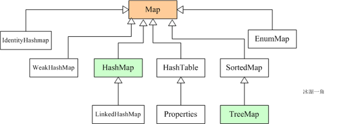

[TOC]
# 一、Java集合框架概述




集合可以看作是一种容器，用来存储对象信息。所有集合类都位于java.util包下。但支持多线程的集合类位于`java.util.concurrent`包下。

Collection派生出了三个子接口：List、Set、Queue（Java5新增的队列），因此Java集合大致也可分成List、Set、Queue、Map四种接口体系，（注意：Map不是Collection的子接口）。

其中：
* List代表了有序可重复集合，可直接根据元素的索引来访问；
* Set代表无序不可重复集合，只能根据元素本身来访问；
* Queue是队列集合；
* Map代表的是存储key-value对的集合，可根据元素的key来访问value。

数组与集合的区别如下：

1）数组长度不可变化而且无法保存具有映射关系的数据；集合类用于保存数量不确定的数据，以及保存具有映射关系的数据。　
2）数组元素既可以是基本类型的值，也可以是对象；集合只能保存对象。
# 二、Java集合常见接口及实现类

## 1. Collection接口常见方法（来源于Java API）


## 2. Set集合

Set集合与Collection的方法相同。
由于Set集合不允许存储相同的元素，所以如果把两个相同元素添加到同一个Set集合，则添加操作失败，新元素不会被加入，add()方法返回false。代码示例：
```java
public class Test {

    public static void main(String[] args) {
        Set<String> set = new HashSet<String>();
        set.add("hello world");
        set.add("hello 冰湖一角");
        set.add("hello 冰湖一角");//添加不进去
        System.out.println("集合中元素个数："+set.size());
        System.out.println("集合中元素为："+set.toString());
    }
}
```

**运行结果如下**：
```shell
集合中元素个数：2
集合中元素为：[hello world, hello 冰湖一角]
```
**分析**：由于String类中重写了hashCode()和equals()方法，用来比较指向的字符串对象所存储的字符串是否相等。所以这里的第二个"hello 冰湖一角"是加不进去的。

### 下面着重介绍Set集合几个常用实现类

#### 1. HashSet类　　
HashSet是Set集合最常用实现类，是其经典实现。HashSet是按照hash算法来存储元素的，因此具有很好的存取和查找性能。　　

**HashSet具有如下特点**：　　
* 能保证元素的顺序。　　
* HashSet不是线程同步的，如果多线程操作HashSet集合，则应通过代码来保证其同步。　　
* 集合元素值可以是null。　　

**HashSet存储原理如下**：　　
当向HashSet集合存储一个元素时，HashSet会调用该对象的hashCode()方法得到其hashCode值，然后根据hashCode值决定该对象的存储位置。
HashSet集合判断两个元素相等的标准是
1. 两个对象通过equals()方法比较返回true；
2. 两个对象的hashCode()方法返回值相等。

因此，如果(1)和(2)有一个不满足条件，则认为这两个对象不相等，可以添加成功。

如果两个对象的hashCode()方法返回值相等，但是两个对象通过equals()方法比较返回false，HashSet会以**链式结构**将两个对象保存在同一位置，这将导致性能下降，因此在编码时应避免出现这种情况。　　

**HashSet查找原理如下**：　　
基于HashSet以上的存储原理，在查找元素时，HashSet先计算元素的HashCode值（也就是调用对象的hashCode方法的返回值），然后直接到hashCode值对应的位置去取出元素即可，这就是HashSet速度很快的原因。 　　

**重写hashCode()方法的基本原则如下**： 　　

* 在程序运行过程中，同一个对象的hashCode()方法返回值应相同。　　

* 当两个对象通过equals()方法比较返回true时，这两个对象的hashCode()方法返回值应该相等。　　

* 对象中用作equals()方法比较标准的实例变量，都应该用于计算hashCode值。

#### 2. LinkedHashSet类

LinkedHashSet是HashSet的一个子类，具有HashSet的特性，也是根据元素的hashCode值来决定元素的存储位置。但它使用链表维护元素的次序，元素的顺序与添加顺序一致。

由于LinkedHashSet需要维护元素的插入顺序，因此性能略低于HashSet，但在迭代访问Set里的全部元素时由很好的性能。

#### 3. TreeSet类

TreeSet是SortedSet接口的实现类，TreeSet可以保证元素处于排序状态，它采用**红黑树**的数据结构来存储集合元素。TreeSet支持两种排序方法：
* 自然排序
* 定制排序

默认采用自然排序。

##### 自然排序

TreeSet会调用集合元素的compareTo(Object obj)方法来比较元素的大小关系，然后将元素按照升序排列，这就是自然排序。

如果试图将一个对象添加到TreeSet集合中，则该对象必须实现Comparable接口，否则会抛出异常。

当一个对象调用方法与另一个对象比较时，例如obj1.compareTo(obj2)，
* 如果该方法返回0，则两个对象相等；
* 如果返回一个正数，则obj1大于obj2；
* 如果返回一个负数，则obj1小于obj2。

Java常用类中已经实现了Comparable接口的类有以下几个:

* BigDecimal、BigDecimal以及所有数值型对应的包装类：按照它们对应的数值大小进行比较。

* Charchter：按照字符的unicode值进行比较。　　 

* Boolean：true对应的包装类实例大于false对应的包装类实例。　　

* String：按照字符串中的字符的unicode值进行比较。　　

* Date、Time：后面的时间、日期比前面的时间、日期大。　

对于TreeSet集合而言，它判断两个对象是否相等的标准是：两个对象通过compareTo(Object obj)方法比较是否返回0，如果返回0则相等。

#####  定制排序

想要实现定制排序，需要在创建TreeSet集合对象时，提供一个Comparator对象与该TreeSet集合关联，由Comparator对象负责集合元素的排序逻辑。　　

综上：自然排序实现的是Comparable接口，定制排序实现的是Comparator接口。

#### 4. EnumSet类

* EnumSet是一个专为枚举类设计的集合类，不允许添加null值。

* EnumSet的集合元素也是有序的，它以枚举值在Enum类内的定义顺序来决定集合元素的顺序。

#### 5. 各Set实现类的性能分析

* HashSet的性能比TreeSet的性能好（特别是添加，查询元素时），因为TreeSet需要额外的红黑树算法维护元素的次序，如果需要一个保持排序的Set时才用TreeSet，否则应该使用HashSet。　　

* LinkedHashSet是HashSet的子类，由于需要链表维护元素的顺序，所以插入和删除操作比HashSet要慢，但遍历比HashSet快。　

* EnumSet是所有Set实现类中性能最好的，但它只能保存同一个枚举类的枚举值作为集合元素。　　

以上几个Set实现类都是线程不安全的，如果多线程访问，必须手动保证集合的同步性。


## 3. List集合

List集合代表一个有序、可重复集合，集合中每个元素都有其对应的顺序索引。

List集合默认按照元素的添加顺序设置元素的索引，可以通过索引（类似数组的下标）来访问指定位置的集合元素。　　

实现List接口的集合主要有：ArrayList、LinkedList、Vector、Stack。

### 3.1 ArrayList

ArrayList是一个**动态数组**，也是我们最常用的集合，是List类的典型实现。

它允许任何符合规则的元素插入甚至包括null。

初始化时如果以new ArrayList()方式创建时，初始容量为10个；

如果以new ArrayList(Collection c)初始化时，容量为c.size()\*1.1，即增加10%的容量；

当向ArrayList中添加一个元素时，先进行容器的容量检查，如果容量不够时，则增加至原来的1.5倍加1，再然后把元素加入到容器中，即以原始容量的0.5倍比率增加。

所以如果我们明确所插入元素的多少，最好指定一个初始容量值，避免过多的进行扩容操作而浪费时间、效率。     

**ArrayList擅长于随机访问。同时ArrayList是非同步的**。

#### 3.1.1 ArrayList中两种排序规则
##### 1.让需要进行排序的对象的类实现Comparable接口，重写compareTo(T o)方法，在其中定义排序规则，那么就可以直接调用Collections.sort()来排序对象数组
需要排序的对象：
```java
 @Override
  public int compareTo(Object o) {
    Student s = (Student) o;
    if (this.age > s.age) {
      return 1;
    }
    else if (this.age < s.age) {
      return -1;
    }
    else {
      if (this.height >= s.height) {
        return 1;
      }
      else {
        return -1;
      }
    }
  }
```
测试类:
```java
List<Student> list = new ArrayList<>();
list.add(new Student(1, "A", 20, 180));
list.add(new Student(2, "B", 21, 175));
System.out.println("before sorted");
printData(list);
Collections.sort(list);
```
##### 2. 实现比较器接口Comparator，重写compare方法，直接当做参数传进sort中
```java
Collections.sort(list, new Comparator<Student>() {
      @Override
      public int compare(Student o1, Student o2) {
        if(o1.getAge() >= o2.getAge()) {
          return 1;
        }
        else {
          return -1;
        }
      }
    });
```
#### 3.1.2 两种从ArrayList中删除重复元素的方法，分别是使用HashSet和LinkedHashSet。
* HashSet会删除ArrayList中元素的插入顺序。这意味着，删除重复的元素后，元素的插入顺序就不对了

* LinkedHashSet不允许重复元素,同时保持元素的插入顺序。LinkedHashSet的这两个属性可以确保在删除ArrayList中的重复元素之后，依然保持元素的插入顺序。

#### 3.1.3 ArrayList扩容机制
> addd函数

当我们在ArrayList中增加元素的时候，会使用add函数。他会将元素放到末尾。具体实现如下：
```java
public boolean add(E e) {
    ensureCapacityInternal(size + 1);  // Increments modCount!!
    elementData[size++] = e;
    return true;
}
```
我们可以看到他的实现其实最核心的内容就是`ensureCapacityInternal`。这个函数其实就是自动扩容机制的核心。我们依次来看一下他的具体实现：
```java
private void ensureCapacityInternal(int minCapacity) {
    if (elementData == DEFAULTCAPACITY_EMPTY_ELEMENTDATA) {
        minCapacity = Math.max(DEFAULT_CAPACITY, minCapacity);
    }
 
    ensureExplicitCapacity(minCapacity);
}
 
private void ensureExplicitCapacity(int minCapacity) {
    modCount++;
 
    // overflow-conscious code
    if (minCapacity - elementData.length > 0)
        grow(minCapacity);
}
 
private void grow(int minCapacity) {
    // overflow-conscious code
    int oldCapacity = elementData.length;
    // 扩展为原来的1.5倍
    int newCapacity = oldCapacity + (oldCapacity >> 1);
    // 如果扩为1.5倍还不满足需求，直接扩为需求值
    if (newCapacity - minCapacity < 0)
        newCapacity = minCapacity;
    if (newCapacity - MAX_ARRAY_SIZE > 0)
        newCapacity = hugeCapacity(minCapacity);
    // minCapacity is usually close to size, so this is a win:
    elementData = Arrays.copyOf(elementData, newCapacity);
}
```
也就是说，当增加数据的时候，如果ArrayList的大小已经不满足需求时，那么就将数组变为原长度的1.5倍，之后的操作就是把老的数组拷到新的数组里面。

例如，默认的数组大小是10，也就是说当我们add10个元素之后，再进行一次add时，就会发生自动扩容，数组长度由10变为了15具体情况如下所示：


#### 3.1.4 set和get函数
Array的put和get函数就比较简单了，先做index检查，然后执行赋值或访问操作:
```java
public E set(int index, E element) {
    rangeCheck(index);
 
    E oldValue = elementData(index);
    elementData[index] = element;
    return oldValue;
}
 
public E get(int index) {
    rangeCheck(index);
 
    return elementData(index);
}
```
#### 3.1.4 remove函数
```java
public E remove(int index) {
    rangeCheck(index);
 
    modCount++;
    E oldValue = elementData(index);
 
    int numMoved = size - index - 1;
    if (numMoved > 0)
        // 把后面的往前移
        System.arraycopy(elementData, index+1, elementData, index,
                         numMoved);
    // 把最后的置null
    elementData[--size] = null; // clear to let GC do its work
 
    return oldValue;
}
```


### 3.2 LinkedList

LinkedList是List接口的另一个实现，除了可以根据索引访问集合元素外，LinkedList还实现了Deque接口，可以当作双端队列来使用，也就是说，既可以当作“栈”使用，又可以当作队列使用。　　

LinkedList的实现机制与ArrayList的实现机制完全不同，ArrayLiat内部以数组的形式保存集合的元素，所以随机访问集合元素有较好的性能；

LinkedList内部以链表的形式保存集合中的元素，所以随机访问集合中的元素性能较差，但在插入删除元素时有较好的性能。

### 3.3 Vector

与ArrayList相似，但是**Vector是同步的**。所以说**Vector是线程安全的动态数组**。它的操作与ArrayList几乎一样。
### 3.4 Stack

Stack继承自Vector，实现一个后进先出的堆栈。

Stack提供5个额外的方法使得Vector得以被当作堆栈使用。

基本的push和pop 方法，还有peek方法得到栈顶的元素，empty方法测试堆栈是否为空，search方法检测一个元素在堆栈中的位置。Stack刚创建后是空栈。

### 3.5 Iterator接口和ListIterator接口

Iterator是一个接口，它是集合的迭代器。集合可以通过Iterator去遍历集合中的元素。
Iterator提供的API接口如下：　　

* boolean hasNext()：判断集合里是否存在下一个元素。如果有，hasNext()方法返回 true。

* Object next()：返回集合里下一个元素。　　

* void remove()：删除集合里上一次next方法返回的元素。　　

ListIterator接口继承Iterator接口，提供了专门操作List的方法。ListIterator接口在Iterator接口的基础上增加了以下几个方法：

* boolean hasPrevious()：判断集合里是否存在上一个元素。如果有，该方法返回 true。　　

* Object previous()：返回集合里上一个元素。　　

* void add(Object o)：在指定位置插入一个元素。　　

以上两个接口相比较，不难发现，ListIterator**增加了向前迭代的功能**（Iterator只能向后迭代），ListIterator**还可以通过add()方法向List集合中添加元素**（Iterator只能删除元素）。

## 4. Map集合

Map接口采用键值对Map<K,V>的存储方式，保存具有映射关系的数据，

因此，Map集合里保存两组值，一组值用于保存Map里的key，另外一组值用于保存Map里的value，key和value可以是任意引用类型的数据。key值不允许重复，可以为null。

如果添加key-value对时Map中已经有重复的key，则新添加的value会覆盖该key原来对应的value。常用实现类有HashMap、LinkedHashMap、TreeMap等。

### 1. HashMap与Hashtable
HashMap与Hashtable是Map接口的两个典型实现，它们之间的关系完全类似于ArrayList与Vertor。

HashTable是一个古老的Map实现类，它提供的方法比较繁琐，目前基本不用了，HashMap与Hashtable主要存在以下两个典型区别：

* HashMap是线程不安全，HashTable是线程安全的。

* HashMap可以使用null值最为key或value；Hashtable不允许使用null值作为key和value，如果把null放进HashTable中，将会发生空指针异常。

为了成功的在HashMap和Hashtable中存储和获取对象，用作key的对象必须实现hashCode()方法和equals()方法。

### 2. LinkedHashMap实现类

LinkedHashMap使用双向链表来维护key-value对的次序（其实只需要考虑key的次序即可），

该链表负责维护Map的迭代顺序，与插入顺序一致，因此性能比HashMap低，但在迭代访问Map里的全部元素时有较好的性能。

### 3. TreeMap实现类

TreeMap是SortedMap的实现类，是一个红黑树的数据结构，每个key-value对作为红黑树的一个节点。

TreeMap存储key-value对时，需要根据key对节点进行排序。TreeMap也有两种排序方式：

* 自然排序：TreeMap的所有key必须实现Comparable接口，而且所有的key应该是同一个类的对象，否则会抛出ClassCastException。

* 定制排序：创建TreeMap时，传入一个Comparator对象，该对象负责对TreeMap中的所有key进行排序。

### 4. 各Map实现类的性能分析

* HashMap通常比Hashtable（古老的线程安全的集合）要快

* TreeMap通常比HashMap、Hashtable要慢，因为TreeMap底层采用红黑树来管理key-value。

* LinkedHashMap比HashMap慢一点，因为它需要维护链表来爆出key-value的插入顺序。　 