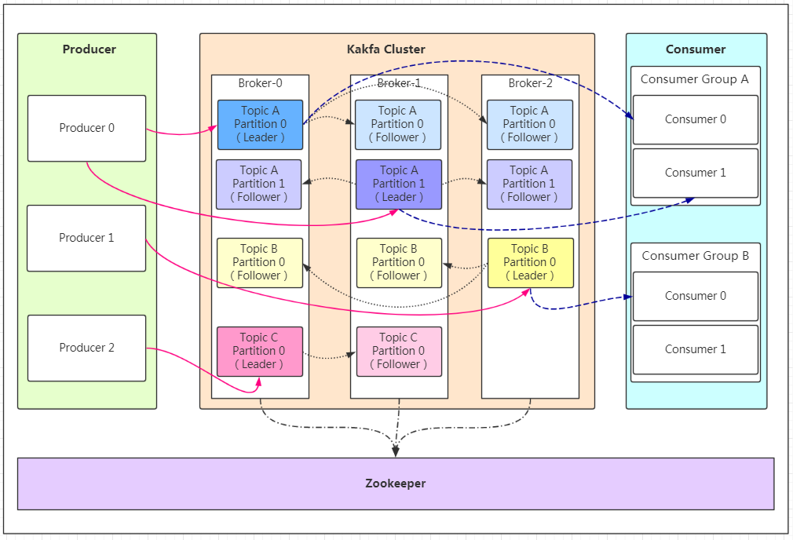
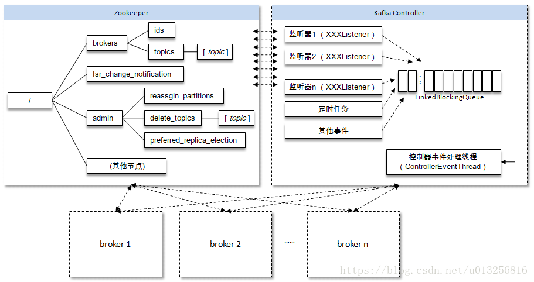
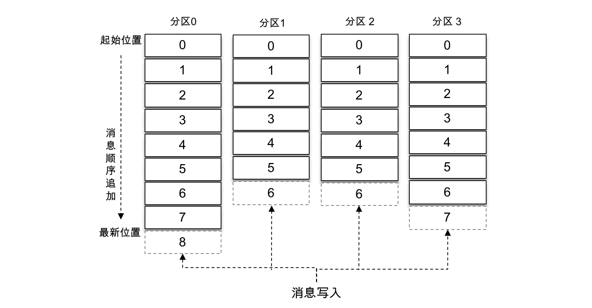
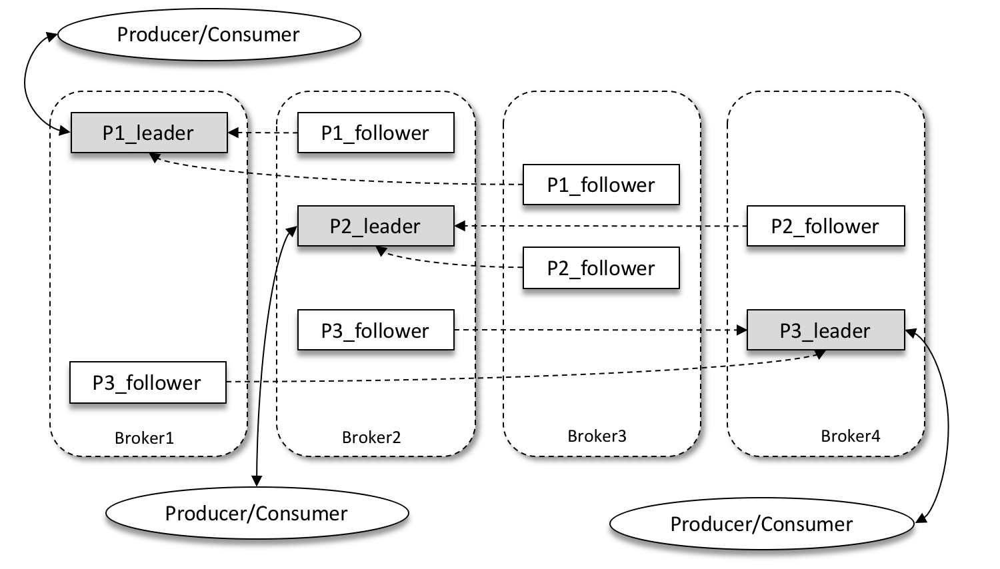
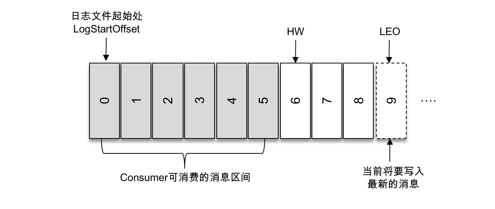
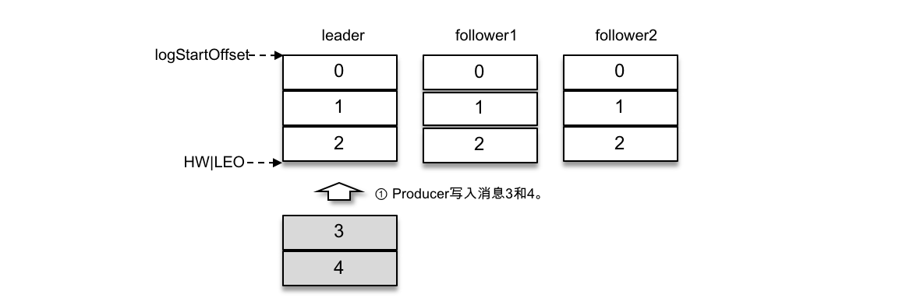
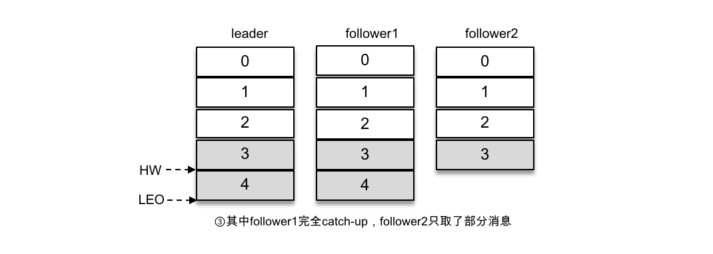
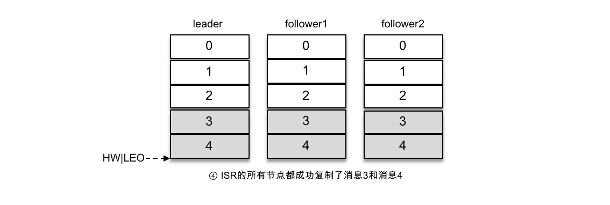
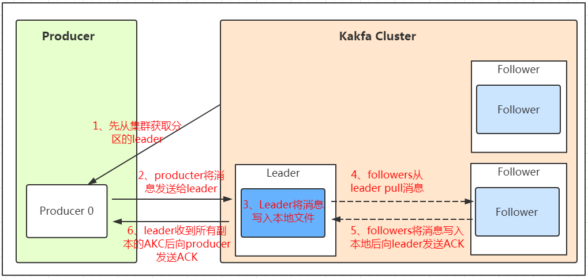
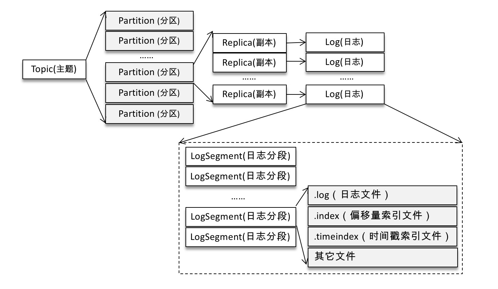

[TOC]
# Kafka 简介

Kafka 是一种分布式的，基于发布 / 订阅的消息系统。主要设计目标如下：

* 以时间复杂度为 O(1) （原因是可以根据offset直接找到消息）的方式提供消息持久化能力，即使对 TB 级以上数据也能保证常数时间复杂度的访问性能。

* 高吞吐率。即使在非常廉价的商用机器上也能做到单机支持每秒 100K 条以上消息的传输。

* 支持 Kafka Server 间的消息分区，及分布式消费，同时保证每个 Partition 内的消息顺序传输。

* 同时支持离线数据处理和实时数据处理。

* Scale out：支持在线水平扩展。

# Kafka 基础概念
一个典型的 Kafka 体系架构包括若干 Producer、若干 Broker、若干 Consumer，以及一个 ZooKeeper 集群，如下图所示。其中 ZooKeeper 是 Kafka 用来负责集群元数据的管理、控制器的选举等操作的。Producer 将消息发送到 Broker，Broker 负责将收到的消息存储到磁盘中，而 Consumer 负责从 Broker 订阅并消费消息。

## Broker 和集群（Cluster）

Kafka集群包含一个或多个服务器，这种服务器被称为broker

* 它接受生产者发送的消息并存入磁盘；

* 同时服务消费者拉取分区消息的请求，返回目前已经提交的消息。

若干个 Broker 组成一个集群（Cluster），其中集群内某个 Broker 会成为集群控制器（Cluster Controller），它负责管理集群，包括分配分区到 Broker、监控 Broker 故障等。

在集群内，一个分区由一个 Broker 负责，这个 Broker 也称为这个分区的 Leader；

当然一个分区可以被复制到多个 Broker 上来实现冗余，这样当存在 Broker 故障时可以将其分区重新分配到其他 Broker 来负责。下图是一个样例：

Kafka 的一个关键性质是日志保留（retention），我们可以配置主题的消息保留策略，譬如只保留一段时间的日志或者只保留特定大小的日志。当超过这些限制时，老的消息会被删除。我们也可以针对某个主题单独设置消息过期策略，这样对于不同应用可以实现个性化。

### 具备控制器身份的broker
职责：
1. 监听partition相关的变化。为Zookeeper中的/admin/reassign_partitions节点注册PartitionReassignmentListener，用来处理分区重分配的动作。为Zookeeper中的/isr_change_notification节点注册IsrChangeNotificetionListener，用来处理ISR集合变更的动作。为Zookeeper中的/admin/preferred-replica-election节点添加PreferredReplicaElectionListener，用来处理优先副本的选举动作。

2. 监听topic相关的变化。为Zookeeper中的/brokers/topics节点添加TopicChangeListener，用来处理topic增减的变化；为Zookeeper中的/admin/delete_topics节点添加TopicDeletionListener，用来处理删除topic的动作。

3. 监听broker相关的变化。为Zookeeper中的/brokers/ids/节点添加BrokerChangeListener，用来处理broker增减的变化。

4. 从Zookeeper中读取获取当前所有与topic、partition以及broker有关的信息并进行相应的管理。对于所有topic所对应的Zookeeper中的/brokers/topics/[topic]节点添加PartitionModificationsListener，用来监听topic中的分区分配变化。

5. 启动并管理分区状态机和副本状态机。

6. 更新集群的元数据信息。

7. 如果参数auto.leader.rebalance.enable设置为true，则还会开启一个名为“auto-leader-rebalance-task”的定时任务来负责维护分区的优先副本的均衡。

控制器在选举成功之后会读取Zookeeper中各个节点的数据来初始化上下文信息（ControllerContext），并且也需要管理这些上下文信息，比如为某个topic增加了若干个分区，控制器在负责创建这些分区的同时也要更新上下文信息，并且也需要将这些变更信息同步到其他普通的broker节点中。不管是监听器触发的事件，还是定时任务触发的事件，亦或者是其他事件（比如ControlledShutdown）都会读取或者更新控制器中的上下文信息，那么这样就会涉及到多线程间的同步，如果单纯的使用锁机制来实现，那么整体的性能也会大打折扣。

针对这一现象，Kafka的控制器**使用单线程基于事件队列的模型**，将每个事件都做一层封装，然后按照事件发生的先后顺序暂存到LinkedBlockingQueue中，然后使用一个专用的线程（ControllerEventThread）按照FIFO（First Input First Output, 先入先出）的原则顺序处理各个事件，这样可以不需要锁机制就可以在多线程间维护线程安全。

当/controller节点的数据发生变化时，每个broker都会更新自身内存中保存的activeControllerId。如果broker在数据变更前是控制器，那么如果在数据变更后自身的brokerid值与新的activeControllerId值不一致的话，那么就需要 **“退位”**，关闭相应的资源，比如关闭状态机、注销相应的监听器等。有可能控制器由于异常而下线，造成/controller这个临时节点会被自动删除；也有可能是其他原因将此节点删除了。

当/controller节点被删除时，每个broker都会进行选举，如果broker在节点被删除前是控制器的话，在选举前还需要有一个“退位”的动作。如果有特殊需要，可以手动删除/controller节点来触发新一轮的选举。当然关闭控制器所对应的broker以及手动向/controller节点写入新的brokerid的所对应的数据同样可以触发新一轮的选举。

## Producer
负责发布消息到Kafka broker

## Consumer
消费消息。
每个consumer属于一个特定的consumer group（可为每个consumer指定group name，若不指定group name则属于默认的group）。

使用consumer high level API时，同一topic的一条消息只能被同一个consumer group内的一个consumer消费，但多个consumer group可同时消费这一消息。

## 主题（Topic）

每条发布到Kafka集群的消息都有一个类别，这个类别被称为**topic**。在 Kafka 中，消息以主题（Topic）来分类，每一个主题都对应一个「消息队列」。

上述的 Topic 其实是**逻辑上**的概念，面向消费者和生产者，**物理上**存储的其实是 Partition，每一个 Partition 最终对应一个目录，里面存储所有的消息和索引文件。

Topic的分区被放在不同的 Broker 中，保证 Producer 和 Consumer 错开访问 Broker，避免访问单个 Broker造成过度的IO压力，使得负载均衡。

默认情况下，每一个 Topic 在创建时如果不指定 Partition 数量时只会创建 1 个 Partition。

比如，我创建了一个 Topic 名字为 test ，没有指定 Partition 的数量，那么会默认创建一个 test-0 的文件夹，这里的命名规则是：`<topic_name>-<partition_id>`。

## 分区（Partition）

**分区（Partition）的概念**，类似“允许多修几条道”的方式对主题实现水平扩展。Partition是物理上的概念，每个topic包含一个或多个Partition，创建topic时可指定parition数量。每个partition对应于一个文件夹，该文件夹下存储该Partition的数据和索引文件。

任何发布到 Partition 的消息都会被追加到 Partition 数据文件的尾部，这样的顺序写磁盘操作让 Kafka 的效率非常高（经验证，顺序写磁盘效率比随机写内存还要高，这是 Kafka 高吞吐率的一个很重要的保证）。

如上图所示，主题中有4个分区，消息被顺序追加到每个分区日志文件的尾部。**Kafka 中的分区可以分布在不同的服务器（broker）上，也就是说，一个主题可以横跨多个 broker，以此来提供比单个 broker 更强大的性能。**

每一条消息被发送到 broker 之前，会根据分区规则选择存储到哪个具体的分区。如果分区规则设定得合理，所有的消息都可以均匀地分配到不同的分区中。如果一个主题只对应一个文件，因为这个文件只会分布在一台broker上，所以这个文件所在的机器I/O将会成为这个主题的性能瓶颈，而分区解决了这个问题，因为分散在多台服务器上。

在创建主题的时候可以通过指定的参数来设置分区的个数，当然也可以在主题创建完成之后去修改分区的数量，通过增加分区的数量可以实现水平扩展。

## 多副本（Replica）机制
Kafka 为分区引入了多副本（Replica）机制，通过增加副本数量可以提升容灾能力。

同一分区的不同副本中保存的是相同的消息（在同一时刻，副本之间并非完全一样），副本之间是“一主多从”的关系，**其中 leader 副本负责处理读写请求，follower 副本只负责与 leader 副本的消息同步。**

副本处于不同的 broker 中，当 leader 副本出现故障时，从 follower 副本中重新选举新的 leader 副本对外提供服务。Kafka 通过多副本机制实现了故障的自动转移，当 Kafka 集群中某个 broker 失效时仍然能保证服务可用。

如上图所示，Kafka 集群中有4个 broker，某个主题中有3个分区，且副本因子（即副本个数）也为3，如此每个分区便有1个 leader 副本和2个 follower 副本。这里要摆脱broker的限制，一个主题的不同分区是可以分布在不同的broker上，所以要仅仅看分区和副本就行了，不用关心这些分区在哪个服务器上。

**生产者和消费者只与 leader 副本进行交互，而 follower 副本只负责消息的同步，很多时候 follower 副本中的消息相对 leader 副本而言会有一定的滞后。**

Kafka 消费端也具备一定的容灾能力。Consumer 使用拉（Pull）模式从服务端拉取消息，并且保存消费的具体位置，当消费者宕机后恢复上线时可以根据之前保存的消费位置重新拉取需要的消息进行消费，这样就不会造成消息丢失。

分区中的所有副本统称为 AR（Assigned Replicas）。所有与 leader 副本保持一定程度同步的副本（包括 leader 副本在内）组成ISR（In-Sync Replicas），ISR 集合是 AR 集合中的一个子集。消息会先发送到 leader 副本，然后 follower 副本才能从 leader 副本中拉取消息进行同步，同步期间内 follower 副本相对于 leader 副本而言会有一定程度的滞后。

前面所说的“一定程度的同步”是指可忍受的滞后范围，这个范围可以通过参数进行配置。与 leader 副本同步滞后过多的副本（不包括 leader 副本）组成 OSR（Out-of-Sync Replicas），由此可见，AR=ISR+OSR。在正常情况下，所有的 follower 副本都应该与 leader 副本保持一定程度的同步，即 AR=ISR，OSR 集合为空。

leader 副本负责维护和跟踪 ISR 集合中所有 follower 副本的滞后状态，当 follower 副本落后太多或失效时，leader 副本会把它从 ISR 集合中剔除。如果 OSR 集合中有 follower 副本“追上”了 leader 副本，那么 leader 副本会把它从 OSR 集合转移至 ISR 集合。默认情况下，当 leader 副本发生故障时，只有在 ISR 集合中的副本才有资格被选举为新的 leader，而在 OSR 集合中的副本则没有任何机会（不过这个原则也可以通过修改相应的参数配置来改变）。

**分区 leader 副本选举策略**

1. 当创建分区（创建主题或增加分区都有创建分区的动作）或分区上线（比如分区中原先的 leader 副本下线，此时分区需要选举一个新的 leader 上线来对外提供服务）的时候都需要执行 leader 的选举动作，对应的选举策略为 OfflinePartitionLeaderElectionStrategy。这种策略的基本思路是按照 **AR 集合**中副本的顺序查找第一个存活的副本，并且这个副本在 ISR 集合中。

2. 当分区进行重分配的时候也需要执行 leader 的选举动作，对应的选举策略为 ReassignPartitionLeaderElectionStrategy。这个选举策略的思路比较简单：从重分配的AR列表中找到第一个存活的副本，且这个副本在目前的 ISR 列表中。

3. 当发生优先副本的选举时，直接将优先副本设置为 leader 即可，AR 集合中的第一个副本即为优先副本（PreferredReplicaPartitionLeaderElectionStrategy）。

4. 还有一种情况会发生 leader 的选举，当某节点被优雅地关闭（也就是执行 ControlledShutdown）时，位于这个节点上的 leader 副本都会下线，所以与此对应的分区需要执行 leader 的选举。与此对应的选举策略（ControlledShutdownPartitionLeaderElectionStrategy）为：从 AR 列表中找到第一个存活的副本，且这个副本在目前的 ISR 列表中，与此同时还要确保这个副本不处于正在被关闭的节点上。

ISR 与 HW 和 LEO 也有紧密的关系。HW 是 High Watermark 的缩写，俗称高水位，它标识了一个特定的消息偏移量（offset），消费者只能拉取到这个 offset 之前的消息。

如上图所示，它代表一个日志文件，这个日志文件中有9条消息，第一条消息的 offset（LogStartOffset）为0，最后一条消息的 offset 为8，offset 为9的消息用虚线框表示，代表下一条待写入的消息。日志文件的 HW 为6，表示消费者只能拉取到 offset 在0至5之间的消息，而 offset 为6的消息对消费者而言是不可见的。

LEO 是 Log End Offset 的缩写，它标识当前日志文件中下一条待写入消息的 offset，上图中 offset 为9的位置即为当前日志文件的 LEO，LEO 的大小相当于当前日志分区中最后一条消息的 offset 值加1。分区 ISR 集合中的每个副本都会维护自身的 LEO，而 ISR 集合中最小的 LEO 即为分区的 HW，对消费者而言只能消费 HW 之前的消息。

### 示例：

为了让读者更好地理解 ISR 集合，以及 HW 和 LEO 之间的关系，下面通过一个简单的示例来进行相关的说明。如上图所示，假设某个分区的 ISR 集合中有3个副本，即一个 leader 副本和2个 follower 副本，此时分区的 LEO 和 HW 都为3。消息3和消息4从生产者发出之后会被先存入 leader 副本，如下图所示。

在消息写入 leader 副本之后，follower 副本会发送拉取请求来拉取消息3和消息4以进行消息同步。

在同步过程中，不同的 follower 副本的同步效率也不尽相同。如上图所示，在某一时刻 follower1 完全跟上了 leader 副本而 follower2 只同步了消息3，如此 leader 副本的 LEO 为5，follower1 的 LEO 为5，follower2 的 LEO 为4，那么当前分区的 HW 取最小值4，此时消费者可以消费到 offset 为0至3之间的消息。

写入消息（情形4）如下图所示，所有的副本都成功写入了消息3和消息4，整个分区的 HW 和 LEO 都变为5，因此消费者可以消费到 offset 为4的消息了。

由此可见，Kafka 的复制机制既不是完全的同步复制，也不是单纯的异步复制。事实上，同步复制要求所有能工作的 follower 副本都复制完，这条消息才会被确认为已成功提交，这种复制方式极大地影响了性能。而在异步复制方式下，follower 副本异步地从 leader 副本中复制数据，数据只要被 leader 副本写入就被认为已经成功提交。在这种情况下，如果 follower 副本都还没有复制完而落后于 leader 副本，突然 leader 副本宕机，则会造成数据丢失。Kafka 使用的这种 ISR 的方式则有效地权衡了数据可靠性和性能之间的关系。

## 如何保证消息的处理顺序

##### 1. 传统的队列模型

队列模型保持消息，并且保证它们的先后顺序不变。但是， 尽管服务器保证了消息的顺序，消息还是异步的发送给各个消费者，消费者收到消息的先后顺序不能保证了。这也意味着并行消费将不能保证消息的先后顺序。

所以消息系统常常通过仅设1个消费者来解决这个问题，但是这意味着没用到并行处理。

##### 2. Kafka

Kafka采用了一种分而治之的策略：分区。 

因为Topic**分区**中消息只能由消费者组中的**唯一一个**消费者处理，所以消息肯定是按照先后顺序进行处理的。

但是它也仅仅是保证Topic的一个分区顺序处理，不能保证跨分区的消息先后处理顺序。 

所以，如果你想要顺序的处理Topic的所有消息，那就只提供一个分区。

消息在被追加到分区日志文件的时候都会分配一个特定的偏移量（offset）。

offset 是消息在分区中的唯一标识，Kafka 通过它来保证消息在分区内的顺序性，不过 offset 并不跨越分区，也就是说，Kafka 保证的是分区有序而不是主题有序。

通过并行topic的parition —— kafka提供了顺序保证和负载均衡。**每个partition仅由同一个消费者组中的一个消费者消费。并确保消费者是该partition的唯一消费者，并按顺序消费数据。** 

每个topic有多个分区，则需要对**多个消费者做负载均衡**，**多个被放在不同的 Broker 中**，保证 Producer 和 Consumer 错开访问 Broker，避免访问单个 Broker造成过度的IO压力，使得负载均衡。

但请注意，**相同的消费者组中不能有比分区更多的消费者，否则多出的消费者一直处于空等待，不会收到消息。**

kafka有比传统的消息系统更强的顺序保证。

# Kafka 工作流程分析

## 发送数据
Producer在写入数据的时候永远的找leader副本，不会直接将数据写入follower副本！那leader怎么找呢？写入的流程又是什么样的呢？我们看下图：

消息写入leader后，follower是主动的去leader进行同步的！

> 在kafka中，如果某个topic有多个partition，producer又怎么知道该将数据发往哪个partition呢？kafka中有几个原则：

1. partition在写入的时候可以指定需要写入的partition，如果有指定，则写入对应的partition。

2. 如果没有指定partition，但是设置了数据的key，则会根据key的值hash出一个partition。

3. 如果既没指定partition，又没有设置key，则会轮询选出一个partition。

> 保证消息不丢失是一个消息队列中间件的基本保证，那producer在向kafka写入消息的时候，怎么保证消息不丢失呢？

其实上面的写入流程图中有描述出来，那就是通过ACK应答机制！在生产者向队列写入数据的时候可以设置参数来确定是否确认kafka接收到数据，这个参数可设置的值为0、1、all。

* 0代表producer往集群发送数据不需要等到集群的返回，不确保消息发送成功。安全性最低但是效率最高。

* 1代表producer往集群发送数据只要leader应答就可以发送下一条，只确保leader发送成功。

* all代表producer往集群发送数据需要所有的follower都完成从leader的同步才会发送下一条，确保leader发送成功和所有的副本都完成备份。安全性最高，但是效率最低。

最后要注意的是，如果往不存在的topic写数据，能不能写入成功呢？kafka会自动创建topic，分区和副本的数量根据默认配置都是1。
  
  
## 保存数据
下图描绘了主题、分区、副本、Log 以及 LogSegment 之间的关系。

假设我们现在 Kafka 集群只有一个 Broker，我们创建 2 个 Topic 名称分别为：`「topic1」和「topic2」`，Partition 数量分别为 1、2，那么我们的根目录下就会创建如下三个文件夹：

在 Kafka 的文件存储中，同一个 Topic 下有多个不同的 Partition，每个 Partition 都为一个目录，而每一个目录又被平均分配成多个大小相等的 Segment File 中，每组segment文件又包含.index文件、.log文件、.timeindex文件（早期版本中没有）三个文件，log文件就实际是存储message的地方，而index和timeindex文件为索引文件，用于检索消息。

现在假设我们设置每个 Segment 大小为 500 MB，并启动生产者向 topic1 中写入大量数据，topic1-0 文件夹中就会产生类似如下的一些文件：

**Segment 是 Kafka 文件存储的最小单位。** Segment 文件命名规则：Partition 全局的第一个 Segment 从 0 开始，后续每个 Segment 文件名为上一个 Segment 文件最后一条消息的 offset 值。数值最大为 64 位 long 大小，19 位数字字符长度，没有数字用0填充。如 00000000000000368769.index 和 00000000000000368769.log。

以上面的一对 Segment File 为例，说明一下索引文件和数据文件对应关系：

其中以索引文件中元数据 `<3, 497> ` 为例，依次在数据文件中表示第 3 个 message（在全局 Partition 表示第 368769 + 3 = 368772 个 message）以及该消息的物理偏移地址为 497。
**即offset=3，物理偏移地址position=497. 表示该消息从物理偏移位置497开始。**

注意该 index 文件并不是从0开始，也不是每次递增1的，这是因为 Kafka 采取稀疏索引存储的方式，每隔一定字节的数据建立一条索引，它减少了索引文件大小，使得能够把 index 映射到内存，降低了查询时的磁盘 IO 开销，同时也并没有给查询带来太多的时间消耗。

因为其文件名为上一个 Segment 最后一条消息的 offset ，所以当需要查找一个指定 offset 的 message 时，通过在所有 segment 的文件名中进行二分查找就能找到它归属的 segment ，再在其 index 文件中找到其对应到文件上的物理位置，就能拿出该 message 。

由于消息在 Partition 的 Segment 数据文件中是顺序读写的，且消息消费后不会删除（删除策略是针对过期的 Segment 文件），这种顺序磁盘 IO 存储设计是 Kafka 高性能很重要的原因。

以读取`offset=36776`的消息为例子，需要通过2个步骤查找
1. 第一步查找`segment file`
以上图为例，其中`00000000000000000000.index`表示开始的文件，起始偏移量为0（offset为0），第二个文件`00000000000000368769.index`的消息起始偏移量为`368770（368769+1）`。只要根据offset二分查找文件列表，就可以快速定位到具体文件。当`offset=368776`时定位到`00000000000000368769.index(log)`文件
2. 第二步通过`segment file`查找`message`
算出`368776-368770=6`，取`00000000000000368769.index`文件第三项`（6，1407）`得出从`00000000000000368769.log`文件头偏移`1407`字节读取一条消息即可。

这套机制是建立在**offset为有序**的基础上，利用**segment+有序offset+稀疏索引+二分查找+顺序查找**等多种手段来高效的查找数据！

## Message结构
>Kafka 是如何准确的知道 message 的偏移的呢？

这是因为在 Kafka 定义了标准的数据存储结构，在 Partition 中的每一条 message 都包含了以下三个属性：

* offset：表示 message 在当前 Partition 中的偏移量，是一个逻辑上的值，唯一确定了 Partition 中的一条 message，可以简单的认为是一个 id；

* MessageSize：表示 message 内容 data 的大小；

* data：message 的具体内容

## 存储策略
无论消息是否被消费，kafka都会保存所有的消息。那对于旧数据有什么删除策略呢？
1. 基于时间，默认配置是168小时（7天）。

2. 基于大小，默认配置是1073741824。

需要注意的是，kafka读取特定消息的时间复杂度是O(1)，所以这里删除过期的文件并不会提高kafka的性能！

## 消费数据
消息存储在log文件后，消费者就可以进行消费了。在讲消息队列通信的两种模式的时候讲到过点对点模式和发布订阅模式。Kafka采用的是点对点的模式，**消费者主动的去kafka集群拉取消息**。

与producer相同的是，消费者在拉取消息的时候也是找leader副本去拉取。

多个消费者可以组成一个消费者组（consumer group），每个消费者组都有一个组id！同一个消费组者的消费者可以消费同一topic下不同分区的数据，但是不会组内多个消费者消费同一分区的数据。

在实际的应用中，**建议消费者组的consumer的数量与partition的数量一致！**

消费者通过上面的查找数据的方式拿到需要处理的数据进行处理。

> 那每个消费者又是怎么记录自己消费的位置呢？

在早期的版本中，消费者将消费到的offset维护zookeeper中，consumer每间隔一段时间上报一次，这里容易导致重复消费，且性能不好！在新的版本中消费者消费到的offset已经直接维护在kafka集群的__consumer_offsets这个topic中！

