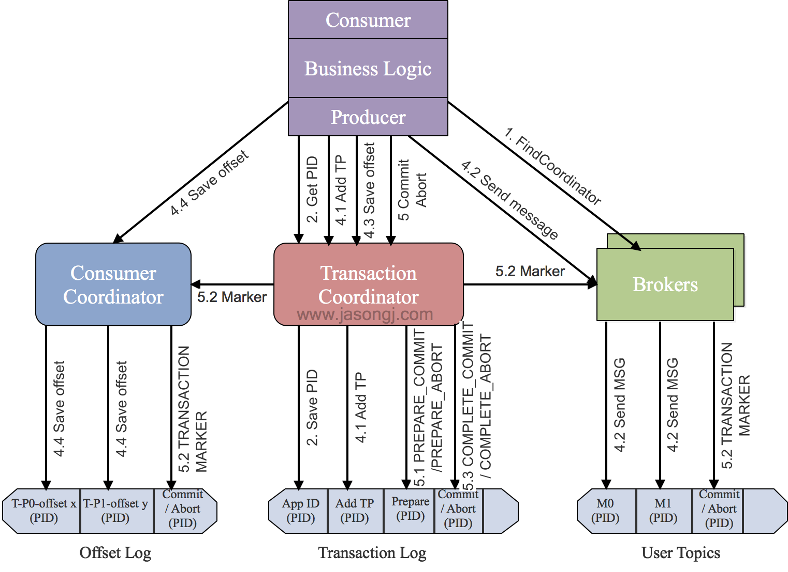

[TOC]

# 一、 幂等

所谓的幂等，简单地说就是对接口的多次调用所产生的结果和调用一次是一致的。生产者在进行重试的时候有可能会重复写入消息，而使用 Kafka 的幂等性功能之后就可以避免这种情况。

开启幂等性功能的方式很简单，只需要显式地将生产者客户端参数 enable.idempotence 设置为 true 即可（这个参数的默认值为 false），参考如下：
```java
properties.put(ProducerConfig.ENABLE_IDEMPOTENCE_CONFIG, true);
# 或者
properties.put(“enable.idempotence”, true);
```
不过如果要确保幂等性功能正常，还需要确保生产者客户端的 retries、acks、max.in.flight.requests.per.connection 这几个参数不被配置错。实际上在使用幂等性功能的时候，用户完全可以不用配置（也不建议配置）这几个参数。


为了实现生产者的幂等性，Kafka 为此引入了 producer id（以下简称 PID）和序列号（sequence number）这两个概念.

每个新的生产者实例在初始化的时候都会被分配一个 PID，这个 PID 对用户而言是完全透明的。对于每个 PID，消息发送到的每一个分区都有对应的序列号，这些序列号从0开始单调递增。生产者每发送一条消息就会将 <PID，分区> 对应的序列号的值加1。

broker 端会在内存中为每一对 <PID，分区> 维护一个序列号。对于收到的每一条消息，只有当它的序列号的值（SN_new）比 broker 端中维护的对应的序列号的值（SN_old）大1（即 SN_new = SN_old + 1）时，broker 才会接收它。

* 如果 SN_new< SN_old + 1，那么说明消息被重复写入，broker 可以直接将其丢弃。

* 如果 SN_new> SN_old + 1，那么说明中间有数据尚未写入，出现了乱序，暗示可能有消息丢失，对应的生产者会抛出 OutOfOrderSequenceException，这个异常是一个严重的异常，后续的诸如 send()、beginTransaction()、commitTransaction() 等方法的调用都会抛出 IllegalStateException 的异常。

引入序列号来实现幂等也只是针对 **每一对 <PID，分区>** 而言的，也就是说，**Kafka 的幂等只能保证单个生产者会话（session）中单分区的幂等。**

```java
ProducerRecord<String, String> record = new ProducerRecord<>(topic, "key", "msg");
producer.send(record);
producer.send(record);
```

注意，上面示例中发送了两条相同的消息，不过这仅仅是指消息内容相同，但对 Kafka 而言是两条不同的消息，因为会为这两条消息分配不同的序列号。**Kafka 并不会保证消息内容的幂等**。


# 二、事务
幂等性并不能跨多个分区运作，而事务可以弥补这个缺陷。**事务可以保证对多个分区写入操作的原子性。** Kafka中的事务特性主要用于以下两种场景：

* 生产者发送多条消息可以封装在一个事务中，形成一个原子操作。多条消息要么都发送成功，要么都发送失败。

* consume-transform-produce模式：将消息消费和生产封装在一个事务中，形成一个原子操作。在一个流式处理的应用中，常常一个服务需要从上游接收消息，然后经过处理后送达到下游，这就对应着消息的消费和生成。

> 当事务中仅仅存在Consumer消费消息的操作时，它和Consumer手动提交Offset并没有区别。因此单纯的消费消息并不是Kafka引入事务机制的原因，单纯的消费消息也没有必要存在于一个事务中。

## 1. Kafka事务配置
1. 对于Producer，需要设置transactional.id属性，这个属性的作用下文会提到。设置了transactional.id属性后，enable.idempotence属性会自动设置为true。

2. 对于Consumer，需要设置isolation.level = read_committed，这样Consumer只会读取已经提交了事务的消息。另外，需要设置enable.auto.commit = false来关闭自动提交Offset功能。

KafkaProducer 提供了5个与事务相关的方法，详细如下：

```java
//用来初始化事务，这个方法能够执行的前提是配置了 transactionalId，如果没有则会报出 IllegalStateException
void initTransactions();
//用来开启事务
void beginTransaction() throws ProducerFencedException;
//为消费者提供在事务内的位移提交的操作
void sendOffsetsToTransaction(Map<TopicPartition, OffsetAndMetadata> offsets,String consumerGroupId)throws ProducerFencedException;
//提交事务
void commitTransaction() throws ProducerFencedException;
//中止事务，类似于事务回滚。
void abortTransaction() throws ProducerFencedException;
```
> 下面是使用Kafka事务特性的例子，这段代码Producer开启了一个事务，然后在这个事务中发送了两条消息。这两条消息要么都发送成功，要么都失败。
```java
KafkaProducer producer = createKafkaProducer(
  "bootstrap.servers", "localhost:9092",
  "transactional.id”, “my-transactional-id");

producer.initTransactions();
producer.beginTransaction();
producer.send("outputTopic", "message1");
producer.send("outputTopic", "message2");
producer.commitTransaction();
```
> 消费—转换—生产模式，还是对生产开启事务，只是生产时的消息来源是consumer,有一点不同是，在生成完成后在提交消费位移，这样就是代表从消费消息到生成消息是一个事务。

```java
KafkaProducer producer = createKafkaProducer(
  "bootstrap.servers", "localhost:9092",
  "transactional.id", "my-transactional-id");

KafkaConsumer consumer = createKafkaConsumer(
  "bootstrap.servers", "localhost:9092",
  "group.id", "my-group-id",
  "isolation.level", "read_committed");

consumer.subscribe(singleton("inputTopic"));

producer.initTransactions();

while (true) {
  ConsumerRecords records = consumer.poll(Long.MAX_VALUE);
  producer.beginTransaction();
  for (ConsumerRecord record : records)
    producer.send(producerRecord(“outputTopic”, record));
  producer.sendOffsetsToTransaction(currentOffsets(consumer), group);  
  producer.commitTransaction();
}
```
## 2. Kafka事务特性

Kafka的事务特性本质上代表了三个功能：**原子写操作，拒绝僵尸实例（Zombie fencing）和读事务消息。**

### 2.1 原子写
Kafka的事务特性本质上是支持了Kafka跨分区和Topic的原子写操作。在同一个事务中的消息要么同时写入成功，要么同时写入失败。

我们知道，Kafka中的Offset信息存储在一个名为_consumed_offsets的Topic中，因此read-process-write模式，除了向目标Topic写入消息，还会向_consumed_offsets中写入已经消费的Offsets数据。

因此read-process-write本质上就是跨分区和Topic的原子写操作。

**Kafka的事务特性就是要确保跨分区的多个写操作的原子性。**

### 2.2 拒绝僵尸实例（Zombie fencing）
在分布式系统中，一个instance的宕机或失联，集群往往会自动启动一个新的实例来代替它的工作。此时若原实例恢复了，那么集群中就产生了两个具有相同职责的实例，此时**前一个instance就被称为“僵尸实例（Zombie Instance）”**。

在Kafka中，两个相同的producer同时处理消息并生产出重复的消息（read-process-write模式），这样就严重违反了Exactly Once Processing的语义。这就是僵尸实例问题。

Kafka事务特性通过transaction-id属性来解决僵尸实例问题。所有具有相同transaction-id的Producer都会被分配相同的pid，同时**每一个Producer还会被分配一个递增的epoch**。

Kafka收到事务提交请求时，如果检查当前事务提交者的epoch不是最新的，那么就会拒绝该Producer的请求。从而达成拒绝僵尸实例的目标。

## 2.3 读事务消息

为了保证事务特性，Consumer如果设置了isolation.level = read_committed，那么它只会读取已经提交了的消息。在Producer成功提交事务后，Kafka会将所有该事务中的消息的Transaction Marker从uncommitted标记为committed状态，从而所有的Consumer都能够消费。


# 3. Kafka事务原理
Kafka为了支持事务特性，引入一个新的组件：Transaction Coordinator。主要负责分配pid，记录事务状态等操作。下面时Kafka开启一个事务到提交一个事务的流程图：



主要分为以下步骤：

## 1. 查找Tranaction Corordinator
Producer向任意一个brokers发送 FindCoordinatorRequest请求来获取Transaction Coordinator的地址。

## 2. 初始化事务 initTransaction
Producer发送InitpidRequest给Transaction Coordinator，获取pid。Transaction Coordinator在主题 `__transaction_state` (Transaction Log)中记录这<TransactionId,pid>的映射关系。另外，它还会做两件事：

* 恢复（Commit或Abort）之前的Producer未完成的事务

* 对PID对应的producer_epoch进行递增，具有相同 PID 但 producer_epoch 小于该 producer_epoch 的其他生产者新开启的事务将被拒绝。

只要开启了幂等特性即必须执行InitpidRequest，而无须考虑该Producer是否开启了事务特性。

## 3. 开始事务beginTransaction
执行Producer的beginTransacion()，它的作用是Producer在本地记录下这个transaction的状态为开始状态。这个操作并没有通知Transaction Coordinator，因为Transaction Coordinator只有在Producer发送第一条消息后才认为事务已经开启。

## 4. read-process-write流程
一旦Producer开始发送消息，Transaction Coordinator会将该<Transaction, Topic, Partition>存于主题 `__transaction_state` (Transaction Log)中，并将其状态置为BEGIN。

另外，如果该<Topic, Partition>为该事务中第一个<Topic, Partition>，Transaction Coordinator还会启动对该事务的计时（每个事务都有自己的超时时间）。

在注册<Transaction, Topic, Partition>到主题 `__transaction_state` (Transaction Log）后，生产者发送数据，虽然没有还没有执行commit或者abort，但是此时消息已经保存到Broker上了。即使后面执行abort，消息也不会删除，只是更改状态字段标识消息为abort状态。

## 5. 事务提交或终结 commitTransaction/abortTransaction

在Producer执行commitTransaction/abortTransaction时，Transaction Coordinator会执行一个两阶段提交：

* 第一阶段，将主题`__transaction_state`（Transaction Log）内的该事务状态设置为PREPARE_COMMIT或PREPARE_ABORT

* 第二阶段，将Transaction Marker写入该事务涉及到的所有消息的leader 节点（即将消息标记为committed或aborted），即将将 COMMIT 或 ABORT 信息写入用户所使用的普通主题和 `__consumer_offsets`,这一步骤Transaction Coordinator会发送给当前事务涉及到的每个<Topic, Partition>的Leader，Broker收到该请求后，会将对应的Transaction Marker控制信息写入日志。

一旦Transaction Marker写入完成，Transaction Coordinator会将最终的COMPLETE_COMMIT或COMPLETE_ABORT状态写入 主题`__transaction_state`(Transaction Log)中以标明该事务结束。

## 3. 总结

* Transaction Marker与PID提供了识别消息是否应该被读取的能力，从而实现了事务的隔离性。

* Offset的更新标记了消息是否被读取，从而将对读操作的事务处理转换成了对写（Offset）操作的事务处理。

* Kafka事务的本质是，将一组写操作（如果有）对应的消息与一组读操作（如果有）对应的Offset的更新进行同样的标记（Transaction Marker）来实现事务中涉及的所有读写操作同时对外可见或同时对外不可见。

* Kafka只提供对Kafka本身的读写操作的事务性，不提供包含外部系统的事务性。
