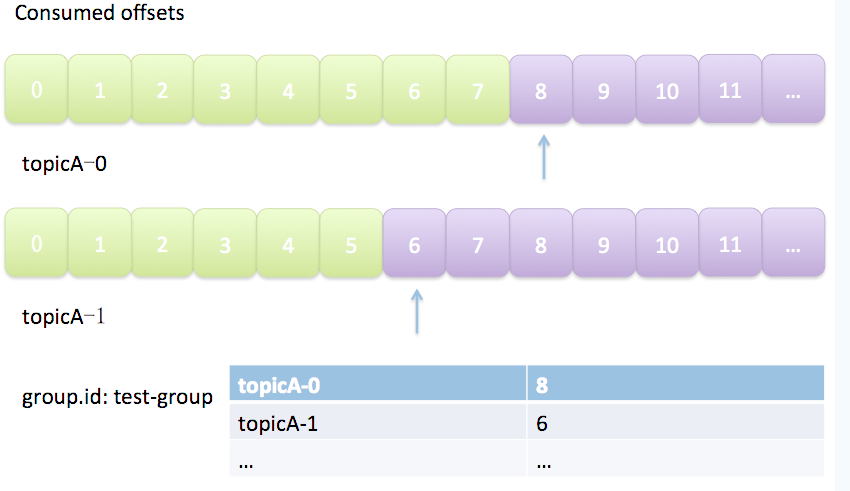
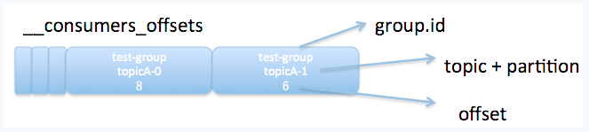

[TOC]

# 一、简介
Kafka中的每个partition都由一系列有序的、不可变的消息组成，这些消息被连续的追加到partition中。partition中的每个消息都有一个连续的序号，用于partition唯一标识一条消息。

**Offset记录着下一条将要发送给Consumer的消息的序号。**

Offset从语义上来看拥有两种：Current Offset和Committed Offset。

1. Current Offset

Current Offset保存在Consumer客户端中，它表示Consumer希望收到的下一条消息的序号。它仅仅在poll()方法中使用。

例如，Consumer第一次调用poll()方法后收到了20条消息，那么Current Offset就被设置为20。这样Consumer下一次调用poll()方法时，Kafka就知道应该从序号为21的消息开始读取。这样就能够保证每次Consumer poll消息时，都能够收到不重复的消息。


2. Committed Offset

**Committed Offset**保存在Broker上，它表示Consumer已经确认消费过的消息的序号。主要通过`commitSync`和`commitAsync` API来操作。


所有的offset信息都保存在了Broker上的一个名为`__consumer_offsets`的topic中。Kafka集群中offset的管理都是由Group Coordinator中的Offset Manager完成的。

# 二、Group Coordinator
Group Coordinator是运行在Kafka集群中每一个Broker内的一个进程。它主要负责Consumer Group的管理，Offset位移管理以及Consumer Rebalance。对于每一个Consumer Group，Group Coordinator都会存储以下信息：

* 订阅的topics列表

* Consumer Group配置信息，包括session timeout等

* 组中每个Consumer的元数据。包括主机名，consumer id

* 每个Group正在消费的topic partition的当前offsets

* Partition的ownership元数据，包括consumer消费的partitions映射关系

> Consumer Group如何确定自己的coordinator是谁呢？ 简单来说分为两步：

1. 确定Consumer Group offset信息将要写入__consumers_offsets topic的哪个分区。具体计算公式：
```java
//offsets.topic.num.partitions默认值为50。
__consumers_offsets partition = Math.abs(groupId.hashCode() % offsets.topic.num.partitions)  
```

2. 该分区leader所在的broker就是被选定的coordinator

# 三、Offset存储模型

由于一个partition只能固定的交给一个消费者组中的一个消费者消费，因此Kafka保存offset时并不直接为每个消费者保存，而是以`groupid-topic-partition -> offset`的方式保存。如图所示：



Kafka在保存Offset的时候，实际上是将Consumer Group和partition对应的offset以消息的方式保存在__consumers_offsets这个topic中。

下图展示了__consumers_offsets中保存的offset消息的格式：



如图所示，一条offset消息的格式为groupid-topic-partition -> offset。因此consumer poll消息时，已知groupid和topic，又通过Coordinator分配partition的方式获得了对应的partition，自然能够通过Coordinator查找__consumers_offsets的方式获得最新的offset了。


consumer提交offset时，Kafka Offset Manager会首先追加一条条新的commit消息到__consumers_offsets topic中，然后更新对应的缓存。读取offset时从缓存中读取，而不是直接读取__consumers_offsets这个topic。

