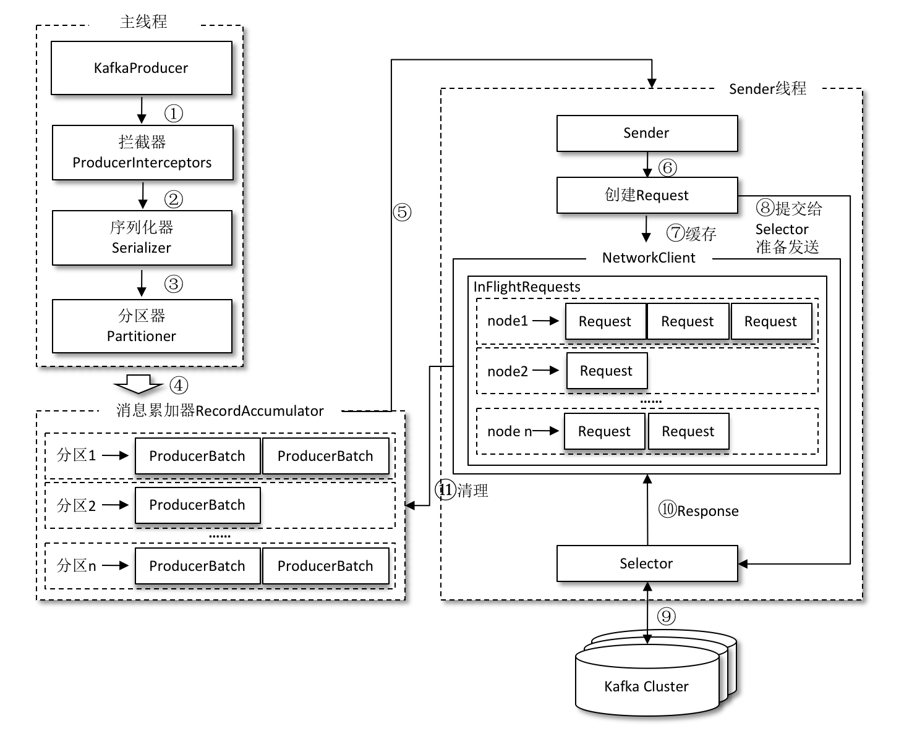
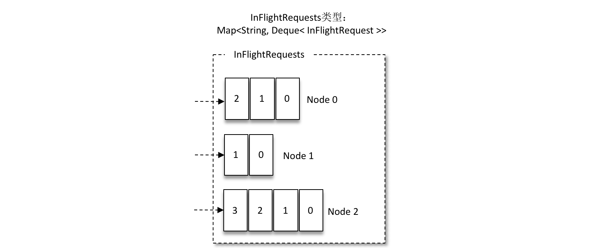

[TOC]

# 一、引入依赖：
```xml
<dependency>
      <groupId>org.apache.kafka</groupId>
      <artifactId>kafka-clients</artifactId>
      <version>2.4.0</version>
</dependency>
```
# 二、生产者示例：
```java
public class SimpleProvider {
    public static void main(String[] args) {
        Properties props = new Properties();
        props.put(ProducerConfig.BOOTSTRAP_SERVERS_CONFIG, "kafka01:9092,kafka02:9092");
	    props.put(ProducerConfig.ACKS_CONFIG, "all");
		props.put(ProducerConfig.RETRIES_CONFIG, 0);
		props.put(ProducerConfig.BATCH_SIZE_CONFIG, 16384);
		props.put(ProducerConfig.LINGER_MS_CONFIG, 1);
		props.put(ProducerConfig.BUFFER_MEMORY_CONFIG, 33554432);
		props.put(ProducerConfig.KEY_SERIALIZER_CLASS_CONFIG,
				StringSerializer.class.getName());
		props.put(ProducerConfig.VALUE_SERIALIZER_CLASS_CONFIG,
				StringSerializer.class.getName());
        props.put(ProducerConfig.RETRIES_CONFIG, 10);
		props.put(ProducerConfig.CLIENT_ID_CONFIG, "producer.client.id.demo");
        //KafkaProducer 是线程安全的，可以在多个线程中共享单个 KafkaProducer 实例，也可以将 KafkaProducer 实例进行池化来供其他线程调用。
        KafkaProducer<String, String> kafkaProducer = new KafkaProducer<String, String>(properties);
        for (int i = 1; i <= 600; i++) {
            kafkaProducer.send(new ProducerRecord<String, String>("topic", "message"+i));
            System.out.println("message"+i);
        }
        kafkaProducer.close();
    }

}
```
## Properties参数说明
1. bootstrap.servers：该参数用来指定生产者客户端连接 Kafka 集群所需的 broker 地址清单，具体的内容格式为 host1:port1,host2:port2，可以设置一个或多个地址，中间以逗号隔开，此参数的默认值为“”。
注意这里并非需要所有的 broker 地址，因为生产者会从给定的 broker 里查找到其他 broker 的信息。不过建议至少要设置两个以上的 broker 地址信息，当其中任意一个宕机时，生产者仍然可以连接到 Kafka 集群上。

2. key.serializer 和 value.serializer：broker 端接收的消息必须以字节数组（byte[]）的形式存在。生产者使用的 KafkaProducer<String, String>和 ProducerRecord<String, String> 中的泛型 <String, String> 对应的就是消息中 key 和 value 的类型，生产者客户端使用这种方式可以让代码具有良好的可读性，不过在发往 broker 之前需要将消息中对应的 key 和 value 做相应的序列化操作来转换成字节数组。key.serializer 和 value.serializer 这两个参数分别用来指定 key 和 value 序列化操作的序列化器，这两个参数无默认值。注意这里必须填写序列化器的全限定名，如`org.apache.kafka.common.serialization.StringSerializer`，单单指定 `StringSerializer` 是错误的

3. acks参数，是在kafkaProducer,也就是在生产者客户端里设置的.默认值即为1。字符串类型
    * 0 ： 生产者发送消息之后不需要等待任何服务端的响应。acks 设置为0可以达到最大的吞吐量。
    * 1 ： 生产者发送消息之后，只要分区的 leader 副本成功写入消息，那么它就会收到来自服务端的成功响应。是消息可靠性和吞吐量之间的折中方案。
    * -1/all ： 生产者在消息发送之后，需要等待 ISR 中的所有副本都成功写入消息之后才能够收到来自服务端的成功响应。可以达到最强的可靠性。但这并不意味着消息就一定可靠，因为ISR中可能只有 leader 副本，即没有别的副本，这样就退化成了 acks=1 的情况。

4. retries,对于可重试的异常，如果配置了 retries 参数，那么只要在规定的重试次数内自行恢复了，就不会抛出异常。retries 参数的默认值为0.

5. retry.backoff.ms 设定两次重试之间的时间间隔，避免无效的频繁重试,默认值为100

在配置 retries 和 retry.backoff.ms 之前，最好先估算一下可能的异常恢复时间，这样可以设定总的重试时间大于这个异常恢复时间，以此来避免生产者过早地放弃重试。

6. max.in.flight.requests.per.connection，默认值为5，即每个连接最多只能缓存5个未响应的请求，超过该数值之后就不能再向这个连接发送更多的请求了。在需要保证消息顺序的场合（例如MySQL 的 binlog 传输）建议把参数 max.in.flight.requests.per.connection 配置为1，而不是把 retries 配置为0，不过这样也会影响整体的吞吐。

7. max.request.size,这个参数用来限制生产者客户端能发送的消息的最大值，默认值为1048576B，即1MB

8. compression.type 用来指定消息的压缩方式，默认值为“none”，即默认情况下，消息不会被压缩，该参数还可以配置为“gzip”“snappy”和“lz4”。消息压缩是一种使用时间换空间的优化方式，如果对时延有一定的要求，则不推荐对消息进行压缩。

9. connections.max.idle.ms 这个参数用来指定在多久之后关闭闲置的连接，默认值是540000（ms），即9分钟。

10. linger.ms 这个参数用来指定生产者发送 ProducerBatch 之前等待更多消息（ProducerRecord）加入 ProducerBatch 的时间，默认值为0。生产者客户端会在 ProducerBatch 被填满或等待时间超过 linger.ms 值时发送出去。增大这个参数的值会增加消息的延迟，但是同时能提升一定的吞吐量。

11. receive.buffer.bytes 这个参数用来设置 Socket 接收消息缓冲区（SO_RECBUF）的大小，默认值为32768（B），即32KB。如果设置为-1，则使用操作系统的默认值。如果 Producer 与 Kafka 处于不同的机房，则可以适地调大这个参数值。

12. end.buffer.bytes 这个参数用来设置 Socket 发送消息缓冲区（SO_SNDBUF）的大小，默认值为131072（B），即128KB。与 receive.buffer.bytes 参数一样，如果设置为-1，则使用操作系统的默认值。

13. request.timeout.ms 这个参数用来配置 Producer 等待请求响应的最长时间，默认值为30000（ms）。请求超时之后可以选择进行重试。注意这个参数需要比 broker 端参数 replica.lag.time.max.ms 的值要大，这样可以减少因客户端重试而引起的消息重复的概率。

其他参数列表：

|参 数 名 称|默 认 值|	参 数 释 义|
| --- | --- | --- |
|bootstrap.servers	|“”	|指定连接 Kafka 集群所需的 broker 地址清单|
|key.serializer	|“”	|消息中 key 对应的序列化类，需要实现org.apache.kafka.common.serialization.Serializer 接口|
|value.serializer|	“”	|消息中 value 对应的序列化类，需要实现 org.apache.kafka.common.serialization.Serializer 接口|
|buffer.memory	|33554432（32MB）|	生产者客户端中用于缓存消息的缓冲区大小|
|batch.size	|16384（16KB）|	用于指定 ProducerBatch 可以复用内存区域的大小|
|client.id|	“”	|用来设定 KafkaProducer 对应的客户端id|
|max.block.ms|	60000	|用来控制 KafkaProducer 中 send() 方法和 partitionsFor() 方法的阻塞时间。当生产者的发送缓冲区已满，或者没有可用的元数据时，这些方法就会阻塞|
|partitioner.class	|org.apache.kafka.clients. producer.internals.DefaultPartitioner|	用来指定分区器，需要实现 org.apache.kafka. clients.producer.Partitioner 接口|
|enable.idempotence	|false	|是否开启幂等性功能|
|interceptor.classes|	“”	|用来设定生产者拦截器，需要实现 org.apache. kafka.clients.producer. ProducerInterceptor 接口。|
|max.in.flight.requests.per.connection|5|限制每个连接（也就是客户端与 Node 之间的连接）最多缓存的请求数|
|metadata.max.age.ms	|300000（5分钟）|	如果在这个时间内元数据没有更新的话会被强制更新|
|transactional.id	|null|	设置事务id，|必须唯一|


## KafkaProducer中的异常
> 可重试的异常

常见的可重试异常有：
* NetworkException表示网络异常，这个有可能是由于网络瞬时故障而导致的异常，可以通过重试解决；

* LeaderNotAvailableException表示分区的 leader 副本不可用，这个异常通常发生在 leader 副本下线而新的 leader 副本选举完成之前，重试之后可以重新恢复。

* UnknownTopicOrPartitionException

* NotEnoughReplicasException

* NotCoordinatorException 

>不可重试的异常

比如第2节中提及的 RecordTooLargeException 异常，暗示了所发送的消息太大，KafkaProducer 对此不会进行任何重试，直接抛出异常。

## ProducerRecord
ProducerRecord 类的定义如下（只截取成员变量）：
```java
public class ProducerRecord<K, V> {
    private final String topic; //主题
    private final Integer partition; //分区号
    private final Headers headers; //消息头部
    private final K key; //键
    private final V value; //值
    private final Long timestamp; //消息的时间戳
    //省略其他成员方法和构造方法
}
```
1. topic 和 partition 字段分别代表消息要发往的主题和分区号。

2. headers 字段是消息的头部，大多用来设定一些与应用相关的信息，如无需要也可以不用设置。

3. key 是用来指定消息的键，它不仅是消息的附加信息，还可以用来计算分区号进而可以让消息发往特定的分区。前面提及消息以主题为单位进行归类，而这个 key 可以让消息再进行二次归类，同一个 key 的消息会被划分到同一个分区中.

4. value 是指消息体，一般不为空，如果为空则表示特定的消息—墓碑消息。

5. timestamp 是指消息的时间戳，它有 CreateTime 和 LogAppendTime 两种类型，前者表示消息创建的时间，后者表示消息追加到日志文件的时间。

构造方法：
```java
public ProducerRecord(String topic, Integer partition, Long timestamp, 
                      K key, V value, Iterable<Header> headers)
public ProducerRecord(String topic, Integer partition, Long timestamp,
                      K key, V value)
public ProducerRecord(String topic, Integer partition, K key, V value, 
                      Iterable<Header> headers)
public ProducerRecord(String topic, Integer partition, K key, V value)
public ProducerRecord(String topic, K key, V value)
//这种方式相当于将 ProducerRecord 中除 topic 和 value 外的属性全部值设置为 null。在实际的应用中，还会用到其他构造方法，比如要指定 key，或者添加 headers 等。
public ProducerRecord(String topic, V value)
```

## send()
发送消息主要有三种模式：发后即忘（fire-and-forget）、同步（sync）及异步（async）。默认为发后即忘

构造方法：
```java
public Future<RecordMetadata> send(ProducerRecord<K, V> record)
public Future<RecordMetadata> send(ProducerRecord<K, V> record, 
                                   Callback callback)
```
### 同步的发送方式
要实现同步的发送方式，可以利用返回的 Future 对象实现，
> 方式一：

示例如下：
```java
try {
    producer.send(record).get();
} catch (ExecutionException | InterruptedException e) {
    e.printStackTrace();
}
```
实际上 send() 方法本身就是异步的，send() 方法返回的 Future 对象可以使调用方稍后获得发送的结果。示例中在执行 send() 方法之后直接链式调用了 get() 方法来阻塞等待 Kafka 的响应，直到消息发送成功，或者发生异常。如果发生异常，那么就需要捕获异常并交由外层逻辑处理。

> 方式二：
也可以在执行完 send() 方法之后不直接调用 get() 方法，比如下面的一种同步发送方式的实现：
```java
try {
    Future<RecordMetadata> future = producer.send(record);
    RecordMetadata metadata = future.get();
    System.out.println(metadata.topic() + "-" +
            metadata.partition() + ":" + metadata.offset());
} catch (ExecutionException | InterruptedException e) {
    e.printStackTrace();
}
```

这样可以获取一个 RecordMetadata 对象，在 RecordMetadata 对象里包含了消息的一些元数据信息，比如当前消息的主题、分区号、分区中的偏移量（offset）、时间戳等。

* 如果在应用代码中需要这些信息，则可以使用这个方式。

* 如果不需要，则直接采用 producer.send(record).get() 的方式更省事。

> Future 表示一个任务的生命周期，并提供了相应的方法来判断任务是否已经完成或取消，以及获取任务的结果和取消任务等。既然 KafkaProducer.send() 方法的返回值是一个 Future 类型的对象，那么完全可以用 Java 语言层面的技巧来丰富应用的实现，比如使用 Future 中的 get(long timeout, TimeUnit unit) 方法实现可超时的阻塞。

### 异步发送

一般是在 send() 方法里指定一个 Callback 的回调函数，Kafka 在返回响应时调用该函数来实现异步的发送确认。

有读者或许会有疑问，send() 方法的返回值类型就是 Future，而 Future 本身就可以用作异步的逻辑处理。这样做不是不行，只不过 Future 里的 get() 方法在何时调用，以及怎么调用都是需要面对的问题，消息不停地发送，那么诸多消息对应的 Future 对象的处理难免会引起代码处理逻辑的混乱。

使用 Callback 的方式非常简洁明了，Kafka 有响应时就会回调，要么发送成功，要么抛出异常。

异步发送方式的示例如下：
```java
producer.send(record, new Callback() {
    @Override
    public void onCompletion(RecordMetadata metadata, Exception exception) {
        if (exception != null) {
            exception.printStackTrace();
        } else {
            System.out.println(metadata.topic() + "-" +
                    metadata.partition() + ":" + metadata.offset());
        }
    }
});
```
对于同一个分区而言，如果消息 record1 于 record2 之前先发送（参考上面的示例代码），那么 KafkaProducer 就可以保证对应的 callback1 在 callback2 之前调用，也就是说，回调函数的调用也可以保证分区有序。

## close()
在发送完这些消息之后，需要调用 KafkaProducer 的 close() 方法来回收资源。close() 方法会阻塞等待之前所有的发送请求完成后再关闭 KafkaProducer。

KafkaProducer 还提供了一个带超时时间的 close() 方法，具体定义如下：

```java
public void close(long timeout, TimeUnit timeUnit)
```
如果调用了带超时时间 timeout 的 close() 方法，那么只会在等待 timeout 时间内来完成所有尚未完成的请求处理，然后强行退出。在实际应用中，一般使用的都是无参的 close() 方法。


## 序列化
生产者使用的序列化器和消费者使用的反序列化器是需要一一对应的。

* 生产者需要用序列化器（Serializer）把对象转换成字节数组才能通过网络发送给 Kafka。

* 消费者需要用反序列化器（Deserializer）把从 Kafka 中收到的字节数组转换成相应的对象。

除了用于 String 类型的序列化器（`org.apache.kafka.common.serialization.StringSerializer`），还有 ByteArray、ByteBuffer、Bytes、Double、Integer、Long 这几种类型，它们都实现了 `org.apache.kafka.common.serialization.Serializer` 接口，此接口有3个方法：
```java
//用来配置当前类
public void configure(Map<String, ?> configs, boolean isKey)
//用来执行序列化操作
public byte[] serialize(String topic, T data)
//用来关闭当前的序列化器,如果实现了此方法，则必须确保此方法的幂等性，因为这个方法很可能会被 KafkaProducer 调用多次。
public void close()
```
以 StringSerializer 为例来看看 Serializer 接口中的3个方法的使用方法:

```java
public class StringSerializer implements Serializer<String> {
    //一般客户端对于 key.serializer.encoding、value.serializer. encoding 和 serializer.encoding 这几个参数都不会配置，在 KafkaProducer 的参数集合（ProducerConfig）里也没有这几个参数（它们可以看作用户自定义的参数），所以一般情况下 encoding 的值就为默认的“UTF-8”
    private String encoding = "UTF8";

    @Override
    public void configure(Map<String, ?> configs, boolean isKey) {
        String propertyName = isKey ? "key.serializer.encoding" :
                "value.serializer.encoding";
        Object encodingValue = configs.get(propertyName);
        if (encodingValue == null)
            encodingValue = configs.get("serializer.encoding");
        if (encodingValue != null && encodingValue instanceof String)
            encoding = (String) encodingValue;
    }

    @Override
    //将 String 类型转为 byte[] 类型
    public byte[] serialize(String topic, String data) {
        try {
            if (data == null)
                return null;
            else
                return data.getBytes(encoding);
        } catch (UnsupportedEncodingException e) {
            throw new SerializationException("Error when serializing " +
                    "string to byte[] due to unsupported encoding " + encoding);
        }
    }

    @Override
    public void close() {
        // nothing to do
    }
}
```
如果 Kafka 客户端提供的几种序列化器都无法满足应用需求，则可以选择使用如 Avro、JSON、Thrift、ProtoBuf 和 Protostuff 等通用的序列化工具来实现，或者使用自定义类型的序列化器来实现。

### 自定义序列化器
假设我们要发送的消息都是 Company 对象，
```java
import lombok.AllArgsConstructor;
import lombok.Builder;
import lombok.Data;
import lombok.NoArgsConstructor;

@Data
@NoArgsConstructor
@AllArgsConstructor
@Builder
public class Company {
    private String name;
    private String address;
}
```
下面我们再来看一下 Company 对应的序列化器 CompanySerializer:
```java
public class CompanySerializer implements Serializer<Company> {
    @Override
    public void configure(Map configs, boolean isKey) {}

    @Override
    public byte[] serialize(String topic, Company data) {
        if (data == null) {
            return null;
        }
        byte[] name, address;
        try {
            if (data.getName() != null) {
                name = data.getName().getBytes("UTF-8");
            } else {
                name = new byte[0];
            }
            if (data.getAddress() != null) {
                address = data.getAddress().getBytes("UTF-8");
            } else {
                address = new byte[0];
            }
            ByteBuffer buffer = ByteBuffer.
                    allocate(4+4+name.length + address.length);
            buffer.putInt(name.length);
            buffer.put(name);
            buffer.putInt(address.length);
            buffer.put(address);
            return buffer.array();
        } catch (UnsupportedEncodingException e) {
            e.printStackTrace();
        }
        return new byte[0];
    }

    @Override
    public void close() {}
}
```

configure()和close()方法都留空，主要实现了序列化方法serialize(String topic, Company data)

## 分区器
消息经过序列化之后就需要确定它发往的分区，如果消息 ProducerRecord 中指定了 partition 字段，那么就不需要分区器的作用，因为 partition 代表的就是所要发往的分区号。

如果消息 ProducerRecord 中没有指定 partition 字段，那么就需要依赖分区器，根据 key 这个字段来计算 partition 的值。分区器的作用就是为消息分配分区。

Kafka 中提供的默认分区器是`org.apache.kafka.clients.producer.internals.DefaultPartitioner`，它实现了 `org.apache.kafka.clients.producer.Partitioner`接口，这个接口中定义了2个方法，

```java
//用来计算分区号，返回值为 int 类型
//方法中的参数分别表示主题、键、序列化后的键、值、序列化后的值，以及集群的元数据信息，
public int partition(String topic, Object key, byte[] keyBytes, 
                     Object value, byte[] valueBytes, Cluster cluster);
//在关闭分区器的时候用来回收一些资源
public void close();
```
Partitioner 接口还有一个父接口 org.apache.kafka.common.Configurable，这个接口中只有一个方法：
```java
//主要用来获取配置信息及初始化数据
void configure(Map<String, ?> configs);
```
在默认分区器 DefaultPartitioner 的实现中，close() 是空方法，而在 partition() 方法中定义了主要的分区分配逻辑:

* 如果 key 不为 null，那么默认的分区器会对 key 进行哈希（采用 MurmurHash2 算法，具备高运算性能及低碰撞率），最终根据得到的哈希值来计算分区号，拥有相同 key 的消息会被写入同一个分区。

* 如果 key 为 null，那么消息将会以轮询的方式发往主题内的各个可用分区。

>注意：如果 key 不为 null，那么计算得到的分区号会是所有分区中的任意一个；如果 key 为 null 并且有可用分区时，那么计算得到的分区号仅为可用分区中的任意一个，注意两者之间的差别。

### 自定义分区器示例
除了使用 Kafka 提供的默认分区器进行分区分配，还可以使用自定义的分区器，只需同 DefaultPartitioner 一样实现 Partitioner 接口即可。

```java
public class DemoPartitioner implements Partitioner {
    private final AtomicInteger counter = new AtomicInteger(0);

    @Override
    public int partition(String topic, Object key, byte[] keyBytes,
                         Object value, byte[] valueBytes, Cluster cluster) {
        List<PartitionInfo> partitions = cluster.partitionsForTopic(topic);
        int numPartitions = partitions.size();
        if (null == keyBytes) {
            return counter.getAndIncrement() % numPartitions;
        }else
            return Utils.toPositive(Utils.murmur2(keyBytes)) % numPartitions;
    }

    @Override public void close() {}

    @Override public void configure(Map<String, ?> configs) {}
}
```
实现自定义的 DemoPartitioner 类之后，需要通过配置参数 partitioner.class 来显式指定这个分区器。示例如下：
```java
props.put(ProducerConfig.PARTITIONER_CLASS_CONFIG,DemoPartitioner.class.getName());
```
比如一般大型电商都有多个仓库，可以将仓库的名称或 ID 作为 key 来灵活地记录商品信息。

## 拦截器
生产者拦截器既可以用来在消息发送前做一些准备工作，比如按照某个规则过滤不符合要求的消息、修改消息的内容等，也可以用来在发送回调逻辑前做一些定制化的需求，比如统计类工作。

生产者拦截器的使用也很方便，主要是自定义实现`org.apache.kafka.clients.producer.ProducerInterceptor` 接口。ProducerInterceptor 接口中包含3个方法：
```java
//KafkaProducer 在将消息序列化和计算分区之前会调用生产者拦截器的 onSend() 方法来对消息进行相应的定制化操作。
public ProducerRecord<K, V> onSend(ProducerRecord<K, V> record);
//KafkaProducer 会在消息被应答（Acknowledgement）之前或消息发送失败时调用生产者拦截器的 onAcknowledgement() 方法，优先于用户设定的 Callback 之前执行。这个方法运行在 Producer 的I/O线程中，所以这个方法中实现的代码逻辑越简单越好，否则会影响消息的发送速度。
public void onAcknowledgement(RecordMetadata metadata, Exception exception);
//close() 方法主要用于在关闭拦截器时执行一些资源的清理工作。在这3个方法中抛出的异常都会被捕获并记录到日志中，但并不会再向上传递。
public void close();
```

### 拦截器示例：
ProducerInterceptorPrefix 中通过 onSend() 方法来为每条消息添加一个前缀“prefix1-”，并且通过 onAcknowledgement() 方法来计算发送消息的成功率。
```java
public class ProducerInterceptorPrefix implements 
        ProducerInterceptor<String,String>{
    private volatile long sendSuccess = 0;
    private volatile long sendFailure = 0;

    @Override
    public ProducerRecord<String, String> onSend(
            ProducerRecord<String, String> record) {
        String modifiedValue = "prefix1-" + record.value();
        return new ProducerRecord<>(record.topic(), 
                record.partition(), record.timestamp(),
                record.key(), modifiedValue, record.headers());
    }

    @Override
    public void onAcknowledgement(
            RecordMetadata recordMetadata, 
            Exception e) {
        if (e == null) {
            sendSuccess++;
        } else {
            sendFailure ++;
        }
    }

    @Override
    public void close() {
        double successRatio = (double)sendSuccess / (sendFailure + sendSuccess);
        System.out.println("[INFO] 发送成功率="
                + String.format("%f", successRatio * 100) + "%");
    }

    @Override
    public void configure(Map<String, ?> map) {}
}
```

实现自定义的 ProducerInterceptorPrefix 之后，需要在 KafkaProducer 的配置参数 interceptor.classes 中指定这个拦截器，此参数的默认值为“”。示例如下：
```java
properties.put(ProducerConfig.INTERCEPTOR_CLASSES_CONFIG,ProducerInterceptorPrefix.class.getName());
```

KafkaProducer 中不仅可以指定一个拦截器，还可以指定多个拦截器以形成拦截链。拦截链会按照 interceptor.classes 参数配置的拦截器的顺序来一一执行（配置的时候，各个拦截器之间使用逗号隔开）。

下面我们再添加一个自定义拦截器 ProducerInterceptorPrefixPlus，它只实现了 Interceptor 接口中的 onSend() 方法，主要用来为每条消息添加另一个前缀“prefix2-”，具体实现如下：

```java
public ProducerRecord<String, String> onSend(
        ProducerRecord<String, String> record) {
    String modifiedValue = "prefix2-"+record.value() ;
    return new ProducerRecord<>(record.topic(),
            record.partition(), record.timestamp(),
            record.key(), modifiedValue, record.headers());
}
```
接着修改生产者的 interceptor.classes 配置，具体实现如下：
```java
properties.put(ProducerConfig.INTERCEPTOR_CLASSES_CONFIG,
        ProducerInterceptorPrefix.class.getName() + ","
                + ProducerInterceptorPrefixPlus.class.getName());
```
在拦截链中，如果某个拦截器执行失败，那么下一个拦截器会接着从上一个执行成功的拦截器继续执行。

# 三、生产者原理分析

整个生产者客户端由两个线程协调运行，这两个线程分别为主线程和 Sender 线程（发送线程）。
* 在主线程中由 KafkaProducer 创建消息，然后通过可能的拦截器、序列化器和分区器的作用之后缓存到消息累加器（RecordAccumulator，也称为消息收集器）中。

* Sender 线程负责从 RecordAccumulator（消息收集器） 中获取消息并将其发送到 Kafka 中。

### RecordAccumulator(消息收集器)
1. RecordAccumulator 主要用来缓存消息以便 Sender 线程可以批量发送，进而减少网络传输的资源消耗以提升性能。

2. RecordAccumulator 缓存的大小可以通过生产者客户端参数` buffer.memory `配置，默认值为 33554432B，即32MB。

3. 如果生产者发送消息的速度超过发送到服务器的速度，则会导致生产者空间不足，这个时候 KafkaProducer 的 send() 方法调用要么被阻塞，要么抛出异常，这个取决于参数 max.block.ms 的配置，此参数的默认值为60000，即60秒。超过60秒会抛出异常。


4. 消息在网络上都是以字节（Byte）的形式传输的，在发送之前需要创建一块内存区域来保存对应的消息。

5. 在 Kafka 生产者客户端中，通过 java.io.ByteBuffer 实现消息内存的创建和释放。

6. 不过频繁的创建和释放是比较耗费资源的，在 RecordAccumulator 的内部还有一个 BufferPool，它主要用来实现 ByteBuffer 的复用，以实现缓存的高效利用。

7. 不过 BufferPool **只针对特定大小的 ByteBuffer 进行管理**，而其他大小的 ByteBuffer 不会缓存进 BufferPool 中，**这个特定大小的ByteBuffer中存的即为ProducerBatch**

9. 这个特定的大小由 batch.size 参数来指定，默认值为16384B，即16KB。我们可以适当地调大 batch.size 参数以便多缓存一些消息。


### ProducerBatch
1. ProducerRecord 是生产者中创建的消息，而 ProducerBatch 是指一个消息批次，ProducerRecord 会被包含在 ProducerBatch 中，这样可以使字节的使用更加紧凑。

2. 将较小的 ProducerRecord 拼凑成一个较大的 ProducerBatch，也可以减少网络请求的次数以提升整体的吞吐量。

3. ProducerBatch 和消息的具体格式有关.

4. 如果生产者客户端需要向很多分区发送消息，则可以将` buffer.memory `参数适当调大以增加整体的吞吐量。

5. ProducerBatch 的大小和 batch.size 参数也有着密切的关系。

### 消息处理流程
1. 主线程中发送过来的消息都会被追加到 RecordAccumulator 的某个双端队列（Deque）中，

2. 在 RecordAccumulator 的内部为每个分区都维护了一个双端队列，队列中的内容就是 ProducerBatch，即 Deque。消息写入缓存时，追加到双端队列的尾部；Sender 读取消息时，从双端队列的头部读取。

3. 当一条消息（ProducerRecord）流入 RecordAccumulator 时，会先寻找与消息分区所对应的双端队列（如果没有则新建），再从这个双端队列的尾部获取一个 ProducerBatch（如果没有则新建），查看 ProducerBatch 中是否还可以写入这个 ProducerRecord，如果可以则写入，如果不可以则需要创建一个新的 ProducerBatch。

4. 在新建 ProducerBatch 时评估这条消息的大小是否超过 batch.size 参数的大小，
    * 如果不超过，那么就以 batch.size 参数的大小来创建 ProducerBatch，这样在使用完这段内存区域之后，可以通过 BufferPool 的管理来进行复用；
    * 如果超过，那么就以评估的大小来创建 ProducerBatch，这段内存区域不会被复用。

5. Sender 从 RecordAccumulator 中获取缓存的消息之后，会进一步将原本<分区, Deque< ProducerBatch>> 的保存形式转变成 <Node, List< ProducerBatch> 的形式，其中 Node 表示 Kafka 集群的 broker 节点。（对于网络连接来说，生产者客户端是与具体的 broker 节点建立的连接，也就是向具体的 broker 节点发送消息，而并不关心消息属于哪一个分区；而对于 KafkaProducer 的应用逻辑而言，我们只关注向哪个分区中发送哪些消息，所以在这里需要做一个应用逻辑层面到网络I/O层面的转换。)

6. 在转换成 <Node, List> 的形式之后，Sender 还会进一步封装成 <Node, Request> 的形式，这样就可以将 Request 请求发往各个 Node 了，**这里的 Request 是指 Kafka 的各种协议请求，对于消息发送而言就是指具体的 ProduceRequest**。

7. 请求在从 Sender 线程发往 Kafka 之前还会保存到 InFlightRequests 中，InFlightRequests 保存对象的具体形式为 Map<NodeId, Deque>，它的主要作用是**缓存了已经发出去但还没有收到响应的请求**（NodeId 是一个 String 类型，表示节点的 id 编号）。

## InFlightRequests

> 1. InFlightRequests 通过配置参数，可以限制每个连接（也就是客户端与 Node 之间的连接）最多缓存的请求数。

这个配置参数为 `max.in.flight.requests.per.connection`，默认值为5，即每个连接最多只能缓存5个未响应的请求，超过该数值之后就不能再向这个连接发送更多的请求了，除非有缓存的请求收到了响应（Response）。通过比较 Deque 的 size 与这个参数的大小来判断对应的 Node 中是否已经堆积了很多未响应的消息，如果真是如此，那么说明这个 Node 节点负载较大或网络连接有问题，再继续向其发送请求会增大请求超时的可能。

> 2.  InFlightRequests 还可以获得 leastLoadedNode，即所有 Node 中负载最小的那一个

这里的负载最小是通过每个 Node 在 InFlightRequests 中还未确认的请求决定的，未确认的请求越多则认为负载越大。

示例：
对于下图中的 InFlightRequests 来说，图中展示了三个节点 Node0、Node1和Node2，很明显 Node1 的负载最小。Node1 为当前的 leastLoadedNode。



选择 leastLoadedNode 发送请求可以使它能够尽快发出，避免因网络拥塞等异常而影响整体的进度。leastLoadedNode 的概念可以用于多个应用场合，比如元数据请求、消费者组播协议的交互。

> 3. 客户端通过leastLoadedNode更新元数据
元数据是指 Kafka 集群的元数据，这些元数据具体记录了集群中有哪些主题，这些主题有哪些分区，每个分区的 leader 副本分配在哪个节点上，follower 副本分配在哪些节点上，哪些副本在 AR、ISR 等集合中，集群中有哪些节点，控制器节点又是哪一个等信息。

1. 元数据的更新操作是在客户端内部进行的，对客户端的外部使用者不可见。当需要更新元数据时，会先挑选出 leastLoadedNode，然后向这个 Node 发送 `MetadataRequest` 请求来获取具体的元数据信息。

2. 这个更新操作是由 Sender 线程发起的，在创建完 MetadataRequest 之后同样会存入 InFlightRequests，之后的步骤就和发送消息时的类似,即等待服务端确认。

3. 元数据虽然由 Sender 线程负责更新，但是主线程也需要读取这些信息，这里的数据同步通过 synchronized 和 final 关键字来保障。

