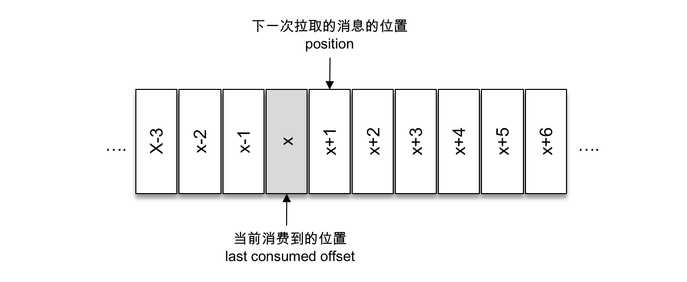

[TOC]

# 一、引入依赖：
```xml
<dependency>
      <groupId>org.apache.kafka</groupId>
      <artifactId>kafka-clients</artifactId>
      <version>2.4.0</version>
</dependency>
```
# 二、消费者示例
一个正常的消费逻辑需要具备以下几个步骤：

1. 配置消费者客户端参数及创建相应的消费者实例。

2. 订阅主题。

3. 拉取消息并消费。

4. 提交消费位移。

5. 关闭消费者实例。

```java
public class KafkaConsumerAnalysis {
	public static final String brokerList = "192.168.202.128:9092,192.168.202.129:9092,192.168.202.130:9092";
	public static final String topic = "test";
	public static final String groupId = "group.demo";
	public static final AtomicBoolean isRunning = new AtomicBoolean(true);

	public static Properties initConfig() {
		Properties props = new Properties();
		props.put(ConsumerConfig.BOOTSTRAP_SERVERS_CONFIG, brokerList);
		props.put(ConsumerConfig.KEY_DESERIALIZER_CLASS_CONFIG, StringDeserializer.class.getName());
		props.put(ConsumerConfig.VALUE_DESERIALIZER_CLASS_CONFIG, StringDeserializer.class.getName());
		props.put(ConsumerConfig.AUTO_OFFSET_RESET_CONFIG, "earliest");
		props.put(ConsumerConfig.GROUP_ID_CONFIG, groupId);
		props.put(ConsumerConfig.CLIENT_ID_CONFIG, "consumer.client.id.demo");
		return props;
	}

	public static void main(String[] args) {
		Properties props = initConfig();
		KafkaConsumer<String, String> consumer = new KafkaConsumer<>(props);
		consumer.subscribe(Arrays.asList(topic));

		try {
			while (isRunning.get()) {
				ConsumerRecords<String, String> records =
						consumer.poll(Duration.ofMillis(1000));
				for (ConsumerRecord<String, String> record : records) {
					System.out.println("topic = " + record.topic()
							+ ", partition = " + record.partition()
							+ ", offset = " + record.offset());
					System.out.println("key = " + record.key()
							+ ", value = " + record.value());
				}
			}
		} catch (Exception e) {
			e.printStackTrace();
		} finally {
			consumer.close();
		}
	}
}
```
## Properties参数设置

1. 参数 enable.auto.commit ：自动提交消费位移，默认为true，这个默认的自动提交不是每消费一条消息就提交一次，而是定期提交。

2. 参数 auto.commit.interval.ms ：自动提交消费位移的时间间隔，默认值为5秒，在默认的方式下，消费者每隔5秒会将拉取到的每个分区中最大的消息位移进行提交。自动位移提交的动作是在 poll() 方法的逻辑里完成的，**在每次真正向服务端发起拉取请求之前会检查是否可以进行位移提交**，如果可以，那么就会提交上一次轮询的位移。

3. 参数auto.offset.reset，当消费者查找不到所记录的消费位移时，该配置决定从何处开始消费
    * latest:默认值，表示从分区末尾开始消费消息
    * earliest：表示从分区起始处开始消费消息
    * none：查不到消费位移时，报出 NoOffsetForPartitionException 异常。如果能够找到消费位移，那么配置为“none”不会出现任何异常。如果配置的不是“latest”、“earliest”和“none”，则会报出 ConfigException 异常。


4. 参数 fetch.min.bytes ：该参数用来配置 Consumer 在一次拉取请求（调用 poll() 方法）中能从 Kafka 中拉取的最小数据量，默认值为1（B）。
Kafka 在收到 Consumer 的拉取请求时，如果返回给 Consumer 的数据量小于这个参数所配置的值，那么它就需要进行等待，直到数据量满足这个参数的配置大小。可以适当调大这个参数的值以提高一定的吞吐量，不过也会造成额外的延迟（latency），对于延迟敏感的应用可能就不可取了。

5. 参数 fetch.max.bytes 该参数与 fetch.min.bytes 参数对应，它用来配置 Consumer 在一次拉取请求中从Kafka中拉取的最大数据量，默认值为52428800（B），也就是50MB。
如果这个参数设置的值比任何一条写入 Kafka 中的消息要小，那么会不会造成无法消费呢？可以正常消费。该参数设定的不是绝对的最大值，如果在第一个非空分区中拉取的第一条消息大于该值，那么该消息将仍然返回，以确保消费者继续工作。
Kafka 中所能接收的最大消息的大小通过服务端参数 message.max.bytes（对应于主题端参数 max.message.bytes）来设置。

6. fetch.max.wait.ms 用于指定 Kafka 的等待时间，默认值为500（ms）。如果 Kafka 中没有足够多的消息而满足不了 fetch.min.bytes 参数的要求，那么最终会等待500ms。这个参数的设定和 Consumer 与 Kafka 之间的延迟也有关系，如果业务应用对延迟敏感，那么可以适当调小这个参数。

7. max.partition.fetch.bytes 这个参数用来配置从每个分区里返回给 Consumer 的最大数据量，默认值为1048576（B），即1MB。
这个参数与 fetch.max.bytes 参数相似，只不过前者用来限制一次拉取中每个分区的消息大小，而后者用来限制一次拉取中整体消息的大小。同样，如果这个参数设定的值比消息的大小要小，那么也不会造成无法消费，Kafka 为了保持消费逻辑的正常运转不会对此做强硬的限制。

8. max.poll.records 这个参数用来配置 Consumer 在一次拉取请求中拉取的最大消息数，默认值为500（条）。如果消息的大小都比较小，则可以适当调大这个参数值来提升一定的消费速度。
9. connections.max.idle.ms 这个参数用来指定在多久之后关闭闲置的连接，默认值是540000（ms），即9分钟。
10. exclude.internal.topics Kafka 中有两个内部的主题： `__consumer_offsets 和 __transaction_state`。exclude.internal.topics 用来指定 Kafka 中的内部主题是否可以向消费者公开，默认值为 true。如果设置为 true，那么只能使用 subscribe(Collection)的方式而不能使用 subscribe(Pattern)的方式来订阅内部主题，设置为 false 则没有这个限制。
11. receive.buffer.bytes 这个参数用来设置 Socket 接收消息缓冲区（SO_RECBUF）的大小，默认值为65536（B），即64KB。如果设置为-1，则使用操作系统的默认值。如果 Consumer 与 Kafka 处于不同的机房，则可以适当调大这个参数值。
12. send.buffer.bytes 这个参数用来设置Socket发送消息缓冲区（SO_SNDBUF）的大小，默认值为131072（B），即128KB。与receive.buffer.bytes参数一样，如果设置为-1，则使用操作系统的默认值。
13.  request.timeout.ms 这个参数用来配置 Consumer 等待请求响应的最长时间，默认值为30000（ms）。
14.  metadata.max.age.ms 这个参数用来配置元数据的过期时间，默认值为300000（ms），即5分钟。如果元数据在此参数所限定的时间范围内没有进行更新，则会被强制更新，即使没有任何分区变化或有新的 broker 加入。
15.   reconnect.backoff.ms 这个参数用来配置尝试重新连接指定主机之前的等待时间（也称为退避时间），避免频繁地连接主机，默认值为50（ms）。这种机制适用于消费者向 broker 发送的所有请求。
16.   retry.backoff.ms 这个参数用来配置尝试重新发送失败的请求到指定的主题分区之前的等待（退避）时间，避免在某些故障情况下频繁地重复发送，默认值为100（ms）。
17.   isolation.level 这个参数用来配置消费者的事务隔离级别。字符串类型，有效值为“read_uncommitted”和“read_committed”，表示消费者所消费到的位置，如果设置为“read_committed”，那么消费者就会忽略事务未提交的消息，即只能消费到LSO（LastStableOffset）的位置，默认情况下为“read_uncommitted”，即可以消费到 HW（High Watermark）处的位置。

下表罗列了部分消费者客户端的重要参数。

|参 数 名 称	|默 认 值	 |参 数 释 义|
| --- | --- | --- |
|bootstrap.servers	|“”|	指定连接 Kafka 集群所需的 broker 地址清单|
|key.deserializer|		|消息中 key 所对应的反序列化类，需要实现 org.apache.kafka.common.serialization.Deserializer 接口|
|value.deserializer	|	|消息中 key 所对应的反序列化类，需要实现 org.apache.kafka.common.serialization.Deserializer 接口|
|group.id|	“”	|此消费者所隶属的消费组的唯一标识，即消费组的名称|
|client.id|	“”	|消费者客户端的id。|
|heartbeat.interval.ms|	3000	|当使用 Kafka 的分组管理功能时，心跳到消费者协调器之间的预计时间。心跳用于确保消费者的会话保持活动状态，当有新消费者加入或离开组时方便重新平衡。该值必须比 session.timeout.ms 小，通常不高于1/3。它可以调整得更低，以控制正常重新平衡的预期时间|
|session.timeout.ms|	10000	|组管理协议中用来检测消费者是否失效的超时时间|
|max.poll.interval.ms|	300000	|当通过消费组管理消费者时，该配置指定拉取消息线程最长空闲时间，若超过这个时间间隔还没有发起 poll 操作，则消费组认为该消费者已离开了消费组，将进行再均衡操作|
|auto.offset.reset|	latest	|参数值为字符串类型，有效值为“earliest”“latest”“none”，配置为其余值会报出异常|
|enable.auto.commit|	true	|boolean 类型，配置是否开启自动提交消费位移的功能，默认开启|
|auto.commit.interval.ms|	5000	|当enbale.auto.commit参数设置为 true 时才生效，表示开启自动提交消费位移功能时自动提交消费位移的时间间隔|
|partition.assignment.strategy|	org.apache.kafka.clients.consumer.RangeAssignor	|消费者的分区分配策略|
|interceptor.class|	“”	|用来配置消费者客户端的拦截器|

## subscribe()方法 -- 订阅主题
```java
public void subscribe(Collection<String> topics,ConsumerRebalanceListener listener)
public void subscribe(Collection<String> topics)
public void subscribe(Pattern pattern, ConsumerRebalanceListener listener)
public void subscribe(Pattern pattern)
```

1. 如果前后两次订阅了不同的主题，那么消费者以最后一次的为准。

2. 如果消费者采用的是正则表达式的方式（subscribe(Pattern)）订阅，在之后的过程中，如果有人又创建了新的主题，并且主题的名字与正则表达式相匹配，那么这个消费者就可以消费到新添加的主题中的消息。正则表达式的方式订阅的示例如下：
```java
consumer.subscribe(Pattern.compile("topic-.*"));
```

3. 通过 subscribe() 方法订阅主题具有消费者自动再均衡的功能，在多个消费者的情况下可以根据分区分配策略来自动分配各个消费者与分区的关系。当消费组内的消费者增加或减少时，分区分配关系会自动调整，以实现消费负载均衡及故障自动转移。两种类型的 subscribe() 都有 ConsumerRebalanceListener 类型参数的方法

4. 通过 assign() 方法订阅分区时，是不具备消费者自动均衡的功能的,没有ConsumerRebalanceListener类型参数。
## assign() 方法 -- 订阅某些主题的特定分区
```java
public void assign(Collection<TopicPartition> partitions)
```

这个方法只接受一个参数 partitions，用来指定需要订阅的分区集合。

示例： 只订阅 topic-demo 主题中分区编号为0的分区
```java
consumer.assign(Arrays.asList(new TopicPartition("topic-demo", 0)));
```
### TopicPartition
在 Kafka 的客户端中，它用来表示分区，这个类的部分内容如下所示。
```java
public final class TopicPartition implements Serializable {

    //自身的分区编号
    private final int partition;
    //分区所属的主题
    private final String topic;

    public TopicPartition(String topic, int partition) {
        this.partition = partition;
        this.topic = topic;
    }

    public int partition() {
        return partition;
    }

    public String topic() {
        return topic;
    }
    //省略hashCode()、equals()和toString()方法
}
```
## partitionsFor() 方法 -- 查询指定主题的元数据信息
```java
public List<PartitionInfo> partitionsFor(String topic)
```
其中 PartitionInfo 类型即为主题的分区元数据信息，此类的主要结构如下：
```java
public class PartitionInfo {
    private final String topic;//主题名称
    private final int partition;//分区编号
    private final Node leader;//leader副本所在的位置
    private final Node[] replicas;//分区的AR集合
    private final Node[] inSyncReplicas;//分区的ISR集合
    private final Node[] offlineReplicas;//分区的OSR集合
	    //这里省略了构造函数、属性提取、toString等方法
}
```

topic 表示主题名称，partition 代表分区编号，leader 代表分区的 leader 副本所在的位置，replicas 代表分区的 AR 集合，inSyncReplicas 代表分区的 ISR 集合，offlineReplicas 代表分区的 OSR 集合。

**通过 partitionFor() 方法的协助，我们可以通过 assign() 方法来实现订阅主题（全部分区）的功能，示例参考如下：**

```java
List<TopicPartition> partitions = new ArrayList<>();
List<PartitionInfo> partitionInfos = consumer.partitionsFor(topic);
if (partitionInfos != null) {
    for (PartitionInfo tpInfo : partitionInfos) {
        partitions.add(new TopicPartition(tpInfo.topic(), tpInfo.partition()));
    }
}
consumer.assign(partitions);
```

## 取消主题的订阅
如果将 subscribe(Collection) 或 assign(Collection) 中的集合参数设置为空集合，那么作用等同于 unsubscribe() 方法，下面示例中的三行代码的效果相同：
```java
consumer.unsubscribe();
consumer.subscribe(new ArrayList<String>());
consumer.assign(new ArrayList<TopicPartition>());
```

## 反序列化
Kafka 所提供的反序列化器有 ByteBufferDeserializer、ByteArrayDeserializer、BytesDeserializer、DoubleDeserializer、FloatDeserializer、IntegerDeserializer、LongDeserializer、ShortDeserializer、StringDeserializer，它们分别用于 ByteBuffer、ByteArray、Bytes、Double、Float、Integer、Long、Short 及 String 类型的反序列化，这些序列化器也都实现了 Deserializer 接口，与 KafkaProducer 中提及的 Serializer 接口一样，Deserializer 接口也有三个方法。
```java
public void configure(Map<String, ?> configs, boolean isKey)//用来配置当前类。
public byte[] deserialize(String topic, byte[] data)//用来执行反序列化。如果 data 为 null，那么处理的时候直接返回 null 而不是抛出一个异常。
public void close()//用来关闭当前序列化器。
```
Kafka 客户端自带的反序列化器 StringDeserializer 的具体代码实现如下：
```java
public class StringDeserializer implements Deserializer<String> {
    private String encoding = "UTF8";

    @Override
    public void configure(Map<String, ?> configs, boolean isKey) {
        String propertyName = isKey ? "key.deserializer.encoding" :
                "value.deserializer.encoding";
        Object encodingValue = configs.get(propertyName);
        if (encodingValue == null)
            encodingValue = configs.get("deserializer.encoding");
        if (encodingValue != null && encodingValue instanceof String)
            encoding = (String) encodingValue;
    }

    @Override
    public String deserialize(String topic, byte[] data) {
        try {
            if (data == null)
                return null;
            else
                return new String(data, encoding);
        } catch (UnsupportedEncodingException e) {
            throw new SerializationException("Error when " +
                    "deserializing byte[] to string due to " +
                    "unsupported encoding " + encoding);
        }
    }

    @Override
    public void close() {
        // nothing to do
    }
}
```

CompanySerializer 对应的 CompanyDeserializer 的具体实现：

```java
public class CompanyDeserializer implements Deserializer<Company> {
    public void configure(Map<String, ?> configs, boolean isKey) {}

    public Company deserialize(String topic, byte[] data) {
        if (data == null) {
            return null;
        }
        if (data.length < 8) {
            throw new SerializationException("Size of data received " +
                    "by DemoDeserializer is shorter than expected!");
        }
        ByteBuffer buffer = ByteBuffer.wrap(data);
        int nameLen, addressLen;
        String name, address;

        nameLen = buffer.getInt();
        byte[] nameBytes = new byte[nameLen];
        buffer.get(nameBytes);
        addressLen = buffer.getInt();
        byte[] addressBytes = new byte[addressLen];
        buffer.get(addressBytes);

        try {
            name = new String(nameBytes, "UTF-8");
            address = new String(addressBytes, "UTF-8");
        } catch (UnsupportedEncodingException e) {
            throw new SerializationException("Error occur when deserializing!");
        }

        return new Company(name,address);
    }

    public void close() {}
}
```

## poll() -- 消息消费
poll() 方法的具体定义如下：

```java
public ConsumerRecords<K, V> poll(final Duration timeout)
```
timeout:用来控制 poll() 方法的阻塞时间，在消费者的缓冲区里没有可用数据时会发生阻塞。可以直接将 timeout 设置为0，这样 poll() 方法会立刻返回，而不管是否已经拉取到了消息。如果应用线程唯一的工作就是从 Kafka 中拉取并消费消息，则可以将这个参数设置为最大值 Long.MAX_VALUE。

## ConsumerRecord

```java
public class ConsumerRecord<K, V> {
    private final String topic;//所属主题的名称
    private final int partition;//所在分区的编号
    private final long offset;//消息在所属分区的偏移量
    private final long timestamp;//时间戳
    private final TimestampType timestampType;//有两种类型：CreateTime和LogAppendTime，分别代表消息创建的时间戳和消息追加到日志的时间戳。
    private final int serializedKeySize;
    private final int serializedValueSize;
    private final Headers headers;
    private final K key;//消息的键
    private final V value;//消息的值,一般业务应用要读取的就是 value
    private volatile Long checksum;
	    //省略若干方法
}
```

## ConsumerRecords

它用来表示一次拉取操作所获得的消息集，内部包含了若干 ConsumerRecord，它提供了一个 iterator() 方法来循环遍历消息集内部的消息，iterator() 方法的定义如下：
```java
public Iterator<ConsumerRecord<K, V>> iterator()
```
根据分区去拿分区中的消息集。

```java
public List<ConsumerRecord<K, V>> records(TopicPartition partition)
```

## commitSync()方法与commitAsync() -- 位移提交
消费位移存储在 Kafka 内部的主题__consumer_offsets 中，这里把将消费位移存储起来（持久化）的动作称为“提交”


KafkaConsumer 类提供了 position(TopicPartition) 和 committed(TopicPartition) 两个方法来分别获取上面所说的 position 和 committed offset 的值。这两个方法的定义如下所示。
```java
public long position(TopicPartition partition)
public OffsetAndMetadata committed(TopicPartition partition)
```

在 Kafka 中默认的消费位移的提交方式是自动提交，这个由消费者客户端参数 enable.auto.commit 配置，默认值为 true。当然这个默认的自动提交不是每消费一条消息就提交一次，而是定期提交，这个定期的周期时间由客户端参数 auto.commit.interval.ms 配置，默认值为5秒，此参数生效的前提是 enable.auto.commit 参数为 true。

开启手动提交功能的前提是消费者客户端参数 enable.auto.commit 配置为 false.

手动提交可以细分为同步提交和异步提交，对应于 KafkaConsumer 中的 commitSync() 和 commitAsync() 两种类型的方法。

### commitSync() -- 同步提交
commitSync() 方法的定义如下：
```java
public void commitSync()
```
示例：

```java
while (isRunning.get()) {
    ConsumerRecords<String, String> records = consumer.poll(1000);
    for (ConsumerRecord<String, String> record : records) {
        //do some logical processing.
    }
    consumer.commitSync();
}
```
commitSync() 方法会根据 poll() 方法拉取的最新位移来进行提交，只要没有发生不可恢复的错误（Unrecoverable Error），它就会阻塞消费者线程直至位移提交完成。


对于采用 commitSync() 的无参方法而言，它提交消费位移的频率和拉取批次消息、处理批次消息的频率是一样的.

如果想寻求更细粒度的、更精准的提交，那么就需要使用 commitSync() 的另一个含参方法，具体定义如下：

```java
public void commitSync(final Map<TopicPartition, OffsetAndMetadata> offsets)
```
该方法提供了一个 offsets 参数，用来提交指定分区的位移。

为了防止拉取到消息后，程序此刻崩溃，此时需要抛出异常，然后不执行位移提交。这样下次恢复的时候，会从未消费的位置重新消费。

### commitAsync() -- 异步提交
与 commitSync() 方法相反，异步提交的方式（commitAsync()）在执行的时候消费者线程不会被阻塞，可能在提交消费位移的结果还未返回之前就开始了新一次的拉取操作。异步提交可以使消费者的性能得到一定的增强。commitAsync 方法有三个不同的重载方法，具体定义如下：

```java
public void commitAsync()
public void commitAsync(OffsetCommitCallback callback)
public void commitAsync(final Map<TopicPartition, OffsetAndMetadata> offsets,
            OffsetCommitCallback callback)
```

对于callback 参数，它提供了一个异步提交的回调方法，当位移提交完成后会回调 OffsetCommitCallback 中的 onComplete() 方法。这里采用第二个方法来演示回调函数的用法，关键代码如下：
```java
while (isRunning.get()) {
    ConsumerRecords<String, String> records = consumer.poll(1000);
    for (ConsumerRecord<String, String> record : records) {
        //do some logical processing.
    }
    consumer.commitAsync(new OffsetCommitCallback() {
        @Override
        public void onComplete(Map<TopicPartition, OffsetAndMetadata> offsets,
                               Exception exception) {
            if (exception == null) {
                System.out.println(offsets);
            }else {
                log.error("fail to commit offsets {}", offsets, exception);
            }
        }
    });
}
```
commitAsync() 提交的时候同样会有失败的情况发生，会导致重复消费。

为了避免重复消费，我们可以设置一个递增的序号来维护异步提交的顺序，每次位移提交之后就增加序号相对应的值。在遇到位移提交失败需要重试的时候，可以检查所提交的位移和序号的值的大小，如果前者小于后者，则说明有更大的位移已经提交了，不需要再进行本次重试；如果两者相同，则说明可以进行重试提交。除非程序编码错误，否则不会出现前者大于后者的情况。


## pause()和resume()方法 -- 控制或关闭消费

KafkaConsumer 中使用 pause() 和 resume() 方法来分别实现暂停某些分区在拉取操作时返回数据给客户端和恢复某些分区向客户端返回数据的操作。这两个方法的具体定义如下：
```java
public void pause(Collection<TopicPartition> partitions)
public void resume(Collection<TopicPartition> partitions)
```
KafkaConsumer 还提供了一个无参的 paused() 方法来返回被暂停的分区集合，此方法的具体定义如下：
```java
public Set<TopicPartition> paused()
```

## 如何优雅的退出循环
1. 方式一： 使用 while(isRunning.get()) 的方式，这样可以通过在其他地方设定 isRunning.set(false) 来退出 while 循环。

2. 方式二：用 KafkaConsumer 的 wakeup() 方法，wakeup() 方法是 KafkaConsumer 中唯一可以从其他线程里安全调用的方法，调用 wakeup() 方法后可以退出 poll() 的逻辑，并抛出 WakeupException 的异常，我们也不需要处理 WakeupException 的异常，它只是一种跳出循环的方式。

跳出循环以后一定要显式地执行关闭动作以释放运行过程中占用的各种系统资源，包括内存资源、Socket 连接等。KafkaConsumer 提供了 close() 方法来实现关闭，close() 方法有三种重载方法，分别如下：
```java
public void close()//内部设定了最长等待时间（30秒）
public void close(Duration timeout)//通过 timeout 参数来设定关闭方法的最长执行时间，有些内部的关闭逻辑会耗费一定的时间，比如设置了自动提交消费位移，这里还会做一次位移提交的动作；
@Deprecated
public void close(long timeout, TimeUnit timeUnit)
```

一个相对完整的消费程序的逻辑可以参考下面的伪代码：

```java
consumer.subscribe(Arrays.asList(topic));
try {
    while (running.get()) {
        //consumer.poll(***)
        //process the record.
        //commit offset.
    }
} catch (WakeupException e) {
    // ingore the error
} catch (Exception e){
    // do some logic process.
} finally {
    // maybe commit offset.
    consumer.close();
}
```
## seek() 方法 -- 指定位移消费

```java
public void seek(TopicPartition partition, long offset)
```

* 参数 partition 表示分区，

* 参数 offset 用来指定从分区的哪个位置开始消费。

seek() 方法只能重置消费者分配到的分区的消费位置，而分区的分配是在 poll() 方法的调用过程中实现的,所以在执行 seek() 方法之前需要先执行一次 poll() 方法，等到分配到分区之后才可以重置消费位置。

seek() 方法的使用示例：

```java
//代码清单12-1 seek方法的使用示例
KafkaConsumer<String, String> consumer = new KafkaConsumer<>(props);
consumer.subscribe(Arrays.asList(topic));
consumer.poll(Duration.ofMillis(10000));//若参数设置为0，则来不及获取分区分配的逻辑就返回了  
//assignment()用来获取消费者所分配到的分区信息
Set<TopicPartition> assignment = consumer.assignment(); 
while (assignment.size() == 0) {//如果不为0，则说明已经成功分配到了分区，如果为0，则说明没有分配到分区，如果对未分配到的分区执行 seek() 方法，那么会报出 IllegalStateException 的异常
    consumer.poll(Duration.ofMillis(100));
    assignment = consumer.assignment();
}
for (TopicPartition tp : assignment) {
    consumer.seek(tp, 10);//设置了每个分区的消费位置为10	                         
}
while (true) {
    ConsumerRecords<String, String> records = 
            consumer.poll(Duration.ofMillis(1000));
    //consume the record.
}
```

## endOffsets() 方法
用来获取指定分区的末尾的消息位置,是将要写入最新消息的位置.endOffsets 的具体方法定义如下：
```java
public Map<TopicPartition, Long> endOffsets(Collection<TopicPartition> partitions)

public Map<TopicPartition, Long> endOffsets(Collection<TopicPartition> partitions,Duration timeout)
```
其中：partitions 参数表示分区集合，timeout 参数用来设置等待获取的超时时间。

如果没有指定 timeout 参数的值，那么 endOffsets() 方法的等待时间由客户端参数`request.timeout.ms`来设置，默认值为30000

## beginningOffsets() 方法

一个分区的起始位置起初是0，但并不代表每时每刻都为0，因为日志清理的动作会清理旧的数据，所以分区的起始位置会自然而然地增加。
beginningOffsets() 方法的具体定义如下：
```java
public Map<TopicPartition, Long> beginningOffsets(Collection<TopicPartition> partitions)

public Map<TopicPartition, Long> beginningOffsets(Collection<TopicPartition> partitions,Duration timeout)
```

##  seekToBeginning() 方法和 seekToEnd() 方法

配合beginningOffsets() 方法和endOffsets() 方法我们就可以从分区的开头或末尾开始消费。但KafkaConsumer 中直接提供了 seekToBeginning() 方法和 seekToEnd() 方法来实现这两个功能，这两个方法的具体定义如下：
```java
public void seekToBeginning(Collection<TopicPartition> partitions)
public void seekToEnd(Collection<TopicPartition> partitions)
```
使用示例：
```java
Set<TopicPartition> assignment = consumer.assignment();
while (assignment.size() ==0){
    consumer.poll(Duration.ofMillis(100));
    assignment = consumer.assignment();
}
consumer.seekToBeginning(assignment);
```

## offsetsForTimes() 方法
通过 timestamp 来查询与此对应的分区位置。
```java
public Map<TopicPartition, OffsetAndTimestamp> offsetsForTimes(Map<TopicPartition, Long> timestampsToSearch)

public Map<TopicPartition, OffsetAndTimestamp> offsetsForTimes(Map<TopicPartition, Long> timestampsToSearch,Duration timeout)
```
参数 timestampsToSearch 是一个 Map 类型，key 为待查询的分区，而 value 为待查询的时间戳，

该方法会返回时间戳大于等于待查询时间的第一条消息对应的位置和时间戳，对应于 OffsetAndTimestamp 中的 offset 和 timestamp 字段。

示例：

```java
Set<TopicPartition> assignment = consumer.assignment();//分区的合集
Map<TopicPartition, Long> timestampToSearch = new HashMap<>();
//设置分区和想回溯到的时间戳
for (TopicPartition tp : assignment) {
    timestampToSearch.put(tp, System.currentTimeMillis()-1*24*3600*1000);
}
// 转换Map<TopicPartition, Long>到Map<TopicPartition, OffsetAndTimestamp>时间戳模式。
Map<TopicPartition, OffsetAndTimestamp> offsets =  consumer.offsetsForTimes(timestampToSearch);
for (TopicPartition tp : assignment) {
    OffsetAndTimestamp offsetAndTimestamp = offsets.get(tp);
    if (offsetAndTimestamp != null) {
        //通过时间戳来回溯消费
        consumer.seek(tp, offsetAndTimestamp.offset());
    }
}
```

## 将消费位移存储到外部存储

综合使用以上方法可以将消费位移保存在外部存储中，在下次消费的时候可以读取存储在数据表中的消费位移并通过 seek() 方法指向这个具体的位置，

```java
//代码清单12-4 消费位移保存在DB中
consumer.subscribe(Arrays.asList(topic));
//省略poll()方法及assignment的逻辑
for(TopicPartition tp: assignment){
    long offset = getOffsetFromDB(tp);//从DB中读取消费位移
    consumer.seek(tp, offset);
}
while(true){
    ConsumerRecords<String, String> records =
            consumer.poll(Duration.ofMillis(1000));
    for (TopicPartition partition : records.partitions()) {
        List<ConsumerRecord<String, String>> partitionRecords =
                records.records(partition);
        for (ConsumerRecord<String, String> record : partitionRecords) {
            //process the record.
        }
        long lastConsumedOffset = partitionRecords
                .get(partitionRecords.size() - 1).offset();
         //将消费位移存储在DB中
        storeOffsetToDB(partition, lastConsumedOffset+1);
    }
}
```

## 再均衡
再均衡是指分区的所属权从一个消费者转移到另一消费者的行为，不过在再均衡发生期间，消费组内的消费者是无法读取消息的。

它为消费组具备高可用性和伸缩性提供保障，使我们可以既方便又安全地删除消费组内的消费者或往消费组内添加消费者。

再均衡监听器 ConsumerRebalanceListener 是一个接口，包含2个方法：

```java
//这个方法会在再均衡开始之前和消费者停止读取消息之后被调用。
//可以通过这个回调方法来处理消费位移的提交，以此来避免一些不必要的重复消费现象的发生。参数 partitions 表示再均衡前所分配到的分区。
void onPartitionsRevoked(Collection partitions)

//这个方法会在重新分配分区之后和消费者开始读取消费之前被调用。参数 partitions 表示再均衡后所分配到的分区。
void onPartitionsAssigned(Collection partitions) 
```


示例1：
```java
Map<TopicPartition, OffsetAndMetadata> currentOffsets = new HashMap<>();
consumer.subscribe(Arrays.asList(topic), new ConsumerRebalanceListener() {
    @Override
    public void onPartitionsRevoked(Collection<TopicPartition> partitions) {
        consumer.commitSync(currentOffsets);
	    currentOffsets.clear();
    }
    @Override
    public void onPartitionsAssigned(Collection<TopicPartition> partitions) {
        //do nothing.
    }
});

try {
    while (isRunning.get()) {
        ConsumerRecords<String, String> records =
                consumer.poll(Duration.ofMillis(100));
        for (ConsumerRecord<String, String> record : records) {
            //process the record.
            //将消费位移暂存到一个局部变量 currentOffsets 中
            currentOffsets.put(new TopicPartition(record.topic(), record.partition()),
                    new OffsetAndMetadata(record.offset() + 1));
        }
        //异步提交消费位移
        consumer.commitAsync(currentOffsets, null);
    }
} finally {
    consumer.close();
}
```
示例2：-- 配合外部存储使用

```java
consumer.subscribe(Arrays.asList(topic), new ConsumerRebalanceListener() {
    @Override
    public void onPartitionsRevoked(Collection<TopicPartition> partitions) {
        //store offset in DB （storeOffsetToDB）
    }
    @Override
    public void onPartitionsAssigned(Collection<TopicPartition> partitions) {
        for(TopicPartition tp: partitions){
            consumer.seek(tp, getOffsetFromDB(tp));//从DB中读取消费位移
        }
    }
});
```

## 拦截器

消费者拦截器需要自定义实现 org.apache.kafka.clients.consumer. ConsumerInterceptor 接口。ConsumerInterceptor 接口包含3个方法：

1. `public ConsumerRecords<K, V> onConsume(ConsumerRecords<K, V> records)；`

KafkaConsumer 会在 poll() 方法返回之前调用改方法来对消息进行相应的定制化操作，比如：
* 修改返回的消息内容

* 按照某种规则过滤消息（可能会减少 poll() 方法返回的消息的个数）。

如果 onConsume() 方法中抛出异常，那么会被捕获并记录到日志中，但是异常不会再向上传递。

2. `public void onCommit(Map<TopicPartition, OffsetAndMetadata> offsets)；`

KafkaConsumer 会在提交完消费位移之后调用该方法，可以使用这个方法来记录跟踪所提交的位移信息，比如当消费者使用 commitSync 的无参方法时，我们不知道提交的消费位移的具体细节，而使用拦截器的 onCommit() 方法却可以做到这一点。

3. public void close();

示例：消息有消息监控
```java
public class ConsumerInterceptorTTL implements  ConsumerInterceptor<String, String> {
    private static final long EXPIRE_INTERVAL = 10 * 1000;

    @Override
    public ConsumerRecords<String, String> onConsume(
            ConsumerRecords<String, String> records) {
        long now = System.currentTimeMillis();
        Map<TopicPartition, List<ConsumerRecord<String, String>>> newRecords 
                = new HashMap<>();
        for (TopicPartition tp : records.partitions()) {
            //根据分区去拿消息集
            List<ConsumerRecord<String, String>> tpRecords = records.records(tp);
            List<ConsumerRecord<String, String>> newTpRecords = new ArrayList<>();
            for (ConsumerRecord<String, String> record : tpRecords) {
                if (now - record.timestamp() < EXPIRE_INTERVAL) {
                    newTpRecords.add(record);
                }
            }
            if (!newTpRecords.isEmpty()) {
                newRecords.put(tp, newTpRecords);
            }
        }
        //因为新建消息集需要传入Map<TopicPartition, List<ConsumerRecord<String, String>>>类型的消息集，所以才需要拆出分区来处理消息。
        return new ConsumerRecords<>(newRecords);
    }

    @Override
    public void onCommit(Map<TopicPartition, OffsetAndMetadata> offsets) {
        offsets.forEach((tp, offset) -> 
                System.out.println(tp + ":" + offset.offset()));
    }

    @Override
    public void close() {}

    @Override
    public void configure(Map<String, ?> configs) {}
}
```
在 KafkaConsumer 中配置指定这个拦截器:

```java
props.put(ConsumerConfig.INTERCEPTOR_CLASSES_CONFIG,ConsumerInterceptorTTL.class.getName());
```
在消费者中也有拦截链的概念，和生产者的拦截链一样，也是按照 interceptor.classes 参数配置的拦截器的顺序来一一执行的（配置的时候，各个拦截器之间使用逗号隔开）

## 消费者多线程实现

KafkaProducer 是线程安全的，然而 KafkaConsumer 却是非线程安全的。KafkaConsumer 中定义了一个 acquire() 方法，用来检测当前是否只有一个线程在操作，若有其他线程正在操作则会抛出 ConcurrentModifcationException 异常。

KafkaConsumer 中的每个公用方法在执行所要执行的动作之前都会调用这个 acquire() 方法，只有 wakeup() 方法是个例外，acquire () 方法的具体定义如下：

```java
private final AtomicLong currentThread
    = new AtomicLong(NO_CURRENT_THREAD); //KafkaConsumer中的成员变量

private void acquire() {
    long threadId = Thread.currentThread().getId();
    if (threadId != currentThread.get() &&
            !currentThread.compareAndSet(NO_CURRENT_THREAD, threadId))
        throw new ConcurrentModificationException
                ("KafkaConsumer is not safe for multi-threaded access");
    refcount.incrementAndGet();
}
```
acquire() 方法不会造成阻塞等待，仅通过线程操作计数标记的方式来检测线程是否发生了并发操作，以此保证只有一个线程在操作。acquire() 方法和 release() 方法成对出现，表示相应的加锁和解锁操作。release() 方法也很简单，具体定义如下：

```java
private void release() {
    if (refcount.decrementAndGet() == 0)
        currentThread.set(NO_CURRENT_THREAD);
}
```

### 多线程方式一：启动多个消费者线程
```java
public class FirstMultiConsumerThreadDemo {
    public static final String brokerList = "localhost:9092";
    public static final String topic = "topic-demo";
    public static final String groupId = "group.demo";

    public static Properties initConfig(){
        Properties props = new Properties();
        props.put(ConsumerConfig.KEY_DESERIALIZER_CLASS_CONFIG,
                StringDeserializer.class.getName());
        props.put(ConsumerConfig.VALUE_DESERIALIZER_CLASS_CONFIG,
                StringDeserializer.class.getName());
        props.put(ConsumerConfig.BOOTSTRAP_SERVERS_CONFIG, brokerList);
        props.put(ConsumerConfig.GROUP_ID_CONFIG, groupId);
        props.put(ConsumerConfig.ENABLE_AUTO_COMMIT_CONFIG, true);
        return props;
    }

    public static void main(String[] args) {
        Properties props = initConfig();
        //一般主题的分区数事先知道，可以将 consumerThreadNum 设置成不大于分区数的值，如果不知道也可以通过 KafkaConsumer 类的 partitionsFor() 方法来间接获取，这样可以根据分区来创建消费者。
        int consumerThreadNum = 4;
        for(int i=0;i<consumerThreadNum;i++) {
            new KafkaConsumerThread(props,topic).start();
        }
    }

    public static class KafkaConsumerThread extends Thread{
        private KafkaConsumer<String, String> kafkaConsumer;

        public KafkaConsumerThread(Properties props, String topic) {
            this.kafkaConsumer = new KafkaConsumer<>(props);
            this.kafkaConsumer.subscribe(Arrays.asList(topic));
        }

        @Override
        public void run(){
            try {
                while (true) {
                    ConsumerRecords<String, String> records =
                            kafkaConsumer.poll(Duration.ofMillis(100));
                    for (ConsumerRecord<String, String> record : records) {
                        //处理消息模块	①
                    }
                }
            } catch (Exception e) {
                e.printStackTrace();
            } finally {
                kafkaConsumer.close();
            }
        }
    }
}
```

### 多线程方式二：消息处理模块多线程
涉及消费失败后重复消费的控制逻辑，优化为基于滑动窗口等等，非常复杂，暂不考虑