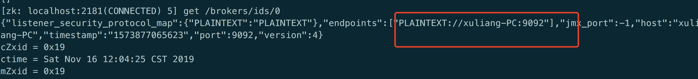
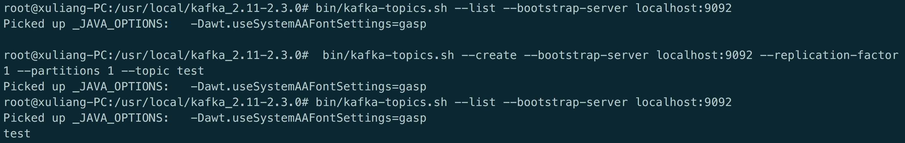
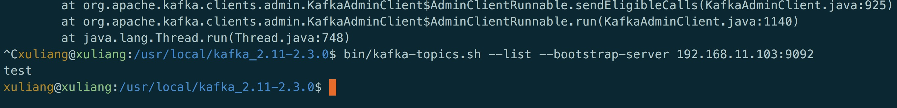
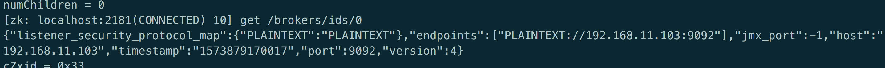
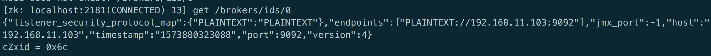

[TOC]

# 一、默认配置
```shell
# The address the socket server listens on. It will get the value returned from
# java.net.InetAddress.getCanonicalHostName() if not configured.
#   FORMAT:
#     listeners = listener_name://host_name:port
#   EXAMPLE:
#     listeners = PLAINTEXT://your.host.name:9092
listeners=PLAINTEXT://:9092

# Hostname and port the broker will advertise to producers and consumers. If not set,
# it uses the value for "listeners" if configured.  Otherwise, it will use the value
# returned from java.net.InetAddress.getCanonicalHostName().
advertised.listeners=PLAINTEXT://your.host.name:9092
```

* listeners就是主要用来定义Kafka Broker的Listener的配置项。9092端口监听的就是这个IP，是kafka真正bind的地址

* advertised.listeners参数的作用就是将Broker的Listener信息发布到Zookeeper中，是暴露给外部的listeners，如果没有设置，会用listeners

所以如果是外网访问的话，就需要将监听地址配置到listeners中。？？？

# 下面演示现象
## 第一种情况：默认都不配置
zookeeper查看kafka地址：



kafka创建topic：




添加主机hosts后访问正常：192.168.11.103 xuliang-PC



## 第二种情况：同配置为本机IP

```shell
listeners=PLAINTEXT://192.168.11.103:9092

advertised.listeners=PLAINTEXT://192.168.11.103:9092
```




此时访问要通过：bin/kafka-topics.sh --list --bootstrap-server 192.168.11.103:9092

## 第三种情况：一般不这么配置

```shell
listeners=PLAINTEXT://192.168.11.103:9092

advertised.listeners=PLAINTEXT://test-kafka:9092
```


## 第四种情况：

```shell
listeners=PLAINTEXT://127.0.0.1:9092

advertised.listeners=PLAINTEXT://192.168.11.103:9092
```



查看监听地址：netstat -tunlp|grep 9092

```shell
Proto Recv-Q Send-Q Local Address           Foreign Address         State      PID/Program name
tcp6       0      0 127.0.0.1:9092          :::*                    LISTEN      6194/java
```

local address是本地就是你本机的地址
foreign address是外部电脑，就是和你电脑有联系的ip地址
`::`表示ipv6形式的全0IP，即不区分ip，`*` 表示不区分端口

这种情况会报错，向Zookeeper中注册的地址是192.168.11.103，kafka绑定的监听地址却是127.0.0.1，会导致无法连接。

所以listeners不配置，这样Local Address 会变为:::9092,表示只有是有外网IP访问9092端口，都由这个对于的应用来处理