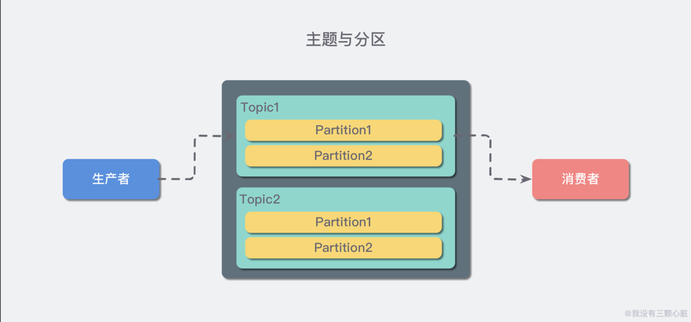
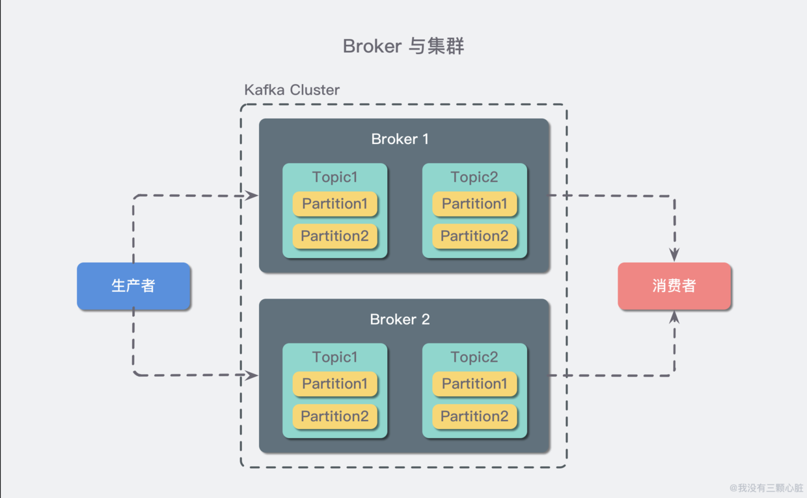

[TOC]
# Kafka 简介

Kafka 是一种分布式的，基于发布 / 订阅的消息系统。主要设计目标如下：

* 以时间复杂度为 O(1) 的方式提供消息持久化能力，即使对 TB 级以上数据也能保证常数时间复杂度的访问性能。

* 高吞吐率。即使在非常廉价的商用机器上也能做到单机支持每秒 100K 条以上消息的传输。

* 支持 Kafka Server 间的消息分区，及分布式消费，同时保证每个 Partition 内的消息顺序传输。

* 同时支持离线数据处理和实时数据处理。

* Scale out：支持在线水平扩展。


# Kafka 基础概念
## 概念一：生产者与消费者


对于 Kafka 来说客户端有两种基本类型：生产者（Producer）和消费者（Consumer）。

* 生产者（也称为发布者）创建消息，
* 消费者（也称为订阅者）负责消费or读取消息。


除此之外，还有用来做数据集成的 Kafka Connect API 和流式处理的 Kafka Streams 等高阶客户端，但这些高阶客户端底层仍然是生产者和消费者API，它们只不过是在上层做了封装。

## 概念二：消费者与消费组
消息模型可以分为两种， 
*  队列的处理方式是 一组消费者从服务器读取消息，一条消息只有其中的一个消费者来处理。

* 发布-订阅模型中，消息被广播给所有的消费者，接收到消息的消费者都可以处理此消息。

Kafka为这两种模型提供了单一的消费者抽象模型： **消费者组** （consumer group）。 消费者用一个消费者组名标记自己。 一个发布在topic的分区中的消息，只能发送给消费者组中的一个消费者

* 假如所有的消费者都在一个组中，那么这就变成了queue（队列）模型。允许同名的消费者组成员瓜分处理

* 假如所有的消费者都在不同的组中，那么就完全变成了发布-订阅模型。允许你广播消息给多个消费者组（不同名）。

更通用的， 我们可以创建一些消费者组作为逻辑上的订阅者。每个组包含数目不等的消费者， 一个组内多个消费者可以用来扩展性能和容错。正如下图所示：

2个kafka集群托管4个分区（P0-P3），2个消费者组，消费组A有2个消费者实例，消费组B有4个。

### 如何保证消息的处理顺序

##### 1. 传统的队列模型

队列模型保持消息，并且保证它们的先后顺序不变。但是， 尽管服务器保证了消息的顺序，消息还是异步的发送给各个消费者，消费者收到消息的先后顺序不能保证了。这也意味着并行消费将不能保证消息的先后顺序。

所以消息系统常常通过仅设1个消费者来解决这个问题，但是这意味着没用到并行处理。

##### 2. Kafka

Kafka采用了一种分而治之的策略：分区。 

因为Topic**分区**中消息只能由消费者组中的**唯一一个**消费者处理，所以消息肯定是按照先后顺序进行处理的。

但是它也仅仅是保证Topic的一个分区顺序处理，不能保证跨分区的消息先后处理顺序。 

所以，如果你想要顺序的处理Topic的所有消息，那就只提供一个分区。

通过并行topic的parition —— kafka提供了顺序保证和负载均衡。**每个partition仅由同一个消费者组中的一个消费者消费到。并确保消费者是该partition的唯一消费者，并按顺序消费数据。** 每个topic有多个分区，则需要对**多个消费者做负载均衡**，但请注意，**相同的消费者组中不能有比分区更多的消费者，否则多出的消费者一直处于空等待，不会收到消息。**

kafka有比传统的消息系统更强的顺序保证。

## 概念二：主题（Topic）与分区（Partition）


在 Kafka 中，消息以主题（Topic）来分类，每一个主题都对应一个「消息队列」。

分区（Partition）的概念，类似“允许多修几条道”的方式对主题实现水平扩展。


上述的 Topic 其实是逻辑上的概念，面向消费者和生产者，物理上存储的其实是 Partition，每一个 Partition 最终对应一个目录，里面存储所有的消息和索引文件。

默认情况下，每一个 Topic 在创建时如果不指定 Partition 数量时只会创建 1 个 Partition。比如，我创建了一个 Topic 名字为 test ，没有指定 Partition 的数量，那么会默认创建一个 test-0 的文件夹，这里的命名规则是：`<topic_name>-<partition_id>`。


任何发布到 Partition 的消息都会被追加到 Partition 数据文件的尾部，这样的顺序写磁盘操作让 Kafka 的效率非常高（经验证，顺序写磁盘效率比随机写内存还要高，这是 Kafka 高吞吐率的一个很重要的保证）。

每一条消息被发送到 Broker 中，会根据 Partition 规则选择被存储到哪一个 Partition。如果 Partition 规则设置的合理，所有消息可以均匀分布到不同的 Partition中。


## 概念三：Broker 和集群（Cluster）


一个 Kafka 服务器也称为 Broker，
* 它接受生产者发送的消息并存入磁盘；

* 同时服务消费者拉取分区消息的请求，返回目前已经提交的消息。


若干个 Broker 组成一个集群（Cluster），其中集群内某个 Broker 会成为集群控制器（Cluster Controller），它负责管理集群，包括分配分区到 Broker、监控 Broker 故障等。

在集群内，一个分区由一个 Broker 负责，这个 Broker 也称为这个分区的 Leader；

当然一个分区可以被复制到多个 Broker 上来实现冗余，这样当存在 Broker 故障时可以将其分区重新分配到其他 Broker 来负责。下图是一个样例：



Kafka 的一个关键性质是日志保留（retention），我们可以配置主题的消息保留策略，譬如只保留一段时间的日志或者只保留特定大小的日志。当超过这些限制时，老的消息会被删除。我们也可以针对某个主题单独设置消息过期策略，这样对于不同应用可以实现个性化。


# Kafka 中的底层存储设计


假设我们现在 Kafka 集群只有一个 Broker，我们创建 2 个 Topic 名称分别为：`「topic1」和「topic2」`，Partition 数量分别为 1、2，那么我们的根目录下就会创建如下三个文件夹：


在 Kafka 的文件存储中，同一个 Topic 下有多个不同的 Partition，每个 Partition 都为一个目录，而每一个目录又被平均分配成多个大小相等的 Segment File 中，Segment File 又由 index file 和 data file 组成，他们总是成对出现，后缀 ".index" 和 ".log" 分表表示 Segment 索引文件和数据文件。

现在假设我们设置每个 Segment 大小为 500 MB，并启动生产者向 topic1 中写入大量数据，topic1-0 文件夹中就会产生类似如下的一些文件：


**Segment 是 Kafka 文件存储的最小单位。** Segment 文件命名规则：Partition 全局的第一个 Segment 从 0 开始，后续每个 Segment 文件名为上一个 Segment 文件最后一条消息的 offset 值。数值最大为 64 位 long 大小，19 位数字字符长度，没有数字用0填充。如 00000000000000368769.index 和 00000000000000368769.log。


以上面的一对 Segment File 为例，说明一下索引文件和数据文件对应关系：


其中以索引文件中元数据 `<3, 497> ` 为例，依次在数据文件中表示第 3 个 message（在全局 Partition 表示第 368769 + 3 = 368772 个 message）以及该消息的物理偏移地址为 497。
**即offset=3，物理偏移地址position=497. 表示该消息从物理偏移位置497开始。**

注意该 index 文件并不是从0开始，也不是每次递增1的，这是因为 Kafka 采取稀疏索引存储的方式，每隔一定字节的数据建立一条索引，它减少了索引文件大小，使得能够把 index 映射到内存，降低了查询时的磁盘 IO 开销，同时也并没有给查询带来太多的时间消耗。

因为其文件名为上一个 Segment 最后一条消息的 offset ，所以当需要查找一个指定 offset 的 message 时，通过在所有 segment 的文件名中进行二分查找就能找到它归属的 segment ，再在其 index 文件中找到其对应到文件上的物理位置，就能拿出该 message 。

由于消息在 Partition 的 Segment 数据文件中是顺序读写的，且消息消费后不会删除（删除策略是针对过期的 Segment 文件），这种顺序磁盘 IO 存储设计师 Kafka 高性能很重要的原因。

>Kafka 是如何准确的知道 message 的偏移的呢？这是因为在 Kafka 定义了标准的数据存储结构，在 Partition 中的每一条 message 都包含了以下三个属性：
>* offset：表示 message 在当前 Partition 中的偏移量，是一个逻辑上的值，唯一确定了 Partition 中的一条 message，可以简单的认为是一个 id；
>* MessageSize：表示 message 内容 data 的大小；
>* data：message 的具体内容

以读取`offset=36776`的消息为例子，需要通过2个步骤查找
1. 第一步查找`segment file`
以上图为例，其中`00000000000000000000.index`表示开始的文件，起始偏移量为0（offset为0），第二个文件`00000000000000368769.index`的消息起始偏移量为`368770（368769+1）`。只要根据offset二分查找文件列表，就可以快速定位到具体文件。当`offset=368776`时定位到`00000000000000368769.index(log)`文件
2. 第二步通过`segment file`查找`message`
算出`368776-368770=6`，取`00000000000000368769.index`文件第三项`（6，1407）`得出从`00000000000000368769.log`文件头偏移`1407`字节读取一条消息即可。

# Kafka单机安装部署
## 1. 下载解压
```shell
# wget http://mirrors.hust.edu.cn/apache/kafka/2.5.0/kafka_2.12-2.5.0.tgz
# tar -C /data/ -xvf kafka_2.11-2.1.0.tgz
# cd /data/kafka_2.11-2.1.0/
```
## 2. 安装zookeeper
## 3. 配置kafka的config/server.properties文件
```shell
# broker的全局唯一编号，不能重复
broker.id=0
listeners=PLAINTEXT://:9092
advertised.listeners=PLAINTEXT://本机IP地址:9092
# 日志目录
log.dirs=/data/kafka/logs
# 配置zookeeper的连接（如果不是本机，需要该为ip或主机名）
zookeeper.connect=172.18.20.14:2181,172.18.11.126:2181
```
* listeners就是主要用来定义Kafka Broker的Listener的配置项。9092端口监听的就是这个IP，是kafka真正bind的地址

* advertised.listeners参数的作用就是将Broker的Listener信息发布到Zookeeper中，是暴露给外部的listeners，如果没有设置，会用listeners

所以如果是外网访问的话，就需要将监听地址配置到listeners中。

## 4. 使用kafka


1. 启动Kafka
```shell
bin/kafka-server-start.sh  -daemon  config/server.properties &
```
2. 创建主题（4个分区，2个副本）--2个副本需要至少2个服务器部署了kafka
```shell
bin/kafka-topics.sh --create --zookeeper localhost:2181 --replication-factor 1 --partitions 4 --topic test
```
3. 查看所有topic
```shell
bin/kafka-topics.sh --zookeeper localhost:2181 --list
```
4. 删除topic
```shell
bin/kafka-topics.sh  --delete --zookeeper 192.168.202.128:2181  --topic test
```
如果kafaka启动时加载的配置文件中server.properties没有配置delete.topic.enable=true，那么此时的删除并不是真正的删除，而是把topic标记为：marked for deletion
另外被标记为marked for deletion的topic你可以在zookeeper客户端中通过命令获得：ls /admin/delete_topics/【topic name】，
如果你删除了此处的topic，那么marked for deletion 标记消失

5. 彻底删除topic: 
    * 登录zookeeper客户端：命令：./bin/zkCli.sh
    * 找到topic所在的目录：ls /brokers/topics
    * 找到要删除的topic，执行命令：rmr /brokers/topics/test 即可，此时topic被彻底删除。

6. 查询集群描述
```shell
bin/kafka-topics.sh --describe --zookeeper localhost:2181
```
7. 生产者（支持0.9版本+）
```shell
bin/kafka-console-producer.sh --broker-list localhost:9092 --topic test
```
**如果在安装kafka的本机创建消费者，需要使用listener中配置的IP，如果在外网，则需要使用advertised_listeners中配置的IP**
8. 消费者（支持0.9版本+）
```shell
bin/kafka-console-consumer.sh --bootstrap-server localhost:9092 --topic test --from-beginning
```
9. 消费者列表查询（支持0.9版本+）
```shell
bin/kafka-consumer-groups.sh  --bootstrap-server localhost:9092 --list
```
## 5 . Java Api Demo
### 引入依赖：
```xml
<dependency>
      <groupId>org.apache.kafka</groupId>
      <artifactId>kafka-clients</artifactId>
      <version>2.4.0</version>
</dependency>
```
### 生产者示例：
```java
public class SimpleProvider {
    public static void main(String[] args) {
        Properties properties = new Properties();
        properties.put("bootstrap.servers", "kafka01:9092,kafka02:9092");
        properties.put("acks", "all");
        properties.put("retries", 0);
        properties.put("batch.size", 16384);
        properties.put("linger.ms", 1);
        properties.put("buffer.memory", 33554432);
        properties.put("key.serializer", "org.apache.kafka.common.serialization.StringSerializer");
        properties.put("value.serializer", "org.apache.kafka.common.serialization.StringSerializer");
        KafkaProducer<String, String> kafkaProducer = new KafkaProducer<String, String>(properties);
        for (int i = 1; i <= 600; i++) {
            kafkaProducer.send(new ProducerRecord<String, String>("topic", "message"+i));
            System.out.println("message"+i);
        }
        kafkaProducer.close();
    }

}
```
### 消费者示例
```java
public class SingleApplication {
    public static void main(String[] args) {
        Properties props = new Properties();
        props.put("bootstrap.servers", "kafka01:9092，kafka02:9092");
        props.put("group.id", "test");
        props.put("enable.auto.commit", "true");
        props.put("auto.commit.interval.ms", "1000");
        props.put("key.deserializer", "org.apache.kafka.common.serialization.StringDeserializer");
        props.put("value.deserializer", "org.apache.kafka.common.serialization.StringDeserializer");

        props.put("auto.offset.reset","earliest");

        KafkaConsumer<String, String> consumer = new KafkaConsumer<>(props);
        consumer.subscribe(Arrays.asList("foo", "bar"));
        try{
            while (true) {
                ConsumerRecords<String, String> records = consumer.poll(1000);
                for (ConsumerRecord<String, String> record : records) {
                    System.out.printf("offset = %d, key = %s, value = %s%n", record.offset(), record.key(), record.value());
                }
            }
        }finally{
            consumer.close();
        }
    }
}
```