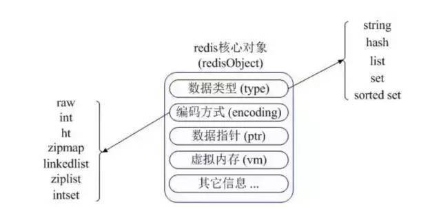
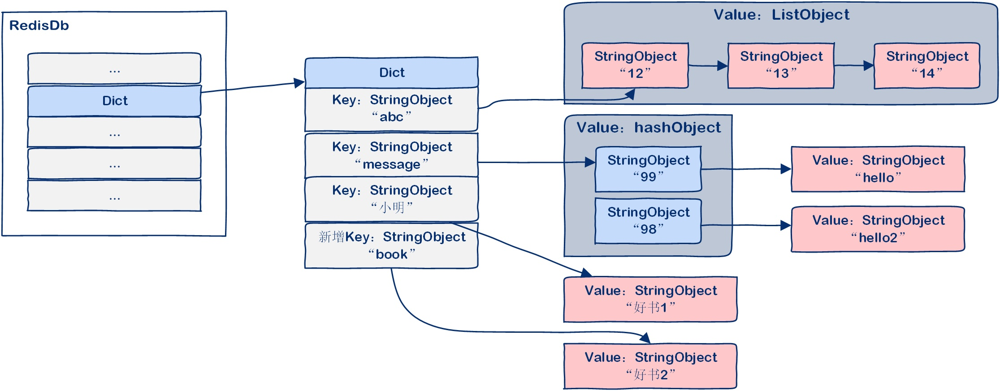
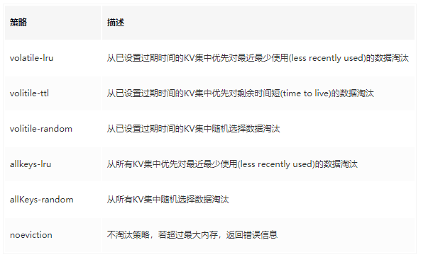
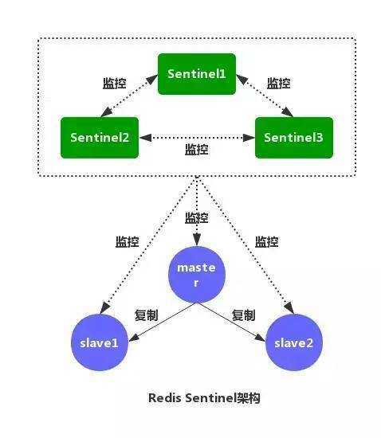

[TOC]
# 一、什么是Redis
Redis 是 C 语言开发的一个开源的（遵从 BSD 协议）高性能键值对（key-value）的内存数据库，可以用作数据库、缓存、消息中间件等。
它是一种 NoSQL（not-only sql，泛指非关系型数据库）的数据库.
作为一个内存数据库：

* 性能优秀，数据在内存中，读写速度非常快，支持并发 10W QPS。

* 单进程单线程，是线程安全的，采用 IO 多路复用机制。

* 丰富的数据类型，支持字符串（strings）、散列（hashes）、列表（lists）、集合（sets）、有序集合（sorted sets）等。

* 支持数据持久化。

* 可以将内存中数据保存在磁盘中，重启时加载。

* 主从复制，哨兵，高可用。

* 可以用作分布式锁。

* 可以作为消息中间件使用，支持发布订阅。

# 二、五种数据类型




Redis 内部使用一个 redisObject 对象来表示所有的 key 和 value。即key 和 value都是redisObject类型

 
* type 表示一个 value 对象具体是何种数据类型

* encoding 是不同数据类型在 Redis 内部的存储方式

比如：type=string 表示 value 存储的是一个普通字符串，那么 encoding 可以是 raw 或者 int。

一对KV，系统至少会创建两个redisObject对象，由redisDb来关联二者。




## 1. String 
String是 Redis 最基本的类型，一个 Key 对应一个 Value。Value 不仅是 String，也可以是数字。
String 类型是二进制安全的，意思是 Redis 的 String 类型可以包含任何数据，比如 jpg 图片或者序列化的对象。String 类型的值最大能存储 512M。

## 2. Hash

Hash是一个键值（key-value）的集合。Redis 的 Hash 是一个 String 的 Key 和 Value 的映射表，Hash 特别适合存储对象。常用命令：hget，hset，hgetall 等。
```java
	@Test
	public void testHash() {
		HashOperations<String, Object, Object> hash = redisTemplate.opsForHash(); hash.put("hash","you","you");
		String value=(String) hash.get("hash","you");
		System.out.println("hash value :"+value);
	}

```

## 3. List
List 列表是简单的字符串列表，按照插入顺序排序。可以添加一个元素到列表的头部（左边）或者尾部（右边） 常用命令：lpush、rpush、lpop、rpop、lrange（获取列表片段）等。
Redis List 的是实现是一个双向链表，既可以支持反向查找和遍历，更方便操作，不过带来了额外的内存开销。
List 就是链表，可以用来当消息队列用。Redis 提供了 List 的 Push 和 Pop 操作，还提供了操作某一段的 API，可以直接查询或者删除某一段的元素。
```java
@Test
public void testList() {
    ListOperations<String, String> list = redisTemplate.opsForList(); list.leftPush("list","it");
    list.leftPush("list","you");
    list.leftPush("list","know");
    String value=(String)list.leftPop("list");
    System.out.println("list value :"+value.toString()); 
}
```
## 4.Set 
Set是 String 类型的无序集合。集合是通过 hashtable 实现的。Set 中的元素是没有顺序的，而且是没有重复的。常用命令：sdd、spop、smembers、sunion 等。
```java
public void testSet() {
    String key="set";
    SetOperations<String, String> set = redisTemplate.opsForSet(); set.add(key,"it");
    set.add(key,"you");
    set.add(key,"you");
    set.add(key,"know");
    Set<String> values=set.members(key);
    for (String v:values){
        System.out.println("set value :"+v); }
}
```
## 5. Zset 
Redis Sorted Set 的使⽤场景与 Set 类似，区别是 Set 不是自动有序的，而 Sorted Set 可以通过用户额外提供一个优先级(Score)的参数来为成员排序，并且是插入有序，即自动排序。

在使⽤用 Zset 的时候需要额外的输⼊一个参数 Score，Zset 会⾃动根据 Score 的值对集合进⾏排序，我们可以利⽤用这个特性来做具有权重的队列，⽐比如普通消息的 Score 为1，重要消息的 Score 为 2，然后工作线程可以选择按 Score 的倒序来获取工作任务。

```java
public void testZset(){
    String key="zset";
    redisTemplate.delete(key);
    ZSetOperations<String, String> zset = redisTemplate.opsForZSet(); zset.add(key,"it",1);
    zset.add(key,"you",6);
    zset.add(key,"know",4);
    zset.add(key,"neo",3);
    Set<String> zsets=zset.range(key,0,3); for (String v:zsets){
        System.out.println("zset value :"+v); }
    Set<String> zsetB=zset.rangeByScore(key,0,3); for (String v:zsetB){
        System.out.println("zsetB value :"+v); }
}
```

## 6. 实体
 Redis 对 Pojo 的支持，新建一个 User 对象，放到缓存中，再取出来。
```java
@Test
public void testObj() {
    User user = new User("ityouknow@126.com", "smile", "youknow", "know", "2020");
    ValueOperations<String, User> operations = redisTemplate.opsForValue();
    operations.set("com.neo", user);
    User u = operations.get("com.neo");
    System.out.println("user: " + u.toString());
}
```

## 代码中结合SpringBoot，通过RedisTemplate 来使用。
添加配置类 RedisCacheConfig.java：
```java
@Configuration
public class RedisConfig {
	@Bean
	@SuppressWarnings("all")
	public RedisTemplate<String, Object> redisTemplate(RedisConnectionFactory factory) {
		RedisTemplate<String, Object> template = new RedisTemplate<String, Object>();
		template.setConnectionFactory(factory);
		Jackson2JsonRedisSerializer jackson2JsonRedisSerializer = new Jackson2JsonRedisSerializer(Object.class);
		ObjectMapper om = new ObjectMapper();
		om.setVisibility(PropertyAccessor.ALL, JsonAutoDetect.Visibility.ANY);
		om.enableDefaultTyping(ObjectMapper.DefaultTyping.NON_FINAL);
		jackson2JsonRedisSerializer.setObjectMapper(om);
		StringRedisSerializer stringRedisSerializer = new StringRedisSerializer();
		// key采用String的序列化方式
		template.setKeySerializer(stringRedisSerializer);
		// hash的key也采用String的序列化方式
		template.setHashKeySerializer(stringRedisSerializer);
		// value序列化方式采用jackson
		template.setValueSerializer(jackson2JsonRedisSerializer);
		// hash的value序列化方式采用jackson
		template.setHashValueSerializer(jackson2JsonRedisSerializer);
		template.afterPropertiesSet();
		return template;
	}
}

```

使用时：
```java
@Component
public final class RedisUtil {
	@Autowired
	private RedisTemplate<String, Object> redisTemplate;
	public Object get(String key) {
		return key == null ? null : redisTemplate.opsForValue().get(key);
	}
}
```

# 三、Redis 雪崩与缓存穿透和击穿

## Redis雪崩
电商首页以及热点数据都会去做缓存。

数据未加载到缓存中，或者缓存同一时间大面积的失效，从而导致所有请求都去查数据库，导致数据库CPU和内存负载过高，甚至宕机。
### 如何解决
在批量往 Redis 存数据的时候，把每个 Key 的失效时间都加个随机值就好了，这样可以保证数据不会再同一时间大面积失效。
```java
setRedis（key, value, time+Math.random()*10000）;
```
如果 Redis 是集群部署，将热点数据均匀分布在不同的 Redis 库中也能避免全部失效。

或者设置热点数据永不过期，有更新操作就更新缓存就好了（比如运维更新了首页商品，那你刷下缓存就好了，不要设置过期时间），电商首页的数据也可以用这个操作，保险。

## 缓存穿透
缓存穿透是指缓存和数据库中都没有的数据，而用户（黑客）不断发起请求。

举个栗子：我们数据库的 id 都是从 1 自增的，如果发起 id=-1 的数据或者 id 特别大不存在的数据，这样的不断攻击导致数据库压力很大，严重会击垮数据库。


缓存穿透我会在接口层增加校验，比如用户鉴权，参数做校验，不合法的校验直接 return，比如 id 做基础校验，id<=0 直接拦截。

## 缓存击穿
缓存击穿是指一个非常热点的Key ，在不停地扛着大量的请求，大并发集中对这一个点进行访问，

当这个 Key 在失效的瞬间，持续的大并发直接落到了数据库上，就在这个 Key 的点上击穿了缓存。
### 如何解决
设置热点数据永不过期，或者加上互斥锁就搞定了,即如果数据在redis中没有，则加锁去数据库中拿，拿到后先放入redis再返回。

```java
public static String getData(String key) throws InterruptedException {
        //从Redis查询数据
        String result = getDataByKV(key);
        //参数校验
        if (StringUtils.isBlank(result)) {
            try {
                //获得锁
                if (reenLock.tryLock()) {
                    //去数据库查询
                    result = getDataByDB(key);
                    //校验
                    if (StringUtils.isNotBlank(result)) {
                        //插进缓存
                        setDataToKV(key, result);
                    }
                } else {
                    //睡一会再拿
                    Thread.sleep(100L);
                    result = getData(key);
                }
            } finally {
                //释放锁
                reenLock.unlock();
            }
        }
        return result;
    }

```
# 四、Redis 为何这么快
据官方数据表示Redis读的速度是110000次/s,写的速度是81000次/s 

您是想问 Redis 这么快，为什么还是单线程的吧。Redis 确实是单进程单线程的模型，因为 Redis 完全是基于内存的操作，CPU 不是 Redis 的瓶颈，Redis 的瓶颈最有可能是机器内存的大小或者网络带宽。

既然单线程容易实现，而且 CPU 不会成为瓶颈，那就顺理成章的采用单线程的方案了（毕竟采用多线程会有很多麻烦）。

>Redis 是单线程的，为什么还能这么快？

* Redis 完全基于内存，绝大部分请求是纯粹的内存操作，非常迅速，数据存在内存中，类似于 HashMap，HashMap 的优势就是查找和操作的时间复杂度是 O(1)。

* 数据结构简单，对数据操作也简单。

* 采用单线程，避免了不必要的上下文切换和竞争条件，不存在多线程导致的 CPU 切换，不用去考虑各种锁的问题，不存在加锁释放锁操作，没有死锁问题导致的性能消耗。

* 使用多路复用 IO 模型，非阻塞 IO。

# 五、淘汰策略

> 内存淘汰策略如何工作？

* 首先，客户端会发起需要更多内存的申请；

* 其次，Redis检查内存使用情况，如果实际使用内存已经超出maxmemory，Redis就会根据用户配置的淘汰策略选出无用的key；

* 最后，确认选中数据没有问题，成功执行淘汰任务

Redis 有六种淘汰策略：



Redis 4.0 加入了 LFU（least frequency use）淘汰策略，包括 volatile-lfu 和 allkeys-lfu，通过统计访问频率，将访问频率最少，即最不经常使用的 KV 淘汰。

## LRU淘汰

在Redis中，LRU算法是一个近似算法，默认情况下，Redis会随机挑选5个键，并从中选择一个最久未使用的key进行淘汰。

## TTL淘汰
TTL 数据淘汰机制中会先从过期时间的表中**随机挑选几个键值对，取出其中 ttl 最大的键值对淘汰**。同样，TTL淘汰策略并不是面向所有过期时间的表中最快过期的键值对，而只是随机挑选的几个键值对。

# 六、持久化
Redis 为了保证效率，数据缓存在了内存中，但是会周期性的把更新的数据写入磁盘或者把修改操作写入追加的记录文件中，以保证数据的持久化。
Redis 的持久化策略有两种：

* RDB：快照形式是直接把内存中的数据保存到一个 dump 的文件中，定时保存。

* AOF：把所有的对 Redis 的服务器进行修改的命令都存到一个文件里。

Redis 默认是快照 RDB 的持久化方式。

但当 Redis 重启的时候，它会优先使用 AOF 文件来还原数据集，因为 AOF 文件保存的数据集通常比 RDB 文件所保存的数据集更完整。

## RDB快照工作方式
当 Redis 需要做持久化时，Redis 会 fork 一个子进程，子进程将数据写到磁盘上一个临时 RDB 文件中。

当子进程完成写临时文件后，将原来的 RDB 替换掉，这样的好处是可以 copy-on-write。

* RDB 的优点是：这种文件非常适合用于备份：比如，你可以在最近的 24 小时内，每小时备份一次，并且在每个月的每一天也备份一个 RDB 文件。这样的话，即使遇上问题，也可以随时将数据集还原到不同的版本。RDB 非常适合灾难恢复。

* RDB 的缺点是：如果你需要尽量避免在服务器故障时丢失数据，那么RDB不合适你。

## AOF命令工作方式

使用 AOF 做持久化，每一个写命令都通过 write 函数追加到 appendonly.aof 中，配置方式如下：

```shell
appendfsync yes   
appendfsync always     #每次有数据修改发生时都会写入AOF文件。
appendfsync everysec   #每秒钟同步一次，该策略为AOF的缺省策略。
```
AOF 可以做到全程持久化，只需要在配置中开启 appendonly yes。这样 Redis 每执行一个修改数据的命令，都会把它添加到 AOF 文件中，当 Redis 重启时，将会读取 AOF 文件进行重放，恢复到 Redis 关闭前的最后时刻。

每条命令都写入文件，会导致redis性能降低。

定时生成 RDB 快照非常便于进行数据库备份，并且 RDB 恢复数据集的速度也要比 AOF 恢复的速度快。
当然了，Redis 支持同时开启 RDB 和 AOF，系统重启后，Redis 会优先使用 AOF 来恢复数据，这样丢失的数据会最少。

# 七、主从复制

主从复制需要分为两个角色：master(主) 和 slave(从) ，注意：redis里面只支持一个主，不像Mysql、Nginx主从复制可以多主多从。

1. redis的复制功能是支持多个数据库之间的数据同步。一类是主数据库（master）一类是从数据库（slave），

主数据库可以进行读写操作，当发生写操作的时候自动将数据同步到从数据库，而从数据库一般是只读的，并接收主数据库同步过来的数据，

一个主数据库可以有多个从数据库，而一个从数据库只能有一个主数据库。

2. 通过redis的复制功能可以很好的实现数据库的读写分离，提高服务器的负载能力。主数据库主要进行写操作，而从数据库负责读操作。

> Redis主从复制可以根据是否是全量分为全量同步和增量同步

## 全量复制
Redis全量复制一般发生在Slave初始化阶段，这时Slave需要将Master上的所有数据都复制一份。

**全量同步过程：**

1. 当一个从数据库启动时，会向主数据库发送sync命令，

2. 主数据库接收到sync命令后会开始在后台保存快照（执行rdb操作），并用**缓存区**记录后续的所有写操作

3. 当主服务器快照保存完成后，redis会将快照文件发送给从数据库。

4. 从数据库收到快照文件后，会丢弃所有旧数据，载入收到的快照。

5. 主服务器快照发送完毕后开始向从服务器发送缓冲区中的写命令。

6. 从服务器完成对快照的载入，开始接收命令请求，并执行来自主服务器缓冲区的写命令。


## 增量同步
Redis增量复制是指slave初始化后**开始正常工作时主服务器发生的写操作同步到从服务器的过程**。

增量复制的过程主要是主服务器每执行一个写命令就会向从服务器发送相同的写命令，从服务器接收并执行收到的写命令。使用 psync命令实现。

> redis 策略是，无论如何，首先会尝试进行增量同步，如不成功，要求从机进行全量同步。
 
**主从复制会存在以下问题:**

1. 一旦主节点宕机，从节点晋升为主节点，同时需要修改应用方的主节点地址，还需要命令所有从节点去复制新的主节点，整个过程需要人工干预。

2. 主节点的写能力受到单机的限制。

3. 主节点的存储能力受到单机的限制。

4. 原生复制的弊端在早期的版本中也会比较突出，比如：Redis 复制中断后，从节点会发起 psync。此时如果同步不成功，则会进行全量同步，主库执行全量备份的同时，可能会造成毫秒或秒级的卡顿。

解决这些问题的方案是使用哨兵机制。

# 八、Redis哨兵机制

哨兵机制需要主从复制的支持。




Redis的哨兵(sentinel) 系统用于管理多个 Redis 服务器,该系统执行以下三个任务:

* 监控(Monitoring): 哨兵(sentinel) 会不断地检查你的Master和Slave是否运作正常。

* 提醒(Notification):当被监控的某个Redis出现问题时, 哨兵(sentinel) 可以通过 API 向管理员或者其他应用程序发送通知。

* 自动故障迁移(Automatic failover):当一个Master不能正常工作时，哨兵(sentinel) 会开始一次自动故障迁移操作,它会将失效Master的其中一个Slave升级为新的Master, 并让失效Master的其他Slave改为复制新的Master; 当客户端试图连接失效的Master时,集群也会向客户端返回新Master的地址,使得集群可以使用Master代替失效Master。


哨兵(sentinel) 是一个分布式系统,你可以在一个架构中运行多个哨兵(sentinel) 进程,这些进程使用流言协议(gossipprotocols)来接收关于Master是否下线的信息,并使用投票协议(agreement protocols)来决定是否执行自动故障迁移,以及选择哪个Slave作为新的Master.

## 执行流程

1. 每个哨兵(sentinel) 会向其它哨兵(sentinel)、master、slave定时发送消息,以确认对方是否”活”着,如果发现对方在指定时间(可配置)内未回应,则暂时认为对方已挂(所谓的”主观认为宕机” Subjective Down,简称sdown).

2. 若“哨兵群”中的多数sentinel,都报告某一master没响应,系统才认为该master"彻底死亡"(即:客观上的真正down机,Objective Down,简称odown),通过一定的vote算法,从剩下的slave节点中,选一台提升为master,然后自动修改相关配置.


虽然哨兵(sentinel) 释出为一个单独的可执行文件 redis-sentinel ,但实际上它只是一个运行在特殊模式下的 Redis 服务器，你可以在启动一个普通 Redis 服务器时通过给定 --sentinel 选项来启动哨兵(sentinel).

>光靠redis主从复制和哨兵机制不足以实现redis高可用。为什么呢？

因为若某一节点宕机后，**不会实现自动重启**。最稳健实现高可用的做法 :

redis主从复制+哨兵机制(监控、提醒、自动故障迁移)+keepalived(自动重启)，若重启多次仍不成功，可以通过邮件短信等方式通知。

# 假如Redis里面有1亿个key，其中有10w个key是以某个固定的已知的前缀开头的，如果将它们全部找出来？
使用keys指令可以扫出指定模式的key列表。

redis的单线程的。keys指令会导致线程阻塞一段时间，线上服务会停顿，直到指令执行完毕，服务才能恢复。这个时候可以使用scan指令，scan指令可以无阻塞的提取出指定模式的key列表，但是会有一定的重复概率，在客户端做一次去重就可以了，但是整体所花费的时间会比直接用keys指令长。