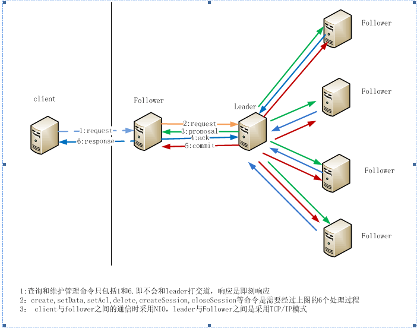
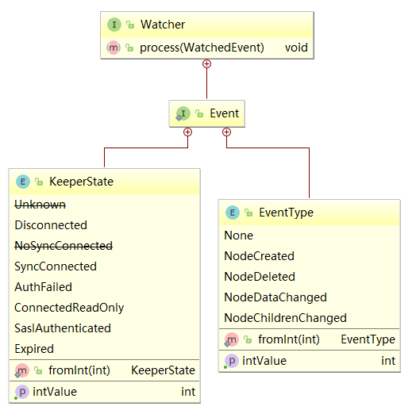
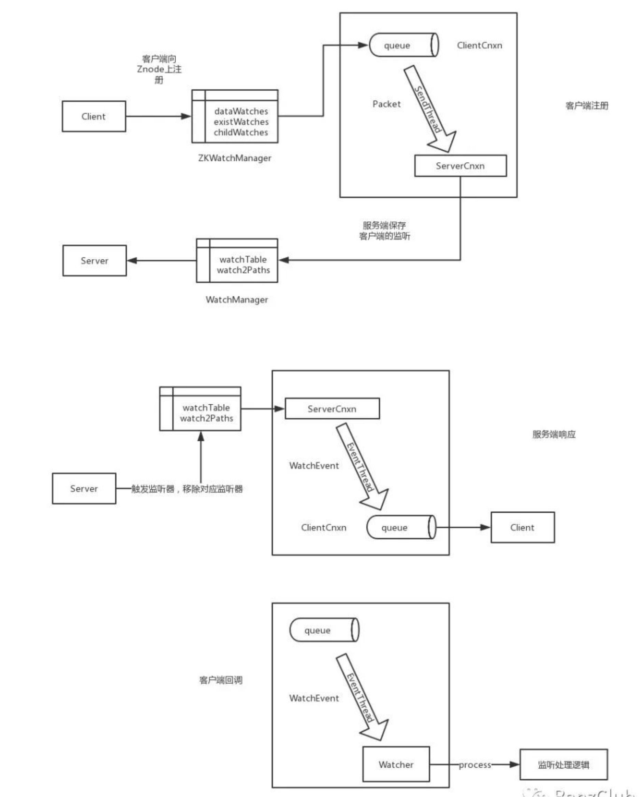
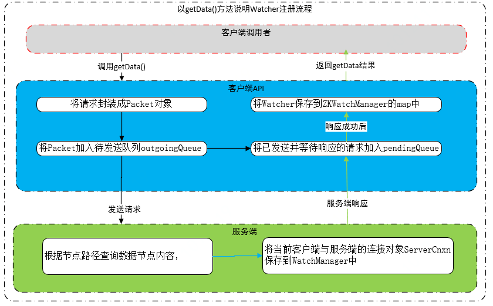
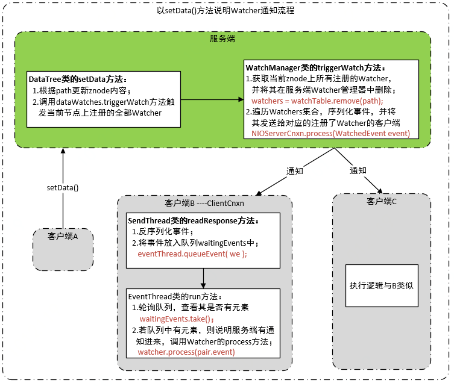

[TOC]
# 一、Zookeeper是什么
官方文档上这么解释zookeeper，它是一个分布式服务框架，是Apache Hadoop 的一个子项目，

ZooKeeper是一个典型的**分布式数据一致性**的解决方案。分布式应用程序可以基于它实现诸如
* 数据发布/订阅

* 负载均衡

* 命名服务

* 分布式协调/通知

* 集群管理

* Master选举

* 分布式锁和分布式队列等功能。

以分布式应用配置管理为例来说明：

假设我们的程序是分布式部署在多台机器上，如果我们要改变程序的配置文件，需要逐台机器去修改，非常麻烦，现在把这些配置全部放到zookeeper上去，保存在 zookeeper 的某个目录节点中，然后所有相关应用程序对这个目录节点进行监听，一旦配置信息发生变化，每个应用程序就会收到 zookeeper 的通知，然后从 zookeeper 获取新的配置信息应用到系统中。


ZooKeeper可以保证如下分布式一致性特性：

* 顺序一致性
从同一个客户端发起的事务请求，最终将会严格按照其发起顺序被应用到ZooKeeper中。

* 原子性
所有事务请求的结果在集群中所有机器上的应用情况是一致的，也就是说要么整个集群所有集群都成功应用了某一个事务，要么都没有应用，一定不会出现集群中部分机器应用了该事务，而另外一部分没有应用的情况。

* 单一视图
无论客户端连接的是哪个ZooKeeper服务器，其看到的服务端数据模型都是一致的。

* 可靠性
一旦服务端成功地应用了一个事务，并完成对客户端的响应，那么该事务所引起的服务端状态变更将会被一直保留下来，除非有另一个事务又对其进行了变更。

* 实时性
通常人们看到实时性的第一反应是，一旦一个事务被成功应用，那么客户端能够立即从服务端上读取到这个事务变更后的最新数据状态。这里需要注意的是，ZooKeeper仅仅保证在一定的时间段内，客户端最终一定能够从服务端上读取到最新的数据状态。

简单来说zookeeper=文件系统+监听通知机制。

## 1. 基本概念
### 集群角色
在ZooKeeper中，有三种角色：
* Leader

* Follower

* Observer

一个ZooKeeper集群同一时刻只会有一个Leader，其他都是Follower或Observer。

ZooKeeper配置很简单，每个节点的配置文件(zoo.cfg)都是一样的，只有myid文件不一样。myid的值必须是zoo.cfg中server.{数值}的{数值}部分。

ZooKeeper默认只有Leader和Follower两种角色，没有Observer角色。

为了使用Observer模式，在任何想变成Observer的节点的配置文件中加入：`peerType=observer`
并在所有server的配置文件中，配置成observer模式的server的那行配置追加:observer，例如：
`server.1:localhost:2888:3888:observer`

ZooKeeper集群的所有机器通过一个Leader选举过程来选定一台被称为『Leader』的机器，Leader服务器为客户端提供**读和写**服务。

**Follower和Observer都能提供读服务**，不能提供写服务。两者唯一的区别在于，Observer机器不参与Leader选举过程，也不参与写操作的『过半写成功』策略，因此Observer可以在不影响写性能的情况下提升集群的读性能。

### 会话（Session）

1. 客户端连接：指客户端和ZooKeeper服务器之间的TCP长连接。

2. Session是指客户端会话，ZooKeeper对外的服务端口默认是2181，客户端启动时，首先会与服务器建立一个TCP连接，从第一次连接建立开始，客户端会话的生命周期也开始了，

3. 通过这个连接，客户端能够通过心跳检测和服务器保持有效的会话，也能够向ZooKeeper服务器发送请求并接受响应，同时还能通过该连接接收来自服务器的Watch事件通知。

4. Session的SessionTimeout值用来设置一个客户端会话的超时时间。当由于服务器压力太大、网络故障或是客户端主动断开连接等各种原因导致客户端连接断开时，只要在SessionTimeout规定的时间内能够重新连接上集群中任意一台服务器，那么之前创建的会话仍然有效。

**Session创建**
当启动一个Zookeeper client的时候
1. 首先按照一定的算法查找出follower, 然后与Follower建立起NIO连接。

2. 当连接建立好后，发送create session的命令。

3. 当server收到create session命令，先从本地的session列表中查找看是否已经存在有相同sessionId，如果有则关闭原session重新创建新的session。

4. 创建session的过程将需求发送到Leader，再由leader通知其他follower。

5. 大部分Follower都将此操作记录到本地日志再通知leader后，leader发送commit命令给所有Follower，连接客户端的Follower返回创建成功的session响应。


### 数据节点（ZNode）
Zookeeper维护一个类似文件系统的数据结构：


每个子目录项如 NameService 都被称作为 znode(目录节点)，和文件系统一样，我们能够自由的增加、删除znode，在一个znode下增加、删除子znode，唯一的不同在于znode是可以存储数据的。


有四种类型的znode：
* **PERSISTENT-持久化目录节点**，客户端与zookeeper断开连接后，该节点依旧存在

* **PERSISTENT_SEQUENTIAL-持久化顺序编号目**录, 节点客户端与zookeeper断开连接后，该节点依旧存在，只是Zookeeper给该节点名称进行顺序编号

* **EPHEMERAL-临时目录节点**，客户端与zookeeper断开连接后，该节点被删除

* **EPHEMERAL_SEQUENTIAL-临时顺序编号目录节点**，客户端与zookeeper断开连接后，该节点被删除，只是Zookeeper给该节点名称进行顺序编号

### 版本
ZooKeeper的每个ZNode上都会存储数据，对应于每个ZNode，ZooKeeper都会为其维护一个叫作Stat的数据结构，Stat中记录了这个ZNode的三个数据版本，分别是version（当前ZNode的版本）、cversion（当前ZNode子节点的版本）和aversion（当前ZNode的ACL版本）。

### 状态信息
每个ZNode除了存储数据内容之外，还存储了ZNode本身的一些状态信息。用 get 命令可以同时获得某个ZNode的内容和状态信息。如下：
```shell
[zk: localhost:2181(CONNECTED) 23] get /yarn-leader-election/appcluster-yarn/ActiveBreadCrumb

appcluster-yarnrm1
cZxid = 0x1b00133dc0    //Created ZXID,表示该ZNode被创建时的事务ID
ctime = Tue Jan 03 15:44:42 CST 2017    //Created Time,表示该ZNode被创建的时间
mZxid = 0x1d00000063    //Modified ZXID，表示该ZNode最后一次被更新时的事务ID
mtime = Fri Jan 06 08:44:25 CST 2017    //Modified Time，表示该节点最后一次被更新的时间
pZxid = 0x1b00133dc0    //表示该节点的子节点列表最后一次被修改时的事务ID。注意，只有子节点列表变更了才会变更pZxid，子节点内容变更不会影响pZxid。
cversion = 0    //子节点的版本号
dataVersion = 11    //数据节点的版本号
aclVersion = 0    //ACL版本号
ephemeralOwner = 0x0    //创建该节点的会话的seddionID。如果该节点是持久节点，那么这个属性值为0。
dataLength = 22    //数据内容的长度
numChildren = 0    //子节点的个数
```
在ZooKeeper中，version属性是用来实现乐观锁机制中的『写入校验』的（保证分布式数据原子性操作）。

### 事务操作--即为写操作
在ZooKeeper中，**能改变ZooKeeper服务器状态的操作称为事务操作**。**一般包括数据节点创建与删除、数据内容更新和客户端会话创建与失效等操作**。对应每一个事务请求，ZooKeeper都会为其分配一个全局唯一的事务ID，用ZXID表示，通常是一个64位的数字。每一个ZXID对应一次更新操作，从这些ZXID中可以间接地识别出ZooKeeper处理这些事务操作请求的全局顺序。

#### Watcher
Watcher（事件监听器），是ZooKeeper中一个很重要的特性。ZooKeeper允许用户在指定节点上注册一些Watcher，并且在一些特定事件触发的时候，ZooKeeper服务端会将事件通知到感兴趣的客户端上去。该机制是ZooKeeper实现分布式协调服务的重要特性。

#### ACL
ZooKeeper采用ACL（Access Control Lists）策略来进行权限控制。ZooKeeper定义了如下5种权限。

* CREATE: 创建子节点的权限。

* READ: 获取节点数据和子节点列表的权限。

* WRITE：更新节点数据的权限。

* DELETE: 删除子节点的权限。

* ADMIN: 设置节点ACL的权限。

注意：CREATE 和 DELETE 都是针对子节点的权限控制。

### ZAB协议

ZAB协议是通用的分布式一致性算法，它是一种特别为ZooKeeper设计的崩溃可恢复的原子广播算法。

基于ZAB协议，ZooKeeper实现了一种主备模式（Leader、Follower）的系统架构来保持集群中各副本之间数据的一致性。

ZAB协议的核心是定义了对应那些会改变ZooKeeper服务器数据状态的事务请求的处理方式，即

>所有事务请求必须由一个**全局唯一**的服务器来协调处理，这样的服务器被称为**Leader服务器**，而剩下的其他服务器则成为**Follower服务器**。Leader服务器负责将一个客户端事务请求转换成一个**事务Proposal（提案）**并将该Proposal分发给集群中所有的Follower服务器。之后Leader服务器需要等待所有Follower服务器的反馈，一旦**超过半数的Follower服务器进行了正确的反馈**后，Leader就会**再次向所有的Follower服务器分发Commit消息**，要求对刚才的Proposal进行提交。

ZAB协议包括两种基本的模式，

* 崩溃恢复
在整个ZooKeeper集群启动过程中，或是当Leader服务器出现网络中断、崩溃退出与重启等异常情况时，ZAB协议就会进入恢复模式并选举产生新的Leader服务器。当选举产生了新的Leader服务器，同时集群中有过半的机器与该Leader服务器完成了状态同步之后，ZAB协议就会退出恢复模式。其中，状态同步是指数据同步，用来保证集群中存在过半的机器能够和Leader服务器的数据状态保持一致。
崩溃恢复模式包括两个阶段：Leader选举和数据同步。

* 消息广播。
当集群中有过半的Follower服务器完成了和Leader服务器的状态同步，那么整个集群就可以进入消息广播模式了。

## 2.主从服务器如何通信
在 Zookeeper 整个系统中，有 3 种角色的服务，client、Follower、leader。

* client 负责发起应用的请求

* Follower 接受 client 发起的请求，参与事务的确认过程,在 leader crash 后的 leader选择

* leader 主要承担事务的协调,也可以承担接收客户请求的功能.

如果 Zookeeper 的配置支持 leader 接收 client 的请求，client 与 leader 的通信跟 client 与 Follower 的通信模式完全一样。Follower 与 leader 之间的角色可能在某一时刻进行转换。

Client、Follower 和 leader 之间的通信架构如下：



### Client 与 Follower(或Leader) 之间
Client与Follower之间采用NIO的通信方式。当client需要与Zookeeper service打交道时：
* 首先读取配置文件确定集群内的所有server列表，

* 然后按照一定的load balance算法选取一个Follower作为一个通信目标

这样client和Follower之间就有了一条由NIO模式构成的通信通道。这条通道会一直保持到client关闭session或者因为client或Follower任一方因某种原因异常中断通信连接。正常情况下, client与Follower在没有请求发起的时候都有心跳检测。

###  Follower与leader之间
Follower与leader之间的通信主要是因为Follower接收到像（create, delete, setData, setACL, createSession, closeSession, sync）这样一些需要让leader来协调最终结果的命令，将会导致Follower与leader之间产生通信。

由于leader与Follower之间的关系式一对多的关系，非常适合client/server模式，因此他们之间是采用c/s模式，由leader创建一个socket server，监听各Follower的协调请求。


## 3. 监听通知机制

Zookeeper提供了分布式数据的发布/订阅功能，可以让客户端订阅某个Znode，当Znode发生变化时，可以通知所有的订阅者。这个实现机制在Zookeeper里面就是Watcher机制。

**Watcher机制本质就是客户端在服务端注册事件监听器，当服务端变化时，通知客户端。**

**Watcher机制实际上与观察者模式类似，也可看作是一种观察者模式在分布式场景下的实现方式。**

通常Zookeeper客户端向服务端注册的监听器分为两种：

1. 监听节点数据的变化；

2. 监听子节点数量的变化；

对于监听器的实现来说，Zookeeper使用监听器事件来对应不同的监听器处理，EventType是数据节点(znode)发生变化时对应的通知类型。EventType变化时KeeperState永远处于SyncConnected通知状态下；当KeeperState发生变化时，EventType永远为None。其路径为org.apache.zookeeper.Watcher.Event.EventType，是一个枚举类，枚举属性如下；

* EventType.None (-1)

* EventType.NodeCreated（1）（节点创建）

* EventType.NodeDeleted（2）（节点删除）

* EventType.NodeDataChanged（3）（节点数据修改）

* EventType.NodeChildrenChanged（4）（子节点修改）

注：客户端接收到的相关事件通知中只包含状态及类型等信息，不包括节点变化前后的具体内容，变化前的数据需业务自身存储，变化后的数据需调用get等方法重新获取；

除了事件状态，还包括对应的客户端连接的状态， KeeperState是客户端与服务端连接状态发生变化时对应的通知类型。路径为org.apache.zookeeper.Watcher.Event.KeeperState，是一个枚举类，其枚举属性如下；

* KeeperState.Disconneced（连接失败）

* KeeperState:SyncConnected（连接成功）

* KeeperState:AuthFailed（认证失败）

* KeeperState:Expired（会话过期）

### Watcher接口设计
Watcher是一个接口，任何实现了Watcher接口的类就是一个新的Watcher。Watcher内部包含了两个枚举类：KeeperState、EventType。



**客户端Watcher管理器：ZKWatchManager数据结构**
```java
//ZKWatchManager维护了三个map，key代表数据节点的绝对路径，value代表注册在当前节点上的watcher集合

//代表节点上内容数据、状态信息变更相关监听
private final Map<String, Set<Watcher>> dataWatches =
    new HashMap<String, Set<Watcher>>();

//代表节点变更相关监听
private final Map<String, Set<Watcher>> existWatches =
    new HashMap<String, Set<Watcher>>();

//代表节点子列表变更相关监听
private final Map<String, Set<Watcher>> childWatches =
    new HashMap<String, Set<Watcher>>();
```

**服务端Watcher管理器：WatchManager数据结构**
```java
//WatchManager维护了两个map
//说明：WatchManager中的Watcher对象不是客户端用户定义的Watcher，
//     而是服务端中实现了Watcher接口的ServerCnxn抽象类，
//     该抽象类代表了一个客户端与服务端的连接

//key代表数据节点路径，value代表客户端连接的集合，该map作用为：
//通过一个指定znode路径可找到其映射的所有客户端，当znode发生变更时
//可快速通知所有注册了当前Watcher的客户端
private final HashMap<String, HashSet<Watcher>> watchTable =
    new HashMap<String, HashSet<Watcher>>();

//key代表一个客户端与服务端的连接，value代表当前客户端监听的所有数据节点路径
//该map作用为：当一个连接彻底断开时，可快速找到当前连接对应的所有
//注册了监听的节点，以便移除当前客户端对节点的Watcher
private final HashMap<Watcher, HashSet<String>> watch2Paths =
    new HashMap<Watcher, HashSet<String>>();
```
### Watcher工作流程



#### 1. 客户端注册

客户端通过getData、getChild、exist方法，向Zookeeper注册，然后将注册信息，保存到客户端的ZKWatchManager中。然后，将数据封装成Packet，通过ClientCnxn的SendThread将数据发送到服务端；

服务端会将注册信息存储在WatchManager中。

1. 客户端发送的请求中只包含是否需要注册Watcher，不会将Watcher实体发送；

2. Packet构造函数中的参数WatchRegistration是Watcher的封装体，用于服务响应成功后将Watcher保存到ZKWatchManager中；

```java
//Packet对象构造函数
//参数含义：请求头、响应头、请求体、响应体、Watcher封装的注册体、是否允许只读
Packet(RequestHeader requestHeader, ReplyHeader replyHeader,
               Record request, Record response,
               WatchRegistration watchRegistration, boolean readOnly) {

            this.requestHeader = requestHeader;
            this.replyHeader = replyHeader;
            this.request = request;
            this.response = response;
            this.readOnly = readOnly;
            this.watchRegistration = watchRegistration;
        }
```





#### 2. 服务端通知

当服务端发生变化时，会封装一个WatchEvent包括：通知状态、事件类型（也就是客户端连接状态）、节点路径，通过ServerCnxn发送给客户端，客户端ClientCnxn的EventThread会将通知存储到阻塞队列中，并移除客户端的存储，也就是ZKWatchManager中的数据。




#### 3. 客户端回调

客户端ClientCnxn的EventThread会从阻塞队列中取出监听通知事件，调用客户端本地对应的Watcher的process方法，完成客户端回调处理逻辑。


### Watcher特点

#### 一次性注册
也就是一旦一个Watcher被触发，Zookeeper就会移除响应的监听，所以，开发人员需要对监听的节点进行循环注册。但，循环注册适用于服务端的变化不频繁的场景，如果服务端的节点存在频繁的变化的情况，可能会存在监听丢失的情况。所以，需要做一些改变，使用监听器加主动获取数据相结合的方式，即，注册监听器之前主动获取服务端数据；触发监听之后，再主动获取服务端数据。

当一个watcher实例多次注册时，zkClient也只会通知一次；当多个不同的watcher实例都注册时，zkClient会依次进行通知

#### 轻量级
服务端通知客户端的最小单位是WatchEvent，只包括通知状态、事件类型和节点路径，客户端向服务端注册也是尽量减小数据单元，这样设计的数据量和一次性的注册，使Zookeeper的内存和网络的开销都很小。


# 二、Zookeeper安装

## 单机模式
1. 配置JAVA环境，检验环境：java -version。

2. 下载并解压zookeeper
```shell
# cd /usr/local
# wget http://mirrors.hust.edu.cn/apache/zookeeper/zookeeper-3.4.14/zookeeper-3.4.14.tar.gz
# tar -zxvf zookeeper-3.4.12.tar.gz
# cd zookeeper-3.4.12
```

3. 重命名配置文件zoo_sample.cfg
```shell
# cp conf/zoo_sample.cfg conf/zoo.cfg
```
```shell
# 通信心跳数，Zookeeper 服务器与客户端心跳时间，单位毫秒
# Zookeeper 使用的基本时间，服务器之间或客户端与服务器之间维持心跳的时间间隔，也就是每个 tickTime 时间就会发送一个心跳，时间单位为毫秒。
# 它用于心跳机制，并且设置最小的 session 超时时间为两倍心跳时间。(session 的最小超时时间是 2*tickTime)
tickTime=2000

# LF 初始通信时限
# 集群中的 Follower 跟随者服务器与 Leader 领导者服务器之间初始连接时能容忍的最多心跳数（tickTime 的数量），用它来限定集群中的 Zookeeper 服务器连接到 Leader 的时限。
initLimit=10

# LF 同步通信时限
# 集群中 Leader 与 Follower 之间的最大响应时间单位，假如响应超过 syncLimit * tickTime，Leader 认为 Follwer 死掉，从服务器列表中删除 Follwer。
syncLimit=5

# 数据文件目录+数据持久化路径，主要用于保存Zookeeper中的数据。
dataDir=/tmp/zookeeper

# 客户端连接端口，监听客户端连接的端口。
clientPort=2181

# 将事务日志写入 dataLogDir 而不是 dataDir
dataLogDir=/tmp/zookeeper/log
```

4. 启动zookeeper
```shell
# bin/zkServer.sh start
```
5. 检测是否成功启动，用zookeeper客户端连接下服务端
```shell
# bin/zkCli.sh
```
## 集群模式
我们配置和启动一个三台server的集群。

1. 修改zoo.cfg文件
```shell
tickTime=2000
dataDir=/var/lib/zookeeper
clientPort=2181
initLimit=5
syncLimit=2
server.1=ip1:2888:3888
server.2=ip2:2888:3888
server.3=ip3:2888:3888
```
initLimit，zookeeper用来限制zookeeper服务器连接到leader的时长。

syncLimit，一个服务器多久在leader那里过期。

以上两种过期时间，单位都是tickTime，

本例initLimit时长为5个tickTime＝5*2000ms＝10秒

server.x列出了所有的zookeeper服务。集群启动它通过查看data下面的myid来知道自己是哪台服务器。

2888用来连接其它server。3888用来leader选举。

2. 复制2份zookeeper到另外两台server上。

3. 在配置的dataDir路径下创建myid文件,文件内容为对应自己的server.x的x值。比如zoo1这台sever，myid文件中内容为1.

4. 启动每个zookeeper

5. 查看本机状态，是leader还是follower
```shell
zookeeper-3.4.12 bin/zkServer.sh status
```
至此我们已经把zookeeper集群启动起来了，并且做了验证，有一台是leader，另外两台是follower。

客户端连接集群方法如下：
```shell
zookeeper-3.4.12 bin/zkCli -server ip1:2181,ip2:2181,ip3:2181
```
客户端会自动随机选择集中一台连接。


# 三、Zookeeper使用

## 1. 使用客户端命令操作zookeeper

1. 使用 ls 命令来查看当前 ZooKeeper 中所包含的内容 , `ls  / `可查看详情


2. 创建一个新的 znode ，使用 create /zkPro myData


3. 再次使用 ls 命令来查看现在 zookeeper 中所包含的内容：


4. 下面我们运行 get 命令来确认第二步中所创建的 znode 是否包含我们所创建的字符串：


5. 下面我们通过 set 命令来对 zk 所关联的字符串进行设置：


6. 下面我们将刚才创建的 znode 删除


7. 查看当前节点角色
```shell
sh zkServer.sh status
```
## 2. 使用Java API操作zookeeper---即在zookeeper节点上注册监听器

使用Java API操作zookeeper需要引用下面的包
```xml
 <dependency>
        <groupId>org.apache.zookeeper</groupId>
        <artifactId>zookeeper</artifactId>
        <version>3.5.7</version>
  </dependency>
```

下面我们来实现上面说的分布式配置中心：
1. 在zookeeper里增加一个目录节点，并且把配置信息存储在里面


2. 启动两个zookeeper客户端程序，代码如下所示
```java
import java.util.concurrent.CountDownLatch;
import org.apache.zookeeper.WatchedEvent;
import org.apache.zookeeper.Watcher;
import org.apache.zookeeper.Watcher.Event.EventType;
import org.apache.zookeeper.Watcher.Event.KeeperState;
import org.apache.zookeeper.ZooKeeper;
import org.apache.zookeeper.data.Stat;
 
/**
 * 分布式配置中心demo
 * @author 
 *
 */
public class ZooKeeperProSync implements Watcher {
 
    private static CountDownLatch connectedSemaphore = new CountDownLatch(1);
    private static ZooKeeper zk = null;
    private static Stat stat = new Stat();
 
    public static void main(String[] args) throws Exception {
        //zookeeper配置数据存放路径
        String path = "/username";
        //连接zookeeper并且注册一个默认的监听器，第一个是Zookeeper的主机地址，第二个是每个会话的超时时间，第三个是Watcher对象的实例，Watcher接收Zookeeper的响应
        zk = new ZooKeeper("192.168.31.100:2181", 5000, //
                new ZooKeeperProSync());
        //等待zk连接成功的通知
        connectedSemaphore.await();
        //获取path目录节点的配置数据，并注册默认的监听器
        //如果需要监听其他信息，则监听器也得重新注册
        System.out.println(new String(zk.getData(path, true, stat)));
 
        Thread.sleep(Integer.MAX_VALUE);
    }
 
    @overwrite
    public void process(WatchedEvent event) {
        if (KeeperState.SyncConnected == event.getState()) {  //zk连接成功通知事件
            if (EventType.None == event.getType() && null == event.getPath()) {
                connectedSemaphore.countDown();
            } else if (event.getType() == EventType.NodeDataChanged) {  //zk目录节点数据变化通知事件
                try {
                    System.out.println("配置已修改，新值为：" + new String(zk.getData(event.getPath(), true, stat)));
                } catch (Exception e) {
                }
            }
        }
    }
}
```
两个程序启动后都正确的读取到了zookeeper的/username目录节点下的数据'qingfeng'。

3. 我们在zookeeper里修改下目录节点/username下的数据
 

4. 修改完成后，我们看见两个程序后台都及时收到了他们监听的目录节点数据变更后的值，如下所示


# 四、Zookeeper选举
从3.4.0版本开始，ZooKeeper只保留了TCP版本的FatLeaderElection选举算法，本小节主要讲这个算法

## 选举机制中的概念

### 服务器ID-myid
比如有三台服务器，编号分别是1,2,3。

>编号越大在选择算法中的权重越大。

### 数据ID - ZXID
服务器中存放的最大数据ID.

>值越大说明数据越新，在选举算法中数据越新权重越大。

### 逻辑时钟
或者叫投票的次数，同一轮投票过程中的逻辑时钟值是相同的。每投完一次票这个数据就会增加，然后与接收到的其它服务器返回的投票信息中的数值相比，根据不同的值做出不同的判断。

### 选举状态
* LOOKING，竞选状态。

* FOLLOWING，随从状态，同步leader状态，参与投票。

* OBSERVING，观察状态,同步leader状态，不参与投票。

* LEADING，领导者状态。

## 选举消息内容
在**投票完成**后，需要将投票信息发送给集群中的所有服务器，它包含如下内容。

* 服务器ID

* 数据ID

* 逻辑时钟

* 选举状态

## 选举流程

### 服务器启动时期的Leader选举
我们讲解Leader选举的时候，隐式条件便是ZooKeeper的集群规模至少是2台机器，这里我们以3台机器组成的服务器集群为例。在服务器集群初始化阶段，当有一台服务器（Server1，myid为1）启动的时候，它是无法完成Leader选举的，也是无法进行Leader选举的。当第二台机器（Server1，myid为1）也启动后，此时这两台机器已经能够相互通信，每台机器都试图找到一个Leader，于是便进入了Leader选举流程。

#### a.每个Server会发出一个投票。
由于是初始情况，因此对于Server1和Server2来说，都会将自己作为Leader服务器来进行投票，每次投票包含的基本元素包括：所推举的服务器的myid和ZXID，我们以（myid，ZXID）的形式来表示。初始化阶段，无论Server1还是Server2，都会投给自己，即Server1的投票为（1，0），Server2的投票为（2，0），然后各自将这个投票发给集群中其它所有机器。

#### b.接收来自各个服务器的投票。
每个服务器都会接受来自其它服务器的投票。集群中的每一台服务器在接收到投票后，首先会判断该投票的有效性，包括检查是否是本轮投票，是否来自LOOKING状态的服务器。   

#### c.处理投票。
在接收到来自其它服务器的投票后，针对每一个投票，服务器都需要将别人的投票和自己的投票进行PK。PK的规则如下。

1. 优先检查ZXID。ZXID比较大的服务器优先作为Leader。

2. 如果ZXID相同的话，那么就比较myid。myid比较大的服务器作为Leader服务器。

3.对于Server1来说，它自己的投票是（1，0），而接收的投票是（2，0），经过PK发现大于自己的投票，于是更新自己的投票为（2，0），然后重新将投票发出去。而对于Server2来说，不需要更新自己的投票信息，只是再一次向集群中所有机器发出上一次的投票信息即可。

####  d.统计投票。

每次投票之后，服务器都会统计所有投票，判断是否已经有过半(>= n/2 + 1)的机器接收到相同的投票信息。对于Server1和Server2服务器来说，都统计出集群中已经有两台服务器接收（2，0）这个投票信息。当Server1和Server2都收到相同的投票（2，0）的时候，即认为已经选出了Leader。

#### e.改变服务器状态。
一旦确定了Leader，每个服务器就会更新自己的状态：如果是Follower，那么久变更为FOLLOWING，如果是Leader，那么就变更为LEADING。


### 服务器运行期间的Leader选举
 在ZooKeeper集群正常运行过程中，一旦选出一个Leader，那么所有服务器的角色一般都不会再发生变化，Leader服务器将一直作为集群的Leader，即使集群中有非Leader服务器挂了或者是有新的机器加入集群也不会影响原来的Leader。但是一旦Leader所在的机器挂了，那么这个集群将暂时无法对外提供服务，而是进去新一轮的Leader选举。服务器运行期间的Leader选举和启动时期的Leader选举过程基本一致。

1. 变更状态。当Leader挂了之后，余下的非Observer服务器都会将自己的服务器状态变更为LOOKING，然后开始进入Leader选举流程。

2. 每个Server会发出一个投票。

3. 接收来自各个服务器的投票。

4. 处理投票。

5. 统计投票。

6. 改变服务器状态。

# 五、Zookeeper数据同步

选举结束后，数据的同步都是由Leader发起，简单来说，Learner启动时都会向Leader建立连接，由Leader分别对Follower和observer进行数据同步，有全量同步、仅回滚同步、先回滚再差异化同步、直接差异化同步四种同步指令。

1. Leader发送给Learner的差异化数据同步指令（proposal），如果learner同意就会返回ack，

2. 如果Leader收到ack，就会同时进入过半策略的等待阶段—---Leader会和其他Learner服务器进行上述同样的数据同步流程，知道集群中有过半的learner机器响应了leader的这个ack消息。

3. 一旦满足过半策略后，Leader服务器就会向所有已经完成数据同步的Learner机器发送一个uptodate指令，用来通知Learner已经完成了数据同步，同时集群中已经有过半机器完成了数据同步，集群已经具备了对外服务的能力了。

4. Learner在接收到这个uptodate指令后，会终止数据同步流程，然后向Leader再反馈一个ack消息。

# 六、Zookeeper处理请求
客户端如果需要向server发送写请求，流程如下：（以建立session为例）

1. 首先按照一定的算法查找出follower, 然后与Follower建立起NIO连接。

2. 当连接建立好后，发送create session的命令。

3. 当server收到create session命令，先从本地的session列表中查找看是否已经存在有相同sessionId，如果有则关闭原session重新创建新的session。

4. 创建session的过程将需求发送到Leader，再由leader通知其他follower。

5. 大部分Follower都将此操作记录到本地日志再通知leader后，leader发送commit命令给所有Follower，连接客户端的Follower返回创建成功的session响应。


# 七、ZooKeeper典型应用场景

ZooKeeper是一个高可用的分布式数据管理与协调框架。基于对ZAB算法的实现，该框架能够很好地保证分布式环境中数据的一致性。也是基于这样的特性，使得ZooKeeper成为了解决分布式一致性问题的利器。

## 1. 数据发布与订阅（配置中心）
即所谓的配置中心，顾名思义就是发布者将数据发布到ZooKeeper节点上，供订阅者进行数据订阅，进而达到动态获取数据的目的，实现配置信息的集中式管理和动态更新。

在我们平常的应用系统开发中，经常会碰到这样的需求：系统中需要使用一些通用的配置信息，例如机器列表信息、数据库配置信息等。这些全局配置信息通常具备以下3个特性。

* 数据量通常比较小。

* 数据内容在运行时动态变化。

* 集群中各机器共享，配置一致。

* 对于这样的全局配置信息就可以发布到ZooKeeper上，让客户端（集群的机器）去订阅该消息。

发布/订阅系统一般有两种设计模式，分别是推（Push）和拉（Pull）模式。

* 推：**服务端主动**将数据更新发送给所有订阅的客户端。

* 拉：**客户端主动发起**请求来获取最新数据，通常客户端都采用定时轮询拉取的方式。

ZooKeeper采用的是**推拉相结合**的方式。如下：

客户端想服务端注册自己需要关注的节点，一旦该节点的数据发生变更，那么服务端就会向相应的客户端发送Watcher事件通知，客户端接收到这个消息通知后，需要主动到服务端获取最新的数据（推拉结合）。

## 2. 命名服务(Naming Service)

命名服务也是分布式系统中比较常见的一类场景。

在分布式系统中，通过使用命名服务，客户端应用能够根据指定名字来获取资源或服务的地址，提供者等信息。

被命名的实体通常可以是集群中的机器，提供的服务，远程对象等等——这些我们都可以统称他们为名字（Name）。

其中较为常见的就是一些分布式服务框架（如RPC、RMI）中的服务地址列表。通过在ZooKeepr里创建顺序节点，能够很容易创建一个全局唯一的路径，这个路径就可以作为一个名字。

ZooKeeper的命名服务即生成全局唯一的ID。

## 3. 分布式协调/通知
ZooKeeper中特有**Watcher注册与异步通知机制**，能够很好的实现分布式环境下不同机器，甚至不同系统之间的通知与协调，从而实现对数据变更的实时处理。

使用方法通常是不同的客户端都对ZK上同一个ZNode进行注册，监听ZNode的变化（包括ZNode本身内容及子节点的），如果ZNode发生了变化，那么所有订阅的客户端都能够接收到相应的Watcher通知，并做出相应的处理。

ZK的分布式协调/通知，是一种通用的分布式系统机器间的通信方式。

## 4. 心跳检测
机器间的心跳检测机制是指在分布式环境中，不同机器（或进程）之间需要检测到彼此是否在正常运行，例如A机器需要知道B机器是否正常运行。

在传统的开发中，我们通常是通过主机直接是否可以相互PING通来判断，更复杂一点的话，则会通过在机器之间建立长连接，通过TCP连接固有的心跳检测机制来实现上层机器的心跳检测，这些都是非常常见的心跳检测方法。

下面来看看**如何使用ZK来实现分布式机器（进程）间的心跳检测**。

基于ZK的临时节点的特性，可以让不同的进程都在ZK的一个指定节点下创建**临时子节点**，不同的进程直接可以根据这个临时子节点来判断对应的进程是否存活。通过这种方式，检测和被检测系统直接并不需要直接相关联，而是通过ZK上的某个节点进行关联，大大减少了系统耦合。

## 5. 工作进度汇报

在一个常见的任务分发系统中，通常任务被分发到不同的机器上执行后，需要实时地将自己的任务执行进度汇报给分发系统。这个时候就可以通过ZK来实现。在ZK上选择一个节点，每个任务客户端都在这个节点下面创建临时子节点，这样便可以实现两个功能：

* 通过判断临时节点是否存在来确定任务机器是否存活。

* 各个任务机器会实时地将自己的任务执行进度写到这个临时节点上去，以便中心系统能够实时地获取到任务的执行进度。

## 4. Master选举

Master选举可以说是ZooKeeper最典型的应用场景了。比如HDFS中Active NameNode的选举、YARN中Active ResourceManager的选举和HBase中Active HMaster的选举等。

针对Master选举的需求，通常情况下，我们可以选择常见的关系型数据库中的主键特性来实现：希望成为Master的机器都向数据库中插入一条相同主键ID的记录，数据库会帮我们进行主键冲突检查，也就是说，只有一台机器能插入成功——那么，我们就认为向数据库中成功插入数据的客户端机器成为Master。

依靠关系型数据库的主键特性确实能够很好地保证在集群中选举出唯一的一个Master。**但是，如果当前选举出的Master挂了，那么该如何处理？谁来告诉我Master挂了呢？显然，关系型数据库无法通知我们这个事件。但是，ZooKeeper可以做到**！

利用ZooKeepr的强一致性，能够很好地保证在分布式高并发情况下节点的创建一定能够保证全局唯一性，

即ZooKeeper将会保证客户端无法创建一个已经存在的ZNode。也就是说，**如果同时有多个客户端请求创建同一个临时节点，那么最终一定只有一个客户端请求能够创建成功**。利用这个特性，就能很容易地在分布式环境中进行Master选举了。

成功创建该节点的客户端所在的机器就成为了Master。同时，其他没有成功创建该节点的客户端，都会在该节点上注册一个子节点变更的Watcher，用于监控当前Master机器是否存活，一旦发现当前的Master挂了，那么其他客户端将会重新进行Master选举。

这样就实现了Master的动态选举。

## 5. 分布式锁
分布式锁是控制分布式系统之间同步访问共享资源的一种方式。

分布式锁又分为排他锁和共享锁两种。

### 排他锁
他锁（Exclusive Locks，简称X锁），又称为写锁或独占锁。

> 如果事务T1对数据对象O1加上了排他锁，那么在整个加锁期间，只允许事务T1对O1进行读取和更新操作，其他任何事务都不能在对这个数据对象进行任何类型的操作（不能再对该对象加锁），直到T1释放了排他锁。

可以看出，排他锁的核心是如何保证当前只有一个事务获得锁，并且锁被释放后，所有正在等待获取锁的事务都能够被通知到。

如何利用ZooKeeper实现排他锁？

> 定义锁

ZooKeeper上的一个ZNode可以表示一个锁。例如/exclusive_lock/lock节点就可以被定义为一个锁。

> 获得锁

如上所说，把ZooKeeper上的一个ZNode看作是一个锁，获得锁就通过创建ZNode的方式来实现。所有客户端都去/exclusive_lock节点下创建临时子节点/exclusive_lock/lock。

**ZooKeeper会保证在所有客户端中，最终只有一个客户端能够创建成功，那么就可以认为该客户端获得了锁。** 

同时，所有没有获取到锁的客户端就需要到/exclusive_lock节点上注册一个子节点变更的Watcher监听，以便实时监听到lock节点的变更情况。

> 释放锁

因为/exclusive_lock/lock是一个临时节点，因此在以下两种情况下，都有可能释放锁。

* 当前获得锁的客户端机器发生宕机或重启，那么该临时节点就会被删除，释放锁。

* 正常执行完业务逻辑后，客户端就会主动将自己创建的临时节点删除，释放锁。

无论在什么情况下移除了lock节点，ZooKeeper都会通知所有在/exclusive_lock节点上注册了节点变更Watcher监听的客户端。这些客户端在接收到通知后，再次重新发起分布式锁获取，即重复『获得锁』过程。

### 共享锁

> 共享锁（Shared Locks，简称S锁），又称为读锁。如果事务T1对数据对象O1加上了共享锁，那么T1只能对O1进行读操作，其他事务也能同时对O1加共享锁（不能是排他锁），直到O1上的所有共享锁都释放后O1才能被加排他锁。

可以多个事务同时获得一个对象的共享锁（同时读），有共享锁就不能再加排他锁（因为排他锁是写锁）